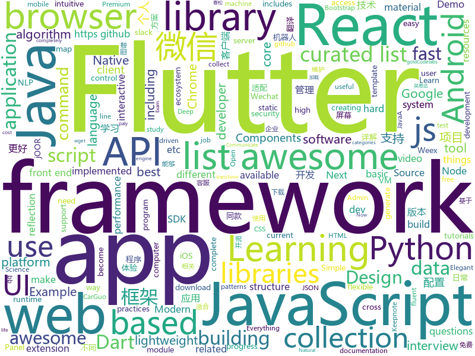

# 2018-09-05
See what the GitHub community is most excited about today.

## python
* [system-design-primer](https://github.com/donnemartin/system-design-primer)(**556 stars today**): Learn how to design large-scale systems. Prep for the system design interview. Includes Anki flashcards.
* [awesome-reactnative-ui](https://github.com/madhavanmalolan/awesome-reactnative-ui)(**250 stars today**): Awesome React Native UI components updated weekly
* [learn-python](https://github.com/trekhleb/learn-python)(**213 stars today**): 📚Playground and cheatsheet for learning Python
* [macOS-Security-and-Privacy-Guide](https://github.com/drduh/macOS-Security-and-Privacy-Guide)(**96 stars today**): A practical guide to securing macOS.
* [httpie](https://github.com/jakubroztocil/httpie)(**91 stars today**): Modern command line HTTP client – user-friendly curl alternative with intuitive UI, JSON support, syntax highlighting, wget-like downloads, extensions, etc. https://httpie.org
* [models](https://github.com/tensorflow/models)(**58 stars today**): Models and examples built with TensorFlow
* [ML-From-Scratch](https://github.com/eriklindernoren/ML-From-Scratch)(**56 stars today**): Machine Learning From Scratch. Bare bones Python implementations of machine learning models and algorithms with a focus on accessibility. Aims to cover everything from data mining to deep learning.
* [lazydata](https://github.com/rstojnic/lazydata)(**64 stars today**): Lazydata: Scalable data dependencies for Python projects
* [awesome-python](https://github.com/vinta/awesome-python)(**60 stars today**): A curated list of awesome Python frameworks, libraries, software and resources
* [masonite](https://github.com/MasoniteFramework/masonite)(**45 stars today**): The Modern And Developer Centric Python Web Framework. Be sure to read the documentation and join the Slack channel questions: http://slack.masoniteproject.com
* [public-apis](https://github.com/toddmotto/public-apis)(**43 stars today**): A collective list of public JSON APIs for use in web development.
* [tldr](https://github.com/tldr-pages/tldr)(**44 stars today**): 📚Simplified and community-driven man pages
* [face_recognition](https://github.com/ageitgey/face_recognition)(**39 stars today**): The world's simplest facial recognition api for Python and the command line
* [keras](https://github.com/keras-team/keras)(**32 stars today**): Deep Learning for humans
* [youtube-dl](https://github.com/rg3/youtube-dl)(**38 stars today**): Command-line program to download videos from YouTube.com and other video sites
* [cheat.sh](https://github.com/chubin/cheat.sh)(**37 stars today**): the only cheat sheet you need
* [Photon](https://github.com/s0md3v/Photon)(**37 stars today**): Incredibly fast crawler designed for reconnaissance.
* [pytheory](https://github.com/kennethreitz/pytheory)(**37 stars today**): Music Theory for Humans.
* [PaperTTY](https://github.com/joukos/PaperTTY)(**34 stars today**): PaperTTY - Python module to render a TTY on e-ink
* [ethereum-etl](https://github.com/medvedev1088/ethereum-etl)(**32 stars today**): Python scripts for ETL (extract, transform and load) jobs for Ethereum blocks, transactions, ERC20 / ERC721 tokens, transfers, receipts, logs, contracts, internal transactions
* [ItChat](https://github.com/littlecodersh/ItChat)(**30 stars today**): A complete and graceful API for Wechat. 微信个人号接口、微信机器人及命令行微信，三十行即可自定义个人号机器人。
* [django](https://github.com/django/django)(**23 stars today**): The Web framework for perfectionists with deadlines.
* [flask](https://github.com/pallets/flask)(**25 stars today**): The Python micro framework for building web applications.
* [awesome-machine-learning](https://github.com/josephmisiti/awesome-machine-learning)(**28 stars today**): A curated list of awesome Machine Learning frameworks, libraries and software.
* [colorization-pytorch](https://github.com/richzhang/colorization-pytorch)(**32 stars today**): PyTorch reimplementation of Interactive Deep Colorization

## java
* [tink](https://github.com/google/tink)(**812 stars today**): Tink is a multi-language, cross-platform library that provides cryptographic APIs that are secure, easy to use correctly, and hard(er) to misuse.
* [WebSiteUseful](https://github.com/loremwalker/WebSiteUseful)(**458 stars today**): 🍅翻墙！科学上网，免费ss帐号分享、ssr订阅源，免费VPN下载，获取及使用教程请看：https://github.com/loremwalker/fq-book
* [JCSprout](https://github.com/crossoverJie/JCSprout)(**144 stars today**): 👨‍🎓Java Core Sprout : basic, concurrent, algorithm
* [Java-Guide](https://github.com/Snailclimb/Java-Guide)(**113 stars today**): A core knowledge that most Java programmers need to master
* [proxyee-down](https://github.com/proxyee-down-org/proxyee-down)(**85 stars today**): http下载工具，基于http代理，支持多连接分块下载
* [java-design-patterns](https://github.com/iluwatar/java-design-patterns)(**79 stars today**): Design patterns implemented in Java
* [AndroidAutoSize](https://github.com/JessYanCoding/AndroidAutoSize)(**63 stars today**): A low-cost Android screen adaptation solution (今日头条屏幕适配方案终极版，一个极低成本的 Android 屏幕适配方案).
* [interviews](https://github.com/kdn251/interviews)(**55 stars today**): Everything you need to know to get the job.
* [jOOR](https://github.com/jOOQ/jOOR)(**51 stars today**): jOOR - Fluent Reflection in Java jOOR is a very simple fluent API that gives access to your Java Class structures in a more intuitive way. The JDK's reflection APIs are hard and verbose to use. Other languages have much simpler constructs to access type meta information at runtime. Let us make Java reflection better.
* [selenium](https://github.com/SeleniumHQ/selenium)(**49 stars today**): A browser automation framework and ecosystem.
* [weixin-java-tools](https://github.com/Wechat-Group/weixin-java-tools)(**40 stars today**): 全能微信Java开发工具包，支持包括微信支付、开放平台、小程序、企业微信/企业号和公众号等的开发
* [elasticsearch](https://github.com/elastic/elasticsearch)(**41 stars today**): Open Source, Distributed, RESTful Search Engine
* [spring-boot](https://github.com/spring-projects/spring-boot)(**33 stars today**): Spring Boot
* [Pic2Ascii](https://github.com/meiniepan/Pic2Ascii)(**42 stars today**): 
* [cosin](https://github.com/chatopera/cosin)(**43 stars today**): 春松客服: 全渠道智能客服
* [tutorials](https://github.com/eugenp/tutorials)(**24 stars today**): The "REST With Spring" Course (price changes permanently next Friday):
* [Java](https://github.com/TheAlgorithms/Java)(**36 stars today**): All Algorithms implemented in Java
* [Sentinel](https://github.com/alibaba/Sentinel)(**31 stars today**): A lightweight flow-control library providing high-available protection and monitoring (高可用防护的流量管理框架)
* [guava](https://github.com/google/guava)(**30 stars today**): Google core libraries for Java
* [AndroidUtilCode](https://github.com/Blankj/AndroidUtilCode)(**31 stars today**): 🔥Android developers should collect the following utils(updating).
* [apollo](https://github.com/ctripcorp/apollo)(**25 stars today**): Apollo（阿波罗）是携程框架部门研发的分布式配置中心，能够集中化管理应用不同环境、不同集群的配置，配置修改后能够实时推送到应用端，并且具备规范的权限、流程治理等特性，适用于微服务配置管理场景。
* [RxJava](https://github.com/ReactiveX/RxJava)(**31 stars today**): RxJava – Reactive Extensions for the JVM – a library for composing asynchronous and event-based programs using observable sequences for the Java VM.
* [incubator-dubbo](https://github.com/apache/incubator-dubbo)(**22 stars today**): Apache Dubbo (incubating) is a high-performance, java based, open source RPC framework.
* [cicada](https://github.com/TogetherOS/cicada)(**26 stars today**): 🚀Fast lightweight HTTP service framework.
* [X2C](https://github.com/iReaderAndroid/X2C)(**27 stars today**): 提升布局加载速度200%

## unknown
* [awesome-tmux](https://github.com/rothgar/awesome-tmux)(**449 stars today**): A list of awesome resources for tmux
* [100-Days-Of-ML-Code](https://github.com/Avik-Jain/100-Days-Of-ML-Code)(**401 stars today**): 100 Days of ML Coding
* [CS-Notes](https://github.com/CyC2018/CS-Notes)(**223 stars today**): 📚Computer Science Learning Notes
* [CS-Interview-Knowledge-Map](https://github.com/InterviewMap/CS-Interview-Knowledge-Map)(**215 stars today**): Build the best interview map. The current content includes JS, network, browser related, performance optimization, security, framework, Git, data structure, algorithm, etc.
* [test-your-sysadmin-skills](https://github.com/trimstray/test-your-sysadmin-skills)(**223 stars today**): A collection of *nix Sysadmin Test Questions and Answers for Interview/Exam (2018 Edition).
* [nodebestpractices](https://github.com/i0natan/nodebestpractices)(**157 stars today**): The largest Node.JS best practices list (August 2018)
* [gitignore](https://github.com/github/gitignore)(**75 stars today**): A collection of useful .gitignore templates
* [awesome](https://github.com/sindresorhus/awesome)(**86 stars today**): 😎Curated list of awesome lists
* [coding-interview-university](https://github.com/jwasham/coding-interview-university)(**67 stars today**): A complete computer science study plan to become a software engineer.
* [Front-End-Performance-Checklist](https://github.com/thedaviddias/Front-End-Performance-Checklist)(**76 stars today**): 🎮The only Front-End Performance Checklist that runs faster than the others
* [iOSDevLinks](https://github.com/giftbott/iOSDevLinks)(**59 stars today**): iOS 개발자를 위한 링크 모음
* [architect-awesome](https://github.com/xingshaocheng/architect-awesome)(**48 stars today**): 后端架构师技术图谱
* [build-your-own-x](https://github.com/danistefanovic/build-your-own-x)(**46 stars today**): 🤓Build your own (insert technology here)
* [awesome-vue](https://github.com/vuejs/awesome-vue)(**41 stars today**): 🎉A curated list of awesome things related to Vue.js
* [free-programming-books](https://github.com/EbookFoundation/free-programming-books)(**44 stars today**): 📚Freely available programming books
* [project-based-learning](https://github.com/tuvtran/project-based-learning)(**35 stars today**): Curated list of project-based tutorials
* [awesome-flutter](https://github.com/Solido/awesome-flutter)(**34 stars today**): An awesome list that curates the best Flutter libraries, tools, tutorials, articles and more.
* [awesome-ansible](https://github.com/jdauphant/awesome-ansible)(**31 stars today**): A collaborative curated list of awesome Ansible resources
* [android-architecture](https://github.com/googlesamples/android-architecture)(**27 stars today**): A collection of samples to discuss and showcase different architectural tools and patterns for Android apps.
* [Front-end-Developer-Interview-Questions](https://github.com/h5bp/Front-end-Developer-Interview-Questions)(**25 stars today**): A list of helpful front-end related questions you can use to interview potential candidates, test yourself or completely ignore.
* [awesome-react](https://github.com/enaqx/awesome-react)(**26 stars today**): A collection of awesome things regarding React ecosystem.
* [kubernetes-the-hard-way](https://github.com/kelseyhightower/kubernetes-the-hard-way)(**23 stars today**): Bootstrap Kubernetes the hard way on Google Cloud Platform. No scripts.
* [new-pac](https://github.com/Alvin9999/new-pac)(**21 stars today**): 
* [gold-miner](https://github.com/xitu/gold-miner)(**23 stars today**): 🥇掘金翻译计划，可能是世界最大最好的英译中技术社区，最懂读者和译者的翻译平台：
* [awesome-cpp](https://github.com/fffaraz/awesome-cpp)(**21 stars today**): A curated list of awesome C++ (or C) frameworks, libraries, resources, and shiny things. Inspired by awesome-... stuff.

## javascript
* [pwa](https://github.com/lukeed/pwa)(**307 stars today**): (WIP) Universal PWA Builder
* [guess-next](https://github.com/mgechev/guess-next)(**242 stars today**): 🔮Demo application showing the integration of Guess.js with Next.js
* [react-proto](https://github.com/React-Proto/react-proto)(**200 stars today**): 🎨React application prototyping tool for developers and designers.
* [f2](https://github.com/antvis/f2)(**179 stars today**): 📱📈An elegant, interactive and flexible charting library for mobile.
* [ant-design-pro](https://github.com/ant-design/ant-design-pro)(**163 stars today**): 👨🏻‍💻👩🏻‍💻 Use Ant Design like a Pro!
* [vue](https://github.com/vuejs/vue)(**138 stars today**): 🖖A progressive, incrementally-adoptable JavaScript framework for building UI on the web.
* [javascript-algorithms](https://github.com/trekhleb/javascript-algorithms)(**125 stars today**): Algorithms and data structures implemented in JavaScript with explanations and links to further readings
* [react](https://github.com/facebook/react)(**107 stars today**): A declarative, efficient, and flexible JavaScript library for building user interfaces.
* [react-webworker](https://github.com/ghengeveld/react-webworker)(**113 stars today**): ⚙️Communicate with a Web Worker from React
* [zeu](https://github.com/shzlw/zeu)(**105 stars today**): A JavaScript library for real-time visualization
* [AgentMaps](https://github.com/noncomputable/AgentMaps)(**83 stars today**): Make social simulations on interactive maps with Javascript!
* [javascript](https://github.com/airbnb/javascript)(**74 stars today**): JavaScript Style Guide
* [v86](https://github.com/copy/v86)(**78 stars today**): x86 virtualization in JavaScript, running in your browser and NodeJS
* [create-react-app](https://github.com/facebook/create-react-app)(**65 stars today**): Create React apps with no build configuration.
* [ailab](https://github.com/Microsoft/ailab)(**70 stars today**): Experience, Learn and Code the latest breakthrough innovations with Microsoft AI
* [linaria](https://github.com/callstack/linaria)(**76 stars today**): Zero-runtime CSS in JS library
* [shimport](https://github.com/Rich-Harris/shimport)(**76 stars today**): Use JavaScript modules in all browsers, including dynamic imports
* [react-native](https://github.com/facebook/react-native)(**68 stars today**): A framework for building native apps with React.
* [puppeteer](https://github.com/GoogleChrome/puppeteer)(**63 stars today**): Headless Chrome Node API
* [umi](https://github.com/umijs/umi)(**63 stars today**): 🌋Pluggable enterprise-level react application framework.
* [taro](https://github.com/NervJS/taro)(**62 stars today**): 多端统一开发框架，支持用 React 的开发方式编写一次代码，生成能运行在微信小程序、H5、React Native 等的应用。
* [axios](https://github.com/axios/axios)(**60 stars today**): Promise based HTTP client for the browser and node.js
* [puppeteer-recorder](https://github.com/checkly/puppeteer-recorder)(**60 stars today**): Puppeteer recorder is a Chrome extension that records your browser interactions and generates a Puppeteer script.
* [d3](https://github.com/d3/d3)(**52 stars today**): Bring data to life with SVG, Canvas and HTML.📊📈🎉
* [next.js](https://github.com/zeit/next.js)(**54 stars today**): Next.js is a lightweight framework for static and server‑rendered applications.

## html
* [frontend](https://github.com/guardian/frontend)(**348 stars today**): Source for theguardian.com
* [reverse-engineering-tutorials](https://github.com/maestron/reverse-engineering-tutorials)(**67 stars today**): Reverse Engineering Tutorials
* [lazyestload.js](https://github.com/Paul-Browne/lazyestload.js)(**66 stars today**): load images only when they are in (and remain in) the viewport
* [klingon](https://github.com/angular-klingon/klingon)(**67 stars today**): Angular Klingon: The UI companion for the @angular/cli
* [OSCPRepo](https://github.com/rewardone/OSCPRepo)(**42 stars today**): A list of commands, scripts, resources, and more that I have gathered and attempted to consolidate for use as OSCP study material. Commands in 'Usefulcommands' Keepnote. Bookmarks and reading material in 'BookmarkList' Keepnote. Reconscan in scripts folder.
* [NLP-progress](https://github.com/sebastianruder/NLP-progress)(**26 stars today**): Repository to track the progress in Natural Language Processing (NLP), including the datasets and the current state-of-the-art for the most common NLP tasks.
* [javascript-tutorial-tr](https://github.com/sahinyanlik/javascript-tutorial-tr)(**25 stars today**): 
* [awesome-mac](https://github.com/jaywcjlove/awesome-mac)(**24 stars today**):  Now we have become very big, Different from the original idea. Collect premium software in various categories.
* [AdminLTE](https://github.com/almasaeed2010/AdminLTE)(**21 stars today**): AdminLTE - Free Premium Admin control Panel Theme Based On Bootstrap 3.x
* [Coursera-ML-AndrewNg-Notes](https://github.com/fengdu78/Coursera-ML-AndrewNg-Notes)(**20 stars today**): 吴恩达老师的机器学习课程个人笔记
* [Spoon-Knife](https://github.com/octocat/Spoon-Knife)(****): This repo is for demonstration purposes only.
* [hacking-tutorials](https://github.com/maestron/hacking-tutorials)(**14 stars today**): hacking-tutorials
* [skill-map](https://github.com/TeamStuQ/skill-map)(**15 stars today**): 程序员技能图谱
* [fastText](https://github.com/facebookresearch/fastText)(**13 stars today**): Library for fast text representation and classification.
* [Publii](https://github.com/GetPublii/Publii)(**14 stars today**): Publii is a desktop-based CMS for Windows and Mac that makes creating static websites fast and hassle-free, even for beginners.
* [rellax](https://github.com/dixonandmoe/rellax)(**13 stars today**): Lightweight, vanilla javascript parallax library
* [material-design-lite](https://github.com/google/material-design-lite)(**13 stars today**): Material Design Components in HTML/CSS/JS
* [portainer](https://github.com/portainer/portainer)(**13 stars today**): Simple management UI for Docker
* [swagger-codegen](https://github.com/swagger-api/swagger-codegen)(**11 stars today**): swagger-codegen contains a template-driven engine to generate documentation, API clients and server stubs in different languages by parsing your OpenAPI / Swagger definition.
* [WebFundamentals](https://github.com/google/WebFundamentals)(**11 stars today**): Best practices for modern web development
* [ng-alain](https://github.com/cipchk/ng-alain)(**11 stars today**): ng-zorro-antd admin panel front-end framework
* [react-app-rewired](https://github.com/timarney/react-app-rewired)(**11 stars today**): Override create-react-app webpack configs without ejecting
* [javascript-tutorial-en](https://github.com/iliakan/javascript-tutorial-en)(**9 stars today**): Modern JavaScript Tutorial
* [primeng](https://github.com/primefaces/primeng)(**7 stars today**): UI Components for Angular
* [GTFOBins.github.io](https://github.com/GTFOBins/GTFOBins.github.io)(**10 stars today**): Curated list of Unix binaries that can be exploited to bypass system security restrictions

## dart
* [flutter](https://github.com/flutter/flutter)(**90 stars today**): Flutter makes it easy and fast to build beautiful mobile apps.
* [flutter_play](https://github.com/naumanahmed19/flutter_play)(**14 stars today**): A google paly store clone (Work in progress)
* [GSYGithubAppFlutter](https://github.com/CarGuo/GSYGithubAppFlutter)(**13 stars today**): 超完整的Flutter项目，功能丰富，适合学习和日常使用。GSYGithubApp系列的优势：我们目前已经拥有Flutter、Weex、ReactNative三个版本。 功能齐全，项目框架内技术涉及面广，完成度高，持续维护，配套文章，适合全面学习，跨框架对比参考。跨平台的开源Github客户端App，更好的体验，更丰富的功能，旨在更好的日常管理和维护个人Github，提供更好更方便的驾车体验～～Σ(￣。￣ﾉ)ﾉ。同款Weex版本 ： https://github.com/CarGuo/GSYGithubAppWeex 、同款React Native版本 ： https://github.com/CarGuo/GSYGithubApp
* [plugins](https://github.com/flutter/plugins)(**12 stars today**): Plugins for Flutter, including FlutterFire, maintained by the Flutter team
* [dio](https://github.com/flutterchina/dio)(**9 stars today**): A powerful Http client for Dart, which supports Interceptors, FormData, Request Cancellation, File Downloading, Timeout etc.
* [GankFlutter](https://github.com/ZQ330093887/GankFlutter)(**10 stars today**): 干货集中营 客户端 flutter版
* [fluwx](https://github.com/OpenFlutter/fluwx)(**9 stars today**): Flutter版微信SDK.WeChat SDK for flutter.
* [PullToRefresh](https://github.com/baoolong/PullToRefresh)(**8 stars today**): Flutter相关的项目QQ:277155832 Email:277155832@qq.com
* [Flutter-UI-Kit](https://github.com/iampawan/Flutter-UI-Kit)(**6 stars today**): Flutter app for collection of UI in a UIKit
* [sdk](https://github.com/dart-lang/sdk)(**6 stars today**): The Dart SDK, including the VM, dart2js, core libraries, and more.
* [samples](https://github.com/flutter/samples)(**5 stars today**): A collection of Flutter examples and demos.
* [chewie](https://github.com/brianegan/chewie)(****): The video player for Flutter with a heart of gold
* [material-components-flutter-codelabs](https://github.com/material-components/material-components-flutter-codelabs)(****): Codelabs for Material Components for Flutter (MDC-Flutter)
* [flutter-candlesticks](https://github.com/trentpiercy/flutter-candlesticks)(****): Elegant OHLC Candlestick and Trade Volume charts for Flutter
* [geolocation](https://github.com/loup-v/geolocation)(****): Flutter geolocation plugin for Android and iOS.
* [timeago.dart](https://github.com/andresaraujo/timeago.dart)(****): A library useful for creating fuzzy timestamps. (e.g. "5 minutes ago")
* [font_awesome_flutter](https://github.com/brianegan/font_awesome_flutter)(****): The Font Awesome Icon pack available as Flutter Icons
* [chromedeveditor](https://github.com/googlearchive/chromedeveditor)(****): Chrome Dev Editor is a developer tool for building apps on the Chrome platform - Chrome Apps and Web Apps, in JavaScript or Dart. (NO LONGER IN ACTIVE DEVELOPMENT)
* [flutter-osc](https://github.com/yubo725/flutter-osc)(****): 基于Google Flutter的开源中国客户端，支持Android和iOS。
* [flutter-examples](https://github.com/nisrulz/flutter-examples)(****): [Examples] Simple basic isolated apps, for budding flutter devs.
* [inKino](https://github.com/roughike/inKino)(****): inKino - A cross platform movie and showtime browser for Finnkino cinemas, made with Flutter.
* [flutter_architecture_samples](https://github.com/brianegan/flutter_architecture_samples)(****): TodoMVC for Flutter
* [hauberk](https://github.com/munificent/hauberk)(****): A web-based roguelike written in Dart.
* [Flutter-learning](https://github.com/AweiLoveAndroid/Flutter-learning)(****): 🔥👍🌟⭐️⭐️⭐️Flutter从配置安装到填坑指南详解，Flutter相关Demo解读，项目实例，Dart语法详解
* [FlutterExampleApps](https://github.com/iampawan/FlutterExampleApps)(****): [Example APPS] Basic Flutter apps, for flutter devs.

## WordCloud

