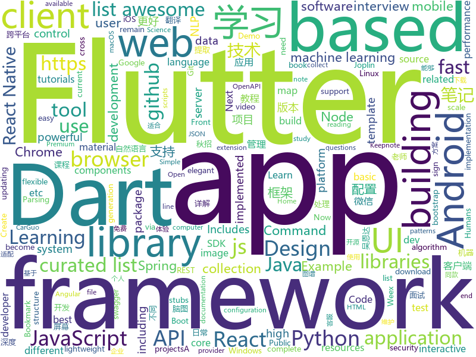

# 2018-09-06
See what the GitHub community is most excited about today.

## python
* [system-design-primer](https://github.com/donnemartin/system-design-primer)(**302 stars today**): Learn how to design large-scale systems. Prep for the system design interview. Includes Anki flashcards.
* [learn-python](https://github.com/trekhleb/learn-python)(**175 stars today**): 📚Playground and cheatsheet for learning Python
* [snowy](https://github.com/prideout/snowy)(**87 stars today**): Small Image Library for Python 3
* [models](https://github.com/tensorflow/models)(**57 stars today**): Models and examples built with TensorFlow
* [lazydata](https://github.com/rstojnic/lazydata)(**76 stars today**): Lazydata: Scalable data dependencies for Python projects
* [awesome-python](https://github.com/vinta/awesome-python)(**63 stars today**): A curated list of awesome Python frameworks, libraries, software and resources
* [awesome-reactnative-ui](https://github.com/madhavanmalolan/awesome-reactnative-ui)(**70 stars today**): Awesome React Native UI components updated weekly
* [Everybody_Dance_Now](https://github.com/llSourcell/Everybody_Dance_Now)(**46 stars today**): This is the code for "Everybody Dance Now!" By Siraj Raval on Youtube
* [PANet](https://github.com/ShuLiu1993/PANet)(**50 stars today**): PANet for Instance Segmentation and Object Detection
* [keras](https://github.com/keras-team/keras)(**42 stars today**): Deep Learning for humans
* [public-apis](https://github.com/toddmotto/public-apis)(**51 stars today**): A collective list of public JSON APIs for use in web development.
* [youtube-dl](https://github.com/rg3/youtube-dl)(**47 stars today**): Command-line program to download videos from YouTube.com and other video sites
* [flask](https://github.com/pallets/flask)(**44 stars today**): The Python micro framework for building web applications.
* [Algorithm_Interview_Notes-Chinese](https://github.com/imhuay/Algorithm_Interview_Notes-Chinese)(**41 stars today**): 2018/2019/校招/春招/秋招/算法/机器学习(Machine Learning)/深度学习(Deep Learning)/自然语言处理(NLP)/C/C++/Python/面试笔记
* [pytheory](https://github.com/kennethreitz/pytheory)(**46 stars today**): Music Theory for Humans.
* [0wned](https://github.com/mschwager/0wned)(**40 stars today**): Code execution via Python package installation.
* [WinPwnage](https://github.com/rootm0s/WinPwnage)(**38 stars today**): 💻Elevate, UAC bypass, privilege escalation, dll hijack techniques
* [mantra](https://github.com/RJT1990/mantra)(**40 stars today**): A high-level, rapid development framework for machine learning projects
* [awesome-machine-learning](https://github.com/josephmisiti/awesome-machine-learning)(**35 stars today**): A curated list of awesome Machine Learning frameworks, libraries and software.
* [home-assistant](https://github.com/home-assistant/home-assistant)(**33 stars today**): 🏡Open source home automation that puts local control and privacy first
* [httpie](https://github.com/jakubroztocil/httpie)(**35 stars today**): Modern command line HTTP client – user-friendly curl alternative with intuitive UI, JSON support, syntax highlighting, wget-like downloads, extensions, etc. https://httpie.org
* [scikit-learn](https://github.com/scikit-learn/scikit-learn)(**28 stars today**): scikit-learn: machine learning in Python
* [reminiscence](https://github.com/kanishka-linux/reminiscence)(**32 stars today**): Self-Hosted Bookmark and Archive Manager
* [kube-hunter](https://github.com/aquasecurity/kube-hunter)(**28 stars today**): Hunt for security weaknesses in Kubernetes clusters
* [django](https://github.com/django/django)(**22 stars today**): The Web framework for perfectionists with deadlines.

## java
* [tink](https://github.com/google/tink)(**738 stars today**): Tink is a multi-language, cross-platform library that provides cryptographic APIs that are secure, easy to use correctly, and hard(er) to misuse.
* [WebSiteUseful](https://github.com/loremwalker/WebSiteUseful)(**267 stars today**): 🍅翻墙！科学上网，免费ss帐号分享、ssr订阅源，免费VPN下载，获取及使用教程请看：https://github.com/loremwalker/fq-book
* [cosin](https://github.com/chatopera/cosin)(**148 stars today**): 春松客服: 全渠道智能客服
* [Dragonfly](https://github.com/alibaba/Dragonfly)(**129 stars today**): Dragonfly is an intelligent P2P based image and file distribution system.
* [JCSprout](https://github.com/crossoverJie/JCSprout)(**96 stars today**): 👨‍🎓Java Core Sprout : basic, concurrent, algorithm
* [Java-Guide](https://github.com/Snailclimb/Java-Guide)(**97 stars today**): A core knowledge that most Java programmers need to master
* [proxyee-down](https://github.com/proxyee-down-org/proxyee-down)(**77 stars today**): http下载工具，基于http代理，支持多连接分块下载
* [interviews](https://github.com/kdn251/interviews)(**69 stars today**): Everything you need to know to get the job.
* [AndroidAutoSize](https://github.com/JessYanCoding/AndroidAutoSize)(**56 stars today**): A low-cost Android screen adaptation solution (今日头条屏幕适配方案终极版，一个极低成本的 Android 屏幕适配方案).
* [java-design-patterns](https://github.com/iluwatar/java-design-patterns)(**49 stars today**): Design patterns implemented in Java
* [spring-boot](https://github.com/spring-projects/spring-boot)(**45 stars today**): Spring Boot
* [elasticsearch](https://github.com/elastic/elasticsearch)(**40 stars today**): Open Source, Distributed, RESTful Search Engine
* [incubator-dubbo](https://github.com/apache/incubator-dubbo)(**37 stars today**): Apache Dubbo (incubating) is a high-performance, java based, open source RPC framework.
* [weixin-java-tools](https://github.com/Wechat-Group/weixin-java-tools)(**39 stars today**): 全能微信Java开发工具包，支持包括微信支付、开放平台、小程序、企业微信/企业号和公众号等的开发
* [apollo](https://github.com/ctripcorp/apollo)(**35 stars today**): Apollo（阿波罗）是携程框架部门研发的分布式配置中心，能够集中化管理应用不同环境、不同集群的配置，配置修改后能够实时推送到应用端，并且具备规范的权限、流程治理等特性，适用于微服务配置管理场景。
* [Sentinel](https://github.com/alibaba/Sentinel)(**36 stars today**): A lightweight flow-control library providing high-available protection and monitoring (高可用防护的流量管理框架)
* [selenium](https://github.com/SeleniumHQ/selenium)(**38 stars today**): A browser automation framework and ecosystem.
* [HanLP](https://github.com/hankcs/HanLP)(**29 stars today**): 自然语言处理 中文分词 词性标注 命名实体识别 依存句法分析 关键词提取 新词发现 短语提取 自动摘要 文本分类 拼音简繁
* [spring-framework](https://github.com/spring-projects/spring-framework)(**23 stars today**): Spring Framework
* [Java](https://github.com/TheAlgorithms/Java)(**24 stars today**): All Algorithms implemented in Java
* [tutorials](https://github.com/eugenp/tutorials)(**15 stars today**): The "REST With Spring" Course (price changes permanently next Friday):
* [spring-boot-examples](https://github.com/ityouknow/spring-boot-examples)(**24 stars today**): about learning Spring Boot via examples. Spring Boot 教程、技术栈示例代码，快速简单上手教程。
* [AndroidUtilCode](https://github.com/Blankj/AndroidUtilCode)(**26 stars today**): 🔥Android developers should collect the following utils(updating).
* [cicada](https://github.com/TogetherOS/cicada)(**25 stars today**): 🚀Fast lightweight HTTP service framework.
* [okhttp](https://github.com/square/okhttp)(**24 stars today**): An HTTP+HTTP/2 client for Android and Java applications.

## unknown
* [awesome-tmux](https://github.com/rothgar/awesome-tmux)(**317 stars today**): A list of awesome resources for tmux
* [100-Days-Of-ML-Code](https://github.com/Avik-Jain/100-Days-Of-ML-Code)(**242 stars today**): 100 Days of ML Coding
* [your-web-app-is-bloated](https://github.com/dominictarr/your-web-app-is-bloated)(**204 stars today**): measuring memory usage of popular webapps
* [CS-Notes](https://github.com/CyC2018/CS-Notes)(**178 stars today**): 📚Computer Science Learning Notes
* [test-your-sysadmin-skills](https://github.com/trimstray/test-your-sysadmin-skills)(**178 stars today**): A collection of *nix Sysadmin Test Questions and Answers for Interview/Exam (2018 Edition).
* [CS-Interview-Knowledge-Map](https://github.com/InterviewMap/CS-Interview-Knowledge-Map)(**127 stars today**): Build the best interview map. The current content includes JS, network, browser related, performance optimization, security, framework, Git, data structure, algorithm, etc.
* [awesome](https://github.com/sindresorhus/awesome)(**91 stars today**): 😎Curated list of awesome lists
* [coding-interview-university](https://github.com/jwasham/coding-interview-university)(**83 stars today**): A complete computer science study plan to become a software engineer.
* [gitignore](https://github.com/github/gitignore)(**51 stars today**): A collection of useful .gitignore templates
* [Front-End-Performance-Checklist](https://github.com/thedaviddias/Front-End-Performance-Checklist)(**68 stars today**): 🎮The only Front-End Performance Checklist that runs faster than the others
* [free-programming-books](https://github.com/EbookFoundation/free-programming-books)(**51 stars today**): 📚Freely available programming books
* [awesome-vue](https://github.com/vuejs/awesome-vue)(**50 stars today**): 🎉A curated list of awesome things related to Vue.js
* [2019_campus_apply](https://github.com/frank-lam/2019_campus_apply)(**44 stars today**): 🚀备战秋招/面试，CS学习笔记。金九银十，你准备好了吗？from zero to hero.
* [nodebestpractices](https://github.com/i0natan/nodebestpractices)(**48 stars today**): The largest Node.JS best practices list (August 2018)
* [architect-awesome](https://github.com/xingshaocheng/architect-awesome)(**37 stars today**): 后端架构师技术图谱
* [project-based-learning](https://github.com/tuvtran/project-based-learning)(**37 stars today**): Curated list of project-based tutorials
* [gold-miner](https://github.com/xitu/gold-miner)(**37 stars today**): 🥇掘金翻译计划，可能是世界最大最好的英译中技术社区，最懂读者和译者的翻译平台：
* [Maicontsh](https://github.com/Hansen1997/Maicontsh)(**34 stars today**): 替换掉 macOS 下一些应用的「丑陋」图标
* [jix](https://github.com/tomas/jix)(**29 stars today**): A better way to Git
* [awesome-flutter](https://github.com/Solido/awesome-flutter)(**26 stars today**): An awesome list that curates the best Flutter libraries, tools, tutorials, articles and more.
* [new-pac](https://github.com/Alvin9999/new-pac)(**25 stars today**): 
* [Front-end-Developer-Interview-Questions](https://github.com/h5bp/Front-end-Developer-Interview-Questions)(**25 stars today**): A list of helpful front-end related questions you can use to interview potential candidates, test yourself or completely ignore.
* [android-architecture](https://github.com/googlesamples/android-architecture)(**23 stars today**): A collection of samples to discuss and showcase different architectural tools and patterns for Android apps.
* [awesome-nodejs](https://github.com/sindresorhus/awesome-nodejs)(**22 stars today**): ⚡️Delightful Node.js packages and resources
* [Operating-Systems-Three-Easy-Pieces-in-japanese](https://github.com/syarochan/Operating-Systems-Three-Easy-Pieces-in-japanese)(**25 stars today**): 

## javascript
* [chinese-dos-games](https://github.com/rwv/chinese-dos-games)(**526 stars today**): 🎮Chinese DOS games in browser.
* [ky](https://github.com/sindresorhus/ky)(**299 stars today**): Tiny and elegant HTTP client based on the browser Fetch API
* [AgentMaps](https://github.com/noncomputable/AgentMaps)(**283 stars today**): Make social simulations on interactive maps with Javascript!
* [ailab](https://github.com/Microsoft/ailab)(**161 stars today**): Experience, Learn and Code the latest breakthrough innovations with Microsoft AI
* [javascript-algorithms](https://github.com/trekhleb/javascript-algorithms)(**155 stars today**): Algorithms and data structures implemented in JavaScript with explanations and links to further readings
* [pwa](https://github.com/lukeed/pwa)(**158 stars today**): (WIP) Universal PWA Builder
* [react-proto](https://github.com/React-Proto/react-proto)(**151 stars today**): 🎨React application prototyping tool for developers and designers.
* [ant-design-pro](https://github.com/ant-design/ant-design-pro)(**139 stars today**): 👨🏻‍💻👩🏻‍💻 Use Ant Design like a Pro!
* [vue](https://github.com/vuejs/vue)(**131 stars today**): 🖖A progressive, incrementally-adoptable JavaScript framework for building UI on the web.
* [guess-next](https://github.com/mgechev/guess-next)(**147 stars today**): 🔮Demo application showing the integration of Guess.js with Next.js
* [f2](https://github.com/antvis/f2)(**129 stars today**): 📱📈An elegant, interactive and flexible charting library for mobile.
* [react-native-starter](https://github.com/flatlogic/react-native-starter)(**120 stars today**): 🚀A powerful react native starter template that bootstraps development of your mobile application
* [react](https://github.com/facebook/react)(**87 stars today**): A declarative, efficient, and flexible JavaScript library for building user interfaces.
* [joplin](https://github.com/laurent22/joplin)(**100 stars today**): Joplin - a note taking and to-do application with synchronization capabilities for Windows, macOS, Linux, Android and iOS. Forum: https://discourse.joplin.cozic.net/
* [create-react-app](https://github.com/facebook/create-react-app)(**79 stars today**): Create React apps with no build configuration.
* [puppeteer](https://github.com/GoogleChrome/puppeteer)(**77 stars today**): Headless Chrome Node API
* [WatermelonDB](https://github.com/Nozbe/WatermelonDB)(**79 stars today**): 🍉Next-gen database for powerful React and React Native apps that scales to 10,000s of records and remains fast⚡️
* [DesktopNaotu](https://github.com/NaoTu/DesktopNaotu)(**72 stars today**): 桌面版脑图（百度脑图离线版，思维导图工具）开箱即用，跨平台支持 Windows/Linux/Mac OS
* [ligar-cobranca](https://github.com/GtOkAi/ligar-cobranca)(**61 stars today**): Ligue automaticamente para empresas de cobrança e deixe uma voz falando "Alô?" sem parar.
* [javascript](https://github.com/airbnb/javascript)(**64 stars today**): JavaScript Style Guide
* [ganlab](https://github.com/poloclub/ganlab)(**60 stars today**): GAN Lab: An Interactive, Visual Experimentation Tool for Generative Adversarial Networks
* [axios](https://github.com/axios/axios)(**59 stars today**): Promise based HTTP client for the browser and node.js
* [react-native](https://github.com/facebook/react-native)(**54 stars today**): A framework for building native apps with React.
* [material-ui](https://github.com/mui-org/material-ui)(**47 stars today**): React components that implement Google's Material Design.
* [mouse-dictionary](https://github.com/wtetsu/mouse-dictionary)(**53 stars today**): Chrome extension dictionary

## html
* [frontend](https://github.com/guardian/frontend)(**113 stars today**): Source for theguardian.com
* [lazyestload.js](https://github.com/Paul-Browne/lazyestload.js)(**50 stars today**): load images only when they are in (and remain in) the viewport
* [OSCPRepo](https://github.com/rewardone/OSCPRepo)(**33 stars today**): A list of commands, scripts, resources, and more that I have gathered and attempted to consolidate for use as OSCP study material. Commands in 'Usefulcommands' Keepnote. Bookmarks and reading material in 'BookmarkList' Keepnote. Reconscan in scripts folder.
* [reverse-engineering-tutorials](https://github.com/maestron/reverse-engineering-tutorials)(**34 stars today**): Reverse Engineering Tutorials
* [Coursera-ML-AndrewNg-Notes](https://github.com/fengdu78/Coursera-ML-AndrewNg-Notes)(**25 stars today**): 吴恩达老师的机器学习课程个人笔记
* [Spoon-Knife](https://github.com/octocat/Spoon-Knife)(****): This repo is for demonstration purposes only.
* [deeplearning_ai_books](https://github.com/fengdu78/deeplearning_ai_books)(**21 stars today**): deeplearning.ai（吴恩达老师的深度学习课程笔记及资源）
* [mailmason](https://github.com/wildbit/mailmason)(**24 stars today**): A complete toolset to streamline building and updating a set of consistent transactional emails.
* [AdminLTE](https://github.com/almasaeed2010/AdminLTE)(**19 stars today**): AdminLTE - Free Premium Admin control Panel Theme Based On Bootstrap 3.x
* [awesome-mac](https://github.com/jaywcjlove/awesome-mac)(**21 stars today**):  Now we have become very big, Different from the original idea. Collect premium software in various categories.
* [fastText](https://github.com/facebookresearch/fastText)(**19 stars today**): Library for fast text representation and classification.
* [NLP-progress](https://github.com/sebastianruder/NLP-progress)(**17 stars today**): Repository to track the progress in Natural Language Processing (NLP), including the datasets and the current state-of-the-art for the most common NLP tasks.
* [klingon](https://github.com/angular-klingon/klingon)(**20 stars today**): Angular Klingon: The UI companion for the @angular/cli
* [skill-map](https://github.com/TeamStuQ/skill-map)(**16 stars today**): 程序员技能图谱
* [swagger-codegen](https://github.com/swagger-api/swagger-codegen)(**10 stars today**): swagger-codegen contains a template-driven engine to generate documentation, API clients and server stubs in different languages by parsing your OpenAPI / Swagger definition.
* [portainer](https://github.com/portainer/portainer)(**12 stars today**): Simple management UI for Docker
* [react-app-rewired](https://github.com/timarney/react-app-rewired)(**12 stars today**): Override create-react-app webpack configs without ejecting
* [material-design-lite](https://github.com/google/material-design-lite)(**10 stars today**): Material Design Components in HTML/CSS/JS
* [patchwork](https://github.com/jlord/patchwork)(****): All the Git-it Workshop completers!
* [ctf-wiki](https://github.com/ctf-wiki/ctf-wiki)(**8 stars today**): CTF Wiki Online
* [requests-html](https://github.com/kennethreitz/requests-html)(**9 stars today**): Pythonic HTML Parsing for Humans™
* [home-assistant.io](https://github.com/home-assistant/home-assistant.io)(**7 stars today**): 📘Home Assistant User documentation
* [web-moderno](https://github.com/cod3rcursos/web-moderno)(**8 stars today**): 
* [openapi-generator](https://github.com/OpenAPITools/openapi-generator)(**7 stars today**): OpenAPI Generator allows generation of API client libraries (SDK generation), server stubs, documentation and configuration automatically given an OpenAPI Spec (v2, v3)
* [cs231n.github.io](https://github.com/cs231n/cs231n.github.io)(**7 stars today**): Public facing notes page

## dart
* [flutter](https://github.com/flutter/flutter)(**92 stars today**): Flutter makes it easy and fast to build beautiful mobile apps.
* [GSYGithubAppFlutter](https://github.com/CarGuo/GSYGithubAppFlutter)(**16 stars today**): 超完整的Flutter项目，功能丰富，适合学习和日常使用。GSYGithubApp系列的优势：我们目前已经拥有Flutter、Weex、ReactNative三个版本。 功能齐全，项目框架内技术涉及面广，完成度高，持续维护，配套文章，适合全面学习，跨框架对比参考。跨平台的开源Github客户端App，更好的体验，更丰富的功能，旨在更好的日常管理和维护个人Github，提供更好更方便的驾车体验～～Σ(￣。￣ﾉ)ﾉ。同款Weex版本 ： https://github.com/CarGuo/GSYGithubAppWeex 、同款React Native版本 ： https://github.com/CarGuo/GSYGithubApp
* [plugins](https://github.com/flutter/plugins)(**13 stars today**): Plugins for Flutter, including FlutterFire, maintained by the Flutter team
* [flutter_architecture_samples](https://github.com/brianegan/flutter_architecture_samples)(**9 stars today**): TodoMVC for Flutter
* [dio](https://github.com/flutterchina/dio)(**8 stars today**): A powerful Http client for Dart, which supports Interceptors, FormData, Request Cancellation, File Downloading, Timeout etc.
* [aqueduct](https://github.com/stablekernel/aqueduct)(**7 stars today**): Dart HTTP server framework for building REST APIs. Includes PostgreSQL ORM and OAuth2 provider.
* [sdk](https://github.com/dart-lang/sdk)(**6 stars today**): The Dart SDK, including the VM, dart2js, core libraries, and more.
* [Flutter-UI-Kit](https://github.com/iampawan/Flutter-UI-Kit)(**6 stars today**): Flutter app for collection of UI in a UIKit
* [GankFlutter](https://github.com/ZQ330093887/GankFlutter)(**5 stars today**): 干货集中营 客户端 flutter版
* [spritewidget](https://github.com/spritewidget/spritewidget)(****): 
* [flutter_slidable](https://github.com/letsar/flutter_slidable)(****): A Flutter implementation of slidable list item with directional slide actions.
* [redux_persist](https://github.com/Cretezy/redux_persist)(****): Persist Redux State
* [test](https://github.com/dart-lang/test)(****): A library for writing unit tests in Dart.
* [dart-sass](https://github.com/sass/dart-sass)(****): A Dart implementation of Sass.
* [flutter_map](https://github.com/apptreesoftware/flutter_map)(****): A Flutter map package based on leaflet
* [amazon-cognito-identity-dart](https://github.com/jonsaw/amazon-cognito-identity-dart)(****): Unofficial Amazon Cognito Identity Provider Dart SDK, to easily add user sign-up and sign-in to your mobile and web apps with AWS.
* [flutter_sms](https://github.com/babariviere/flutter_sms)(****): SMS library for flutter
* [chromedeveditor](https://github.com/googlearchive/chromedeveditor)(****): Chrome Dev Editor is a developer tool for building apps on the Chrome platform - Chrome Apps and Web Apps, in JavaScript or Dart. (NO LONGER IN ACTIVE DEVELOPMENT)
* [flutter-osc](https://github.com/yubo725/flutter-osc)(****): 基于Google Flutter的开源中国客户端，支持Android和iOS。
* [flutter-examples](https://github.com/nisrulz/flutter-examples)(****): [Examples] Simple basic isolated apps, for budding flutter devs.
* [inKino](https://github.com/roughike/inKino)(****): inKino - A cross platform movie and showtime browser for Finnkino cinemas, made with Flutter.
* [hauberk](https://github.com/munificent/hauberk)(****): A web-based roguelike written in Dart.
* [Flutter-learning](https://github.com/AweiLoveAndroid/Flutter-learning)(****): 🔥👍🌟⭐️⭐️⭐️Flutter从配置安装到填坑指南详解，Flutter相关Demo解读，项目实例，Dart语法详解
* [FlutterExampleApps](https://github.com/iampawan/FlutterExampleApps)(****): [Example APPS] Basic Flutter apps, for flutter devs.
* [angular](https://github.com/dart-lang/angular)(****): Fast and productive web framework provided by Dart

## WordCloud

