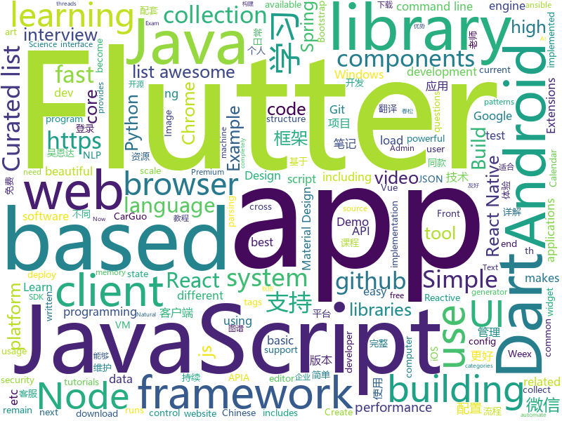

# 2018-09-08
See what the GitHub community is most excited about today.

## python
* [system-design-primer](https://github.com/donnemartin/system-design-primer)(**175 stars today**): Learn how to design large-scale systems. Prep for the system design interview. Includes Anki flashcards.
* [python-nubia](https://github.com/facebookincubator/python-nubia)(**149 stars today**): A command-line and interactive shell framework.
* [noisy](https://github.com/1tayH/noisy)(**146 stars today**): Simple random DNS, HTTP/S internet traffic noise generator
* [texar](https://github.com/asyml/texar)(**97 stars today**): Toolkit for Text Generation and Beyond
* [learn-python](https://github.com/trekhleb/learn-python)(**97 stars today**): 📚Playground and cheatsheet for learning Python
* [proSR](https://github.com/fperazzi/proSR)(**85 stars today**): 
* [manim](https://github.com/3b1b/manim)(**75 stars today**): Animation engine for explanatory math videos
* [models](https://github.com/tensorflow/models)(**52 stars today**): Models and examples built with TensorFlow
* [awesome-reactnative-ui](https://github.com/madhavanmalolan/awesome-reactnative-ui)(**70 stars today**): Awesome React Native UI components updated weekly
* [awesome-python](https://github.com/vinta/awesome-python)(**59 stars today**): A curated list of awesome Python frameworks, libraries, software and resources
* [youtube-dl](https://github.com/rg3/youtube-dl)(**60 stars today**): Command-line program to download videos from YouTube.com and other video sites
* [public-apis](https://github.com/toddmotto/public-apis)(**42 stars today**): A collective list of public JSON APIs for use in web development.
* [coala](https://github.com/coala/coala)(**41 stars today**): coala provides a unified command-line interface for linting and fixing all your code, regardless of the programming languages you use.
* [pytheory](https://github.com/kennethreitz/pytheory)(**43 stars today**): Music Theory for Humans.
* [mantra](https://github.com/RJT1990/mantra)(**42 stars today**): A high-level, rapid development framework for machine learning projects
* [snowy](https://github.com/prideout/snowy)(**38 stars today**): Small Image Library for Python 3
* [keras](https://github.com/keras-team/keras)(**28 stars today**): Deep Learning for humans
* [lmdb-embeddings](https://github.com/ThoughtRiver/lmdb-embeddings)(**37 stars today**): Fast word vectors with little memory usage in Python
* [ansible](https://github.com/ansible/ansible)(**24 stars today**): Ansible is a radically simple IT automation platform that makes your applications and systems easier to deploy. Avoid writing scripts or custom code to deploy and update your applications — automate in a language that approaches plain English, using SSH, with no agents to install on remote systems. https://docs.ansible.com/ansible/
* [cpython](https://github.com/python/cpython)(**26 stars today**): The Python programming language
* [vid2vid](https://github.com/NVIDIA/vid2vid)(**33 stars today**): Pytorch implementation of our method for high-resolution (e.g. 2048x1024) photorealistic video-to-video translation.
* [lazydata](https://github.com/rstojnic/lazydata)(**33 stars today**): Lazydata: Scalable data dependencies for Python projects
* [scikit-learn](https://github.com/scikit-learn/scikit-learn)(**27 stars today**): scikit-learn: machine learning in Python
* [PANet](https://github.com/ShuLiu1993/PANet)(**27 stars today**): PANet for Instance Segmentation and Object Detection
* [httpie](https://github.com/jakubroztocil/httpie)(**29 stars today**): Modern command line HTTP client – user-friendly curl alternative with intuitive UI, JSON support, syntax highlighting, wget-like downloads, extensions, etc. https://httpie.org

## java
* [JCSprout](https://github.com/crossoverJie/JCSprout)(**291 stars today**): 👨‍🎓Java Core Sprout : basic, concurrent, algorithm
* [JavaGuide](https://github.com/Snailclimb/JavaGuide)(**273 stars today**): A core knowledge that most Java programmers need to master
* [tink](https://github.com/google/tink)(**234 stars today**): Tink is a multi-language, cross-platform library that provides cryptographic APIs that are secure, easy to use correctly, and hard(er) to misuse.
* [firebase-android-sdk](https://github.com/firebase/firebase-android-sdk)(**235 stars today**): Firebase Android SDK
* [WebSiteUseful](https://github.com/loremwalker/WebSiteUseful)(**210 stars today**): 🍅翻墙！科学上网，免费ss帐号分享、ssr订阅源，免费VPN下载，获取及使用教程请看：https://github.com/loremwalker/fq-book
* [java-design-patterns](https://github.com/iluwatar/java-design-patterns)(**108 stars today**): Design patterns implemented in Java
* [OXChart](https://github.com/openXu/OXChart)(**85 stars today**): 各种自定义图表库，使用简单，支持扩展
* [tutorials](https://github.com/eugenp/tutorials)(**58 stars today**): The "REST With Spring" Course (price changes permanently next Friday):
* [weixin-java-tools](https://github.com/Wechat-Group/weixin-java-tools)(**66 stars today**): 全能微信Java开发工具包，支持包括微信支付、开放平台、小程序、企业微信/企业号和公众号等的开发
* [proxyee-down](https://github.com/proxyee-down-org/proxyee-down)(**62 stars today**): http下载工具，基于http代理，支持多连接分块下载
* [spring-boot](https://github.com/spring-projects/spring-boot)(**59 stars today**): Spring Boot
* [interviews](https://github.com/kdn251/interviews)(**62 stars today**): Everything you need to know to get the job.
* [Sentinel](https://github.com/alibaba/Sentinel)(**53 stars today**): A lightweight flow-control library providing high-available protection and monitoring (高可用防护的流量管理框架)
* [guava](https://github.com/google/guava)(**56 stars today**): Google core libraries for Java
* [error-prone](https://github.com/google/error-prone)(**57 stars today**): Catch common Java mistakes as compile-time errors
* [elasticsearch](https://github.com/elastic/elasticsearch)(**49 stars today**): Open Source, Distributed, RESTful Search Engine
* [cosin](https://github.com/chatopera/cosin)(**51 stars today**): 春松客服: 全渠道智能客服
* [incubator-dubbo](https://github.com/apache/incubator-dubbo)(**35 stars today**): Apache Dubbo (incubating) is a high-performance, java based, open source RPC framework.
* [all-things-cqrs](https://github.com/ddd-by-examples/all-things-cqrs)(**42 stars today**): Comprehensive guide to a couple of possible ways of doing CQRS with Spring stack
* [okhttp](https://github.com/square/okhttp)(**39 stars today**): An HTTP+HTTP/2 client for Android and Java applications.
* [paascloud-master](https://github.com/paascloud/paascloud-master)(**32 stars today**): spring cloud + vue + oAuth2.0全家桶实战，前后端分离模拟商城，完整的购物流程、后端运营平台，可以实现快速搭建企业级微服务项目。支持微信登录等三方登录。
* [apollo](https://github.com/ctripcorp/apollo)(**31 stars today**): Apollo（阿波罗）是携程框架部门研发的分布式配置中心，能够集中化管理应用不同环境、不同集群的配置，配置修改后能够实时推送到应用端，并且具备规范的权限、流程治理等特性，适用于微服务配置管理场景。
* [AndroidUtilCode](https://github.com/Blankj/AndroidUtilCode)(**28 stars today**): 🔥Android developers should collect the following utils(updating).
* [retrofit](https://github.com/square/retrofit)(**27 stars today**): Type-safe HTTP client for Android and Java by Square, Inc.
* [RxJava](https://github.com/ReactiveX/RxJava)(**27 stars today**): RxJava – Reactive Extensions for the JVM – a library for composing asynchronous and event-based programs using observable sequences for the Java VM.

## unknown
* [100-Days-Of-ML-Code](https://github.com/Avik-Jain/100-Days-Of-ML-Code)(**470 stars today**): 100 Days of ML Coding
* [2019_campus_apply](https://github.com/frank-lam/2019_campus_apply)(**185 stars today**): 🚀备战秋招/面试，CS学习笔记/面经。金九银十，你准备好了吗？from zero to hero.
* [CS-Notes](https://github.com/CyC2018/CS-Notes)(**153 stars today**): 📚Computer Science Learning Notes
* [CS-Interview-Knowledge-Map](https://github.com/InterviewMap/CS-Interview-Knowledge-Map)(**74 stars today**): Build the best interview map. The current content includes JS, network, browser related, performance optimization, security, framework, Git, data structure, algorithm, etc.
* [awesome](https://github.com/sindresorhus/awesome)(**65 stars today**): 😎Curated list of awesome lists
* [gitignore](https://github.com/github/gitignore)(**52 stars today**): A collection of useful .gitignore templates
* [coding-interview-university](https://github.com/jwasham/coding-interview-university)(**55 stars today**): A complete computer science study plan to become a software engineer.
* [awesome-tmux](https://github.com/rothgar/awesome-tmux)(**59 stars today**): A list of awesome resources for tmux
* [test-your-sysadmin-skills](https://github.com/trimstray/test-your-sysadmin-skills)(**52 stars today**): A collection of *nix Sysadmin Test Questions and Answers for Interview/Exam (2018 Edition).
* [free-programming-books](https://github.com/EbookFoundation/free-programming-books)(**42 stars today**): 📚Freely available programming books
* [nodebestpractices](https://github.com/i0natan/nodebestpractices)(**44 stars today**): The largest Node.JS best practices list (August 2018)
* [architect-awesome](https://github.com/xingshaocheng/architect-awesome)(**37 stars today**): 后端架构师技术图谱
* [awesome-vue](https://github.com/vuejs/awesome-vue)(**35 stars today**): 🎉A curated list of awesome things related to Vue.js
* [your-web-app-is-bloated](https://github.com/dominictarr/your-web-app-is-bloated)(**30 stars today**): measuring memory usage of popular webapps
* [Front-End-Performance-Checklist](https://github.com/thedaviddias/Front-End-Performance-Checklist)(**30 stars today**): 🎮The only Front-End Performance Checklist that runs faster than the others
* [Front-end-Developer-Interview-Questions](https://github.com/h5bp/Front-end-Developer-Interview-Questions)(**25 stars today**): A list of helpful front-end related questions you can use to interview potential candidates, test yourself or completely ignore.
* [build-your-own-x](https://github.com/danistefanovic/build-your-own-x)(**27 stars today**): 🤓Build your own (insert technology here)
* [gold-miner](https://github.com/xitu/gold-miner)(**22 stars today**): 🥇掘金翻译计划，可能是世界最大最好的英译中技术社区，最懂读者和译者的翻译平台：
* [project-based-learning](https://github.com/tuvtran/project-based-learning)(**22 stars today**): Curated list of project-based tutorials
* [learning-article](https://github.com/webproblem/learning-article)(**21 stars today**): 学习资源汇总，持续更新
* [awesome-flutter](https://github.com/Solido/awesome-flutter)(**22 stars today**): An awesome list that curates the best Flutter libraries, tools, tutorials, articles and more.
* [awesome-nodejs](https://github.com/sindresorhus/awesome-nodejs)(**19 stars today**): ⚡️Delightful Node.js packages and resources
* [android-architecture](https://github.com/googlesamples/android-architecture)(**17 stars today**): A collection of samples to discuss and showcase different architectural tools and patterns for Android apps.
* [git-recipes](https://github.com/geeeeeeeeek/git-recipes)(**17 stars today**): 🥡 Git recipes in Chinese by Zhongyi Tong. 高质量的Git中文教程.
* [OCNet](https://github.com/PkuRainBow/OCNet)(**18 stars today**): OCNet achieves the state-of-the-art scene parsing performance on both Cityscapes and ADE20K.

## javascript
* [chinese-dos-games](https://github.com/rwv/chinese-dos-games)(**662 stars today**): 🎮Chinese DOS games in browser.
* [ailab](https://github.com/Microsoft/ailab)(**530 stars today**): Experience, Learn and Code the latest breakthrough innovations with Microsoft AI
* [ky](https://github.com/sindresorhus/ky)(**359 stars today**): Tiny and elegant HTTP client based on the browser Fetch API
* [microjob](https://github.com/wilk/microjob)(**341 stars today**): A tiny wrapper for turning Node.js worker threads into easy-to-use routines for heavy CPU loads.
* [sqorn](https://github.com/lusakasa/sqorn)(**290 stars today**): A Javascript library for building SQL queries
* [date-fns](https://github.com/date-fns/date-fns)(**225 stars today**): ⏳Modern JavaScript date utility library⌛️
* [react-native-paper](https://github.com/callstack/react-native-paper)(**191 stars today**): Material Design for React Native (Android & iOS)
* [WatermelonDB](https://github.com/Nozbe/WatermelonDB)(**179 stars today**): 🍉Next-gen database for powerful React and React Native apps that scales to 10,000s of records and remains fast⚡️
* [ligar-cobranca](https://github.com/GtOkAi/ligar-cobranca)(**157 stars today**): Ligue automaticamente para empresas de cobrança e deixe uma voz falando "Alô?" sem parar.
* [windows95](https://github.com/felixrieseberg/windows95)(**153 stars today**): 💩🚀Windows 95 in Electron. Runs on macOS, Linux, and Windows.
* [react](https://github.com/facebook/react)(**131 stars today**): A declarative, efficient, and flexible JavaScript library for building user interfaces.
* [vue](https://github.com/vuejs/vue)(**121 stars today**): 🖖A progressive, incrementally-adoptable JavaScript framework for building UI on the web.
* [puppeteer](https://github.com/GoogleChrome/puppeteer)(**82 stars today**): Headless Chrome Node API
* [wiremock](https://github.com/tomakehurst/wiremock)(**76 stars today**): A tool for mocking HTTP services
* [javascript-algorithms](https://github.com/trekhleb/javascript-algorithms)(**70 stars today**): Algorithms and data structures implemented in JavaScript with explanations and links to further readings
* [v86](https://github.com/copy/v86)(**72 stars today**): x86 virtualization in JavaScript, running in your browser and NodeJS
* [axios](https://github.com/axios/axios)(**70 stars today**): Promise based HTTP client for the browser and node.js
* [gg-editor](https://github.com/gaoli/gg-editor)(**73 stars today**): A visual graph editor based on G6 and React
* [ice](https://github.com/alibaba/ice)(**69 stars today**): 🚀飞冰 - 让前端开发简单而友好，海量可复用物料，配套桌面工具极速构建前端应用，效率提升 100%
* [pwa](https://github.com/lukeed/pwa)(**70 stars today**): (WIP) Universal PWA Builder
* [nodebook](https://github.com/netgusto/nodebook)(**55 stars today**): Nodebook - Minimalist Node REPL with web UI
* [KCon](https://github.com/knownsec/KCon)(**42 stars today**): KCon is a famous Hacker Con powered by Knownsec Team.
* [javascript](https://github.com/airbnb/javascript)(**49 stars today**): JavaScript Style Guide
* [material-ui](https://github.com/mui-org/material-ui)(**44 stars today**): React components that implement Google's Material Design.
* [create-react-app](https://github.com/facebook/create-react-app)(**42 stars today**): Create React apps with no build configuration.

## html
* [GTFOBins.github.io](https://github.com/GTFOBins/GTFOBins.github.io)(**50 stars today**): Curated list of Unix binaries that can be exploited to bypass system security restrictions
* [skill-map](https://github.com/TeamStuQ/skill-map)(**46 stars today**): 程序员技能图谱
* [nginxconfig.io](https://github.com/valentinxxx/nginxconfig.io)(**47 stars today**): 🎛️nginx config generator generator on steroids.
* [lazyestload.js](https://github.com/Paul-Browne/lazyestload.js)(**44 stars today**): load images only when they are in (and remain in) the viewport
* [frontend](https://github.com/guardian/frontend)(**23 stars today**): Source for theguardian.com
* [Spoon-Knife](https://github.com/octocat/Spoon-Knife)(****): This repo is for demonstration purposes only.
* [docbao](https://github.com/hailoc12/docbao)(**19 stars today**): Ứng dụng web giúp phát hiện trends trên các trang báo mạng Việt Nam theo thời gian thực
* [Coursera-ML-AndrewNg-Notes](https://github.com/fengdu78/Coursera-ML-AndrewNg-Notes)(**17 stars today**): 吴恩达老师的机器学习课程个人笔记
* [fastText](https://github.com/facebookresearch/fastText)(**19 stars today**): Library for fast text representation and classification.
* [reverse-engineering-tutorials](https://github.com/maestron/reverse-engineering-tutorials)(**17 stars today**): Reverse Engineering Tutorials
* [AdminLTE](https://github.com/almasaeed2010/AdminLTE)(**13 stars today**): AdminLTE - Free Premium Admin control Panel Theme Based On Bootstrap 3.x
* [awesome-mac](https://github.com/jaywcjlove/awesome-mac)(**14 stars today**):  Now we have become very big, Different from the original idea. Collect premium software in various categories.
* [beautiful-jekyll](https://github.com/daattali/beautiful-jekyll)(****): ✨Build a beautiful and simple website in literally minutes. Demo at http://deanattali.com/beautiful-jekyll
* [gentelella](https://github.com/puikinsh/gentelella)(**12 stars today**): Free Bootstrap 3 Admin Template
* [swagger-codegen](https://github.com/swagger-api/swagger-codegen)(**12 stars today**): swagger-codegen contains a template-driven engine to generate documentation, API clients and server stubs in different languages by parsing your OpenAPI / Swagger definition.
* [material-design-lite](https://github.com/google/material-design-lite)(**11 stars today**): Material Design Components in HTML/CSS/JS
* [mountebank](https://github.com/bbyars/mountebank)(**12 stars today**): Over the wire test doubles
* [NLP-progress](https://github.com/sebastianruder/NLP-progress)(**10 stars today**): Repository to track the progress in Natural Language Processing (NLP), including the datasets and the current state-of-the-art for the most common NLP tasks.
* [Publii](https://github.com/GetPublii/Publii)(**11 stars today**): Publii is a desktop-based CMS for Windows and Mac that makes creating static websites fast and hassle-free, even for beginners.
* [deeplearning_ai_books](https://github.com/fengdu78/deeplearning_ai_books)(**7 stars today**): deeplearning.ai（吴恩达老师的深度学习课程笔记及资源）
* [CatPapers](https://github.com/junyanz/CatPapers)(**10 stars today**): Cool vision, learning, and graphics papers on Cats!
* [portainer](https://github.com/portainer/portainer)(**10 stars today**): Simple management UI for Docker
* [manuals](https://github.com/skr-shop/manuals)(**10 stars today**): Do design No code📖
* [react-app-rewired](https://github.com/timarney/react-app-rewired)(**9 stars today**): Override create-react-app webpack configs without ejecting
* [primeng](https://github.com/primefaces/primeng)(**7 stars today**): UI Components for Angular

## dart
* [flutter](https://github.com/flutter/flutter)(**85 stars today**): Flutter makes it easy and fast to build beautiful mobile apps.
* [FlutterExampleApps](https://github.com/iampawan/FlutterExampleApps)(**20 stars today**): [Example APPS] Basic Flutter apps, for flutter devs.
* [plugins](https://github.com/flutter/plugins)(**15 stars today**): Plugins for Flutter, including FlutterFire, maintained by the Flutter team
* [dio](https://github.com/flutterchina/dio)(**13 stars today**): A powerful Http client for Dart, which supports Interceptors, FormData, Request Cancellation, File Downloading, Timeout etc.
* [pimp_my_button](https://github.com/Norbert515/pimp_my_button)(**12 stars today**): Add particle effects to anything.
* [GSYGithubAppFlutter](https://github.com/CarGuo/GSYGithubAppFlutter)(**9 stars today**): 超完整的Flutter项目，功能丰富，适合学习和日常使用。GSYGithubApp系列的优势：我们目前已经拥有Flutter、Weex、ReactNative三个版本。 功能齐全，项目框架内技术涉及面广，完成度高，持续维护，配套文章，适合全面学习，跨框架对比参考。跨平台的开源Github客户端App，更好的体验，更丰富的功能，旨在更好的日常管理和维护个人Github，提供更好更方便的驾车体验～～Σ(￣。￣ﾉ)ﾉ。同款Weex版本 ： https://github.com/CarGuo/GSYGithubAppWeex 、同款React Native版本 ： https://github.com/CarGuo/GSYGithubApp
* [charts](https://github.com/google/charts)(**7 stars today**): 
* [flutter_architecture_samples](https://github.com/brianegan/flutter_architecture_samples)(**6 stars today**): TodoMVC for Flutter
* [rxdart](https://github.com/ReactiveX/rxdart)(**6 stars today**): The Reactive Extensions for Dart
* [samples](https://github.com/flutter/samples)(**6 stars today**): A collection of Flutter examples and demos.
* [GankFlutter](https://github.com/ZQ330093887/GankFlutter)(**6 stars today**): 干货集中营 客户端 flutter版
* [over_react](https://github.com/Workiva/over_react)(****): A library for building statically-typed React UI components using Dart.
* [dart_to_js_script_rewriter](https://github.com/Workiva/dart_to_js_script_rewriter)(****): A pub transformer that Rewrites Dart script tags to JavaScript script tags, eliminating 404s and speeding up initial loads. Use when building for deployment.
* [built_redux](https://github.com/davidmarne/built_redux)(****): an implementation of redux written in dart that enforces immutability
* [small_calendar](https://github.com/ZedTheLed/small_calendar)(****): Small Calendar Widget for Flutter
* [flutter_calendar](https://github.com/apptreesoftware/flutter_calendar)(****): A calendar widget for Flutter.
* [chromedeveditor](https://github.com/googlearchive/chromedeveditor)(****): Chrome Dev Editor is a developer tool for building apps on the Chrome platform - Chrome Apps and Web Apps, in JavaScript or Dart. (NO LONGER IN ACTIVE DEVELOPMENT)
* [sdk](https://github.com/dart-lang/sdk)(****): The Dart SDK, including the VM, dart2js, core libraries, and more.
* [flutter-osc](https://github.com/yubo725/flutter-osc)(****): 基于Google Flutter的开源中国客户端，支持Android和iOS。
* [flutter-examples](https://github.com/nisrulz/flutter-examples)(****): [Examples] Simple basic isolated apps, for budding flutter devs.
* [inKino](https://github.com/roughike/inKino)(****): inKino - A cross platform movie and showtime browser for Finnkino cinemas, made with Flutter.
* [hauberk](https://github.com/munificent/hauberk)(****): A web-based roguelike written in Dart.
* [Flutter-UI-Kit](https://github.com/iampawan/Flutter-UI-Kit)(****): Flutter app for collection of UI in a UIKit
* [Flutter-learning](https://github.com/AweiLoveAndroid/Flutter-learning)(****): 🔥👍🌟⭐️⭐️⭐️Flutter从配置安装到填坑指南详解，Flutter相关Demo解读，项目实例，Dart语法详解
* [angular](https://github.com/dart-lang/angular)(****): Fast and productive web framework provided by Dart

## WordCloud

