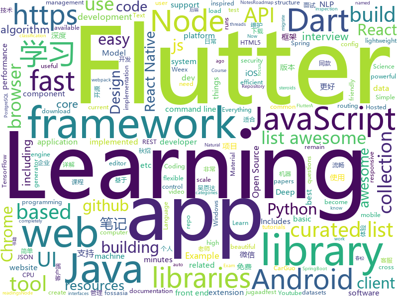

# 2018-09-09
See what the GitHub community is most excited about today.

## python
* [texar](https://github.com/asyml/texar)(**108 stars today**): Toolkit for Text Generation and Beyond
* [TensorFlow-cn](https://github.com/snowkylin/TensorFlow-cn)(**102 stars today**): 简单粗暴TensorFlow | A Concise Handbook of TensorFlow
* [reminiscence](https://github.com/kanishka-linux/reminiscence)(**108 stars today**): Self-Hosted Bookmark and Archive Manager
* [python-nubia](https://github.com/facebookincubator/python-nubia)(**95 stars today**): A command-line and interactive shell framework.
* [imagenet18](https://github.com/diux-dev/imagenet18)(**88 stars today**): Code to reproduce "imagenet in 18 minutes" experiments
* [system-design-primer](https://github.com/donnemartin/system-design-primer)(**67 stars today**): Learn how to design large-scale systems. Prep for the system design interview. Includes Anki flashcards.
* [models](https://github.com/tensorflow/models)(**40 stars today**): Models and examples built with TensorFlow
* [proSR](https://github.com/fperazzi/proSR)(**44 stars today**): 
* [awesome-python](https://github.com/vinta/awesome-python)(**41 stars today**): A curated list of awesome Python frameworks, libraries, software and resources
* [learn-python](https://github.com/trekhleb/learn-python)(**40 stars today**): 📚Playground and cheatsheet for learning Python
* [youtube-dl](https://github.com/rg3/youtube-dl)(**39 stars today**): Command-line program to download videos from YouTube.com and other video sites
* [ML-From-Scratch](https://github.com/eriklindernoren/ML-From-Scratch)(**31 stars today**): Machine Learning From Scratch. Bare bones Python implementations of machine learning models and algorithms with a focus on accessibility. Aims to cover everything from data mining to deep learning.
* [public-apis](https://github.com/toddmotto/public-apis)(**30 stars today**): A collective list of public JSON APIs for use in web development.
* [keras](https://github.com/keras-team/keras)(**26 stars today**): Deep Learning for humans
* [manim](https://github.com/3b1b/manim)(**29 stars today**): Animation engine for explanatory math videos
* [scikit-learn](https://github.com/scikit-learn/scikit-learn)(**22 stars today**): scikit-learn: machine learning in Python
* [pdoc](https://github.com/mitmproxy/pdoc)(**24 stars today**): A simple command line tool and library to auto generate API documentation for Python libraries.
* [Algorithm_Interview_Notes-Chinese](https://github.com/imhuay/Algorithm_Interview_Notes-Chinese)(**19 stars today**): 2018/2019/校招/春招/秋招/算法/机器学习(Machine Learning)/深度学习(Deep Learning)/自然语言处理(NLP)/C/C++/Python/面试笔记
* [awesome-reactnative-ui](https://github.com/madhavanmalolan/awesome-reactnative-ui)(**22 stars today**): Awesome React Native UI components updated weekly
* [shadowsocks](https://github.com/shadowsocks/shadowsocks)(**19 stars today**): 
* [cpython](https://github.com/python/cpython)(**14 stars today**): The Python programming language
* [odoo](https://github.com/odoo/odoo)(**19 stars today**): Odoo. Open Source Apps To Grow Your Business.
* [Mask_RCNN](https://github.com/matterport/Mask_RCNN)(**18 stars today**): Mask R-CNN for object detection and instance segmentation on Keras and TensorFlow
* [home-assistant](https://github.com/home-assistant/home-assistant)(**16 stars today**): 🏡Open source home automation that puts local control and privacy first
* [httpie](https://github.com/jakubroztocil/httpie)(**19 stars today**): Modern command line HTTP client – user-friendly curl alternative with intuitive UI, JSON support, syntax highlighting, wget-like downloads, extensions, etc. https://httpie.org

## java
* [tink](https://github.com/google/tink)(**181 stars today**): Tink is a multi-language, cross-platform library that provides cryptographic APIs that are secure, easy to use correctly, and hard(er) to misuse.
* [WebSiteUseful](https://github.com/loremwalker/WebSiteUseful)(**134 stars today**): 🍅翻墙！科学上网，免费ss帐号分享、ssr订阅源，免费VPN下载，获取及使用教程请看：https://github.com/loremwalker/fq-book
* [JCSprout](https://github.com/crossoverJie/JCSprout)(**62 stars today**): 👨‍🎓Java Core Sprout : basic, concurrent, algorithm
* [JavaGuide](https://github.com/Snailclimb/JavaGuide)(**58 stars today**): A core knowledge that most Java programmers need to master
* [proxyee-down](https://github.com/proxyee-down-org/proxyee-down)(**56 stars today**): http下载工具，基于http代理，支持多连接分块下载
* [NewPipe](https://github.com/TeamNewPipe/NewPipe)(**46 stars today**): A lightweight Youtube frontend for Android.
* [interviews](https://github.com/kdn251/interviews)(**37 stars today**): Everything you need to know to get the job.
* [firebase-android-sdk](https://github.com/firebase/firebase-android-sdk)(**37 stars today**): Firebase Android SDK
* [error-prone](https://github.com/google/error-prone)(**35 stars today**): Catch common Java mistakes as compile-time errors
* [java-design-patterns](https://github.com/iluwatar/java-design-patterns)(**31 stars today**): Design patterns implemented in Java
* [spring-boot](https://github.com/spring-projects/spring-boot)(**29 stars today**): Spring Boot
* [weixin-java-tools](https://github.com/Wechat-Group/weixin-java-tools)(**30 stars today**): 全能微信Java开发工具包，支持包括微信支付、开放平台、小程序、企业微信/企业号和公众号等的开发
* [Java](https://github.com/TheAlgorithms/Java)(**23 stars today**): All Algorithms implemented in Java
* [guava](https://github.com/google/guava)(**21 stars today**): Google core libraries for Java
* [OXChart](https://github.com/openXu/OXChart)(**21 stars today**): 各种自定义图表库，使用简单，支持扩展
* [tutorials](https://github.com/eugenp/tutorials)(**17 stars today**): The "REST With Spring" Course:
* [elasticsearch](https://github.com/elastic/elasticsearch)(**19 stars today**): Open Source, Distributed, RESTful Search Engine
* [incubator-dubbo](https://github.com/apache/incubator-dubbo)(**14 stars today**): Apache Dubbo (incubating) is a high-performance, java based, open source RPC framework.
* [okhttp](https://github.com/square/okhttp)(**18 stars today**): An HTTP+HTTP/2 client for Android and Java applications.
* [Sentinel](https://github.com/alibaba/Sentinel)(**16 stars today**): A lightweight flow-control library providing high-available protection and monitoring (高可用防护的流量管理框架)
* [leetcode](https://github.com/VickyFengYu/leetcode)(**16 stars today**): Just for Learning ! ^-^ !
* [project](https://github.com/VickyFengYu/project)(**15 stars today**): Just for Learning ! ^-^
* [zxing](https://github.com/zxing/zxing)(**13 stars today**): ZXing ("Zebra Crossing") barcode scanning library for Java, Android
* [cosin](https://github.com/chatopera/cosin)(**14 stars today**): 春松客服: 全渠道智能客服
* [spring-framework](https://github.com/spring-projects/spring-framework)(**12 stars today**): Spring Framework

## unknown
* [ToolsOfTheTrade](https://github.com/cjbarber/ToolsOfTheTrade)(**360 stars today**): Tools of The Trade, from Hacker News.
* [100-Days-Of-ML-Code](https://github.com/Avik-Jain/100-Days-Of-ML-Code)(**125 stars today**): 100 Days of ML Coding
* [CS-Notes](https://github.com/CyC2018/CS-Notes)(**74 stars today**): 📚Computer Science Learning Notes
* [developer-roadmap](https://github.com/kamranahmedse/developer-roadmap)(**56 stars today**): Roadmap to becoming a web developer in 2018
* [awesome](https://github.com/sindresorhus/awesome)(**45 stars today**): 😎Curated list of awesome lists
* [coding-interview-university](https://github.com/jwasham/coding-interview-university)(**39 stars today**): A complete computer science study plan to become a software engineer.
* [free-programming-books](https://github.com/EbookFoundation/free-programming-books)(**40 stars today**): 📚Freely available programming books
* [CS-Interview-Knowledge-Map](https://github.com/InterviewMap/CS-Interview-Knowledge-Map)(**37 stars today**): Build the best interview map. The current content includes JS, network, browser related, performance optimization, security, framework, Git, data structure, algorithm, etc.
* [gitignore](https://github.com/github/gitignore)(**30 stars today**): A collection of useful .gitignore templates
* [2019_campus_apply](https://github.com/frank-lam/2019_campus_apply)(**32 stars today**): 🚀备战秋招/面试，CS学习笔记/面经。金九银十，你准备好了吗？from zero to hero.
* [awesome-vue](https://github.com/vuejs/awesome-vue)(**27 stars today**): 🎉A curated list of awesome things related to Vue.js
* [nodebestpractices](https://github.com/i0natan/nodebestpractices)(**25 stars today**): The largest Node.JS best practices list (August 2018)
* [project-based-learning](https://github.com/tuvtran/project-based-learning)(**23 stars today**): Curated list of project-based tutorials
* [build-your-own-x](https://github.com/danistefanovic/build-your-own-x)(**23 stars today**): 🤓Build your own (insert technology here)
* [awesome-tmux](https://github.com/rothgar/awesome-tmux)(**23 stars today**): A list of awesome resources for tmux
* [architect-awesome](https://github.com/xingshaocheng/architect-awesome)(**19 stars today**): 后端架构师技术图谱
* [DeepInterests](https://github.com/Honlan/DeepInterests)(**22 stars today**): 深度有趣
* [test-your-sysadmin-skills](https://github.com/trimstray/test-your-sysadmin-skills)(**21 stars today**): A collection of *nix Sysadmin Test Questions and Answers for Interview/Exam (2018 Edition).
* [awesome-cpp](https://github.com/fffaraz/awesome-cpp)(**20 stars today**): A curated list of awesome C++ (or C) frameworks, libraries, resources, and shiny things. Inspired by awesome-... stuff.
* [Front-end-Developer-Interview-Questions](https://github.com/h5bp/Front-end-Developer-Interview-Questions)(**20 stars today**): A list of helpful front-end related questions you can use to interview potential candidates, test yourself or completely ignore.
* [awesome-ocr-resources](https://github.com/ZumingHuang/awesome-ocr-resources)(**15 stars today**): A collection of resources (including the papers and datasets) of OCR (Optical Character Recognition).
* [awesome-flutter](https://github.com/Solido/awesome-flutter)(**17 stars today**): An awesome list that curates the best Flutter libraries, tools, tutorials, articles and more.
* [awesome-react](https://github.com/enaqx/awesome-react)(**16 stars today**): A collection of awesome things regarding React ecosystem.
* [vicky.github.io](https://github.com/VickyFengYu/vicky.github.io)(**17 stars today**): Just for Learning ! ^-^
* [Front-End-Performance-Checklist](https://github.com/thedaviddias/Front-End-Performance-Checklist)(**16 stars today**): 🎮The only Front-End Performance Checklist that runs faster than the others

## javascript
* [ailab](https://github.com/Microsoft/ailab)(**233 stars today**): Experience, Learn and Code the latest breakthrough innovations with Microsoft AI
* [ky](https://github.com/sindresorhus/ky)(**231 stars today**): Tiny and elegant HTTP client based on the browser Fetch API
* [chinese-dos-games](https://github.com/rwv/chinese-dos-games)(**217 stars today**): 🎮Chinese DOS games in browser.
* [WatermelonDB](https://github.com/Nozbe/WatermelonDB)(**211 stars today**): 🍉Next-gen database for powerful React and React Native apps that scales to 10,000s of records and remains fast⚡️
* [sqorn](https://github.com/lusakasa/sqorn)(**154 stars today**): A Javascript library for building SQL queries
* [date-fns](https://github.com/date-fns/date-fns)(**111 stars today**): ⏳Modern JavaScript date utility library⌛️
* [microjob](https://github.com/wilk/microjob)(**93 stars today**): A tiny wrapper for turning Node.js worker threads into easy-to-use routines for heavy CPU loads.
* [ligar-cobranca](https://github.com/GtOkAi/ligar-cobranca)(**87 stars today**): Ligue automaticamente para empresas de cobrança e deixe uma voz falando "Alô?" sem parar.
* [react-native-paper](https://github.com/callstack/react-native-paper)(**73 stars today**): Material Design for React Native (Android & iOS)
* [react-devtools](https://github.com/facebook/react-devtools)(**65 stars today**): An extension that allows inspection of React component hierarchy in the Chrome and Firefox Developer Tools.
* [windows95](https://github.com/felixrieseberg/windows95)(**63 stars today**): 💩🚀Windows 95 in Electron. Runs on macOS, Linux, and Windows.
* [react](https://github.com/facebook/react)(**47 stars today**): A declarative, efficient, and flexible JavaScript library for building user interfaces.
* [vue](https://github.com/vuejs/vue)(**48 stars today**): 🖖A progressive, incrementally-adoptable JavaScript framework for building UI on the web.
* [wiremock](https://github.com/tomakehurst/wiremock)(**44 stars today**): A tool for mocking HTTP services
* [deoptigate](https://github.com/thlorenz/deoptigate)(**44 stars today**): Investigates v8/Node.js function deoptimizations.
* [javascript-algorithms](https://github.com/trekhleb/javascript-algorithms)(**39 stars today**): Algorithms and data structures implemented in JavaScript with explanations and links to further readings
* [node](https://github.com/nodejs/node)(**38 stars today**): Node.js JavaScript runtime✨🐢🚀✨
* [free-programming-books-zh_CN](https://github.com/justjavac/free-programming-books-zh_CN)(**36 stars today**): 📚免费的计算机编程类中文书籍，欢迎投稿
* [nodebook](https://github.com/netgusto/nodebook)(**38 stars today**): Nodebook - Minimalist Node REPL with web UI
* [codesandbox-client](https://github.com/CompuIves/codesandbox-client)(**37 stars today**): An online code editor tailored for web application development🏖️
* [javascript](https://github.com/airbnb/javascript)(**32 stars today**): JavaScript Style Guide
* [create-react-app](https://github.com/facebook/create-react-app)(**28 stars today**): Create React apps with no build configuration.
* [axios](https://github.com/axios/axios)(**30 stars today**): Promise based HTTP client for the browser and node.js
* [puppeteer](https://github.com/GoogleChrome/puppeteer)(**29 stars today**): Headless Chrome Node API
* [ant-design-pro](https://github.com/ant-design/ant-design-pro)(**25 stars today**): 👨🏻‍💻👩🏻‍💻 Use Ant Design like a Pro!

## html
* [GTFOBins.github.io](https://github.com/GTFOBins/GTFOBins.github.io)(**25 stars today**): Curated list of Unix binaries that can be exploited to bypass system security restrictions
* [nginxconfig.io](https://github.com/valentinxxx/nginxconfig.io)(**17 stars today**): 🎛️nginx config generator generator on steroids.
* [lazyestload.js](https://github.com/Paul-Browne/lazyestload.js)(**16 stars today**): load images only when they are in (and remain in) the viewport
* [Coursera-ML-AndrewNg-Notes](https://github.com/fengdu78/Coursera-ML-AndrewNg-Notes)(**15 stars today**): 吴恩达老师的机器学习课程个人笔记
* [reverse-engineering-tutorials](https://github.com/maestron/reverse-engineering-tutorials)(**13 stars today**): Reverse Engineering Tutorials
* [Spoon-Knife](https://github.com/octocat/Spoon-Knife)(****): This repo is for demonstration purposes only.
* [awesome-cpus](https://github.com/larsbrinkhoff/awesome-cpus)(**13 stars today**): All CPU and MCU documentation in one place
* [deeplearning_ai_books](https://github.com/fengdu78/deeplearning_ai_books)(**9 stars today**): deeplearning.ai（吴恩达老师的深度学习课程笔记及资源）
* [fastText](https://github.com/facebookresearch/fastText)(**10 stars today**): Library for fast text representation and classification.
* [model-analysis](https://github.com/tensorflow/model-analysis)(**9 stars today**): Model analysis tools for TensorFlow
* [react-app-rewired](https://github.com/timarney/react-app-rewired)(**9 stars today**): Override create-react-app webpack configs without ejecting
* [CatPapers](https://github.com/junyanz/CatPapers)(**9 stars today**): Cool vision, learning, and graphics papers on Cats!
* [NLP-progress](https://github.com/sebastianruder/NLP-progress)(**8 stars today**): Repository to track the progress in Natural Language Processing (NLP), including the datasets and the current state-of-the-art for the most common NLP tasks.
* [jugaadfest.com](https://github.com/fossasia/jugaadfest.com)(**7 stars today**): Jugaadfest in India http://jugaadfest.com
* [frontend](https://github.com/guardian/frontend)(**7 stars today**): Source for theguardian.com
* [awesome-mac](https://github.com/jaywcjlove/awesome-mac)(**6 stars today**):  Now we have become very big, Different from the original idea. Collect premium software in various categories.
* [foundation-sites](https://github.com/zurb/foundation-sites)(**7 stars today**): The most advanced responsive front-end framework in the world. Quickly create prototypes and production code for sites that work on any kind of device.
* [2018.fossasia.org](https://github.com/fossasia/2018.fossasia.org)(**7 stars today**): FOSSASIA Summit 2018 https://2018.fossasia.org
* [2018.codeheat.org](https://github.com/fossasia/2018.codeheat.org)(**7 stars today**): Codeheat Coding Contest Website https://2018.codeheat.org
* [kryo](https://github.com/EsotericSoftware/kryo)(**5 stars today**): Java binary serialization and cloning: fast, efficient, automatic
* [hugo-academic](https://github.com/gcushen/hugo-academic)(**5 stars today**): The website designer for Hugo. Build and deploy a beautiful website in minutes🚀
* [ctf-wiki](https://github.com/ctf-wiki/ctf-wiki)(**5 stars today**): CTF Wiki Online
* [portainer](https://github.com/portainer/portainer)(**6 stars today**): Simple management UI for Docker
* [speedtest](https://github.com/adolfintel/speedtest)(**5 stars today**): Self-hosted HTML5 Speedtest. Easy setup, examples, configurable, responsive and mobile friendly. Supports PHP, Node, and more.
* [property-show](https://github.com/eddy-hu/property-show)(**6 stars today**): 🏠House renting management application based on Java SpringBoot back-end and Angular front-end

## dart
* [flutter](https://github.com/flutter/flutter)(**36 stars today**): Flutter makes it easy and fast to build beautiful mobile apps.
* [FlutterExampleApps](https://github.com/iampawan/FlutterExampleApps)(**10 stars today**): [Example APPS] Basic Flutter apps, for flutter devs.
* [plugins](https://github.com/flutter/plugins)(**6 stars today**): Plugins for Flutter, including FlutterFire, maintained by the Flutter team
* [GSYGithubAppFlutter](https://github.com/CarGuo/GSYGithubAppFlutter)(**6 stars today**): 超完整的Flutter项目，功能丰富，适合学习和日常使用。GSYGithubApp系列的优势：我们目前已经拥有Flutter、Weex、ReactNative三个版本。 功能齐全，项目框架内技术涉及面广，完成度高，持续维护，配套文章，适合全面学习，跨框架对比参考。跨平台的开源Github客户端App，更好的体验，更丰富的功能，旨在更好的日常管理和维护个人Github，提供更好更方便的驾车体验～～Σ(￣。￣ﾉ)ﾉ。同款Weex版本 ： https://github.com/CarGuo/GSYGithubAppWeex 、同款React Native版本 ： https://github.com/CarGuo/GSYGithubApp
* [timeago.dart](https://github.com/andresaraujo/timeago.dart)(****): A library useful for creating fuzzy timestamps. (e.g. "5 minutes ago")
* [material-components-flutter-codelabs](https://github.com/material-components/material-components-flutter-codelabs)(****): Codelabs for Material Components for Flutter (MDC-Flutter)
* [chromedeveditor](https://github.com/googlearchive/chromedeveditor)(****): Chrome Dev Editor is a developer tool for building apps on the Chrome platform - Chrome Apps and Web Apps, in JavaScript or Dart. (NO LONGER IN ACTIVE DEVELOPMENT)
* [sdk](https://github.com/dart-lang/sdk)(****): The Dart SDK, including the VM, dart2js, core libraries, and more.
* [flutter-osc](https://github.com/yubo725/flutter-osc)(****): 基于Google Flutter的开源中国客户端，支持Android和iOS。
* [flutter-examples](https://github.com/nisrulz/flutter-examples)(****): [Examples] Simple basic isolated apps, for budding flutter devs.
* [inKino](https://github.com/roughike/inKino)(****): inKino - A cross platform movie and showtime browser for Finnkino cinemas, made with Flutter.
* [flutter_architecture_samples](https://github.com/brianegan/flutter_architecture_samples)(****): TodoMVC for Flutter
* [hauberk](https://github.com/munificent/hauberk)(****): A web-based roguelike written in Dart.
* [Flutter-UI-Kit](https://github.com/iampawan/Flutter-UI-Kit)(****): Flutter app for collection of UI in a UIKit
* [Flutter-learning](https://github.com/AweiLoveAndroid/Flutter-learning)(****): 🔥👍🌟⭐️⭐️⭐️Flutter从配置安装到填坑指南详解，Flutter相关Demo解读，项目实例，Dart语法详解
* [dio](https://github.com/flutterchina/dio)(****): A powerful Http client for Dart, which supports Interceptors, FormData, Request Cancellation, File Downloading, Timeout etc.
* [angular](https://github.com/dart-lang/angular)(****): Fast and productive web framework provided by Dart
* [zhihu-flutter](https://github.com/HackSoul/zhihu-flutter)(****): Flutter 高仿知乎 UI，非常漂亮，也非常流畅，flutter build apk 或 flutter build ios 之后更流畅
* [StageXL](https://github.com/bp74/StageXL)(****): A fast and universal 2D rendering engine for HTML5 and Dart.
* [dart-sass](https://github.com/sass/dart-sass)(****): A Dart implementation of Sass.
* [github-issue-mover](https://github.com/google/github-issue-mover)(****): Making it easy to migrate issues between repos.
* [rxdart](https://github.com/ReactiveX/rxdart)(****): The Reactive Extensions for Dart
* [aqueduct](https://github.com/stablekernel/aqueduct)(****): Dart HTTP server framework for building REST APIs. Includes PostgreSQL ORM and OAuth2 provider.
* [fluro](https://github.com/theyakka/fluro)(****): Fluro is a Flutter routing library that adds flexible routing options like wildcards, named parameters and clear route definitions.
* [start](https://github.com/lvivski/start)(****): Sinatra inspired web development framework for Dart

## WordCloud

