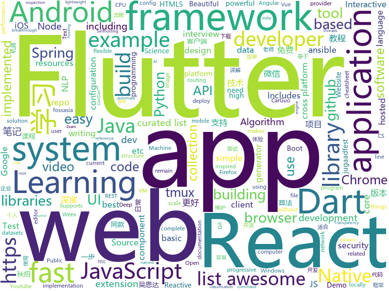

# 2018-09-10
See what the GitHub community is most excited about today.

## python
* [reminiscence](https://github.com/kanishka-linux/reminiscence)(**226 stars today**): Self-Hosted Bookmark and Archive Manager
* [imagenet18](https://github.com/diux-dev/imagenet18)(**114 stars today**): Code to reproduce "imagenet in 18 minutes" experiments
* [system-design-primer](https://github.com/donnemartin/system-design-primer)(**97 stars today**): Learn how to design large-scale systems. Prep for the system design interview. Includes Anki flashcards.
* [TensorFlow-cn](https://github.com/snowkylin/TensorFlow-cn)(**72 stars today**): 简单粗暴TensorFlow | A Concise Handbook of TensorFlow
* [python-nubia](https://github.com/facebookincubator/python-nubia)(**58 stars today**): A command-line and interactive shell framework.
* [vid2vid](https://github.com/NVIDIA/vid2vid)(**56 stars today**): Pytorch implementation of our method for high-resolution (e.g. 2048x1024) photorealistic video-to-video translation.
* [models](https://github.com/tensorflow/models)(**41 stars today**): Models and examples built with TensorFlow
* [youtube-dl](https://github.com/rg3/youtube-dl)(**45 stars today**): Command-line program to download videos from YouTube.com and other video sites
* [ct-exposer](https://github.com/chris408/ct-exposer)(**43 stars today**): An OSINT tool that discovers sub-domains by searching Certificate Transparency logs
* [zero](https://github.com/KonstantinSchubert/zero)(**43 stars today**): Local file system transparently swapping to the cloud
* [awesome-python](https://github.com/vinta/awesome-python)(**37 stars today**): A curated list of awesome Python frameworks, libraries, software and resources
* [texar](https://github.com/asyml/texar)(**39 stars today**): Toolkit for Text Generation and Beyond
* [learn-python](https://github.com/trekhleb/learn-python)(**35 stars today**): 📚Playground and cheatsheet for learning Python
* [colorization-pytorch](https://github.com/richzhang/colorization-pytorch)(**35 stars today**): PyTorch reimplementation of Interactive Deep Colorization
* [keras](https://github.com/keras-team/keras)(**29 stars today**): Deep Learning for humans
* [proSR](https://github.com/fperazzi/proSR)(**32 stars today**): 
* [public-apis](https://github.com/toddmotto/public-apis)(**30 stars today**): A collective list of public JSON APIs for use in web development.
* [black](https://github.com/ambv/black)(**26 stars today**): The uncompromising Python code formatter
* [Algorithm_Interview_Notes-Chinese](https://github.com/imhuay/Algorithm_Interview_Notes-Chinese)(**24 stars today**): 2018/2019/校招/春招/秋招/算法/机器学习(Machine Learning)/深度学习(Deep Learning)/自然语言处理(NLP)/C/C++/Python/面试笔记
* [cpython](https://github.com/python/cpython)(**17 stars today**): The Python programming language
* [LeetCode](https://github.com/apachecn/LeetCode)(**22 stars today**): Leetcode 题解 (跟随思路一步一步撸出代码) 及经典算法实现
* [ansible](https://github.com/ansible/ansible)(**21 stars today**): Ansible is a radically simple IT automation platform that makes your applications and systems easier to deploy. Avoid writing scripts or custom code to deploy and update your applications — automate in a language that approaches plain English, using SSH, with no agents to install on remote systems. https://docs.ansible.com/ansible/
* [LeetCode](https://github.com/kamyu104/LeetCode)(**19 stars today**): 📝Python / C++ 11 Solutions of All LeetCode Questions
* [django](https://github.com/django/django)(**19 stars today**): The Web framework for perfectionists with deadlines.
* [Python](https://github.com/TheAlgorithms/Python)(**17 stars today**): All Algorithms implemented in Python

## java
* [tink](https://github.com/google/tink)(**128 stars today**): Tink is a multi-language, cross-platform library that provides cryptographic APIs that are secure, easy to use correctly, and hard(er) to misuse.
* [WebSiteUseful](https://github.com/loremwalker/WebSiteUseful)(**99 stars today**): 🍅翻墙！科学上网，免费ss帐号分享、ssr订阅源，免费VPN下载，获取及使用教程请看：https://github.com/loremwalker/fq-book
* [JCSprout](https://github.com/crossoverJie/JCSprout)(**68 stars today**): 👨‍🎓Java Core Sprout : basic, concurrent, algorithm
* [JavaGuide](https://github.com/Snailclimb/JavaGuide)(**57 stars today**): A core knowledge that most Java programmers need to master
* [proxyee-down](https://github.com/proxyee-down-org/proxyee-down)(**34 stars today**): http下载工具，基于http代理，支持多连接分块下载
* [Java](https://github.com/TheAlgorithms/Java)(**33 stars today**): All Algorithms implemented in Java
* [java-design-patterns](https://github.com/iluwatar/java-design-patterns)(**29 stars today**): Design patterns implemented in Java
* [interviews](https://github.com/kdn251/interviews)(**29 stars today**): Everything you need to know to get the job.
* [spring-boot](https://github.com/spring-projects/spring-boot)(**27 stars today**): Spring Boot
* [elasticsearch](https://github.com/elastic/elasticsearch)(**24 stars today**): Open Source, Distributed, RESTful Search Engine
* [NewPipe](https://github.com/TeamNewPipe/NewPipe)(**26 stars today**): A lightweight Youtube frontend for Android.
* [tutorials](https://github.com/eugenp/tutorials)(**15 stars today**): The "REST With Spring" Course:
* [dagger](https://github.com/google/dagger)(**21 stars today**): A fast dependency injector for Android and Java.
* [firebase-android-sdk](https://github.com/firebase/firebase-android-sdk)(**21 stars today**): Firebase Android SDK
* [Magisk](https://github.com/topjohnwu/Magisk)(**20 stars today**): A Magic Mask to Alter Android System Systemless-ly
* [AndroidUtilCode](https://github.com/Blankj/AndroidUtilCode)(**18 stars today**): 🔥Android developers should collect the following utils(updating).
* [RxJava](https://github.com/ReactiveX/RxJava)(**18 stars today**): RxJava – Reactive Extensions for the JVM – a library for composing asynchronous and event-based programs using observable sequences for the Java VM.
* [weixin-java-tools](https://github.com/Wechat-Group/weixin-java-tools)(**17 stars today**): 全能微信Java开发工具包，支持包括微信支付、开放平台、小程序、企业微信/企业号和公众号等的开发
* [guava](https://github.com/google/guava)(**16 stars today**): Google core libraries for Java
* [spring-boot-examples](https://github.com/ityouknow/spring-boot-examples)(**16 stars today**): about learning Spring Boot via examples. Spring Boot 教程、技术栈示例代码，快速简单上手教程。
* [incubator-dubbo](https://github.com/apache/incubator-dubbo)(**16 stars today**): Apache Dubbo (incubating) is a high-performance, java based, open source RPC framework.
* [spring-framework](https://github.com/spring-projects/spring-framework)(**13 stars today**): Spring Framework
* [helidon](https://github.com/oracle/helidon)(**16 stars today**): Java libraries for writing microservices
* [VirtualXposed](https://github.com/android-hacker/VirtualXposed)(**13 stars today**): A simple app to use Xposed without root, unlock the bootloader or modify system image, etc.
* [react-native-navigation](https://github.com/wix/react-native-navigation)(**10 stars today**): A complete native navigation solution for React Native

## unknown
* [ToolsOfTheTrade](https://github.com/cjbarber/ToolsOfTheTrade)(**1,643 stars today**): Tools of The Trade, from Hacker News.
* [CS-Notes](https://github.com/CyC2018/CS-Notes)(**251 stars today**): 📚Computer Science Learning Notes
* [100-Days-Of-ML-Code](https://github.com/Avik-Jain/100-Days-Of-ML-Code)(**139 stars today**): 100 Days of ML Coding
* [awesome-tmux](https://github.com/rothgar/awesome-tmux)(**78 stars today**): A list of awesome resources for tmux
* [awesome](https://github.com/sindresorhus/awesome)(**56 stars today**): 😎Curated list of awesome lists
* [CS-Interview-Knowledge-Map](https://github.com/InterviewMap/CS-Interview-Knowledge-Map)(**49 stars today**): Build the best interview map. The current content includes JS, network, browser related, performance optimization, security, framework, Git, data structure, algorithm, etc.
* [stanford-cs-229-machine-learning](https://github.com/afshinea/stanford-cs-229-machine-learning)(**46 stars today**): VIP cheatsheets for Stanford's CS 229 Machine Learning
* [gitignore](https://github.com/github/gitignore)(**34 stars today**): A collection of useful .gitignore templates
* [coding-interview-university](https://github.com/jwasham/coding-interview-university)(**39 stars today**): A complete computer science study plan to become a software engineer.
* [free-programming-books](https://github.com/EbookFoundation/free-programming-books)(**42 stars today**): 📚Freely available programming books
* [developer-roadmap](https://github.com/kamranahmedse/developer-roadmap)(**39 stars today**): Roadmap to becoming a web developer in 2018
* [nodebestpractices](https://github.com/i0natan/nodebestpractices)(**29 stars today**): The largest Node.JS best practices list (September 2018)
* [2019_campus_apply](https://github.com/frank-lam/2019_campus_apply)(**30 stars today**): 🚀备战秋招/面试，CS学习笔记/面经。金九银十，你准备好了吗？from zero to hero.
* [awesome-cpp](https://github.com/fffaraz/awesome-cpp)(**31 stars today**): A curated list of awesome C++ (or C) frameworks, libraries, resources, and shiny things. Inspired by awesome-... stuff.
* [notes](https://github.com/8483/notes)(**30 stars today**): 
* [awesome-vue](https://github.com/vuejs/awesome-vue)(**27 stars today**): 🎉A curated list of awesome things related to Vue.js
* [test-your-sysadmin-skills](https://github.com/trimstray/test-your-sysadmin-skills)(**27 stars today**): A collection of *nix Sysadmin Test Questions and Answers for Interview/Exam (2018 Edition).
* [DeepInterests](https://github.com/Honlan/DeepInterests)(**27 stars today**): 深度有趣
* [SMARTCONTRACT](https://github.com/MatrixAINetwork/SMARTCONTRACT)(**19 stars today**): Both reference and MATRIX original sol files
* [MATRIX_Diary](https://github.com/MatrixAINetwork/MATRIX_Diary)(**21 stars today**): Matrix Trendings as well as Digests
* [build-your-own-x](https://github.com/danistefanovic/build-your-own-x)(**23 stars today**): 🤓Build your own (insert technology here)
* [angular-developer-roadmap](https://github.com/sulco/angular-developer-roadmap)(**22 stars today**): Angular Developer Roadmap
* [awesome-ocr-resources](https://github.com/ZumingHuang/awesome-ocr-resources)(**21 stars today**): A collection of resources (including the papers and datasets) of OCR (Optical Character Recognition).
* [architect-awesome](https://github.com/xingshaocheng/architect-awesome)(**19 stars today**): 后端架构师技术图谱
* [.tmux](https://github.com/gpakosz/.tmux)(**19 stars today**): Oh My Tmux! My pretty + versatile tmux configuration that just works (imho the best tmux configuration)

## javascript
* [WatermelonDB](https://github.com/Nozbe/WatermelonDB)(**262 stars today**): 🍉Next-gen database for powerful React and React Native apps that scales to 10,000s of records and remains fast⚡️
* [ailab](https://github.com/Microsoft/ailab)(**182 stars today**): Experience, Learn and Code the latest breakthrough innovations with Microsoft AI
* [ky](https://github.com/sindresorhus/ky)(**176 stars today**): Tiny and elegant HTTP client based on the browser Fetch API
* [chinese-dos-games](https://github.com/rwv/chinese-dos-games)(**146 stars today**): 🎮Chinese DOS games in browser.
* [sqorn](https://github.com/lusakasa/sqorn)(**100 stars today**): A Javascript library for building SQL queries
* [create-react-app](https://github.com/facebook/create-react-app)(**88 stars today**): Create React apps with no build configuration.
* [microjob](https://github.com/wilk/microjob)(**96 stars today**): A tiny wrapper for turning Node.js worker threads into easy-to-use routines for heavy CPU loads.
* [react](https://github.com/facebook/react)(**79 stars today**): A declarative, efficient, and flexible JavaScript library for building user interfaces.
* [iTeach](https://github.com/eryuechanghe/iTeach)(**69 stars today**): Learning and developing
* [windows95](https://github.com/felixrieseberg/windows95)(**69 stars today**): 💩🚀Windows 95 in Electron. Runs on macOS, Linux, and Windows.
* [date-fns](https://github.com/date-fns/date-fns)(**70 stars today**): ⏳Modern JavaScript date utility library⌛️
* [vue](https://github.com/vuejs/vue)(**56 stars today**): 🖖A progressive, incrementally-adoptable JavaScript framework for building UI on the web.
* [javascript-algorithms](https://github.com/trekhleb/javascript-algorithms)(**51 stars today**): Algorithms and data structures implemented in JavaScript with explanations and links to further readings
* [awesome-selfhosted](https://github.com/Kickball/awesome-selfhosted)(**49 stars today**): This is a list of Free Software network services and web applications which can be hosted locally. Selfhosting is the process of locally hosting and managing applications instead of renting from SaaS providers.
* [react-proto](https://github.com/React-Proto/react-proto)(**48 stars today**): 🎨React application prototyping tool for developers and designers.
* [codesandbox-client](https://github.com/CompuIves/codesandbox-client)(**47 stars today**): An online code editor tailored for web application development🏖️
* [free-programming-books-zh_CN](https://github.com/justjavac/free-programming-books-zh_CN)(**42 stars today**): 📚免费的计算机编程类中文书籍，欢迎投稿
* [ligar-cobranca](https://github.com/GtOkAi/ligar-cobranca)(**39 stars today**): Ligue automaticamente para empresas de cobrança e deixe uma voz falando "Alô?" sem parar.
* [react-modal-experiment](https://github.com/stereobooster/react-modal-experiment)(**40 stars today**): 
* [gatsby](https://github.com/gatsbyjs/gatsby)(**35 stars today**): ⚛️📄🚀Blazing fast site generator for React
* [react-devtools](https://github.com/facebook/react-devtools)(**36 stars today**): An extension that allows inspection of React component hierarchy in the Chrome and Firefox Developer Tools.
* [material-ui](https://github.com/mui-org/material-ui)(**33 stars today**): React components that implement Google's Material Design.
* [axios](https://github.com/axios/axios)(**35 stars today**): Promise based HTTP client for the browser and node.js
* [markdown-here](https://github.com/adam-p/markdown-here)(**31 stars today**): Google Chrome, Firefox, and Thunderbird extension that lets you write email in Markdown and render it before sending.
* [storybook](https://github.com/storybooks/storybook)(**33 stars today**): Interactive UI component dev & test: React, React Native, Vue, Angular

## html
* [Coursera-ML-AndrewNg-Notes](https://github.com/fengdu78/Coursera-ML-AndrewNg-Notes)(**16 stars today**): 吴恩达老师的机器学习课程个人笔记
* [werdlists](https://github.com/decal/werdlists)(**16 stars today**): ⌨️Wordlists, Dictionaries and Other Data Sets for Writing Software Security Test Cases
* [GTFOBins.github.io](https://github.com/GTFOBins/GTFOBins.github.io)(**15 stars today**): Curated list of Unix binaries that can be exploited to bypass system security restrictions
* [lazyestload.js](https://github.com/Paul-Browne/lazyestload.js)(**14 stars today**): load images only when they are in (and remain in) the viewport
* [Spoon-Knife](https://github.com/octocat/Spoon-Knife)(****): This repo is for demonstration purposes only.
* [awesome-cpus](https://github.com/larsbrinkhoff/awesome-cpus)(**12 stars today**): All CPU and MCU documentation in one place
* [deeplearning_ai_books](https://github.com/fengdu78/deeplearning_ai_books)(**11 stars today**): deeplearning.ai（吴恩达老师的深度学习课程笔记及资源）
* [2018.fossasia.org](https://github.com/fossasia/2018.fossasia.org)(**10 stars today**): FOSSASIA Summit 2018 https://2018.fossasia.org
* [portainer](https://github.com/portainer/portainer)(**10 stars today**): Simple management UI for Docker
* [fastText](https://github.com/facebookresearch/fastText)(**9 stars today**): Library for fast text representation and classification.
* [jugaadfest.com](https://github.com/fossasia/jugaadfest.com)(**8 stars today**): Jugaadfest in India http://jugaadfest.com
* [2018.codeheat.org](https://github.com/fossasia/2018.codeheat.org)(**8 stars today**): Codeheat Coding Contest Website https://2018.codeheat.org
* [NLP-progress](https://github.com/sebastianruder/NLP-progress)(**7 stars today**): Repository to track the progress in Natural Language Processing (NLP), including the datasets and the current state-of-the-art for the most common NLP tasks.
* [patchwork](https://github.com/jlord/patchwork)(****): All the Git-it Workshop completers!
* [nginxconfig.io](https://github.com/valentinxxx/nginxconfig.io)(**7 stars today**): 🎛️nginx config generator generator on steroids.
* [cs231n.github.io](https://github.com/cs231n/cs231n.github.io)(**5 stars today**): Public facing notes page
* [Winds](https://github.com/GetStream/Winds)(**6 stars today**): A Beautiful Open Source RSS & Podcast App Powered by Getstream.io
* [model-analysis](https://github.com/tensorflow/model-analysis)(**6 stars today**): Model analysis tools for TensorFlow
* [react-app-rewired](https://github.com/timarney/react-app-rewired)(**6 stars today**): Override create-react-app webpack configs without ejecting
* [speedtest](https://github.com/adolfintel/speedtest)(**5 stars today**): Self-hosted HTML5 Speedtest. Easy setup, examples, configurable, responsive and mobile friendly. Supports PHP, Node, and more.
* [capacitor](https://github.com/ionic-team/capacitor)(**5 stars today**): Build cross-platform Native Progressive Web Apps for iOS, Android, and the web⚡️
* [game-of-life](https://github.com/wakaleo/game-of-life)(****): Demo application for the 'Jenkins: The Definitive Guide' book
* [startbootstrap-clean-blog-jekyll](https://github.com/BlackrockDigital/startbootstrap-clean-blog-jekyll)(****): A Jekyll version of the Clean Blog theme by Start Bootstrap
* [home-assistant.io](https://github.com/home-assistant/home-assistant.io)(****): 📘Home Assistant User documentation
* [website](https://github.com/kubernetes/website)(****): Kubernetes website and documentation repo:

## dart
* [flutter](https://github.com/flutter/flutter)(**40 stars today**): Flutter makes it easy and fast to build beautiful mobile apps.
* [flutter_architecture_samples](https://github.com/brianegan/flutter_architecture_samples)(**7 stars today**): TodoMVC for Flutter
* [plugins](https://github.com/flutter/plugins)(**5 stars today**): Plugins for Flutter, including FlutterFire, maintained by the Flutter team
* [chromedeveditor](https://github.com/googlearchive/chromedeveditor)(****): Chrome Dev Editor is a developer tool for building apps on the Chrome platform - Chrome Apps and Web Apps, in JavaScript or Dart. (NO LONGER IN ACTIVE DEVELOPMENT)
* [sdk](https://github.com/dart-lang/sdk)(****): The Dart SDK, including the VM, dart2js, core libraries, and more.
* [flutter-osc](https://github.com/yubo725/flutter-osc)(****): 基于Google Flutter的开源中国客户端，支持Android和iOS。
* [flutter-examples](https://github.com/nisrulz/flutter-examples)(****): [Examples] Simple basic isolated apps, for budding flutter devs.
* [inKino](https://github.com/roughike/inKino)(****): inKino - A cross platform movie and showtime browser for Finnkino cinemas, made with Flutter.
* [Flutter-UI-Kit](https://github.com/iampawan/Flutter-UI-Kit)(****): Flutter app for collection of UI in a UIKit
* [hauberk](https://github.com/munificent/hauberk)(****): A web-based roguelike written in Dart.
* [FlutterExampleApps](https://github.com/iampawan/FlutterExampleApps)(****): [Example APPS] Basic Flutter apps, for flutter devs.
* [Flutter-learning](https://github.com/AweiLoveAndroid/Flutter-learning)(****): 🔥👍🌟⭐️⭐️⭐️Flutter从配置安装到填坑指南详解，Flutter相关Demo解读，项目实例，Dart语法详解
* [dio](https://github.com/flutterchina/dio)(****): A powerful Http client for Dart, which supports Interceptors, FormData, Request Cancellation, File Downloading, Timeout etc.
* [angular](https://github.com/dart-lang/angular)(****): Fast and productive web framework provided by Dart
* [GSYGithubAppFlutter](https://github.com/CarGuo/GSYGithubAppFlutter)(****): 超完整的Flutter项目，功能丰富，适合学习和日常使用。GSYGithubApp系列的优势：我们目前已经拥有Flutter、Weex、ReactNative三个版本。 功能齐全，项目框架内技术涉及面广，完成度高，持续维护，配套文章，适合全面学习，跨框架对比参考。跨平台的开源Github客户端App，更好的体验，更丰富的功能，旨在更好的日常管理和维护个人Github，提供更好更方便的驾车体验～～Σ(￣。￣ﾉ)ﾉ。同款Weex版本 ： https://github.com/CarGuo/GSYGithubAppWeex 、同款React Native版本 ： https://github.com/CarGuo/GSYGithubApp
* [zhihu-flutter](https://github.com/HackSoul/zhihu-flutter)(****): Flutter 高仿知乎 UI，非常漂亮，也非常流畅，flutter build apk 或 flutter build ios 之后更流畅
* [StageXL](https://github.com/bp74/StageXL)(****): A fast and universal 2D rendering engine for HTML5 and Dart.
* [dart-sass](https://github.com/sass/dart-sass)(****): A Dart implementation of Sass.
* [github-issue-mover](https://github.com/google/github-issue-mover)(****): Making it easy to migrate issues between repos.
* [rxdart](https://github.com/ReactiveX/rxdart)(****): The Reactive Extensions for Dart
* [aqueduct](https://github.com/stablekernel/aqueduct)(****): Dart HTTP server framework for building REST APIs. Includes PostgreSQL ORM and OAuth2 provider.
* [fluro](https://github.com/theyakka/fluro)(****): Fluro is a Flutter routing library that adds flexible routing options like wildcards, named parameters and clear route definitions.
* [start](https://github.com/lvivski/start)(****): Sinatra inspired web development framework for Dart
* [dart-samples](https://github.com/dart-lang/dart-samples)(****): Various samples and examples in Dart
* [sqflite](https://github.com/tekartik/sqflite)(****): SQLite flutter plugin

## WordCloud

