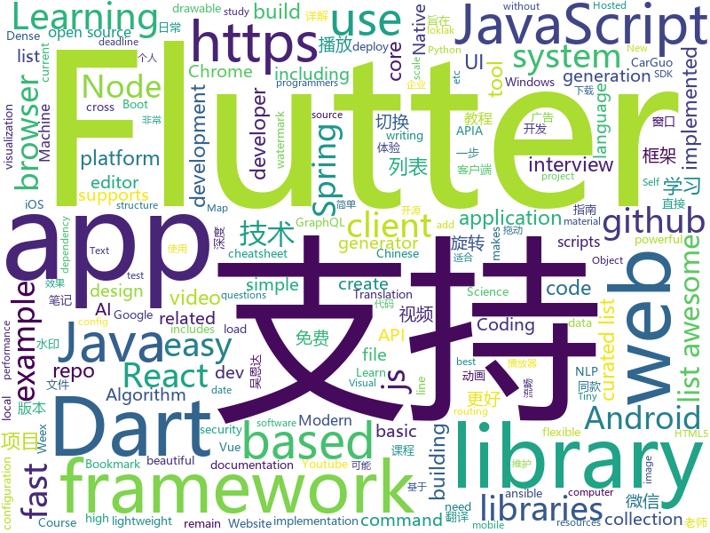

# 2018-09-11
See what the GitHub community is most excited about today.

## python
* [zero](https://github.com/KonstantinSchubert/zero)(**440 stars today**): Local file system transparently swapping to the cloud
* [aspider](https://github.com/howie6879/aspider)(**337 stars today**): aspider - A web scraping micro-framework based on asyncio.
* [jupytext](https://github.com/mwouts/jupytext)(**331 stars today**): Jupyter notebooks as Markdown documents, Julia, Python or R scripts
* [system-design-primer](https://github.com/donnemartin/system-design-primer)(**156 stars today**): Learn how to design large-scale systems. Prep for the system design interview. Includes Anki flashcards.
* [reminiscence](https://github.com/kanishka-linux/reminiscence)(**132 stars today**): Self-Hosted Bookmark and Archive Manager
* [TensorFlow-cn](https://github.com/snowkylin/TensorFlow-cn)(**106 stars today**): 简单粗暴TensorFlow | A Concise Handbook of TensorFlow
* [imagenet18](https://github.com/diux-dev/imagenet18)(**99 stars today**): Code to reproduce "imagenet in 18 minutes" experiments
* [vid2vid](https://github.com/NVIDIA/vid2vid)(**93 stars today**): Pytorch implementation of our method for high-resolution (e.g. 2048x1024) photorealistic video-to-video translation.
* [100-Days-of-ML-Code-Chinese-Version](https://github.com/Avik-Jain/100-Days-of-ML-Code-Chinese-Version)(**72 stars today**): Chinese Translation for Machine Learning Infographics
* [models](https://github.com/tensorflow/models)(**48 stars today**): Models and examples built with TensorFlow
* [awesome-python](https://github.com/vinta/awesome-python)(**60 stars today**): A curated list of awesome Python frameworks, libraries, software and resources
* [public-apis](https://github.com/toddmotto/public-apis)(**56 stars today**): A collective list of public JSON APIs for use in web development.
* [learn-python](https://github.com/trekhleb/learn-python)(**49 stars today**): 📚Playground and cheatsheet for learning Python
* [keras](https://github.com/keras-team/keras)(**40 stars today**): Deep Learning for humans
* [youtube-dl](https://github.com/rg3/youtube-dl)(**44 stars today**): Command-line program to download videos from YouTube.com and other video sites
* [proSR](https://github.com/fperazzi/proSR)(**42 stars today**): 
* [awesome-leetcode](https://github.com/apachecn/awesome-leetcode)(**43 stars today**): Leetcode 题解 (跟随思路一步一步撸出代码) 及经典算法实现
* [python-nubia](https://github.com/facebookincubator/python-nubia)(**42 stars today**): A command-line and interactive shell framework.
* [django](https://github.com/django/django)(**30 stars today**): The Web framework for perfectionists with deadlines.
* [Python](https://github.com/TheAlgorithms/Python)(**35 stars today**): All Algorithms implemented in Python
* [texar](https://github.com/asyml/texar)(**37 stars today**): Toolkit for Text Generation and Beyond
* [scikit-learn](https://github.com/scikit-learn/scikit-learn)(**31 stars today**): scikit-learn: machine learning in Python
* [ansible](https://github.com/ansible/ansible)(**23 stars today**): Ansible is a radically simple IT automation platform that makes your applications and systems easier to deploy. Avoid writing scripts or custom code to deploy and update your applications — automate in a language that approaches plain English, using SSH, with no agents to install on remote systems. https://docs.ansible.com/ansible/
* [home-assistant](https://github.com/home-assistant/home-assistant)(**32 stars today**): 🏡Open source home automation that puts local control and privacy first
* [pytorch-dense-correspondence](https://github.com/RobotLocomotion/pytorch-dense-correspondence)(**32 stars today**): Code for "Dense Object Nets: Learning Dense Visual Object Descriptors By and For Robotic Manipulation"

## java
* [WebSiteUseful](https://github.com/loremwalker/WebSiteUseful)(**255 stars today**): 🍅翻墙！科学上网，免费ss帐号分享、ssr订阅源，免费VPN下载，获取及使用教程请看：https://github.com/loremwalker/fq-book
* [tink](https://github.com/google/tink)(**204 stars today**): Tink is a multi-language, cross-platform library that provides cryptographic APIs that are secure, easy to use correctly, and hard(er) to misuse.
* [AndroidWM](https://github.com/huangyz0918/AndroidWM)(**115 stars today**): A lightweight android image watermark library that supports invisible digital watermarks.🌁(轻量级安卓水印框架，支持隐形数字水印)
* [JCSprout](https://github.com/crossoverJie/JCSprout)(**99 stars today**): 👨‍🎓Java Core Sprout : basic, concurrent, algorithm
* [JavaGuide](https://github.com/Snailclimb/JavaGuide)(**81 stars today**): A core knowledge that most Java programmers need to master
* [java-design-patterns](https://github.com/iluwatar/java-design-patterns)(**64 stars today**): Design patterns implemented in Java
* [helidon](https://github.com/oracle/helidon)(**58 stars today**): Java libraries for writing microservices
* [proxyee-down](https://github.com/proxyee-down-org/proxyee-down)(**53 stars today**): http下载工具，基于http代理，支持多连接分块下载
* [spring-boot](https://github.com/spring-projects/spring-boot)(**46 stars today**): Spring Boot
* [tutorials](https://github.com/eugenp/tutorials)(**35 stars today**): The "REST With Spring" Course:
* [weixin-java-tools](https://github.com/Wechat-Group/weixin-java-tools)(**48 stars today**): 全能微信Java开发工具包，支持包括微信支付、开放平台、小程序、企业微信/企业号和公众号等的开发
* [PowerMenu](https://github.com/skydoves/PowerMenu)(**51 stars today**): 📛A library that let you implement popup menu so easily.
* [firebase-android-sdk](https://github.com/firebase/firebase-android-sdk)(**49 stars today**): Firebase Android SDK
* [elasticsearch](https://github.com/elastic/elasticsearch)(**39 stars today**): Open Source, Distributed, RESTful Search Engine
* [Java](https://github.com/TheAlgorithms/Java)(**39 stars today**): All Algorithms implemented in Java
* [noDrawable](https://github.com/whataa/noDrawable)(**46 stars today**): 一个旨在减少99%的drawable.xml文件的库，可直接在布局文件中对任意View声明drawable属性。
* [interviews](https://github.com/kdn251/interviews)(**39 stars today**): Everything you need to know to get the job.
* [dagger](https://github.com/google/dagger)(**40 stars today**): A fast dependency injector for Android and Java.
* [vjtools](https://github.com/vipshop/vjtools)(**37 stars today**): The vip.com's java coding standard, libraries and tools
* [guava](https://github.com/google/guava)(**31 stars today**): Google core libraries for Java
* [NewPipe](https://github.com/TeamNewPipe/NewPipe)(**34 stars today**): A lightweight Youtube frontend for Android.
* [spring-boot-examples](https://github.com/ityouknow/spring-boot-examples)(**24 stars today**): about learning Spring Boot via examples. Spring Boot 教程、技术栈示例代码，快速简单上手教程。
* [spring-framework](https://github.com/spring-projects/spring-framework)(**23 stars today**): Spring Framework
* [GSYVideoPlayer](https://github.com/CarGuo/GSYVideoPlayer)(**29 stars today**): 视频播放器（IJKplayer、ExoPlayer、MediaPlayer），HTTPS支持，支持弹幕，支持滤镜、水印、gif截图，片头广告、中间广告，多个同时播放，支持基本的拖动，声音、亮度调节，支持边播边缓存，支持视频本身自带rotation的旋转（90,270之类），重力旋转与手动旋转的同步支持，支持列表播放 ，直接添加控件为封面，列表全屏动画，视频加载速度，列表小窗口支持拖动，动画效果，调整比例，多分辨率切换，支持切换播放器，进度条小窗口预览，列表切换详情页面无缝播放，其他一些小动画效果，rtsp、concat、mpeg。项目解析：
* [incubator-dubbo](https://github.com/apache/incubator-dubbo)(**22 stars today**): Apache Dubbo (incubating) is a high-performance, java based, open source RPC framework.

## unknown
* [ToolsOfTheTrade](https://github.com/cjbarber/ToolsOfTheTrade)(**960 stars today**): Tools of The Trade, from Hacker News.
* [English-level-up-tips-for-Chinese](https://github.com/byoungd/English-level-up-tips-for-Chinese)(**663 stars today**): 可能是让你受益匪浅的英语进阶指南
* [CS-Notes](https://github.com/CyC2018/CS-Notes)(**257 stars today**): 📚Computer Science Learning Notes
* [100-Days-Of-ML-Code](https://github.com/Avik-Jain/100-Days-Of-ML-Code)(**253 stars today**): 100 Days of ML Coding
* [DeepInterests](https://github.com/Honlan/DeepInterests)(**143 stars today**): 深度有趣
* [awesome](https://github.com/sindresorhus/awesome)(**81 stars today**): 😎Curated list of awesome lists
* [developer-roadmap](https://github.com/kamranahmedse/developer-roadmap)(**73 stars today**): Roadmap to becoming a web developer in 2018
* [gitignore](https://github.com/github/gitignore)(**49 stars today**): A collection of useful .gitignore templates
* [pwc](https://github.com/zziz/pwc)(**66 stars today**): Papers with code. Sorted by stars. Updated weekly.
* [free-programming-books](https://github.com/EbookFoundation/free-programming-books)(**56 stars today**): 📚Freely available programming books
* [awesome-tmux](https://github.com/rothgar/awesome-tmux)(**62 stars today**): A list of awesome resources for tmux
* [CS-Interview-Knowledge-Map](https://github.com/InterviewMap/CS-Interview-Knowledge-Map)(**56 stars today**): Build the best interview map. The current content includes JS, network, browser related, performance optimization, security, framework, Git, data structure, algorithm, etc.
* [coding-interview-university](https://github.com/jwasham/coding-interview-university)(**51 stars today**): A complete computer science study plan to become a software engineer.
* [awesome-vue](https://github.com/vuejs/awesome-vue)(**44 stars today**): 🎉A curated list of awesome things related to Vue.js
* [notes](https://github.com/8483/notes)(**42 stars today**): 
* [stanford-cs-229-machine-learning](https://github.com/afshinea/stanford-cs-229-machine-learning)(**36 stars today**): VIP cheatsheets for Stanford's CS 229 Machine Learning
* [test-your-sysadmin-skills](https://github.com/trimstray/test-your-sysadmin-skills)(**37 stars today**): A collection of *nix Sysadmin Test Questions and Answers for Interview/Exam (2018 Edition).
* [architect-awesome](https://github.com/xingshaocheng/architect-awesome)(**34 stars today**): 后端架构师技术图谱
* [angular-developer-roadmap](https://github.com/sulco/angular-developer-roadmap)(**37 stars today**): Angular Developer Roadmap
* [mmdetection](https://github.com/open-mmlab/mmdetection)(**38 stars today**): Open MMLab Detection Toolbox
* [project-based-learning](https://github.com/tuvtran/project-based-learning)(**33 stars today**): Curated list of project-based tutorials
* [gold-miner](https://github.com/xitu/gold-miner)(**32 stars today**): 🥇掘金翻译计划，可能是世界最大最好的英译中技术社区，最懂读者和译者的翻译平台：
* [nodebestpractices](https://github.com/i0natan/nodebestpractices)(**32 stars today**): The largest Node.JS best practices list (September 2018)
* [Front-end-Developer-Interview-Questions](https://github.com/h5bp/Front-end-Developer-Interview-Questions)(**29 stars today**): A list of helpful front-end related questions you can use to interview potential candidates, test yourself or completely ignore.
* [Move_37_Syllabus](https://github.com/llSourcell/Move_37_Syllabus)(**28 stars today**): This is the syllabus for "Move 37", Siraj Raval's new course at School of AI

## javascript
* [pigeon-maps](https://github.com/mariusandra/pigeon-maps)(**557 stars today**): ReactJS Maps without external dependencies
* [WatermelonDB](https://github.com/Nozbe/WatermelonDB)(**399 stars today**): 🍉Next-gen database for powerful React and React Native apps that scales to 10,000s of records and remains fast⚡️
* [ailab](https://github.com/Microsoft/ailab)(**316 stars today**): Experience, Learn and Code the latest breakthrough innovations with Microsoft AI
* [chinese-dos-games](https://github.com/rwv/chinese-dos-games)(**259 stars today**): 🎮Chinese DOS games in browser.
* [ky](https://github.com/sindresorhus/ky)(**251 stars today**): Tiny and elegant HTTP client based on the browser Fetch API
* [sqorn](https://github.com/lusakasa/sqorn)(**184 stars today**): A Javascript library for building SQL queries
* [ghuser.io](https://github.com/AurelienLourot/ghuser.io)(**178 stars today**): Better GitHub profiles
* [microjob](https://github.com/wilk/microjob)(**154 stars today**): A tiny wrapper for turning Node.js worker threads into easy-to-use routines for heavy CPU loads.
* [free-programming-books-zh_CN](https://github.com/justjavac/free-programming-books-zh_CN)(**111 stars today**): 📚免费的计算机编程类中文书籍，欢迎投稿
* [create-react-app](https://github.com/facebook/create-react-app)(**107 stars today**): Create React apps with no build configuration.
* [vue](https://github.com/vuejs/vue)(**106 stars today**): 🖖A progressive, incrementally-adoptable JavaScript framework for building UI on the web.
* [react](https://github.com/facebook/react)(**105 stars today**): A declarative, efficient, and flexible JavaScript library for building user interfaces.
* [project-explorer](https://github.com/sdras/project-explorer)(**107 stars today**): 🎋A CLI tool to create an annotated tree visualization of any project
* [date-fns](https://github.com/date-fns/date-fns)(**104 stars today**): ⏳Modern JavaScript date utility library⌛️
* [ligar-cobranca](https://github.com/GtOkAi/ligar-cobranca)(**95 stars today**): Ligue automaticamente para empresas de cobrança e deixe uma voz falando "Alô?" sem parar.
* [windows95](https://github.com/felixrieseberg/windows95)(**97 stars today**): 💩🚀Windows 95 in Electron. Runs on macOS, Linux, and Windows.
* [You-Dont-Need-Momentjs](https://github.com/you-dont-need/You-Dont-Need-Momentjs)(**99 stars today**): List of date-fns or native functions which you can use to replace moment.js + ESLint Plugin
* [javascript-algorithms](https://github.com/trekhleb/javascript-algorithms)(**79 stars today**): Algorithms and data structures implemented in JavaScript with explanations and links to further readings
* [gg-editor](https://github.com/gaoli/gg-editor)(**72 stars today**): A visual graph editor based on G6 and React
* [axios](https://github.com/axios/axios)(**68 stars today**): Promise based HTTP client for the browser and node.js
* [puppeteer](https://github.com/GoogleChrome/puppeteer)(**63 stars today**): Headless Chrome Node API
* [vue-directory-tree](https://github.com/sdras/vue-directory-tree)(**58 stars today**): A visualization of relevant files for vue repo, along with notes
* [node](https://github.com/nodejs/node)(**45 stars today**): Node.js JavaScript runtime✨🐢🚀✨
* [react-proto](https://github.com/React-Proto/react-proto)(**53 stars today**): 🎨React application prototyping tool for developers and designers.
* [codesandbox-client](https://github.com/CompuIves/codesandbox-client)(**52 stars today**): An online code editor tailored for web application development🏖️

## html
* [styleguide](https://github.com/google/styleguide)(**48 stars today**): Style guides for Google-originated open-source projects
* [OSCPRepo](https://github.com/rewardone/OSCPRepo)(**33 stars today**): A list of commands, scripts, resources, and more that I have gathered and attempted to consolidate for use as OSCP study material. Commands in 'Usefulcommands' Keepnote. Bookmarks and reading material in 'BookmarkList' Keepnote. Reconscan in scripts folder.
* [react-app-rewired](https://github.com/timarney/react-app-rewired)(**28 stars today**): Override create-react-app webpack configs without ejecting
* [Coursera-ML-AndrewNg-Notes](https://github.com/fengdu78/Coursera-ML-AndrewNg-Notes)(**21 stars today**): 吴恩达老师的机器学习课程个人笔记
* [lazyestload.js](https://github.com/Paul-Browne/lazyestload.js)(**22 stars today**): load images only when they are in (and remain in) the viewport
* [Spoon-Knife](https://github.com/octocat/Spoon-Knife)(****): This repo is for demonstration purposes only.
* [frontend](https://github.com/guardian/frontend)(**17 stars today**): Source for theguardian.com
* [portainer](https://github.com/portainer/portainer)(**16 stars today**): Simple management UI for Docker
* [nginxconfig.io](https://github.com/valentinxxx/nginxconfig.io)(**16 stars today**): 🎛️nginx config generator generator on steroids.
* [NLP-progress](https://github.com/sebastianruder/NLP-progress)(**13 stars today**): Repository to track the progress in Natural Language Processing (NLP), including the datasets and the current state-of-the-art for the most common NLP tasks.
* [GTFOBins.github.io](https://github.com/GTFOBins/GTFOBins.github.io)(**13 stars today**): Curated list of Unix binaries that can be exploited to bypass system security restrictions
* [deeplearning_ai_books](https://github.com/fengdu78/deeplearning_ai_books)(**12 stars today**): deeplearning.ai（吴恩达老师的深度学习课程笔记及资源）
* [fastText](https://github.com/facebookresearch/fastText)(**11 stars today**): Library for fast text representation and classification.
* [javascript-tutorial-en](https://github.com/iliakan/javascript-tutorial-en)(**10 stars today**): Modern JavaScript Tutorial
* [jugaadfest.com](https://github.com/fossasia/jugaadfest.com)(**10 stars today**): Jugaadfest in India https://jugaadfest.com
* [2018.fossasia.org](https://github.com/fossasia/2018.fossasia.org)(**10 stars today**): FOSSASIA Summit 2018 https://2018.fossasia.org
* [2018.codeheat.org](https://github.com/fossasia/2018.codeheat.org)(**10 stars today**): Codeheat Coding Contest Website https://2018.codeheat.org
* [gentelella](https://github.com/puikinsh/gentelella)(**9 stars today**): Free Bootstrap 3 Admin Template
* [ai-deadlines](https://github.com/abhshkdz/ai-deadlines)(**8 stars today**): ⏰AI conference deadline countdowns
* [openapi-generator](https://github.com/OpenAPITools/openapi-generator)(**7 stars today**): OpenAPI Generator allows generation of API client libraries (SDK generation), server stubs, documentation and configuration automatically given an OpenAPI Spec (v2, v3)
* [blog.loklak.org](https://github.com/loklak/blog.loklak.org)(**9 stars today**): Labs and Ideas for loklak development http://blog.loklak.org
* [material-design-lite](https://github.com/google/material-design-lite)(**8 stars today**): Material Design Components in HTML/CSS/JS
* [EIPs](https://github.com/ethereum/EIPs)(**8 stars today**): The Ethereum Improvement Proposal repository
* [website](https://github.com/kubernetes/website)(**5 stars today**): Kubernetes website and documentation repo:
* [speedtest](https://github.com/adolfintel/speedtest)(**7 stars today**): Self-hosted HTML5 Speedtest. Easy setup, examples, configurable, responsive and mobile friendly. Supports PHP, Node, and more.

## dart
* [flutter](https://github.com/flutter/flutter)(**69 stars today**): Flutter makes it easy and fast to build beautiful mobile apps.
* [GSYGithubAppFlutter](https://github.com/CarGuo/GSYGithubAppFlutter)(**75 stars today**): 超完整的Flutter项目，功能丰富，适合学习和日常使用。GSYGithubApp系列的优势：我们目前已经拥有Flutter、Weex、ReactNative三个版本。 功能齐全，项目框架内技术涉及面广，完成度高，持续维护，配套文章，适合全面学习，跨框架对比参考。跨平台的开源Github客户端App，更好的体验，更丰富的功能，旨在更好的日常管理和维护个人Github，提供更好更方便的驾车体验～～Σ(￣。￣ﾉ)ﾉ。同款Weex版本 ： https://github.com/CarGuo/GSYGithubAppWeex 、同款React Native版本 ： https://github.com/CarGuo/GSYGithubApp
* [kiwi](https://github.com/letsar/kiwi)(**35 stars today**): A simple compile-time dependency injection library for Dart and Flutter
* [plugins](https://github.com/flutter/plugins)(**8 stars today**): Plugins for Flutter, including FlutterFire, maintained by the Flutter team
* [PokemonApp](https://github.com/iampawan/PokemonApp)(**11 stars today**): Pokemon App with animations and beautiful UI
* [Flutter-UI-Kit](https://github.com/iampawan/Flutter-UI-Kit)(**9 stars today**): Flutter app for collection of UI in a UIKit
* [dio](https://github.com/flutterchina/dio)(**8 stars today**): A powerful Http client for Dart, which supports Interceptors, FormData, Request Cancellation, File Downloading, Timeout etc.
* [pimp_my_button](https://github.com/Norbert515/pimp_my_button)(**8 stars today**): Add particle effects to anything.
* [fluro](https://github.com/theyakka/fluro)(**7 stars today**): Fluro is a Flutter routing library that adds flexible routing options like wildcards, named parameters and clear route definitions.
* [graphql-flutter](https://github.com/zino-app/graphql-flutter)(**6 stars today**): A GraphQL client for Flutter, bringing all the features from a modern GraphQL client to one easy to use package.
* [flutter_architecture_samples](https://github.com/brianegan/flutter_architecture_samples)(**5 stars today**): TodoMVC for Flutter
* [pointycastle](https://github.com/PointyCastle/pointycastle)(****): Cryptography library for Dart programmers mainly based on Bouncy Castle Java library
* [chromedeveditor](https://github.com/googlearchive/chromedeveditor)(****): Chrome Dev Editor is a developer tool for building apps on the Chrome platform - Chrome Apps and Web Apps, in JavaScript or Dart. (NO LONGER IN ACTIVE DEVELOPMENT)
* [sdk](https://github.com/dart-lang/sdk)(****): The Dart SDK, including the VM, dart2js, core libraries, and more.
* [flutter-osc](https://github.com/yubo725/flutter-osc)(****): 基于Google Flutter的开源中国客户端，支持Android和iOS。
* [flutter-examples](https://github.com/nisrulz/flutter-examples)(****): [Examples] Simple basic isolated apps, for budding flutter devs.
* [inKino](https://github.com/roughike/inKino)(****): inKino - A cross platform movie and showtime browser for Finnkino cinemas, made with Flutter.
* [hauberk](https://github.com/munificent/hauberk)(****): A web-based roguelike written in Dart.
* [Flutter-learning](https://github.com/AweiLoveAndroid/Flutter-learning)(****): 🔥👍🌟⭐️⭐️⭐️Flutter从配置安装到填坑指南详解，Flutter相关Demo解读，项目实例，Dart语法详解
* [FlutterExampleApps](https://github.com/iampawan/FlutterExampleApps)(****): [Example APPS] Basic Flutter apps, for flutter devs.
* [angular](https://github.com/dart-lang/angular)(****): Fast and productive web framework provided by Dart
* [zhihu-flutter](https://github.com/HackSoul/zhihu-flutter)(****): Flutter 高仿知乎 UI，非常漂亮，也非常流畅，flutter build apk 或 flutter build ios 之后更流畅
* [StageXL](https://github.com/bp74/StageXL)(****): A fast and universal 2D rendering engine for HTML5 and Dart.
* [dart-sass](https://github.com/sass/dart-sass)(****): A Dart implementation of Sass.
* [github-issue-mover](https://github.com/google/github-issue-mover)(****): Making it easy to migrate issues between repos.

## WordCloud

