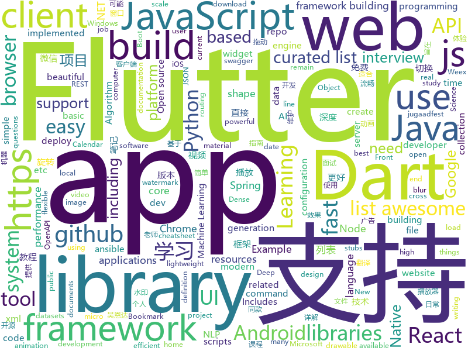

# 2018-09-12
See what the GitHub community is most excited about today.

## python
* [jupytext](https://github.com/mwouts/jupytext)(**206 stars today**): Jupyter notebooks as Markdown documents, Julia, Python or R scripts
* [system-design-primer](https://github.com/donnemartin/system-design-primer)(**178 stars today**): Learn how to design large-scale systems. Prep for the system design interview. Includes Anki flashcards.
* [zero](https://github.com/KonstantinSchubert/zero)(**167 stars today**): Local file system transparently swapping to the cloud
* [Python](https://github.com/TheAlgorithms/Python)(**140 stars today**): All Algorithms implemented in Python
* [models](https://github.com/tensorflow/models)(**70 stars today**): Models and examples built with TensorFlow
* [aspider](https://github.com/howie6879/aspider)(**94 stars today**): aspider - An async web scraping micro-framework based on asyncio.
* [awesome-python](https://github.com/vinta/awesome-python)(**71 stars today**): A curated list of awesome Python frameworks, libraries, software and resources
* [TensorFlow-cn](https://github.com/snowkylin/TensorFlow-cn)(**62 stars today**): 简单粗暴TensorFlow | A Concise Handbook of TensorFlow
* [Algorithm_Interview_Notes-Chinese](https://github.com/imhuay/Algorithm_Interview_Notes-Chinese)(**51 stars today**): 2018/2019/校招/春招/秋招/算法/机器学习(Machine Learning)/深度学习(Deep Learning)/自然语言处理(NLP)/C/C++/Python/面试笔记
* [keras](https://github.com/keras-team/keras)(**41 stars today**): Deep Learning for humans
* [youtube-dl](https://github.com/rg3/youtube-dl)(**45 stars today**): Command-line program to download videos from YouTube.com and other video sites
* [100-Days-of-ML-Code-Chinese-Version](https://github.com/Avik-Jain/100-Days-of-ML-Code-Chinese-Version)(**40 stars today**): Chinese Translation for Machine Learning Infographics
* [Alfred3-workflow-recent-documents](https://github.com/mpco/Alfred3-workflow-recent-documents)(**41 stars today**): Quickly open recent documents and apps / 快捷打开最近访问的文档或应用
* [flask](https://github.com/pallets/flask)(**34 stars today**): The Python micro framework for building web applications.
* [Photon](https://github.com/s0md3v/Photon)(**37 stars today**): Incredibly fast crawler designed for reconnaissance.
* [reminiscence](https://github.com/kanishka-linux/reminiscence)(**38 stars today**): Self-Hosted Bookmark and Archive Manager
* [pytorch-dense-correspondence](https://github.com/RobotLocomotion/pytorch-dense-correspondence)(**37 stars today**): Code for "Dense Object Nets: Learning Dense Visual Object Descriptors By and For Robotic Manipulation"
* [ansible](https://github.com/ansible/ansible)(**27 stars today**): Ansible is a radically simple IT automation platform that makes your applications and systems easier to deploy. Avoid writing scripts or custom code to deploy and update your applications — automate in a language that approaches plain English, using SSH, with no agents to install on remote systems. https://docs.ansible.com/ansible/
* [cheat.sh](https://github.com/chubin/cheat.sh)(**34 stars today**): the only cheat sheet you need
* [learn-python](https://github.com/trekhleb/learn-python)(**33 stars today**): 📚Playground and cheatsheet for learning Python
* [public-apis](https://github.com/toddmotto/public-apis)(**34 stars today**): A collective list of public JSON APIs for use in web development.
* [home-assistant](https://github.com/home-assistant/home-assistant)(**30 stars today**): 🏡Open source home automation that puts local control and privacy first
* [cpython](https://github.com/python/cpython)(**27 stars today**): The Python programming language
* [texar](https://github.com/asyml/texar)(**31 stars today**): Toolkit for Text Generation and Beyond
* [httpie](https://github.com/jakubroztocil/httpie)(****): Modern command line HTTP client – user-friendly curl alternative with intuitive UI, JSON support, syntax highlighting, wget-like downloads, extensions, etc. https://httpie.org

## java
* [WebSiteUseful](https://github.com/loremwalker/WebSiteUseful)(**219 stars today**): 🍅翻墙！科学上网，免费ss帐号分享、ssr订阅源，免费VPN下载，获取及使用教程请看：https://github.com/loremwalker/fq-book
* [BackgroundLibrary](https://github.com/JavaNoober/BackgroundLibrary)(**203 stars today**): A framework for directly generating shape through Tags, no need to write shape.xml again（通过标签直接生成shape，无需再写shape.xml）
* [AndroidWM](https://github.com/huangyz0918/AndroidWM)(**145 stars today**): A lightweight android image watermark library that supports invisible digital watermarks.🌁(轻量级安卓水印框架，支持隐形数字水印)
* [MSPaintIDE](https://github.com/RubbaBoy/MSPaintIDE)(**142 stars today**): Programming in MS Paint
* [JavaGuide](https://github.com/Snailclimb/JavaGuide)(**108 stars today**): A core knowledge that most Java programmers need to master
* [tink](https://github.com/google/tink)(**109 stars today**): Tink is a multi-language, cross-platform library that provides cryptographic APIs that are secure, easy to use correctly, and hard(er) to misuse.
* [JCSprout](https://github.com/crossoverJie/JCSprout)(**73 stars today**): 👨‍🎓Java Core Sprout : basic, concurrent, algorithm
* [java-design-patterns](https://github.com/iluwatar/java-design-patterns)(**68 stars today**): Design patterns implemented in Java
* [noDrawable](https://github.com/whataa/noDrawable)(**65 stars today**): 一个旨在减少99%的drawable.xml文件的库，可直接在布局文件中对任意View声明drawable属性。
* [proxyee-down](https://github.com/proxyee-down-org/proxyee-down)(**63 stars today**): http下载工具，基于http代理，支持多连接分块下载
* [spring-boot](https://github.com/spring-projects/spring-boot)(**46 stars today**): Spring Boot
* [tutorials](https://github.com/eugenp/tutorials)(**26 stars today**): The "REST With Spring" Course:
* [interviews](https://github.com/kdn251/interviews)(**45 stars today**): Everything you need to know to get the job.
* [MyPerf4J](https://github.com/ThinkpadNC5/MyPerf4J)(**45 stars today**): A high performance and non-intrusive real-time Java performance monitoring and statistical tool.
* [weixin-java-tools](https://github.com/Wechat-Group/weixin-java-tools)(**37 stars today**): 全能微信Java开发工具包，支持包括微信支付、开放平台、小程序、企业微信/企业号和公众号等的开发
* [elasticsearch](https://github.com/elastic/elasticsearch)(**32 stars today**): Open Source, Distributed, RESTful Search Engine
* [GSYVideoPlayer](https://github.com/CarGuo/GSYVideoPlayer)(**34 stars today**): 视频播放器（IJKplayer、ExoPlayer、MediaPlayer），HTTPS支持，支持弹幕，支持滤镜、水印、gif截图，片头广告、中间广告，多个同时播放，支持基本的拖动，声音、亮度调节，支持边播边缓存，支持视频本身自带rotation的旋转（90,270之类），重力旋转与手动旋转的同步支持，支持列表播放 ，直接添加控件为封面，列表全屏动画，视频加载速度，列表小窗口支持拖动，动画效果，调整比例，多分辨率切换，支持切换播放器，进度条小窗口预览，列表切换详情页面无缝播放，其他一些小动画效果，rtsp、concat、mpeg。项目解析：
* [helidon](https://github.com/oracle/helidon)(**35 stars today**): Java libraries for writing microservices
* [spring-boot-examples](https://github.com/ityouknow/spring-boot-examples)(**28 stars today**): about learning Spring Boot via examples. Spring Boot 教程、技术栈示例代码，快速简单上手教程。
* [HokoBlur](https://github.com/HokoFly/HokoBlur)(**35 stars today**): an easy-to-use blur library for Android, support efficient dynamic blur jobs.
* [AndroidUtilCode](https://github.com/Blankj/AndroidUtilCode)(**27 stars today**): 🔥Android developers should collect the following utils(updating).
* [guava](https://github.com/google/guava)(**29 stars today**): Google core libraries for Java
* [spring-framework](https://github.com/spring-projects/spring-framework)(**25 stars today**): Spring Framework
* [PowerMenu](https://github.com/skydoves/PowerMenu)(**31 stars today**): 📛A library that let you implement popup menu so easily.
* [okhttp](https://github.com/square/okhttp)(**30 stars today**): An HTTP+HTTP/2 client for Android and Java applications.

## unknown
* [ToolsOfTheTrade](https://github.com/cjbarber/ToolsOfTheTrade)(**879 stars today**): Tools of The Trade, from Hacker News.
* [English-level-up-tips-for-Chinese](https://github.com/byoungd/English-level-up-tips-for-Chinese)(**844 stars today**): 可能是让你受益匪浅的英语进阶指南
* [100-Days-Of-ML-Code](https://github.com/Avik-Jain/100-Days-Of-ML-Code)(**246 stars today**): 100 Days of ML Coding
* [CS-Notes](https://github.com/CyC2018/CS-Notes)(**174 stars today**): 📚Computer Science Learning Notes
* [DeepInterests](https://github.com/Honlan/DeepInterests)(**160 stars today**): 深度有趣
* [awesome](https://github.com/sindresorhus/awesome)(**82 stars today**): 😎Curated list of awesome lists
* [gitignore](https://github.com/github/gitignore)(**58 stars today**): A collection of useful .gitignore templates
* [developer-roadmap](https://github.com/kamranahmedse/developer-roadmap)(**78 stars today**): Roadmap to becoming a web developer in 2018
* [mmdetection](https://github.com/open-mmlab/mmdetection)(**72 stars today**): Open MMLab Detection Toolbox
* [CS-Interview-Knowledge-Map](https://github.com/InterviewMap/CS-Interview-Knowledge-Map)(**64 stars today**): Build the best interview map. The current content includes JS, network, browser related, performance optimization, security, framework, Git, data structure, algorithm, etc.
* [pwc](https://github.com/zziz/pwc)(**66 stars today**): Papers with code. Sorted by stars. Updated weekly.
* [free-programming-books](https://github.com/EbookFoundation/free-programming-books)(**56 stars today**): 📚Freely available programming books
* [coding-interview-university](https://github.com/jwasham/coding-interview-university)(**50 stars today**): A complete computer science study plan to become a software engineer.
* [PHP-Interview-QA](https://github.com/colinlet/PHP-Interview-QA)(**54 stars today**): 结合实际PHP面试遇到的问题，尝试提供简洁准确的答案
* [stanford-cs-229-machine-learning](https://github.com/afshinea/stanford-cs-229-machine-learning)(**41 stars today**): VIP cheatsheets for Stanford's CS 229 Machine Learning
* [awesome-vue](https://github.com/vuejs/awesome-vue)(**45 stars today**): 🎉A curated list of awesome things related to Vue.js
* [build-your-own-x](https://github.com/danistefanovic/build-your-own-x)(**41 stars today**): 🤓Build your own (insert technology here)
* [project-based-learning](https://github.com/tuvtran/project-based-learning)(**37 stars today**): Curated list of project-based tutorials
* [awesome-tmux](https://github.com/rothgar/awesome-tmux)(**38 stars today**): A list of awesome resources for tmux
* [nodebestpractices](https://github.com/i0natan/nodebestpractices)(**32 stars today**): The largest Node.JS best practices list (September 2018)
* [gold-miner](https://github.com/xitu/gold-miner)(**31 stars today**): 🥇掘金翻译计划，可能是世界最大最好的英译中技术社区，最懂读者和译者的翻译平台：
* [Front-end-Developer-Interview-Questions](https://github.com/h5bp/Front-end-Developer-Interview-Questions)(**29 stars today**): A list of helpful front-end related questions you can use to interview potential candidates, test yourself or completely ignore.
* [awesome-cpp](https://github.com/fffaraz/awesome-cpp)(**28 stars today**): A curated list of awesome C++ (or C) frameworks, libraries, resources, and shiny things. Inspired by awesome-... stuff.
* [test-your-sysadmin-skills](https://github.com/trimstray/test-your-sysadmin-skills)(**29 stars today**): A collection of *nix Sysadmin Test Questions and Answers for Interview/Exam (2018 Edition).
* [awesome-public-datasets](https://github.com/awesomedata/awesome-public-datasets)(**27 stars today**): A topic-centric list of high-quality open datasets in public domains. Propose NEW data ☛☛☛PR☛☛☛

## javascript
* [WatermelonDB](https://github.com/Nozbe/WatermelonDB)(**816 stars today**): 🍉Next-gen database for powerful React and React Native apps that scales to 10,000s of records and remains fast⚡️
* [pigeon-maps](https://github.com/mariusandra/pigeon-maps)(**783 stars today**): ReactJS Maps without external dependencies
* [You-Dont-Need-Momentjs](https://github.com/you-dont-need/You-Dont-Need-Momentjs)(**392 stars today**): List of date-fns or native functions which you can use to replace moment.js + ESLint Plugin
* [ky](https://github.com/sindresorhus/ky)(**244 stars today**): Tiny and elegant HTTP client based on the browser Fetch API
* [ailab](https://github.com/Microsoft/ailab)(**213 stars today**): Experience, Learn and Code the latest breakthrough innovations with Microsoft AI
* [chinese-dos-games](https://github.com/rwv/chinese-dos-games)(**202 stars today**): 🎮Chinese DOS games in browser.
* [ghuser.io](https://github.com/AurelienLourot/ghuser.io)(**199 stars today**): Better GitHub profiles
* [vue](https://github.com/vuejs/vue)(**132 stars today**): 🖖A progressive, incrementally-adoptable JavaScript framework for building UI on the web.
* [react](https://github.com/facebook/react)(**106 stars today**): A declarative, efficient, and flexible JavaScript library for building user interfaces.
* [project-explorer](https://github.com/sdras/project-explorer)(**105 stars today**): 🎋A CLI tool to create an annotated tree visualization of any project
* [sqorn](https://github.com/lusakasa/sqorn)(**105 stars today**): A Javascript library for building SQL queries
* [date-fns](https://github.com/date-fns/date-fns)(**102 stars today**): ⏳Modern JavaScript date utility library⌛️
* [create-react-app](https://github.com/facebook/create-react-app)(**83 stars today**): Create React apps with no build configuration.
* [ligar-cobranca](https://github.com/GtOkAi/ligar-cobranca)(**82 stars today**): Ligue automaticamente para empresas de cobrança e deixe uma voz falando "Alô?" sem parar.
* [javascript-algorithms](https://github.com/trekhleb/javascript-algorithms)(**85 stars today**): Algorithms and data structures implemented in JavaScript with explanations and links to further readings
* [microjob](https://github.com/wilk/microjob)(**90 stars today**): A tiny wrapper for turning Node.js worker threads into easy-to-use routines for heavy CPU loads.
* [axios](https://github.com/axios/axios)(**85 stars today**): Promise based HTTP client for the browser and node.js
* [free-programming-books-zh_CN](https://github.com/justjavac/free-programming-books-zh_CN)(**68 stars today**): 📚免费的计算机编程类中文书籍，欢迎投稿
* [windows95](https://github.com/felixrieseberg/windows95)(**68 stars today**): 💩🚀Windows 95 in Electron. Runs on macOS, Linux, and Windows.
* [signale](https://github.com/klauscfhq/signale)(**67 stars today**): 👋Hackable console logger
* [node](https://github.com/nodejs/node)(**60 stars today**): Node.js JavaScript runtime✨🐢🚀✨
* [puppeteer](https://github.com/GoogleChrome/puppeteer)(**62 stars today**): Headless Chrome Node API
* [lumen](https://github.com/sctb/lumen)(**57 stars today**): A Lisp for Lua and JavaScript
* [Front-End-Checklist](https://github.com/thedaviddias/Front-End-Checklist)(**54 stars today**): 🗂The perfect Front-End Checklist for modern websites and meticulous developers
* [react-native](https://github.com/facebook/react-native)(**49 stars today**): A framework for building native apps with React.

## html
* [sal](https://github.com/mciastek/sal)(**139 stars today**): 🚀Performance focused, lightweight scroll animation library🚀
* [styleguide](https://github.com/google/styleguide)(**43 stars today**): Style guides for Google-originated open-source projects
* [Spoon-Knife](https://github.com/octocat/Spoon-Knife)(****): This repo is for demonstration purposes only.
* [Coursera-ML-AndrewNg-Notes](https://github.com/fengdu78/Coursera-ML-AndrewNg-Notes)(**18 stars today**): 吴恩达老师的机器学习课程个人笔记
* [OSCPRepo](https://github.com/rewardone/OSCPRepo)(**20 stars today**): A list of commands, scripts, resources, and more that I have gathered and attempted to consolidate for use as OSCP study material. Commands in 'Usefulcommands' Keepnote. Bookmarks and reading material in 'BookmarkList' Keepnote. Reconscan in scripts folder.
* [fastText](https://github.com/facebookresearch/fastText)(**20 stars today**): Library for fast text representation and classification.
* [r2con2018](https://github.com/radareorg/r2con2018)(**19 stars today**): 
* [NLP-progress](https://github.com/sebastianruder/NLP-progress)(**16 stars today**): Repository to track the progress in Natural Language Processing (NLP), including the datasets and the current state-of-the-art for the most common NLP tasks.
* [swagger-codegen](https://github.com/swagger-api/swagger-codegen)(**16 stars today**): swagger-codegen contains a template-driven engine to generate documentation, API clients and server stubs in different languages by parsing your OpenAPI / Swagger definition.
* [react-app-rewired](https://github.com/timarney/react-app-rewired)(**16 stars today**): Override create-react-app webpack configs without ejecting
* [portainer](https://github.com/portainer/portainer)(**16 stars today**): Simple management UI for Docker
* [EIPs](https://github.com/ethereum/EIPs)(**16 stars today**): The Ethereum Improvement Proposal repository
* [deeplearning_ai_books](https://github.com/fengdu78/deeplearning_ai_books)(**13 stars today**): deeplearning.ai（吴恩达老师的深度学习课程笔记及资源）
* [lazyestload.js](https://github.com/Paul-Browne/lazyestload.js)(**14 stars today**): load images only when they are in (and remain in) the viewport
* [model-analysis](https://github.com/tensorflow/model-analysis)(**9 stars today**): Model analysis tools for TensorFlow
* [dotnet](https://github.com/Microsoft/dotnet)(**9 stars today**): This repo is the official home of .NET on GitHub. It's a great starting point to find many .NET OSS projects from Microsoft and the community, including many that are part of the .NET Foundation.
* [hugo-academic](https://github.com/gcushen/hugo-academic)(**6 stars today**): The website designer for Hugo. Build and deploy a beautiful website in minutes🚀
* [polymer](https://github.com/Polymer/polymer)(**9 stars today**): Build modern apps using web components
* [js-xss](https://github.com/leizongmin/js-xss)(**9 stars today**): Sanitize untrusted HTML (to prevent XSS) with a configuration specified by a Whitelist
* [dev-tips](https://github.com/HomoEfficio/dev-tips)(**9 stars today**): 개발하다 마주쳤던 작은 문제들과 해결 방법 정리
* [fonts](https://github.com/google/fonts)(**8 stars today**): Font files available from Google Fonts
* [coreui-free-bootstrap-admin-template](https://github.com/coreui/coreui-free-bootstrap-admin-template)(**7 stars today**): CoreUI is free bootstrap admin template
* [pipeline](https://github.com/PipelineAI/pipeline)(**8 stars today**): PipelineAI: Real-Time Enterprise AI Platform
* [openapi-generator](https://github.com/OpenAPITools/openapi-generator)(**7 stars today**): OpenAPI Generator allows generation of API client libraries (SDK generation), server stubs, documentation and configuration automatically given an OpenAPI Spec (v2, v3)
* [jugaadfest.com](https://github.com/fossasia/jugaadfest.com)(**6 stars today**): Jugaadfest in India https://jugaadfest.com

## dart
* [GSYGithubAppFlutter](https://github.com/CarGuo/GSYGithubAppFlutter)(**89 stars today**): 超完整的Flutter项目，功能丰富，适合学习和日常使用。GSYGithubApp系列的优势：我们目前已经拥有Flutter、Weex、ReactNative三个版本。 功能齐全，项目框架内技术涉及面广，完成度高，持续维护，配套文章，适合全面学习，跨框架对比参考。跨平台的开源Github客户端App，更好的体验，更丰富的功能，旨在更好的日常管理和维护个人Github，提供更好更方便的驾车体验～～Σ(￣。￣ﾉ)ﾉ。同款Weex版本 ： https://github.com/CarGuo/GSYGithubAppWeex 、同款React Native版本 ： https://github.com/CarGuo/GSYGithubApp
* [flutter](https://github.com/flutter/flutter)(**75 stars today**): Flutter makes it easy and fast to build beautiful mobile apps.
* [flutter_calendar_carousel](https://github.com/dooboolab/flutter_calendar_carousel)(**32 stars today**): Calendar widget for flutter that is swipeable horizontally. This widget can help you build your own calendar widget highly customizable.
* [Flutter-UI-Kit](https://github.com/iampawan/Flutter-UI-Kit)(**21 stars today**): Flutter app for collection of UI in a UIKit
* [FlutterExampleApps](https://github.com/iampawan/FlutterExampleApps)(**11 stars today**): [Example APPS] Basic Flutter apps, for flutter devs.
* [plugins](https://github.com/flutter/plugins)(**9 stars today**): Plugins for Flutter, including FlutterFire, maintained by the Flutter team
* [PokemonApp](https://github.com/iampawan/PokemonApp)(**8 stars today**): Pokemon App with animations and beautiful UI
* [fluro](https://github.com/theyakka/fluro)(**6 stars today**): Fluro is a Flutter routing library that adds flexible routing options like wildcards, named parameters and clear route definitions.
* [kiwi](https://github.com/letsar/kiwi)(**6 stars today**): A simple compile-time dependency injection library for Dart and Flutter
* [flutter_architecture_samples](https://github.com/brianegan/flutter_architecture_samples)(**5 stars today**): TodoMVC for Flutter
* [dio](https://github.com/flutterchina/dio)(**5 stars today**): A powerful Http client for Dart, which supports Interceptors, FormData, Request Cancellation, File Downloading, Timeout etc.
* [aqueduct](https://github.com/stablekernel/aqueduct)(**5 stars today**): Dart HTTP server framework for building REST APIs. Includes PostgreSQL ORM and OAuth2 provider.
* [pimp_my_button](https://github.com/Norbert515/pimp_my_button)(**5 stars today**): Add particle effects to anything.
* [sdk](https://github.com/dart-lang/sdk)(****): The Dart SDK, including the VM, dart2js, core libraries, and more.
* [chromedeveditor](https://github.com/googlearchive/chromedeveditor)(****): Chrome Dev Editor is a developer tool for building apps on the Chrome platform - Chrome Apps and Web Apps, in JavaScript or Dart. (NO LONGER IN ACTIVE DEVELOPMENT)
* [flutter-osc](https://github.com/yubo725/flutter-osc)(****): 基于Google Flutter的开源中国客户端，支持Android和iOS。
* [flutter-examples](https://github.com/nisrulz/flutter-examples)(****): [Examples] Simple basic isolated apps, for budding flutter devs.
* [inKino](https://github.com/roughike/inKino)(****): inKino - A cross platform movie and showtime browser for Finnkino cinemas, made with Flutter.
* [hauberk](https://github.com/munificent/hauberk)(****): A web-based roguelike written in Dart.
* [Flutter-learning](https://github.com/AweiLoveAndroid/Flutter-learning)(****): 🔥👍🌟⭐️⭐️⭐️Flutter从配置安装到填坑指南详解，Flutter相关Demo解读，项目实例，Dart语法详解
* [angular](https://github.com/dart-lang/angular)(****): Fast and productive web framework provided by Dart
* [zhihu-flutter](https://github.com/HackSoul/zhihu-flutter)(****): Flutter 高仿知乎 UI，非常漂亮，也非常流畅，flutter build apk 或 flutter build ios 之后更流畅
* [StageXL](https://github.com/bp74/StageXL)(****): A fast and universal 2D rendering engine for HTML5 and Dart.
* [dart-sass](https://github.com/sass/dart-sass)(****): A Dart implementation of Sass.
* [github-issue-mover](https://github.com/google/github-issue-mover)(****): Making it easy to migrate issues between repos.

## WordCloud

