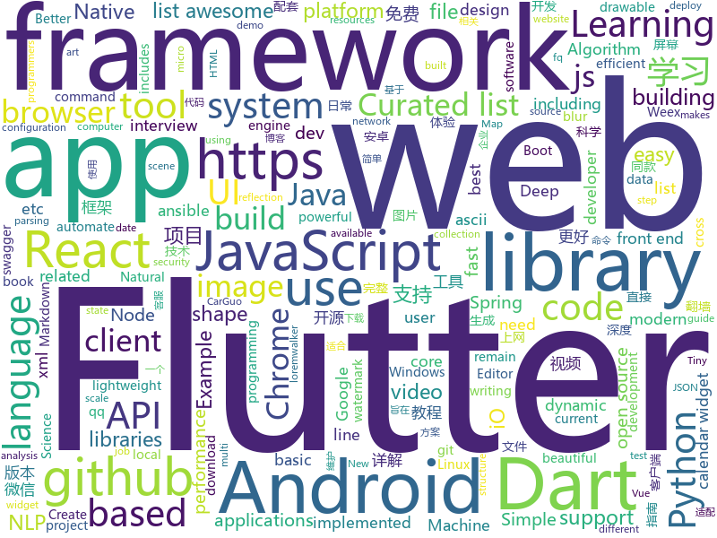

# 2018-09-13
See what the GitHub community is most excited about today.

## python
* [Python](https://github.com/TheAlgorithms/Python)(**277 stars today**): All Algorithms implemented in Python
* [system-design-primer](https://github.com/donnemartin/system-design-primer)(**159 stars today**): Learn how to design large-scale systems. Prep for the system design interview. Includes Anki flashcards.
* [jupytext](https://github.com/mwouts/jupytext)(**108 stars today**): Jupyter notebooks as Markdown documents, Julia, Python or R scripts
* [models](https://github.com/tensorflow/models)(**68 stars today**): Models and examples built with TensorFlow
* [tensorboard](https://github.com/tensorflow/tensorboard)(**77 stars today**): TensorFlow's Visualization Toolkit
* [DeepImageReconstruction](https://github.com/KamitaniLab/DeepImageReconstruction)(**68 stars today**): Data and demo codes for Shen, Horikawa, Majima, and Kamitani, "Deep image reconstruction from human brain activity".
* [awesome-python](https://github.com/vinta/awesome-python)(**62 stars today**): A curated list of awesome Python frameworks, libraries, software and resources
* [django](https://github.com/django/django)(**52 stars today**): The Web framework for perfectionists with deadlines.
* [aspider](https://github.com/howie6879/aspider)(**52 stars today**): aspider - An async web scraping micro-framework based on asyncio.
* [everbug](https://github.com/everhide/everbug)(**45 stars today**): Django debug tool for browser
* [public-apis](https://github.com/toddmotto/public-apis)(**40 stars today**): A collective list of public JSON APIs for use in web development.
* [keras](https://github.com/keras-team/keras)(**35 stars today**): Deep Learning for humans
* [cpython](https://github.com/python/cpython)(**32 stars today**): The Python programming language
* [flask](https://github.com/pallets/flask)(**36 stars today**): The Python micro framework for building web applications.
* [apistar](https://github.com/encode/apistar)(**38 stars today**): A smart Web API framework, for Python 3.🌟
* [zero](https://github.com/KonstantinSchubert/zero)(**38 stars today**): Local file system transparently swapping to the cloud
* [home-assistant](https://github.com/home-assistant/home-assistant)(**33 stars today**): 🏡Open source home automation that puts local control and privacy first
* [youtube-dl](https://github.com/rg3/youtube-dl)(**34 stars today**): Command-line program to download videos from YouTube.com and other video sites
* [scikit-learn](https://github.com/scikit-learn/scikit-learn)(**29 stars today**): scikit-learn: machine learning in Python
* [python-nubia](https://github.com/facebookincubator/python-nubia)(**35 stars today**): A command-line and interactive shell framework.
* [Algorithm_Interview_Notes-Chinese](https://github.com/imhuay/Algorithm_Interview_Notes-Chinese)(**31 stars today**): 2018/2019/校招/春招/秋招/算法/机器学习(Machine Learning)/深度学习(Deep Learning)/自然语言处理(NLP)/C/C++/Python/面试笔记
* [ansible](https://github.com/ansible/ansible)(**24 stars today**): Ansible is a radically simple IT automation platform that makes your applications and systems easier to deploy. Avoid writing scripts or custom code to deploy and update your applications — automate in a language that approaches plain English, using SSH, with no agents to install on remote systems. https://docs.ansible.com/ansible/
* [DANet](https://github.com/junfu1115/DANet)(**28 stars today**): Dual Attention Network for Scene Segmentation
* [you-get](https://github.com/soimort/you-get)(**26 stars today**): ⏬Dumb downloader that scrapes the web
* [httpie](https://github.com/jakubroztocil/httpie)(****): Modern command line HTTP client – user-friendly curl alternative with intuitive UI, JSON support, syntax highlighting, wget-like downloads, extensions, etc. https://httpie.org

## java
* [BackgroundLibrary](https://github.com/JavaNoober/BackgroundLibrary)(**194 stars today**): A framework for directly generating shape through Tags, no need to write shape.xml again（通过标签直接生成shape，无需再写shape.xml）
* [JavaGuide](https://github.com/Snailclimb/JavaGuide)(**176 stars today**): A core knowledge that most Java programmers need to master
* [helidon](https://github.com/oracle/helidon)(**128 stars today**): Java libraries for writing microservices
* [JCSprout](https://github.com/crossoverJie/JCSprout)(**116 stars today**): 👨‍🎓Java Core Sprout : basic, concurrent, algorithm
* [AndroidWM](https://github.com/huangyz0918/AndroidWM)(**102 stars today**): A lightweight android image watermark library that supports invisible digital watermarks.🌁(轻量级安卓水印框架，支持隐形数字水印)
* [HokoBlur](https://github.com/HokoFly/HokoBlur)(**82 stars today**): an easy-to-use blur library for Android, support efficient dynamic blur jobs.
* [interviews](https://github.com/kdn251/interviews)(**73 stars today**): Everything you need to know to get the job.
* [noDrawable](https://github.com/whataa/noDrawable)(**77 stars today**): 一个旨在减少99%的drawable.xml文件的库，可直接在布局文件中对任意View声明drawable属性。
* [java-design-patterns](https://github.com/iluwatar/java-design-patterns)(**69 stars today**): Design patterns implemented in Java
* [spring-boot](https://github.com/spring-projects/spring-boot)(**59 stars today**): Spring Boot
* [MSPaintIDE](https://github.com/RubbaBoy/MSPaintIDE)(**69 stars today**): Programming in MS Paint
* [proxyee-down](https://github.com/proxyee-down-org/proxyee-down)(**60 stars today**): http下载工具，基于http代理，支持多连接分块下载
* [PicOrVideoToAscii](https://github.com/GodFengShen/PicOrVideoToAscii)(**57 stars today**): Android picture or video to ascii pic or video 安卓平台下，将图片或视频进行ascii化，合并视频用到ffmpeg库。后期会加入带色彩的ascii码图片或视频
* [AndroidAutoSize](https://github.com/JessYanCoding/AndroidAutoSize)(**50 stars today**): A low-cost Android screen adaptation solution (今日头条屏幕适配方案终极版，一个极低成本的 Android 屏幕适配方案).
* [tink](https://github.com/google/tink)(**49 stars today**): Tink is a multi-language, cross-platform library that provides cryptographic APIs that are secure, easy to use correctly, and hard(er) to misuse.
* [incubator-dubbo](https://github.com/apache/incubator-dubbo)(**41 stars today**): Apache Dubbo (incubating) is a high-performance, java based, open source RPC framework.
* [tutorials](https://github.com/eugenp/tutorials)(**27 stars today**): The "REST With Spring" Course:
* [elasticsearch](https://github.com/elastic/elasticsearch)(**36 stars today**): Open Source, Distributed, RESTful Search Engine
* [AndroidUtilCode](https://github.com/Blankj/AndroidUtilCode)(**37 stars today**): 🔥Android developers should collect the following utils(updating).
* [spring-boot-examples](https://github.com/ityouknow/spring-boot-examples)(**36 stars today**): about learning Spring Boot via examples. Spring Boot 教程、技术栈示例代码，快速简单上手教程。
* [cosin](https://github.com/chatopera/cosin)(**38 stars today**): 春松客服: 开源的全渠道智能客服
* [okhttp](https://github.com/square/okhttp)(**37 stars today**): An HTTP+HTTP/2 client for Android and Java applications.
* [anna](https://github.com/ucbrise/anna)(**36 stars today**): 
* [weixin-java-tools](https://github.com/Wechat-Group/weixin-java-tools)(**32 stars today**): 全能微信Java开发工具包，支持包括微信支付、开放平台、小程序、企业微信/企业号和公众号等的开发
* [spring-framework](https://github.com/spring-projects/spring-framework)(**32 stars today**): Spring Framework

## unknown
* [English-level-up-tips-for-Chinese](https://github.com/byoungd/English-level-up-tips-for-Chinese)(**506 stars today**): 可能是让你受益匪浅的英语进阶指南
* [ToolsOfTheTrade](https://github.com/cjbarber/ToolsOfTheTrade)(**460 stars today**): Tools of The Trade, from Hacker News.
* [free-for-dev](https://github.com/ripienaar/free-for-dev)(**334 stars today**): A list of SaaS, PaaS and IaaS offerings that have free tiers of interest to devops and infradev
* [100-Days-Of-ML-Code](https://github.com/Avik-Jain/100-Days-Of-ML-Code)(**192 stars today**): 100 Days of ML Coding
* [CS-Notes](https://github.com/CyC2018/CS-Notes)(**169 stars today**): 📚Computer Science Learning Notes
* [pwc](https://github.com/zziz/pwc)(**145 stars today**): Papers with code. Sorted by stars. Updated weekly.
* [WebSiteUseful](https://github.com/loremwalker/WebSiteUseful)(**121 stars today**): 🍅翻墙！科学上网，免费ss帐号分享、ssr订阅源，免费VPN下载，获取及使用教程请看：https://github.com/loremwalker/fq-book
* [DeepInterests](https://github.com/Honlan/DeepInterests)(**101 stars today**): 深度有趣
* [CS-Interview-Knowledge-Map](https://github.com/InterviewMap/CS-Interview-Knowledge-Map)(**95 stars today**): Build the best interview map. The current content includes JS, network, browser related, performance optimization, security, framework, Git, data structure, algorithm, etc.
* [You-Dont-Know-JS](https://github.com/getify/You-Dont-Know-JS)(**88 stars today**): A book series on JavaScript. @YDKJS on twitter.
* [stanford-cs-229-machine-learning](https://github.com/afshinea/stanford-cs-229-machine-learning)(**81 stars today**): VIP cheatsheets for Stanford's CS 229 Machine Learning
* [developer-roadmap](https://github.com/kamranahmedse/developer-roadmap)(**76 stars today**): Roadmap to becoming a web developer in 2018
* [free-programming-books](https://github.com/EbookFoundation/free-programming-books)(**75 stars today**): 📚Freely available programming books
* [gitignore](https://github.com/github/gitignore)(**56 stars today**): A collection of useful .gitignore templates
* [coding-interview-university](https://github.com/jwasham/coding-interview-university)(**70 stars today**): A complete computer science study plan to become a software engineer.
* [mmdetection](https://github.com/open-mmlab/mmdetection)(**63 stars today**): Open MMLab Detection Toolbox
* [awesome](https://github.com/sindresorhus/awesome)(**58 stars today**): 😎Curated list of awesome lists
* [awesome-vue](https://github.com/vuejs/awesome-vue)(**37 stars today**): 🎉A curated list of awesome things related to Vue.js
* [build-your-own-x](https://github.com/danistefanovic/build-your-own-x)(**37 stars today**): 🤓Build your own (insert technology here)
* [project-based-learning](https://github.com/tuvtran/project-based-learning)(**35 stars today**): Curated list of project-based tutorials
* [Front-end-Developer-Interview-Questions](https://github.com/h5bp/Front-end-Developer-Interview-Questions)(**33 stars today**): A list of helpful front-end related questions you can use to interview potential candidates, test yourself or completely ignore.
* [OCNet](https://github.com/PkuRainBow/OCNet)(**35 stars today**): OCNet achieves the state-of-the-art scene parsing performance on both Cityscapes and ADE20K.
* [fq-book](https://github.com/loremwalker/fq-book)(**27 stars today**): 🍅翻墙！免费科学上网方法与技巧，请看此markdown生成的网页：https://loremwalker.github.io/fq-book
* [awesome-tmux](https://github.com/rothgar/awesome-tmux)(**27 stars today**): A list of awesome resources for tmux
* [awesome-flutter](https://github.com/Solido/awesome-flutter)(**26 stars today**): An awesome list that curates the best Flutter libraries, tools, tutorials, articles and more.

## javascript
* [You-Dont-Need-Momentjs](https://github.com/you-dont-need/You-Dont-Need-Momentjs)(**607 stars today**): List of date-fns or native functions which you can use to replace moment.js + ESLint Plugin
* [WatermelonDB](https://github.com/Nozbe/WatermelonDB)(**507 stars today**): 🍉Next-gen database for powerful React and React Native apps that scales to 10,000s of records and remains fast⚡️
* [Front-End-Checklist](https://github.com/thedaviddias/Front-End-Checklist)(**210 stars today**): 🗂The perfect Front-End Checklist for modern websites and meticulous developers
* [pigeon-maps](https://github.com/mariusandra/pigeon-maps)(**203 stars today**): ReactJS Maps without external dependencies
* [chinese-dos-games](https://github.com/rwv/chinese-dos-games)(**191 stars today**): 🎮Chinese DOS games in browser.
* [ky](https://github.com/sindresorhus/ky)(**171 stars today**): Tiny and elegant HTTP client based on the browser Fetch API
* [vue](https://github.com/vuejs/vue)(**131 stars today**): 🖖A progressive, incrementally-adoptable JavaScript framework for building UI on the web.
* [date-fns](https://github.com/date-fns/date-fns)(**144 stars today**): ⏳Modern JavaScript date utility library⌛️
* [javascript-algorithms](https://github.com/trekhleb/javascript-algorithms)(**107 stars today**): Algorithms and data structures implemented in JavaScript with explanations and links to further readings
* [react](https://github.com/facebook/react)(**100 stars today**): A declarative, efficient, and flexible JavaScript library for building user interfaces.
* [carbon](https://github.com/dawnlabs/carbon)(**108 stars today**): 🎨Create and share beautiful images of your source code
* [lumen](https://github.com/sctb/lumen)(**98 stars today**): A Lisp for Lua and JavaScript
* [create-react-app](https://github.com/facebook/create-react-app)(**86 stars today**): Create React apps with no build configuration.
* [free-programming-books-zh_CN](https://github.com/justjavac/free-programming-books-zh_CN)(**84 stars today**): 📚免费的计算机编程类中文书籍，欢迎投稿
* [CP-WEB-SOURCE-PlATFORM](https://github.com/10086XIAOZHANG/CP-WEB-SOURCE-PlATFORM)(**73 stars today**): CP聚合博客——drf+xadmin+react+dva 搭建的博客完整网站
* [ghuser.io](https://github.com/AurelienLourot/ghuser.io)(**83 stars today**): Better GitHub profiles
* [microjob](https://github.com/wilk/microjob)(**82 stars today**): A tiny wrapper for turning Node.js worker threads into easy-to-use routines for heavy CPU loads.
* [taiko](https://github.com/getgauge/taiko)(**81 stars today**): A node.js library to automate chrome/chromium browser
* [windows95](https://github.com/felixrieseberg/windows95)(**76 stars today**): 💩🚀Windows 95 in Electron. Runs on macOS, Linux, and Windows.
* [ice](https://github.com/alibaba/ice)(**67 stars today**): 🚀飞冰 - 让前端开发简单而友好，海量可复用物料，配套桌面工具极速构建前端应用，效率提升 100%
* [nodebook](https://github.com/netgusto/nodebook)(**67 stars today**): Nodebook - Multi-Language REPL with Web UI
* [storybook](https://github.com/storybooks/storybook)(**65 stars today**): Interactive UI component dev & test: React, React Native, Vue, Angular
* [sqorn](https://github.com/lusakasa/sqorn)(**64 stars today**): A Javascript library for building SQL queries
* [nlp.js](https://github.com/axa-group/nlp.js)(**58 stars today**): An NLP library built in node over Natural, with entity extraction, sentiment analysis, automatic language identify, and so more
* [puppeteer](https://github.com/GoogleChrome/puppeteer)(**56 stars today**): Headless Chrome Node API

## html
* [sal](https://github.com/mciastek/sal)(**177 stars today**): 🚀Performance focused, lightweight scroll animation library🚀
* [styleguide](https://github.com/google/styleguide)(**27 stars today**): Style guides for Google-originated open-source projects
* [Spoon-Knife](https://github.com/octocat/Spoon-Knife)(****): This repo is for demonstration purposes only.
* [small](https://github.com/mathiasbynens/small)(**27 stars today**): Smallest possible syntactically valid files of different types
* [fastText](https://github.com/facebookresearch/fastText)(**20 stars today**): Library for fast text representation and classification.
* [GTFOBins.github.io](https://github.com/GTFOBins/GTFOBins.github.io)(**19 stars today**): Curated list of Unix binaries that can be exploited to bypass system security restrictions
* [NLP-progress](https://github.com/sebastianruder/NLP-progress)(**17 stars today**): Repository to track the progress in Natural Language Processing (NLP), including the datasets and the current state-of-the-art for the most common NLP tasks.
* [swagger-codegen](https://github.com/swagger-api/swagger-codegen)(**13 stars today**): swagger-codegen contains a template-driven engine to generate documentation, API clients and server stubs in different languages by parsing your OpenAPI / Swagger definition.
* [portainer](https://github.com/portainer/portainer)(**17 stars today**): Simple management UI for Docker
* [lazyestload.js](https://github.com/Paul-Browne/lazyestload.js)(**16 stars today**): load images only when they are in (and remain in) the viewport
* [linux-command](https://github.com/jaywcjlove/linux-command)(**8 stars today**): Linux命令大全搜索工具，内容包含Linux命令手册、详解、学习、搜集。https://git.io/linux
* [EIPs](https://github.com/ethereum/EIPs)(**7 stars today**): The Ethereum Improvement Proposal repository
* [gentelella](https://github.com/puikinsh/gentelella)(**8 stars today**): Free Bootstrap 3 Admin Template
* [model-analysis](https://github.com/tensorflow/model-analysis)(**8 stars today**): Model analysis tools for TensorFlow
* [WebFundamentals](https://github.com/google/WebFundamentals)(**9 stars today**): Best practices for modern web development
* [intro.js](https://github.com/usablica/intro.js)(**8 stars today**): A better way for new feature introduction and step-by-step users guide for your website and project.
* [r2con2018](https://github.com/radareorg/r2con2018)(**7 stars today**): 
* [foundation-sites](https://github.com/zurb/foundation-sites)(**7 stars today**): The most advanced responsive front-end framework in the world. Quickly create prototypes and production code for sites that work on any kind of device.
* [fonts](https://github.com/google/fonts)(**7 stars today**): Font files available from Google Fonts
* [walle-web](https://github.com/meolu/walle-web)(**7 stars today**): A Web Deployment Tool (web代码部署工具)
* [wysiwyg-editor](https://github.com/froala/wysiwyg-editor)(**7 stars today**): A beautifully designed WYSIWYG HTML Editor based on HTML5.
* [glTF](https://github.com/KhronosGroup/glTF)(**7 stars today**): glTF – Runtime 3D Asset Delivery
* [rellax](https://github.com/dixonandmoe/rellax)(**7 stars today**): Lightweight, vanilla javascript parallax library
* [js-xss](https://github.com/leizongmin/js-xss)(**7 stars today**): Sanitize untrusted HTML (to prevent XSS) with a configuration specified by a Whitelist
* [jugaadfest.com](https://github.com/fossasia/jugaadfest.com)(**6 stars today**): Jugaadfest in India https://jugaadfest.com

## dart
* [flutter](https://github.com/flutter/flutter)(**59 stars today**): Flutter makes it easy and fast to build beautiful mobile apps.
* [GSYGithubAppFlutter](https://github.com/CarGuo/GSYGithubAppFlutter)(**40 stars today**): 超完整的Flutter项目，功能丰富，适合学习和日常使用。GSYGithubApp系列的优势：我们目前已经拥有Flutter、Weex、ReactNative三个版本。 功能齐全，项目框架内技术涉及面广，完成度高，持续维护，配套文章，适合全面学习，跨框架对比参考。跨平台的开源Github客户端App，更好的体验，更丰富的功能，旨在更好的日常管理和维护个人Github，提供更好更方便的驾车体验～～Σ(￣。￣ﾉ)ﾉ。同款Weex版本 ： https://github.com/CarGuo/GSYGithubAppWeex 、同款React Native版本 ： https://github.com/CarGuo/GSYGithubApp
* [plugins](https://github.com/flutter/plugins)(**12 stars today**): Plugins for Flutter, including FlutterFire, maintained by the Flutter team
* [FlutterExampleApps](https://github.com/iampawan/FlutterExampleApps)(**10 stars today**): [Example APPS] Basic Flutter apps, for flutter devs.
* [dio](https://github.com/flutterchina/dio)(**9 stars today**): A powerful Http client for Dart, which supports Interceptors, FormData, Request Cancellation, File Downloading, Timeout etc.
* [PullToRefresh](https://github.com/baoolong/PullToRefresh)(**8 stars today**): Flutter相关的项目QQ:277155832 Email:277155832@qq.com
* [flutter_swiper](https://github.com/best-flutter/flutter_swiper)(**7 stars today**): The best swiper for flutter , with multiple layouts, infinite loop. Compatible with Android & iOS.
* [Flutter-learning](https://github.com/AweiLoveAndroid/Flutter-learning)(**5 stars today**): 🔥👍🌟⭐️⭐️⭐️Flutter从配置安装到填坑指南详解，Flutter相关Demo解读，项目实例，Dart语法详解
* [flutter_calendar_carousel](https://github.com/dooboolab/flutter_calendar_carousel)(**6 stars today**): Calendar widget for flutter that is swipeable horizontally. This widget can help you build your own calendar widget highly customizable.
* [Flutter-UI-Kit](https://github.com/iampawan/Flutter-UI-Kit)(**5 stars today**): Flutter app for collection of UI in a UIKit
* [sdk](https://github.com/dart-lang/sdk)(**5 stars today**): The Dart SDK, including the VM, dart2js, core libraries, and more.
* [site-www](https://github.com/dart-lang/site-www)(****): Source for Dart website
* [inject.dart](https://github.com/google/inject.dart)(****): Compile-time dependency injection for Dart and Flutter
* [uri.dart](https://github.com/google/uri.dart)(****): Utilities for working with URIs in Dart
* [flutter_calendar](https://github.com/apptreesoftware/flutter_calendar)(****): A calendar widget for Flutter.
* [dart-scissors](https://github.com/google/dart-scissors)(****): sCiSSors: smarter resources for Angular(1,2) apps: CSS pruner & bidirectionalizer, Sass runner, image optimizer, locale permutations
* [flutter_radial_menu](https://github.com/xqwzts/flutter_radial_menu)(****): A simple animated radial menu widget for Flutter.
* [reflectable](https://github.com/dart-lang/reflectable)(****): Reflectable is a Dart library that allows programmers to eliminate certain usages of dynamic reflection by specialization of reflective code to an equivalent implementation using only static techniques. The use of dynamic reflection is constrained in order to ensure that the specialized code can be generated and will have a reasonable size.
* [chromedeveditor](https://github.com/googlearchive/chromedeveditor)(****): Chrome Dev Editor is a developer tool for building apps on the Chrome platform - Chrome Apps and Web Apps, in JavaScript or Dart. (NO LONGER IN ACTIVE DEVELOPMENT)
* [flutter-osc](https://github.com/yubo725/flutter-osc)(****): 基于Google Flutter的开源中国客户端，支持Android和iOS。
* [flutter-examples](https://github.com/nisrulz/flutter-examples)(****): [Examples] Simple basic isolated apps, for budding flutter devs.
* [inKino](https://github.com/roughike/inKino)(****): inKino - A cross platform movie and showtime browser for Finnkino cinemas, made with Flutter.
* [flutter_architecture_samples](https://github.com/brianegan/flutter_architecture_samples)(****): TodoMVC for Flutter
* [hauberk](https://github.com/munificent/hauberk)(****): A web-based roguelike written in Dart.
* [angular](https://github.com/dart-lang/angular)(****): Fast and productive web framework provided by Dart

## WordCloud

