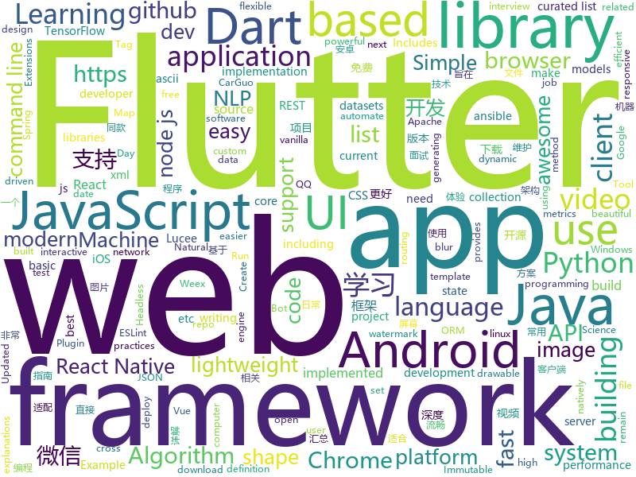

# 2018-09-14
See what the GitHub community is most excited about today.

## python
* [Python](https://github.com/TheAlgorithms/Python)(**288 stars today**): All Algorithms implemented in Python
* [system-design-primer](https://github.com/donnemartin/system-design-primer)(**169 stars today**): Learn how to design large-scale systems. Prep for the system design interview. Includes Anki flashcards.
* [Bowler](https://github.com/facebookincubator/Bowler)(**92 stars today**): Safe code refactoring for modern Python.
* [models](https://github.com/tensorflow/models)(**66 stars today**): Models and examples built with TensorFlow
* [fastTSNE](https://github.com/pavlin-policar/fastTSNE)(**68 stars today**): Fast, parallel implementations of tSNE
* [DANet](https://github.com/junfu1115/DANet)(**59 stars today**): Dual Attention Network for Scene Segmentation
* [keras](https://github.com/keras-team/keras)(**53 stars today**): Deep Learning for humans
* [python-nubia](https://github.com/facebookincubator/python-nubia)(**62 stars today**): A command-line and interactive shell framework.
* [awesome-reactnative-ui](https://github.com/madhavanmalolan/awesome-reactnative-ui)(**55 stars today**): Awesome React Native UI components updated weekly
* [tensorboard](https://github.com/tensorflow/tensorboard)(**53 stars today**): TensorFlow's Visualization Toolkit
* [public-apis](https://github.com/toddmotto/public-apis)(**53 stars today**): A collective list of public JSON APIs for use in web development.
* [cpython](https://github.com/python/cpython)(**39 stars today**): The Python programming language
* [jupytext](https://github.com/mwouts/jupytext)(**45 stars today**): Jupyter notebooks as Markdown documents, Julia, Python or R scripts
* [efb-qq-slave](https://github.com/milkice233/efb-qq-slave)(**45 stars today**): EFB QQ Slave, a channel for EH Forwarder Bot. EFB QQ从端
* [AIF360](https://github.com/IBM/AIF360)(**44 stars today**): A comprehensive set of fairness metrics for datasets and machine learning models, explanations for these metrics, and algorithms to mitigate bias in datasets and models.
* [ansible](https://github.com/ansible/ansible)(**36 stars today**): Ansible is a radically simple IT automation platform that makes your applications and systems easier to deploy. Avoid writing scripts or custom code to deploy and update your applications — automate in a language that approaches plain English, using SSH, with no agents to install on remote systems. https://docs.ansible.com/ansible/
* [youtube-dl](https://github.com/rg3/youtube-dl)(**37 stars today**): Command-line program to download videos from YouTube.com and other video sites
* [awesome-python](https://github.com/vinta/awesome-python)(**35 stars today**): A curated list of awesome Python frameworks, libraries, software and resources
* [flask](https://github.com/pallets/flask)(**28 stars today**): The Python micro framework for building web applications.
* [django](https://github.com/django/django)(**23 stars today**): The Web framework for perfectionists with deadlines.
* [Algorithm_Interview_Notes-Chinese](https://github.com/imhuay/Algorithm_Interview_Notes-Chinese)(**28 stars today**): 2018/2019/校招/春招/秋招/算法/机器学习(Machine Learning)/深度学习(Deep Learning)/自然语言处理(NLP)/C/C++/Python/面试笔记
* [vid2vid](https://github.com/NVIDIA/vid2vid)(**30 stars today**): Pytorch implementation of our method for high-resolution (e.g. 2048x1024) photorealistic video-to-video translation.
* [you-get](https://github.com/soimort/you-get)(**27 stars today**): ⏬Dumb downloader that scrapes the web
* [TensorFlow-cn](https://github.com/snowkylin/TensorFlow-cn)(**25 stars today**): 简单粗暴TensorFlow | A Concise Handbook of TensorFlow
* [httpie](https://github.com/jakubroztocil/httpie)(****): Modern command line HTTP client – user-friendly curl alternative with intuitive UI, JSON support, syntax highlighting, wget-like downloads, extensions, etc. https://httpie.org

## java
* [JavaGuide](https://github.com/Snailclimb/JavaGuide)(**146 stars today**): A core knowledge that most Java programmers need to master
* [BackgroundLibrary](https://github.com/JavaNoober/BackgroundLibrary)(**131 stars today**): A framework for directly generating shape through Tags, no need to write shape.xml again（通过标签直接生成shape，无需再写shape.xml）
* [JCSprout](https://github.com/crossoverJie/JCSprout)(**119 stars today**): 👨‍🎓Java Core Sprout : basic, concurrent, algorithm
* [helidon](https://github.com/oracle/helidon)(**90 stars today**): Java libraries for writing microservices
* [java-design-patterns](https://github.com/iluwatar/java-design-patterns)(**64 stars today**): Design patterns implemented in Java
* [WebSiteUseful](https://github.com/loremwalker/WebSiteUseful)(**68 stars today**): 🍅翻墙！科学上网，免费ss帐号分享、ssr订阅源，免费VPN下载，获取及使用教程请看：https://github.com/loremwalker/fq-book
* [spring-boot](https://github.com/spring-projects/spring-boot)(**52 stars today**): Spring Boot
* [AndroidAutoSize](https://github.com/JessYanCoding/AndroidAutoSize)(**50 stars today**): A low-cost Android screen adaptation solution (今日头条屏幕适配方案终极版，一个极低成本的 Android 屏幕适配方案).
* [Lucee](https://github.com/lucee/Lucee)(**53 stars today**): Lucee Server is a dynamic, Java based (JSR-223), tag and scripting language used for rapid web application development. Lucee simplifies technologies like webservices (REST, SOAP, HTTP), ORM (Hibernate), searching (Lucene), datasources (MSSQL, Oracle, MySQL and others), caching (infinispan, ehcache, and memcached) and many more. Lucee provides a…
* [interviews](https://github.com/kdn251/interviews)(**46 stars today**): Everything you need to know to get the job.
* [AndroidWM](https://github.com/huangyz0918/AndroidWM)(**51 stars today**): A lightweight android image watermark library that supports invisible digital watermarks.🌁(轻量级安卓水印框架，支持隐形数字水印)
* [proxyee-down](https://github.com/proxyee-down-org/proxyee-down)(**46 stars today**): http下载工具，基于http代理，支持多连接分块下载
* [tink](https://github.com/google/tink)(**50 stars today**): Tink is a multi-language, cross-platform library that provides cryptographic APIs that are secure, easy to use correctly, and hard(er) to misuse.
* [tutorials](https://github.com/eugenp/tutorials)(**35 stars today**): The "REST With Spring" Course:
* [incubator-dubbo](https://github.com/apache/incubator-dubbo)(**32 stars today**): Apache Dubbo (incubating) is a high-performance, java based, open source RPC framework.
* [HokoBlur](https://github.com/HokoFly/HokoBlur)(**44 stars today**): an easy-to-use blur library for Android, support efficient dynamic blur jobs.
* [weixin-java-tools](https://github.com/Wechat-Group/weixin-java-tools)(**40 stars today**): 全能微信Java开发工具包，支持包括微信支付、开放平台、小程序、企业微信/企业号和公众号等的开发
* [PicOrVideoToAscii](https://github.com/GodFengShen/PicOrVideoToAscii)(**44 stars today**): Android picture or video convert to ascii pic or video 安卓平台下，图片或视频转化为ascii，合并视频用到ffmpeg库。后期会加入带色彩的ascii码图片或视频
* [TonY](https://github.com/linkedin/TonY)(**44 stars today**): TensorFlow on YARN (TonY) is a framework to natively run TensorFlow on Apache Hadoop.
* [eclipse-collections](https://github.com/eclipse/eclipse-collections)(**31 stars today**): The Eclipse Collections Project
* [Java](https://github.com/TheAlgorithms/Java)(**31 stars today**): All Algorithms implemented in Java
* [WorkbenchFX](https://github.com/dlemmermann/WorkbenchFX)(**39 stars today**): A lightweight RCP framework for JavaFX applications.
* [okhttp](https://github.com/square/okhttp)(**34 stars today**): An HTTP+HTTP/2 client for Android and Java applications.
* [noDrawable](https://github.com/whataa/noDrawable)(**36 stars today**): 一个旨在减少99%的drawable.xml文件的库，可直接在布局文件中对任意View声明drawable属性。
* [spring-framework](https://github.com/spring-projects/spring-framework)(**28 stars today**): Spring Framework

## unknown
* [pwc](https://github.com/zziz/pwc)(**525 stars today**): Papers with code. Sorted by stars. Updated weekly.
* [free-for-dev](https://github.com/ripienaar/free-for-dev)(**513 stars today**): A list of SaaS, PaaS and IaaS offerings that have free tiers of interest to devops and infradev
* [English-level-up-tips-for-Chinese](https://github.com/byoungd/English-level-up-tips-for-Chinese)(**305 stars today**): 可能是让你受益匪浅的英语进阶指南
* [ToolsOfTheTrade](https://github.com/cjbarber/ToolsOfTheTrade)(**276 stars today**): Tools of The Trade, from Hacker News.
* [Java-Notes](https://github.com/PansonPanson/Java-Notes)(**266 stars today**): ⭐️⭐️计算机科学基础知识、Java开发、后端/服务端开发、面试相关⭐️⭐️
* [100-Days-Of-ML-Code](https://github.com/Avik-Jain/100-Days-Of-ML-Code)(**214 stars today**): 100 Days of ML Coding
* [CS-Notes](https://github.com/CyC2018/CS-Notes)(**189 stars today**): 📚Computer Science Learning Notes
* [stanford-cs-229-machine-learning](https://github.com/afshinea/stanford-cs-229-machine-learning)(**101 stars today**): VIP cheatsheets for Stanford's CS 229 Machine Learning
* [CS-Interview-Knowledge-Map](https://github.com/InterviewMap/CS-Interview-Knowledge-Map)(**80 stars today**): Build the best interview map. The current content includes JS, network, browser related, performance optimization, security, framework, Git, data structure, algorithm, etc.
* [free-programming-books](https://github.com/EbookFoundation/free-programming-books)(**76 stars today**): 📚Freely available programming books
* [You-Dont-Know-JS](https://github.com/getify/You-Dont-Know-JS)(**74 stars today**): A book series on JavaScript. @YDKJS on twitter.
* [awesome](https://github.com/sindresorhus/awesome)(**69 stars today**): 😎Curated list of awesome lists
* [coding-interview-university](https://github.com/jwasham/coding-interview-university)(**64 stars today**): A complete computer science study plan to become a software engineer.
* [gitignore](https://github.com/github/gitignore)(**50 stars today**): A collection of useful .gitignore templates
* [technology-talk](https://github.com/aalansehaiyang/technology-talk)(**60 stars today**): 汇总java生态圈常用技术框架、开源中间件，系统架构、项目管理、经典架构案例、数据库、常用三方库、线上运维等知识
* [developer-roadmap](https://github.com/kamranahmedse/developer-roadmap)(**59 stars today**): Roadmap to becoming a web developer in 2018
* [project-based-learning](https://github.com/tuvtran/project-based-learning)(**49 stars today**): Curated list of project-based tutorials
* [rfcs](https://github.com/yarnpkg/rfcs)(**51 stars today**): RFCs for changes to Yarn
* [RSPapers](https://github.com/hongleizhang/RSPapers)(**40 stars today**): Must-read papers on Recommender System.
* [books](https://github.com/programthink/books)(**42 stars today**): 【编程随想】收藏的电子书清单（多个学科，含下载链接）
* [DeepInterests](https://github.com/Honlan/DeepInterests)(**39 stars today**): 深度有趣
* [awesome-vue](https://github.com/vuejs/awesome-vue)(**35 stars today**): 🎉A curated list of awesome things related to Vue.js
* [office-hours](https://github.com/nikomatsakis/office-hours)(**33 stars today**): Help me help you!
* [nodebestpractices](https://github.com/i0natan/nodebestpractices)(**34 stars today**): The largest Node.JS best practices list (September 2018)
* [mlhub123](https://github.com/howie6879/mlhub123)(**30 stars today**): 机器学习&深度学习网站资源汇总（Machine Learning Resources）

## javascript
* [You-Dont-Need-Momentjs](https://github.com/you-dont-need/You-Dont-Need-Momentjs)(**638 stars today**): List of date-fns or native functions which you can use to replace moment.js + ESLint Plugin
* [carbon](https://github.com/dawnlabs/carbon)(**442 stars today**): 🎨Create and share beautiful images of your source code
* [Front-End-Checklist](https://github.com/thedaviddias/Front-End-Checklist)(**278 stars today**): 🗂The perfect Front-End Checklist for modern websites and meticulous developers
* [WatermelonDB](https://github.com/Nozbe/WatermelonDB)(**260 stars today**): 🍉Next-gen database for powerful React and React Native apps that scales to 10,000s of records and remains fast⚡️
* [tink](https://github.com/npm/tink)(**236 stars today**): a dependency unwinder for javascript
* [nlp.js](https://github.com/axa-group/nlp.js)(**232 stars today**): An NLP library built in node over Natural, with entity extraction, sentiment analysis, automatic language identify, and so more
* [immer](https://github.com/mweststrate/immer)(**223 stars today**): Create the next immutable state by mutating the current one
* [react-copy-write](https://github.com/aweary/react-copy-write)(**178 stars today**): ✍️Immutable state with a mutable API
* [date-fns](https://github.com/date-fns/date-fns)(**160 stars today**): ⏳Modern JavaScript date utility library⌛️
* [vue](https://github.com/vuejs/vue)(**121 stars today**): 🖖A progressive, incrementally-adoptable JavaScript framework for building UI on the web.
* [chinese-dos-games](https://github.com/rwv/chinese-dos-games)(**117 stars today**): 🎮Chinese DOS games in browser.
* [pigeon-maps](https://github.com/mariusandra/pigeon-maps)(**120 stars today**): ReactJS Maps without external dependencies
* [taiko](https://github.com/getgauge/taiko)(**117 stars today**): A node.js library to automate chrome/chromium browser
* [react](https://github.com/facebook/react)(**85 stars today**): A declarative, efficient, and flexible JavaScript library for building user interfaces.
* [javascript-algorithms](https://github.com/trekhleb/javascript-algorithms)(**84 stars today**): Algorithms and data structures implemented in JavaScript with explanations and links to further readings
* [ky](https://github.com/sindresorhus/ky)(**93 stars today**): Tiny and elegant HTTP client based on the browser Fetch API
* [create-react-app](https://github.com/facebook/create-react-app)(**71 stars today**): Create React apps with no build configuration.
* [free-programming-books-zh_CN](https://github.com/justjavac/free-programming-books-zh_CN)(**74 stars today**): 📚免费的计算机编程类中文书籍，欢迎投稿
* [puppeteer](https://github.com/GoogleChrome/puppeteer)(**74 stars today**): Headless Chrome Node API
* [You-Dont-Need-Lodash-Underscore](https://github.com/you-dont-need/You-Dont-Need-Lodash-Underscore)(**69 stars today**): List of JavaScript methods which you can use natively + ESLint Plugin
* [gatsby-auth-starter-aws-amplify](https://github.com/dabit3/gatsby-auth-starter-aws-amplify)(**68 stars today**): Starter Project with Authentication with Gatsby & AWS Amplify
* [express-rest-es2017-boilerplate](https://github.com/danielfsousa/express-rest-es2017-boilerplate)(**67 stars today**): ⌛️Express boilerplate for building RESTful APIs
* [axios](https://github.com/axios/axios)(**62 stars today**): Promise based HTTP client for the browser and node.js
* [windows95](https://github.com/felixrieseberg/windows95)(**59 stars today**): 💩🚀Windows 95 in Electron. Runs on macOS, Linux, and Windows.
* [storybook](https://github.com/storybooks/storybook)(**51 stars today**): Interactive UI component dev & test: React, React Native, Vue, Angular

## html
* [sal](https://github.com/mciastek/sal)(**67 stars today**): 🚀Performance focused, lightweight scroll animation library🚀
* [frontend](https://github.com/guardian/frontend)(**63 stars today**): Source for theguardian.com
* [CVE-2018-8420](https://github.com/Lz1y/CVE-2018-8420)(**53 stars today**): 原PoC甚至符号都打错了！太不走心了！
* [trashy.css](https://github.com/t7/trashy.css)(**45 stars today**): Trashy.css - The throwaway CSS library with no `class`.
* [CVE-2018-8420](https://github.com/Theropord/CVE-2018-8420)(**35 stars today**): 
* [styleguide](https://github.com/google/styleguide)(**19 stars today**): Style guides for Google-originated open-source projects
* [lazyestload.js](https://github.com/Paul-Browne/lazyestload.js)(**16 stars today**): load images only when they are in (and remain in) the viewport
* [fastText](https://github.com/facebookresearch/fastText)(**15 stars today**): Library for fast text representation and classification.
* [Spoon-Knife](https://github.com/octocat/Spoon-Knife)(****): This repo is for demonstration purposes only.
* [portainer](https://github.com/portainer/portainer)(**15 stars today**): Simple management UI for Docker
* [JavaScript30](https://github.com/wesbos/JavaScript30)(**8 stars today**): 30 Day Vanilla JS Challenge
* [skill-map](https://github.com/TeamStuQ/skill-map)(**13 stars today**): 程序员技能图谱
* [NLP-progress](https://github.com/sebastianruder/NLP-progress)(**12 stars today**): Repository to track the progress in Natural Language Processing (NLP), including the datasets and the current state-of-the-art for the most common NLP tasks.
* [react-app-rewired](https://github.com/timarney/react-app-rewired)(**11 stars today**): Override create-react-app webpack configs without ejecting
* [responsive-html-email-template](https://github.com/leemunroe/responsive-html-email-template)(**9 stars today**): A free simple responsive HTML email template
* [glTF](https://github.com/KhronosGroup/glTF)(**9 stars today**): glTF – Runtime 3D Asset Delivery
* [meilix-generator](https://github.com/fossasia/meilix-generator)(**7 stars today**): WebApp for generating a custom ISO image based on Meilix http://meilix.org
* [swagger-codegen](https://github.com/swagger-api/swagger-codegen)(**5 stars today**): swagger-codegen contains a template-driven engine to generate documentation, API clients and server stubs in different languages by parsing your OpenAPI / Swagger definition.
* [WebFundamentals](https://github.com/google/WebFundamentals)(**8 stars today**): Best practices for modern web development
* [a11yproject.com](https://github.com/a11yproject/a11yproject.com)(**8 stars today**): A community–driven effort to make web accessibility easier.
* [rellax](https://github.com/dixonandmoe/rellax)(**7 stars today**): Lightweight, vanilla javascript parallax library
* [phantomjs](https://github.com/ariya/phantomjs)(**7 stars today**): Scriptable Headless Browser
* [pure](https://github.com/pure-css/pure)(**7 stars today**): A set of small, responsive CSS modules that you can use in every web project.
* [zenbot](https://github.com/DeviaVir/zenbot)(**7 stars today**): Zenbot is a command-line cryptocurrency trading bot using Node.js and MongoDB.
* [wechat_web_devtools](https://github.com/cytle/wechat_web_devtools)(**7 stars today**): 微信开发者工具(微信小程序)linux完美支持

## dart
* [flutter](https://github.com/flutter/flutter)(**62 stars today**): Flutter makes it easy and fast to build beautiful mobile apps.
* [GSYGithubAppFlutter](https://github.com/CarGuo/GSYGithubAppFlutter)(**32 stars today**): 超完整的Flutter项目，功能丰富，适合学习和日常使用。GSYGithubApp系列的优势：我们目前已经拥有Flutter、Weex、ReactNative三个版本。 功能齐全，项目框架内技术涉及面广，完成度高，持续维护，配套文章，适合全面学习，跨框架对比参考。跨平台的开源Github客户端App，更好的体验，更丰富的功能，旨在更好的日常管理和维护个人Github，提供更好更方便的驾车体验～～Σ(￣。￣ﾉ)ﾉ。同款Weex版本 ： https://github.com/CarGuo/GSYGithubAppWeex 、同款React Native版本 ： https://github.com/CarGuo/GSYGithubApp
* [plugins](https://github.com/flutter/plugins)(**9 stars today**): Plugins for Flutter, including FlutterFire, maintained by the Flutter team
* [Flutter-UI-Kit](https://github.com/iampawan/Flutter-UI-Kit)(**8 stars today**): Flutter app for collection of UI in a UIKit
* [FlutterExampleApps](https://github.com/iampawan/FlutterExampleApps)(**6 stars today**): [Example APPS] Basic Flutter apps, for flutter devs.
* [flutter_architecture_samples](https://github.com/brianegan/flutter_architecture_samples)(****): TodoMVC for Flutter
* [test](https://github.com/dart-lang/test)(****): A library for writing unit tests in Dart.
* [friendlychat-steps](https://github.com/flutter/friendlychat-steps)(****): 
* [audioplayer](https://github.com/luanpotter/audioplayer)(****): A Flutter plugin to play multiple audio files simultaneously (Android/iOS)
* [chromedeveditor](https://github.com/googlearchive/chromedeveditor)(****): Chrome Dev Editor is a developer tool for building apps on the Chrome platform - Chrome Apps and Web Apps, in JavaScript or Dart. (NO LONGER IN ACTIVE DEVELOPMENT)
* [sdk](https://github.com/dart-lang/sdk)(****): The Dart SDK, including the VM, dart2js, core libraries, and more.
* [flutter-osc](https://github.com/yubo725/flutter-osc)(****): 基于Google Flutter的开源中国客户端，支持Android和iOS。
* [flutter-examples](https://github.com/nisrulz/flutter-examples)(****): [Examples] Simple basic isolated apps, for budding flutter devs.
* [inKino](https://github.com/roughike/inKino)(****): inKino - A cross platform movie and showtime browser for Finnkino cinemas, made with Flutter.
* [hauberk](https://github.com/munificent/hauberk)(****): A web-based roguelike written in Dart.
* [Flutter-learning](https://github.com/AweiLoveAndroid/Flutter-learning)(****): 🔥👍🌟⭐️⭐️⭐️Flutter从配置安装到填坑指南详解，Flutter相关Demo解读，项目实例，Dart语法详解
* [dio](https://github.com/flutterchina/dio)(****): A powerful Http client for Dart, which supports Interceptors, FormData, Request Cancellation, File Downloading, Timeout etc.
* [angular](https://github.com/dart-lang/angular)(****): Fast and productive web framework provided by Dart
* [zhihu-flutter](https://github.com/HackSoul/zhihu-flutter)(****): Flutter 高仿知乎 UI，非常漂亮，也非常流畅，flutter build apk 或 flutter build ios 之后更流畅
* [StageXL](https://github.com/bp74/StageXL)(****): A fast and universal 2D rendering engine for HTML5 and Dart.
* [dart-sass](https://github.com/sass/dart-sass)(****): A Dart implementation of Sass.
* [github-issue-mover](https://github.com/google/github-issue-mover)(****): Making it easy to migrate issues between repos.
* [rxdart](https://github.com/ReactiveX/rxdart)(****): The Reactive Extensions for Dart
* [aqueduct](https://github.com/stablekernel/aqueduct)(****): Dart HTTP server framework for building REST APIs. Includes PostgreSQL ORM and OAuth2 provider.
* [fluro](https://github.com/theyakka/fluro)(****): Fluro is a Flutter routing library that adds flexible routing options like wildcards, named parameters and clear route definitions.

## WordCloud

