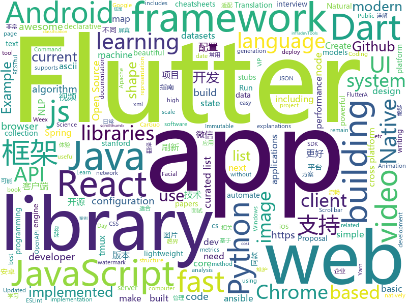

# 2018-09-15
See what the GitHub community is most excited about today.

## python
* [Python](https://github.com/TheAlgorithms/Python)(**202 stars today**): All Algorithms implemented in Python
* [Bowler](https://github.com/facebookincubator/Bowler)(**182 stars today**): Safe code refactoring for modern Python.
* [system-design-primer](https://github.com/donnemartin/system-design-primer)(**137 stars today**): Learn how to design large-scale systems. Prep for the system design interview. Includes Anki flashcards.
* [fastTSNE](https://github.com/pavlin-policar/fastTSNE)(**96 stars today**): Fast, parallel implementations of tSNE
* [models](https://github.com/tensorflow/models)(**63 stars today**): Models and examples built with TensorFlow
* [awesome-reactnative-ui](https://github.com/madhavanmalolan/awesome-reactnative-ui)(**86 stars today**): Awesome React Native UI components updated weekly
* [xonsh](https://github.com/xonsh/xonsh)(**61 stars today**): Python-powered, cross-platform, Unix-gazing shell
* [uplink](https://github.com/prkumar/uplink)(**58 stars today**): A Declarative HTTP Client for Python
* [awesome-python](https://github.com/vinta/awesome-python)(**51 stars today**): A curated list of awesome Python frameworks, libraries, software and resources
* [cpython](https://github.com/python/cpython)(**47 stars today**): The Python programming language
* [jupytext](https://github.com/mwouts/jupytext)(**54 stars today**): Jupyter notebooks as Markdown documents, Julia, Python or R scripts
* [GANimation](https://github.com/albertpumarola/GANimation)(**49 stars today**): GANimation: Anatomically-aware Facial Animation from a Single Image (ECCV'18 Oral) [PyTorch]
* [youtube-dl](https://github.com/rg3/youtube-dl)(**46 stars today**): Command-line program to download videos from YouTube.com and other video sites
* [DANet](https://github.com/junfu1115/DANet)(**46 stars today**): Dual Attention Network for Scene Segmentation
* [public-apis](https://github.com/toddmotto/public-apis)(**42 stars today**): A collective list of public JSON APIs for use in web development.
* [keras](https://github.com/keras-team/keras)(**41 stars today**): Deep Learning for humans
* [jiant](https://github.com/jsalt18-sentence-repl/jiant)(**47 stars today**): The jiant sentence representation learning toolkit
* [scikit-learn](https://github.com/scikit-learn/scikit-learn)(**28 stars today**): scikit-learn: machine learning in Python
* [vid2vid](https://github.com/NVIDIA/vid2vid)(**34 stars today**): Pytorch implementation of our method for high-resolution (e.g. 2048x1024) photorealistic video-to-video translation.
* [ansible](https://github.com/ansible/ansible)(**30 stars today**): Ansible is a radically simple IT automation platform that makes your applications and systems easier to deploy. Avoid writing scripts or custom code to deploy and update your applications — automate in a language that approaches plain English, using SSH, with no agents to install on remote systems. https://docs.ansible.com/ansible/
* [reminiscence](https://github.com/kanishka-linux/reminiscence)(**35 stars today**): Self-Hosted Bookmark and Archive Manager
* [AIF360](https://github.com/IBM/AIF360)(**35 stars today**): A comprehensive set of fairness metrics for datasets and machine learning models, explanations for these metrics, and algorithms to mitigate bias in datasets and models.
* [face_recognition](https://github.com/ageitgey/face_recognition)(**31 stars today**): The world's simplest facial recognition api for Python and the command line
* [unrestricted-adversarial-examples](https://github.com/google/unrestricted-adversarial-examples)(**32 stars today**): Contest Proposal and infrastructure for the Unrestricted Adversarial Examples Challenge
* [flask](https://github.com/pallets/flask)(**29 stars today**): The Python micro framework for building web applications.

## java
* [JavaGuide](https://github.com/Snailclimb/JavaGuide)(**140 stars today**): A core knowledge that most Java programmers need to master
* [arthas](https://github.com/alibaba/arthas)(**107 stars today**): Alibaba Java诊断利器Arthas
* [JCSprout](https://github.com/crossoverJie/JCSprout)(**72 stars today**): 👨‍🎓Java Core Sprout : basic, concurrent, algorithm
* [BackgroundLibrary](https://github.com/JavaNoober/BackgroundLibrary)(**66 stars today**): A framework for directly generating shape through Tags, no need to write shape.xml again（通过标签直接生成shape，无需再写shape.xml）
* [proxyee-down](https://github.com/proxyee-down-org/proxyee-down)(**67 stars today**): http下载工具，基于http代理，支持多连接分块下载
* [java-design-patterns](https://github.com/iluwatar/java-design-patterns)(**58 stars today**): Design patterns implemented in Java
* [PixelShot](https://github.com/Muddz/PixelShot)(**67 stars today**): PixelShot is an awesome Android library that can save any View in your app as an image
* [AndroidAutoSize](https://github.com/JessYanCoding/AndroidAutoSize)(**58 stars today**): A low-cost Android screen adaptation solution (今日头条屏幕适配方案终极版，一个极低成本的 Android 屏幕适配方案).
* [spring-boot](https://github.com/spring-projects/spring-boot)(**45 stars today**): Spring Boot
* [PicOrVideoToAscii](https://github.com/GodFengShen/PicOrVideoToAscii)(**50 stars today**): Android picture or video convert to ascii pic or video 安卓平台下，图片或视频转化为ascii，合并视频用到ffmpeg库。后期会加入带色彩的ascii码图片或视频
* [helidon](https://github.com/oracle/helidon)(**45 stars today**): Java libraries for writing microservices
* [interviews](https://github.com/kdn251/interviews)(**41 stars today**): Everything you need to know to get the job.
* [weixin-java-tools](https://github.com/Wechat-Group/weixin-java-tools)(**39 stars today**): 全能微信Java开发工具包，支持包括微信支付、开放平台、小程序、企业微信/企业号和公众号等的开发
* [elasticsearch](https://github.com/elastic/elasticsearch)(**37 stars today**): Open Source, Distributed, RESTful Search Engine
* [TonY](https://github.com/linkedin/TonY)(**39 stars today**): TensorFlow on YARN (TonY) is a framework to natively run TensorFlow on Apache Hadoop.
* [vjtools](https://github.com/vipshop/vjtools)(**39 stars today**): The vip.com's java coding standard, libraries and tools
* [tutorials](https://github.com/eugenp/tutorials)(**24 stars today**): The "REST With Spring" Course:
* [APIJSON](https://github.com/TommyLemon/APIJSON)(**34 stars today**): 🚀后端接口和文档自动化，前端(客户端) 定制返回JSON的数据和结构！
* [tink](https://github.com/google/tink)(**35 stars today**): Tink is a multi-language, cross-platform library that provides cryptographic APIs that are secure, easy to use correctly, and hard(er) to misuse.
* [incubator-dubbo](https://github.com/apache/incubator-dubbo)(**25 stars today**): Apache Dubbo (incubating) is a high-performance, java based, open source RPC framework.
* [spring-framework](https://github.com/spring-projects/spring-framework)(**23 stars today**): Spring Framework
* [Java](https://github.com/TheAlgorithms/Java)(**27 stars today**): All Algorithms implemented in Java
* [apollo](https://github.com/ctripcorp/apollo)(**24 stars today**): Apollo（阿波罗）是携程框架部门研发的分布式配置中心，能够集中化管理应用不同环境、不同集群的配置，配置修改后能够实时推送到应用端，并且具备规范的权限、流程治理等特性，适用于微服务配置管理场景。
* [AndroidWM](https://github.com/huangyz0918/AndroidWM)(**27 stars today**): A lightweight android image watermark library that supports invisible digital watermarks.🌁(轻量级安卓水印框架，支持隐形数字水印)
* [SmartRefreshLayout](https://github.com/scwang90/SmartRefreshLayout)(**26 stars today**): 🔥下拉刷新、上拉加载、二级刷新、淘宝二楼、RefreshLayout、OverScroll，Android智能下拉刷新框架，支持越界回弹、越界拖动，具有极强的扩展性，集成了几十种炫酷的Header和 Footer。

## unknown
* [pwc](https://github.com/zziz/pwc)(**749 stars today**): Papers with code. Sorted by stars. Updated weekly.
* [free-for-dev](https://github.com/ripienaar/free-for-dev)(**352 stars today**): A list of SaaS, PaaS and IaaS offerings that have free tiers of interest to devops and infradev
* [ToolsOfTheTrade](https://github.com/cjbarber/ToolsOfTheTrade)(**318 stars today**): Tools of The Trade, from Hacker News.
* [English-level-up-tips-for-Chinese](https://github.com/byoungd/English-level-up-tips-for-Chinese)(**278 stars today**): 可能是让你受益匪浅的英语进阶指南
* [100-Days-Of-ML-Code](https://github.com/Avik-Jain/100-Days-Of-ML-Code)(**162 stars today**): 100 Days of ML Coding
* [Java-Notes](https://github.com/PansonPanson/Java-Notes)(**168 stars today**): ⭐️⭐️计算机科学基础知识、Java开发、后端/服务端开发、面试相关⭐️⭐️
* [CS-Notes](https://github.com/CyC2018/CS-Notes)(**155 stars today**): 📚Computer Science Learning Notes
* [stanford-cs-229-machine-learning](https://github.com/afshinea/stanford-cs-229-machine-learning)(**112 stars today**): VIP cheatsheets for Stanford's CS 229 Machine Learning
* [You-Dont-Know-JS](https://github.com/getify/You-Dont-Know-JS)(**75 stars today**): A book series on JavaScript. @YDKJS on twitter.
* [cheatsheet-translation](https://github.com/shervinea/cheatsheet-translation)(**62 stars today**): Translation of VIP cheatsheets https://stanford.edu/~shervine/teaching/cs-229.html
* [gitignore](https://github.com/github/gitignore)(**45 stars today**): A collection of useful .gitignore templates
* [developer-roadmap](https://github.com/kamranahmedse/developer-roadmap)(**58 stars today**): Roadmap to becoming a web developer in 2018
* [CS-Interview-Knowledge-Map](https://github.com/InterviewMap/CS-Interview-Knowledge-Map)(**54 stars today**): Build the best interview map. The current content includes JS, network, browser related, performance optimization, security, framework, Git, data structure, algorithm, etc.
* [coding-interview-university](https://github.com/jwasham/coding-interview-university)(**50 stars today**): A complete computer science study plan to become a software engineer.
* [free-programming-books](https://github.com/EbookFoundation/free-programming-books)(**46 stars today**): 📚Freely available programming books
* [awesome](https://github.com/sindresorhus/awesome)(**48 stars today**): 😎Curated list of awesome lists
* [cdnjs](https://github.com/cdnjs/cdnjs)(**45 stars today**): Free and Open Source Public Web CDN for web developer!
* [awesome-vue](https://github.com/vuejs/awesome-vue)(**41 stars today**): 🎉A curated list of awesome things related to Vue.js
* [DeepInterests](https://github.com/Honlan/DeepInterests)(**38 stars today**): 深度有趣
* [rfcs](https://github.com/yarnpkg/rfcs)(**41 stars today**): RFCs for changes to Yarn
* [technology-talk](https://github.com/aalansehaiyang/technology-talk)(**36 stars today**): 汇总java生态圈常用技术框架、开源中间件，系统架构、项目管理、经典架构案例、数据库、常用三方库、线上运维等知识
* [project-based-learning](https://github.com/tuvtran/project-based-learning)(**33 stars today**): Curated list of project-based tutorials
* [RSPapers](https://github.com/hongleizhang/RSPapers)(**35 stars today**): Must-read papers on Recommender System.
* [gold-miner](https://github.com/xitu/gold-miner)(**29 stars today**): 🥇掘金翻译计划，可能是世界最大最好的英译中技术社区，最懂读者和译者的翻译平台：
* [.tmux](https://github.com/gpakosz/.tmux)(**29 stars today**): Oh My Tmux! My pretty + versatile tmux configuration that just works (imho the best tmux configuration)

## javascript
* [You-Dont-Need-Momentjs](https://github.com/you-dont-need/You-Dont-Need-Momentjs)(**633 stars today**): List of date-fns or native functions which you can use to replace moment.js + ESLint Plugin
* [tink](https://github.com/npm/tink)(**363 stars today**): a dependency unwinder for javascript
* [nlp.js](https://github.com/axa-group/nlp.js)(**282 stars today**): An NLP library built in node over Natural, with entity extraction, sentiment analysis, automatic language identify, and so more
* [carbon](https://github.com/dawnlabs/carbon)(**213 stars today**): 🎨Create and share beautiful images of your source code
* [Front-End-Checklist](https://github.com/thedaviddias/Front-End-Checklist)(**191 stars today**): 🗂The perfect Front-End Checklist for modern websites and meticulous developers
* [WatermelonDB](https://github.com/Nozbe/WatermelonDB)(**173 stars today**): 🍉Next-gen database for powerful React and React Native apps that scales to 10,000s of records and remains fast⚡️
* [immer](https://github.com/mweststrate/immer)(**166 stars today**): Create the next immutable state by mutating the current one
* [pigeon-maps](https://github.com/mariusandra/pigeon-maps)(**149 stars today**): ReactJS Maps without external dependencies
* [date-fns](https://github.com/date-fns/date-fns)(**130 stars today**): ⏳Modern JavaScript date utility library⌛️
* [vue](https://github.com/vuejs/vue)(**118 stars today**): 🖖A progressive, incrementally-adoptable JavaScript framework for building UI on the web.
* [react](https://github.com/facebook/react)(**88 stars today**): A declarative, efficient, and flexible JavaScript library for building user interfaces.
* [chinese-dos-games](https://github.com/rwv/chinese-dos-games)(**93 stars today**): 🎮Chinese DOS games in browser.
* [taiko](https://github.com/getgauge/taiko)(**85 stars today**): A node.js library to automate chrome/chromium browser
* [highway](https://github.com/Dogstudio/highway)(**81 stars today**): Highway helps you manage your page transitions
* [puppeteer](https://github.com/GoogleChrome/puppeteer)(**73 stars today**): Headless Chrome Node API
* [javascript-algorithms](https://github.com/trekhleb/javascript-algorithms)(**69 stars today**): Algorithms and data structures implemented in JavaScript with explanations and links to further readings
* [You-Dont-Need-Lodash-Underscore](https://github.com/you-dont-need/You-Dont-Need-Lodash-Underscore)(**73 stars today**): List of JavaScript methods which you can use natively + ESLint Plugin
* [free-programming-books-zh_CN](https://github.com/justjavac/free-programming-books-zh_CN)(**66 stars today**): 📚免费的计算机编程类中文书籍，欢迎投稿
* [express-rest-es2017-boilerplate](https://github.com/danielfsousa/express-rest-es2017-boilerplate)(**66 stars today**): ⌛️Express boilerplate for building RESTful APIs
* [create-react-app](https://github.com/facebook/create-react-app)(**57 stars today**): Create React apps with no build configuration.
* [react-native](https://github.com/facebook/react-native)(**57 stars today**): A framework for building native apps with React.
* [axios](https://github.com/axios/axios)(**57 stars today**): Promise based HTTP client for the browser and node.js
* [windows95](https://github.com/felixrieseberg/windows95)(**59 stars today**): 💩🚀Windows 95 in Electron. Runs on macOS, Linux, and Windows.
* [bellwoods](https://github.com/mattdesl/bellwoods)(**59 stars today**): 
* [react-copy-write](https://github.com/aweary/react-copy-write)(**58 stars today**): ✍️Immutable state with a mutable API

## html
* [python-vs-javascript](https://github.com/sayazamurai/python-vs-javascript)(**91 stars today**): 
* [frontend](https://github.com/guardian/frontend)(**46 stars today**): Source for theguardian.com
* [sal](https://github.com/mciastek/sal)(**33 stars today**): 🚀Performance focused, lightweight scroll animation library🚀
* [speak-extension](https://github.com/charliegerard/speak-extension)(**26 stars today**): [WIP] - Chrome extension with speech-to-text functionality to make your presentations more accessible with live captions
* [performance-handbook](https://github.com/dwango-js/performance-handbook)(**25 stars today**): Webフロントエンド パフォーマンス改善ハンドブック
* [trashy.css](https://github.com/t7/trashy.css)(**24 stars today**): Trashy.css - The throwaway CSS library with no `class`.
* [styleguide](https://github.com/google/styleguide)(**20 stars today**): Style guides for Google-originated open-source projects
* [vertical-center](https://github.com/yanhaijing/vertical-center)(**20 stars today**): 水平垂直居中，这是一道面试必考题，^_^
* [Spoon-Knife](https://github.com/octocat/Spoon-Knife)(****): This repo is for demonstration purposes only.
* [fastText](https://github.com/facebookresearch/fastText)(**16 stars today**): Library for fast text representation and classification.
* [JavaScript30](https://github.com/wesbos/JavaScript30)(**13 stars today**): 30 Day Vanilla JS Challenge
* [portainer](https://github.com/portainer/portainer)(**16 stars today**): Simple management UI for Docker
* [lazyestload.js](https://github.com/Paul-Browne/lazyestload.js)(**15 stars today**): load images only when they are in (and remain in) the viewport
* [CVE-2018-8420](https://github.com/Lz1y/CVE-2018-8420)(**12 stars today**): 原PoC甚至符号都打错了！太不走心了！
* [inpycon2018](https://github.com/pythonindia/inpycon2018)(**13 stars today**): PyCon India 2018 site
* [react-app-rewired](https://github.com/timarney/react-app-rewired)(**13 stars today**): Override create-react-app webpack configs without ejecting
* [swagger-codegen](https://github.com/swagger-api/swagger-codegen)(**9 stars today**): swagger-codegen contains a template-driven engine to generate documentation, API clients and server stubs in different languages by parsing your OpenAPI / Swagger definition.
* [NLP-progress](https://github.com/sebastianruder/NLP-progress)(**10 stars today**): Repository to track the progress in Natural Language Processing (NLP), including the datasets and the current state-of-the-art for the most common NLP tasks.
* [ajax](https://github.com/GerryIsWarrior/ajax)(**10 stars today**): ajax设计方案
* [EIPs](https://github.com/ethereum/EIPs)(**9 stars today**): The Ethereum Improvement Proposal repository
* [CVE-2018-8420](https://github.com/Theropord/CVE-2018-8420)(**9 stars today**): 
* [gentelella](https://github.com/puikinsh/gentelella)(**9 stars today**): Free Bootstrap 3 Admin Template
* [polymer](https://github.com/Polymer/polymer)(**9 stars today**): Build modern apps using web components
* [model-analysis](https://github.com/tensorflow/model-analysis)(**8 stars today**): Model analysis tools for TensorFlow
* [openapi-generator](https://github.com/OpenAPITools/openapi-generator)(**7 stars today**): OpenAPI Generator allows generation of API client libraries (SDK generation), server stubs, documentation and configuration automatically given an OpenAPI Spec (v2, v3)

## dart
* [flutter](https://github.com/flutter/flutter)(**76 stars today**): Flutter makes it easy and fast to build beautiful mobile apps.
* [TheGorgeousLogin](https://github.com/huextrat/TheGorgeousLogin)(**73 stars today**): Login page built with @flutter😍
* [GSYGithubAppFlutter](https://github.com/CarGuo/GSYGithubAppFlutter)(**29 stars today**): 超完整的Flutter项目，功能丰富，适合学习和日常使用。GSYGithubApp系列的优势：我们目前已经拥有Flutter、Weex、ReactNative三个版本。 功能齐全，项目框架内技术涉及面广，完成度高，持续维护，配套文章，适合全面学习，跨框架对比参考。跨平台的开源Github客户端App，更好的体验，更丰富的功能，旨在更好的日常管理和维护个人Github，提供更好更方便的驾车体验～～Σ(￣。￣ﾉ)ﾉ。同款Weex版本 ： https://github.com/CarGuo/GSYGithubAppWeex 、同款React Native版本 ： https://github.com/CarGuo/GSYGithubApp
* [Flutter-UI-Kit](https://github.com/iampawan/Flutter-UI-Kit)(**12 stars today**): Flutter app for collection of UI in a UIKit
* [plugins](https://github.com/flutter/plugins)(**11 stars today**): Plugins for Flutter, including FlutterFire, maintained by the Flutter team
* [FlutterExampleApps](https://github.com/iampawan/FlutterExampleApps)(**9 stars today**): [Example APPS] Basic Flutter apps, for flutter devs.
* [Taskist](https://github.com/huextrat/Taskist)(**8 stars today**): Flutter ToDo App with Firebase
* [Flutter-learning](https://github.com/AweiLoveAndroid/Flutter-learning)(**7 stars today**): 🔥👍🌟⭐️⭐️⭐️Flutter从配置安装到填坑指南详解，Flutter相关Demo解读，项目实例，Dart语法详解
* [photo_view](https://github.com/renancaraujo/photo_view)(****): A simple zoomable image widget for Flutter
* [timeago.dart](https://github.com/andresaraujo/timeago.dart)(****): A library useful for creating fuzzy timestamps. (e.g. "5 minutes ago")
* [flutter_map](https://github.com/apptreesoftware/flutter_map)(****): A Flutter map package based on leaflet
* [website](https://github.com/flutter/website)(****): Flutter web site
* [site-www](https://github.com/dart-lang/site-www)(****): Source for Dart website
* [flutter-draggable-scrollbar](https://github.com/fluttercommunity/flutter-draggable-scrollbar)(****): Draggable Scrollbar - A scrollbar that can be dragged for quickly navigation through a vertical list. Additional option is showing label next to scrollthumb with information about current item. Maintainer: @marica27
* [chromedeveditor](https://github.com/googlearchive/chromedeveditor)(****): Chrome Dev Editor is a developer tool for building apps on the Chrome platform - Chrome Apps and Web Apps, in JavaScript or Dart. (NO LONGER IN ACTIVE DEVELOPMENT)
* [sdk](https://github.com/dart-lang/sdk)(****): The Dart SDK, including the VM, dart2js, core libraries, and more.
* [flutter-osc](https://github.com/yubo725/flutter-osc)(****): 基于Google Flutter的开源中国客户端，支持Android和iOS。
* [flutter-examples](https://github.com/nisrulz/flutter-examples)(****): [Examples] Simple basic isolated apps, for budding flutter devs.
* [inKino](https://github.com/roughike/inKino)(****): inKino - A cross platform movie and showtime browser for Finnkino cinemas, made with Flutter.
* [flutter_architecture_samples](https://github.com/brianegan/flutter_architecture_samples)(****): TodoMVC for Flutter
* [hauberk](https://github.com/munificent/hauberk)(****): A web-based roguelike written in Dart.
* [dio](https://github.com/flutterchina/dio)(****): A powerful Http client for Dart, which supports Interceptors, FormData, Request Cancellation, File Downloading, Timeout etc.
* [angular](https://github.com/dart-lang/angular)(****): Fast and productive web framework provided by Dart
* [zhihu-flutter](https://github.com/HackSoul/zhihu-flutter)(****): Flutter 高仿知乎 UI，非常漂亮，也非常流畅，flutter build apk 或 flutter build ios 之后更流畅
* [StageXL](https://github.com/bp74/StageXL)(****): A fast and universal 2D rendering engine for HTML5 and Dart.

## WordCloud

