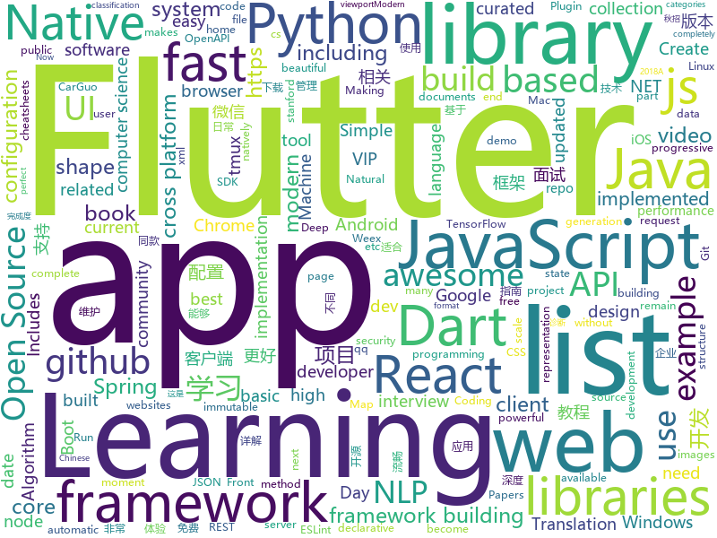

# 2018-09-16
See what the GitHub community is most excited about today.

## python
* [Python](https://github.com/TheAlgorithms/Python)(**107 stars today**): All Algorithms implemented in Python
* [xonsh](https://github.com/xonsh/xonsh)(**91 stars today**): Python-powered, cross-platform, Unix-gazing shell
* [system-design-primer](https://github.com/donnemartin/system-design-primer)(**74 stars today**): Learn how to design large-scale systems. Prep for the system design interview. Includes Anki flashcards.
* [100-Days-of-ML-Code-Chinese-Version](https://github.com/Avik-Jain/100-Days-of-ML-Code-Chinese-Version)(**66 stars today**): Chinese Translation for Machine Learning Infographics
* [cpython](https://github.com/python/cpython)(**46 stars today**): The Python programming language
* [jiant](https://github.com/jsalt18-sentence-repl/jiant)(**46 stars today**): The jiant sentence representation learning toolkit
* [models](https://github.com/tensorflow/models)(**27 stars today**): Models and examples built with TensorFlow
* [freqtrade](https://github.com/freqtrade/freqtrade)(**39 stars today**): Simple High Frequency Trading Bot for crypto currencies
* [home-assistant](https://github.com/home-assistant/home-assistant)(**34 stars today**): 🏡Open source home automation that puts local control and privacy first
* [Bowler](https://github.com/facebookincubator/Bowler)(**37 stars today**): Safe code refactoring for modern Python.
* [django](https://github.com/django/django)(**32 stars today**): The Web framework for perfectionists with deadlines.
* [youtube-dl](https://github.com/rg3/youtube-dl)(**31 stars today**): Command-line program to download videos from YouTube.com and other video sites
* [mail-security-tester](https://github.com/TKCERT/mail-security-tester)(**31 stars today**): A testing framework for mail security and filtering solutions.
* [awesome-python](https://github.com/vinta/awesome-python)(**25 stars today**): A curated list of awesome Python frameworks, libraries, software and resources
* [keras](https://github.com/keras-team/keras)(**24 stars today**): Deep Learning for humans
* [awesome-reactnative-ui](https://github.com/madhavanmalolan/awesome-reactnative-ui)(**26 stars today**): Awesome React Native UI components updated weekly
* [public-apis](https://github.com/toddmotto/public-apis)(**22 stars today**): A collective list of public JSON APIs for use in web development.
* [uplink](https://github.com/prkumar/uplink)(**23 stars today**): A Declarative HTTP Client for Python
* [odoo](https://github.com/odoo/odoo)(**22 stars today**): Odoo. Open Source Apps To Grow Your Business.
* [flask](https://github.com/pallets/flask)(**18 stars today**): The Python micro framework for building web applications.
* [fastTSNE](https://github.com/pavlin-policar/fastTSNE)(**20 stars today**): Fast, parallel implementations of tSNE
* [vid2vid](https://github.com/NVIDIA/vid2vid)(**20 stars today**): Pytorch implementation of our method for high-resolution (e.g. 2048x1024) photorealistic video-to-video translation.
* [wat-py](https://github.com/whittlbc/wat-py)(**20 stars today**): Simple interactive breakpoint library with with automatic variable injection.
* [Algorithm_Interview_Notes-Chinese](https://github.com/imhuay/Algorithm_Interview_Notes-Chinese)(**19 stars today**): 2018/2019/校招/春招/秋招/算法/机器学习(Machine Learning)/深度学习(Deep Learning)/自然语言处理(NLP)/C/C++/Python/面试笔记
* [jupytext](https://github.com/mwouts/jupytext)(**18 stars today**): Jupyter notebooks as Markdown documents, Julia, Python or R scripts

## java
* [arthas](https://github.com/alibaba/arthas)(**68 stars today**): Alibaba Java诊断利器Arthas
* [JavaGuide](https://github.com/Snailclimb/JavaGuide)(**47 stars today**): A core knowledge that most Java programmers need to master
* [proxyee-down](https://github.com/proxyee-down-org/proxyee-down)(**47 stars today**): http下载工具，基于http代理，支持多连接分块下载
* [APIJSON](https://github.com/TommyLemon/APIJSON)(**42 stars today**): 🚀后端接口和文档自动化，前端(客户端) 定制返回JSON的数据和结构！
* [java-design-patterns](https://github.com/iluwatar/java-design-patterns)(**35 stars today**): Design patterns implemented in Java
* [spring-boot](https://github.com/spring-projects/spring-boot)(**29 stars today**): Spring Boot
* [JCSprout](https://github.com/crossoverJie/JCSprout)(**24 stars today**): 👨‍🎓Java Core Sprout : basic, concurrent, algorithm
* [tink](https://github.com/google/tink)(**27 stars today**): Tink is a multi-language, cross-platform library that provides cryptographic APIs that are secure, easy to use correctly, and hard(er) to misuse.
* [spring-framework](https://github.com/spring-projects/spring-framework)(**21 stars today**): Spring Framework
* [tutorials](https://github.com/eugenp/tutorials)(**16 stars today**): The "REST With Spring" Course:
* [interviews](https://github.com/kdn251/interviews)(**21 stars today**): Everything you need to know to get the job.
* [helidon](https://github.com/oracle/helidon)(**21 stars today**): Java libraries for writing microservices
* [guava](https://github.com/google/guava)(**17 stars today**): Google core libraries for Java
* [Java](https://github.com/TheAlgorithms/Java)(**16 stars today**): All Algorithms implemented in Java
* [mit-deep-learning-book-pdf](https://github.com/janishar/mit-deep-learning-book-pdf)(**15 stars today**): MIT Deep Learning Book in PDF format (complete and parts) by Ian Goodfellow, Yoshua Bengio and Aaron Courville
* [incubator-dubbo](https://github.com/apache/incubator-dubbo)(**14 stars today**): Apache Dubbo (incubating) is a high-performance, java based, open source RPC framework.
* [elasticsearch](https://github.com/elastic/elasticsearch)(**13 stars today**): Open Source, Distributed, RESTful Search Engine
* [apollo](https://github.com/ctripcorp/apollo)(**13 stars today**): Apollo（阿波罗）是携程框架部门研发的分布式配置中心，能够集中化管理应用不同环境、不同集群的配置，配置修改后能够实时推送到应用端，并且具备规范的权限、流程治理等特性，适用于微服务配置管理场景。
* [spring-boot-examples](https://github.com/ityouknow/spring-boot-examples)(**12 stars today**): about learning Spring Boot via examples. Spring Boot 教程、技术栈示例代码，快速简单上手教程。
* [PixelShot](https://github.com/Muddz/PixelShot)(**15 stars today**): PixelShot is an awesome Android library that can save any View in your app as an image
* [vjtools](https://github.com/vipshop/vjtools)(**13 stars today**): The vip.com's java coding standard, libraries and tools
* [BackgroundLibrary](https://github.com/JavaNoober/BackgroundLibrary)(**14 stars today**): A framework for directly generating shape through Tags, no need to write shape.xml again（通过标签直接生成shape，无需再写shape.xml）
* [TonY](https://github.com/linkedin/TonY)(**14 stars today**): TensorFlow on YARN (TonY) is a framework to natively run TensorFlow on Apache Hadoop.
* [jakartaee-tck](https://github.com/eclipse-ee4j/jakartaee-tck)(**14 stars today**): Jakartaee-tck
* [weixin-java-tools](https://github.com/Wechat-Group/weixin-java-tools)(**13 stars today**): 全能微信Java开发工具包，支持包括微信支付、开放平台、小程序、企业微信/企业号和公众号等的开发

## unknown
* [pwc](https://github.com/zziz/pwc)(**321 stars today**): Papers with code. Sorted by stars. Updated weekly.
* [ToolsOfTheTrade](https://github.com/cjbarber/ToolsOfTheTrade)(**185 stars today**): Tools of The Trade, from Hacker News.
* [free-for-dev](https://github.com/ripienaar/free-for-dev)(**153 stars today**): A list of SaaS, PaaS and IaaS offerings that have free tiers of interest to devops and infradev
* [100-Days-Of-ML-Code](https://github.com/Avik-Jain/100-Days-Of-ML-Code)(**123 stars today**): 100 Days of ML Coding
* [English-level-up-tips-for-Chinese](https://github.com/byoungd/English-level-up-tips-for-Chinese)(**119 stars today**): 可能是让你受益匪浅的英语进阶指南
* [stanford-cs-229-machine-learning](https://github.com/afshinea/stanford-cs-229-machine-learning)(**79 stars today**): VIP cheatsheets for Stanford's CS 229 Machine Learning
* [CS-Notes](https://github.com/CyC2018/CS-Notes)(**67 stars today**): 📚Computer Science Learning Notes
* [You-Dont-Know-JS](https://github.com/getify/You-Dont-Know-JS)(**52 stars today**): A book series on JavaScript. @YDKJS on twitter.
* [developer-roadmap](https://github.com/kamranahmedse/developer-roadmap)(**44 stars today**): Roadmap to becoming a web developer in 2018
* [gitignore](https://github.com/github/gitignore)(**32 stars today**): A collection of useful .gitignore templates
* [coding-interview-university](https://github.com/jwasham/coding-interview-university)(**36 stars today**): A complete computer science study plan to become a software engineer.
* [free-programming-books](https://github.com/EbookFoundation/free-programming-books)(**32 stars today**): 📚Freely available programming books
* [awesome](https://github.com/sindresorhus/awesome)(**35 stars today**): 😎Curated list of awesome lists
* [project-based-learning](https://github.com/tuvtran/project-based-learning)(**24 stars today**): Curated list of project-based tutorials
* [awesome-flutter](https://github.com/Solido/awesome-flutter)(**25 stars today**): An awesome list that curates the best Flutter libraries, tools, tutorials, articles and more.
* [cheatsheet-translation](https://github.com/shervinea/cheatsheet-translation)(**21 stars today**): Translation of VIP cheatsheets https://stanford.edu/~shervine/teaching/cs-229.html
* [Java-Notes](https://github.com/PansonPanson/Java-Notes)(**24 stars today**): ⭐️⭐️计算机科学基础知识、Java开发、后端/服务端开发、面试相关⭐️⭐️
* [CS-Interview-Knowledge-Map](https://github.com/InterviewMap/CS-Interview-Knowledge-Map)(**22 stars today**): Build the best interview map. The current content includes JS, network, browser related, performance optimization, security, framework, Git, data structure, algorithm, etc.
* [science-based-games-list](https://github.com/stared/science-based-games-list)(**23 stars today**): Science-based games - a collaborative list
* [awesome-vue](https://github.com/vuejs/awesome-vue)(**22 stars today**): 🎉A curated list of awesome things related to Vue.js
* [Front-end-Developer-Interview-Questions](https://github.com/h5bp/Front-end-Developer-Interview-Questions)(**17 stars today**): A list of helpful front-end related questions you can use to interview potential candidates, test yourself or completely ignore.
* [papers-we-love](https://github.com/papers-we-love/papers-we-love)(**18 stars today**): Papers from the computer science community to read and discuss.
* [.tmux](https://github.com/gpakosz/.tmux)(**15 stars today**): Oh My Tmux! My pretty + versatile tmux configuration that just works (imho the best tmux configuration)
* [DeepInterests](https://github.com/Honlan/DeepInterests)(**15 stars today**): 深度有趣
* [trackerslist](https://github.com/ngosang/trackerslist)(**14 stars today**): An updated list of public BitTorrent trackers

## javascript
* [You-Dont-Need-Momentjs](https://github.com/you-dont-need/You-Dont-Need-Momentjs)(**610 stars today**): List of date-fns or native functions which you can use to replace moment.js + ESLint Plugin
* [nlp.js](https://github.com/axa-group/nlp.js)(**123 stars today**): An NLP library built in node over Natural, with entity extraction, sentiment analysis, automatic language identify, and so more
* [date-fns](https://github.com/date-fns/date-fns)(**119 stars today**): ⏳Modern JavaScript date utility library⌛️
* [WatermelonDB](https://github.com/Nozbe/WatermelonDB)(**111 stars today**): 🍉Next-gen database for powerful React and React Native apps that scales to 10,000s of records and remains fast⚡️
* [immer](https://github.com/mweststrate/immer)(**105 stars today**): Create the next immutable state by mutating the current one
* [tink](https://github.com/npm/tink)(**104 stars today**): a dependency unwinder for javascript
* [dayjs](https://github.com/iamkun/dayjs)(**98 stars today**): ⏰Day.js 2KB immutable date library alternative to Moment.js with the same modern API
* [pigeon-maps](https://github.com/mariusandra/pigeon-maps)(**86 stars today**): ReactJS Maps without external dependencies
* [Front-End-Checklist](https://github.com/thedaviddias/Front-End-Checklist)(**83 stars today**): 🗂The perfect Front-End Checklist for modern websites and meticulous developers
* [vue](https://github.com/vuejs/vue)(**80 stars today**): 🖖A progressive, incrementally-adoptable JavaScript framework for building UI on the web.
* [carbon](https://github.com/dawnlabs/carbon)(**67 stars today**): 🎨Create and share beautiful images of your source code
* [react](https://github.com/facebook/react)(**53 stars today**): A declarative, efficient, and flexible JavaScript library for building user interfaces.
* [iTeach](https://github.com/eryuechanghe/iTeach)(**62 stars today**): Learning and developing
* [javascript-algorithms](https://github.com/trekhleb/javascript-algorithms)(**48 stars today**): Algorithms and data structures implemented in JavaScript with explanations and links to further readings
* [axios](https://github.com/axios/axios)(**48 stars today**): Promise based HTTP client for the browser and node.js
* [re-consent](https://github.com/cliqz-oss/re-consent)(**45 stars today**): 
* [create-react-app](https://github.com/facebook/create-react-app)(**39 stars today**): Create React apps with no build configuration.
* [birdseye](https://github.com/alexmojaki/birdseye)(**43 stars today**): Quick, convenient, expression-centric, graphical Python debugger using the AST
* [highway](https://github.com/Dogstudio/highway)(**43 stars today**): Highway helps you manage your page transitions
* [RSSHub](https://github.com/DIYgod/RSSHub)(**39 stars today**): 🍰万物皆可 RSS
* [You-Dont-Need-Lodash-Underscore](https://github.com/you-dont-need/You-Dont-Need-Lodash-Underscore)(**39 stars today**): List of JavaScript methods which you can use natively + ESLint Plugin
* [WebSiteUseful](https://github.com/loremwalker/WebSiteUseful)(**34 stars today**): 🍅翻墙！科学上网，免费ss帐号分享、ssr订阅源，免费VPN下载，获取及使用教程请看：https://github.com/loremwalker/fq-book
* [windows95](https://github.com/felixrieseberg/windows95)(**37 stars today**): 💩🚀Windows 95 in Electron. Runs on macOS, Linux, and Windows.
* [lowjs](https://github.com/neonious/lowjs)(**35 stars today**): A port of Node.JS with far lower system requirements. Community version for POSIX systems such as Linux, uClinux or Mac OS X.
* [react-native](https://github.com/facebook/react-native)(**31 stars today**): A framework for building native apps with React.

## html
* [python-vs-javascript](https://github.com/sayazamurai/python-vs-javascript)(**62 stars today**): 
* [inpycon2018](https://github.com/pythonindia/inpycon2018)(**39 stars today**): PyCon India 2018 site
* [capacitor](https://github.com/ionic-team/capacitor)(**21 stars today**): Build cross-platform Native Progressive Web Apps for iOS, Android, and the web⚡️
* [trashy.css](https://github.com/t7/trashy.css)(**19 stars today**): Trashy.css - The throwaway CSS library with no `class`.
* [sal](https://github.com/mciastek/sal)(**15 stars today**): 🚀Performance focused, lightweight scroll animation library🚀
* [awesome-mac](https://github.com/jaywcjlove/awesome-mac)(**14 stars today**):  Now we have become very big, Different from the original idea. Collect premium software in various categories.
* [fastText](https://github.com/facebookresearch/fastText)(**11 stars today**): Library for fast text representation and classification.
* [styleguide](https://github.com/google/styleguide)(**9 stars today**): Style guides for Google-originated open-source projects
* [JavaScript30](https://github.com/wesbos/JavaScript30)(**8 stars today**): 30 Day Vanilla JS Challenge
* [talks](https://github.com/pydelhi/talks)(****): Talks at Python Delhi User Group
* [vertical-center](https://github.com/yanhaijing/vertical-center)(**11 stars today**): 水平垂直居中，这是一道面试必考题，^_^
* [openapi-generator](https://github.com/OpenAPITools/openapi-generator)(**10 stars today**): OpenAPI Generator allows generation of API client libraries (SDK generation), server stubs, documentation and configuration automatically given an OpenAPI Spec (v2, v3)
* [dotnet](https://github.com/Microsoft/dotnet)(**10 stars today**): This repo is the official home of .NET on GitHub. It's a great starting point to find many .NET OSS projects from Microsoft and the community, including many that are part of the .NET Foundation.
* [portainer](https://github.com/portainer/portainer)(**9 stars today**): Simple management UI for Docker
* [gentelella](https://github.com/puikinsh/gentelella)(**9 stars today**): Free Bootstrap 3 Admin Template
* [Spoon-Knife](https://github.com/octocat/Spoon-Knife)(****): This repo is for demonstration purposes only.
* [frontend](https://github.com/guardian/frontend)(**8 stars today**): Source for theguardian.com
* [Publii](https://github.com/GetPublii/Publii)(**7 stars today**): Publii is a desktop-based CMS for Windows and Mac that makes creating static websites fast and hassle-free, even for beginners.
* [NLP-progress](https://github.com/sebastianruder/NLP-progress)(**7 stars today**): Repository to track the progress in Natural Language Processing (NLP), including the datasets and the current state-of-the-art for the most common NLP tasks.
* [fonts](https://github.com/google/fonts)(**6 stars today**): Font files available from Google Fonts
* [ecma262](https://github.com/tc39/ecma262)(**6 stars today**): Status, process, and documents for ECMA262
* [lazyestload.js](https://github.com/Paul-Browne/lazyestload.js)(**6 stars today**): load images only when they are in (and remain in) the viewport
* [javascript-tutorial-en](https://github.com/iliakan/javascript-tutorial-en)(**5 stars today**): Modern JavaScript Tutorial
* [react-app-rewired](https://github.com/timarney/react-app-rewired)(**5 stars today**): Override create-react-app webpack configs without ejecting
* [patchwork](https://github.com/jlord/patchwork)(****): All the Git-it Workshop completers!

## dart
* [flutter](https://github.com/flutter/flutter)(**33 stars today**): Flutter makes it easy and fast to build beautiful mobile apps.
* [GSYGithubAppFlutter](https://github.com/CarGuo/GSYGithubAppFlutter)(**10 stars today**): 超完整的Flutter项目，功能丰富，适合学习和日常使用。GSYGithubApp系列的优势：我们目前已经拥有Flutter、Weex、ReactNative三个版本。 功能齐全，项目框架内技术涉及面广，完成度高，持续维护，配套文章，适合全面学习，跨框架对比参考。跨平台的开源Github客户端App，更好的体验，更丰富的功能，旨在更好的日常管理和维护个人Github，提供更好更方便的驾车体验～～Σ(￣。￣ﾉ)ﾉ。同款Weex版本 ： https://github.com/CarGuo/GSYGithubAppWeex 、同款React Native版本 ： https://github.com/CarGuo/GSYGithubApp
* [TheGorgeousLogin](https://github.com/huextrat/TheGorgeousLogin)(**9 stars today**): Login page built with @flutter😍
* [plugins](https://github.com/flutter/plugins)(**7 stars today**): Plugins for Flutter, including FlutterFire, maintained by the Flutter team
* [Flutter-learning](https://github.com/AweiLoveAndroid/Flutter-learning)(**6 stars today**): 🔥👍🌟⭐️⭐️⭐️Flutter从配置安装到填坑指南详解，Flutter相关Demo解读，项目实例，Dart语法详解
* [samples](https://github.com/flutter/samples)(**6 stars today**): A collection of Flutter examples and demos.
* [sdk](https://github.com/dart-lang/sdk)(**5 stars today**): The Dart SDK, including the VM, dart2js, core libraries, and more.
* [PullToRefresh](https://github.com/baoolong/PullToRefresh)(**5 stars today**): Flutter相关的项目QQ:277155832 Email:277155832@qq.com
* [http](https://github.com/dart-lang/http)(****): A composable API for making HTTP requests in Dart.
* [chromedeveditor](https://github.com/googlearchive/chromedeveditor)(****): Chrome Dev Editor is a developer tool for building apps on the Chrome platform - Chrome Apps and Web Apps, in JavaScript or Dart. (NO LONGER IN ACTIVE DEVELOPMENT)
* [flutter-osc](https://github.com/yubo725/flutter-osc)(****): 基于Google Flutter的开源中国客户端，支持Android和iOS。
* [flutter-examples](https://github.com/nisrulz/flutter-examples)(****): [Examples] Simple basic isolated apps, for budding flutter devs.
* [inKino](https://github.com/roughike/inKino)(****): inKino - A cross platform movie and showtime browser for Finnkino cinemas, made with Flutter.
* [Flutter-UI-Kit](https://github.com/iampawan/Flutter-UI-Kit)(****): Flutter app for collection of UI in a UIKit
* [flutter_architecture_samples](https://github.com/brianegan/flutter_architecture_samples)(****): TodoMVC for Flutter
* [hauberk](https://github.com/munificent/hauberk)(****): A web-based roguelike written in Dart.
* [FlutterExampleApps](https://github.com/iampawan/FlutterExampleApps)(****): [Example APPS] Basic Flutter apps, for flutter devs.
* [dio](https://github.com/flutterchina/dio)(****): A powerful Http client for Dart, which supports Interceptors, FormData, Request Cancellation, File Downloading, Timeout etc.
* [angular](https://github.com/dart-lang/angular)(****): Fast and productive web framework provided by Dart
* [zhihu-flutter](https://github.com/HackSoul/zhihu-flutter)(****): Flutter 高仿知乎 UI，非常漂亮，也非常流畅，flutter build apk 或 flutter build ios 之后更流畅
* [StageXL](https://github.com/bp74/StageXL)(****): A fast and universal 2D rendering engine for HTML5 and Dart.
* [dart-sass](https://github.com/sass/dart-sass)(****): A Dart implementation of Sass.
* [github-issue-mover](https://github.com/google/github-issue-mover)(****): Making it easy to migrate issues between repos.
* [rxdart](https://github.com/ReactiveX/rxdart)(****): The Reactive Extensions for Dart
* [aqueduct](https://github.com/stablekernel/aqueduct)(****): Dart HTTP server framework for building REST APIs. Includes PostgreSQL ORM and OAuth2 provider.

## WordCloud

