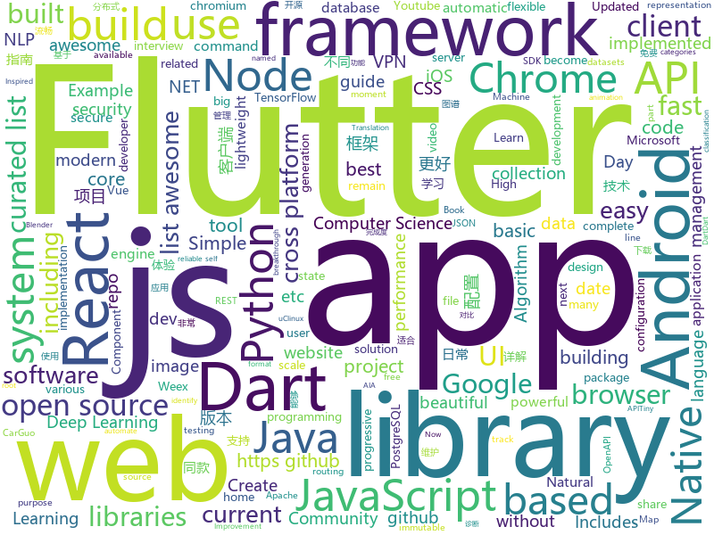

# 2018-09-17
See what the GitHub community is most excited about today.

## python
* [Python](https://github.com/TheAlgorithms/Python)(**130 stars today**): All Algorithms implemented in Python
* [100-Days-of-ML-Code-Chinese-Version](https://github.com/Avik-Jain/100-Days-of-ML-Code-Chinese-Version)(**85 stars today**): Chinese Translation for Machine Learning Infographics
* [system-design-primer](https://github.com/donnemartin/system-design-primer)(**81 stars today**): Learn how to design large-scale systems. Prep for the system design interview. Includes Anki flashcards.
* [freqtrade](https://github.com/freqtrade/freqtrade)(**52 stars today**): Simple High Frequency Trading Bot for crypto currencies
* [models](https://github.com/tensorflow/models)(**30 stars today**): Models and examples built with TensorFlow
* [electrum](https://github.com/spesmilo/electrum)(**38 stars today**): Electrum; Bitcoin thin client
* [datasets](https://github.com/tensorflow/datasets)(**37 stars today**): A collection of datasets ready to use with TensorFlow
* [home-assistant](https://github.com/home-assistant/home-assistant)(**31 stars today**): 🏡Open source home automation that puts local control and privacy first
* [youtube-dl](https://github.com/rg3/youtube-dl)(**32 stars today**): Command-line program to download videos from YouTube.com and other video sites
* [mail-security-tester](https://github.com/TKCERT/mail-security-tester)(**32 stars today**): A testing framework for mail security and filtering solutions.
* [xonsh](https://github.com/xonsh/xonsh)(**32 stars today**): Python-powered, cross-platform, Unix-gazing shell
* [django](https://github.com/django/django)(**26 stars today**): The Web framework for perfectionists with deadlines.
* [jr](https://github.com/RoboJackets/jr)(**19 stars today**): Putting the "train" in training
* [public-apis](https://github.com/toddmotto/public-apis)(**26 stars today**): A collective list of public JSON APIs for use in web development.
* [keras](https://github.com/keras-team/keras)(**17 stars today**): Deep Learning for humans
* [face_recognition](https://github.com/ageitgey/face_recognition)(**19 stars today**): The world's simplest facial recognition api for Python and the command line
* [netbox](https://github.com/digitalocean/netbox)(**22 stars today**): IP address management (IPAM) and data center infrastructure management (DCIM) tool.
* [Blender-For-UnrealEngine-Addons](https://github.com/xavier150/Blender-For-UnrealEngine-Addons)(**22 stars today**): I have created this addons for export asset from Blender to Unreal Engine 4
* [awesome-reactnative-ui](https://github.com/madhavanmalolan/awesome-reactnative-ui)(**19 stars today**): Awesome React Native UI components updated weekly
* [jiant](https://github.com/jsalt18-sentence-repl/jiant)(**19 stars today**): The jiant sentence representation learning toolkit
* [awesome-python](https://github.com/vinta/awesome-python)(**15 stars today**): A curated list of awesome Python frameworks, libraries, software and resources
* [odoo](https://github.com/odoo/odoo)(**14 stars today**): Odoo. Open Source Apps To Grow Your Business.
* [ambassador](https://github.com/datawire/ambassador)(**18 stars today**): open source Kubernetes-native API gateway for microservices built on the Envoy Proxy
* [cpython](https://github.com/python/cpython)(**12 stars today**): The Python programming language
* [data-science-ipython-notebooks](https://github.com/donnemartin/data-science-ipython-notebooks)(**16 stars today**): Data science Python notebooks: Deep learning (TensorFlow, Theano, Caffe, Keras), scikit-learn, Kaggle, big data (Spark, Hadoop MapReduce, HDFS), matplotlib, pandas, NumPy, SciPy, Python essentials, AWS, and various command lines.

## java
* [arthas](https://github.com/alibaba/arthas)(**192 stars today**): Alibaba Java诊断利器Arthas
* [proxyee-down](https://github.com/proxyee-down-org/proxyee-down)(**49 stars today**): http下载工具，基于http代理，支持多连接分块下载
* [JavaGuide](https://github.com/Snailclimb/JavaGuide)(**41 stars today**): A core knowledge that most Java programmers need to master
* [java-design-patterns](https://github.com/iluwatar/java-design-patterns)(**38 stars today**): Design patterns implemented in Java
* [JCSprout](https://github.com/crossoverJie/JCSprout)(**29 stars today**): 👨‍🎓Java Core Sprout : basic, concurrent, algorithm
* [spring-boot](https://github.com/spring-projects/spring-boot)(**25 stars today**): Spring Boot
* [tink](https://github.com/google/tink)(**26 stars today**): Tink is a multi-language, cross-platform library that provides cryptographic APIs that are secure, easy to use correctly, and hard(er) to misuse.
* [Java](https://github.com/TheAlgorithms/Java)(**23 stars today**): All Algorithms implemented in Java
* [PixelShot](https://github.com/Muddz/PixelShot)(**26 stars today**): PixelShot is an awesome Android library that can save any View in your app as an image
* [elasticsearch](https://github.com/elastic/elasticsearch)(**18 stars today**): Open Source, Distributed, RESTful Search Engine
* [spring-framework](https://github.com/spring-projects/spring-framework)(**16 stars today**): Spring Framework
* [EasyTransaction](https://github.com/QNJR-GROUP/EasyTransaction)(**18 stars today**): A distribute transaction solution（分布式事务） unified the usage of TCC , SAGA , reliable message, compensate and so on;
* [okhttp](https://github.com/square/okhttp)(**18 stars today**): An HTTP+HTTP/2 client for Android and Java applications.
* [incubator-dubbo](https://github.com/apache/incubator-dubbo)(**13 stars today**): Apache Dubbo (incubating) is a high-performance, java based, open source RPC framework.
* [VirtualXposed](https://github.com/android-hacker/VirtualXposed)(**16 stars today**): A simple app to use Xposed without root, unlock the bootloader or modify system image, etc.
* [tutorials](https://github.com/eugenp/tutorials)(**10 stars today**): The "REST With Spring" Course:
* [guava](https://github.com/google/guava)(**12 stars today**): Google core libraries for Java
* [mit-deep-learning-book-pdf](https://github.com/janishar/mit-deep-learning-book-pdf)(**15 stars today**): MIT Deep Learning Book in PDF format (complete and parts) by Ian Goodfellow, Yoshua Bengio and Aaron Courville
* [apollo](https://github.com/ctripcorp/apollo)(**13 stars today**): Apollo（阿波罗）是携程框架部门研发的分布式配置中心，能够集中化管理应用不同环境、不同集群的配置，配置修改后能够实时推送到应用端，并且具备规范的权限、流程治理等特性，适用于微服务配置管理场景。
* [firebase-android-sdk](https://github.com/firebase/firebase-android-sdk)(**15 stars today**): Firebase Android SDK
* [NewPipe](https://github.com/TeamNewPipe/NewPipe)(**14 stars today**): A lightweight Youtube frontend for Android.
* [Magisk](https://github.com/topjohnwu/Magisk)(**13 stars today**): A Magic Mask to Alter Android System Systemless-ly
* [kafka](https://github.com/apache/kafka)(**13 stars today**): Mirror of Apache Kafka
* [APIJSON](https://github.com/TommyLemon/APIJSON)(**13 stars today**): 🚀后端接口和文档自动化，前端(客户端) 定制返回JSON的数据和结构！
* [retrofit](https://github.com/square/retrofit)(**13 stars today**): Type-safe HTTP client for Android and Java by Square, Inc.

## unknown
* [pwc](https://github.com/zziz/pwc)(**267 stars today**): Papers with code. Sorted by stars. Updated weekly.
* [ToolsOfTheTrade](https://github.com/cjbarber/ToolsOfTheTrade)(**180 stars today**): Tools of The Trade, from Hacker News.
* [100-Days-Of-ML-Code](https://github.com/Avik-Jain/100-Days-Of-ML-Code)(**125 stars today**): 100 Days of ML Coding
* [stanford-cs-229-machine-learning](https://github.com/afshinea/stanford-cs-229-machine-learning)(**116 stars today**): VIP cheatsheets for Stanford's CS 229 Machine Learning
* [free-for-dev](https://github.com/ripienaar/free-for-dev)(**116 stars today**): A list of SaaS, PaaS and IaaS offerings that have free tiers of interest to devops and infradev
* [English-level-up-tips-for-Chinese](https://github.com/byoungd/English-level-up-tips-for-Chinese)(**93 stars today**): 可能是让你受益匪浅的英语进阶指南
* [CS-Notes](https://github.com/CyC2018/CS-Notes)(**63 stars today**): 📚Computer Science Learning Notes
* [awesome](https://github.com/sindresorhus/awesome)(**54 stars today**): 😎Curated list of awesome lists
* [DeepInterests](https://github.com/Honlan/DeepInterests)(**52 stars today**): 深度有趣
* [You-Dont-Know-JS](https://github.com/getify/You-Dont-Know-JS)(**43 stars today**): A book series on JavaScript. @YDKJS on twitter.
* [project-based-learning](https://github.com/tuvtran/project-based-learning)(**34 stars today**): Curated list of project-based tutorials
* [gitignore](https://github.com/github/gitignore)(**27 stars today**): A collection of useful .gitignore templates
* [free-programming-books](https://github.com/EbookFoundation/free-programming-books)(**28 stars today**): 📚Freely available programming books
* [coding-interview-university](https://github.com/jwasham/coding-interview-university)(**25 stars today**): A complete computer science study plan to become a software engineer.
* [build-your-own-x](https://github.com/danistefanovic/build-your-own-x)(**30 stars today**): 🤓Build your own (insert technology here)
* [CS-Interview-Knowledge-Map](https://github.com/InterviewMap/CS-Interview-Knowledge-Map)(**28 stars today**): Build the best interview map. The current content includes JS, network, browser related, performance optimization, security, framework, Git, data structure, algorithm, etc.
* [awesome-vue](https://github.com/vuejs/awesome-vue)(**26 stars today**): 🎉A curated list of awesome things related to Vue.js
* [WebSiteUseful](https://github.com/loremwalker/WebSiteUseful)(**25 stars today**): 🍅翻墙！科学上网，免费ss帐号分享、ssr订阅源，免费VPN下载，获取及使用教程请看：https://github.com/loremwalker/fq-book
* [MangaCraft](https://github.com/lllyasviel/MangaCraft)(**28 stars today**): The current best semi-automatic manga colorization project on earth.
* [summer-2019-internships](https://github.com/christine-hu/summer-2019-internships)(**23 stars today**): A document to help undergraduates keep track of software engineering internship opportunities.
* [computer-science](https://github.com/ossu/computer-science)(**20 stars today**): 🎓Path to a free self-taught education in Computer Science!
* [awesome-flutter](https://github.com/Solido/awesome-flutter)(**19 stars today**): An awesome list that curates the best Flutter libraries, tools, tutorials, articles and more.
* [awesome-remote-job](https://github.com/lukasz-madon/awesome-remote-job)(**18 stars today**): A curated list of awesome remote jobs and resources. Inspired by https://github.com/vinta/awesome-python
* [architect-awesome](https://github.com/xingshaocheng/architect-awesome)(**17 stars today**): 后端架构师技术图谱
* [awesome-nodejs](https://github.com/sindresorhus/awesome-nodejs)(**14 stars today**): ⚡️Delightful Node.js packages and resources

## javascript
* [You-Dont-Need-Momentjs](https://github.com/you-dont-need/You-Dont-Need-Momentjs)(**266 stars today**): List of date-fns or native functions which you can use to replace moment.js + ESLint Plugin
* [wwwbasic](https://github.com/google/wwwbasic)(**205 stars today**): WWWBasic is an implementation of BASIC (Beginner's All-purpose Symbolic Instruction Code) designed to be easy to run on the Web.
* [nlp.js](https://github.com/axa-group/nlp.js)(**96 stars today**): An NLP library built in node over Natural, with entity extraction, sentiment analysis, automatic language identify, and so more
* [lowjs](https://github.com/neonious/lowjs)(**96 stars today**): A port of Node.JS with far lower system requirements. Community version for POSIX systems such as Linux, uClinux or Mac OS X.
* [WatermelonDB](https://github.com/Nozbe/WatermelonDB)(**86 stars today**): 🍉Next-gen database for powerful React and React Native apps that scales to 10,000s of records and remains fast⚡️
* [Front-End-Checklist](https://github.com/thedaviddias/Front-End-Checklist)(**72 stars today**): 🗂The perfect Front-End Checklist for modern websites and meticulous developers
* [dayjs](https://github.com/iamkun/dayjs)(**72 stars today**): ⏰Day.js 2KB immutable date library alternative to Moment.js with the same modern API
* [vue](https://github.com/vuejs/vue)(**65 stars today**): 🖖A progressive, incrementally-adoptable JavaScript framework for building UI on the web.
* [date-fns](https://github.com/date-fns/date-fns)(**69 stars today**): ⏳Modern JavaScript date utility library⌛️
* [immer](https://github.com/mweststrate/immer)(**62 stars today**): Create the next immutable state by mutating the current one
* [pigeon-maps](https://github.com/mariusandra/pigeon-maps)(**54 stars today**): ReactJS Maps without external dependencies
* [dom-testing-library-with-anything](https://github.com/kentcdodds/dom-testing-library-with-anything)(**47 stars today**): you can use dom-testing-library with anything that renders to the DOM
* [tink](https://github.com/npm/tink)(**50 stars today**): a dependency unwinder for javascript
* [create-react-app](https://github.com/facebook/create-react-app)(**38 stars today**): Create React apps with no build configuration.
* [opensource.guide](https://github.com/github/opensource.guide)(**43 stars today**): Community guides for open source creators
* [axios](https://github.com/axios/axios)(**40 stars today**): Promise based HTTP client for the browser and node.js
* [react](https://github.com/facebook/react)(**35 stars today**): A declarative, efficient, and flexible JavaScript library for building user interfaces.
* [node](https://github.com/nodejs/node)(**32 stars today**): Node.js JavaScript runtime✨🐢🚀✨
* [vuetify](https://github.com/vuetifyjs/vuetify)(**37 stars today**): Material Component Framework for Vue.js 2
* [puppeteer](https://github.com/GoogleChrome/puppeteer)(**32 stars today**): Headless Chrome Node API
* [ky](https://github.com/sindresorhus/ky)(**33 stars today**): Tiny and elegant HTTP client based on the browser Fetch API
* [taiko](https://github.com/getgauge/taiko)(**32 stars today**): A node.js library to automate chrome/chromium browser
* [ailab](https://github.com/Microsoft/ailab)(**29 stars today**): Experience, Learn and Code the latest breakthrough innovations with Microsoft AI
* [PostGUI](https://github.com/priyank-purohit/PostGUI)(**29 stars today**): A React web application to query and share any PostgreSQL database.
* [carbon](https://github.com/dawnlabs/carbon)(**25 stars today**): 🎨Create and share beautiful images of your source code

## html
* [python-vs-javascript](https://github.com/sayazamurai/python-vs-javascript)(**25 stars today**): 
* [frontend](https://github.com/guardian/frontend)(**21 stars today**): Source for theguardian.com
* [JavaScript30](https://github.com/wesbos/JavaScript30)(**12 stars today**): 30 Day Vanilla JS Challenge
* [awesome-mac](https://github.com/jaywcjlove/awesome-mac)(**17 stars today**):  Now we have become very big, Different from the original idea. Collect premium software in various categories.
* [sal](https://github.com/mciastek/sal)(**17 stars today**): 🚀Performance focused, lightweight scroll animation library🚀
* [styleguide](https://github.com/google/styleguide)(**14 stars today**): Style guides for Google-originated open-source projects
* [capacitor](https://github.com/ionic-team/capacitor)(**16 stars today**): Build cross-platform Native Progressive Web Apps for iOS, Android, and the web⚡️
* [trashy.css](https://github.com/t7/trashy.css)(**15 stars today**): Trashy.css - The throwaway CSS library with no `class`.
* [Spoon-Knife](https://github.com/octocat/Spoon-Knife)(****): This repo is for demonstration purposes only.
* [portainer](https://github.com/portainer/portainer)(**10 stars today**): Simple management UI for Docker
* [react-app-rewired](https://github.com/timarney/react-app-rewired)(**10 stars today**): Override create-react-app webpack configs without ejecting
* [lazyestload.js](https://github.com/Paul-Browne/lazyestload.js)(**9 stars today**): load images only when they are in (and remain in) the viewport
* [performance-handbook](https://github.com/dwango-js/performance-handbook)(**8 stars today**): Webフロントエンド パフォーマンス改善ハンドブック
* [EIPs](https://github.com/ethereum/EIPs)(**5 stars today**): The Ethereum Improvement Proposal repository
* [fastText](https://github.com/facebookresearch/fastText)(**7 stars today**): Library for fast text representation and classification.
* [dotnet](https://github.com/Microsoft/dotnet)(**6 stars today**): This repo is the official home of .NET on GitHub. It's a great starting point to find many .NET OSS projects from Microsoft and the community, including many that are part of the .NET Foundation.
* [fonts](https://github.com/google/fonts)(**7 stars today**): Font files available from Google Fonts
* [NLP-progress](https://github.com/sebastianruder/NLP-progress)(**7 stars today**): Repository to track the progress in Natural Language Processing (NLP), including the datasets and the current state-of-the-art for the most common NLP tasks.
* [smart-contract-best-practices](https://github.com/ConsenSys/smart-contract-best-practices)(**6 stars today**): A guide to smart contract security best practices
* [hugo-academic](https://github.com/gcushen/hugo-academic)(**6 stars today**): The website designer for Hugo. Build and deploy a beautiful website in minutes🚀
* [pure](https://github.com/pure-css/pure)(**6 stars today**): A set of small, responsive CSS modules that you can use in every web project.
* [openapi-generator](https://github.com/OpenAPITools/openapi-generator)(**6 stars today**): OpenAPI Generator allows generation of API client libraries (SDK generation), server stubs, documentation and configuration automatically given an OpenAPI Spec (v2, v3)
* [skill-map](https://github.com/TeamStuQ/skill-map)(**5 stars today**): 程序员技能图谱
* [chrome](https://github.com/free-vpn/chrome)(**5 stars today**): VPN Chrome is Google Chromium based browser with built-in VPN capability to let users surf the Internet in a secure and private way.
* [highcharts](https://github.com/highcharts/highcharts)(**5 stars today**): Highcharts JS, the JavaScript charting framework

## dart
* [flutter](https://github.com/flutter/flutter)(**42 stars today**): Flutter makes it easy and fast to build beautiful mobile apps.
* [GSYGithubAppFlutter](https://github.com/CarGuo/GSYGithubAppFlutter)(**21 stars today**): 超完整的Flutter项目，功能丰富，适合学习和日常使用。GSYGithubApp系列的优势：我们目前已经拥有Flutter、Weex、ReactNative三个版本。 功能齐全，项目框架内技术涉及面广，完成度高，持续维护，配套文章，适合全面学习，跨框架对比参考。跨平台的开源Github客户端App，更好的体验，更丰富的功能，旨在更好的日常管理和维护个人Github，提供更好更方便的驾车体验～～Σ(￣。￣ﾉ)ﾉ。同款Weex版本 ： https://github.com/CarGuo/GSYGithubAppWeex 、同款React Native版本 ： https://github.com/CarGuo/GSYGithubApp
* [TheGorgeousLogin](https://github.com/huextrat/TheGorgeousLogin)(**10 stars today**): Login page built with @flutter😍
* [Flutter-learning](https://github.com/AweiLoveAndroid/Flutter-learning)(**6 stars today**): 🔥👍🌟⭐️⭐️⭐️Flutter从配置安装到填坑指南详解，Flutter相关Demo解读，项目实例，Dart语法详解
* [plugins](https://github.com/flutter/plugins)(**6 stars today**): Plugins for Flutter, including FlutterFire, maintained by the Flutter team
* [sdk](https://github.com/dart-lang/sdk)(**5 stars today**): The Dart SDK, including the VM, dart2js, core libraries, and more.
* [rethinkdb](https://github.com/billysometimes/rethinkdb)(****): dart driver for rethinkDB
* [CountryCodePicker](https://github.com/Salvatore-Giordano/CountryCodePicker)(****): A flutter package for showing a country code selector.
* [chromedeveditor](https://github.com/googlearchive/chromedeveditor)(****): Chrome Dev Editor is a developer tool for building apps on the Chrome platform - Chrome Apps and Web Apps, in JavaScript or Dart. (NO LONGER IN ACTIVE DEVELOPMENT)
* [flutter-osc](https://github.com/yubo725/flutter-osc)(****): 基于Google Flutter的开源中国客户端，支持Android和iOS。
* [flutter-examples](https://github.com/nisrulz/flutter-examples)(****): [Examples] Simple basic isolated apps, for budding flutter devs.
* [inKino](https://github.com/roughike/inKino)(****): inKino - A cross platform movie and showtime browser for Finnkino cinemas, made with Flutter.
* [Flutter-UI-Kit](https://github.com/iampawan/Flutter-UI-Kit)(****): Flutter app for collection of UI in a UIKit
* [flutter_architecture_samples](https://github.com/brianegan/flutter_architecture_samples)(****): TodoMVC for Flutter
* [hauberk](https://github.com/munificent/hauberk)(****): A web-based roguelike written in Dart.
* [FlutterExampleApps](https://github.com/iampawan/FlutterExampleApps)(****): [Example APPS] Basic Flutter apps, for flutter devs.
* [dio](https://github.com/flutterchina/dio)(****): A powerful Http client for Dart, which supports Interceptors, FormData, Request Cancellation, File Downloading, Timeout etc.
* [angular](https://github.com/dart-lang/angular)(****): Fast and productive web framework provided by Dart
* [zhihu-flutter](https://github.com/HackSoul/zhihu-flutter)(****): Flutter 高仿知乎 UI，非常漂亮，也非常流畅，flutter build apk 或 flutter build ios 之后更流畅
* [StageXL](https://github.com/bp74/StageXL)(****): A fast and universal 2D rendering engine for HTML5 and Dart.
* [dart-sass](https://github.com/sass/dart-sass)(****): A Dart implementation of Sass.
* [github-issue-mover](https://github.com/google/github-issue-mover)(****): Making it easy to migrate issues between repos.
* [rxdart](https://github.com/ReactiveX/rxdart)(****): The Reactive Extensions for Dart
* [aqueduct](https://github.com/stablekernel/aqueduct)(****): Dart HTTP server framework for building REST APIs. Includes PostgreSQL ORM and OAuth2 provider.
* [fluro](https://github.com/theyakka/fluro)(****): Fluro is a Flutter routing library that adds flexible routing options like wildcards, named parameters and clear route definitions.

## WordCloud

