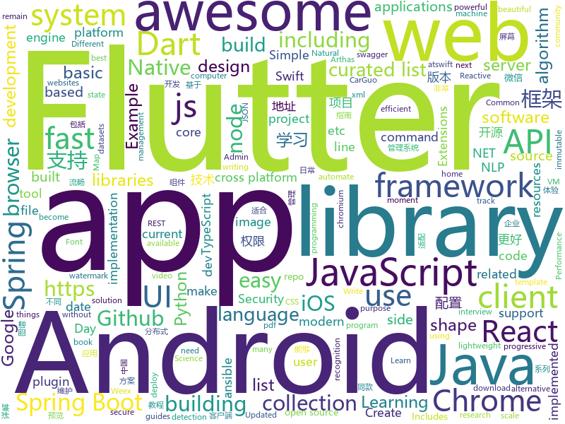

# 2018-09-18
See what the GitHub community is most excited about today.

## python
* [system-design-primer](https://github.com/donnemartin/system-design-primer)(**271 stars today**): Learn how to design large-scale systems. Prep for the system design interview. Includes Anki flashcards.
* [Python](https://github.com/TheAlgorithms/Python)(**212 stars today**): All Algorithms implemented in Python
* [models](https://github.com/tensorflow/models)(**55 stars today**): Models and examples built with TensorFlow
* [SprayingToolkit](https://github.com/byt3bl33d3r/SprayingToolkit)(**52 stars today**): Scripts to make password spraying attacks against Lync/S4B & OWA a lot quicker, less painful and more efficient.
* [awesome-reactnative-ui](https://github.com/madhavanmalolan/awesome-reactnative-ui)(**52 stars today**): Awesome React Native UI components updated weekly
* [awesome-python](https://github.com/vinta/awesome-python)(**44 stars today**): A curated list of awesome Python frameworks, libraries, software and resources
* [notation](https://github.com/hoffa/notation)(**46 stars today**): 🎵Simplified music notation
* [pipenv](https://github.com/pypa/pipenv)(**42 stars today**): Python Development Workflow for Humans.
* [datasets](https://github.com/tensorflow/datasets)(**45 stars today**): A collection of datasets ready to use with TensorFlow
* [cpython](https://github.com/python/cpython)(**34 stars today**): The Python programming language
* [electrum](https://github.com/spesmilo/electrum)(**43 stars today**): Electrum; Bitcoin thin client
* [face_recognition](https://github.com/ageitgey/face_recognition)(**37 stars today**): The world's simplest facial recognition api for Python and the command line
* [home-assistant](https://github.com/home-assistant/home-assistant)(**34 stars today**): 🏡Open source home automation that puts local control and privacy first
* [keras](https://github.com/keras-team/keras)(**32 stars today**): Deep Learning for humans
* [youtube-dl](https://github.com/rg3/youtube-dl)(**32 stars today**): Command-line program to download videos from YouTube.com and other video sites
* [flask](https://github.com/pallets/flask)(**32 stars today**): The Python micro framework for building web applications.
* [Blender-For-UnrealEngine-Addons](https://github.com/xavier150/Blender-For-UnrealEngine-Addons)(**33 stars today**): I have created this addons for export asset from Blender to Unreal Engine 4
* [segmentation_models](https://github.com/qubvel/segmentation_models)(**30 stars today**): Segmentation models with pretrained backbones. Keras.
* [public-apis](https://github.com/toddmotto/public-apis)(**29 stars today**): A collective list of public JSON APIs for use in web development.
* [Detectron](https://github.com/facebookresearch/Detectron)(**24 stars today**): FAIR's research platform for object detection research, implementing popular algorithms like Mask R-CNN and RetinaNet.
* [ansible](https://github.com/ansible/ansible)(**23 stars today**): Ansible is a radically simple IT automation platform that makes your applications and systems easier to deploy. Avoid writing scripts or custom code to deploy and update your applications — automate in a language that approaches plain English, using SSH, with no agents to install on remote systems. https://docs.ansible.com/ansible/
* [fastTSNE](https://github.com/pavlin-policar/fastTSNE)(**27 stars today**): Fast, parallel implementations of tSNE
* [jieba](https://github.com/fxsjy/jieba)(**24 stars today**): 结巴中文分词
* [scikit-learn](https://github.com/scikit-learn/scikit-learn)(**23 stars today**): scikit-learn: machine learning in Python
* [httpie](https://github.com/jakubroztocil/httpie)(****): Modern command line HTTP client – user-friendly curl alternative with intuitive UI, JSON support, syntax highlighting, wget-like downloads, extensions, etc. https://httpie.org

## java
* [arthas](https://github.com/alibaba/arthas)(**911 stars today**): Alibaba Java Diagnostic Tool Arthas/Alibaba Java诊断利器Arthas
* [SpringAll](https://github.com/wuyouzhuguli/SpringAll)(**188 stars today**): 循序渐进，学习Spring Boot、Spring Boot & Shiro、Spring Cloud和Spring Security，博客Spring系列源码
* [JavaGuide](https://github.com/Snailclimb/JavaGuide)(**115 stars today**): A core knowledge that most Java programmers need to master
* [proxyee-down](https://github.com/proxyee-down-org/proxyee-down)(**77 stars today**): http下载工具，基于http代理，支持多连接分块下载
* [java-design-patterns](https://github.com/iluwatar/java-design-patterns)(**65 stars today**): Design patterns implemented in Java
* [JCSprout](https://github.com/crossoverJie/JCSprout)(**52 stars today**): 👨‍🎓Java Core Sprout : basic, concurrent, algorithm
* [elasticsearch](https://github.com/elastic/elasticsearch)(**45 stars today**): Open Source, Distributed, RESTful Search Engine
* [tink](https://github.com/google/tink)(**52 stars today**): Tink is a multi-language, cross-platform library that provides cryptographic APIs that are secure, easy to use correctly, and hard(er) to misuse.
* [spring-boot](https://github.com/spring-projects/spring-boot)(**39 stars today**): Spring Boot
* [Java](https://github.com/TheAlgorithms/Java)(**39 stars today**): All Algorithms implemented in Java
* [apollo](https://github.com/ctripcorp/apollo)(**36 stars today**): Apollo（阿波罗）是携程框架部门研发的分布式配置中心，能够集中化管理应用不同环境、不同集群的配置，配置修改后能够实时推送到应用端，并且具备规范的权限、流程治理等特性，适用于微服务配置管理场景。
* [helidon](https://github.com/oracle/helidon)(**38 stars today**): Java libraries for writing microservices
* [PixelShot](https://github.com/Muddz/PixelShot)(**37 stars today**): PixelShot is an awesome Android library that can save any View in your app as an image
* [EasyTransaction](https://github.com/QNJR-GROUP/EasyTransaction)(**32 stars today**): A distribute transaction solution（分布式事务） unified the usage of TCC , SAGA , reliable message, compensate and so on;
* [weixin-java-tools](https://github.com/Wechat-Group/weixin-java-tools)(**33 stars today**): 全能微信Java开发工具包，支持包括微信支付、开放平台、小程序、企业微信/企业号和公众号等的开发
* [tutorials](https://github.com/eugenp/tutorials)(**27 stars today**): The "REST With Spring" Course:
* [BackgroundLibrary](https://github.com/JavaNoober/BackgroundLibrary)(**33 stars today**): A framework for directly generating shape through Tags, no need to write shape.xml again（通过标签直接生成shape，无需再写shape.xml）
* [okhttp](https://github.com/square/okhttp)(**32 stars today**): An HTTP+HTTP/2 client for Android and Java applications.
* [ToastUtils](https://github.com/getActivity/ToastUtils)(**31 stars today**): 
* [RxJava](https://github.com/ReactiveX/RxJava)(**31 stars today**): RxJava – Reactive Extensions for the JVM – a library for composing asynchronous and event-based programs using observable sequences for the Java VM.
* [spring-boot-examples](https://github.com/ityouknow/spring-boot-examples)(**28 stars today**): about learning Spring Boot via examples. Spring Boot 教程、技术栈示例代码，快速简单上手教程。
* [AndroidAutoSize](https://github.com/JessYanCoding/AndroidAutoSize)(**30 stars today**): A low-cost Android screen adaptation solution (今日头条屏幕适配方案终极版，一个极低成本的 Android 屏幕适配方案).
* [AndroidWM](https://github.com/huangyz0918/AndroidWM)(**30 stars today**): A lightweight android image watermark library that supports invisible digital watermarks.🌁(轻量级安卓水印框架，支持隐形数字水印)
* [CC](https://github.com/luckybilly/CC)(**29 stars today**): 业界首个支持渐进式组件化改造的Android组件化开源框架。Componentize your android project gradually.
* [FEBS-Shiro](https://github.com/wuyouzhuguli/FEBS-Shiro)(**27 stars today**): Spring Boot 2.0.4 & Shiro1.4.0 权限管理系统。预览地址：http://111.230.157.133/febs

## unknown
* [pwc](https://github.com/zziz/pwc)(**476 stars today**): Papers with code. Sorted by stars. Updated weekly.
* [awesome-typescript](https://github.com/semlinker/awesome-typescript)(**215 stars today**): A collection of awesome TypeScript resources for client-side and server-side development
* [ToolsOfTheTrade](https://github.com/cjbarber/ToolsOfTheTrade)(**209 stars today**): Tools of The Trade, from Hacker News.
* [stanford-cs-229-machine-learning](https://github.com/afshinea/stanford-cs-229-machine-learning)(**181 stars today**): VIP cheatsheets for Stanford's CS 229 Machine Learning
* [free-for-dev](https://github.com/ripienaar/free-for-dev)(**187 stars today**): A list of SaaS, PaaS and IaaS offerings that have free tiers of interest to devops and infradev
* [English-level-up-tips-for-Chinese](https://github.com/byoungd/English-level-up-tips-for-Chinese)(**180 stars today**): 可能是让你受益匪浅的英语进阶指南
* [CS-Notes](https://github.com/CyC2018/CS-Notes)(**145 stars today**): 📚Computer Science Learning Notes
* [100-Days-Of-ML-Code](https://github.com/Avik-Jain/100-Days-Of-ML-Code)(**150 stars today**): 100 Days of ML Coding
* [atswift-2018-resources](https://github.com/atConf/atswift-2018-resources)(**124 stars today**): Resource files for atswift conference 2018, including pdf, source projects or playgrounds. 2018 中国 Swift 开发者大会源文件，包括 pdf 和源工程文件 https://atswift.swift.gg
* [You-Dont-Know-JS](https://github.com/getify/You-Dont-Know-JS)(**71 stars today**): A book series on JavaScript. @YDKJS on twitter.
* [open-product-management](https://github.com/tron1991/open-product-management)(**71 stars today**): A curated list of product management advice for technical people.
* [free-programming-books](https://github.com/EbookFoundation/free-programming-books)(**60 stars today**): 📚Freely available programming books
* [awesome](https://github.com/sindresorhus/awesome)(**59 stars today**): 😎Curated list of awesome lists
* [gitignore](https://github.com/github/gitignore)(**39 stars today**): A collection of useful .gitignore templates
* [mmdetection](https://github.com/open-mmlab/mmdetection)(**55 stars today**): Open MMLab Detection Toolbox
* [coding-interview-university](https://github.com/jwasham/coding-interview-university)(**43 stars today**): A complete computer science study plan to become a software engineer.
* [iptables-essentials](https://github.com/trimstray/iptables-essentials)(**48 stars today**): Iptables Essentials: Common Firewall Rules and Commands.
* [architect-awesome](https://github.com/xingshaocheng/architect-awesome)(**40 stars today**): 后端架构师技术图谱
* [awesome-vue](https://github.com/vuejs/awesome-vue)(**40 stars today**): 🎉A curated list of awesome things related to Vue.js
* [CS-Interview-Knowledge-Map](https://github.com/InterviewMap/CS-Interview-Knowledge-Map)(**38 stars today**): Build the best interview map. The current content includes JS, network, browser related, performance optimization, security, framework, Git, data structure, algorithm, etc.
* [summer-2019-internships](https://github.com/christine-hu/summer-2019-internships)(**39 stars today**): A document to help undergraduates keep track of software engineering internship opportunities.
* [awesome-typescript](https://github.com/dzharii/awesome-typescript)(**35 stars today**): A collection of awesome TypeScript resources for client-side and server-side development. Write your awesome JavaScript in TypeScript
* [build-your-own-x](https://github.com/danistefanovic/build-your-own-x)(**32 stars today**): 🤓Build your own (insert technology here)
* [awesome-django](https://github.com/wsvincent/awesome-django)(**29 stars today**): A curated list of awesome things related to Django
* [awesome-flutter](https://github.com/Solido/awesome-flutter)(**29 stars today**): An awesome list that curates the best Flutter libraries, tools, tutorials, articles and more.

## javascript
* [You-Dont-Need-Momentjs](https://github.com/you-dont-need/You-Dont-Need-Momentjs)(**499 stars today**): List of date-fns or native functions which you can use to replace moment.js + ESLint Plugin
* [wwwbasic](https://github.com/google/wwwbasic)(**298 stars today**): WWWBasic is an implementation of BASIC (Beginner's All-purpose Symbolic Instruction Code) designed to be easy to run on the Web.
* [nlp.js](https://github.com/axa-group/nlp.js)(**182 stars today**): An NLP library built in node over Natural, with entity extraction, sentiment analysis, automatic language identify, and so more
* [WatermelonDB](https://github.com/Nozbe/WatermelonDB)(**158 stars today**): 🍉Next-gen database for powerful React and React Native apps that scales to 10,000s of records and remains fast⚡️
* [dayjs](https://github.com/iamkun/dayjs)(**134 stars today**): ⏰Day.js 2KB immutable date library alternative to Moment.js with the same modern API
* [vue](https://github.com/vuejs/vue)(**102 stars today**): 🖖A progressive, incrementally-adoptable JavaScript framework for building UI on the web.
* [lowjs](https://github.com/neonious/lowjs)(**110 stars today**): A port of Node.JS with far lower system requirements. Community version for POSIX systems such as Linux, uClinux or Mac OS X.
* [date-fns](https://github.com/date-fns/date-fns)(**95 stars today**): ⏳Modern JavaScript date utility library⌛️
* [Front-End-Checklist](https://github.com/thedaviddias/Front-End-Checklist)(**94 stars today**): 🗂The perfect Front-End Checklist for modern websites and meticulous developers
* [react](https://github.com/facebook/react)(**86 stars today**): A declarative, efficient, and flexible JavaScript library for building user interfaces.
* [tink](https://github.com/npm/tink)(**90 stars today**): a dependency unwinder for javascript
* [carbon](https://github.com/dawnlabs/carbon)(**86 stars today**): 🎨Create and share beautiful images of your source code
* [create-react-app](https://github.com/facebook/create-react-app)(**61 stars today**): Create React apps with no build configuration.
* [immer](https://github.com/mweststrate/immer)(**68 stars today**): Create the next immutable state by mutating the current one
* [js-equality-game](https://github.com/slikts/js-equality-game)(**68 stars today**): The Worst Minesweeper💣Ever
* [taiko](https://github.com/getgauge/taiko)(**64 stars today**): A node.js library to automate chrome/chromium browser
* [javascript](https://github.com/airbnb/javascript)(**61 stars today**): JavaScript Style Guide
* [ueditor-alioss](https://github.com/SoyeTsin/ueditor-alioss)(**63 stars today**): 
* [opensource.guide](https://github.com/github/opensource.guide)(**57 stars today**): Community guides for open source creators
* [bellwoods](https://github.com/mattdesl/bellwoods)(**59 stars today**): 
* [axios](https://github.com/axios/axios)(**58 stars today**): Promise based HTTP client for the browser and node.js
* [pigeon-maps](https://github.com/mariusandra/pigeon-maps)(**58 stars today**): ReactJS Maps without external dependencies
* [chinese-dos-games](https://github.com/rwv/chinese-dos-games)(**57 stars today**): 🎮Chinese DOS games in browser.
* [FEBS-Security](https://github.com/wuyouzhuguli/FEBS-Security)(**57 stars today**): Spring Boot 2.0.4 & Spring Security 5.0.7 权限管理系统。预览地址：http://111.230.157.133:9999/login
* [puppeteer](https://github.com/GoogleChrome/puppeteer)(**54 stars today**): Headless Chrome Node API

## html
* [python-vs-javascript](https://github.com/sayazamurai/python-vs-javascript)(**58 stars today**): 
* [sal](https://github.com/mciastek/sal)(**32 stars today**): 🚀Performance focused, lightweight scroll animation library🚀
* [portainer](https://github.com/portainer/portainer)(**24 stars today**): Simple management UI for Docker
* [styleguide](https://github.com/google/styleguide)(**20 stars today**): Style guides for Google-originated open-source projects
* [capacitor](https://github.com/ionic-team/capacitor)(**22 stars today**): Build cross-platform Native Progressive Web Apps for iOS, Android, and the web⚡️
* [lazyestload.js](https://github.com/Paul-Browne/lazyestload.js)(**20 stars today**): load images only when they are in (and remain in) the viewport
* [awesome-mac](https://github.com/jaywcjlove/awesome-mac)(**19 stars today**):  Now we have become very big, Different from the original idea. Collect premium software in various categories.
* [trashy.css](https://github.com/t7/trashy.css)(**20 stars today**): Trashy.css - The throwaway CSS library with no `class`.
* [react-app-rewired](https://github.com/timarney/react-app-rewired)(**19 stars today**): Override create-react-app webpack configs without ejecting
* [fastText](https://github.com/facebookresearch/fastText)(**15 stars today**): Library for fast text representation and classification.
* [Spoon-Knife](https://github.com/octocat/Spoon-Knife)(****): This repo is for demonstration purposes only.
* [NLP-progress](https://github.com/sebastianruder/NLP-progress)(**13 stars today**): Repository to track the progress in Natural Language Processing (NLP), including the datasets and the current state-of-the-art for the most common NLP tasks.
* [JavaScript30](https://github.com/wesbos/JavaScript30)(**5 stars today**): 30 Day Vanilla JS Challenge
* [chrome](https://github.com/free-vpn/chrome)(**14 stars today**): VPN Chrome is Google Chromium based browser with built-in VPN capability to let users surf the Internet in a secure and private way.
* [frontend](https://github.com/guardian/frontend)(**12 stars today**): Source for theguardian.com
* [android_interview](https://github.com/LRH1993/android_interview)(**11 stars today**): gitbook地址
* [EIPs](https://github.com/ethereum/EIPs)(**9 stars today**): The Ethereum Improvement Proposal repository
* [qiubaiying.github.io](https://github.com/qiubaiying/qiubaiying.github.io)(**5 stars today**): BY Blog ->
* [fonts](https://github.com/google/fonts)(**10 stars today**): Font files available from Google Fonts
* [skill-map](https://github.com/TeamStuQ/skill-map)(**10 stars today**): 程序员技能图谱
* [swagger-codegen](https://github.com/swagger-api/swagger-codegen)(**9 stars today**): swagger-codegen contains a template-driven engine to generate documentation, API clients and server stubs in different languages by parsing your OpenAPI / Swagger definition.
* [deeplearning_ai_books](https://github.com/fengdu78/deeplearning_ai_books)(**9 stars today**): deeplearning.ai（吴恩达老师的深度学习课程笔记及资源）
* [Adminator-admin-dashboard](https://github.com/puikinsh/Adminator-admin-dashboard)(**6 stars today**): Adminator is a easy to use and well design admin dashboard template for web apps, websites, services and more
* [gentelella](https://github.com/puikinsh/gentelella)(**6 stars today**): Free Bootstrap 3 Admin Template
* [dotnet](https://github.com/Microsoft/dotnet)(**6 stars today**): This repo is the official home of .NET on GitHub. It's a great starting point to find many .NET OSS projects from Microsoft and the community, including many that are part of the .NET Foundation.

## dart
* [flutter](https://github.com/flutter/flutter)(**69 stars today**): Flutter makes it easy and fast to build beautiful mobile apps.
* [GSYGithubAppFlutter](https://github.com/CarGuo/GSYGithubAppFlutter)(**35 stars today**): 超完整的Flutter项目，功能丰富，适合学习和日常使用。GSYGithubApp系列的优势：我们目前已经拥有Flutter、Weex、ReactNative三个版本。 功能齐全，项目框架内技术涉及面广，完成度高，持续维护，配套文章，适合全面学习，跨框架对比参考。跨平台的开源Github客户端App，更好的体验，更丰富的功能，旨在更好的日常管理和维护个人Github，提供更好更方便的驾车体验～～Σ(￣。￣ﾉ)ﾉ。同款Weex版本 ： https://github.com/CarGuo/GSYGithubAppWeex 、同款React Native版本 ： https://github.com/CarGuo/GSYGithubApp
* [TheGorgeousLogin](https://github.com/huextrat/TheGorgeousLogin)(**11 stars today**): Login page built with @flutter😍
* [charts](https://github.com/google/charts)(**6 stars today**): 
* [plugins](https://github.com/flutter/plugins)(**6 stars today**): Plugins for Flutter, including FlutterFire, maintained by the Flutter team
* [geolocation](https://github.com/loup-v/geolocation)(****): Flutter geolocation plugin for Android and iOS.
* [speech_recognition](https://github.com/rxlabz/speech_recognition)(****): A Flutter plugin to use speech recognition on iOS & Android (Swift/Java)
* [chromedeveditor](https://github.com/googlearchive/chromedeveditor)(****): Chrome Dev Editor is a developer tool for building apps on the Chrome platform - Chrome Apps and Web Apps, in JavaScript or Dart. (NO LONGER IN ACTIVE DEVELOPMENT)
* [sdk](https://github.com/dart-lang/sdk)(****): The Dart SDK, including the VM, dart2js, core libraries, and more.
* [flutter-osc](https://github.com/yubo725/flutter-osc)(****): 基于Google Flutter的开源中国客户端，支持Android和iOS。
* [flutter-examples](https://github.com/nisrulz/flutter-examples)(****): [Examples] Simple basic isolated apps, for budding flutter devs.
* [Flutter-UI-Kit](https://github.com/iampawan/Flutter-UI-Kit)(****): Flutter app for collection of UI in a UIKit
* [inKino](https://github.com/roughike/inKino)(****): inKino - A cross platform movie and showtime browser for Finnkino cinemas, made with Flutter.
* [flutter_architecture_samples](https://github.com/brianegan/flutter_architecture_samples)(****): TodoMVC for Flutter
* [hauberk](https://github.com/munificent/hauberk)(****): A web-based roguelike written in Dart.
* [FlutterExampleApps](https://github.com/iampawan/FlutterExampleApps)(****): [Example APPS] Basic Flutter apps, for flutter devs.
* [Flutter-learning](https://github.com/AweiLoveAndroid/Flutter-learning)(****): 🔥👍🌟⭐️⭐️⭐️Flutter从配置安装到填坑指南详解，Flutter相关Demo解读，项目实例，Dart语法详解
* [dio](https://github.com/flutterchina/dio)(****): A powerful Http client for Dart, which supports Interceptors, FormData, Request Cancellation, File Downloading, Timeout etc.
* [angular](https://github.com/dart-lang/angular)(****): Fast and productive web framework provided by Dart
* [zhihu-flutter](https://github.com/HackSoul/zhihu-flutter)(****): Flutter 高仿知乎 UI，非常漂亮，也非常流畅，flutter build apk 或 flutter build ios 之后更流畅
* [StageXL](https://github.com/bp74/StageXL)(****): A fast and universal 2D rendering engine for HTML5 and Dart.
* [dart-sass](https://github.com/sass/dart-sass)(****): A Dart implementation of Sass.
* [github-issue-mover](https://github.com/google/github-issue-mover)(****): Making it easy to migrate issues between repos.
* [rxdart](https://github.com/ReactiveX/rxdart)(****): The Reactive Extensions for Dart
* [aqueduct](https://github.com/stablekernel/aqueduct)(****): Dart HTTP server framework for building REST APIs. Includes PostgreSQL ORM and OAuth2 provider.

## WordCloud

