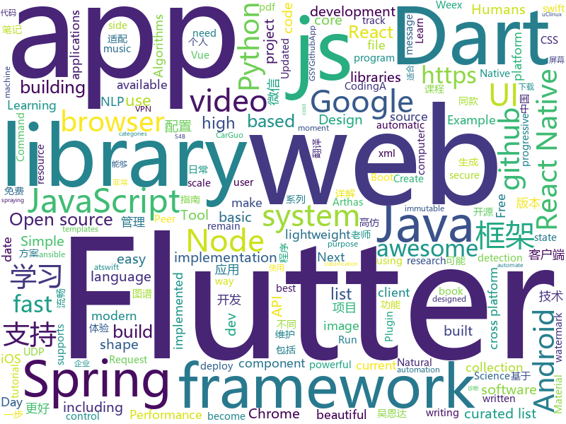

# 2018-09-19
See what the GitHub community is most excited about today.

## python
* [system-design-primer](https://github.com/donnemartin/system-design-primer)(**372 stars today**): Learn how to design large-scale systems. Prep for the system design interview. Includes Anki flashcards.
* [Python](https://github.com/TheAlgorithms/Python)(**203 stars today**): All Algorithms implemented in Python
* [SprayingToolkit](https://github.com/byt3bl33d3r/SprayingToolkit)(**86 stars today**): Scripts to make password spraying attacks against Lync/S4B & OWA a lot quicker, less painful and more efficient
* [models](https://github.com/tensorflow/models)(**67 stars today**): Models and examples built with TensorFlow
* [vid2vid](https://github.com/NVIDIA/vid2vid)(**65 stars today**): Pytorch implementation of our method for high-resolution (e.g. 2048x1024) photorealistic video-to-video translation.
* [pytheory](https://github.com/kennethreitz/pytheory)(**62 stars today**): Music Theory for Humans.
* [awesome-python](https://github.com/vinta/awesome-python)(**56 stars today**): A curated list of awesome Python frameworks, libraries, software and resources
* [segmentation_models](https://github.com/qubvel/segmentation_models)(**50 stars today**): Segmentation models with pretrained backbones. Keras.
* [awesome-reactnative-ui](https://github.com/madhavanmalolan/awesome-reactnative-ui)(**50 stars today**): Awesome React Native UI components updated weekly
* [pipenv](https://github.com/pypa/pipenv)(**50 stars today**): Python Development Workflow for Humans.
* [chinese-dos-games](https://github.com/rwv/chinese-dos-games)(**44 stars today**): 🎮Chinese DOS games in browser.
* [face_recognition](https://github.com/ageitgey/face_recognition)(**38 stars today**): The world's simplest facial recognition api for Python and the command line
* [scikit-learn](https://github.com/scikit-learn/scikit-learn)(**33 stars today**): scikit-learn: machine learning in Python
* [ansible](https://github.com/ansible/ansible)(**33 stars today**): Ansible is a radically simple IT automation platform that makes your applications and systems easier to deploy. Avoid writing scripts or custom code to deploy and update your applications — automate in a language that approaches plain English, using SSH, with no agents to install on remote systems. https://docs.ansible.com/ansible/
* [WebSiteUseful](https://github.com/loremwalker/WebSiteUseful)(**38 stars today**): 🍅翻墙！科学上网，免费ss帐号分享、ssr订阅源，免费VPN下载，获取及使用教程请看：https://github.com/loremwalker/fq-book
* [awesome-leetcode](https://github.com/apachecn/awesome-leetcode)(**38 stars today**): Leetcode 题解 (跟随思路一步一步撸出代码) 及经典算法实现
* [keras](https://github.com/keras-team/keras)(**33 stars today**): Deep Learning for humans
* [public-apis](https://github.com/toddmotto/public-apis)(**34 stars today**): A collective list of public JSON APIs for use in web development.
* [youtube-dl](https://github.com/rg3/youtube-dl)(**33 stars today**): Command-line program to download videos from YouTube.com and other video sites
* [django](https://github.com/django/django)(**25 stars today**): The Web framework for perfectionists with deadlines.
* [pyquarkchain](https://github.com/QuarkChain/pyquarkchain)(**31 stars today**): Python implementation of QuarkChain
* [flask](https://github.com/pallets/flask)(**27 stars today**): The Python micro framework for building web applications.
* [Detectron](https://github.com/facebookresearch/Detectron)(**29 stars today**): FAIR's research platform for object detection research, implementing popular algorithms like Mask R-CNN and RetinaNet.
* [requests](https://github.com/requests/requests)(**27 stars today**): Python HTTP Requests for Humans™✨🍰✨
* [home-assistant](https://github.com/home-assistant/home-assistant)(**23 stars today**): 🏡Open source home automation that puts local control and privacy first

## java
* [arthas](https://github.com/alibaba/arthas)(**695 stars today**): Alibaba Java Diagnostic Tool Arthas/Alibaba Java诊断利器Arthas
* [SpringAll](https://github.com/wuyouzhuguli/SpringAll)(**268 stars today**): 循序渐进，学习Spring Boot、Spring Boot & Shiro、Spring Cloud和Spring Security，博客Spring系列源码
* [proxyee-down](https://github.com/proxyee-down-org/proxyee-down)(**148 stars today**): http下载工具，基于http代理，支持多连接分块下载
* [JavaGuide](https://github.com/Snailclimb/JavaGuide)(**108 stars today**): A core knowledge that most Java programmers need to master
* [nacos-spring-project](https://github.com/nacos-group/nacos-spring-project)(**73 stars today**): Nacos ECO Project for Spring Framework
* [PhotoMovie](https://github.com/yellowcath/PhotoMovie)(**72 stars today**): Using your photos to create cool videos.(高仿抖音照片电影功能)
* [spring-boot](https://github.com/spring-projects/spring-boot)(**52 stars today**): Spring Boot
* [BackgroundLibrary](https://github.com/JavaNoober/BackgroundLibrary)(**56 stars today**): A framework for directly generating shape through Tags, no need to write shape.xml again（通过标签直接生成shape，无需再写shape.xml）
* [JCSprout](https://github.com/crossoverJie/JCSprout)(**47 stars today**): 👨‍🎓Java Core Sprout : basic, concurrent, algorithm
* [aeron](https://github.com/real-logic/aeron)(**50 stars today**): Efficient reliable UDP unicast, UDP multicast, and IPC message transport
* [Java](https://github.com/TheAlgorithms/Java)(**43 stars today**): All Algorithms implemented in Java
* [Sentinel](https://github.com/alibaba/Sentinel)(**41 stars today**): A lightweight flow-control library providing high-available protection and monitoring (高可用防护的流量管理框架)
* [AndroidAutoSize](https://github.com/JessYanCoding/AndroidAutoSize)(**45 stars today**): A low-cost Android screen adaptation solution (今日头条屏幕适配方案终极版，一个极低成本的 Android 屏幕适配方案).
* [tink](https://github.com/google/tink)(**43 stars today**): Tink is a multi-language, cross-platform library that provides cryptographic APIs that are secure, easy to use correctly, and hard(er) to misuse.
* [apollo](https://github.com/ctripcorp/apollo)(**36 stars today**): Apollo（阿波罗）是携程框架部门研发的分布式配置中心，能够集中化管理应用不同环境、不同集群的配置，配置修改后能够实时推送到应用端，并且具备规范的权限、流程治理等特性，适用于微服务配置管理场景。
* [tutorials](https://github.com/eugenp/tutorials)(**22 stars today**): The "REST With Spring" Course:
* [AndroidWM](https://github.com/huangyz0918/AndroidWM)(**42 stars today**): A lightweight android image watermark library that supports invisible digital watermarks.🌁(轻量级安卓水印框架，支持隐形数字水印)
* [helidon](https://github.com/oracle/helidon)(**39 stars today**): Java libraries for writing microservices
* [jdk](https://github.com/openjdk/jdk)(**38 stars today**): Read-only mirror of http://hg.openjdk.java.net/jdk/jdk
* [elasticsearch](https://github.com/elastic/elasticsearch)(**33 stars today**): Open Source, Distributed, RESTful Search Engine
* [incubator-dubbo](https://github.com/apache/incubator-dubbo)(**29 stars today**): Apache Dubbo (incubating) is a high-performance, java based, open source RPC framework.
* [simple-binary-encoding](https://github.com/real-logic/simple-binary-encoding)(**35 stars today**): Simple Binary Encoding (SBE) - High Performance Message Codec
* [weixin-java-tools](https://github.com/Wechat-Group/weixin-java-tools)(**29 stars today**): 全能微信Java开发工具包，支持包括微信支付、开放平台、小程序、企业微信/企业号和公众号等的开发
* [graal](https://github.com/oracle/graal)(**30 stars today**): GraalVM: Run Programs Faster Anywhere🚀
* [guava](https://github.com/google/guava)(**27 stars today**): Google core libraries for Java

## unknown
* [pwc](https://github.com/zziz/pwc)(**477 stars today**): Papers with code. Sorted by stars. Updated weekly.
* [awesome-typescript](https://github.com/semlinker/awesome-typescript)(**201 stars today**): A collection of awesome TypeScript resources for client-side and server-side development
* [English-level-up-tips-for-Chinese](https://github.com/byoungd/English-level-up-tips-for-Chinese)(**173 stars today**): 可能是让你受益匪浅的英语进阶指南
* [ToolsOfTheTrade](https://github.com/cjbarber/ToolsOfTheTrade)(**152 stars today**): Tools of The Trade, from Hacker News.
* [free-for-dev](https://github.com/ripienaar/free-for-dev)(**150 stars today**): A list of SaaS, PaaS and IaaS offerings that have free tiers of interest to devops and infradev
* [CS-Notes](https://github.com/CyC2018/CS-Notes)(**116 stars today**): 📚Computer Science Learning Notes
* [stanford-cs-229-machine-learning](https://github.com/afshinea/stanford-cs-229-machine-learning)(**120 stars today**): VIP cheatsheets for Stanford's CS 229 Machine Learning
* [100-Days-Of-ML-Code](https://github.com/Avik-Jain/100-Days-Of-ML-Code)(**108 stars today**): 100 Days of ML Coding
* [gophercon2018](https://github.com/duffn/gophercon2018)(**90 stars today**): A compilation of tutorial and talk presentations and videos from Gophercon 2018.
* [You-Dont-Know-JS](https://github.com/getify/You-Dont-Know-JS)(**76 stars today**): A book series on JavaScript. @YDKJS on twitter.
* [awesome](https://github.com/sindresorhus/awesome)(**77 stars today**): 😎Curated list of awesome lists
* [mmdetection](https://github.com/open-mmlab/mmdetection)(**72 stars today**): Open MMLab Detection Toolbox
* [coding-interview-university](https://github.com/jwasham/coding-interview-university)(**60 stars today**): A complete computer science study plan to become a software engineer.
* [gitignore](https://github.com/github/gitignore)(**43 stars today**): A collection of useful .gitignore templates
* [free-programming-books](https://github.com/EbookFoundation/free-programming-books)(**48 stars today**): 📚Freely available programming books
* [architect-awesome](https://github.com/xingshaocheng/architect-awesome)(**45 stars today**): 后端架构师技术图谱
* [atswift-2018-resources](https://github.com/atConf/atswift-2018-resources)(**49 stars today**): Resource files for atswift conference 2018, including pdf, source projects or playgrounds. 2018 中国 Swift 开发者大会源文件，包括 pdf 和源工程文件 https://atswift.swift.gg
* [awesome-vue](https://github.com/vuejs/awesome-vue)(**48 stars today**): 🎉A curated list of awesome things related to Vue.js
* [gold-miner](https://github.com/xitu/gold-miner)(**44 stars today**): 🥇掘金翻译计划，可能是世界最大最好的英译中技术社区，最懂读者和译者的翻译平台：
* [project-based-learning](https://github.com/tuvtran/project-based-learning)(**41 stars today**): Curated list of project-based tutorials
* [build-your-own-x](https://github.com/danistefanovic/build-your-own-x)(**40 stars today**): 🤓Build your own (insert technology here)
* [ipfs](https://github.com/ipfs/ipfs)(**39 stars today**): Peer-to-peer hypermedia protocol
* [nodebestpractices](https://github.com/i0natan/nodebestpractices)(**34 stars today**): The largest Node.JS best practices list (September 2018)
* [MangaCraft](https://github.com/lllyasviel/MangaCraft)(**33 stars today**): The current best semi-automatic manga colorization project on earth.
* [summer-2019-internships](https://github.com/christine-hu/summer-2019-internships)(**26 stars today**): A document to help undergraduates keep track of software engineering internship opportunities.

## javascript
* [You-Dont-Need-Momentjs](https://github.com/you-dont-need/You-Dont-Need-Momentjs)(**467 stars today**): List of date-fns or native functions which you can use to replace moment.js + ESLint Plugin
* [lyo](https://github.com/bokub/lyo)(**155 stars today**): 📦Node.js to browser - The easy way
* [WatermelonDB](https://github.com/Nozbe/WatermelonDB)(**147 stars today**): 🍉Next-gen database for powerful React and React Native apps that scales to 10,000s of records and remains fast⚡️
* [wwwbasic](https://github.com/google/wwwbasic)(**136 stars today**): WWWBasic is an implementation of BASIC (Beginner's All-purpose Symbolic Instruction Code) designed to be easy to run on the Web.
* [dayjs](https://github.com/iamkun/dayjs)(**127 stars today**): ⏰Day.js 2KB immutable date library alternative to Moment.js with the same modern API
* [vue](https://github.com/vuejs/vue)(**114 stars today**): 🖖A progressive, incrementally-adoptable JavaScript framework for building UI on the web.
* [grapesjs](https://github.com/artf/grapesjs)(**113 stars today**): Free and Open source Web Builder Framework. Next generation tool for building templates without coding
* [react](https://github.com/facebook/react)(**104 stars today**): A declarative, efficient, and flexible JavaScript library for building user interfaces.
* [taro](https://github.com/NervJS/taro)(**111 stars today**): 多端统一开发框架，支持用 React 的开发方式编写一次代码，生成能运行在微信小程序、H5、React Native 等的应用。
* [nlp.js](https://github.com/axa-group/nlp.js)(**115 stars today**): An NLP library built in node over Natural, with entity extraction, sentiment analysis, automatic language identify, and so more
* [carbon](https://github.com/dawnlabs/carbon)(**88 stars today**): 🎨Create and share beautiful images of your source code
* [date-fns](https://github.com/date-fns/date-fns)(**82 stars today**): ⏳Modern JavaScript date utility library⌛️
* [gatsby](https://github.com/gatsbyjs/gatsby)(**75 stars today**): ⚛️📄🚀Blazing fast site generator for React
* [axios](https://github.com/axios/axios)(**72 stars today**): Promise based HTTP client for the browser and node.js
* [create-react-app](https://github.com/facebook/create-react-app)(**64 stars today**): Create React apps with no build configuration.
* [tink](https://github.com/npm/tink)(**67 stars today**): a dependency unwinder for javascript
* [puppeteer](https://github.com/GoogleChrome/puppeteer)(**60 stars today**): Headless Chrome Node API
* [javascript-algorithms](https://github.com/trekhleb/javascript-algorithms)(**56 stars today**): Algorithms and data structures implemented in JavaScript with explanations and links to further readings
* [immer](https://github.com/mweststrate/immer)(**62 stars today**): Create the next immutable state by mutating the current one
* [Front-End-Checklist](https://github.com/thedaviddias/Front-End-Checklist)(**59 stars today**): 🗂The perfect Front-End Checklist for modern websites and meticulous developers
* [storybook](https://github.com/storybooks/storybook)(**59 stars today**): Interactive UI component dev & test: React, React Native, Vue, Angular
* [lowjs](https://github.com/neonious/lowjs)(**59 stars today**): A port of Node.JS with far lower system requirements. Community version for POSIX systems such as Linux, uClinux or Mac OS X.
* [ant-design-pro](https://github.com/ant-design/ant-design-pro)(**48 stars today**): 👨🏻‍💻👩🏻‍💻 Use Ant Design like a Pro!
* [material-ui](https://github.com/mui-org/material-ui)(**43 stars today**): React components that implement Google's Material Design.
* [javascript](https://github.com/airbnb/javascript)(**47 stars today**): JavaScript Style Guide

## html
* [styleguide](https://github.com/google/styleguide)(**29 stars today**): Style guides for Google-originated open-source projects
* [patchwork](https://github.com/jlord/patchwork)(****): All the Git-it Workshop completers!
* [sal](https://github.com/mciastek/sal)(**28 stars today**): 🚀Performance focused, lightweight scroll animation library🚀
* [awesome-mac](https://github.com/jaywcjlove/awesome-mac)(**24 stars today**):  Now we have become very big, Different from the original idea. Collect premium software in various categories.
* [python-vs-javascript](https://github.com/sayazamurai/python-vs-javascript)(**22 stars today**): 
* [Spoon-Knife](https://github.com/octocat/Spoon-Knife)(****): This repo is for demonstration purposes only.
* [trashy.css](https://github.com/t7/trashy.css)(**19 stars today**): Trashy.css - The throwaway CSS library with no `class`.
* [portainer](https://github.com/portainer/portainer)(**18 stars today**): Simple management UI for Docker
* [capacitor](https://github.com/ionic-team/capacitor)(**17 stars today**): Build cross-platform Native Progressive Web Apps for iOS, Android, and the web⚡️
* [Coursera-ML-AndrewNg-Notes](https://github.com/fengdu78/Coursera-ML-AndrewNg-Notes)(**16 stars today**): 吴恩达老师的机器学习课程个人笔记
* [JavaScript30](https://github.com/wesbos/JavaScript30)(**7 stars today**): 30 Day Vanilla JS Challenge
* [lazyestload.js](https://github.com/Paul-Browne/lazyestload.js)(**16 stars today**): load images only when they are in (and remain in) the viewport
* [fastText](https://github.com/facebookresearch/fastText)(**12 stars today**): Library for fast text representation and classification.
* [requests-html](https://github.com/kennethreitz/requests-html)(**12 stars today**): Pythonic HTML Parsing for Humans™
* [performance-handbook](https://github.com/dwango-js/performance-handbook)(**12 stars today**): Webフロントエンド パフォーマンス改善ハンドブック
* [qiubaiying.github.io](https://github.com/qiubaiying/qiubaiying.github.io)(**5 stars today**): BY Blog ->
* [gentelella](https://github.com/puikinsh/gentelella)(**8 stars today**): Free Bootstrap 3 Admin Template
* [chrome](https://github.com/free-vpn/chrome)(**9 stars today**): VPN Chrome is Google Chromium based browser with built-in VPN capability to let users surf the Internet in a secure and private way.
* [NLP-progress](https://github.com/sebastianruder/NLP-progress)(**10 stars today**): Repository to track the progress in Natural Language Processing (NLP), including the datasets and the current state-of-the-art for the most common NLP tasks.
* [skill-map](https://github.com/TeamStuQ/skill-map)(**10 stars today**): 程序员技能图谱
* [Winds](https://github.com/GetStream/Winds)(**11 stars today**): A Beautiful Open Source RSS & Podcast App Powered by Getstream.io
* [nodejs-ex](https://github.com/sclorg/nodejs-ex)(****): node.js example
* [phantomjs](https://github.com/ariya/phantomjs)(**10 stars today**): Scriptable Headless Browser
* [fonts](https://github.com/google/fonts)(**10 stars today**): Font files available from Google Fonts
* [deeplearning_ai_books](https://github.com/fengdu78/deeplearning_ai_books)(**10 stars today**): deeplearning.ai（吴恩达老师的深度学习课程笔记及资源）

## dart
* [flutter](https://github.com/flutter/flutter)(**68 stars today**): Flutter makes it easy and fast to build beautiful mobile apps.
* [Vadaski-flutter_note_book](https://github.com/Vadaski/Vadaski-flutter_note_book)(**32 stars today**): 日更的FlutterDemo合集
* [GSYGithubAppFlutter](https://github.com/CarGuo/GSYGithubAppFlutter)(**24 stars today**): 超完整的Flutter项目，功能丰富，适合学习和日常使用。GSYGithubApp系列的优势：我们目前已经拥有Flutter、Weex、ReactNative三个版本。 功能齐全，项目框架内技术涉及面广，完成度高，持续维护，配套文章，适合全面学习，跨框架对比参考。跨平台的开源Github客户端App，更好的体验，更丰富的功能，旨在更好的日常管理和维护个人Github，提供更好更方便的驾车体验～～Σ(￣。￣ﾉ)ﾉ。同款Weex版本 ： https://github.com/CarGuo/GSYGithubAppWeex 、同款React Native版本 ： https://github.com/CarGuo/GSYGithubApp
* [Flutter-learning](https://github.com/AweiLoveAndroid/Flutter-learning)(**9 stars today**): 🔥👍🌟⭐️⭐️⭐️Flutter从配置安装到填坑指南详解，Flutter相关Demo解读，项目实例，Dart语法详解
* [plugins](https://github.com/flutter/plugins)(**6 stars today**): Plugins for Flutter, including FlutterFire, maintained by the Flutter team
* [GankFlutter](https://github.com/ZQ330093887/GankFlutter)(**6 stars today**): 干货集中营 客户端 flutter版
* [dio](https://github.com/flutterchina/dio)(**6 stars today**): A powerful Http client for Dart, which supports Interceptors, FormData, Request Cancellation, File Downloading, Timeout etc.
* [TheGorgeousLogin](https://github.com/huextrat/TheGorgeousLogin)(**6 stars today**): Login page built with @flutter😍
* [website](https://github.com/flutter/website)(****): Flutter web site
* [Grey](https://github.com/avirias/Grey)(****): A Material designed music player developed in Flutter
* [validator.dart](https://github.com/karan/validator.dart)(****): 🐢String validation and sanitization for Dart.
* [lottie-flutter](https://github.com/dnfield/lottie-flutter)(****): A pure Dart/Flutter implementation of Lottie
* [linter](https://github.com/dart-lang/linter)(****): Linter for Dart.
* [fluttergram](https://github.com/mdanics/fluttergram)(****): A working Instagram clone written in Flutter using Firebase / Firestore
* [chromedeveditor](https://github.com/googlearchive/chromedeveditor)(****): Chrome Dev Editor is a developer tool for building apps on the Chrome platform - Chrome Apps and Web Apps, in JavaScript or Dart. (NO LONGER IN ACTIVE DEVELOPMENT)
* [sdk](https://github.com/dart-lang/sdk)(****): The Dart SDK, including the VM, dart2js, core libraries, and more.
* [flutter-osc](https://github.com/yubo725/flutter-osc)(****): 基于Google Flutter的开源中国客户端，支持Android和iOS。
* [flutter-examples](https://github.com/nisrulz/flutter-examples)(****): [Examples] Simple basic isolated apps, for budding flutter devs.
* [Flutter-UI-Kit](https://github.com/iampawan/Flutter-UI-Kit)(****): Flutter app for collection of UI in a UIKit
* [inKino](https://github.com/roughike/inKino)(****): inKino - A cross platform movie and showtime browser for Finnkino cinemas, made with Flutter.
* [flutter_architecture_samples](https://github.com/brianegan/flutter_architecture_samples)(****): TodoMVC for Flutter
* [FlutterExampleApps](https://github.com/iampawan/FlutterExampleApps)(****): [Example APPS] Basic Flutter apps, for flutter devs.
* [hauberk](https://github.com/munificent/hauberk)(****): A web-based roguelike written in Dart.
* [angular](https://github.com/dart-lang/angular)(****): Fast and productive web framework provided by Dart
* [zhihu-flutter](https://github.com/HackSoul/zhihu-flutter)(****): Flutter 高仿知乎 UI，非常漂亮，也非常流畅，flutter build apk 或 flutter build ios 之后更流畅

## WordCloud

