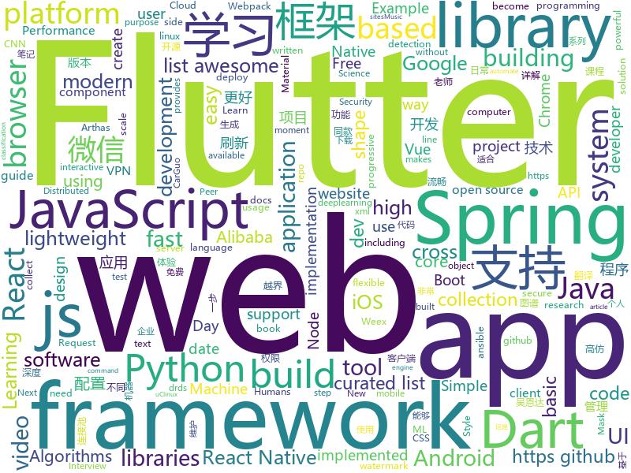

# 2018-09-20
See what the GitHub community is most excited about today.

## python
* [system-design-primer](https://github.com/donnemartin/system-design-primer)(**185 stars today**): Learn how to design large-scale systems. Prep for the system design interview. Includes Anki flashcards.
* [Python](https://github.com/TheAlgorithms/Python)(**155 stars today**): All Algorithms implemented in Python
* [models](https://github.com/tensorflow/models)(**61 stars today**): Models and examples built with TensorFlow
* [vid2vid](https://github.com/NVIDIA/vid2vid)(**62 stars today**): Pytorch implementation of our method for high-resolution (e.g. 2048x1024) photorealistic video-to-video translation.
* [awesome-python](https://github.com/vinta/awesome-python)(**59 stars today**): A curated list of awesome Python frameworks, libraries, software and resources
* [youtube-dl](https://github.com/rg3/youtube-dl)(**55 stars today**): Command-line program to download videos from YouTube.com and other video sites
* [pytheory](https://github.com/kennethreitz/pytheory)(**51 stars today**): Music Theory for Humans.
* [awesome-leetcode](https://github.com/apachecn/awesome-leetcode)(**49 stars today**): Leetcode 题解 (跟随思路一步一步撸出代码) 及经典算法实现
* [face_recognition](https://github.com/ageitgey/face_recognition)(**45 stars today**): The world's simplest facial recognition api for Python and the command line
* [chinese-dos-games](https://github.com/rwv/chinese-dos-games)(**46 stars today**): 🎮Chinese DOS games in browser.
* [WebSiteUseful](https://github.com/loremwalker/WebSiteUseful)(**42 stars today**): 🍅翻墙！科学上网，免费ss帐号分享、ssr订阅源，免费VPN下载，获取及使用教程请看：https://github.com/loremwalker/fq-book
* [newspaper](https://github.com/codelucas/newspaper)(**42 stars today**): News, full-text, and article metadata extraction in Python 3. Advanced docs:
* [django](https://github.com/django/django)(**26 stars today**): The Web framework for perfectionists with deadlines.
* [jupytext](https://github.com/mwouts/jupytext)(**40 stars today**): Jupyter notebooks as Markdown documents, Julia, Python or R scripts
* [ansible](https://github.com/ansible/ansible)(**30 stars today**): Ansible is a radically simple IT automation platform that makes your applications and systems easier to deploy. Avoid writing scripts or custom code to deploy and update your applications — automate in a language that approaches plain English, using SSH, with no agents to install on remote systems. https://docs.ansible.com/ansible/
* [scikit-learn](https://github.com/scikit-learn/scikit-learn)(**31 stars today**): scikit-learn: machine learning in Python
* [keras](https://github.com/keras-team/keras)(**31 stars today**): Deep Learning for humans
* [cpython](https://github.com/python/cpython)(**21 stars today**): The Python programming language
* [public-apis](https://github.com/toddmotto/public-apis)(**32 stars today**): A collective list of public JSON APIs for use in web development.
* [Mask_RCNN](https://github.com/matterport/Mask_RCNN)(**31 stars today**): Mask R-CNN for object detection and instance segmentation on Keras and TensorFlow
* [Detectron](https://github.com/facebookresearch/Detectron)(**28 stars today**): FAIR's research platform for object detection research, implementing popular algorithms like Mask R-CNN and RetinaNet.
* [requests](https://github.com/requests/requests)(**28 stars today**): Python HTTP Requests for Humans™✨🍰✨
* [AiLearning](https://github.com/apachecn/AiLearning)(**22 stars today**): AiLearning: 机器学习 - MachineLearning - ML、深度学习 - DeepLearning - DL、自然语言处理 NLP
* [awesome-machine-learning](https://github.com/josephmisiti/awesome-machine-learning)(**29 stars today**): A curated list of awesome Machine Learning frameworks, libraries and software.
* [flask](https://github.com/pallets/flask)(**26 stars today**): The Python micro framework for building web applications.

## java
* [arthas](https://github.com/alibaba/arthas)(**463 stars today**): Alibaba Java Diagnostic Tool Arthas/Alibaba Java诊断利器Arthas
* [SpringAll](https://github.com/wuyouzhuguli/SpringAll)(**294 stars today**): 循序渐进，学习Spring Boot、Spring Boot & Shiro、Spring Cloud和Spring Security，博客Spring系列源码
* [BackgroundLibrary](https://github.com/JavaNoober/BackgroundLibrary)(**169 stars today**): A framework for directly generating shape through Tags, no need to write shape.xml again（通过标签直接生成shape，无需再写shape.xml）
* [spring-cloud-alibaba](https://github.com/spring-cloud-incubator/spring-cloud-alibaba)(**148 stars today**): Spring Cloud Alibaba provides a one-stop solution for application development for the distributed solutions of Alibaba middleware.
* [JavaGuide](https://github.com/Snailclimb/JavaGuide)(**89 stars today**): A core knowledge that most Java programmers need to master
* [proxyee-down](https://github.com/proxyee-down-org/proxyee-down)(**80 stars today**): http下载工具，基于http代理，支持多连接分块下载
* [JCSprout](https://github.com/crossoverJie/JCSprout)(**52 stars today**): 👨‍🎓Java Core Sprout : basic, concurrent, algorithm
* [tutorials](https://github.com/eugenp/tutorials)(**28 stars today**): The "REST With Spring" Course:
* [incubator-dubbo](https://github.com/apache/incubator-dubbo)(**36 stars today**): Apache Dubbo (incubating) is a high-performance, java based, open source RPC framework.
* [spring-boot](https://github.com/spring-projects/spring-boot)(**31 stars today**): Spring Boot
* [elasticsearch](https://github.com/elastic/elasticsearch)(**39 stars today**): Open Source, Distributed, RESTful Search Engine
* [Sentinel](https://github.com/alibaba/Sentinel)(**33 stars today**): A lightweight flow-control library providing high-available protection and monitoring (高可用防护的流量管理框架)
* [FEBS-Security](https://github.com/wuyouzhuguli/FEBS-Security)(**37 stars today**): Spring Boot 2.0.4 & Spring Security 5.0.7 权限管理系统。预览地址：http://111.230.157.133:9999/login
* [Java](https://github.com/TheAlgorithms/Java)(**32 stars today**): All Algorithms implemented in Java
* [guava](https://github.com/google/guava)(**32 stars today**): Google core libraries for Java
* [PhotoMovie](https://github.com/yellowcath/PhotoMovie)(**31 stars today**): Using your photos to create cool videos.(高仿抖音照片电影功能)
* [SmartRefreshLayout](https://github.com/scwang90/SmartRefreshLayout)(**29 stars today**): 🔥下拉刷新、上拉加载、二级刷新、淘宝二楼、RefreshLayout、OverScroll，Android智能下拉刷新框架，支持越界回弹、越界拖动，具有极强的扩展性，集成了几十种炫酷的Header和 Footer。
* [AndroidUtilCode](https://github.com/Blankj/AndroidUtilCode)(**26 stars today**): 🔥Android developers should collect the following utils(updating).
* [AndroidWM](https://github.com/huangyz0918/AndroidWM)(**28 stars today**): A lightweight android image watermark library that supports invisible digital watermarks.🌁(轻量级安卓水印框架，支持隐形数字水印)
* [weixin-java-tools](https://github.com/Wechat-Group/weixin-java-tools)(**23 stars today**): 全能微信Java开发工具包，支持包括微信支付、开放平台、小程序、企业微信/企业号和公众号等的开发
* [spring-framework](https://github.com/spring-projects/spring-framework)(**23 stars today**): Spring Framework
* [apollo](https://github.com/ctripcorp/apollo)(**25 stars today**): Apollo（阿波罗）是携程框架部门研发的分布式配置中心，能够集中化管理应用不同环境、不同集群的配置，配置修改后能够实时推送到应用端，并且具备规范的权限、流程治理等特性，适用于微服务配置管理场景。
* [simple-binary-encoding](https://github.com/real-logic/simple-binary-encoding)(**27 stars today**): Simple Binary Encoding (SBE) - High Performance Message Codec
* [tink](https://github.com/google/tink)(**25 stars today**): Tink is a multi-language, cross-platform library that provides cryptographic APIs that are secure, easy to use correctly, and hard(er) to misuse.
* [druid](https://github.com/alibaba/druid)(**26 stars today**): ♨️为监控而生的数据库连接池！阿里云DRDS(https://www.aliyun.com/product/drds )、阿里巴巴TDDL 连接池powered by Druid

## unknown
* [math-as-code](https://github.com/Jam3/math-as-code)(**510 stars today**): a cheat-sheet for mathematical notation in code form
* [pwc](https://github.com/zziz/pwc)(**348 stars today**): Papers with code. Sorted by stars. Updated weekly.
* [free-for-dev](https://github.com/ripienaar/free-for-dev)(**183 stars today**): A list of SaaS, PaaS and IaaS offerings that have free tiers of interest to devops and infradev
* [stanford-cs-229-machine-learning](https://github.com/afshinea/stanford-cs-229-machine-learning)(**149 stars today**): VIP cheatsheets for Stanford's CS 229 Machine Learning
* [MangaCraft](https://github.com/lllyasviel/MangaCraft)(**158 stars today**): The current best semi-automatic manga colorization project on earth.
* [ToolsOfTheTrade](https://github.com/cjbarber/ToolsOfTheTrade)(**136 stars today**): Tools of The Trade, from Hacker News.
* [awesome-typescript](https://github.com/semlinker/awesome-typescript)(**127 stars today**): A collection of awesome TypeScript resources for client-side and server-side development
* [CS-Notes](https://github.com/CyC2018/CS-Notes)(**105 stars today**): 📚Computer Science Learning Notes
* [gitignore](https://github.com/github/gitignore)(**60 stars today**): A collection of useful .gitignore templates
* [You-Dont-Know-JS](https://github.com/getify/You-Dont-Know-JS)(**72 stars today**): A book series on JavaScript. @YDKJS on twitter.
* [100-Days-Of-ML-Code](https://github.com/Avik-Jain/100-Days-Of-ML-Code)(**65 stars today**): 100 Days of ML Coding
* [coding-interview-university](https://github.com/jwasham/coding-interview-university)(**61 stars today**): A complete computer science study plan to become a software engineer.
* [free-programming-books](https://github.com/EbookFoundation/free-programming-books)(**64 stars today**): 📚Freely available programming books
* [awesome](https://github.com/sindresorhus/awesome)(**65 stars today**): 😎Curated list of awesome lists
* [project-based-learning](https://github.com/tuvtran/project-based-learning)(**48 stars today**): Curated list of project-based tutorials
* [awesome-vue](https://github.com/vuejs/awesome-vue)(**46 stars today**): 🎉A curated list of awesome things related to Vue.js
* [architect-awesome](https://github.com/xingshaocheng/architect-awesome)(**43 stars today**): 后端架构师技术图谱
* [Recent_SLAM_Research](https://github.com/YiChenCityU/Recent_SLAM_Research)(**38 stars today**): 跟踪SLAM前沿动态
* [ipfs](https://github.com/ipfs/ipfs)(**34 stars today**): Peer-to-peer hypermedia protocol
* [spleen](https://github.com/fcambus/spleen)(**31 stars today**): Monospaced bitmap fonts
* [gold-miner](https://github.com/xitu/gold-miner)(**29 stars today**): 🥇掘金翻译计划，可能是世界最大最好的英译中技术社区，最懂读者和译者的翻译平台：
* [ui-developer-tips](https://github.com/forwebdev/ui-developer-tips)(**30 stars today**): Советы для разработчика интерфейсов
* [YubiKey-Guide](https://github.com/drduh/YubiKey-Guide)(**28 stars today**): Guide to using YubiKey as a SmartCard for GPG and SSH
* [test-your-sysadmin-skills](https://github.com/trimstray/test-your-sysadmin-skills)(**27 stars today**): A collection of *nix Sysadmin Test Questions and Answers for Interview/Exam (2018 Edition).
* [build-your-own-x](https://github.com/danistefanovic/build-your-own-x)(**25 stars today**): 🤓Build your own (insert technology here)

## javascript
* [grapesjs](https://github.com/artf/grapesjs)(**363 stars today**): Free and Open source Web Builder Framework. Next generation tool for building templates without coding
* [You-Dont-Need-Momentjs](https://github.com/you-dont-need/You-Dont-Need-Momentjs)(**358 stars today**): List of date-fns or native functions which you can use to replace moment.js + ESLint Plugin
* [create-react-library](https://github.com/transitive-bullshit/create-react-library)(**285 stars today**): ⚡CLI for easily creating reusable react libraries.
* [worker-plugin](https://github.com/GoogleChromeLabs/worker-plugin)(**265 stars today**): 🐳Adds native Web Worker bundling support to Webpack.
* [taro](https://github.com/NervJS/taro)(**181 stars today**): 多端统一开发框架，支持用 React 的开发方式编写一次代码，生成能运行在微信小程序、H5、React Native 等的应用。
* [lyo](https://github.com/bokub/lyo)(**185 stars today**): 📦Node.js to browser - The easy way
* [dayjs](https://github.com/iamkun/dayjs)(**133 stars today**): ⏰Day.js 2KB immutable date library alternative to Moment.js with the same modern API
* [react](https://github.com/facebook/react)(**96 stars today**): A declarative, efficient, and flexible JavaScript library for building user interfaces.
* [vue](https://github.com/vuejs/vue)(**93 stars today**): 🖖A progressive, incrementally-adoptable JavaScript framework for building UI on the web.
* [wwwbasic](https://github.com/google/wwwbasic)(**100 stars today**): WWWBasic is an implementation of BASIC (Beginner's All-purpose Symbolic Instruction Code) designed to be easy to run on the Web.
* [array-reverse-ios12](https://github.com/fanmingfei/array-reverse-ios12)(**92 stars today**): Fixed Array Reverse Bug On iOS 12 & Safari 12.0 on MacOS.
* [create-react-app](https://github.com/facebook/create-react-app)(**75 stars today**): Create React apps with no build configuration.
* [Front-End-Checklist](https://github.com/thedaviddias/Front-End-Checklist)(**82 stars today**): 🗂The perfect Front-End Checklist for modern websites and meticulous developers
* [date-fns](https://github.com/date-fns/date-fns)(**79 stars today**): ⏳Modern JavaScript date utility library⌛️
* [axios](https://github.com/axios/axios)(**74 stars today**): Promise based HTTP client for the browser and node.js
* [WatermelonDB](https://github.com/Nozbe/WatermelonDB)(**71 stars today**): 🍉Next-gen database for powerful React and React Native apps that scales to 10,000s of records and remains fast⚡️
* [f2](https://github.com/antvis/f2)(**68 stars today**): 📱📈An elegant, interactive and flexible charting library for mobile.
* [javascript-algorithms](https://github.com/trekhleb/javascript-algorithms)(**65 stars today**): Algorithms and data structures implemented in JavaScript with explanations and links to further readings
* [style2paints](https://github.com/lllyasviel/style2paints)(**65 stars today**): sketch + style = paints🎨
* [storybook](https://github.com/storybooks/storybook)(**62 stars today**): Interactive UI component dev & test: React, React Native, Vue, Angular
* [sqorn](https://github.com/lusakasa/sqorn)(**62 stars today**): A Javascript library for building SQL queries
* [material-ui](https://github.com/mui-org/material-ui)(**51 stars today**): React components that implement Google's Material Design.
* [lowjs](https://github.com/neonious/lowjs)(**59 stars today**): A port of Node.JS with far lower system requirements. Community version for POSIX systems such as Linux, uClinux or Mac OS X.
* [vuetify](https://github.com/vuetifyjs/vuetify)(**57 stars today**): Material Component Framework for Vue.js 2
* [next.js](https://github.com/zeit/next.js)(**55 stars today**): Next.js is a lightweight framework for static and server‑rendered applications.

## html
* [styleguide](https://github.com/google/styleguide)(**26 stars today**): Style guides for Google-originated open-source projects
* [Spoon-Knife](https://github.com/octocat/Spoon-Knife)(****): This repo is for demonstration purposes only.
* [chrome](https://github.com/free-vpn/chrome)(**19 stars today**): VPN Chrome is Google Chromium based browser with built-in VPN capability to let users surf the Internet in a secure and private way.
* [skill-map](https://github.com/TeamStuQ/skill-map)(**19 stars today**): 程序员技能图谱
* [awesome-mac](https://github.com/jaywcjlove/awesome-mac)(**20 stars today**):  Now we have become very big, Different from the original idea. Collect premium software in various categories.
* [react-app-rewired](https://github.com/timarney/react-app-rewired)(**19 stars today**): Override create-react-app webpack configs without ejecting
* [screenfull.js](https://github.com/sindresorhus/screenfull.js)(**17 stars today**): Simple wrapper for cross-browser usage of the JavaScript Fullscreen API
* [fastText](https://github.com/facebookresearch/fastText)(**15 stars today**): Library for fast text representation and classification.
* [JavaScript30](https://github.com/wesbos/JavaScript30)(**9 stars today**): 30 Day Vanilla JS Challenge
* [portainer](https://github.com/portainer/portainer)(**14 stars today**): Simple management UI for Docker
* [wechat_web_devtools](https://github.com/cytle/wechat_web_devtools)(**12 stars today**): 微信开发者工具(微信小程序)linux完美支持
* [safari-reaper-demo](https://github.com/hilongjw/safari-reaper-demo)(**9 stars today**): 
* [Coursera-ML-AndrewNg-Notes](https://github.com/fengdu78/Coursera-ML-AndrewNg-Notes)(**9 stars today**): 吴恩达老师的机器学习课程个人笔记
* [deeplearning_ai_books](https://github.com/fengdu78/deeplearning_ai_books)(**10 stars today**): deeplearning.ai（吴恩达老师的深度学习课程笔记及资源）
* [trashy.css](https://github.com/t7/trashy.css)(**11 stars today**): Trashy.css - The throwaway CSS library with no `class`.
* [EIPs](https://github.com/ethereum/EIPs)(**6 stars today**): The Ethereum Improvement Proposal repository
* [intro.js](https://github.com/usablica/intro.js)(**9 stars today**): A better way for new feature introduction and step-by-step users guide for your website and project.
* [gentelella](https://github.com/puikinsh/gentelella)(**10 stars today**): Free Bootstrap 3 Admin Template
* [website](https://github.com/kubernetes/website)(**5 stars today**): Kubernetes website and documentation repo:
* [sal](https://github.com/mciastek/sal)(**9 stars today**): 🚀Performance focused, lightweight scroll animation library🚀
* [model-analysis](https://github.com/tensorflow/model-analysis)(**9 stars today**): Model analysis tools for TensorFlow
* [inpycon2018](https://github.com/pythonindia/inpycon2018)(**9 stars today**): PyCon India 2018 site
* [vertical-center](https://github.com/yanhaijing/vertical-center)(**8 stars today**): 水平垂直居中，这是一道面试必考题，^_^
* [capacitor](https://github.com/ionic-team/capacitor)(**8 stars today**): Build cross-platform Native Progressive Web Apps for iOS, Android, and the web⚡️
* [polymer](https://github.com/Polymer/polymer)(**8 stars today**): Build modern apps using web components

## dart
* [flutter](https://github.com/flutter/flutter)(**68 stars today**): Flutter makes it easy and fast to build beautiful mobile apps.
* [Flutter-Notebook](https://github.com/Vadaski/Flutter-Notebook)(**35 stars today**): 日更的FlutterDemo合集
* [GSYGithubAppFlutter](https://github.com/CarGuo/GSYGithubAppFlutter)(**25 stars today**): 超完整的Flutter项目，功能丰富，适合学习和日常使用。GSYGithubApp系列的优势：我们目前已经拥有Flutter、Weex、ReactNative三个版本。 功能齐全，项目框架内技术涉及面广，完成度高，持续维护，配套文章，适合全面学习，跨框架对比参考。跨平台的开源Github客户端App，更好的体验，更丰富的功能，旨在更好的日常管理和维护个人Github，提供更好更方便的驾车体验～～Σ(￣。￣ﾉ)ﾉ。同款Weex版本 ： https://github.com/CarGuo/GSYGithubAppWeex 、同款React Native版本 ： https://github.com/CarGuo/GSYGithubApp
* [Flutter-UI-Kit](https://github.com/iampawan/Flutter-UI-Kit)(**11 stars today**): Flutter app for collection of UI in a UIKit
* [plugins](https://github.com/flutter/plugins)(**8 stars today**): Plugins for Flutter, including FlutterFire, maintained by the Flutter team
* [sdk](https://github.com/dart-lang/sdk)(**7 stars today**): The Dart SDK, including the VM, dart2js, core libraries, and more.
* [Flutter-learning](https://github.com/AweiLoveAndroid/Flutter-learning)(**6 stars today**): 🔥👍🌟⭐️⭐️⭐️Flutter从配置安装到填坑指南详解，Flutter相关Demo解读，项目实例，Dart语法详解
* [sqflite](https://github.com/tekartik/sqflite)(****): SQLite flutter plugin
* [flutter_google_places_autocomplete](https://github.com/lejard-h/flutter_google_places_autocomplete)(****): 
* [fluttergram](https://github.com/mdanics/fluttergram)(****): A working Instagram clone written in Flutter using Firebase / Firestore
* [website](https://github.com/flutter/website)(****): Flutter web site
* [angular_components_example](https://github.com/dart-lang/angular_components_example)(****): A sample usage of https://github.com/dart-lang/angular_components
* [flutter_map](https://github.com/apptreesoftware/flutter_map)(****): A Flutter map package based on leaflet
* [chromedeveditor](https://github.com/googlearchive/chromedeveditor)(****): Chrome Dev Editor is a developer tool for building apps on the Chrome platform - Chrome Apps and Web Apps, in JavaScript or Dart. (NO LONGER IN ACTIVE DEVELOPMENT)
* [flutter-osc](https://github.com/yubo725/flutter-osc)(****): 基于Google Flutter的开源中国客户端，支持Android和iOS。
* [flutter-examples](https://github.com/nisrulz/flutter-examples)(****): [Examples] Simple basic isolated apps, for budding flutter devs.
* [inKino](https://github.com/roughike/inKino)(****): inKino - A cross platform movie and showtime browser for Finnkino cinemas, made with Flutter.
* [flutter_architecture_samples](https://github.com/brianegan/flutter_architecture_samples)(****): TodoMVC for Flutter
* [FlutterExampleApps](https://github.com/iampawan/FlutterExampleApps)(****): [Example APPS] Basic Flutter apps, for flutter devs.
* [hauberk](https://github.com/munificent/hauberk)(****): A web-based roguelike written in Dart.
* [dio](https://github.com/flutterchina/dio)(****): A powerful Http client for Dart, which supports Interceptors, FormData, Request Cancellation, File Downloading, Timeout etc.
* [angular](https://github.com/dart-lang/angular)(****): Fast and productive web framework provided by Dart
* [zhihu-flutter](https://github.com/HackSoul/zhihu-flutter)(****): Flutter 高仿知乎 UI，非常漂亮，也非常流畅，flutter build apk 或 flutter build ios 之后更流畅
* [StageXL](https://github.com/bp74/StageXL)(****): A fast and universal 2D rendering engine for HTML5 and Dart.
* [dart-sass](https://github.com/sass/dart-sass)(****): A Dart implementation of Sass.

## WordCloud

