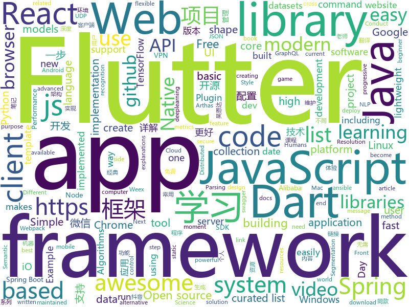

# 2018-09-21
See what the GitHub community is most excited about today.

## python
* [awesome-leetcode](https://github.com/apachecn/awesome-leetcode)(**597 stars today**): Leetcode 题解 (跟随思路一步一步撸出代码) 及经典算法实现
* [Python](https://github.com/TheAlgorithms/Python)(**155 stars today**): All Algorithms implemented in Python
* [system-design-primer](https://github.com/donnemartin/system-design-primer)(**128 stars today**): Learn how to design large-scale systems. Prep for the system design interview. Includes Anki flashcards.
* [Semantic-Segmentation-Suite](https://github.com/GeorgeSeif/Semantic-Segmentation-Suite)(**81 stars today**): Semantic Segmentation Suite in TensorFlow. Implement, train, and test new Semantic Segmentation models easily!
* [models](https://github.com/tensorflow/models)(**62 stars today**): Models and examples built with TensorFlow
* [stable-baselines](https://github.com/hill-a/stable-baselines)(**66 stars today**): A fork of OpenAI Baselines, implementations of reinforcement learning algorithms
* [vid2vid](https://github.com/NVIDIA/vid2vid)(**64 stars today**): Pytorch implementation of our method for high-resolution (e.g. 2048x1024) photorealistic video-to-video translation.
* [chinese-dos-games](https://github.com/rwv/chinese-dos-games)(**58 stars today**): 🎮Chinese DOS games in browser.
* [youtube-dl](https://github.com/rg3/youtube-dl)(**49 stars today**): Command-line program to download videos from YouTube.com and other video sites
* [keras](https://github.com/keras-team/keras)(**43 stars today**): Deep Learning for humans
* [WebSiteUseful](https://github.com/loremwalker/WebSiteUseful)(**40 stars today**): 🍅翻墙！科学上网，免费ss帐号分享、ssr订阅源，免费VPN下载，获取及使用教程请看：https://github.com/loremwalker/fq-book
* [redash](https://github.com/getredash/redash)(**45 stars today**): Make Your Company Data Driven. Connect to any data source, easily visualize, dashboard and share your data.
* [awesome-python](https://github.com/vinta/awesome-python)(**42 stars today**): A curated list of awesome Python frameworks, libraries, software and resources
* [cpython](https://github.com/python/cpython)(**33 stars today**): The Python programming language
* [ansible](https://github.com/ansible/ansible)(**29 stars today**): Ansible is a radically simple IT automation platform that makes your applications and systems easier to deploy. Avoid writing scripts or custom code to deploy and update your applications — automate in a language that approaches plain English, using SSH, with no agents to install on remote systems. https://docs.ansible.com/ansible/
* [face_recognition](https://github.com/ageitgey/face_recognition)(**31 stars today**): The world's simplest facial recognition api for Python and the command line
* [django](https://github.com/django/django)(**26 stars today**): The Web framework for perfectionists with deadlines.
* [public-apis](https://github.com/toddmotto/public-apis)(**31 stars today**): A collective list of public JSON APIs for use in web development.
* [home-assistant](https://github.com/home-assistant/home-assistant)(**30 stars today**): 🏡Open source home automation that puts local control and privacy first
* [newspaper](https://github.com/codelucas/newspaper)(**32 stars today**): News, full-text, and article metadata extraction in Python 3. Advanced docs:
* [AiLearning](https://github.com/apachecn/AiLearning)(**30 stars today**): AiLearning: 机器学习 - MachineLearning - ML、深度学习 - DeepLearning - DL、自然语言处理 NLP
* [proSR](https://github.com/fperazzi/proSR)(**30 stars today**): Repository containing an independent implementation of the paper: "A Fully Progressive Approach to Single-Image Super-Resolution"
* [AIF360](https://github.com/IBM/AIF360)(**27 stars today**): A comprehensive set of fairness metrics for datasets and machine learning models, explanations for these metrics, and algorithms to mitigate bias in datasets and models.
* [httpie](https://github.com/jakubroztocil/httpie)(**27 stars today**): Modern command line HTTP client – user-friendly curl alternative with intuitive UI, JSON support, syntax highlighting, wget-like downloads, extensions, etc. https://httpie.org
* [tensorboard](https://github.com/tensorflow/tensorboard)(**26 stars today**): TensorFlow's Visualization Toolkit

## java
* [arthas](https://github.com/alibaba/arthas)(**439 stars today**): Alibaba Java Diagnostic Tool Arthas/Alibaba Java诊断利器Arthas
* [SpringAll](https://github.com/wuyouzhuguli/SpringAll)(**199 stars today**): 循序渐进，学习Spring Boot、Spring Boot & Shiro、Spring Cloud和Spring Security，博客Spring系列源码
* [JavaGuide](https://github.com/Snailclimb/JavaGuide)(**130 stars today**): A core knowledge that most Java programmers need to master
* [proxyee-down](https://github.com/proxyee-down-org/proxyee-down)(**72 stars today**): http下载工具，基于http代理，支持多连接分块下载
* [ExpandableTextView](https://github.com/MZCretin/ExpandableTextView)(**73 stars today**): 实现类似微博内容，@用户，链接高亮，@用户和链接可点击跳转，可展开和收回的TextView
* [BackgroundLibrary](https://github.com/JavaNoober/BackgroundLibrary)(**73 stars today**): A framework for directly generating shape through Tags, no need to write shape.xml again（通过标签直接生成shape，无需再写shape.xml）
* [JCSprout](https://github.com/crossoverJie/JCSprout)(**66 stars today**): 👨‍🎓Java Core Sprout : basic, concurrent, algorithm
* [Sentinel](https://github.com/alibaba/Sentinel)(**56 stars today**): A lightweight flow-control library providing high-available protection and monitoring (高可用防护的流量管理框架)
* [spring-boot](https://github.com/spring-projects/spring-boot)(**47 stars today**): Spring Boot
* [spring-cloud-alibaba](https://github.com/spring-cloud-incubator/spring-cloud-alibaba)(**48 stars today**): Spring Cloud Alibaba provides a one-stop solution for application development for the distributed solutions of Alibaba middleware.
* [spring-framework](https://github.com/spring-projects/spring-framework)(**38 stars today**): Spring Framework
* [tutorials](https://github.com/eugenp/tutorials)(**28 stars today**): The "REST With Spring" Course:
* [simple-binary-encoding](https://github.com/real-logic/simple-binary-encoding)(**41 stars today**): Simple Binary Encoding (SBE) - High Performance Message Codec
* [elasticsearch](https://github.com/elastic/elasticsearch)(**36 stars today**): Open Source, Distributed, RESTful Search Engine
* [aeron](https://github.com/real-logic/aeron)(**39 stars today**): Efficient reliable UDP unicast, UDP multicast, and IPC message transport
* [PhotoMovie](https://github.com/yellowcath/PhotoMovie)(**37 stars today**): Using your photos to create cool videos.(高仿抖音照片电影功能)
* [apollo](https://github.com/ctripcorp/apollo)(**33 stars today**): Apollo（阿波罗）是携程框架部门研发的分布式配置中心，能够集中化管理应用不同环境、不同集群的配置，配置修改后能够实时推送到应用端，并且具备规范的权限、流程治理等特性，适用于微服务配置管理场景。
* [incubator-dubbo](https://github.com/apache/incubator-dubbo)(**30 stars today**): Apache Dubbo (incubating) is a high-performance, java based, open source RPC framework.
* [EnvironmentSwitcher](https://github.com/CodeXiaoMai/EnvironmentSwitcher)(**33 stars today**): 🔥No repackage, switch environment with one click.（无需重新打包，一键切换环境 ）
* [MyTikTok](https://github.com/whenSunSet/MyTikTok)(**31 stars today**): 我的抖音APP
* [tink](https://github.com/google/tink)(**33 stars today**): Tink is a multi-language, cross-platform library that provides cryptographic APIs that are secure, easy to use correctly, and hard(er) to misuse.
* [guava](https://github.com/google/guava)(**30 stars today**): Google core libraries for Java
* [Java](https://github.com/TheAlgorithms/Java)(**28 stars today**): All Algorithms implemented in Java
* [weixin-java-tools](https://github.com/Wechat-Group/weixin-java-tools)(**26 stars today**): 全能微信Java开发工具包，支持包括微信支付、开放平台、小程序、企业微信/企业号和公众号等的开发
* [TonY](https://github.com/linkedin/TonY)(**26 stars today**): TensorFlow on YARN (TonY) is a framework to natively run TensorFlow on Apache Hadoop.

## unknown
* [math-as-code](https://github.com/Jam3/math-as-code)(**1,018 stars today**): a cheat-sheet for mathematical notation in code form
* [pwc](https://github.com/zziz/pwc)(**229 stars today**): Papers with code. Sorted by stars. Updated weekly.
* [free-for-dev](https://github.com/ripienaar/free-for-dev)(**174 stars today**): A list of SaaS, PaaS and IaaS offerings that have free tiers of interest to devops and infradev
* [stanford-cs-229-machine-learning](https://github.com/afshinea/stanford-cs-229-machine-learning)(**156 stars today**): VIP cheatsheets for Stanford's CS 229 Machine Learning
* [deep_learning_object_detection](https://github.com/hoya012/deep_learning_object_detection)(**105 stars today**): A paper list of object detection using deep learning.
* [100-Days-Of-ML-Code](https://github.com/Avik-Jain/100-Days-Of-ML-Code)(**91 stars today**): 100 Days of ML Coding
* [ToolsOfTheTrade](https://github.com/cjbarber/ToolsOfTheTrade)(**91 stars today**): Tools of The Trade, from Hacker News.
* [CS-Notes](https://github.com/CyC2018/CS-Notes)(**68 stars today**): 📚Computer Science Learning Notes
* [gitignore](https://github.com/github/gitignore)(**52 stars today**): A collection of useful .gitignore templates
* [awesome](https://github.com/sindresorhus/awesome)(**75 stars today**): 😎Curated list of awesome lists
* [You-Dont-Know-JS](https://github.com/getify/You-Dont-Know-JS)(**65 stars today**): A book series on JavaScript. @YDKJS on twitter.
* [MangaCraft](https://github.com/lllyasviel/MangaCraft)(**67 stars today**): The current best semi-automatic manga colorization project on earth.
* [free-programming-books](https://github.com/EbookFoundation/free-programming-books)(**52 stars today**): 📚Freely available programming books
* [awesome-vue](https://github.com/vuejs/awesome-vue)(**56 stars today**): 🎉A curated list of awesome things related to Vue.js
* [coding-interview-university](https://github.com/jwasham/coding-interview-university)(**44 stars today**): A complete computer science study plan to become a software engineer.
* [technology-talk](https://github.com/aalansehaiyang/technology-talk)(**40 stars today**): 汇总java生态圈常用技术框架、开源中间件，系统架构、项目管理、经典架构案例、数据库、常用三方库、线上运维等知识
* [gold-miner](https://github.com/xitu/gold-miner)(**38 stars today**): 🥇掘金翻译计划，可能是世界最大最好的英译中技术社区，最懂读者和译者的翻译平台：
* [awesome-indie-zh](https://github.com/apachecn/awesome-indie-zh)(**40 stars today**): 独立开发/自由职业/远程工作资源列表
* [Recent_SLAM_Research](https://github.com/YiChenCityU/Recent_SLAM_Research)(**38 stars today**): 跟踪SLAM前沿动态
* [awesome_osint](https://github.com/Ph055a/awesome_osint)(**37 stars today**): Awesome maintained collection of OSINT related resources. (All Free & Actionable)
* [project-based-learning](https://github.com/tuvtran/project-based-learning)(**34 stars today**): Curated list of project-based tutorials
* [awesome-typescript](https://github.com/semlinker/awesome-typescript)(**34 stars today**): A collection of awesome TypeScript resources for client-side and server-side development
* [NCoC](https://github.com/domgetter/NCoC)(**30 stars today**): No Code of Conduct: A Code of Conduct for Adults in Open Source Software
* [spleen](https://github.com/fcambus/spleen)(**30 stars today**): Monospaced bitmap fonts
* [awesome-flutter](https://github.com/Solido/awesome-flutter)(**26 stars today**): An awesome list that curates the best Flutter libraries, tools, tutorials, articles and more.

## javascript
* [grapesjs](https://github.com/artf/grapesjs)(**525 stars today**): Free and Open source Web Builder Framework. Next generation tool for building templates without coding
* [unit-test-demo](https://github.com/tank0317/unit-test-demo)(**278 stars today**): 一步一步介绍如何给项目添加单元测试
* [create-react-library](https://github.com/transitive-bullshit/create-react-library)(**278 stars today**): ⚡CLI for easily creating reusable react libraries.
* [taro](https://github.com/NervJS/taro)(**271 stars today**): 多端统一开发框架，支持用 React 的开发方式编写一次代码，生成能运行在微信小程序、H5、React Native 等的应用。
* [You-Dont-Need-Momentjs](https://github.com/you-dont-need/You-Dont-Need-Momentjs)(**234 stars today**): List of date-fns or native functions which you can use to replace moment.js + ESLint Plugin
* [worker-plugin](https://github.com/GoogleChromeLabs/worker-plugin)(**201 stars today**): 🐳Adds native Web Worker bundling support to Webpack.
* [underrun](https://github.com/phoboslab/underrun)(**192 stars today**): Twin stick shooter game in 13kb of JavaScript/WebGL
* [next.js](https://github.com/zeit/next.js)(**132 stars today**): Next.js is a lightweight framework for static and server‑rendered applications.
* [vue](https://github.com/vuejs/vue)(**121 stars today**): 🖖A progressive, incrementally-adoptable JavaScript framework for building UI on the web.
* [idlize](https://github.com/GoogleChromeLabs/idlize)(**105 stars today**): Helper classes and methods for implementing the idle-until-urgent pattern
* [react](https://github.com/facebook/react)(**86 stars today**): A declarative, efficient, and flexible JavaScript library for building user interfaces.
* [create-react-app](https://github.com/facebook/create-react-app)(**75 stars today**): Create React apps with no build configuration.
* [axios](https://github.com/axios/axios)(**77 stars today**): Promise based HTTP client for the browser and node.js
* [javascript-algorithms](https://github.com/trekhleb/javascript-algorithms)(**76 stars today**): Algorithms and data structures implemented in JavaScript with explanations and links to further readings
* [dayjs](https://github.com/iamkun/dayjs)(**76 stars today**): ⏰Day.js 2KB immutable date library alternative to Moment.js with the same modern API
* [Front-End-Checklist](https://github.com/thedaviddias/Front-End-Checklist)(**71 stars today**): 🗂The perfect Front-End Checklist for modern websites and meticulous developers
* [sqorn](https://github.com/lusakasa/sqorn)(**70 stars today**): A Javascript library for building SQL queries
* [date-fns](https://github.com/date-fns/date-fns)(**62 stars today**): ⏳Modern JavaScript date utility library⌛️
* [lowjs](https://github.com/neonious/lowjs)(**60 stars today**): A port of Node.JS with far lower system requirements. Community version for POSIX systems such as Linux, uClinux or Mac OS X.
* [f2](https://github.com/antvis/f2)(**58 stars today**): 📱📈An elegant, interactive and flexible charting library for mobile.
* [wwwbasic](https://github.com/google/wwwbasic)(**59 stars today**): WWWBasic is an implementation of BASIC (Beginner's All-purpose Symbolic Instruction Code) designed to be easy to run on the Web.
* [style2paints](https://github.com/lllyasviel/style2paints)(**55 stars today**): sketch + style = paints🎨
* [lyo](https://github.com/bokub/lyo)(**56 stars today**): 📦Node.js to browser - The easy way
* [windows95](https://github.com/felixrieseberg/windows95)(**54 stars today**): 💩🚀Windows 95 in Electron. Runs on macOS, Linux, and Windows.
* [WatermelonDB](https://github.com/Nozbe/WatermelonDB)(**54 stars today**): 🍉Next-gen database for powerful React and React Native apps that scales to 10,000s of records and remains fast⚡️

## html
* [styleguide](https://github.com/google/styleguide)(**22 stars today**): Style guides for Google-originated open-source projects
* [awesome-mac](https://github.com/jaywcjlove/awesome-mac)(**18 stars today**):  Now we have become very big, Different from the original idea. Collect premium software in various categories.
* [chrome](https://github.com/free-vpn/chrome)(**17 stars today**): VPN Chrome is Google Chromium based browser with built-in VPN capability to let users surf the Internet in a secure and private way.
* [Coursera-ML-AndrewNg-Notes](https://github.com/fengdu78/Coursera-ML-AndrewNg-Notes)(**15 stars today**): 吴恩达老师的机器学习课程个人笔记
* [trashy.css](https://github.com/t7/trashy.css)(**17 stars today**): Trashy.css - The throwaway CSS library with no `class`.
* [portainer](https://github.com/portainer/portainer)(**14 stars today**): Simple management UI for Docker
* [intro.js](https://github.com/usablica/intro.js)(**14 stars today**): A better way for new feature introduction and step-by-step users guide for your website and project.
* [NLP-progress](https://github.com/sebastianruder/NLP-progress)(**12 stars today**): Repository to track the progress in Natural Language Processing (NLP), including the datasets and the current state-of-the-art for the most common NLP tasks.
* [Spoon-Knife](https://github.com/octocat/Spoon-Knife)(****): This repo is for demonstration purposes only.
* [sal](https://github.com/mciastek/sal)(**13 stars today**): 🚀Performance focused, lightweight scroll animation library🚀
* [JavaScript30](https://github.com/wesbos/JavaScript30)(**7 stars today**): 30 Day Vanilla JS Challenge
* [javascript-tutorial-en](https://github.com/iliakan/javascript-tutorial-en)(**10 stars today**): Modern JavaScript Tutorial
* [react-app-rewired](https://github.com/timarney/react-app-rewired)(**11 stars today**): Override create-react-app webpack configs without ejecting
* [Publii](https://github.com/GetPublii/Publii)(**10 stars today**): Publii is a desktop-based CMS for Windows and Mac that makes creating static websites fast and hassle-free, even for beginners.
* [qiubaiying.github.io](https://github.com/qiubaiying/qiubaiying.github.io)(**6 stars today**): BY Blog ->
* [swagger-codegen](https://github.com/swagger-api/swagger-codegen)(**9 stars today**): swagger-codegen contains a template-driven engine to generate documentation, API clients and server stubs in different languages by parsing your OpenAPI / Swagger definition.
* [gentelella](https://github.com/puikinsh/gentelella)(**8 stars today**): Free Bootstrap 3 Admin Template
* [requests-html](https://github.com/kennethreitz/requests-html)(**10 stars today**): Pythonic HTML Parsing for Humans™
* [favorites-web](https://github.com/cloudfavorites/favorites-web)(**9 stars today**): 云收藏 Spring Boot 2.0 开源项目
* [python-vs-javascript](https://github.com/sayazamurai/python-vs-javascript)(**9 stars today**): 
* [deeplearning_ai_books](https://github.com/fengdu78/deeplearning_ai_books)(**8 stars today**): deeplearning.ai（吴恩达老师的深度学习课程笔记及资源）
* [android_interview](https://github.com/LRH1993/android_interview)(**9 stars today**): gitbook地址
* [EIPs](https://github.com/ethereum/EIPs)(**8 stars today**): The Ethereum Improvement Proposal repository
* [foundation-sites](https://github.com/zurb/foundation-sites)(**8 stars today**): The most advanced responsive front-end framework in the world. Quickly create prototypes and production code for sites that work on any kind of device.
* [linux-command](https://github.com/jaywcjlove/linux-command)(**8 stars today**): Linux命令大全搜索工具，内容包含Linux命令手册、详解、学习、搜集。https://git.io/linux

## dart
* [flutter](https://github.com/flutter/flutter)(**229 stars today**): Flutter makes it easy and fast to build beautiful mobile apps.
* [Flutter-Notebook](https://github.com/Vadaski/Flutter-Notebook)(**24 stars today**): 日更的FlutterDemo合集
* [GSYGithubAppFlutter](https://github.com/CarGuo/GSYGithubAppFlutter)(**24 stars today**): 超完整的Flutter项目，功能丰富，适合学习和日常使用。GSYGithubApp系列的优势：我们目前已经拥有Flutter、Weex、ReactNative三个版本。 功能齐全，项目框架内技术涉及面广，完成度高，持续维护，配套文章，适合全面学习，跨框架对比参考。跨平台的开源Github客户端App，更好的体验，更丰富的功能，旨在更好的日常管理和维护个人Github，提供更好更方便的驾车体验～～Σ(￣。￣ﾉ)ﾉ。同款Weex版本 ： https://github.com/CarGuo/GSYGithubAppWeex 、同款React Native版本 ： https://github.com/CarGuo/GSYGithubApp
* [fluwx](https://github.com/OpenFlutter/fluwx)(**19 stars today**): Flutter版微信SDK.WeChat SDK for flutter.
* [Flutter-UI-Kit](https://github.com/iampawan/Flutter-UI-Kit)(**11 stars today**): Flutter app for collection of UI in a UIKit
* [TheGorgeousLogin](https://github.com/huextrat/TheGorgeousLogin)(**9 stars today**): Login page built with @flutter😍
* [flutter_architecture_samples](https://github.com/brianegan/flutter_architecture_samples)(**8 stars today**): TodoMVC for Flutter
* [dio](https://github.com/flutterchina/dio)(**8 stars today**): A powerful Http client for Dart, which supports Interceptors, FormData, Request Cancellation, File Downloading, Timeout etc.
* [plugins](https://github.com/flutter/plugins)(**6 stars today**): Plugins for Flutter, including FlutterFire, maintained by the Flutter team
* [sdk](https://github.com/dart-lang/sdk)(**7 stars today**): The Dart SDK, including the VM, dart2js, core libraries, and more.
* [graphql-flutter](https://github.com/zino-app/graphql-flutter)(**6 stars today**): A GraphQL client for Flutter, bringing all the features from a modern GraphQL client to one easy to use package.
* [fluttergram](https://github.com/mdanics/fluttergram)(**5 stars today**): A working Instagram clone written in Flutter using Firebase / Firestore
* [dart_style](https://github.com/dart-lang/dart_style)(****): An opinionated formatter/linter for Dart code
* [linkcheck](https://github.com/filiph/linkcheck)(****): Fast link checker
* [speech_recognition](https://github.com/rxlabz/speech_recognition)(****): A Flutter plugin to use speech recognition on iOS & Android (Swift/Java)
* [firebase-dart](https://github.com/FirebaseExtended/firebase-dart)(****): Dart wrapper for Firebase
* [linter](https://github.com/dart-lang/linter)(****): Linter for Dart.
* [chromedeveditor](https://github.com/googlearchive/chromedeveditor)(****): Chrome Dev Editor is a developer tool for building apps on the Chrome platform - Chrome Apps and Web Apps, in JavaScript or Dart. (NO LONGER IN ACTIVE DEVELOPMENT)
* [flutter-osc](https://github.com/yubo725/flutter-osc)(****): 基于Google Flutter的开源中国客户端，支持Android和iOS。
* [flutter-examples](https://github.com/nisrulz/flutter-examples)(****): [Examples] Simple basic isolated apps, for budding flutter devs.
* [inKino](https://github.com/roughike/inKino)(****): inKino - A cross platform movie and showtime browser for Finnkino cinemas, made with Flutter.
* [FlutterExampleApps](https://github.com/iampawan/FlutterExampleApps)(****): [Example APPS] Basic Flutter apps, for flutter devs.
* [hauberk](https://github.com/munificent/hauberk)(****): A web-based roguelike written in Dart.
* [Flutter-learning](https://github.com/AweiLoveAndroid/Flutter-learning)(****): 🔥👍🌟⭐️⭐️⭐️Flutter从配置安装到填坑指南详解，Flutter相关Demo解读，项目实例，Dart语法详解
* [angular](https://github.com/dart-lang/angular)(****): Fast and productive web framework provided by Dart

## WordCloud

