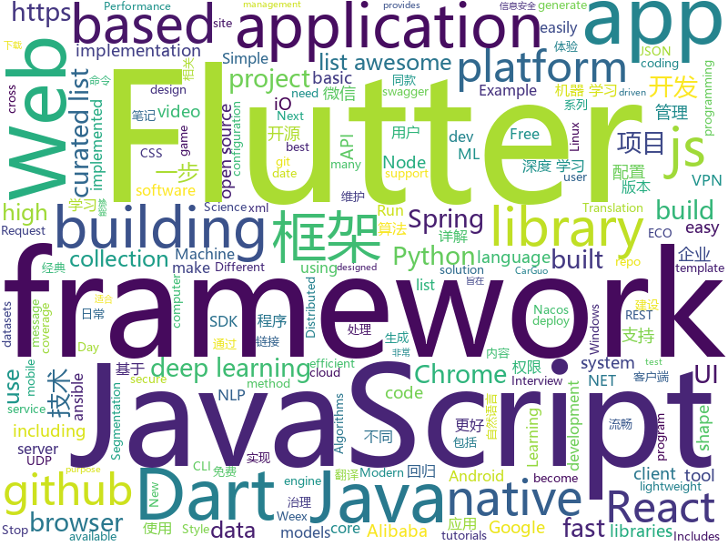

# 2018-09-22
See what the GitHub community is most excited about today.

## python
* [awesome-leetcode](https://github.com/apachecn/awesome-leetcode)(**513 stars today**): Leetcode 题解 (跟随思路一步一步撸出代码) 及经典算法实现
* [Python](https://github.com/TheAlgorithms/Python)(**163 stars today**): All Algorithms implemented in Python
* [system-design-primer](https://github.com/donnemartin/system-design-primer)(**116 stars today**): Learn how to design large-scale systems. Prep for the system design interview. Includes Anki flashcards.
* [leetCode](https://github.com/HuberTRoy/leetCode)(**85 stars today**): 算法相关知识储备
* [models](https://github.com/tensorflow/models)(**65 stars today**): Models and examples built with TensorFlow
* [Semantic-Segmentation-Suite](https://github.com/GeorgeSeif/Semantic-Segmentation-Suite)(**62 stars today**): Semantic Segmentation Suite in TensorFlow. Implement, train, and test new Semantic Segmentation models easily!
* [stable-baselines](https://github.com/hill-a/stable-baselines)(**58 stars today**): A fork of OpenAI Baselines, implementations of reinforcement learning algorithms
* [Hash-Buster](https://github.com/s0md3v/Hash-Buster)(**51 stars today**): Crack hashes in seconds.
* [keras](https://github.com/keras-team/keras)(**46 stars today**): Deep Learning for humans
* [vid2vid](https://github.com/NVIDIA/vid2vid)(**49 stars today**): Pytorch implementation of our method for high-resolution (e.g. 2048x1024) photorealistic video-to-video translation.
* [youtube-dl](https://github.com/rg3/youtube-dl)(**43 stars today**): Command-line program to download videos from YouTube.com and other video sites
* [WebSiteUseful](https://github.com/loremwalker/WebSiteUseful)(**35 stars today**): 🍅翻墙！科学上网，免费ss帐号分享、ssr订阅源，免费VPN下载，获取及使用教程请看：https://github.com/loremwalker/fq-book
* [awesome-python](https://github.com/vinta/awesome-python)(**33 stars today**): A curated list of awesome Python frameworks, libraries, software and resources
* [public-apis](https://github.com/toddmotto/public-apis)(**32 stars today**): A collective list of public JSON APIs for use in web development.
* [UnsupervisedMT](https://github.com/facebookresearch/UnsupervisedMT)(**33 stars today**): Phrase-Based & Neural Unsupervised Machine Translation
* [chinese-dos-games](https://github.com/rwv/chinese-dos-games)(**31 stars today**): 🎮Chinese DOS games in browser.
* [tensor2tensor](https://github.com/tensorflow/tensor2tensor)(**31 stars today**): Library of deep learning models and datasets designed to make deep learning more accessible and accelerate ML research.
* [requests](https://github.com/requests/requests)(**31 stars today**): Python HTTP Requests for Humans™✨🍰✨
* [cpython](https://github.com/python/cpython)(**25 stars today**): The Python programming language
* [AiLearning](https://github.com/apachecn/AiLearning)(**30 stars today**): AiLearning: 机器学习 - MachineLearning - ML、深度学习 - DeepLearning - DL、自然语言处理 NLP
* [redash](https://github.com/getredash/redash)(**30 stars today**): Make Your Company Data Driven. Connect to any data source, easily visualize, dashboard and share your data.
* [django](https://github.com/django/django)(**24 stars today**): The Web framework for perfectionists with deadlines.
* [ansible](https://github.com/ansible/ansible)(**22 stars today**): Ansible is a radically simple IT automation platform that makes your applications and systems easier to deploy. Avoid writing scripts or custom code to deploy and update your applications — automate in a language that approaches plain English, using SSH, with no agents to install on remote systems. https://docs.ansible.com/ansible/
* [flask](https://github.com/pallets/flask)(**25 stars today**): The Python micro framework for building web applications.
* [Algorithm_Interview_Notes-Chinese](https://github.com/imhuay/Algorithm_Interview_Notes-Chinese)(**28 stars today**): 2018/2019/校招/春招/秋招/算法/机器学习(Machine Learning)/深度学习(Deep Learning)/自然语言处理(NLP)/C/C++/Python/面试笔记

## java
* [arthas](https://github.com/alibaba/arthas)(**248 stars today**): Alibaba Java Diagnostic Tool Arthas/Alibaba Java诊断利器Arthas
* [JavaGuide](https://github.com/Snailclimb/JavaGuide)(**109 stars today**): A core knowledge that most Java programmers need to master
* [spring-cloud-alibaba](https://github.com/spring-cloud-incubator/spring-cloud-alibaba)(**73 stars today**): Spring Cloud Alibaba provides a one-stop solution for application development for the distributed solutions of Alibaba middleware.
* [MyTikTok](https://github.com/whenSunSet/MyTikTok)(**72 stars today**): 我的抖音APP
* [proxyee-down](https://github.com/proxyee-down-org/proxyee-down)(**62 stars today**): http下载工具，基于http代理，支持多连接分块下载
* [nacos](https://github.com/alibaba/nacos)(**61 stars today**): an easy-to-use dynamic service discovery, configuration and service management platform for building cloud native applications
* [ExpandableTextView](https://github.com/MZCretin/ExpandableTextView)(**57 stars today**): 实现类似微博内容，@用户，链接高亮，@用户和链接可点击跳转，可展开和收回的TextView
* [BackgroundLibrary](https://github.com/JavaNoober/BackgroundLibrary)(**53 stars today**): A framework for directly generating shape through Tags, no need to write shape.xml again（通过标签直接生成shape，无需再写shape.xml）
* [nacos-spring-project](https://github.com/nacos-group/nacos-spring-project)(**48 stars today**): Nacos ECO Project for Spring Framework
* [JCSprout](https://github.com/crossoverJie/JCSprout)(**43 stars today**): 👨‍🎓Java Core Sprout : basic, concurrent, algorithm
* [spring-boot](https://github.com/spring-projects/spring-boot)(**38 stars today**): Spring Boot
* [tutorials](https://github.com/eugenp/tutorials)(**32 stars today**): The "REST With Spring" Course:
* [nacos-spring-boot-project](https://github.com/nacos-group/nacos-spring-boot-project)(**43 stars today**): Nacos ECO Project for Spring Boot
* [Java](https://github.com/TheAlgorithms/Java)(**36 stars today**): All Algorithms implemented in Java
* [weixin-java-tools](https://github.com/Wechat-Group/weixin-java-tools)(**35 stars today**): 全能微信Java开发工具包，支持包括微信支付、开放平台、小程序、企业微信/企业号和公众号等的开发
* [apollo](https://github.com/ctripcorp/apollo)(**35 stars today**): Apollo（阿波罗）是携程框架部门研发的分布式配置中心，能够集中化管理应用不同环境、不同集群的配置，配置修改后能够实时推送到应用端，并且具备规范的权限、流程治理等特性，适用于微服务配置管理场景。
* [aeron](https://github.com/real-logic/aeron)(**37 stars today**): Efficient reliable UDP unicast, UDP multicast, and IPC message transport
* [simple-binary-encoding](https://github.com/real-logic/simple-binary-encoding)(**36 stars today**): Simple Binary Encoding (SBE) - High Performance Message Codec
* [Sentinel](https://github.com/alibaba/Sentinel)(**32 stars today**): A lightweight flow-control library providing high-available protection and monitoring (高可用防护的流量管理框架)
* [elasticsearch](https://github.com/elastic/elasticsearch)(**22 stars today**): Open Source, Distributed, RESTful Search Engine
* [tink](https://github.com/google/tink)(**28 stars today**): Tink is a multi-language, cross-platform library that provides cryptographic APIs that are secure, easy to use correctly, and hard(er) to misuse.
* [incubator-dubbo](https://github.com/apache/incubator-dubbo)(**22 stars today**): Apache Dubbo (incubating) is a high-performance, java based, open source RPC framework.
* [graal](https://github.com/oracle/graal)(**27 stars today**): GraalVM: Run Programs Faster Anywhere🚀
* [okhttp](https://github.com/square/okhttp)(**20 stars today**): An HTTP+HTTP/2 client for Android and Java applications.
* [selenium](https://github.com/SeleniumHQ/selenium)(**23 stars today**): A browser automation framework and ecosystem.

## unknown
* [math-as-code](https://github.com/Jam3/math-as-code)(**534 stars today**): a cheat-sheet for mathematical notation in code form
* [pwc](https://github.com/zziz/pwc)(**236 stars today**): Papers with code. Sorted by stars. Updated weekly.
* [test-your-sysadmin-skills](https://github.com/trimstray/test-your-sysadmin-skills)(**96 stars today**): A collection of *nix Sysadmin Test Questions and Answers for Interview/Exam (2018 Edition).
* [free-for-dev](https://github.com/ripienaar/free-for-dev)(**90 stars today**): A list of SaaS, PaaS and IaaS offerings that have free tiers of interest to devops and infradev
* [CS-Notes](https://github.com/CyC2018/CS-Notes)(**72 stars today**): 📚Computer Science Learning Notes
* [stanford-cs-229-machine-learning](https://github.com/afshinea/stanford-cs-229-machine-learning)(**76 stars today**): VIP cheatsheets for Stanford's CS 229 Machine Learning
* [gitignore](https://github.com/github/gitignore)(**63 stars today**): A collection of useful .gitignore templates
* [powerbank-PBK-ERC20](https://github.com/powerbankofficial/powerbank-PBK-ERC20)(**73 stars today**): Powerbank is an erc20 platform based coin for Mobile phone bill payment&recharging world
* [You-Dont-Know-JS](https://github.com/getify/You-Dont-Know-JS)(**63 stars today**): A book series on JavaScript. @YDKJS on twitter.
* [deep_learning_object_detection](https://github.com/hoya012/deep_learning_object_detection)(**59 stars today**): A paper list of object detection using deep learning.
* [100-Days-Of-ML-Code](https://github.com/Avik-Jain/100-Days-Of-ML-Code)(**61 stars today**): 100 Days of ML Coding
* [awesome](https://github.com/sindresorhus/awesome)(**54 stars today**): 😎Curated list of awesome lists
* [free-programming-books](https://github.com/EbookFoundation/free-programming-books)(**48 stars today**): 📚Freely available programming books
* [ToolsOfTheTrade](https://github.com/cjbarber/ToolsOfTheTrade)(**50 stars today**): Tools of The Trade, from Hacker News.
* [architect-awesome](https://github.com/xingshaocheng/architect-awesome)(**44 stars today**): 后端架构师技术图谱
* [project-based-learning](https://github.com/tuvtran/project-based-learning)(**44 stars today**): Curated list of project-based tutorials
* [awesome-vue](https://github.com/vuejs/awesome-vue)(**43 stars today**): 🎉A curated list of awesome things related to Vue.js
* [build-your-own-x](https://github.com/danistefanovic/build-your-own-x)(**41 stars today**): 🤓Build your own (insert technology here)
* [coding-interview-university](https://github.com/jwasham/coding-interview-university)(**35 stars today**): A complete computer science study plan to become a software engineer.
* [awesome-flutter](https://github.com/Solido/awesome-flutter)(**35 stars today**): An awesome list that curates the best Flutter libraries, tools, tutorials, articles and more.
* [gold-miner](https://github.com/xitu/gold-miner)(**29 stars today**): 🥇掘金翻译计划，可能是世界最大最好的英译中技术社区，最懂读者和译者的翻译平台：
* [nodebestpractices](https://github.com/i0natan/nodebestpractices)(**28 stars today**): The largest Node.JS best practices list (September 2018)
* [You-Dont-Need-GUI](https://github.com/you-dont-need/You-Dont-Need-GUI)(**25 stars today**): Stop relying on GUI; CLI **ROCKS**
* [awesome-mdx](https://github.com/transitive-bullshit/awesome-mdx)(**24 stars today**): A curated list of awesome MDX resources.
* [Recent_SLAM_Research](https://github.com/YiChenCityU/Recent_SLAM_Research)(**18 stars today**): 跟踪SLAM前沿动态

## javascript
* [grapesjs](https://github.com/artf/grapesjs)(**269 stars today**): Free and Open source Web Builder Framework. Next generation tool for building templates without coding
* [unit-test-demo](https://github.com/tank0317/unit-test-demo)(**194 stars today**): 一步一步介绍如何给项目添加单元测试
* [You-Dont-Need-Momentjs](https://github.com/you-dont-need/You-Dont-Need-Momentjs)(**184 stars today**): List of date-fns or native functions which you can use to replace moment.js + ESLint Plugin
* [underrun](https://github.com/phoboslab/underrun)(**161 stars today**): Twin stick shooter game in 13kb of JavaScript/WebGL
* [taro](https://github.com/NervJS/taro)(**155 stars today**): 多端统一开发框架，支持用 React 的开发方式编写一次代码，生成能运行在微信小程序、H5、React Native 等的应用。
* [idlize](https://github.com/GoogleChromeLabs/idlize)(**152 stars today**): Helper classes and methods for implementing the idle-until-urgent pattern
* [create-react-library](https://github.com/transitive-bullshit/create-react-library)(**140 stars today**): ⚡CLI for easily creating reusable react libraries.
* [vue](https://github.com/vuejs/vue)(**99 stars today**): 🖖A progressive, incrementally-adoptable JavaScript framework for building UI on the web.
* [next.js](https://github.com/zeit/next.js)(**100 stars today**): Next.js is a lightweight framework for static and server‑rendered applications.
* [react](https://github.com/facebook/react)(**85 stars today**): A declarative, efficient, and flexible JavaScript library for building user interfaces.
* [worker-plugin](https://github.com/GoogleChromeLabs/worker-plugin)(**90 stars today**): 🐳Adds native Web Worker bundling support to Webpack.
* [rxdb](https://github.com/pubkey/rxdb)(**75 stars today**): 💻📱A realtime Database for the Web
* [wepy](https://github.com/Tencent/wepy)(**67 stars today**): 小程序组件化开发框架
* [axios](https://github.com/axios/axios)(**68 stars today**): Promise based HTTP client for the browser and node.js
* [javascript-algorithms](https://github.com/trekhleb/javascript-algorithms)(**63 stars today**): Algorithms and data structures implemented in JavaScript with explanations and links to further readings
* [windows95](https://github.com/felixrieseberg/windows95)(**68 stars today**): 💩🚀Windows 95 in Electron. Runs on macOS, Linux, and Windows.
* [puppeteer](https://github.com/GoogleChrome/puppeteer)(**64 stars today**): Headless Chrome Node API
* [create-react-app](https://github.com/facebook/create-react-app)(**59 stars today**): Create React apps with no build configuration.
* [Smooth-Tab-View](https://github.com/Johnny-the-Progger/Smooth-Tab-View)(**64 stars today**): super smooth Tab View with pure CSS3 and JavaScript
* [gatsby](https://github.com/gatsbyjs/gatsby)(**50 stars today**): ⚛️📄🚀Blazing fast site generator for React
* [c8](https://github.com/bcoe/c8)(**55 stars today**): output coverage reports using Node.js' built in coverage
* [date-fns](https://github.com/date-fns/date-fns)(**54 stars today**): ⏳Modern JavaScript date utility library⌛️
* [javascript](https://github.com/airbnb/javascript)(**48 stars today**): JavaScript Style Guide
* [react-native](https://github.com/facebook/react-native)(**45 stars today**): A framework for building native apps with React.
* [wwwbasic](https://github.com/google/wwwbasic)(**50 stars today**): WWWBasic is an implementation of BASIC (Beginner's All-purpose Symbolic Instruction Code) designed to be easy to run on the Web.

## html
* [chrome](https://github.com/free-vpn/chrome)(**25 stars today**): VPN Chrome is Google Chromium based browser with built-in VPN capability to let users surf the Internet in a secure and private way.
* [styleguide](https://github.com/google/styleguide)(**20 stars today**): Style guides for Google-originated open-source projects
* [awesome-mac](https://github.com/jaywcjlove/awesome-mac)(**21 stars today**):  Now we have become very big, Different from the original idea. Collect premium software in various categories.
* [TranslatorX](https://github.com/pingfangx/TranslatorX)(**19 stars today**): JetBrains 系列软件汉化包
* [trashy.css](https://github.com/t7/trashy.css)(**17 stars today**): Trashy.css - The throwaway CSS library with no `class`.
* [fastText](https://github.com/facebookresearch/fastText)(**15 stars today**): Library for fast text representation and classification.
* [JavaScript30](https://github.com/wesbos/JavaScript30)(**11 stars today**): 30 Day Vanilla JS Challenge
* [SecurityMind](https://github.com/ym2011/SecurityMind)(**15 stars today**): 旨在通过分析企业信息安全建设过程中的心路历程 #从技术、管理、治理等多个层面了解企业信息安全建设的不同阶段
* [patchwork](https://github.com/jlord/patchwork)(****): All the Git-it Workshop completers!
* [portainer](https://github.com/portainer/portainer)(**15 stars today**): Simple management UI for Docker
* [Spoon-Knife](https://github.com/octocat/Spoon-Knife)(****): This repo is for demonstration purposes only.
* [NLP-progress](https://github.com/sebastianruder/NLP-progress)(**10 stars today**): Repository to track the progress in Natural Language Processing (NLP), including the datasets and the current state-of-the-art for the most common NLP tasks.
* [javascript-tutorial-en](https://github.com/iliakan/javascript-tutorial-en)(**9 stars today**): Modern JavaScript Tutorial
* [deeplearning_ai_books](https://github.com/fengdu78/deeplearning_ai_books)(**8 stars today**): deeplearning.ai（吴恩达老师的深度学习课程笔记及资源）
* [gentelella](https://github.com/puikinsh/gentelella)(**8 stars today**): Free Bootstrap 3 Admin Template
* [talks](https://github.com/katzien/talks)(**10 stars today**): Slides and abstracts for my talks.
* [albedo-boot](https://github.com/somewhereMrli/albedo-boot)(**8 stars today**): AlbedoBoot 是一个Java企业应用开源框架，基于jhipster快速开发框架，使用经典技术组合（SpringBoot、SpringCloud、Spring MVC、MyBatis/Hibernate、Metronic），包括核心模块如：组织机构、角色用户、权限授权、数据权限、代码生成、定时任务等。
* [favorites-web](https://github.com/cloudfavorites/favorites-web)(**6 stars today**): 云收藏 Spring Boot 2.0 开源项目
* [dotnet](https://github.com/Microsoft/dotnet)(**8 stars today**): This repo is the official home of .NET on GitHub. It's a great starting point to find many .NET OSS projects from Microsoft and the community, including many that are part of the .NET Foundation.
* [Machine-Learning](https://github.com/Jack-Cherish/Machine-Learning)(**7 stars today**): ⚡️机器学习实战（Python3）：kNN、决策树、贝叶斯、逻辑回归、SVM、线性回归、树回归
* [swagger-codegen](https://github.com/swagger-api/swagger-codegen)(**6 stars today**): swagger-codegen contains a template-driven engine to generate documentation, API clients and server stubs in different languages by parsing your OpenAPI / Swagger definition.
* [highcharts](https://github.com/highcharts/highcharts)(**7 stars today**): Highcharts JS, the JavaScript charting framework
* [ecma262](https://github.com/tc39/ecma262)(**7 stars today**): Status, process, and documents for ECMA262
* [linux-command](https://github.com/jaywcjlove/linux-command)(**7 stars today**): Linux命令大全搜索工具，内容包含Linux命令手册、详解、学习、搜集。https://git.io/linux
* [SJSJ](https://github.com/HugoGiraudel/SJSJ)(**6 stars today**): Simplified JavaScript Jargon

## dart
* [flutter](https://github.com/flutter/flutter)(**199 stars today**): Flutter makes it easy and fast to build beautiful mobile apps.
* [GSYGithubAppFlutter](https://github.com/CarGuo/GSYGithubAppFlutter)(**34 stars today**): 超完整的Flutter项目，功能丰富，适合学习和日常使用。GSYGithubApp系列的优势：我们目前已经拥有Flutter、Weex、ReactNative三个版本。 功能齐全，项目框架内技术涉及面广，完成度高，持续维护，配套文章，适合全面学习，跨框架对比参考。跨平台的开源Github客户端App，更好的体验，更丰富的功能，旨在更好的日常管理和维护个人Github，提供更好更方便的驾车体验～～Σ(￣。￣ﾉ)ﾉ。同款Weex版本 ： https://github.com/CarGuo/GSYGithubAppWeex 、同款React Native版本 ： https://github.com/CarGuo/GSYGithubApp
* [Flutter-learning](https://github.com/AweiLoveAndroid/Flutter-learning)(**17 stars today**): 🔥👍🌟⭐️⭐️⭐️Flutter从配置安装到填坑指南详解，Flutter相关Demo解读，项目实例，Dart语法详解
* [plugins](https://github.com/flutter/plugins)(**15 stars today**): Plugins for Flutter, including FlutterFire, maintained by the Flutter team
* [Flutter-Notebook](https://github.com/Vadaski/Flutter-Notebook)(**16 stars today**): 日更的FlutterDemo合集
* [dio](https://github.com/flutterchina/dio)(**9 stars today**): A powerful Http client for Dart, which supports Interceptors, FormData, Request Cancellation, File Downloading, Timeout etc.
* [Flutter-UI-Kit](https://github.com/iampawan/Flutter-UI-Kit)(**9 stars today**): Flutter app for collection of UI in a UIKit
* [sdk](https://github.com/dart-lang/sdk)(**8 stars today**): The Dart SDK, including the VM, dart2js, core libraries, and more.
* [fluwx](https://github.com/OpenFlutter/fluwx)(**6 stars today**): Flutter版微信SDK.WeChat SDK for flutter.
* [aqueduct](https://github.com/stablekernel/aqueduct)(**5 stars today**): Dart HTTP server framework for building REST APIs. Includes PostgreSQL ORM and OAuth2 provider.
* [flutter-mobile](https://github.com/invoiceninja/flutter-mobile)(**5 stars today**): iOS/Android app for Invoice Ninja built with Google Flutter
* [FlutterScreens](https://github.com/samarthagarwal/FlutterScreens)(****): A collection of Screens with attractive UIs built with Flutter ready to be used in your applications.
* [json_serializable](https://github.com/dart-lang/json_serializable)(****): Generates utilities to aid in serializing to/from JSON.
* [chromedeveditor](https://github.com/googlearchive/chromedeveditor)(****): Chrome Dev Editor is a developer tool for building apps on the Chrome platform - Chrome Apps and Web Apps, in JavaScript or Dart. (NO LONGER IN ACTIVE DEVELOPMENT)
* [flutter-osc](https://github.com/yubo725/flutter-osc)(****): 基于Google Flutter的开源中国客户端，支持Android和iOS。
* [flutter-examples](https://github.com/nisrulz/flutter-examples)(****): [Examples] Simple basic isolated apps, for budding flutter devs.
* [flutter_architecture_samples](https://github.com/brianegan/flutter_architecture_samples)(****): TodoMVC for Flutter
* [inKino](https://github.com/roughike/inKino)(****): inKino - A cross platform movie and showtime browser for Finnkino cinemas, made with Flutter.
* [FlutterExampleApps](https://github.com/iampawan/FlutterExampleApps)(****): [Example APPS] Basic Flutter apps, for flutter devs.
* [hauberk](https://github.com/munificent/hauberk)(****): A web-based roguelike written in Dart.
* [angular](https://github.com/dart-lang/angular)(****): Fast and productive web framework provided by Dart
* [zhihu-flutter](https://github.com/HackSoul/zhihu-flutter)(****): Flutter 高仿知乎 UI，非常漂亮，也非常流畅，flutter build apk 或 flutter build ios 之后更流畅
* [StageXL](https://github.com/bp74/StageXL)(****): A fast and universal 2D rendering engine for HTML5 and Dart.
* [dart-sass](https://github.com/sass/dart-sass)(****): A Dart implementation of Sass.
* [rxdart](https://github.com/ReactiveX/rxdart)(****): The Reactive Extensions for Dart

## WordCloud

