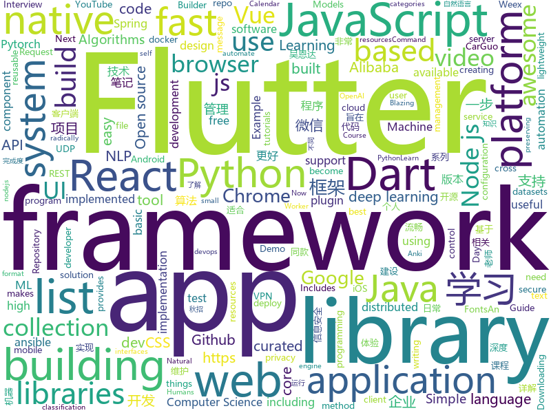

# 2018-09-23
See what the GitHub community is most excited about today.

## python
* [vid2vid](https://github.com/NVIDIA/vid2vid)(**360 stars today**): Pytorch implementation of our method for high-resolution (e.g. 2048x1024) photorealistic video-to-video translation.
* [leetCode](https://github.com/HuberTRoy/leetCode)(**224 stars today**): 算法相关知识储备
* [awesome-leetcode](https://github.com/apachecn/awesome-leetcode)(**154 stars today**): Leetcode 题解 (跟随思路一步一步撸出代码) 及经典算法实现
* [Python](https://github.com/TheAlgorithms/Python)(**81 stars today**): All Algorithms implemented in Python
* [system-design-primer](https://github.com/donnemartin/system-design-primer)(**79 stars today**): Learn how to design large-scale systems. Prep for the system design interview. Includes Anki flashcards.
* [Algorithm_Interview_Notes-Chinese](https://github.com/imhuay/Algorithm_Interview_Notes-Chinese)(**71 stars today**): 2018/2019/校招/春招/秋招/算法/机器学习(Machine Learning)/深度学习(Deep Learning)/自然语言处理(NLP)/C/C++/Python/面试笔记
* [vbuild](https://github.com/manatlan/vbuild)(**75 stars today**): "Compile" your VUE component (*.vue) to standalone html/js/css ... python only (no need of nodejs)
* [PyTorch-NEAT](https://github.com/uber-research/PyTorch-NEAT)(**47 stars today**): 
* [models](https://github.com/tensorflow/models)(**34 stars today**): Models and examples built with TensorFlow
* [Hash-Buster](https://github.com/s0md3v/Hash-Buster)(**37 stars today**): Crack hashes in seconds.
* [PySyft](https://github.com/OpenMined/PySyft)(**34 stars today**): A library for encrypted, privacy preserving deep learning - based on PyTorch
* [awesome-python](https://github.com/vinta/awesome-python)(**28 stars today**): A curated list of awesome Python frameworks, libraries, software and resources
* [youtube-dl](https://github.com/rg3/youtube-dl)(**27 stars today**): Command-line program to download videos from YouTube.com and other video sites
* [keras](https://github.com/keras-team/keras)(**23 stars today**): Deep Learning for humans
* [django](https://github.com/django/django)(**21 stars today**): The Web framework for perfectionists with deadlines.
* [public-apis](https://github.com/toddmotto/public-apis)(**24 stars today**): A collective list of public JSON APIs for use in web development.
* [aiida_core](https://github.com/aiidateam/aiida_core)(**22 stars today**): The official repository for the AiiDA code
* [stable-baselines](https://github.com/hill-a/stable-baselines)(**21 stars today**): A fork of OpenAI Baselines, implementations of reinforcement learning algorithms
* [cpython](https://github.com/python/cpython)(**17 stars today**): The Python programming language
* [petastorm](https://github.com/uber/petastorm)(**18 stars today**): Petastorm library enables single machine or distributed training and evaluation of deep learning models from datasets in Apache Parquet format. It supports ML frameworks such as Tensorflow, Pytorch, and PySpark and can be used from pure Python code.
* [home-assistant](https://github.com/home-assistant/home-assistant)(**14 stars today**): 🏡Open source home automation that puts local control and privacy first
* [flask](https://github.com/pallets/flask)(**16 stars today**): The Python micro framework for building web applications.
* [requests](https://github.com/requests/requests)(**16 stars today**): Python HTTP Requests for Humans™✨🍰✨
* [ansible](https://github.com/ansible/ansible)(**15 stars today**): Ansible is a radically simple IT automation platform that makes your applications and systems easier to deploy. Avoid writing scripts or custom code to deploy and update your applications — automate in a language that approaches plain English, using SSH, with no agents to install on remote systems. https://docs.ansible.com/ansible/
* [allennlp](https://github.com/allenai/allennlp)(**16 stars today**): An open-source NLP research library, built on PyTorch.

## java
* [arthas](https://github.com/alibaba/arthas)(**96 stars today**): Alibaba Java Diagnostic Tool Arthas/Alibaba Java诊断利器Arthas
* [JavaGuide](https://github.com/Snailclimb/JavaGuide)(**53 stars today**): A core knowledge that most Java programmers need to master
* [JCSprout](https://github.com/crossoverJie/JCSprout)(**37 stars today**): 👨‍🎓Java Core Sprout : basic, concurrent, algorithm
* [proxyee-down](https://github.com/proxyee-down-org/proxyee-down)(**38 stars today**): http下载工具，基于http代理，支持多连接分块下载
* [HackBar](https://github.com/d3vilbug/HackBar)(**34 stars today**): HackBar plugin for Burpsuite v1.0
* [Java](https://github.com/TheAlgorithms/Java)(**27 stars today**): All Algorithms implemented in Java
* [tutorials](https://github.com/eugenp/tutorials)(**21 stars today**): The "REST With Spring" Course:
* [spring-boot](https://github.com/spring-projects/spring-boot)(**20 stars today**): Spring Boot
* [elasticsearch](https://github.com/elastic/elasticsearch)(**22 stars today**): Open Source, Distributed, RESTful Search Engine
* [nacos](https://github.com/alibaba/nacos)(**20 stars today**): an easy-to-use dynamic service discovery, configuration and service management platform for building cloud native applications
* [aeron](https://github.com/real-logic/aeron)(**17 stars today**): Efficient reliable UDP unicast, UDP multicast, and IPC message transport
* [weixin-java-tools](https://github.com/Wechat-Group/weixin-java-tools)(**16 stars today**): 全能微信Java开发工具包，支持包括微信支付、开放平台、小程序、企业微信/企业号和公众号等的开发
* [Magisk](https://github.com/topjohnwu/Magisk)(**14 stars today**): A Magic Mask to Alter Android System Systemless-ly
* [tink](https://github.com/google/tink)(**15 stars today**): Tink is a multi-language, cross-platform library that provides cryptographic APIs that are secure, easy to use correctly, and hard(er) to misuse.
* [Sentinel](https://github.com/alibaba/Sentinel)(**15 stars today**): A lightweight flow-control library providing high-available protection and monitoring (高可用防护的流量管理框架)
* [simple-binary-encoding](https://github.com/real-logic/simple-binary-encoding)(**15 stars today**): Simple Binary Encoding (SBE) - High Performance Message Codec
* [guava](https://github.com/google/guava)(**11 stars today**): Google core libraries for Java
* [spring-cloud-alibaba](https://github.com/spring-cloud-incubator/spring-cloud-alibaba)(**13 stars today**): Spring Cloud Alibaba provides a one-stop solution for application development for the distributed solutions of Alibaba middleware.
* [selenium](https://github.com/SeleniumHQ/selenium)(**12 stars today**): A browser automation framework and ecosystem.
* [buck](https://github.com/facebook/buck)(**13 stars today**): A fast build system that encourages the creation of small, reusable modules over a variety of platforms and languages.
* [spring-framework](https://github.com/spring-projects/spring-framework)(**11 stars today**): Spring Framework
* [MyTikTok](https://github.com/whenSunSet/MyTikTok)(**11 stars today**): 我的抖音APP
* [tablesaw](https://github.com/jtablesaw/tablesaw)(**13 stars today**): Java dataframe and visualization library
* [symphony](https://github.com/b3log/symphony)(**11 stars today**): 🎶一款用 Java 实现的现代化社区（论坛/BBS/社交网络/博客）平台。https://hacpai.com
* [graal](https://github.com/oracle/graal)(**11 stars today**): GraalVM: Run Programs Faster Anywhere🚀

## unknown
* [math-as-code](https://github.com/Jam3/math-as-code)(**164 stars today**): a cheat-sheet for mathematical notation in code form
* [powerbank-PBK-ERC20](https://github.com/powerbankofficial/powerbank-PBK-ERC20)(**92 stars today**): Powerbank is an erc20 platform based coin for Mobile phone bill payment&recharging world
* [pwc](https://github.com/zziz/pwc)(**81 stars today**): Papers with code. Sorted by stars. Updated weekly.
* [CS-Notes](https://github.com/CyC2018/CS-Notes)(**52 stars today**): 📚Computer Science Learning Notes
* [100-Days-Of-ML-Code](https://github.com/Avik-Jain/100-Days-Of-ML-Code)(**46 stars today**): 100 Days of ML Coding
* [awesome](https://github.com/sindresorhus/awesome)(**43 stars today**): 😎Curated list of awesome lists
* [You-Dont-Know-JS](https://github.com/getify/You-Dont-Know-JS)(**38 stars today**): A book series on JavaScript. @YDKJS on twitter.
* [gitignore](https://github.com/github/gitignore)(**31 stars today**): A collection of useful .gitignore templates
* [deep_learning_object_detection](https://github.com/hoya012/deep_learning_object_detection)(**36 stars today**): A paper list of object detection using deep learning.
* [stanford-cs-229-machine-learning](https://github.com/afshinea/stanford-cs-229-machine-learning)(**33 stars today**): VIP cheatsheets for Stanford's CS 229 Machine Learning
* [ToolsOfTheTrade](https://github.com/cjbarber/ToolsOfTheTrade)(**36 stars today**): Tools of The Trade, from Hacker News.
* [test-your-sysadmin-skills](https://github.com/trimstray/test-your-sysadmin-skills)(**35 stars today**): A collection of *nix Sysadmin Test Questions and Answers for Interview/Exam (2018 Edition).
* [free-programming-books](https://github.com/EbookFoundation/free-programming-books)(**28 stars today**): 📚Freely available programming books
* [project-based-learning](https://github.com/tuvtran/project-based-learning)(**26 stars today**): Curated list of project-based tutorials
* [awesome-vue](https://github.com/vuejs/awesome-vue)(**25 stars today**): 🎉A curated list of awesome things related to Vue.js
* [free-for-dev](https://github.com/ripienaar/free-for-dev)(**27 stars today**): A list of SaaS, PaaS and IaaS offerings that have free tiers of interest to devops and infradev
* [coding-interview-university](https://github.com/jwasham/coding-interview-university)(**23 stars today**): A complete computer science study plan to become a software engineer.
* [architect-awesome](https://github.com/xingshaocheng/architect-awesome)(**22 stars today**): 后端架构师技术图谱
* [handbook](https://github.com/basecamp/handbook)(**20 stars today**): Basecamp Employee Handbook
* [nodebestpractices](https://github.com/i0natan/nodebestpractices)(**19 stars today**): The largest Node.JS best practices list (September 2018)
* [awesome-javascript](https://github.com/sorrycc/awesome-javascript)(**18 stars today**): 🐢A collection of awesome browser-side JavaScript libraries, resources and shiny things.
* [computer-science](https://github.com/ossu/computer-science)(**18 stars today**): 🎓Path to a free self-taught education in Computer Science!
* [spleen](https://github.com/fcambus/spleen)(**18 stars today**): Monospaced bitmap fonts
* [awesome-flutter](https://github.com/Solido/awesome-flutter)(**17 stars today**): An awesome list that curates the best Flutter libraries, tools, tutorials, articles and more.
* [awesome-electron](https://github.com/sindresorhus/awesome-electron)(**14 stars today**): Useful resources for creating apps with Electron

## javascript
* [ytdl-webserver](https://github.com/Algram/ytdl-webserver)(**130 stars today**): 📻Webserver for downloading youtube videos. Ready for docker.
* [rxdb](https://github.com/pubkey/rxdb)(**103 stars today**): 💻📱A realtime Database for the Web
* [grapesjs](https://github.com/artf/grapesjs)(**97 stars today**): Free and Open source Web Builder Framework. Next generation tool for building templates without coding
* [react](https://github.com/facebook/react)(**92 stars today**): A declarative, efficient, and flexible JavaScript library for building user interfaces.
* [idlize](https://github.com/GoogleChromeLabs/idlize)(**87 stars today**): Helper classes and methods for implementing the idle-until-urgent pattern
* [You-Dont-Need-Momentjs](https://github.com/you-dont-need/You-Dont-Need-Momentjs)(**84 stars today**): List of date-fns or native functions which you can use to replace moment.js + ESLint Plugin
* [vue](https://github.com/vuejs/vue)(**63 stars today**): 🖖A progressive, incrementally-adoptable JavaScript framework for building UI on the web.
* [underrun](https://github.com/phoboslab/underrun)(**59 stars today**): Twin stick shooter game in 13kb of JavaScript/WebGL
* [unit-test-demo](https://github.com/tank0317/unit-test-demo)(**55 stars today**): 一步一步介绍如何给项目添加单元测试
* [create-react-library](https://github.com/transitive-bullshit/create-react-library)(**53 stars today**): ⚡CLI for easily creating reusable react libraries.
* [create-react-app](https://github.com/facebook/create-react-app)(**45 stars today**): Create React apps with no build configuration.
* [next.js](https://github.com/zeit/next.js)(**45 stars today**): Next.js is a lightweight framework for static and server‑rendered applications.
* [javascript-algorithms](https://github.com/trekhleb/javascript-algorithms)(**39 stars today**): Algorithms and data structures implemented in JavaScript with explanations and links to further readings
* [taro](https://github.com/NervJS/taro)(**42 stars today**): 多端统一开发框架，支持用 React 的开发方式编写一次代码，生成能运行在微信小程序、H5、React Native 等的应用。
* [worker-plugin](https://github.com/GoogleChromeLabs/worker-plugin)(**43 stars today**): 🐳Adds native Web Worker bundling support to Webpack.
* [nuxt.js](https://github.com/nuxt/nuxt.js)(**39 stars today**): The Vue.js Developers Framework
* [axios](https://github.com/axios/axios)(**41 stars today**): Promise based HTTP client for the browser and node.js
* [gatsby](https://github.com/gatsbyjs/gatsby)(**37 stars today**): ⚛️📄🚀Blazing fast site generator for React
* [c8](https://github.com/bcoe/c8)(**40 stars today**): output coverage reports using Node.js' built in coverage
* [react-native](https://github.com/facebook/react-native)(**39 stars today**): A framework for building native apps with React.
* [wepy](https://github.com/Tencent/wepy)(**35 stars today**): 小程序组件化开发框架
* [node](https://github.com/nodejs/node)(**26 stars today**): Node.js JavaScript runtime✨🐢🚀✨
* [storybook](https://github.com/storybooks/storybook)(**29 stars today**): Interactive UI component dev & test: React, React Native, Vue, Angular
* [material-ui](https://github.com/mui-org/material-ui)(**27 stars today**): React components that implement Google's Material Design.
* [puppeteer](https://github.com/GoogleChrome/puppeteer)(**30 stars today**): Headless Chrome Node API

## html
* [awesome-mac](https://github.com/jaywcjlove/awesome-mac)(**20 stars today**):  Now we have become very big, Different from the original idea. Collect premium software in various categories.
* [chrome](https://github.com/free-vpn/chrome)(**13 stars today**): VPN Chrome is Google Chromium based browser with built-in VPN capability to let users surf the Internet in a secure and private way.
* [fastText](https://github.com/facebookresearch/fastText)(**11 stars today**): Library for fast text representation and classification.
* [styleguide](https://github.com/google/styleguide)(**11 stars today**): Style guides for Google-originated open-source projects
* [deeplearning_ai_books](https://github.com/fengdu78/deeplearning_ai_books)(**10 stars today**): deeplearning.ai（吴恩达老师的深度学习课程笔记及资源）
* [Spoon-Knife](https://github.com/octocat/Spoon-Knife)(****): This repo is for demonstration purposes only.
* [trashy.css](https://github.com/t7/trashy.css)(**11 stars today**): Trashy.css - The throwaway CSS library with no `class`.
* [JavaScript30](https://github.com/wesbos/JavaScript30)(**6 stars today**): 30 Day Vanilla JS Challenge
* [patchwork](https://github.com/jlord/patchwork)(****): All the Git-it Workshop completers!
* [Coursera-ML-AndrewNg-Notes](https://github.com/fengdu78/Coursera-ML-AndrewNg-Notes)(**7 stars today**): 吴恩达老师的机器学习课程个人笔记
* [qiubaiying.github.io](https://github.com/qiubaiying/qiubaiying.github.io)(**5 stars today**): BY Blog ->
* [TranslatorX](https://github.com/pingfangx/TranslatorX)(**7 stars today**): JetBrains 系列软件汉化包
* [angularconferences.github.io](https://github.com/UltimateAngular/angularconferences.github.io)(**7 stars today**): 🔥Calendar for the Angular community events happening across the globe
* [30-seconds-of-css](https://github.com/30-seconds/30-seconds-of-css)(**7 stars today**): A curated collection of useful CSS snippets.
* [NLP-progress](https://github.com/sebastianruder/NLP-progress)(**6 stars today**): Repository to track the progress in Natural Language Processing (NLP), including the datasets and the current state-of-the-art for the most common NLP tasks.
* [gentelella](https://github.com/puikinsh/gentelella)(**6 stars today**): Free Bootstrap 3 Admin Template
* [javascript-tutorial-en](https://github.com/iliakan/javascript-tutorial-en)(**5 stars today**): Modern JavaScript Tutorial
* [fonts](https://github.com/google/fonts)(**5 stars today**): Font files available from Google Fonts
* [cupper](https://github.com/ThePacielloGroup/cupper)(**5 stars today**): An inclusive pattern library builder.
* [nodejs-ex](https://github.com/sclorg/nodejs-ex)(****): node.js example
* [portainer](https://github.com/portainer/portainer)(**5 stars today**): Simple management UI for Docker
* [expressjs.com](https://github.com/expressjs/expressjs.com)(**5 stars today**): 
* [SecurityMind](https://github.com/ym2011/SecurityMind)(**5 stars today**): 旨在通过分析企业信息安全建设过程中的心路历程 #从技术、管理、治理等多个层面了解企业信息安全建设的不同阶段
* [talks](https://github.com/katzien/talks)(**5 stars today**): Slides and abstracts for my talks.
* [game-of-life](https://github.com/wakaleo/game-of-life)(****): Demo application for the 'Jenkins: The Definitive Guide' book

## dart
* [flutter](https://github.com/flutter/flutter)(**101 stars today**): Flutter makes it easy and fast to build beautiful mobile apps.
* [auto_size_text](https://github.com/leisim/auto_size_text)(**14 stars today**): Flutter widget that automatically resizes text to fit perfectly within its bounds.
* [GSYGithubAppFlutter](https://github.com/CarGuo/GSYGithubAppFlutter)(**10 stars today**): 超完整的Flutter项目，功能丰富，适合学习和日常使用。GSYGithubApp系列的优势：我们目前已经拥有Flutter、Weex、ReactNative三个版本。 功能齐全，项目框架内技术涉及面广，完成度高，持续维护，配套文章，适合全面学习，跨框架对比参考。跨平台的开源Github客户端App，更好的体验，更丰富的功能，旨在更好的日常管理和维护个人Github，提供更好更方便的驾车体验～～Σ(￣。￣ﾉ)ﾉ。同款Weex版本 ： https://github.com/CarGuo/GSYGithubAppWeex 、同款React Native版本 ： https://github.com/CarGuo/GSYGithubApp
* [plugins](https://github.com/flutter/plugins)(**7 stars today**): Plugins for Flutter, including FlutterFire, maintained by the Flutter team
* [flutter_mlkit](https://github.com/azihsoyn/flutter_mlkit)(**5 stars today**): A Flutter plugin to use the Firebase ML Kit.
* [Flutter-Notebook](https://github.com/Vadaski/Flutter-Notebook)(**5 stars today**): 日更的FlutterDemo合集
* [flutter_architecture_samples](https://github.com/brianegan/flutter_architecture_samples)(**5 stars today**): TodoMVC for Flutter
* [Flutter-learning](https://github.com/AweiLoveAndroid/Flutter-learning)(**5 stars today**): 🔥👍🌟⭐️⭐️⭐️Flutter从配置安装到填坑指南详解，Flutter相关Demo解读，项目实例，Dart语法详解
* [zhihu-flutter](https://github.com/HackSoul/zhihu-flutter)(****): Flutter 高仿知乎 UI，非常漂亮，也非常流畅，flutter build apk 或 flutter build ios 之后更流畅
* [test](https://github.com/dart-lang/test)(****): A library for writing unit tests in Dart.
* [chromedeveditor](https://github.com/googlearchive/chromedeveditor)(****): Chrome Dev Editor is a developer tool for building apps on the Chrome platform - Chrome Apps and Web Apps, in JavaScript or Dart. (NO LONGER IN ACTIVE DEVELOPMENT)
* [sdk](https://github.com/dart-lang/sdk)(****): The Dart SDK, including the VM, dart2js, core libraries, and more.
* [flutter-osc](https://github.com/yubo725/flutter-osc)(****): 基于Google Flutter的开源中国客户端，支持Android和iOS。
* [flutter-examples](https://github.com/nisrulz/flutter-examples)(****): [Examples] Simple basic isolated apps, for budding flutter devs.
* [Flutter-UI-Kit](https://github.com/iampawan/Flutter-UI-Kit)(****): Flutter app for collection of UI in a UIKit
* [inKino](https://github.com/roughike/inKino)(****): inKino - A cross platform movie and showtime browser for Finnkino cinemas, made with Flutter.
* [FlutterExampleApps](https://github.com/iampawan/FlutterExampleApps)(****): [Example APPS] Basic Flutter apps, for flutter devs.
* [hauberk](https://github.com/munificent/hauberk)(****): A web-based roguelike written in Dart.
* [dio](https://github.com/flutterchina/dio)(****): A powerful Http client for Dart, which supports Interceptors, FormData, Request Cancellation, File Downloading, Timeout etc.
* [angular](https://github.com/dart-lang/angular)(****): Fast and productive web framework provided by Dart
* [StageXL](https://github.com/bp74/StageXL)(****): A fast and universal 2D rendering engine for HTML5 and Dart.
* [dart-sass](https://github.com/sass/dart-sass)(****): A Dart implementation of Sass.
* [rxdart](https://github.com/ReactiveX/rxdart)(****): The Reactive Extensions for Dart
* [github-issue-mover](https://github.com/google/github-issue-mover)(****): Making it easy to migrate issues between repos.
* [aqueduct](https://github.com/stablekernel/aqueduct)(****): Dart HTTP server framework for building REST APIs. Includes PostgreSQL ORM and OAuth2 provider.

## WordCloud

