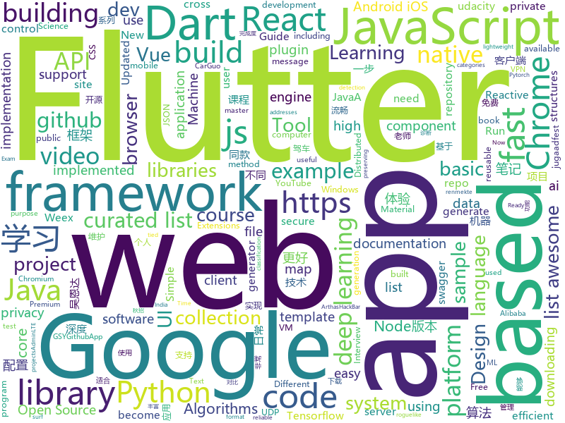

# 2018-09-24
See what the GitHub community is most excited about today.

## python
* [Python](https://github.com/TheAlgorithms/Python)(**742 stars today**): All Algorithms implemented in Python
* [vid2vid](https://github.com/NVIDIA/vid2vid)(**124 stars today**): Pytorch implementation of our method for high-resolution (e.g. 2048x1024) photorealistic video-to-video translation.
* [ungoogled-chromium](https://github.com/Eloston/ungoogled-chromium)(**113 stars today**): Modifications to Google Chromium for removing Google integration and enhancing privacy, control, and transparency
* [Danger-zone](https://github.com/woj-ciech/Danger-zone)(**85 stars today**): Correlate data between domains, IPs and email addresses, present it as a graph and store everything into Elasticsearch and JSON files.
* [leetCode](https://github.com/HuberTRoy/leetCode)(**85 stars today**): 算法相关知识储备
* [Algorithm_Interview_Notes-Chinese](https://github.com/imhuay/Algorithm_Interview_Notes-Chinese)(**79 stars today**): 2018/2019/校招/春招/秋招/算法/机器学习(Machine Learning)/深度学习(Deep Learning)/自然语言处理(NLP)/C/C++/Python/面试笔记
* [awesome-leetcode](https://github.com/apachecn/awesome-leetcode)(**76 stars today**): Leetcode 题解 (跟随思路一步一步撸出代码) 及经典算法实现
* [vbuild](https://github.com/manatlan/vbuild)(**72 stars today**): "Compile" your VUE component (*.vue) to standalone html/js/css ... python only (no need of nodejs)
* [mlcourse.ai](https://github.com/Yorko/mlcourse.ai)(**66 stars today**): Open Machine Learning course mlcourse.ai, both in English and Russian
* [system-design-primer](https://github.com/donnemartin/system-design-primer)(**60 stars today**): Learn how to design large-scale systems. Prep for the system design interview. Includes Anki flashcards.
* [TensorFlow-cn](https://github.com/snowkylin/TensorFlow-cn)(**44 stars today**): 简单粗暴TensorFlow | A Concise Handbook of TensorFlow
* [models](https://github.com/tensorflow/models)(**35 stars today**): Models and examples built with TensorFlow
* [electrum](https://github.com/spesmilo/electrum)(**36 stars today**): Electrum; Bitcoin thin client
* [algorithms](https://github.com/keon/algorithms)(**32 stars today**): Minimal examples of data structures and algorithms in Python
* [awesome-python](https://github.com/vinta/awesome-python)(**30 stars today**): A curated list of awesome Python frameworks, libraries, software and resources
* [texar](https://github.com/asyml/texar)(**31 stars today**): Toolkit for Text Generation and Beyond
* [keras](https://github.com/keras-team/keras)(**24 stars today**): Deep Learning for humans
* [petastorm](https://github.com/uber/petastorm)(**27 stars today**): Petastorm library enables single machine or distributed training and evaluation of deep learning models from datasets in Apache Parquet format. It supports ML frameworks such as Tensorflow, Pytorch, and PySpark and can be used from pure Python code.
* [youtube-dl](https://github.com/rg3/youtube-dl)(**25 stars today**): Command-line program to download videos from YouTube.com and other video sites
* [PySyft](https://github.com/OpenMined/PySyft)(**25 stars today**): A library for encrypted, privacy preserving deep learning - based on PyTorch
* [aiida_core](https://github.com/aiidateam/aiida_core)(**24 stars today**): The official repository for the AiiDA code
* [public-apis](https://github.com/toddmotto/public-apis)(**21 stars today**): A collective list of public JSON APIs for use in web development.
* [PyTorch-NEAT](https://github.com/uber-research/PyTorch-NEAT)(**21 stars today**): 
* [flask](https://github.com/pallets/flask)(**17 stars today**): The Python micro framework for building web applications.
* [scrapy](https://github.com/scrapy/scrapy)(**19 stars today**): Scrapy, a fast high-level web crawling & scraping framework for Python.

## java
* [arthas](https://github.com/alibaba/arthas)(**81 stars today**): Alibaba Java Diagnostic Tool Arthas/Alibaba Java诊断利器Arthas
* [HackBar](https://github.com/d3vilbug/HackBar)(**44 stars today**): HackBar plugin for Burpsuite v1.0
* [kodlama-pratikleri](https://github.com/msusur/kodlama-pratikleri)(**37 stars today**): Bu projenin amacı yazılım geliştirmeyi öğrenmekte olan ya da işi Code Golf seviyesinde ele almak isteyenlere uğraşacak problemler çıkartmaktır.
* [proxyee-down](https://github.com/proxyee-down-org/proxyee-down)(**39 stars today**): http下载工具，基于http代理，支持多连接分块下载
* [Java](https://github.com/TheAlgorithms/Java)(**31 stars today**): All Algorithms implemented in Java
* [JavaGuide](https://github.com/Snailclimb/JavaGuide)(**26 stars today**): A core knowledge that most Java programmers need to master
* [JCSprout](https://github.com/crossoverJie/JCSprout)(**24 stars today**): 👨‍🎓Java Core Sprout : basic, concurrent, algorithm
* [spring-framework](https://github.com/spring-projects/spring-framework)(**20 stars today**): Spring Framework
* [spring-boot](https://github.com/spring-projects/spring-boot)(**16 stars today**): Spring Boot
* [tutorials](https://github.com/eugenp/tutorials)(**10 stars today**): The "REST With Spring" Course:
* [selenium](https://github.com/SeleniumHQ/selenium)(**17 stars today**): A browser automation framework and ecosystem.
* [aeron](https://github.com/real-logic/aeron)(**19 stars today**): Efficient reliable UDP unicast, UDP multicast, and IPC message transport
* [symphony](https://github.com/b3log/symphony)(**18 stars today**): 🎶一款用 Java 实现的现代化社区（论坛/BBS/社交网络/博客）平台。https://hacpai.com
* [download-manager](https://github.com/novoda/download-manager)(**18 stars today**): Download manager based on AOSP DM but allowing downloading to internal private storage
* [tink](https://github.com/google/tink)(**17 stars today**): Tink is a multi-language, cross-platform library that provides cryptographic APIs that are secure, easy to use correctly, and hard(er) to misuse.
* [elasticsearch](https://github.com/elastic/elasticsearch)(**12 stars today**): Open Source, Distributed, RESTful Search Engine
* [JAViewer](https://github.com/SplashCodes/JAViewer)(**14 stars today**): 更优雅的驾车体验
* [RxJava](https://github.com/ReactiveX/RxJava)(**12 stars today**): RxJava – Reactive Extensions for the JVM – a library for composing asynchronous and event-based programs using observable sequences for the Java VM.
* [guava](https://github.com/google/guava)(**13 stars today**): Google core libraries for Java
* [Magisk](https://github.com/topjohnwu/Magisk)(**13 stars today**): A Magic Mask to Alter Android System Systemless-ly
* [quickstart-android](https://github.com/firebase/quickstart-android)(**12 stars today**): Firebase Quickstart Samples for Android
* [simple-binary-encoding](https://github.com/real-logic/simple-binary-encoding)(**11 stars today**): Simple Binary Encoding (SBE) - High Performance Message Codec
* [apollo](https://github.com/ctripcorp/apollo)(**11 stars today**): Apollo（阿波罗）是携程框架部门研发的分布式配置中心，能够集中化管理应用不同环境、不同集群的配置，配置修改后能够实时推送到应用端，并且具备规范的权限、流程治理等特性，适用于微服务配置管理场景。
* [JFoenix](https://github.com/jfoenixadmin/JFoenix)(**10 stars today**): JavaFX Material Design Library
* [buck](https://github.com/facebook/buck)(**10 stars today**): A fast build system that encourages the creation of small, reusable modules over a variety of platforms and languages.

## unknown
* [deep_learning_object_detection](https://github.com/hoya012/deep_learning_object_detection)(**270 stars today**): A paper list of object detection using deep learning.
* [math-as-code](https://github.com/Jam3/math-as-code)(**116 stars today**): a cheat-sheet for mathematical notation in code form
* [pwc](https://github.com/zziz/pwc)(**83 stars today**): Papers with code. Sorted by stars. Updated weekly.
* [powerbank-PBK-ERC20](https://github.com/powerbankofficial/powerbank-PBK-ERC20)(**63 stars today**): Powerbank is an erc20 platform based coin for Mobile phone bill payment&recharging world
* [gitignore](https://github.com/github/gitignore)(**33 stars today**): A collection of useful .gitignore templates
* [handbook](https://github.com/basecamp/handbook)(**42 stars today**): Basecamp Employee Handbook
* [You-Dont-Know-JS](https://github.com/getify/You-Dont-Know-JS)(**37 stars today**): A book series on JavaScript. @YDKJS on twitter.
* [CS-Notes](https://github.com/CyC2018/CS-Notes)(**39 stars today**): 📚Computer Science Learning Notes
* [awesome](https://github.com/sindresorhus/awesome)(**35 stars today**): 😎Curated list of awesome lists
* [coding-interview-university](https://github.com/jwasham/coding-interview-university)(**33 stars today**): A complete computer science study plan to become a software engineer.
* [A-to-Z-Resources-for-Students](https://github.com/dipakkr/A-to-Z-Resources-for-Students)(**34 stars today**): A to Z Resources for students as well as working proffessionals
* [build-your-own-x](https://github.com/danistefanovic/build-your-own-x)(**36 stars today**): 🤓Build your own (insert technology here)
* [ToolsOfTheTrade](https://github.com/cjbarber/ToolsOfTheTrade)(**33 stars today**): Tools of The Trade, from Hacker News.
* [100-Days-Of-ML-Code](https://github.com/Avik-Jain/100-Days-Of-ML-Code)(**27 stars today**): 100 Days of ML Coding
* [free-programming-books](https://github.com/EbookFoundation/free-programming-books)(**26 stars today**): 📚Freely available programming books
* [project-based-learning](https://github.com/tuvtran/project-based-learning)(**29 stars today**): Curated list of project-based tutorials
* [test-your-sysadmin-skills](https://github.com/trimstray/test-your-sysadmin-skills)(**27 stars today**): A collection of *nix Sysadmin Test Questions and Answers for Interview/Exam (2018 Edition).
* [free-for-dev](https://github.com/ripienaar/free-for-dev)(**25 stars today**): A list of SaaS, PaaS and IaaS offerings that have free tiers of interest to devops and infradev
* [awesome-thesis](https://github.com/ocean1/awesome-thesis)(**24 stars today**): A curated list of practical tips and tricks to help you survive your CS master thesis [WIP] - contributions are welcome
* [awesome-vue](https://github.com/vuejs/awesome-vue)(**19 stars today**): 🎉A curated list of awesome things related to Vue.js
* [awesome-deep-learning](https://github.com/ChristosChristofidis/awesome-deep-learning)(**16 stars today**): A curated list of awesome Deep Learning tutorials, projects and communities.
* [architect-awesome](https://github.com/xingshaocheng/architect-awesome)(**14 stars today**): 后端架构师技术图谱
* [WebSiteUseful](https://github.com/loremwalker/WebSiteUseful)(**12 stars today**): 🍅翻墙！科学上网，免费ss帐号分享、ssr订阅源，免费VPN下载，获取及使用教程请看：https://github.com/loremwalker/fq-book
* [nodebestpractices](https://github.com/i0natan/nodebestpractices)(**15 stars today**): The largest Node.JS best practices list (September 2018)
* [trackerslist](https://github.com/ngosang/trackerslist)(**14 stars today**): An updated list of public BitTorrent trackers

## javascript
* [ytdl-webserver](https://github.com/Algram/ytdl-webserver)(**274 stars today**): 📻Webserver for downloading youtube videos. Ready for docker.
* [rxdb](https://github.com/pubkey/rxdb)(**139 stars today**): 💻📱A realtime Database for the Web
* [vue](https://github.com/vuejs/vue)(**81 stars today**): 🖖A progressive, incrementally-adoptable JavaScript framework for building UI on the web.
* [You-Dont-Need-Momentjs](https://github.com/you-dont-need/You-Dont-Need-Momentjs)(**79 stars today**): List of date-fns or native functions which you can use to replace moment.js + ESLint Plugin
* [create-react-app](https://github.com/facebook/create-react-app)(**69 stars today**): Create React apps with no build configuration.
* [storybook](https://github.com/storybooks/storybook)(**60 stars today**): Interactive UI component dev & test: React, React Native, Vue, Angular
* [grapesjs](https://github.com/artf/grapesjs)(**63 stars today**): Free and Open source Web Builder Framework. Next generation tool for building templates without coding
* [react](https://github.com/facebook/react)(**51 stars today**): A declarative, efficient, and flexible JavaScript library for building user interfaces.
* [javascript-algorithms](https://github.com/trekhleb/javascript-algorithms)(**46 stars today**): Algorithms and data structures implemented in JavaScript with explanations and links to further readings
* [next.js](https://github.com/zeit/next.js)(**47 stars today**): Next.js is a lightweight framework for static and server‑rendered applications.
* [gatsby](https://github.com/gatsbyjs/gatsby)(**39 stars today**): ⚛️📄🚀Blazing fast site generator for React
* [create-react-library](https://github.com/transitive-bullshit/create-react-library)(**41 stars today**): ⚡CLI for easily creating reusable react libraries.
* [react-native](https://github.com/facebook/react-native)(**38 stars today**): A framework for building native apps with React.
* [idlize](https://github.com/GoogleChromeLabs/idlize)(**39 stars today**): Helper classes and methods for implementing the idle-until-urgent pattern
* [puppeteer](https://github.com/GoogleChrome/puppeteer)(**37 stars today**): Headless Chrome Node API
* [axios](https://github.com/axios/axios)(**35 stars today**): Promise based HTTP client for the browser and node.js
* [node](https://github.com/nodejs/node)(**33 stars today**): Node.js JavaScript runtime✨🐢🚀✨
* [worker-plugin](https://github.com/GoogleChromeLabs/worker-plugin)(**34 stars today**): 🐳Adds native Web Worker bundling support to Webpack.
* [koa](https://github.com/koajs/koa)(**30 stars today**): Expressive middleware for node.js using ES2017 async functions
* [wwwbasic](https://github.com/google/wwwbasic)(**30 stars today**): WWWBasic is an implementation of BASIC (Beginner's All-purpose Symbolic Instruction Code) designed to be easy to run on the Web.
* [windows95](https://github.com/felixrieseberg/windows95)(**28 stars today**): 💩🚀Windows 95 in Electron. Runs on macOS, Linux, and Windows.
* [underrun](https://github.com/phoboslab/underrun)(**27 stars today**): Twin stick shooter game in 13kb of JavaScript/WebGL
* [material-ui](https://github.com/mui-org/material-ui)(**23 stars today**): React components that implement Google's Material Design.
* [mdx](https://github.com/mdx-js/mdx)(**26 stars today**): JSX in Markdown for ambitious projects
* [three.js](https://github.com/mrdoob/three.js)(**23 stars today**): JavaScript 3D library.

## html
* [styleguide](https://github.com/google/styleguide)(**14 stars today**): Style guides for Google-originated open-source projects
* [AdminLTE](https://github.com/almasaeed2010/AdminLTE)(**12 stars today**): AdminLTE - Free Premium Admin control Panel Theme Based On Bootstrap 3.x
* [awesome-mac](https://github.com/jaywcjlove/awesome-mac)(**15 stars today**):  Now we have become very big, Different from the original idea. Collect premium software in various categories.
* [Spoon-Knife](https://github.com/octocat/Spoon-Knife)(****): This repo is for demonstration purposes only.
* [qiubaiying.github.io](https://github.com/qiubaiying/qiubaiying.github.io)(**5 stars today**): BY Blog ->
* [patchwork](https://github.com/jlord/patchwork)(****): All the Git-it Workshop completers!
* [Coursera-ML-AndrewNg-Notes](https://github.com/fengdu78/Coursera-ML-AndrewNg-Notes)(**8 stars today**): 吴恩达老师的机器学习课程个人笔记
* [fastText](https://github.com/facebookresearch/fastText)(**9 stars today**): Library for fast text representation and classification.
* [highcharts](https://github.com/highcharts/highcharts)(**9 stars today**): Highcharts JS, the JavaScript charting framework
* [chrome](https://github.com/free-vpn/chrome)(**7 stars today**): VPN Chrome is Google Chromium based browser with built-in VPN capability to let users surf the Internet in a secure and private way.
* [samples](https://github.com/GoogleChrome/samples)(**6 stars today**): A repo containing samples tied to new functionality in each release of Google Chrome.
* [app-privacy-policy-generator](https://github.com/nisrulz/app-privacy-policy-generator)(**7 stars today**): A simple web app to generate a generic privacy policy for your Android/iOS apps
* [fonts](https://github.com/google/fonts)(**6 stars today**): Font files available from Google Fonts
* [go101](https://github.com/go101/go101)(**7 stars today**): A book focusing on Go syntax/semantics.
* [deeplearning_ai_books](https://github.com/fengdu78/deeplearning_ai_books)(**6 stars today**): deeplearning.ai（吴恩达老师的深度学习课程笔记及资源）
* [typedoc](https://github.com/TypeStrong/typedoc)(**6 stars today**): Documentation generator for TypeScript projects.
* [swagger-codegen](https://github.com/swagger-api/swagger-codegen)(**6 stars today**): swagger-codegen contains a template-driven engine to generate documentation, API clients and server stubs in different languages by parsing your OpenAPI / Swagger definition.
* [pipeline](https://github.com/PipelineAI/pipeline)(**6 stars today**): PipelineAI: Real-Time Enterprise AI Platform
* [TranslatorX](https://github.com/pingfangx/TranslatorX)(**6 stars today**): JetBrains 系列软件汉化包
* [javascript-tutorial-en](https://github.com/iliakan/javascript-tutorial-en)(**5 stars today**): Modern JavaScript Tutorial
* [30-seconds-of-css](https://github.com/30-seconds/30-seconds-of-css)(**5 stars today**): A curated collection of useful CSS snippets.
* [jugaadfest.com](https://github.com/fossasia/jugaadfest.com)(**5 stars today**): Jugaadfest in India https://jugaadfest.com
* [game-of-life](https://github.com/wakaleo/game-of-life)(****): Demo application for the 'Jenkins: The Definitive Guide' book
* [ud864](https://github.com/udacity/ud864)(****): Public repository for code examples used in Udacity's Google Maps APIs course (https://www.udacity.com/course/google-maps-apis--ud864).
* [documentation](https://github.com/DataDog/documentation)(****): The source for Datadog's documentation site.

## dart
* [flutter](https://github.com/flutter/flutter)(**56 stars today**): Flutter makes it easy and fast to build beautiful mobile apps.
* [plugins](https://github.com/flutter/plugins)(**9 stars today**): Plugins for Flutter, including FlutterFire, maintained by the Flutter team
* [firebase-dart](https://github.com/FirebaseExtended/firebase-dart)(****): Dart wrapper for Firebase
* [geolocation](https://github.com/loup-v/geolocation)(****): Flutter geolocation plugin for Android and iOS.
* [sdk](https://github.com/dart-lang/sdk)(****): The Dart SDK, including the VM, dart2js, core libraries, and more.
* [website](https://github.com/flutter/website)(****): Flutter web site
* [flutter_map](https://github.com/apptreesoftware/flutter_map)(****): A Flutter map package based on leaflet
* [flutter_3d_obj](https://github.com/hemanthrajv/flutter_3d_obj)(****): Renders a wavefront .obj on to a canvas.
* [flutter_movie_app](https://github.com/ibhavikmakwana/flutter_movie_app)(****): 
* [chromedeveditor](https://github.com/googlearchive/chromedeveditor)(****): Chrome Dev Editor is a developer tool for building apps on the Chrome platform - Chrome Apps and Web Apps, in JavaScript or Dart. (NO LONGER IN ACTIVE DEVELOPMENT)
* [GSYGithubAppFlutter](https://github.com/CarGuo/GSYGithubAppFlutter)(****): 超完整的Flutter项目，功能丰富，适合学习和日常使用。GSYGithubApp系列的优势：我们目前已经拥有Flutter、Weex、ReactNative三个版本。 功能齐全，项目框架内技术涉及面广，完成度高，持续维护，配套文章，适合全面学习，跨框架对比参考。跨平台的开源Github客户端App，更好的体验，更丰富的功能，旨在更好的日常管理和维护个人Github，提供更好更方便的驾车体验～～Σ(￣。￣ﾉ)ﾉ。同款Weex版本 ： https://github.com/CarGuo/GSYGithubAppWeex 、同款React Native版本 ： https://github.com/CarGuo/GSYGithubApp
* [flutter-osc](https://github.com/yubo725/flutter-osc)(****): 基于Google Flutter的开源中国客户端，支持Android和iOS。
* [flutter-examples](https://github.com/nisrulz/flutter-examples)(****): [Examples] Simple basic isolated apps, for budding flutter devs.
* [Flutter-UI-Kit](https://github.com/iampawan/Flutter-UI-Kit)(****): Flutter app for collection of UI in a UIKit
* [inKino](https://github.com/roughike/inKino)(****): inKino - A cross platform movie and showtime browser for Finnkino cinemas, made with Flutter.
* [flutter_architecture_samples](https://github.com/brianegan/flutter_architecture_samples)(****): TodoMVC for Flutter
* [FlutterExampleApps](https://github.com/iampawan/FlutterExampleApps)(****): [Example APPS] Basic Flutter apps, for flutter devs.
* [Flutter-learning](https://github.com/AweiLoveAndroid/Flutter-learning)(****): 🔥👍🌟⭐️⭐️⭐️Flutter install&settings,Flutter problems when developing,Flutter sample codes& templates,Flutter projects,Dart languages sample codes
* [hauberk](https://github.com/munificent/hauberk)(****): A web-based roguelike written in Dart.
* [dio](https://github.com/flutterchina/dio)(****): A powerful Http client for Dart, which supports Interceptors, FormData, Request Cancellation, File Downloading, Timeout etc.
* [angular](https://github.com/dart-lang/angular)(****): Fast and productive web framework provided by Dart
* [zhihu-flutter](https://github.com/HackSoul/zhihu-flutter)(****): Flutter 高仿知乎 UI，非常漂亮，也非常流畅，flutter build apk 或 flutter build ios 之后更流畅
* [StageXL](https://github.com/bp74/StageXL)(****): A fast and universal 2D rendering engine for HTML5 and Dart.
* [dart-sass](https://github.com/sass/dart-sass)(****): A Dart implementation of Sass.
* [rxdart](https://github.com/ReactiveX/rxdart)(****): The Reactive Extensions for Dart

## WordCloud

