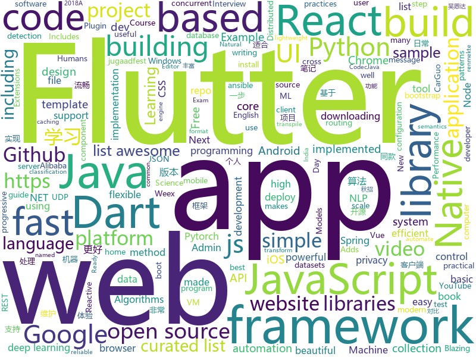

# 2018-09-25
See what the GitHub community is most excited about today.

## python
* [ungoogled-chromium](https://github.com/Eloston/ungoogled-chromium)(**936 stars today**): Modifications to Google Chromium for removing Google integration and enhancing privacy, control, and transparency
* [Python](https://github.com/TheAlgorithms/Python)(**617 stars today**): All Algorithms implemented in Python
* [Algorithm_Interview_Notes-Chinese](https://github.com/imhuay/Algorithm_Interview_Notes-Chinese)(**362 stars today**): 2018/2019/校招/春招/秋招/算法/机器学习(Machine Learning)/深度学习(Deep Learning)/自然语言处理(NLP)/C/C++/Python/面试笔记
* [pypeln](https://github.com/cgarciae/pypeln)(**336 stars today**): Concurrent data pipelines made easy
* [mlcourse.ai](https://github.com/Yorko/mlcourse.ai)(**147 stars today**): Open Machine Learning course mlcourse.ai, both in English and Russian
* [Danger-zone](https://github.com/woj-ciech/Danger-zone)(**137 stars today**): Correlate data between domains, IPs and email addresses, present it as a graph and store everything into Elasticsearch and JSON files.
* [python-shortcuts](https://github.com/alexander-akhmetov/python-shortcuts)(**139 stars today**): Create Siri Shortcuts with Python
* [awesome-algorithm](https://github.com/apachecn/awesome-algorithm)(**80 stars today**): Leetcode 题解 (跟随思路一步一步撸出代码) 及经典算法实现
* [vid2vid](https://github.com/NVIDIA/vid2vid)(**79 stars today**): Pytorch implementation of our method for high-resolution (e.g. 2048x1024) photorealistic video-to-video translation.
* [system-design-primer](https://github.com/donnemartin/system-design-primer)(**63 stars today**): Learn how to design large-scale systems. Prep for the system design interview. Includes Anki flashcards.
* [models](https://github.com/tensorflow/models)(**31 stars today**): Models and examples built with TensorFlow
* [PyPortfolioOpt](https://github.com/robertmartin8/PyPortfolioOpt)(**44 stars today**): Financial portfolio optimisation in python, including classical efficient frontier and experimental methods.
* [beauty-net](https://github.com/cms-flash/beauty-net)(**44 stars today**): A simple, flexible, and extensible template for PyTorch. It's beautiful.
* [leetCode](https://github.com/HuberTRoy/leetCode)(**38 stars today**): 算法相关知识储备
* [youtube-dl](https://github.com/rg3/youtube-dl)(**33 stars today**): Command-line program to download videos from YouTube.com and other video sites
* [keras](https://github.com/keras-team/keras)(**27 stars today**): Deep Learning for humans
* [home-assistant](https://github.com/home-assistant/home-assistant)(**29 stars today**): 🏡Open source home automation that puts local control and privacy first
* [awesome-python](https://github.com/vinta/awesome-python)(**32 stars today**): A curated list of awesome Python frameworks, libraries, software and resources
* [ansible](https://github.com/ansible/ansible)(**25 stars today**): Ansible is a radically simple IT automation platform that makes your applications and systems easier to deploy. Avoid writing scripts or custom code to deploy and update your applications — automate in a language that approaches plain English, using SSH, with no agents to install on remote systems. https://docs.ansible.com/ansible/
* [petastorm](https://github.com/uber/petastorm)(**27 stars today**): Petastorm library enables single machine or distributed training and evaluation of deep learning models from datasets in Apache Parquet format. It supports ML frameworks such as Tensorflow, Pytorch, and PySpark and can be used from pure Python code.
* [cpython](https://github.com/python/cpython)(**23 stars today**): The Python programming language
* [public-apis](https://github.com/toddmotto/public-apis)(**26 stars today**): A collective list of public JSON APIs for use in web development.
* [InstaPy](https://github.com/timgrossmann/InstaPy)(**25 stars today**): 📷Instagram Bot - Like/Comment/Follow Automation Script
* [electrum](https://github.com/spesmilo/electrum)(**25 stars today**): Electrum; Bitcoin thin client
* [flask](https://github.com/pallets/flask)(**21 stars today**): The Python micro framework for building web applications.

## java
* [arthas](https://github.com/alibaba/arthas)(**85 stars today**): Alibaba Java Diagnostic Tool Arthas/Alibaba Java诊断利器Arthas
* [download-manager](https://github.com/novoda/download-manager)(**45 stars today**): Download manager based on AOSP DM but allowing downloading to internal private storage
* [java-design-patterns](https://github.com/iluwatar/java-design-patterns)(**39 stars today**): Design patterns implemented in Java
* [JavaGuide](https://github.com/Snailclimb/JavaGuide)(**39 stars today**): A core knowledge that most Java programmers need to master
* [Java](https://github.com/TheAlgorithms/Java)(**39 stars today**): All Algorithms implemented in Java
* [HackBar](https://github.com/d3vilbug/HackBar)(**34 stars today**): HackBar plugin for Burpsuite v1.0
* [proxyee-down](https://github.com/proxyee-down-org/proxyee-down)(**32 stars today**): http下载工具，基于http代理，支持多连接分块下载
* [spring-boot](https://github.com/spring-projects/spring-boot)(**22 stars today**): Spring Boot
* [symphony](https://github.com/b3log/symphony)(**25 stars today**): 🎶一款用 Java 实现的现代化社区（论坛/BBS/社交网络/博客）平台。https://hacpai.com
* [tutorials](https://github.com/eugenp/tutorials)(**15 stars today**): The "REST With Spring" Course:
* [elasticsearch](https://github.com/elastic/elasticsearch)(**20 stars today**): Open Source, Distributed, RESTful Search Engine
* [selenium](https://github.com/SeleniumHQ/selenium)(**22 stars today**): A browser automation framework and ecosystem.
* [easyexcel](https://github.com/alibaba/easyexcel)(**21 stars today**): 快速、简单避免OOM的java处理Excel工具
* [aeron](https://github.com/real-logic/aeron)(**21 stars today**): Efficient reliable UDP unicast, UDP multicast, and IPC message transport
* [spoon](https://github.com/INRIA/spoon)(**19 stars today**): Spoon is a library to analyze, transform, rewrite, transpile Java source code (incl Java 9 & Java 10). It parses source files to build a well-designed AST with powerful analysis and transformation API. Made at Inria with❤️,🍻and✨.
* [JCSprout](https://github.com/crossoverJie/JCSprout)(**15 stars today**): 👨‍🎓Java Core Sprout : basic, concurrent, algorithm
* [RxJava](https://github.com/ReactiveX/RxJava)(**14 stars today**): RxJava – Reactive Extensions for the JVM – a library for composing asynchronous and event-based programs using observable sequences for the Java VM.
* [kodlama-pratikleri](https://github.com/msusur/kodlama-pratikleri)(**13 stars today**): Bu projenin amacı yazılım geliştirmeyi öğrenmekte olan ya da işi Code Golf seviyesinde ele almak isteyenlere uğraşacak problemler çıkartmaktır.
* [guava](https://github.com/google/guava)(**14 stars today**): Google core libraries for Java
* [spring-framework](https://github.com/spring-projects/spring-framework)(**13 stars today**): Spring Framework
* [glide](https://github.com/bumptech/glide)(**15 stars today**): An image loading and caching library for Android focused on smooth scrolling
* [simple-binary-encoding](https://github.com/real-logic/simple-binary-encoding)(**15 stars today**): Simple Binary Encoding (SBE) - High Performance Message Codec
* [helidon](https://github.com/oracle/helidon)(**15 stars today**): Java libraries for writing microservices
* [incubator-dubbo](https://github.com/apache/incubator-dubbo)(**11 stars today**): Apache Dubbo (incubating) is a high-performance, java based, open source RPC framework.
* [spring-boot-admin](https://github.com/codecentric/spring-boot-admin)(**14 stars today**): Admin UI for administration of spring boot applications

## unknown
* [deep_learning_object_detection](https://github.com/hoya012/deep_learning_object_detection)(**236 stars today**): A paper list of object detection using deep learning.
* [math-as-code](https://github.com/Jam3/math-as-code)(**160 stars today**): a cheat-sheet for mathematical notation in code form
* [awesome-thesis](https://github.com/ocean1/awesome-thesis)(**112 stars today**): A curated list of practical tips and tricks to help you achieve an awesome CS master thesis [WIP] - contributions are welcome
* [pwc](https://github.com/zziz/pwc)(**110 stars today**): Papers with code. Sorted by stars. Updated weekly.
* [powerbank-PBK-ERC20](https://github.com/powerbankofficial/powerbank-PBK-ERC20)(**91 stars today**): Powerbank is an erc20 platform based coin for Mobile phone bill payment&recharging world
* [Things-a-scientist-is-suppposed-to-know](https://github.com/philippbayer/Things-a-scientist-is-suppposed-to-know)(**92 stars today**): 
* [developer-roadmap](https://github.com/kamranahmedse/developer-roadmap)(**65 stars today**): Roadmap to becoming a web developer in 2018
* [You-Dont-Know-JS](https://github.com/getify/You-Dont-Know-JS)(**60 stars today**): A book series on JavaScript. @YDKJS on twitter.
* [test-your-sysadmin-skills](https://github.com/trimstray/test-your-sysadmin-skills)(**58 stars today**): A collection of *nix Sysadmin Test Questions and Answers for Interview/Exam (2018 Edition).
* [A-to-Z-Resources-for-Students](https://github.com/dipakkr/A-to-Z-Resources-for-Students)(**54 stars today**): A to Z Resources for students as well as working proffessionals
* [gitignore](https://github.com/github/gitignore)(**39 stars today**): A collection of useful .gitignore templates
* [awesome](https://github.com/sindresorhus/awesome)(**47 stars today**): 😎Curated list of awesome lists
* [CS-Notes](https://github.com/CyC2018/CS-Notes)(**42 stars today**): 📚Computer Science Learning Notes
* [coding-interview-university](https://github.com/jwasham/coding-interview-university)(**38 stars today**): A complete computer science study plan to become a software engineer.
* [free-programming-books](https://github.com/EbookFoundation/free-programming-books)(**39 stars today**): 📚Freely available programming books
* [awesome-vue](https://github.com/vuejs/awesome-vue)(**36 stars today**): 🎉A curated list of awesome things related to Vue.js
* [project-based-learning](https://github.com/tuvtran/project-based-learning)(**31 stars today**): Curated list of project-based tutorials
* [100-Days-Of-ML-Code](https://github.com/Avik-Jain/100-Days-Of-ML-Code)(**30 stars today**): 100 Days of ML Coding
* [free-for-dev](https://github.com/ripienaar/free-for-dev)(**31 stars today**): A list of SaaS, PaaS and IaaS offerings that have free tiers of interest to devops and infradev
* [awesome-anomaly-detection](https://github.com/hoya012/awesome-anomaly-detection)(**29 stars today**): A curated list of awesome anomaly detection resources
* [ToolsOfTheTrade](https://github.com/cjbarber/ToolsOfTheTrade)(**25 stars today**): Tools of The Trade, from Hacker News.
* [nodebestpractices](https://github.com/i0natan/nodebestpractices)(**25 stars today**): The largest Node.JS best practices list (September 2018)
* [build-your-own-x](https://github.com/danistefanovic/build-your-own-x)(**25 stars today**): 🤓Build your own (insert technology here)
* [Recent_SLAM_Research](https://github.com/YiChenCityU/Recent_SLAM_Research)(**20 stars today**): 跟踪SLAM前沿动态
* [Projects](https://github.com/karan/Projects)(**17 stars today**): 📃A list of practical projects that anyone can solve in any programming language.

## javascript
* [ytdl-webserver](https://github.com/Algram/ytdl-webserver)(**251 stars today**): 📻Webserver for downloading youtube videos. Ready for docker.
* [rxdb](https://github.com/pubkey/rxdb)(**195 stars today**): 💻📱A realtime Database for the Web
* [You-Dont-Need-Momentjs](https://github.com/you-dont-need/You-Dont-Need-Momentjs)(**130 stars today**): List of date-fns or native functions which you can use to replace moment.js + ESLint Plugin
* [create-react-app](https://github.com/facebook/create-react-app)(**81 stars today**): Create React apps with no build configuration.
* [vue](https://github.com/vuejs/vue)(**82 stars today**): 🖖A progressive, incrementally-adoptable JavaScript framework for building UI on the web.
* [react](https://github.com/facebook/react)(**74 stars today**): A declarative, efficient, and flexible JavaScript library for building user interfaces.
* [javascript-algorithms](https://github.com/trekhleb/javascript-algorithms)(**58 stars today**): Algorithms and data structures implemented in JavaScript with explanations and links to further readings
* [idlize](https://github.com/GoogleChromeLabs/idlize)(**57 stars today**): Helper classes and methods for implementing the idle-until-urgent pattern
* [node](https://github.com/nodejs/node)(**52 stars today**): Node.js JavaScript runtime✨🐢🚀✨
* [create-react-library](https://github.com/transitive-bullshit/create-react-library)(**54 stars today**): ⚡CLI for easily creating reusable react libraries.
* [next.js](https://github.com/zeit/next.js)(**50 stars today**): Next.js is a lightweight framework for static and server‑rendered applications.
* [storybook](https://github.com/storybooks/storybook)(**49 stars today**): Interactive UI component dev & test: React, React Native, Vue, Angular
* [axios](https://github.com/axios/axios)(**48 stars today**): Promise based HTTP client for the browser and node.js
* [gatsby](https://github.com/gatsbyjs/gatsby)(**46 stars today**): Build blazing fast, modern apps and websites with React
* [react-native](https://github.com/facebook/react-native)(**41 stars today**): A framework for building native apps with React.
* [puppeteer](https://github.com/GoogleChrome/puppeteer)(**39 stars today**): Headless Chrome Node API
* [parcel](https://github.com/parcel-bundler/parcel)(**41 stars today**): 📦🚀Blazing fast, zero configuration web application bundler
* [is-thirteen](https://github.com/jezen/is-thirteen)(**36 stars today**): Check if a number is equal to 13.
* [material-ui](https://github.com/mui-org/material-ui)(**31 stars today**): React components that implement Google's Material Design.
* [WatermelonDB](https://github.com/Nozbe/WatermelonDB)(**36 stars today**): 🍉Next-gen database for powerful React and React Native apps that scales to 10,000s of records and remains fast⚡️
* [underrun](https://github.com/phoboslab/underrun)(**35 stars today**): Twin stick shooter game in 13kb of JavaScript/WebGL
* [worker-plugin](https://github.com/GoogleChromeLabs/worker-plugin)(**34 stars today**): 🐳Adds native Web Worker bundling support to Webpack.
* [grapesjs](https://github.com/artf/grapesjs)(**32 stars today**): Free and Open source Web Builder Framework. Next generation tool for building templates without coding
* [windows95](https://github.com/felixrieseberg/windows95)(**33 stars today**): 💩🚀Windows 95 in Electron. Runs on macOS, Linux, and Windows.
* [Docusaurus](https://github.com/facebook/Docusaurus)(**32 stars today**): Easy to maintain open source documentation websites.

## html
* [mastering-modular-javascript](https://github.com/mjavascript/mastering-modular-javascript)(**287 stars today**): 📦Module thinking, principles, design patterns and best practices.
* [styleguide](https://github.com/google/styleguide)(**23 stars today**): Style guides for Google-originated open-source projects
* [patchwork](https://github.com/jlord/patchwork)(****): All the Git-it Workshop completers!
* [JavaScript30](https://github.com/wesbos/JavaScript30)(**16 stars today**): 30 Day Vanilla JS Challenge
* [AdminLTE](https://github.com/almasaeed2010/AdminLTE)(**12 stars today**): AdminLTE - Free Premium Admin control Panel Theme Based On Bootstrap 3.x
* [Spoon-Knife](https://github.com/octocat/Spoon-Knife)(****): This repo is for demonstration purposes only.
* [qiubaiying.github.io](https://github.com/qiubaiying/qiubaiying.github.io)(**6 stars today**): BY Blog ->
* [30-seconds-of-css](https://github.com/30-seconds/30-seconds-of-css)(**11 stars today**): A curated collection of useful CSS snippets.
* [NLP-progress](https://github.com/sebastianruder/NLP-progress)(**9 stars today**): Repository to track the progress in Natural Language Processing (NLP), including the datasets and the current state-of-the-art for the most common NLP tasks.
* [trashy.css](https://github.com/t7/trashy.css)(**11 stars today**): Trashy.css - The throwaway CSS library with no `class`.
* [portainer](https://github.com/portainer/portainer)(**10 stars today**): Simple management UI for Docker
* [requests-html](https://github.com/kennethreitz/requests-html)(**9 stars today**): Pythonic HTML Parsing for Humans™
* [highcharts](https://github.com/highcharts/highcharts)(**9 stars today**): Highcharts JS, the JavaScript charting framework
* [Coursera-ML-AndrewNg-Notes](https://github.com/fengdu78/Coursera-ML-AndrewNg-Notes)(**7 stars today**): 吴恩达老师的机器学习课程个人笔记
* [javascript-tutorial-en](https://github.com/iliakan/javascript-tutorial-en)(**7 stars today**): Modern JavaScript Tutorial
* [coreui-free-bootstrap-admin-template](https://github.com/coreui/coreui-free-bootstrap-admin-template)(**6 stars today**): CoreUI is free bootstrap admin template
* [go101](https://github.com/go101/go101)(**8 stars today**): A book focusing on Go syntax/semantics.
* [fastText](https://github.com/facebookresearch/fastText)(**7 stars today**): Library for fast text representation and classification.
* [hugo-academic](https://github.com/gcushen/hugo-academic)(**6 stars today**): The website designer for Hugo. Build and deploy a beautiful website in minutes🚀
* [intro.js](https://github.com/usablica/intro.js)(**7 stars today**): A better way for new feature introduction and step-by-step users guide for your website and project.
* [capacitor](https://github.com/ionic-team/capacitor)(**7 stars today**): Build cross-platform Native Progressive Web Apps for iOS, Android, and the web⚡️
* [jugaadfest.com](https://github.com/fossasia/jugaadfest.com)(**7 stars today**): Jugaadfest in India https://jugaadfest.com
* [quickstart-js](https://github.com/firebase/quickstart-js)(**6 stars today**): Firebase Quickstart Samples for Web
* [app-privacy-policy-generator](https://github.com/nisrulz/app-privacy-policy-generator)(**6 stars today**): A simple web app to generate a generic privacy policy for your Android/iOS apps
* [dotnet](https://github.com/Microsoft/dotnet)(**6 stars today**): This repo is the official home of .NET on GitHub. It's a great starting point to find many .NET OSS projects from Microsoft and the community, including many that are part of the .NET Foundation.

## dart
* [flutter](https://github.com/flutter/flutter)(**71 stars today**): Flutter makes it easy and fast to build beautiful mobile apps.
* [plugins](https://github.com/flutter/plugins)(**7 stars today**): Plugins for Flutter, including FlutterFire, maintained by the Flutter team
* [GSYGithubAppFlutter](https://github.com/CarGuo/GSYGithubAppFlutter)(**7 stars today**): 超完整的Flutter项目，功能丰富，适合学习和日常使用。GSYGithubApp系列的优势：我们目前已经拥有Flutter、Weex、ReactNative三个版本。 功能齐全，项目框架内技术涉及面广，完成度高，持续维护，配套文章，适合全面学习，跨框架对比参考。跨平台的开源Github客户端App，更好的体验，更丰富的功能，旨在更好的日常管理和维护个人Github，提供更好更方便的驾车体验～～Σ(￣。￣ﾉ)ﾉ。同款Weex版本 ： https://github.com/CarGuo/GSYGithubAppWeex 、同款React Native版本 ： https://github.com/CarGuo/GSYGithubApp
* [Flutter-UI-Kit](https://github.com/iampawan/Flutter-UI-Kit)(**7 stars today**): Flutter app for collection of UI in a UIKit
* [flutter_architecture_samples](https://github.com/brianegan/flutter_architecture_samples)(**6 stars today**): TodoMVC for Flutter
* [fluro](https://github.com/theyakka/fluro)(**5 stars today**): Fluro is a Flutter routing library that adds flexible routing options like wildcards, named parameters and clear route definitions.
* [grpc-dart](https://github.com/grpc/grpc-dart)(****): The Dart language implementation of gRPC.
* [chromedeveditor](https://github.com/googlearchive/chromedeveditor)(****): Chrome Dev Editor is a developer tool for building apps on the Chrome platform - Chrome Apps and Web Apps, in JavaScript or Dart. (NO LONGER IN ACTIVE DEVELOPMENT)
* [sdk](https://github.com/dart-lang/sdk)(****): The Dart SDK, including the VM, dart2js, core libraries, and more.
* [flutter-osc](https://github.com/yubo725/flutter-osc)(****): 基于Google Flutter的开源中国客户端，支持Android和iOS。
* [flutter-examples](https://github.com/nisrulz/flutter-examples)(****): [Examples] Simple basic isolated apps, for budding flutter devs.
* [inKino](https://github.com/roughike/inKino)(****): inKino - A cross platform movie and showtime browser for Finnkino cinemas, made with Flutter.
* [FlutterExampleApps](https://github.com/iampawan/FlutterExampleApps)(****): [Example APPS] Basic Flutter apps, for flutter devs.
* [Flutter-learning](https://github.com/AweiLoveAndroid/Flutter-learning)(****): 🔥👍🌟⭐️⭐️⭐️Flutter install&settings,Flutter problems when developing,Flutter sample codes& templates,Flutter projects,Dart languages sample codes
* [hauberk](https://github.com/munificent/hauberk)(****): A web-based roguelike written in Dart.
* [dio](https://github.com/flutterchina/dio)(****): A powerful Http client for Dart, which supports Interceptors, FormData, Request Cancellation, File Downloading, Timeout etc.
* [angular](https://github.com/dart-lang/angular)(****): Fast and productive web framework provided by Dart
* [zhihu-flutter](https://github.com/HackSoul/zhihu-flutter)(****): Flutter 高仿知乎 UI，非常漂亮，也非常流畅，flutter build apk 或 flutter build ios 之后更流畅
* [StageXL](https://github.com/bp74/StageXL)(****): A fast and universal 2D rendering engine for HTML5 and Dart.
* [dart-sass](https://github.com/sass/dart-sass)(****): A Dart implementation of Sass.
* [rxdart](https://github.com/ReactiveX/rxdart)(****): The Reactive Extensions for Dart
* [github-issue-mover](https://github.com/google/github-issue-mover)(****): Making it easy to migrate issues between repos.
* [aqueduct](https://github.com/stablekernel/aqueduct)(****): Dart HTTP server framework for building REST APIs. Includes PostgreSQL ORM and OAuth2 provider.
* [start](https://github.com/lvivski/start)(****): Sinatra inspired web development framework for Dart
* [dart-samples](https://github.com/dart-lang/dart-samples)(****): Various samples and examples in Dart

## WordCloud

