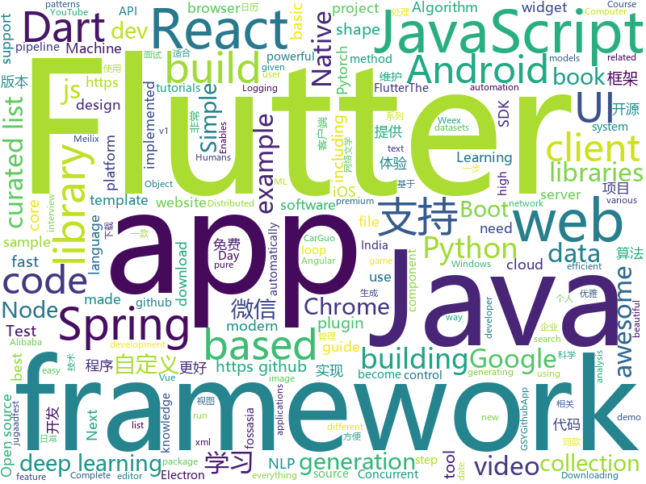

# 2018-09-26
See what the GitHub community is most excited about today.

## python
* [awesome-algorithm](https://github.com/apachecn/awesome-algorithm)(**958 stars today**): Leetcode 题解 (跟随思路一步一步撸出代码) 及经典算法实现
* [Python](https://github.com/TheAlgorithms/Python)(**608 stars today**): All Algorithms implemented in Python
* [ungoogled-chromium](https://github.com/Eloston/ungoogled-chromium)(**494 stars today**): Modifications to Google Chromium for removing Google integration and enhancing privacy, control, and transparency
* [Algorithm_Interview_Notes-Chinese](https://github.com/imhuay/Algorithm_Interview_Notes-Chinese)(**350 stars today**): 2018/2019/校招/春招/秋招/算法/机器学习(Machine Learning)/深度学习(Deep Learning)/自然语言处理(NLP)/C/C++/Python/面试笔记
* [pypeln](https://github.com/cgarciae/pypeln)(**191 stars today**): Concurrent data pipelines made easy
* [plash](https://github.com/ihucos/plash)(**164 stars today**): Build and run Containers
* [mlcourse.ai](https://github.com/Yorko/mlcourse.ai)(**147 stars today**): Open Machine Learning course mlcourse.ai, both in English and Russian
* [logme](https://github.com/BNMetrics/logme)(**126 stars today**): Python Logging For Humans (Configurable color logging to the terminal in v1.2.*!)
* [localstack](https://github.com/localstack/localstack)(**96 stars today**): 💻A fully functional local AWS cloud stack. Develop and test your cloud apps offline!
* [models](https://github.com/tensorflow/models)(**66 stars today**): Models and examples built with TensorFlow
* [system-design-primer](https://github.com/donnemartin/system-design-primer)(**85 stars today**): Learn how to design large-scale systems. Prep for the system design interview. Includes Anki flashcards.
* [Danger-zone](https://github.com/woj-ciech/Danger-zone)(**83 stars today**): Correlate data between domains, IPs and email addresses, present it as a graph and store everything into Elasticsearch and JSON files.
* [PyPortfolioOpt](https://github.com/robertmartin8/PyPortfolioOpt)(**67 stars today**): Financial portfolio optimisation in python, including classical efficient frontier and experimental methods.
* [beauty-net](https://github.com/cms-flash/beauty-net)(**66 stars today**): A simple, flexible, and extensible template for PyTorch. It's beautiful.
* [vid2vid](https://github.com/NVIDIA/vid2vid)(**52 stars today**): Pytorch implementation of our method for high-resolution (e.g. 2048x1024) photorealistic video-to-video translation.
* [petastorm](https://github.com/uber/petastorm)(**49 stars today**): Petastorm library enables single machine or distributed training and evaluation of deep learning models from datasets in Apache Parquet format. It supports ML frameworks such as Tensorflow, Pytorch, and PySpark and can be used from pure Python code.
* [softer-NMS](https://github.com/yihui-he/softer-NMS)(**51 stars today**): Softer-NMS: Rethinking Bounding Box Regression for Accurate Object Detection
* [youtube-dl](https://github.com/rg3/youtube-dl)(**45 stars today**): Command-line program to download videos from YouTube.com and other video sites
* [leetCode](https://github.com/HuberTRoy/leetCode)(**39 stars today**): 算法相关知识储备
* [keras](https://github.com/keras-team/keras)(**35 stars today**): Deep Learning for humans
* [awesome-python](https://github.com/vinta/awesome-python)(**38 stars today**): A curated list of awesome Python frameworks, libraries, software and resources
* [prometheus](https://github.com/Scitator/prometheus)(**40 stars today**): Reproducible and fast DL/RL.
* [django](https://github.com/django/django)(**30 stars today**): The Web framework for perfectionists with deadlines.
* [fbs](https://github.com/mherrmann/fbs)(**39 stars today**): Electron alternative based on Python and Qt
* [deepvariant](https://github.com/google/deepvariant)(**37 stars today**): DeepVariant is an analysis pipeline that uses a deep neural network to call genetic variants from next-generation DNA sequencing data.

## java
* [arthas](https://github.com/alibaba/arthas)(**186 stars today**): Alibaba Java Diagnostic Tool Arthas/Alibaba Java诊断利器Arthas
* [CalendarView](https://github.com/huanghaibin-dev/CalendarView)(**126 stars today**): Android上一个优雅、万能自定义UI、支持周视图、自定义周起始、性能高效的日历控件，支持热插拔实现的UI定制！支持标记、自定义颜色、农历、自定义月视图各种显示模式等。Canvas绘制，速度快、占用内存低，你真的想不到日历居然还可以如此优雅！An elegant, highly customized and high-performance Calendar Widget on Android.
* [easyexcel](https://github.com/alibaba/easyexcel)(**108 stars today**): 快速、简单避免OOM的java处理Excel工具
* [JavaGuide](https://github.com/Snailclimb/JavaGuide)(**97 stars today**): A core knowledge that most Java programmers need to master
* [proxyee-down](https://github.com/proxyee-down-org/proxyee-down)(**75 stars today**): http下载工具，基于http代理，支持多连接分块下载
* [JCSprout](https://github.com/crossoverJie/JCSprout)(**60 stars today**): 👨‍🎓Java Core Sprout : basic, concurrent, algorithm
* [AndServer](https://github.com/yanzhenjie/AndServer)(**56 stars today**): 🍒Web server and web framework of Android platform.
* [symphony](https://github.com/b3log/symphony)(**54 stars today**): 🎶一款用 Java 实现的现代化社区（论坛/BBS/社交网络/博客）平台。https://hacpai.com
* [spring-boot](https://github.com/spring-projects/spring-boot)(**44 stars today**): Spring Boot
* [weixin-java-tools](https://github.com/Wechat-Group/weixin-java-tools)(**45 stars today**): 全能微信Java开发工具包，支持包括微信支付、开放平台、小程序、企业微信/企业号和公众号等的开发
* [elasticsearch](https://github.com/elastic/elasticsearch)(**40 stars today**): Open Source, Distributed, RESTful Search Engine
* [java-design-patterns](https://github.com/iluwatar/java-design-patterns)(**41 stars today**): Design patterns implemented in Java
* [tutorials](https://github.com/eugenp/tutorials)(**27 stars today**): The "REST With Spring" Course:
* [guava](https://github.com/google/guava)(**42 stars today**): Google core libraries for Java
* [spoon](https://github.com/INRIA/spoon)(**35 stars today**): Spoon is a library to analyze, transform, rewrite, transpile Java source code (incl Java 9 & Java 10). It parses source files to build a well-designed AST with powerful analysis and transformation API. Made at Inria with❤️,🍻and✨.
* [AndroidLocalizePlugin](https://github.com/Airsaid/AndroidLocalizePlugin)(**37 stars today**): 🌏Android localization plugin. support multiple languages, no need to apply for key.
* [download-manager](https://github.com/novoda/download-manager)(**36 stars today**): A library that handles long-running downloads, handling the network interactions and retrying downloads automatically after failures
* [SpringAll](https://github.com/wuyouzhuguli/SpringAll)(**31 stars today**): 循序渐进，学习Spring Boot、Spring Boot & Shiro、Spring Cloud和Spring Security，博客Spring系列源码
* [HackBar](https://github.com/d3vilbug/HackBar)(**30 stars today**): HackBar plugin for Burpsuite v1.0
* [MyBookshelf](https://github.com/gedoor/MyBookshelf)(**27 stars today**): 阅读是一款提供网络文学搜索的工具，为广大网络文学爱好者提供一种方便、快捷舒适的试读体验。
* [spring-framework](https://github.com/spring-projects/spring-framework)(**23 stars today**): Spring Framework
* [selenium](https://github.com/SeleniumHQ/selenium)(**25 stars today**): A browser automation framework and ecosystem.
* [okhttp](https://github.com/square/okhttp)(**25 stars today**): An HTTP+HTTP/2 client for Android and Java applications.
* [BackgroundLibrary](https://github.com/JavaNoober/BackgroundLibrary)(**25 stars today**): A framework for directly generating shape through Tags, no need to write shape.xml again（通过标签直接生成shape，无需再写shape.xml）
* [zxing](https://github.com/zxing/zxing)(**24 stars today**): ZXing ("Zebra Crossing") barcode scanning library for Java, Android

## unknown
* [deep_learning_object_detection](https://github.com/hoya012/deep_learning_object_detection)(**214 stars today**): A paper list of object detection using deep learning.
* [math-as-code](https://github.com/Jam3/math-as-code)(**178 stars today**): a cheat-sheet for mathematical notation in code form
* [awesome-thesis](https://github.com/ocean1/awesome-thesis)(**143 stars today**): A curated list of practical tips and tricks to help you achieve an awesome CS master thesis [WIP] - contributions are welcome
* [pwc](https://github.com/zziz/pwc)(**106 stars today**): Papers with code. Sorted by stars. Updated weekly.
* [developer-roadmap](https://github.com/kamranahmedse/developer-roadmap)(**92 stars today**): Roadmap to becoming a web developer in 2018
* [You-Dont-Know-JS](https://github.com/getify/You-Dont-Know-JS)(**83 stars today**): A book series on JavaScript. @YDKJS on twitter.
* [CS-Notes](https://github.com/CyC2018/CS-Notes)(**76 stars today**): 📚Computer Science Learning Notes
* [gitignore](https://github.com/github/gitignore)(**44 stars today**): A collection of useful .gitignore templates
* [python-data-science-cheatsheet](https://github.com/jaystone776/python-data-science-cheatsheet)(**56 stars today**): Python数据科学速查表
* [test-your-sysadmin-skills](https://github.com/trimstray/test-your-sysadmin-skills)(**61 stars today**): A collection of *nix Sysadmin Test Questions and Answers for Interview/Exam (2018 Edition). Test your knowledge in different fields with these questions.
* [free-programming-books](https://github.com/EbookFoundation/free-programming-books)(**51 stars today**): 📚Freely available programming books
* [awesome](https://github.com/sindresorhus/awesome)(**52 stars today**): 😎Curated list of awesome lists
* [100-Days-Of-ML-Code](https://github.com/Avik-Jain/100-Days-Of-ML-Code)(**49 stars today**): 100 Days of ML Coding
* [Things-a-scientist-is-suppposed-to-know](https://github.com/philippbayer/Things-a-scientist-is-suppposed-to-know)(**53 stars today**): 
* [coding-interview-university](https://github.com/jwasham/coding-interview-university)(**43 stars today**): A complete computer science study plan to become a software engineer.
* [build-your-own-x](https://github.com/danistefanovic/build-your-own-x)(**47 stars today**): 🤓Build your own (insert technology here)
* [project-based-learning](https://github.com/tuvtran/project-based-learning)(**45 stars today**): Curated list of project-based tutorials
* [awesome-vue](https://github.com/vuejs/awesome-vue)(**38 stars today**): 🎉A curated list of awesome things related to Vue.js
* [OSCP-Archives](https://github.com/CyDefUnicorn/OSCP-Archives)(**35 stars today**): An archive of everything related to OSCP
* [ToolsOfTheTrade](https://github.com/cjbarber/ToolsOfTheTrade)(**39 stars today**): Tools of The Trade, from Hacker News.
* [awesome-flutter](https://github.com/Solido/awesome-flutter)(**37 stars today**): An awesome list that curates the best Flutter libraries, tools, tutorials, articles and more.
* [python-job](https://github.com/nicolz/python-job)(**34 stars today**): Python 面试相关知识点汇总 个人整理
* [architect-awesome](https://github.com/xingshaocheng/architect-awesome)(**29 stars today**): 后端架构师技术图谱
* [awesome-nodejs](https://github.com/sindresorhus/awesome-nodejs)(**31 stars today**): ⚡️Delightful Node.js packages and resources
* [WebSiteUseful](https://github.com/loremwalker/WebSiteUseful)(**20 stars today**): 🍅翻墙！科学上网，免费ss帐号分享、ssr订阅源，免费VPN下载，获取及使用教程请看：https://github.com/loremwalker/fq-book

## javascript
* [rxdb](https://github.com/pubkey/rxdb)(**271 stars today**): 💻📱A realtime Database for the Web
* [You-Dont-Need-Momentjs](https://github.com/you-dont-need/You-Dont-Need-Momentjs)(**171 stars today**): List of date-fns or native functions which you can use to replace moment.js + ESLint Plugin
* [westore](https://github.com/dntzhang/westore)(**134 stars today**): 世界上最小却强大的小程序框架 - 100多行代码搞定全局状态管理和跨页通讯
* [ytdl-webserver](https://github.com/Algram/ytdl-webserver)(**128 stars today**): 📻Webserver for downloading youtube videos. Ready for docker.
* [vue](https://github.com/vuejs/vue)(**114 stars today**): 🖖A progressive, incrementally-adoptable JavaScript framework for building UI on the web.
* [react](https://github.com/facebook/react)(**82 stars today**): A declarative, efficient, and flexible JavaScript library for building user interfaces.
* [taro](https://github.com/NervJS/taro)(**80 stars today**): 多端统一开发框架，支持用 React 的开发方式编写一次代码，生成能运行在微信小程序、H5、React Native 等的应用。
* [apify-js](https://github.com/apifytech/apify-js)(**75 stars today**): Apify SDK: The scalable web crawling and scraping library for JavaScript. Enables development of data extraction and web automation jobs (not only) with headless Chrome and Puppeteer.
* [javascript-algorithms](https://github.com/trekhleb/javascript-algorithms)(**69 stars today**): Algorithms and data structures implemented in JavaScript with explanations and links to further readings
* [create-react-app](https://github.com/facebook/create-react-app)(**62 stars today**): Create React apps with no build configuration.
* [axios](https://github.com/axios/axios)(**71 stars today**): Promise based HTTP client for the browser and node.js
* [grapesjs](https://github.com/artf/grapesjs)(**63 stars today**): Free and Open source Web Builder Framework. Next generation tool for building templates without coding
* [windows95](https://github.com/felixrieseberg/windows95)(**61 stars today**): 💩🚀Windows 95 in Electron. Runs on macOS, Linux, and Windows.
* [next.js](https://github.com/zeit/next.js)(**53 stars today**): Next.js is a lightweight framework for static and server‑rendered applications.
* [free-programming-books-zh_CN](https://github.com/justjavac/free-programming-books-zh_CN)(**50 stars today**): 📚免费的计算机编程类中文书籍，欢迎投稿
* [slate](https://github.com/ianstormtaylor/slate)(**50 stars today**): A completely customizable framework for building rich text editors.
* [underrun](https://github.com/phoboslab/underrun)(**49 stars today**): Twin stick shooter game in 13kb of JavaScript/WebGL
* [puppeteer](https://github.com/GoogleChrome/puppeteer)(**48 stars today**): Headless Chrome Node API
* [javascript](https://github.com/airbnb/javascript)(**46 stars today**): JavaScript Style Guide
* [realworld](https://github.com/gothinkster/realworld)(**45 stars today**): "The mother of all demo apps" — Exemplary fullstack Medium.com clone powered by React, Angular, Node, Django, and many more🏅
* [react-native](https://github.com/facebook/react-native)(**42 stars today**): A framework for building native apps with React.
* [storybook](https://github.com/storybooks/storybook)(**45 stars today**): Interactive UI component dev & test: React, React Native, Vue, Angular
* [node](https://github.com/nodejs/node)(**41 stars today**): Node.js JavaScript runtime✨🐢🚀✨
* [date-fns](https://github.com/date-fns/date-fns)(**45 stars today**): ⏳Modern JavaScript date utility library⌛️
* [gatsby](https://github.com/gatsbyjs/gatsby)(**39 stars today**): Build blazing fast, modern apps and websites with React

## html
* [mastering-modular-javascript](https://github.com/mjavascript/mastering-modular-javascript)(**435 stars today**): 📦Module thinking, principles, design patterns and best practices.
* [awesome-mac](https://github.com/jaywcjlove/awesome-mac)(**68 stars today**):  Now we have become very big, Different from the original idea. Collect premium software in various categories.
* [SuperTinyIcons](https://github.com/edent/SuperTinyIcons)(**28 stars today**): Under 1KB each! Super Tiny Icons are miniscule SVG versions of your favourite website and app logos
* [styleguide](https://github.com/google/styleguide)(**22 stars today**): Style guides for Google-originated open-source projects
* [JavaScript30](https://github.com/wesbos/JavaScript30)(**16 stars today**): 30 Day Vanilla JS Challenge
* [AdminLTE](https://github.com/almasaeed2010/AdminLTE)(**18 stars today**): AdminLTE - Free Premium Admin control Panel Theme Based On Bootstrap 3.x
* [Spoon-Knife](https://github.com/octocat/Spoon-Knife)(****): This repo is for demonstration purposes only.
* [portainer](https://github.com/portainer/portainer)(**14 stars today**): Simple management UI for Docker
* [fastText](https://github.com/facebookresearch/fastText)(**13 stars today**): Library for fast text representation and classification.
* [NLP-progress](https://github.com/sebastianruder/NLP-progress)(**12 stars today**): Repository to track the progress in Natural Language Processing (NLP), including the datasets and the current state-of-the-art for the most common NLP tasks.
* [variables-war](https://github.com/kids-code-games/variables-war)(**13 stars today**): A code playing cards game where you have to be the first to 42 using loops, conditions...
* [go101](https://github.com/go101/go101)(**11 stars today**): A book focusing on Go syntax/semantics.
* [requests-html](https://github.com/kennethreitz/requests-html)(**10 stars today**): Pythonic HTML Parsing for Humans™
* [favorites-web](https://github.com/cloudfavorites/favorites-web)(**8 stars today**): 云收藏 Spring Boot 2.0 开源项目
* [jugaadfest.com](https://github.com/fossasia/jugaadfest.com)(**9 stars today**): Jugaadfest in India https://jugaadfest.com
* [meilix-generator](https://github.com/fossasia/meilix-generator)(**8 stars today**): WebApp for generating a custom ISO image based on Meilix http://meilix.org
* [intro.js](https://github.com/usablica/intro.js)(**9 stars today**): A better way for new feature introduction and step-by-step users guide for your website and project.
* [2019.fossasia.org](https://github.com/fossasia/2019.fossasia.org)(**8 stars today**): FOSSASIA Summit 2019 https://2019.fossasia.org
* [opentechsummit.in](https://github.com/OpnTec/opentechsummit.in)(**8 stars today**): OpenTechSummit India
* [2018.opentechsummit.in](https://github.com/OpnTec/2018.opentechsummit.in)(**8 stars today**): OpenTechSummit India
* [2018.djangocon.us](https://github.com/djangocon/2018.djangocon.us)(**7 stars today**): 🏝The DjangoCon US 2018 conference website
* [javascript-tutorial-en](https://github.com/iliakan/javascript-tutorial-en)(**7 stars today**): Modern JavaScript Tutorial
* [flexboxgrid](https://github.com/kristoferjoseph/flexboxgrid)(**6 stars today**): Grid based on CSS3 flexbox
* [primeng](https://github.com/primefaces/primeng)(**6 stars today**): UI Components for Angular
* [openapi-generator](https://github.com/OpenAPITools/openapi-generator)(**6 stars today**): OpenAPI Generator allows generation of API client libraries (SDK generation), server stubs, documentation and configuration automatically given an OpenAPI Spec (v2, v3)

## dart
* [flutter](https://github.com/flutter/flutter)(**107 stars today**): Flutter makes it easy and fast to build beautiful mobile apps.
* [FlutterBasicWidgets](https://github.com/PoojaB26/FlutterBasicWidgets)(**31 stars today**): Intended for Complete Beginners at Flutter : Play with 20+ examples given and get familiar with various basic widgets in Flutter
* [GSYGithubAppFlutter](https://github.com/CarGuo/GSYGithubAppFlutter)(**25 stars today**): 超完整的Flutter项目，功能丰富，适合学习和日常使用。GSYGithubApp系列的优势：我们目前已经拥有Flutter、Weex、ReactNative三个版本。 功能齐全，项目框架内技术涉及面广，完成度高，持续维护，配套文章，适合全面学习，跨框架对比参考。跨平台的开源Github客户端App，更好的体验，更丰富的功能，旨在更好的日常管理和维护个人Github，提供更好更方便的驾车体验～～Σ(￣。￣ﾉ)ﾉ。同款Weex版本 ： https://github.com/CarGuo/GSYGithubAppWeex 、同款React Native版本 ： https://github.com/CarGuo/GSYGithubApp
* [Flutter-Notebook](https://github.com/Vadaski/Flutter-Notebook)(**23 stars today**): 日更的FlutterDemo合集，今天你fu了吗
* [samples](https://github.com/flutter/samples)(**18 stars today**): A collection of Flutter examples and demos.
* [plugins](https://github.com/flutter/plugins)(**12 stars today**): Plugins for Flutter, including FlutterFire, maintained by the Flutter team
* [Flutter-learning](https://github.com/AweiLoveAndroid/Flutter-learning)(**9 stars today**): 🔥👍🌟⭐️⭐️⭐️Flutter install&settings,Flutter problems when developing,Flutter sample codes& templates,Flutter projects,Dart languages sample codes
* [graphql-flutter](https://github.com/zino-app/graphql-flutter)(**7 stars today**): A GraphQL client for Flutter, bringing all the features from a modern GraphQL client to one easy to use package.
* [flutter_architecture_samples](https://github.com/brianegan/flutter_architecture_samples)(**6 stars today**): TodoMVC for Flutter
* [flutter_swiper](https://github.com/best-flutter/flutter_swiper)(**5 stars today**): The best swiper for flutter , with multiple layouts, infinite loop. Compatible with Android & iOS.
* [Flutter-UI-Kit](https://github.com/iampawan/Flutter-UI-Kit)(**5 stars today**): Flutter app for collection of UI in a UIKit
* [sdk](https://github.com/dart-lang/sdk)(**5 stars today**): The Dart SDK, including the VM, dart2js, core libraries, and more.
* [dio](https://github.com/flutterchina/dio)(**5 stars today**): A powerful Http client for Dart, which supports Interceptors, FormData, Request Cancellation, File Downloading, Timeout etc.
* [zhihu-flutter](https://github.com/HackSoul/zhihu-flutter)(**5 stars today**): Flutter 高仿知乎 UI，非常漂亮，也非常流畅，flutter build apk 或 flutter build ios 之后更流畅
* [photo_view](https://github.com/renancaraujo/photo_view)(****): A simple zoomable image widget for Flutter
* [flutter-search-bar](https://github.com/ArcticZeroo/flutter-search-bar)(****): (mostly) Automatic search-enabled appBar for flutter
* [simple_auth](https://github.com/Clancey/simple_auth)(****): The Simplest way to Authenticate in Flutter
* [angular_components_example](https://github.com/dart-lang/angular_components_example)(****): A sample usage of https://github.com/dart-lang/angular_components
* [lottie-flutter](https://github.com/dnfield/lottie-flutter)(****): A pure Dart/Flutter implementation of Lottie
* [chromedeveditor](https://github.com/googlearchive/chromedeveditor)(****): Chrome Dev Editor is a developer tool for building apps on the Chrome platform - Chrome Apps and Web Apps, in JavaScript or Dart. (NO LONGER IN ACTIVE DEVELOPMENT)
* [flutter-osc](https://github.com/yubo725/flutter-osc)(****): 基于Google Flutter的开源中国客户端，支持Android和iOS。
* [flutter-examples](https://github.com/nisrulz/flutter-examples)(****): [Examples] Simple basic isolated apps, for budding flutter devs.
* [inKino](https://github.com/roughike/inKino)(****): inKino - A cross platform movie and showtime browser for Finnkino cinemas, made with Flutter.
* [FlutterExampleApps](https://github.com/iampawan/FlutterExampleApps)(****): [Example APPS] Basic Flutter apps, for flutter devs.
* [hauberk](https://github.com/munificent/hauberk)(****): A web-based roguelike written in Dart.

## WordCloud

