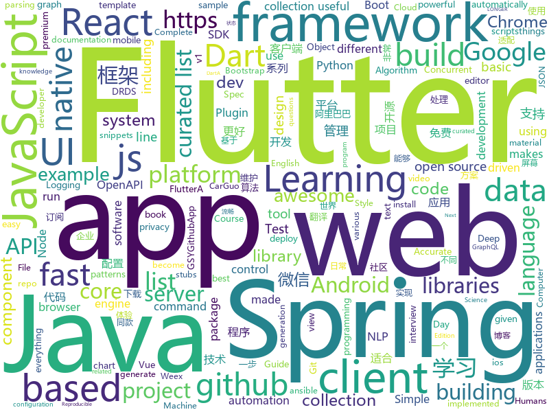

# 2018-09-27
See what the GitHub community is most excited about today.

## python
* [awesome-algorithm](https://github.com/apachecn/awesome-algorithm)(**564 stars today**): Leetcode 题解 (跟随思路一步一步撸出代码) 及经典算法实现
* [Python](https://github.com/TheAlgorithms/Python)(**369 stars today**): All Algorithms implemented in Python
* [Algorithm_Interview_Notes-Chinese](https://github.com/imhuay/Algorithm_Interview_Notes-Chinese)(**271 stars today**): 2018/2019/校招/春招/秋招/算法/机器学习(Machine Learning)/深度学习(Deep Learning)/自然语言处理(NLP)/C/C++/Python/面试笔记
* [ungoogled-chromium](https://github.com/Eloston/ungoogled-chromium)(**191 stars today**): Modifications to Google Chromium for removing Google integration and enhancing privacy, control, and transparency
* [logme](https://github.com/BNMetrics/logme)(**140 stars today**): Python Logging For Humans (Configurable color logging to the terminal in v1.2.*!)
* [models](https://github.com/tensorflow/models)(**75 stars today**): Models and examples built with TensorFlow
* [system-design-primer](https://github.com/donnemartin/system-design-primer)(**82 stars today**): Learn how to design large-scale systems. Prep for the system design interview. Includes Anki flashcards.
* [prometheus](https://github.com/Scitator/prometheus)(**80 stars today**): Reproducible and fast DL/RL.
* [pypeln](https://github.com/cgarciae/pypeln)(**74 stars today**): Concurrent data pipelines made easy
* [nba_api](https://github.com/swar/nba_api)(**64 stars today**): An API Client package to access the APIs for NBA.com
* [FCHD-Fully-Convolutional-Head-Detector](https://github.com/aditya-vora/FCHD-Fully-Convolutional-Head-Detector)(**59 stars today**): Code for FCHD - A fast and accurate head detector
* [redash](https://github.com/getredash/redash)(**55 stars today**): Make Your Company Data Driven. Connect to any data source, easily visualize, dashboard and share your data.
* [qutebrowser](https://github.com/qutebrowser/qutebrowser)(**59 stars today**): A keyboard-driven, vim-like browser based on PyQt5.
* [fbs](https://github.com/mherrmann/fbs)(**56 stars today**): Electron alternative based on Python and Qt
* [keras](https://github.com/keras-team/keras)(**47 stars today**): Deep Learning for humans
* [awesome-python](https://github.com/vinta/awesome-python)(**48 stars today**): A curated list of awesome Python frameworks, libraries, software and resources
* [mlcourse.ai](https://github.com/Yorko/mlcourse.ai)(**45 stars today**): Open Machine Learning course mlcourse.ai, both in English and Russian
* [softer-NMS](https://github.com/yihui-he/softer-NMS)(**50 stars today**): Softer-NMS: Rethinking Bounding Box Regression for Accurate Object Detection
* [CppCon2018](https://github.com/CppCon/CppCon2018)(**49 stars today**): Slides and other materials from CppCon 2018
* [youtube-dl](https://github.com/rg3/youtube-dl)(**45 stars today**): Command-line program to download videos from YouTube.com and other video sites
* [home-assistant](https://github.com/home-assistant/home-assistant)(**40 stars today**): 🏡Open source home automation that puts local control and privacy first
* [Danger-zone](https://github.com/woj-ciech/Danger-zone)(**41 stars today**): Correlate data between domains, IPs and email addresses, present it as a graph and store everything into Elasticsearch and JSON files.
* [plash](https://github.com/ihucos/plash)(**42 stars today**): Build and run Containers
* [ansible](https://github.com/ansible/ansible)(**30 stars today**): Ansible is a radically simple IT automation platform that makes your applications and systems easier to deploy. Avoid writing scripts or custom code to deploy and update your applications — automate in a language that approaches plain English, using SSH, with no agents to install on remote systems. https://docs.ansible.com/ansible/
* [public-apis](https://github.com/toddmotto/public-apis)(**34 stars today**): A collective list of public JSON APIs for use in web development.

## java
* [easyexcel](https://github.com/alibaba/easyexcel)(**251 stars today**): 快速、简单避免OOM的java处理Excel工具
* [JavaGuide](https://github.com/Snailclimb/JavaGuide)(**158 stars today**): A core knowledge that most Java programmers need to master
* [arthas](https://github.com/alibaba/arthas)(**146 stars today**): Alibaba Java Diagnostic Tool Arthas/Alibaba Java诊断利器Arthas
* [brigadier](https://github.com/Mojang/brigadier)(**106 stars today**): Brigadier is a command parser & dispatcher, designed and developed for Minecraft: Java Edition.
* [JCSprout](https://github.com/crossoverJie/JCSprout)(**81 stars today**): 👨‍🎓Java Core Sprout : basic, concurrent, algorithm
* [symphony](https://github.com/b3log/symphony)(**84 stars today**): 🎶一款用 Java 实现的现代化社区（论坛/BBS/社交网络/博客）平台。https://hacpai.com
* [proxyee-down](https://github.com/proxyee-down-org/proxyee-down)(**74 stars today**): http下载工具，基于http代理，支持多连接分块下载
* [graphicsfuzz](https://github.com/google/graphicsfuzz)(**72 stars today**): A testing framework for automatically finding and simplifying bugs in graphics shader compilers.
* [nacos-spring-project](https://github.com/nacos-group/nacos-spring-project)(**67 stars today**): Nacos ECO Project for Spring Framework
* [SpringAll](https://github.com/wuyouzhuguli/SpringAll)(**64 stars today**): 循序渐进，学习Spring Boot、Spring Boot & Shiro、Spring Cloud和Spring Security，博客Spring系列源码
* [spring-boot](https://github.com/spring-projects/spring-boot)(**54 stars today**): Spring Boot
* [java-design-patterns](https://github.com/iluwatar/java-design-patterns)(**58 stars today**): Design patterns implemented in Java
* [tutorials](https://github.com/eugenp/tutorials)(**30 stars today**): The "REST With Spring" Course:
* [elasticsearch](https://github.com/elastic/elasticsearch)(**35 stars today**): Open Source, Distributed, RESTful Search Engine
* [weixin-java-tools](https://github.com/Wechat-Group/weixin-java-tools)(**33 stars today**): 全能微信Java开发工具包，支持包括微信支付、开放平台、小程序、企业微信/企业号和公众号等的开发
* [HackBar](https://github.com/d3vilbug/HackBar)(**33 stars today**): HackBar plugin for Burpsuite v1.0
* [incubator-dubbo](https://github.com/apache/incubator-dubbo)(**27 stars today**): Apache Dubbo (incubating) is a high-performance, java based, open source RPC framework.
* [apollo](https://github.com/ctripcorp/apollo)(**27 stars today**): Apollo（阿波罗）是携程框架部门研发的分布式配置中心，能够集中化管理应用不同环境、不同集群的配置，配置修改后能够实时推送到应用端，并且具备规范的权限、流程治理等特性，适用于微服务配置管理场景。
* [MPAndroidChart](https://github.com/PhilJay/MPAndroidChart)(**30 stars today**): A powerful🚀Android chart view / graph view library, supporting line- bar- pie- radar- bubble- and candlestick charts as well as scaling, dragging and animations.
* [graal](https://github.com/oracle/graal)(**30 stars today**): GraalVM: Run Programs Faster Anywhere🚀
* [spring-framework](https://github.com/spring-projects/spring-framework)(**22 stars today**): Spring Framework
* [guava](https://github.com/google/guava)(**27 stars today**): Google core libraries for Java
* [AndServer](https://github.com/yanzhenjie/AndServer)(**27 stars today**): 🍒Web server and web framework of Android platform.
* [AndroidAutoSize](https://github.com/JessYanCoding/AndroidAutoSize)(**27 stars today**): A low-cost Android screen adaptation solution (今日头条屏幕适配方案终极版，一个极低成本的 Android 屏幕适配方案).
* [canal](https://github.com/alibaba/canal)(**23 stars today**): 阿里巴巴mysql数据库binlog的增量订阅&消费组件 。阿里云DRDS( https://www.aliyun.com/product/drds )、阿里巴巴TDDL 二级索引、小表复制powerd by canal.

## unknown
* [deep_learning_object_detection](https://github.com/hoya012/deep_learning_object_detection)(**133 stars today**): A paper list of object detection using deep learning.
* [math-as-code](https://github.com/Jam3/math-as-code)(**104 stars today**): a cheat-sheet for mathematical notation in code form
* [CS-Notes](https://github.com/CyC2018/CS-Notes)(**87 stars today**): 📚Computer Science Learning Notes
* [awesome](https://github.com/sindresorhus/awesome)(**74 stars today**): 😎Curated list of awesome lists
* [architect-awesome](https://github.com/xingshaocheng/architect-awesome)(**62 stars today**): 后端架构师技术图谱
* [You-Dont-Know-JS](https://github.com/getify/You-Dont-Know-JS)(**60 stars today**): A book series on JavaScript. @YDKJS on twitter.
* [awesome-vue](https://github.com/vuejs/awesome-vue)(**67 stars today**): 🎉A curated list of awesome things related to Vue.js
* [gitignore](https://github.com/github/gitignore)(**54 stars today**): A collection of useful .gitignore templates
* [developer-roadmap](https://github.com/kamranahmedse/developer-roadmap)(**62 stars today**): Roadmap to becoming a web developer in 2018
* [pwc](https://github.com/zziz/pwc)(**55 stars today**): Papers with code. Sorted by stars. Updated weekly.
* [100-Days-Of-ML-Code](https://github.com/Avik-Jain/100-Days-Of-ML-Code)(**39 stars today**): 100 Days of ML Coding
* [arkcontrol](https://github.com/arkcontrol/arkcontrol)(**41 stars today**): 
* [coding-interview-university](https://github.com/jwasham/coding-interview-university)(**37 stars today**): A complete computer science study plan to become a software engineer.
* [project-based-learning](https://github.com/tuvtran/project-based-learning)(**40 stars today**): Curated list of project-based tutorials
* [ToolsOfTheTrade](https://github.com/cjbarber/ToolsOfTheTrade)(**43 stars today**): Tools of The Trade, from Hacker News.
* [free-programming-books](https://github.com/EbookFoundation/free-programming-books)(**34 stars today**): 📚Freely available programming books
* [build-your-own-x](https://github.com/danistefanovic/build-your-own-x)(**37 stars today**): 🤓Build your own (insert technology here)
* [dotnet-tools](https://github.com/natemcmaster/dotnet-tools)(**31 stars today**): A list of tools to extend the .NET Core command line (dotnet)
* [kubernetes-the-hard-way](https://github.com/kelseyhightower/kubernetes-the-hard-way)(**30 stars today**): Bootstrap Kubernetes the hard way on Google Cloud Platform. No scripts.
* [awesome-thesis](https://github.com/ocean1/awesome-thesis)(**30 stars today**): A curated list of practical tips and tricks to help you achieve an awesome CS master thesis [WIP] - contributions are welcome
* [WebSiteUseful](https://github.com/loremwalker/WebSiteUseful)(**24 stars today**): 🍅翻墙！科学上网，免费ss帐号分享、ssr订阅源，免费VPN下载，获取及使用教程请看：https://github.com/loremwalker/fq-book
* [test-your-sysadmin-skills](https://github.com/trimstray/test-your-sysadmin-skills)(**24 stars today**): A collection of *nix Sysadmin Test Questions and Answers for Interview/Exam (2018 Edition). Test your knowledge in different fields with these questions.
* [OSCP-Archives](https://github.com/CyDefUnicorn/OSCP-Archives)(**22 stars today**): An archive of everything related to OSCP
* [awesome-nodejs](https://github.com/sindresorhus/awesome-nodejs)(**23 stars today**): ⚡️Delightful Node.js packages and resources
* [gold-miner](https://github.com/xitu/gold-miner)(**22 stars today**): 🥇掘金翻译计划，可能是世界最大最好的英译中技术社区，最懂读者和译者的翻译平台：

## javascript
* [volkswagen](https://github.com/auchenberg/volkswagen)(**596 stars today**): 🙈Volkswagen detects when your tests are being run in a CI server, and makes them pass.
* [westore](https://github.com/dntzhang/westore)(**380 stars today**): 世界上最小却强大的小程序框架 - 100多行代码搞定全局状态管理和跨页通讯
* [apify-js](https://github.com/apifytech/apify-js)(**246 stars today**): Apify SDK: The scalable web crawling and scraping library for JavaScript. Enables development of data extraction and web automation jobs (not only) with headless Chrome and Puppeteer.
* [30-seconds-of-code](https://github.com/30-seconds/30-seconds-of-code)(**235 stars today**): Curated collection of useful Javascript snippets that you can understand in 30 seconds or less.
* [ring-ui](https://github.com/JetBrains/ring-ui)(**235 stars today**): A collection of JetBrains Web UI components
* [skip](https://github.com/skiplang/skip)(**215 stars today**): A programming language to skip the things you have already computed
* [rxdb](https://github.com/pubkey/rxdb)(**180 stars today**): 💻📱A realtime Database for the Web
* [vue](https://github.com/vuejs/vue)(**138 stars today**): 🖖A progressive, incrementally-adoptable JavaScript framework for building UI on the web.
* [taro](https://github.com/NervJS/taro)(**114 stars today**): 多端统一开发框架，支持用 React 的开发方式编写一次代码，生成能运行在微信小程序、H5、React Native 等的应用。
* [alex](https://github.com/get-alex/alex)(**111 stars today**): Catch insensitive, inconsiderate writing
* [create-react-app](https://github.com/facebook/create-react-app)(**95 stars today**): Create React apps with no build configuration.
* [react](https://github.com/facebook/react)(**95 stars today**): A declarative, efficient, and flexible JavaScript library for building user interfaces.
* [yapi](https://github.com/YMFE/yapi)(**101 stars today**): YApi 是一个可本地部署的、打通前后端及QA的、可视化的接口管理平台
* [You-Dont-Need-Momentjs](https://github.com/you-dont-need/You-Dont-Need-Momentjs)(**95 stars today**): List of date-fns or native functions which you can use to replace moment.js + ESLint Plugin
* [husky](https://github.com/typicode/husky)(**76 stars today**): 🐶Git hooks made easy
* [slate](https://github.com/ianstormtaylor/slate)(**75 stars today**): A completely customizable framework for building rich text editors.
* [free-programming-books-zh_CN](https://github.com/justjavac/free-programming-books-zh_CN)(**64 stars today**): 📚免费的计算机编程类中文书籍，欢迎投稿
* [next.js](https://github.com/zeit/next.js)(**64 stars today**): Next.js is a lightweight framework for static and server‑rendered applications.
* [react-native](https://github.com/facebook/react-native)(**62 stars today**): A framework for building native apps with React.
* [axios](https://github.com/axios/axios)(**67 stars today**): Promise based HTTP client for the browser and node.js
* [epitath](https://github.com/Astrocoders/epitath)(**65 stars today**): Compose render props imperatively with async/await/CPS kinda sugar
* [node](https://github.com/nodejs/node)(**57 stars today**): Node.js JavaScript runtime✨🐢🚀✨
* [storybook](https://github.com/storybooks/storybook)(**59 stars today**): Interactive UI component dev & test: React, React Native, Vue, Angular
* [tippy.js-react](https://github.com/atomiks/tippy.js-react)(**60 stars today**): React component for Tippy.js
* [javascript](https://github.com/airbnb/javascript)(**53 stars today**): JavaScript Style Guide

## html
* [mastering-modular-javascript](https://github.com/mjavascript/mastering-modular-javascript)(**201 stars today**): 📦Module thinking, principles, design patterns and best practices.
* [styleguide](https://github.com/google/styleguide)(**26 stars today**): Style guides for Google-originated open-source projects
* [awesome-mac](https://github.com/jaywcjlove/awesome-mac)(**30 stars today**):  Now we have become very big, Different from the original idea. Collect premium software in various categories.
* [Spoon-Knife](https://github.com/octocat/Spoon-Knife)(****): This repo is for demonstration purposes only.
* [portainer](https://github.com/portainer/portainer)(**23 stars today**): Simple management UI for Docker
* [measure](https://github.com/imcuttle/measure)(**21 stars today**): 📏Measure UI for PSD
* [JavaScript30](https://github.com/wesbos/JavaScript30)(**14 stars today**): 30 Day Vanilla JS Challenge
* [30-seconds-of-css](https://github.com/30-seconds/30-seconds-of-css)(**18 stars today**): A curated collection of useful CSS snippets.
* [fastText](https://github.com/facebookresearch/fastText)(**17 stars today**): Library for fast text representation and classification.
* [NLP-progress](https://github.com/sebastianruder/NLP-progress)(**13 stars today**): Repository to track the progress in Natural Language Processing (NLP), including the datasets and the current state-of-the-art for the most common NLP tasks.
* [AdminLTE](https://github.com/almasaeed2010/AdminLTE)(**13 stars today**): AdminLTE - Free Premium Admin control Panel Theme Based On Bootstrap 3.x
* [swagger-codegen](https://github.com/swagger-api/swagger-codegen)(**11 stars today**): swagger-codegen contains a template-driven engine to generate documentation, API clients and server stubs in different languages by parsing your OpenAPI / Swagger definition.
* [learning-area](https://github.com/mdn/learning-area)(**5 stars today**): Github repo for the MDN Learning Area.
* [zenbot](https://github.com/DeviaVir/zenbot)(**9 stars today**): Zenbot is a command-line cryptocurrency trading bot using Node.js and MongoDB.
* [highcharts](https://github.com/highcharts/highcharts)(**11 stars today**): Highcharts JS, the JavaScript charting framework
* [ecma262](https://github.com/tc39/ecma262)(**10 stars today**): Status, process, and documents for ECMA262
* [proxylist](https://github.com/fate0/proxylist)(**10 stars today**): proxylist, generate by fate0/getproxy project in every 15 minute
* [patchwork](https://github.com/jlord/patchwork)(****): All the Git-it Workshop completers!
* [peterroelants.github.io](https://github.com/peterroelants/peterroelants.github.io)(**9 stars today**): Blog
* [primeng](https://github.com/primefaces/primeng)(**8 stars today**): UI Components for Angular
* [wpt](https://github.com/web-platform-tests/wpt)(**9 stars today**): Test suites for Web platform specs — including WHATWG, W3C, and others
* [TranslatorX](https://github.com/pingfangx/TranslatorX)(**9 stars today**): JetBrains 系列软件汉化包
* [favorites-web](https://github.com/cloudfavorites/favorites-web)(**7 stars today**): 云收藏 Spring Boot 2.0 开源项目
* [requests-html](https://github.com/kennethreitz/requests-html)(**8 stars today**): Pythonic HTML Parsing for Humans™
* [openapi-generator](https://github.com/OpenAPITools/openapi-generator)(**7 stars today**): OpenAPI Generator allows generation of API client libraries (SDK generation), server stubs, documentation and configuration automatically given an OpenAPI Spec (v2, v3)

## dart
* [flutter](https://github.com/flutter/flutter)(**111 stars today**): Flutter makes it easy and fast to build beautiful mobile apps.
* [awesome-flutter](https://github.com/Solido/awesome-flutter)(**31 stars today**): An awesome list that curates the best Flutter libraries, tools, tutorials, articles and more.
* [FlutterBasicWidgets](https://github.com/PoojaB26/FlutterBasicWidgets)(**21 stars today**): Intended for Complete Beginners at Flutter : Play with 20+ examples given and get familiar with various basic widgets in Flutter
* [GSYGithubAppFlutter](https://github.com/CarGuo/GSYGithubAppFlutter)(**21 stars today**): 超完整的Flutter项目，功能丰富，适合学习和日常使用。GSYGithubApp系列的优势：我们目前已经拥有Flutter、Weex、ReactNative三个版本。 功能齐全，项目框架内技术涉及面广，完成度高，持续维护，配套文章，适合全面学习，跨框架对比参考。跨平台的开源Github客户端App，更好的体验，更丰富的功能，旨在更好的日常管理和维护个人Github，提供更好更方便的驾车体验～～Σ(￣。￣ﾉ)ﾉ。同款Weex版本 ： https://github.com/CarGuo/GSYGithubAppWeex 、同款React Native版本 ： https://github.com/CarGuo/GSYGithubApp
* [Flutter-Notebook](https://github.com/OpenFlutter/Flutter-Notebook)(**20 stars today**): 日更的FlutterDemo合集，今天你fu了吗
* [flutter_architecture_samples](https://github.com/brianegan/flutter_architecture_samples)(**11 stars today**): TodoMVC for Flutter
* [samples](https://github.com/flutter/samples)(**10 stars today**): A collection of Flutter examples and demos.
* [zhihu-flutter](https://github.com/HackSoul/zhihu-flutter)(**9 stars today**): Flutter 高仿知乎 UI，非常漂亮，也非常流畅，flutter build apk 或 flutter build ios 之后更流畅
* [plugins](https://github.com/flutter/plugins)(**8 stars today**): Plugins for Flutter, including FlutterFire, maintained by the Flutter team
* [graphql-flutter](https://github.com/zino-app/graphql-flutter)(**6 stars today**): A GraphQL client for Flutter, bringing all the features from a modern GraphQL client to one easy to use package.
* [Flutter-learning](https://github.com/AweiLoveAndroid/Flutter-learning)(**7 stars today**): 🔥👍🌟⭐️⭐️⭐️Flutter install&settings,Flutter problems when developing,Flutter sample codes& templates,Flutter projects,Dart languages sample codes
* [udacity-course](https://github.com/flutter/udacity-course)(**5 stars today**): Build native mobile apps with Flutter
* [dio](https://github.com/flutterchina/dio)(**5 stars today**): A powerful Http client for Dart, which supports Interceptors, FormData, Request Cancellation, File Downloading, Timeout etc.
* [angular_components](https://github.com/dart-lang/angular_components)(****): The official Material Design components for AngularDart. Used at Google in production apps.
* [WanAndroid-Flutter](https://github.com/canhuah/WanAndroid-Flutter)(****): Flutter版WanAndroid客户端 适合Flutter入门学习
* [chromedeveditor](https://github.com/googlearchive/chromedeveditor)(****): Chrome Dev Editor is a developer tool for building apps on the Chrome platform - Chrome Apps and Web Apps, in JavaScript or Dart. (NO LONGER IN ACTIVE DEVELOPMENT)
* [sdk](https://github.com/dart-lang/sdk)(****): The Dart SDK, including the VM, dart2js, core libraries, and more.
* [flutter-osc](https://github.com/yubo725/flutter-osc)(****): 基于Google Flutter的开源中国客户端，支持Android和iOS。
* [flutter-examples](https://github.com/nisrulz/flutter-examples)(****): [Examples] Simple basic isolated apps, for budding flutter devs.
* [Flutter-UI-Kit](https://github.com/iampawan/Flutter-UI-Kit)(****): Flutter app for collection of UI in a UIKit
* [inKino](https://github.com/roughike/inKino)(****): inKino - A cross platform movie and showtime browser for Finnkino cinemas, made with Flutter.
* [FlutterExampleApps](https://github.com/iampawan/FlutterExampleApps)(****): [Example APPS] Basic Flutter apps, for flutter devs.
* [hauberk](https://github.com/munificent/hauberk)(****): A web-based roguelike written in Dart.
* [angular](https://github.com/dart-lang/angular)(****): Fast and productive web framework provided by Dart
* [StageXL](https://github.com/bp74/StageXL)(****): A fast and universal 2D rendering engine for HTML5 and Dart.

## WordCloud

