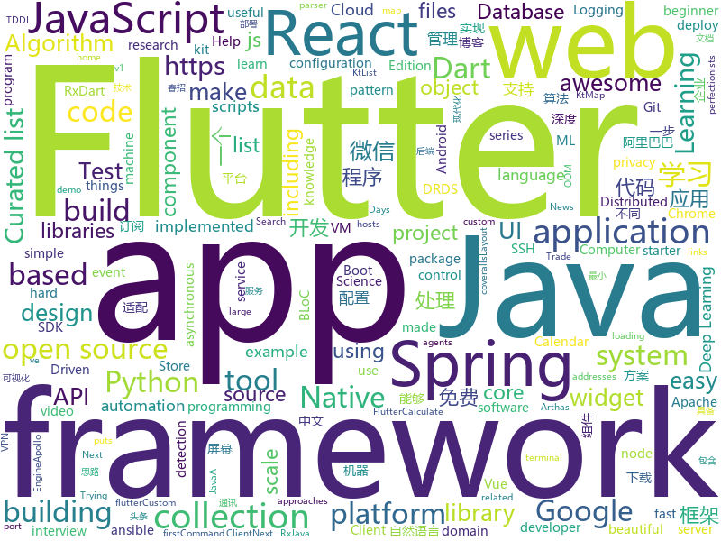

## dart
* [flutter-go](https://github.com/alibaba/flutter-go)(**164 stars today**): flutter 开发者帮助 APP，包含 flutter 常用 130+ 组件的中文文档与 demo 演示
* [flutter](https://github.com/flutter/flutter)(**69 stars today**): Flutter makes it easy and fast to build beautiful mobile apps.
* [awesome-flutter](https://github.com/Solido/awesome-flutter)(**40 stars today**): An awesome list that curates the best Flutter libraries, tools, tutorials, articles and more.
* [flutter_starter_kit](https://github.com/KingWu/flutter_starter_kit)(**25 stars today**): A starter kit for beginner learns with Bloc pattern, RxDart, sqflite, Fluro and Dio to architect a flutter project. This starter kit build an App Store app as a example
* [flutter_wanandroid](https://github.com/Sky24n/flutter_wanandroid)(**16 stars today**): 一个完整的Flutter项目，BLoC、RxDart 、国际化、启动页、引导页
* [kt.dart](https://github.com/passsy/kt.dart)(**17 stars today**): A port of kotlin-stdlib for Dart/Flutter including collections (KtList, KtMap, KtSet) and other packages
* [HistoryOfEverything](https://github.com/2d-inc/HistoryOfEverything)(**14 stars today**): Flutter Launch Timeline Demo
* [plugins](https://github.com/flutter/plugins)(**12 stars today**): Plugins for Flutter, including FlutterFire, maintained by the Flutter team
* [flutter_architecture_samples](https://github.com/brianegan/flutter_architecture_samples)(**10 stars today**): TodoMVC for Flutter
* [Flare-Flutter](https://github.com/2d-inc/Flare-Flutter)(**6 stars today**): 
* [inKino](https://github.com/roughike/inKino)(**6 stars today**): A multiplatform Dart movie app with 40% of code sharing between Flutter and the Web.
* [flutter_ui_challenges](https://github.com/lohanidamodar/flutter_ui_challenges)(**5 stars today**): Trying to replicate various app UIs in flutter
* [flushbar](https://github.com/AndreHaueisen/flushbar)(**5 stars today**): Custom widget for Flutter
* [flutter_spinkit](https://github.com/jogboms/flutter_spinkit)(****): ✨A collection of loading indicators animated with flutter. Heavily Inspired by http://tobiasahlin.com/spinkit.
* [site-www](https://github.com/dart-lang/site-www)(****): Source for Dart website
* [flutter_flux](https://github.com/google/flutter_flux)(****): Implementation of the Flux framework for Flutter
* [dart-coveralls](https://github.com/block-forest/dart-coveralls)(****): Calculate coverage of your dart scripts, format it to LCOV and send it to coveralls
* [flutter-layouts-exampls](https://github.com/nb312/flutter-layouts-exampls)(****): Layout of the flutter example.such as Row,Comlun,listview,Just for learning.
* [recipes_app](https://github.com/krolmic/recipes_app)(****): A simple recipes app made in Flutter for a series of articles
* [angular_components](https://github.com/dart-lang/angular_components)(****): The official Material Design components for AngularDart. Used at Google in production apps.
* [Grocery-App](https://github.com/Widle-Studio/Grocery-App)(****): Flutter Grocery Shopping App
* [flutter-ui-nice](https://github.com/nb312/flutter-ui-nice)(****): More than 130+ pages in this beautiful app and more than 45 developers has contributed to it.
* [flutter_calendar_carousel](https://github.com/dooboolab/flutter_calendar_carousel)(****): Calendar widget for flutter that is swipeable horizontally. This widget can help you build your own calendar widget highly customizable.
* [flutter_map](https://github.com/johnpryan/flutter_map)(****): A Flutter map package based on leaflet
* [sdk](https://github.com/dart-lang/sdk)(****): The Dart SDK, including the VM, dart2js, core libraries, and more.

## WordCloud

