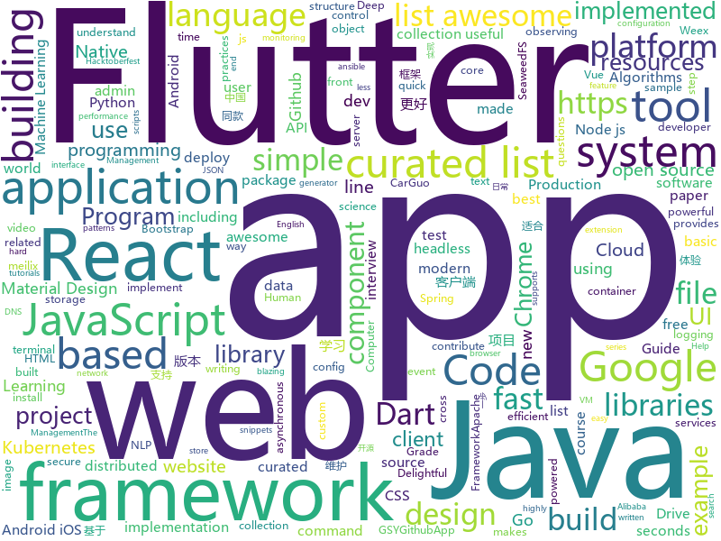

# 2018-10-05
See what the GitHub community is most excited about today.

## python
* [dbxfs](https://github.com/rianhunter/dbxfs)(**169 stars today**): User-space file system for Dropbox
* [Python](https://github.com/TheAlgorithms/Python)(**153 stars today**): All Algorithms implemented in Python
* [sotawhat](https://github.com/chiphuyen/sotawhat)(**107 stars today**): Returns latest research results by crawling arxiv papers and summarizing abstracts. Helps you stay afloat with so many new papers everyday.
* [byob](https://github.com/malwaredllc/byob)(**67 stars today**): BYOB (Build Your Own Botnet)
* [gpytorch](https://github.com/cornellius-gp/gpytorch)(**63 stars today**): A highly efficient and modular implementation of Gaussian Processes in PyTorch
* [models](https://github.com/tensorflow/models)(**41 stars today**): Models and examples built with TensorFlow
* [scc](https://github.com/Ziyadsk/scc)(**48 stars today**): An Offline cheat sheet and a quick reference command line tool for HTML, CSS and JS .
* [torchgeometry](https://github.com/arraiy/torchgeometry)(**49 stars today**): TGM: PyTorch Geometry
* [ansible](https://github.com/ansible/ansible)(**35 stars today**): Ansible is a radically simple IT automation platform that makes your applications and systems easier to deploy. Avoid writing scripts or custom code to deploy and update your applications — automate in a language that approaches plain English, using SSH, with no agents to install on remote systems. https://docs.ansible.com/ansible/
* [keras](https://github.com/keras-team/keras)(**33 stars today**): Deep Learning for humans
* [system-design-primer](https://github.com/donnemartin/system-design-primer)(**38 stars today**): Learn how to design large-scale systems. Prep for the system design interview. Includes Anki flashcards.
* [awesome-python](https://github.com/vinta/awesome-python)(**36 stars today**): A curated list of awesome Python frameworks, libraries, software and resources
* [youtube-dl](https://github.com/rg3/youtube-dl)(**34 stars today**): Command-line program to download videos from YouTube.com and other video sites
* [awesome-algorithm](https://github.com/apachecn/awesome-algorithm)(**37 stars today**): Leetcode 题解 (跟随思路一步一步撸出代码) 及经典算法实现
* [pypeln](https://github.com/cgarciae/pypeln)(**35 stars today**): Concurrent data pipelines made easy
* [django](https://github.com/django/django)(**30 stars today**): The Web framework for perfectionists with deadlines.
* [s-tui](https://github.com/amanusk/s-tui)(**33 stars today**): Terminal based CPU stress and monitoring utility
* [30-seconds-of-python-code](https://github.com/kriadmin/30-seconds-of-python-code)(**31 stars today**): Python implementation of 30-seconds-of-code
* [cpython](https://github.com/python/cpython)(**24 stars today**): The Python programming language
* [mlcourse.ai](https://github.com/Yorko/mlcourse.ai)(**18 stars today**): Open Machine Learning course mlcourse.ai, both in English and Russian
* [awesome-machine-learning](https://github.com/josephmisiti/awesome-machine-learning)(**26 stars today**): A curated list of awesome Machine Learning frameworks, libraries and software.
* [kubespray](https://github.com/kubernetes-incubator/kubespray)(**27 stars today**): Deploy a Production Ready Kubernetes Cluster
* [logme](https://github.com/BNMetrics/logme)(**28 stars today**): Python Logging For Humans (Also supports configurable color logging for the terminal!)
* [imagenet18](https://github.com/diux-dev/imagenet18)(**26 stars today**): Code to reproduce "imagenet in 18 minutes" experiments
* [face_recognition](https://github.com/ageitgey/face_recognition)(**25 stars today**): The world's simplest facial recognition api for Python and the command line

## java
* [Intra](https://github.com/Jigsaw-Code/Intra)(**123 stars today**): An experimental tool that allows you to test new DNS-over-HTTPS services on Android
* [symphony](https://github.com/b3log/symphony)(**44 stars today**): 🎶一款用 Java 实现的现代化社区（论坛/BBS/社交网络/博客）平台。https://hacpai.com
* [JavaGuide](https://github.com/Snailclimb/JavaGuide)(**54 stars today**): 【Java学习+面试指南】 一份涵盖大部分Java程序员所需要掌握的核心知识。
* [proxyee-down](https://github.com/proxyee-down-org/proxyee-down)(**40 stars today**): http下载工具，基于http代理，支持多连接分块下载
* [java-design-patterns](https://github.com/iluwatar/java-design-patterns)(**38 stars today**): Design patterns implemented in Java
* [tutorials](https://github.com/eugenp/tutorials)(**16 stars today**): The "REST With Spring" Course:
* [spring-boot](https://github.com/spring-projects/spring-boot)(**31 stars today**): Spring Boot
* [algo](https://github.com/wangzheng0822/algo)(**28 stars today**): Data Structure & Algorithm
* [plaid](https://github.com/nickbutcher/plaid)(**25 stars today**): An Android app which provides design news & inspiration as well as being an example of implementing material design.
* [Java](https://github.com/TheAlgorithms/Java)(**19 stars today**): All Algorithms implemented in Java
* [elasticsearch](https://github.com/elastic/elasticsearch)(**16 stars today**): Open Source, Distributed, RESTful Search Engine
* [java8-tutorial](https://github.com/winterbe/java8-tutorial)(**19 stars today**): Modern Java - A Guide to Java 8
* [graal](https://github.com/oracle/graal)(**16 stars today**): GraalVM: Run Programs Faster Anywhere🚀
* [jib](https://github.com/GoogleContainerTools/jib)(**15 stars today**): ⛵️Build container images for your Java applications.
* [guava](https://github.com/google/guava)(**14 stars today**): Google core libraries for Java
* [spring-framework](https://github.com/spring-projects/spring-framework)(**13 stars today**): Spring Framework
* [RxJava](https://github.com/ReactiveX/RxJava)(**13 stars today**): RxJava – Reactive Extensions for the JVM – a library for composing asynchronous and event-based programs using observable sequences for the Java VM.
* [tink](https://github.com/google/tink)(**14 stars today**): Tink is a multi-language, cross-platform library that provides cryptographic APIs that are secure, easy to use correctly, and hard(er) to misuse.
* [netty](https://github.com/netty/netty)(**12 stars today**): Netty project - an event-driven asynchronous network application framework
* [pulsar](https://github.com/apache/pulsar)(**12 stars today**): Apache Pulsar - distributed pub-sub messaging system
* [APIJSON](https://github.com/TommyLemon/APIJSON)(**12 stars today**): 🚀后端接口和文档自动化，前端(客户端) 定制返回JSON的数据和结构！
* [micronaut-core](https://github.com/micronaut-projects/micronaut-core)(**12 stars today**): Micronaut Application Framework
* [incubator-dubbo](https://github.com/apache/incubator-dubbo)(**11 stars today**): Apache Dubbo (incubating) is a high-performance, java based, open source RPC framework.
* [arthas](https://github.com/alibaba/arthas)(**11 stars today**): Alibaba Java Diagnostic Tool Arthas/Alibaba Java诊断利器Arthas
* [material-components-android](https://github.com/material-components/material-components-android)(**11 stars today**): Modular and customizable Material Design UI components for Android

## unknown
* [quick-SQL-cheatsheet](https://github.com/enochtangg/quick-SQL-cheatsheet)(**445 stars today**): A quick reminder of all SQL queries and examples on how to use them.
* [first-contributions](https://github.com/firstcontributions/first-contributions)(**71 stars today**): 🚀✨Help beginners to contribute to open source projects
* [pwc](https://github.com/zziz/pwc)(**92 stars today**): Papers with code. Sorted by stars. Updated weekly.
* [awesome-nodejs](https://github.com/sindresorhus/awesome-nodejs)(**81 stars today**): ⚡️Delightful Node.js packages and resources
* [awesome](https://github.com/sindresorhus/awesome)(**66 stars today**): 😎Curated list of awesome lists
* [gitignore](https://github.com/github/gitignore)(**45 stars today**): A collection of useful .gitignore templates
* [developer-roadmap](https://github.com/kamranahmedse/developer-roadmap)(**55 stars today**): Roadmap to becoming a web developer in 2018
* [coding-interview-university](https://github.com/jwasham/coding-interview-university)(**51 stars today**): A complete computer science study plan to become a software engineer.
* [deep_learning_object_detection](https://github.com/hoya012/deep_learning_object_detection)(**49 stars today**): A paper list of object detection using deep learning.
* [awesome-human-pose-estimation](https://github.com/cbsudux/awesome-human-pose-estimation)(**52 stars today**): A collection of awesome resources in Human Pose estimation.
* [CS-Notes](https://github.com/CyC2018/CS-Notes)(**47 stars today**): 📚Computer Science Learning Notes
* [You-Dont-Know-JS](https://github.com/getify/You-Dont-Know-JS)(**47 stars today**): A book series on JavaScript. @YDKJS on twitter.
* [stanford-cs-229-machine-learning](https://github.com/afshinea/stanford-cs-229-machine-learning)(**45 stars today**): VIP cheatsheets for Stanford's CS 229 Machine Learning
* [free-programming-books](https://github.com/EbookFoundation/free-programming-books)(**37 stars today**): 📚Freely available programming books
* [Go-1-2-Proposal---Immutability](https://github.com/romshark/Go-1-2-Proposal---Immutability)(**41 stars today**): A a Go 1/2 language feature proposal to immutability
* [project-based-learning](https://github.com/tuvtran/project-based-learning)(**35 stars today**): Curated list of project-based tutorials
* [awesome-vue](https://github.com/vuejs/awesome-vue)(**34 stars today**): 🎉A curated list of awesome things related to Vue.js
* [awesome-readme](https://github.com/matiassingers/awesome-readme)(**34 stars today**): A curated list of awesome READMEs
* [kubernetes-the-hard-way](https://github.com/kelseyhightower/kubernetes-the-hard-way)(**34 stars today**): Bootstrap Kubernetes the hard way on Google Cloud Platform. No scripts.
* [rstats-ed](https://github.com/rstudio-education/rstats-ed)(**31 stars today**): List of courses teaching R
* [haskell-study-plan](https://github.com/soupi/haskell-study-plan)(**33 stars today**): An opinionated list of resources for learning Haskell
* [sketch-data](https://github.com/ivomynttinen/sketch-data)(**28 stars today**): Various lists to use as data source in Sketch app and other design applications
* [Front-end-Developer-Interview-Questions](https://github.com/h5bp/Front-end-Developer-Interview-Questions)(**24 stars today**): A list of helpful front-end related questions you can use to interview potential candidates, test yourself or completely ignore.
* [chinese-independent-developer](https://github.com/1c7/chinese-independent-developer)(**24 stars today**): 👩🏿‍💻👨🏾‍💻👩🏼‍💻👨🏽‍💻👩🏻‍💻中国独立开发者项目列表 -- 分享大家都在做什么
* [awesome-interview-questions](https://github.com/MaximAbramchuck/awesome-interview-questions)(**24 stars today**): A curated awesome list of lists of interview questions. Feel free to contribute!🎓

## javascript
* [30-seconds-of-code](https://github.com/30-seconds/30-seconds-of-code)(**377 stars today**): Curated collection of useful JavaScript snippets that you can understand in 30 seconds or less.
* [ekill](https://github.com/rhardih/ekill)(**156 stars today**): Chrome extension to nuke annoying elements in a web page
* [slang](https://github.com/kylestetz/slang)(**156 stars today**): 🎤a simple audio programming language implemented in JS
* [create-react-app](https://github.com/facebook/create-react-app)(**92 stars today**): Create React apps with no build configuration.
* [awesome-vscode](https://github.com/viatsko/awesome-vscode)(**105 stars today**): 🎨A curated list of delightful VS Code packages and resources.
* [vue](https://github.com/vuejs/vue)(**85 stars today**): 🖖A progressive, incrementally-adoptable JavaScript framework for building UI on the web.
* [storybook](https://github.com/storybooks/storybook)(**75 stars today**): Interactive UI component dev & test: React, React Native, Vue, Angular
* [datasette](https://github.com/simonw/datasette)(**78 stars today**): A tool for exploring and publishing data
* [react](https://github.com/facebook/react)(**63 stars today**): A declarative, efficient, and flexible JavaScript library for building user interfaces.
* [husky](https://github.com/typicode/husky)(**62 stars today**): 🐶Git hooks made easy
* [joplin](https://github.com/laurent22/joplin)(**59 stars today**): Joplin - a note taking and to-do application with synchronization capabilities for Windows, macOS, Linux, Android and iOS. Forum: https://discourse.joplin.cozic.net/
* [javascript-algorithms](https://github.com/trekhleb/javascript-algorithms)(**47 stars today**): Algorithms and data structures implemented in JavaScript with explanations and links to further readings
* [svgr](https://github.com/smooth-code/svgr)(**52 stars today**): Transform SVGs into React components🦁
* [puppeteer](https://github.com/GoogleChrome/puppeteer)(**49 stars today**): Headless Chrome Node API
* [axios](https://github.com/axios/axios)(**46 stars today**): Promise based HTTP client for the browser and node.js
* [parcel](https://github.com/parcel-bundler/parcel)(**46 stars today**): 📦🚀Blazing fast, zero configuration web application bundler
* [falcon](https://github.com/deity-io/falcon)(**46 stars today**): Deity Falcon - An Open Source, platform agnostic, headless PWA front-end library
* [atom](https://github.com/atom/atom)(**39 stars today**): The hackable text editor
* [javascript](https://github.com/airbnb/javascript)(**42 stars today**): JavaScript Style Guide
* [write-readable-javascript-code](https://github.com/kingzez/write-readable-javascript-code)(**44 stars today**): 📖All about writing maintainable JavaScript
* [nuxt-basic-auth-module](https://github.com/potato4d/nuxt-basic-auth-module)(**44 stars today**): Provide basic auth your Nuxt.js application
* [gatsby](https://github.com/gatsbyjs/gatsby)(**32 stars today**): Build blazing fast, modern apps and websites with React
* [strapi](https://github.com/strapi/strapi)(**39 stars today**): 🚀Node.js Content Management Framework (headless-CMS) to build powerful API with no effort.
* [react-native](https://github.com/facebook/react-native)(**34 stars today**): A framework for building native apps with React.
* [material-ui](https://github.com/mui-org/material-ui)(**32 stars today**): React components that implement Google's Material Design.

## html
* [solid](https://github.com/solid/solid)(**192 stars today**): Solid - Re-decentralizing the web (project directory)
* [mastering-modular-javascript](https://github.com/mjavascript/mastering-modular-javascript)(**98 stars today**): 📦Module thinking, principles, design patterns and best practices.
* [hacktoberfest](https://github.com/lingonsaft/hacktoberfest)(**22 stars today**): Hacktoberfest 2018
* [Hello-world](https://github.com/Hacktoberfest-2018/Hello-world)(**20 stars today**): Add any Program in any language you like or add a hello world Program❣️if you like give us⭐️
* [creative-computing-society.github.io](https://github.com/creative-computing-society/creative-computing-society.github.io)(**44 stars today**): This is the Hacktoberfest first contribution website of CCS
* [30-seconds-of-css](https://github.com/30-seconds/30-seconds-of-css)(**46 stars today**): A curated collection of useful CSS snippets you can understand in 30 seconds or less.
* [Spoon-Knife](https://github.com/octocat/Spoon-Knife)(****): This repo is for demonstration purposes only.
* [NLP-progress](https://github.com/sebastianruder/NLP-progress)(**17 stars today**): Repository to track the progress in Natural Language Processing (NLP), including the datasets and the current state-of-the-art for the most common NLP tasks.
* [AdminLTE](https://github.com/almasaeed2010/AdminLTE)(**13 stars today**): AdminLTE - Free Premium Admin control Panel Theme Based On Bootstrap 3.x
* [react-app-rewired](https://github.com/timarney/react-app-rewired)(**16 stars today**): Override create-react-app webpack configs without ejecting
* [logstash-testing-e2e](https://github.com/meabed/logstash-testing-e2e)(**13 stars today**): Easy Logstash testing ē2ē
* [fastText](https://github.com/facebookresearch/fastText)(**10 stars today**): Library for fast text representation and classification.
* [javascript-tutorial-en](https://github.com/iliakan/javascript-tutorial-en)(**7 stars today**): Modern JavaScript Tutorial
* [core](https://github.com/stackblitz/core)(**10 stars today**): Online IDE powered by Visual Studio Code⚡️
* [material-design-lite](https://github.com/google/material-design-lite)(**9 stars today**): Material Design Components in HTML/CSS/JS
* [chart-doctor](https://github.com/ft-interactive/chart-doctor)(**9 stars today**): Sample files to accompany the FT's Chart Doctor column
* [portainer](https://github.com/portainer/portainer)(**8 stars today**): Simple management UI for Docker
* [intro.js](https://github.com/usablica/intro.js)(**8 stars today**): A better way for new feature introduction and step-by-step users guide for your website and project.
* [app-privacy-policy-generator](https://github.com/nisrulz/app-privacy-policy-generator)(**7 stars today**): A simple web app to generate a generic privacy policy for your Android/iOS apps
* [coreui-free-bootstrap-admin-template](https://github.com/coreui/coreui-free-bootstrap-admin-template)(**7 stars today**): CoreUI is free bootstrap admin template
* [gophish](https://github.com/gophish/gophish)(**7 stars today**): Open-Source Phishing Toolkit
* [nginxconfig.io](https://github.com/valentinxxx/nginxconfig.io)(**6 stars today**): 🎛️nginx config generator generator on steroids.
* [WebFundamentals](https://github.com/google/WebFundamentals)(**6 stars today**): Best practices for modern web development
* [mxgraph](https://github.com/jgraph/mxgraph)(**5 stars today**): mxGraph is a fully client side JavaScript diagramming library
* [meilix-generator](https://github.com/fossasia/meilix-generator)(**5 stars today**): WebApp for generating a custom ISO image based on Meilix http://meilix.org

## dart
* [flutter](https://github.com/flutter/flutter)(**47 stars today**): Flutter makes it easy and fast to build beautiful mobile apps.
* [mtc2018-app](https://github.com/mercari/mtc2018-app)(**31 stars today**): The Official Conference App for Mercari Tech Conf 2018
* [awesome-flutter](https://github.com/Solido/awesome-flutter)(**25 stars today**): An awesome list that curates the best Flutter libraries, tools, tutorials, articles and more.
* [FlutterPlayground](https://github.com/ibhavikmakwana/FlutterPlayground)(**13 stars today**): Playground app for Flutter
* [plugins](https://github.com/flutter/plugins)(**10 stars today**): Plugins for Flutter, including FlutterFire, maintained by the Flutter team
* [flutter-mobile](https://github.com/invoiceninja/flutter-mobile)(**10 stars today**): iOS/Android app for Invoice Ninja built with Google Flutter
* [xamarin.flutter](https://github.com/adamped/xamarin.flutter)(**6 stars today**): Running Flutter on Xamarin
* [flutter_architecture_samples](https://github.com/brianegan/flutter_architecture_samples)(**6 stars today**): TodoMVC for Flutter
* [flutter_study](https://github.com/luhenchang/flutter_study)(**5 stars today**): 三天学会Flutter
* [dart-sass](https://github.com/sass/dart-sass)(**5 stars today**): A Dart implementation of Sass.
* [oauth2](https://github.com/dart-lang/oauth2)(****): An OAuth2 client library for Dart.
* [flutter_blue](https://github.com/pauldemarco/flutter_blue)(****): Bluetooth plugin for Flutter
* [sdk](https://github.com/dart-lang/sdk)(****): The Dart SDK, including the VM, dart2js, core libraries, and more.
* [built_value.dart](https://github.com/google/built_value.dart)(****): Immutable value types, enum classes, and serialization.
* [website](https://github.com/flutter/website)(****): Flutter web site
* [json_serializable](https://github.com/dart-lang/json_serializable)(****): Generates utilities to aid in serializing to/from JSON.
* [chromedeveditor](https://github.com/googlearchive/chromedeveditor)(****): Chrome Dev Editor is a developer tool for building apps on the Chrome platform - Chrome Apps and Web Apps, in JavaScript or Dart. (NO LONGER IN ACTIVE DEVELOPMENT)
* [GSYGithubAppFlutter](https://github.com/CarGuo/GSYGithubAppFlutter)(****): 超完整的Flutter项目，功能丰富，适合学习和日常使用。GSYGithubApp系列的优势：我们目前已经拥有Flutter、Weex、ReactNative三个版本。 功能齐全，项目框架内技术涉及面广，完成度高，持续维护，配套文章，适合全面学习，跨框架对比参考。跨平台的开源Github客户端App，更好的体验，更丰富的功能，旨在更好的日常管理和维护个人Github，提供更好更方便的驾车体验～～Σ(￣。￣ﾉ)ﾉ。同款Weex版本 ： https://github.com/CarGuo/GSYGithubAppWeex 、同款React Native版本 ： https://github.com/CarGuo/GSYGithubApp
* [flutter-osc](https://github.com/yubo725/flutter-osc)(****): 基于Google Flutter的开源中国客户端，支持Android和iOS。
* [flutter-examples](https://github.com/nisrulz/flutter-examples)(****): [Examples] Simple basic isolated apps, for budding flutter devs.
* [Flutter-UI-Kit](https://github.com/iampawan/Flutter-UI-Kit)(****): Flutter app for collection of UI in a UIKit
* [FlutterExampleApps](https://github.com/iampawan/FlutterExampleApps)(****): [Example APPS] Basic Flutter apps, for flutter devs.
* [inKino](https://github.com/roughike/inKino)(****): inKino - A cross platform movie and showtime browser for Finnkino cinemas, made with Flutter.
* [Flutter-learning](https://github.com/AweiLoveAndroid/Flutter-learning)(****): 🔥👍🌟⭐️⭐️⭐️Flutter install&settings,Flutter problems when developing,Flutter sample codes& templates,Flutter projects,Dart languages sample codes
* [dio](https://github.com/flutterchina/dio)(****): A powerful Http client for Dart, which supports Interceptors, FormData, Request Cancellation, File Downloading, Timeout etc.

## go
* [sourcegraph](https://github.com/sourcegraph/sourcegraph)(**294 stars today**): Code search and intelligence, self-hosted and scalable
* [ferret](https://github.com/MontFerret/ferret)(**283 stars today**): Declarative web scraping
* [weave](https://github.com/iov-one/weave)(**126 stars today**): Easy-to-use framework to build Tendermint ABCI applications
* [roadrunner](https://github.com/spiral/roadrunner)(**60 stars today**): High-performance PHP application server, load-balancer and process manager written in Golang
* [genesis](https://github.com/benbjohnson/genesis)(**51 stars today**): A simple tool for embedding assets in a Go binary.
* [kubernetes](https://github.com/kubernetes/kubernetes)(**38 stars today**): Production-Grade Container Scheduling and Management
* [go](https://github.com/golang/go)(**36 stars today**): The Go programming language
* [kubedirector](https://github.com/bluek8s/kubedirector)(**34 stars today**): Kubernetes Director (aka KubeDirector) for deploying and managing stateful applications on Kubernetes
* [MATRIX-TESTNET](https://github.com/MatrixAINetwork/MATRIX-TESTNET)(**26 stars today**): First version of MATRIX TESTNET, especially for TPS optimization and AI
* [telegramd](https://github.com/nebulaim/telegramd)(**32 stars today**): Unofficial open source telegram server written in golang
* [kubespy](https://github.com/pulumi/kubespy)(**30 stars today**): Tools for observing Kubernetes resources in real time, powered by Pulumi.
* [seaweedfs](https://github.com/chrislusf/seaweedfs)(**29 stars today**): SeaweedFS is a simple and highly scalable distributed file system. There are two objectives: to store billions of files! to serve the files fast! SeaweedFS implements an object store with O(1) disk seek, and an optional Filer with POSIX interface.
* [awesome-go](https://github.com/avelino/awesome-go)(**27 stars today**): A curated list of awesome Go frameworks, libraries and software
* [istio](https://github.com/istio/istio)(**25 stars today**): Connect, secure, control, and observe services.
* [sdns](https://github.com/semihalev/sdns)(**25 stars today**): Lightweight, fast dns recursive server
* [pgcenter](https://github.com/lesovsky/pgcenter)(**23 stars today**): Command-line admin tool for observing and troubleshooting Postgres.
* [pack](https://github.com/buildpack/pack)(**22 stars today**): CLI for building apps using Cloud Native Buildpacks
* [kops](https://github.com/kubernetes/kops)(**18 stars today**): Kubernetes Operations (kops) - Production Grade K8s Installation, Upgrades, and Management
* [etcdadm](https://github.com/platform9/etcdadm)(**21 stars today**): 
* [prometheus](https://github.com/prometheus/prometheus)(**17 stars today**): The Prometheus monitoring system and time series database.
* [rclone](https://github.com/ncw/rclone)(**18 stars today**): "rsync for cloud storage" - Google Drive, Amazon Drive, S3, Dropbox, Backblaze B2, One Drive, Swift, Hubic, Cloudfiles, Google Cloud Storage, Yandex Files
* [v2ray-core](https://github.com/v2ray/v2ray-core)(**14 stars today**): A platform for building proxies to bypass network restrictions.
* [helm](https://github.com/helm/helm)(**14 stars today**): The Kubernetes Package Manager
* [hugo](https://github.com/gohugoio/hugo)(**17 stars today**): The world’s fastest framework for building websites.
* [fzf](https://github.com/junegunn/fzf)(**16 stars today**): 🌸A command-line fuzzy finder

## WordCloud

