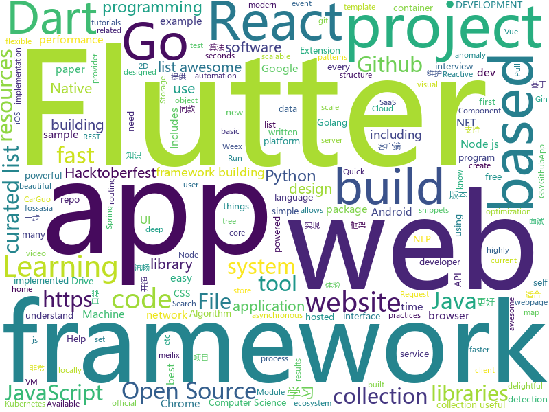

# 2018-10-08
See what the GitHub community is most excited about today.

## python
* [Algorithm_Interview_Notes-Chinese](https://github.com/imhuay/Algorithm_Interview_Notes-Chinese)(**387 stars today**): 2018/2019/校招/春招/秋招/算法/机器学习(Machine Learning)/深度学习(Deep Learning)/自然语言处理(NLP)/C/C++/Python/面试笔记
* [Python](https://github.com/TheAlgorithms/Python)(**127 stars today**): All Algorithms implemented in Python
* [system-design-primer](https://github.com/donnemartin/system-design-primer)(**63 stars today**): Learn how to design large-scale systems. Prep for the system design interview. Includes Anki flashcards.
* [models](https://github.com/tensorflow/models)(**46 stars today**): Models and examples built with TensorFlow
* [youtube-dl](https://github.com/rg3/youtube-dl)(**44 stars today**): Command-line program to download videos from YouTube.com and other video sites
* [keras](https://github.com/keras-team/keras)(**36 stars today**): Deep Learning for humans
* [awesome-algorithm](https://github.com/apachecn/awesome-algorithm)(**43 stars today**): Leetcode 题解 (跟随思路一步一步撸出代码) 及经典算法实现
* [Shellab](https://github.com/TheSecondSun/Shellab)(**41 stars today**): Linux and Windows shellcode enrichment utility
* [awesome-python](https://github.com/vinta/awesome-python)(**39 stars today**): A curated list of awesome Python frameworks, libraries, software and resources
* [mlcourse.ai](https://github.com/Yorko/mlcourse.ai)(**20 stars today**): Open Machine Learning course mlcourse.ai, both in English and Russian
* [byob](https://github.com/malwaredllc/byob)(**30 stars today**): BYOB (Build Your Own Botnet)
* [scikit-learn](https://github.com/scikit-learn/scikit-learn)(**27 stars today**): scikit-learn: machine learning in Python
* [public-apis](https://github.com/toddmotto/public-apis)(**29 stars today**): A collective list of public JSON APIs for use in web development.
* [SILENTTRINITY](https://github.com/byt3bl33d3r/SILENTTRINITY)(**28 stars today**): A post-exploitation agent powered by Python, IronPython, C#/.NET
* [home-assistant](https://github.com/home-assistant/home-assistant)(**24 stars today**): 🏡Open source home automation that puts local control and privacy first
* [pipenv](https://github.com/pypa/pipenv)(**24 stars today**): Python Development Workflow for Humans.
* [ad_examples](https://github.com/shubhomoydas/ad_examples)(**24 stars today**): A collection of popular anomaly detection methods (iid/point-based and time series) including active learning for anomaly detection/discovery, description for diversity/explanation/interpretability. With a deeper analysis of incorporating label feedback with ensemble and tree-based detectors. Includes results-plots and illustrations for most app…
* [sotawhat](https://github.com/chiphuyen/sotawhat)(**24 stars today**): Returns latest research results by crawling arxiv papers and summarizing abstracts. Helps you stay afloat with so many new papers everyday.
* [flask](https://github.com/pallets/flask)(**21 stars today**): The Python micro framework for building web applications.
* [cpython](https://github.com/python/cpython)(**20 stars today**): The Python programming language
* [openlibrary](https://github.com/internetarchive/openlibrary)(**21 stars today**): One webpage for every book ever published!
* [arviz](https://github.com/arviz-devs/arviz)(**22 stars today**): Python package to plot and analyse samples from probabilistic models
* [django](https://github.com/django/django)(**17 stars today**): The Web framework for perfectionists with deadlines.
* [Atlas](https://github.com/m4ll0k/Atlas)(**22 stars today**): Quick SQLMap Tamper Suggester
* [ungoogled-chromium](https://github.com/Eloston/ungoogled-chromium)(**20 stars today**): Google Chromium, sans integration with Google

## java
* [brigadier](https://github.com/Mojang/brigadier)(**393 stars today**): Brigadier is a command parser & dispatcher, designed and developed for Minecraft: Java Edition.
* [DataFixerUpper](https://github.com/Mojang/DataFixerUpper)(**188 stars today**): A set of utilities designed for incremental building, merging and optimization of data transformations.
* [island](https://github.com/oasisfeng/island)(**114 stars today**): Island for Android
* [symphony](https://github.com/b3log/symphony)(**48 stars today**): 🎶一款用 Java 实现的现代化社区（论坛/BBS/社交网络/博客）平台。https://hacpai.com
* [JavaGuide](https://github.com/Snailclimb/JavaGuide)(**41 stars today**): 【Java学习+面试指南】 一份涵盖大部分Java程序员所需要掌握的核心知识。
* [proxyee-down](https://github.com/proxyee-down-org/proxyee-down)(**43 stars today**): http下载工具，基于http代理，支持多连接分块下载
* [Pixiv-Illustration-Collection](https://github.com/OysterQAQ/Pixiv-Illustration-Collection)(**36 stars today**): 一个提供有限的pixiv日排行与高级会员搜索的站点
* [elasticsearch](https://github.com/elastic/elasticsearch)(**26 stars today**): Open Source, Distributed, RESTful Search Engine
* [interviews](https://github.com/kdn251/interviews)(**22 stars today**): Everything you need to know to get the job.
* [spring-framework](https://github.com/spring-projects/spring-framework)(**19 stars today**): Spring Framework
* [spring-boot](https://github.com/spring-projects/spring-boot)(**20 stars today**): Spring Boot
* [java-design-patterns](https://github.com/iluwatar/java-design-patterns)(**21 stars today**): Design patterns implemented in Java
* [Intra](https://github.com/Jigsaw-Code/Intra)(**20 stars today**): An experimental tool that allows you to test new DNS-over-HTTPS services on Android
* [netty](https://github.com/netty/netty)(**17 stars today**): Netty project - an event-driven asynchronous network application framework
* [Java](https://github.com/TheAlgorithms/Java)(**19 stars today**): All Algorithms implemented in Java
* [tutorials](https://github.com/eugenp/tutorials)(**13 stars today**): The "REST With Spring" Course:
* [citra_android](https://github.com/SachinVin/citra_android)(**17 stars today**): An Android fronend for the Citra Emulator
* [Auto.js](https://github.com/hyb1996/Auto.js)(**13 stars today**): A UiAutomator on android, does not need root access
* [arthas](https://github.com/alibaba/arthas)(**12 stars today**): Alibaba Java Diagnostic Tool Arthas/Alibaba Java诊断利器Arthas
* [guava](https://github.com/google/guava)(**11 stars today**): Google core libraries for Java
* [selenium](https://github.com/SeleniumHQ/selenium)(**11 stars today**): A browser automation framework and ecosystem.
* [interview](https://github.com/mission-peace/interview)(**8 stars today**): Interview questions
* [Shelter](https://github.com/PeterCxy/Shelter)(**10 stars today**): (Mirror) Isolate your Big Brother Apps
* [graal](https://github.com/oracle/graal)(**10 stars today**): GraalVM: Run Programs Faster Anywhere🚀
* [RxJava](https://github.com/ReactiveX/RxJava)(**9 stars today**): RxJava – Reactive Extensions for the JVM – a library for composing asynchronous and event-based programs using observable sequences for the Java VM.

## unknown
* [CS-Notes](https://github.com/CyC2018/CS-Notes)(**170 stars today**): 📚Computer Science Learning Notes
* [first-contributions](https://github.com/firstcontributions/first-contributions)(**57 stars today**): 🚀✨Help beginners to contribute to open source projects
* [quick-SQL-cheatsheet](https://github.com/enochtangg/quick-SQL-cheatsheet)(**96 stars today**): A quick reminder of all SQL queries and examples on how to use them.
* [awesome](https://github.com/sindresorhus/awesome)(**55 stars today**): 😎Curated list of awesome lists
* [developer-roadmap](https://github.com/kamranahmedse/developer-roadmap)(**46 stars today**): Roadmap to becoming a web developer in 2018
* [nodebestpractices](https://github.com/i0natan/nodebestpractices)(**39 stars today**): The largest Node.JS best practices list (October 2018)
* [coding-interview-university](https://github.com/jwasham/coding-interview-university)(**30 stars today**): A complete computer science study plan to become a software engineer.
* [free-programming-books](https://github.com/EbookFoundation/free-programming-books)(**28 stars today**): 📚Freely available programming books
* [gitignore](https://github.com/github/gitignore)(**24 stars today**): A collection of useful .gitignore templates
* [stanford-cs-229-machine-learning](https://github.com/afshinea/stanford-cs-229-machine-learning)(**28 stars today**): VIP cheatsheets for Stanford's CS 229 Machine Learning
* [Make-a-Pull-Request](https://github.com/rishabh-bansal/Make-a-Pull-Request)(**6 stars today**): Make a Pull Request
* [project-based-learning](https://github.com/tuvtran/project-based-learning)(**22 stars today**): Curated list of project-based tutorials
* [awesome-nodejs](https://github.com/sindresorhus/awesome-nodejs)(**23 stars today**): ⚡️Delightful Node.js packages and resources
* [awesome-vue](https://github.com/vuejs/awesome-vue)(**23 stars today**): 🎉A curated list of awesome things related to Vue.js
* [awesome-cpp](https://github.com/fffaraz/awesome-cpp)(**23 stars today**): A curated list of awesome C++ (or C) frameworks, libraries, resources, and shiny things. Inspired by awesome-... stuff.
* [Hacktoberfest](https://github.com/Joonsang1994/Hacktoberfest)(**8 stars today**): This hacktoberfest project exists to help you submit your first Pull Request and welcome you to the world of open source!
* [computer-science](https://github.com/ossu/computer-science)(**19 stars today**): 🎓Path to a free self-taught education in Computer Science!
* [pwc](https://github.com/zziz/pwc)(**17 stars today**): Papers with code. Sorted by stars. Updated weekly.
* [zsxq_archives](https://github.com/feicong/zsxq_archives)(**18 stars today**): 【软件安全与知识星球】精华文章列表
* [free-for-dev](https://github.com/ripienaar/free-for-dev)(**15 stars today**): A list of SaaS, PaaS and IaaS offerings that have free tiers of interest to devops and infradev
* [deep_learning_object_detection](https://github.com/hoya012/deep_learning_object_detection)(**14 stars today**): A paper list of object detection using deep learning.
* [awesome-scalability](https://github.com/binhnguyennus/awesome-scalability)(**15 stars today**): Scalable, Available, Stable, Performant, and Intelligent System Design Patterns
* [ToolsOfTheTrade](https://github.com/cjbarber/ToolsOfTheTrade)(**14 stars today**): Tools of The Trade, from Hacker News.
* [CS-Interview-Knowledge-Map](https://github.com/InterviewMap/CS-Interview-Knowledge-Map)(**14 stars today**): Build the best interview map. The current content includes JS, network, browser related, performance optimization, security, framework, Git, data structure, algorithm, etc.
* [every-programmer-should-know](https://github.com/mtdvio/every-programmer-should-know)(**12 stars today**): A collection of (mostly) technical things every software developer should know

## javascript
* [awesome-vscode](https://github.com/viatsko/awesome-vscode)(**346 stars today**): 🎨A curated list of delightful VS Code packages and resources.
* [30-seconds-of-code](https://github.com/30-seconds/30-seconds-of-code)(**200 stars today**): Curated collection of useful JavaScript snippets that you can understand in 30 seconds or less.
* [md-page](https://github.com/oscarmorrison/md-page)(**167 stars today**): 📝create a webpage with just markdown
* [rete](https://github.com/retejs/rete)(**162 stars today**): JavaScript framework for visual programming and creating node editor
* [trigonoparty](https://github.com/ramesaliyev/trigonoparty)(**107 stars today**): Simple Trigonometry Visualisation with Pure JavaScript.
* [ekill](https://github.com/rhardih/ekill)(**107 stars today**): Chrome extension to nuke annoying elements in a web page
* [create-react-app](https://github.com/facebook/create-react-app)(**56 stars today**): Create React apps with no build configuration.
* [vue](https://github.com/vuejs/vue)(**61 stars today**): 🖖A progressive, incrementally-adoptable JavaScript framework for building UI on the web.
* [guide](https://github.com/freeCodeCamp/guide)(**20 stars today**): A collection of easy-to-understand guides to programming tools
* [react](https://github.com/facebook/react)(**48 stars today**): A declarative, efficient, and flexible JavaScript library for building user interfaces.
* [dev-cv](https://github.com/EyalPerry/dev-cv)(**53 stars today**): A CV Template for Software Developers
* [Hacktoberfest](https://github.com/Showndarya/Hacktoberfest)(**13 stars today**): A collection of words!⭐️it if you👍it !
* [You-Dont-Need-Momentjs](https://github.com/you-dont-need/You-Dont-Need-Momentjs)(**39 stars today**): List of date-fns or native functions which you can use to replace moment.js + ESLint Plugin
* [react-flip-toolkit](https://github.com/aholachek/react-flip-toolkit)(**39 stars today**): A React FLIP animation library for highly configurable transitions
* [javascript](https://github.com/airbnb/javascript)(**34 stars today**): JavaScript Style Guide
* [axios](https://github.com/axios/axios)(**36 stars today**): Promise based HTTP client for the browser and node.js
* [WatermelonDB](https://github.com/Nozbe/WatermelonDB)(**35 stars today**): 🍉Next-gen database for powerful React and React Native apps that scales to 10,000s of records and remains fast⚡️
* [next.js](https://github.com/zeit/next.js)(**31 stars today**): The React Framework
* [awesome-selfhosted](https://github.com/Kickball/awesome-selfhosted)(**33 stars today**): This is a list of Free Software network services and web applications which can be hosted locally. Selfhosting is the process of locally hosting and managing applications instead of renting from SaaS providers.
* [node](https://github.com/nodejs/node)(**25 stars today**): Node.js JavaScript runtime✨🐢🚀✨
* [storybook](https://github.com/storybooks/storybook)(**30 stars today**): Interactive UI component dev & test: React, React Native, Vue, Angular
* [gatsby](https://github.com/gatsbyjs/gatsby)(**27 stars today**): Build blazing fast, modern apps and websites with React
* [puppeteer](https://github.com/GoogleChrome/puppeteer)(**28 stars today**): Headless Chrome Node API
* [react-native](https://github.com/facebook/react-native)(**28 stars today**): A framework for building native apps with React.
* [algo](https://github.com/wangzheng0822/algo)(**19 stars today**): Data Structure & Algorithm

## html
* [solid](https://github.com/solid/solid)(**156 stars today**): Solid - Re-decentralizing the web (project directory)
* [hacktoberfest](https://github.com/lingonsaft/hacktoberfest)(**33 stars today**): Hacktoberfest 2018. Don't forget to spread love and if you like give us a⭐️
* [hacktoberfest](https://github.com/AliceWonderland/hacktoberfest)(**9 stars today**): Participate in Hacktoberfest by contributing to any Open Source project on GitHub! Here is a starter project for first time contributors. #hacktoberfest
* [hacktoberfest-2018](https://github.com/my-first-pr/hacktoberfest-2018)(**8 stars today**): 
* [mastering-modular-javascript](https://github.com/mjavascript/mastering-modular-javascript)(**26 stars today**): 📦Module thinking, principles, design patterns and best practices.
* [30-seconds-of-css](https://github.com/30-seconds/30-seconds-of-css)(**24 stars today**): A curated collection of useful CSS snippets you can understand in 30 seconds or less.
* [github-timeline](https://github.com/barisesen/github-timeline)(**19 stars today**): View other users' timeline
* [creative-computing-society.github.io](https://github.com/creative-computing-society/creative-computing-society.github.io)(**10 stars today**): This is the Hacktoberfest first contribution website of CCS
* [zju-icicles](https://github.com/QSCTech/zju-icicles)(**10 stars today**): 浙江大学课程攻略共享计划
* [core](https://github.com/stackblitz/core)(**11 stars today**): Online IDE powered by Visual Studio Code⚡️
* [pslab.io](https://github.com/fossasia/pslab.io)(**8 stars today**): Pocket Science Lab Website http://pslab.io
* [Spoon-Knife](https://github.com/octocat/Spoon-Knife)(****): This repo is for demonstration purposes only.
* [NLP-progress](https://github.com/sebastianruder/NLP-progress)(**7 stars today**): Repository to track the progress in Natural Language Processing (NLP), including the datasets and the current state-of-the-art for the most common NLP tasks.
* [meilix-generator](https://github.com/fossasia/meilix-generator)(**7 stars today**): WebApp for generating a custom ISO image based on Meilix http://meilix.org
* [jugaadfest.com](https://github.com/fossasia/jugaadfest.com)(**7 stars today**): Jugaadfest in India https://jugaadfest.com
* [gci16.fossasia.org](https://github.com/fossasia/gci16.fossasia.org)(**7 stars today**): FOSSASIA Google Code-In Website 2016/17 http://gci16.fossasia.org
* [2019.fossasia.org](https://github.com/fossasia/2019.fossasia.org)(**7 stars today**): FOSSASIA Summit 2019 https://2019.fossasia.org
* [dotnet](https://github.com/Microsoft/dotnet)(**5 stars today**): This repo is the official home of .NET on GitHub. It's a great starting point to find many .NET OSS projects from Microsoft and the community, including many that are part of the .NET Foundation.
* [pure](https://github.com/pure-css/pure)(**6 stars today**): A set of small, responsive CSS modules that you can use in every web project.
* [awesome-modern-cpp](https://github.com/rigtorp/awesome-modern-cpp)(**6 stars today**): A collection of resources on modern C++
* [material-design-lite](https://github.com/google/material-design-lite)(**5 stars today**): Material Design Components in HTML/CSS/JS
* [hugo-academic](https://github.com/gcushen/hugo-academic)(**5 stars today**): The website designer for Hugo. Build and deploy a beautiful website in minutes🚀
* [fastText](https://github.com/facebookresearch/fastText)(**5 stars today**): Library for fast text representation and classification.
* [quickstart-js](https://github.com/firebase/quickstart-js)(**5 stars today**): Firebase Quickstart Samples for Web
* [Iosevka](https://github.com/be5invis/Iosevka)(**5 stars today**): Slender typeface for code, from code.

## dart
* [flutter](https://github.com/flutter/flutter)(**36 stars today**): Flutter makes it easy and fast to build beautiful mobile apps.
* [awesome-flutter](https://github.com/Solido/awesome-flutter)(**23 stars today**): An awesome list that curates the best Flutter libraries, tools, tutorials, articles and more.
* [Flutter-Notebook](https://github.com/OpenFlutter/Flutter-Notebook)(**21 stars today**): 日更的FlutterDemo合集，今天你fu了吗
* [flutter_map](https://github.com/apptreesoftware/flutter_map)(**6 stars today**): A Flutter map package based on leaflet
* [plugins](https://github.com/flutter/plugins)(**5 stars today**): Plugins for Flutter, including FlutterFire, maintained by the Flutter team
* [sdk](https://github.com/dart-lang/sdk)(**5 stars today**): The Dart SDK, including the VM, dart2js, core libraries, and more.
* [flutter_architecture_samples](https://github.com/brianegan/flutter_architecture_samples)(**5 stars today**): TodoMVC for Flutter
* [chromedeveditor](https://github.com/googlearchive/chromedeveditor)(****): Chrome Dev Editor is a developer tool for building apps on the Chrome platform - Chrome Apps and Web Apps, in JavaScript or Dart. (NO LONGER IN ACTIVE DEVELOPMENT)
* [GSYGithubAppFlutter](https://github.com/CarGuo/GSYGithubAppFlutter)(****): 超完整的Flutter项目，功能丰富，适合学习和日常使用。GSYGithubApp系列的优势：我们目前已经拥有Flutter、Weex、ReactNative三个版本。 功能齐全，项目框架内技术涉及面广，完成度高，持续维护，配套文章，适合全面学习，跨框架对比参考。跨平台的开源Github客户端App，更好的体验，更丰富的功能，旨在更好的日常管理和维护个人Github，提供更好更方便的驾车体验～～Σ(￣。￣ﾉ)ﾉ。同款Weex版本 ： https://github.com/CarGuo/GSYGithubAppWeex 、同款React Native版本 ： https://github.com/CarGuo/GSYGithubApp
* [flutter-osc](https://github.com/yubo725/flutter-osc)(****): 基于Google Flutter的开源中国客户端，支持Android和iOS。
* [flutter-examples](https://github.com/nisrulz/flutter-examples)(****): [Examples] Simple basic isolated apps, for budding flutter devs.
* [Flutter-UI-Kit](https://github.com/iampawan/Flutter-UI-Kit)(****): Flutter app for collection of UI in a UIKit
* [FlutterExampleApps](https://github.com/iampawan/FlutterExampleApps)(****): [Example APPS] Basic Flutter apps, for flutter devs.
* [inKino](https://github.com/roughike/inKino)(****): inKino - A cross platform movie and showtime browser for Finnkino cinemas, made with Flutter.
* [Flutter-learning](https://github.com/AweiLoveAndroid/Flutter-learning)(****): 🔥👍🌟⭐️⭐️⭐️Flutter install&settings,Flutter problems when developing,Flutter sample codes& templates,Flutter projects,Dart languages sample codes
* [dio](https://github.com/flutterchina/dio)(****): A powerful Http client for Dart, which supports Interceptors, FormData, Request Cancellation, File Downloading, Timeout etc.
* [hauberk](https://github.com/munificent/hauberk)(****): A web-based roguelike written in Dart.
* [zhihu-flutter](https://github.com/HackSoul/zhihu-flutter)(****): Flutter 高仿知乎 UI，非常漂亮，也非常流畅，flutter build apk 或 flutter build ios 之后更流畅
* [angular](https://github.com/dart-lang/angular)(****): Fast and productive web framework provided by Dart
* [StageXL](https://github.com/bp74/StageXL)(****): A fast and universal 2D rendering engine for HTML5 and Dart.
* [dart-sass](https://github.com/sass/dart-sass)(****): A Dart implementation of Sass.
* [rxdart](https://github.com/ReactiveX/rxdart)(****): The Reactive Extensions for Dart
* [github-issue-mover](https://github.com/google/github-issue-mover)(****): Making it easy to migrate issues between repos.
* [aqueduct](https://github.com/stablekernel/aqueduct)(****): Dart HTTP server framework for building REST APIs. Includes PostgreSQL ORM and OAuth2 provider.
* [fluro](https://github.com/theyakka/fluro)(****): Fluro is a Flutter routing library that adds flexible routing options like wildcards, named parameters and clear route definitions.

## go
* [weave](https://github.com/iov-one/weave)(**195 stars today**): Easy-to-use framework to build Tendermint ABCI applications
* [ferret](https://github.com/MontFerret/ferret)(**141 stars today**): Declarative web scraping
* [sourcegraph](https://github.com/sourcegraph/sourcegraph)(**127 stars today**): Code search and intelligence, self-hosted and scalable
* [aws-service-operator](https://github.com/awslabs/aws-service-operator)(**57 stars today**): AWS Service Operator allows you to create AWS resources using kubectl.
* [kubespy](https://github.com/pulumi/kubespy)(**56 stars today**): Tools for observing Kubernetes resources in real time, powered by Pulumi.
* [clash](https://github.com/Dreamacro/clash)(**39 stars today**): A rule based proxy in Go.
* [kubernetes](https://github.com/kubernetes/kubernetes)(**29 stars today**): Production-Grade Container Scheduling and Management
* [gi](https://github.com/goki/gi)(**29 stars today**): Native Go (golang) Graphical Interface system (2D and 3D), built on GoKi tree framework
* [go](https://github.com/golang/go)(**26 stars today**): The Go programming language
* [roadrunner](https://github.com/spiral/roadrunner)(**25 stars today**): High-performance PHP application server, load-balancer and process manager written in Golang
* [awesome-go](https://github.com/avelino/awesome-go)(**22 stars today**): A curated list of awesome Go frameworks, libraries and software
* [v2ray-core](https://github.com/v2ray/v2ray-core)(**16 stars today**): A platform for building proxies to bypass network restrictions.
* [go-ethereum](https://github.com/ethereum/go-ethereum)(**18 stars today**): Official Go implementation of the Ethereum protocol
* [delve](https://github.com/derekparker/delve)(**20 stars today**): Delve is a debugger for the Go programming language.
* [hugo](https://github.com/gohugoio/hugo)(**19 stars today**): The world’s fastest framework for building websites.
* [syncthing](https://github.com/syncthing/syncthing)(**17 stars today**): Open Source Continuous File Synchronization
* [rclone](https://github.com/ncw/rclone)(**18 stars today**): "rsync for cloud storage" - Google Drive, Amazon Drive, S3, Dropbox, Backblaze B2, One Drive, Swift, Hubic, Cloudfiles, Google Cloud Storage, Yandex Files
* [thunder](https://github.com/samsarahq/thunder)(**17 stars today**): ⚡️A Go framework for rapidly building powerful graphql services
* [seaweedfs](https://github.com/chrislusf/seaweedfs)(**16 stars today**): SeaweedFS is a simple and highly scalable distributed file system. There are two objectives: to store billions of files! to serve the files fast! SeaweedFS implements an object store with O(1) disk seek, and an optional Filer with POSIX interface.
* [gin](https://github.com/gin-gonic/gin)(**15 stars today**): Gin is a HTTP web framework written in Go (Golang). It features a Martini-like API with much better performance -- up to 40 times faster. If you need smashing performance, get yourself some Gin.
* [mattermost-server](https://github.com/mattermost/mattermost-server)(**15 stars today**): Open source Slack-alternative in Golang and React - Mattermost
* [gitea](https://github.com/go-gitea/gitea)(**14 stars today**): Git with a cup of tea, painless self-hosted git service
* [genesis](https://github.com/benbjohnson/genesis)(**14 stars today**): A simple tool for embedding assets in a Go binary.
* [minikube](https://github.com/kubernetes/minikube)(**11 stars today**): Run Kubernetes locally
* [moby](https://github.com/moby/moby)(**12 stars today**): Moby Project - a collaborative project for the container ecosystem to assemble container-based systems

## WordCloud

