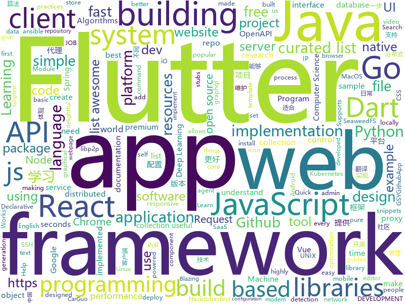

# 2018-10-09
See what the GitHub community is most excited about today.

## python
* [Algorithm_Interview_Notes-Chinese](https://github.com/imhuay/Algorithm_Interview_Notes-Chinese)(**421 stars today**): 2018/2019/校招/春招/秋招/算法/机器学习(Machine Learning)/深度学习(Deep Learning)/自然语言处理(NLP)/C/C++/Python/面试笔记
* [aiortc](https://github.com/jlaine/aiortc)(**300 stars today**): WebRTC and ORTC implementation for Python using asyncio
* [Python](https://github.com/TheAlgorithms/Python)(**165 stars today**): All Algorithms implemented in Python
* [holodeck](https://github.com/BYU-PCCL/holodeck)(**114 stars today**): High Fidelity Simulator for Reinforcement Learning and Robotics Research.
* [talos](https://github.com/autonomio/talos)(**105 stars today**): Hyperparameter Optimization for Keras Models
* [models](https://github.com/tensorflow/models)(**62 stars today**): Models and examples built with TensorFlow
* [awesome-algorithm](https://github.com/apachecn/awesome-algorithm)(**71 stars today**): Leetcode 题解 (跟随思路一步一步撸出代码) 及经典算法实现
* [system-design-primer](https://github.com/donnemartin/system-design-primer)(**67 stars today**): Learn how to design large-scale systems. Prep for the system design interview. Includes Anki flashcards.
* [rests](https://github.com/peter-woyzbun/rests)(**58 stars today**): 
* [fashion-mnist](https://github.com/zalandoresearch/fashion-mnist)(**51 stars today**): A MNIST-like fashion product database. Benchmark👉
* [Atlas](https://github.com/m4ll0k/Atlas)(**46 stars today**): Quick SQLMap Tamper Suggester
* [youtube-dl](https://github.com/rg3/youtube-dl)(**47 stars today**): Command-line program to download videos from YouTube.com and other video sites
* [ansible](https://github.com/ansible/ansible)(**41 stars today**): Ansible is a radically simple IT automation platform that makes your applications and systems easier to deploy. Avoid writing scripts or custom code to deploy and update your applications — automate in a language that approaches plain English, using SSH, with no agents to install on remote systems. https://docs.ansible.com/ansible/
* [keras](https://github.com/keras-team/keras)(**36 stars today**): Deep Learning for humans
* [Shellab](https://github.com/TheSecondSun/Shellab)(**41 stars today**): Linux and Windows shellcode enrichment utility
* [arviz](https://github.com/arviz-devs/arviz)(**44 stars today**): Python package to plot and analyse samples from probabilistic models
* [cpython](https://github.com/python/cpython)(**29 stars today**): The Python programming language
* [face_recognition](https://github.com/ageitgey/face_recognition)(**38 stars today**): The world's simplest facial recognition api for Python and the command line
* [Detectron](https://github.com/facebookresearch/Detectron)(**39 stars today**): FAIR's research platform for object detection research, implementing popular algorithms like Mask R-CNN and RetinaNet.
* [awesome-python](https://github.com/vinta/awesome-python)(**37 stars today**): A curated list of awesome Python frameworks, libraries, software and resources
* [openlibrary](https://github.com/internetarchive/openlibrary)(**38 stars today**): One webpage for every book ever published!
* [SILENTTRINITY](https://github.com/byt3bl33d3r/SILENTTRINITY)(**36 stars today**): A post-exploitation agent powered by Python, IronPython, C#/.NET
* [30-seconds-of-python-code](https://github.com/kriadmin/30-seconds-of-python-code)(**34 stars today**): Python implementation of 30-seconds-of-code
* [mlcourse.ai](https://github.com/Yorko/mlcourse.ai)(**24 stars today**): Open Machine Learning course mlcourse.ai, both in English and Russian
* [sshuttle](https://github.com/sshuttle/sshuttle)(**37 stars today**): Transparent proxy server that works as a poor man's VPN. Forwards over ssh. Doesn't require admin. Works with Linux and MacOS. Supports DNS tunneling.

## java
* [brigadier](https://github.com/Mojang/brigadier)(**456 stars today**): Brigadier is a command parser & dispatcher, designed and developed for Minecraft: Java Edition.
* [interviews](https://github.com/kdn251/interviews)(**269 stars today**): Everything you need to know to get the job.
* [JavaGuide](https://github.com/Snailclimb/JavaGuide)(**203 stars today**): 【Java学习+面试指南】 一份涵盖大部分Java程序员所需要掌握的核心知识。
* [DataFixerUpper](https://github.com/Mojang/DataFixerUpper)(**187 stars today**): A set of utilities designed for incremental building, merging and optimization of data transformations.
* [Hello-world](https://github.com/Hacktoberfest-2018/Hello-world)(**99 stars today**): Add any Program in any language you like or add a hello world Program❣️if you like give us⭐️
* [symphony](https://github.com/b3log/symphony)(**113 stars today**): 🎶一款用 Java 实现的现代化社区（论坛/BBS/社交网络/博客）平台。https://hacpai.com
* [island](https://github.com/oasisfeng/island)(**122 stars today**): Island for Android
* [proxyee-down](https://github.com/proxyee-down-org/proxyee-down)(**89 stars today**): http下载工具，基于http代理，支持多连接分块下载
* [MyTikTok](https://github.com/whenSunSet/MyTikTok)(**69 stars today**): 我的抖音APP
* [bifurcan](https://github.com/lacuna/bifurcan)(**66 stars today**): impure functional data structures
* [proxy-pool](https://github.com/chenerzhu/proxy-pool)(**64 stars today**): java代理IP池 Proxy Pool，提供可用率达到95%以上的代理IP。
* [apollo](https://github.com/ctripcorp/apollo)(**56 stars today**): Apollo（阿波罗）是携程框架部门研发的分布式配置中心，能够集中化管理应用不同环境、不同集群的配置，配置修改后能够实时推送到应用端，并且具备规范的权限、流程治理等特性，适用于微服务配置管理场景。
* [elasticsearch](https://github.com/elastic/elasticsearch)(**52 stars today**): Open Source, Distributed, RESTful Search Engine
* [arthas](https://github.com/alibaba/arthas)(**51 stars today**): Alibaba Java Diagnostic Tool Arthas/Alibaba Java诊断利器Arthas
* [ballerina-lang](https://github.com/ballerina-platform/ballerina-lang)(**55 stars today**): Ballerina is a compiled, transactional, statically and strongly typed programming language with textual and graphical syntaxes.
* [xxl-job](https://github.com/xuxueli/xxl-job)(**49 stars today**): A lightweight distributed task scheduling framework.（分布式任务调度平台XXL-JOB）
* [java-design-patterns](https://github.com/iluwatar/java-design-patterns)(**41 stars today**): Design patterns implemented in Java
* [Pixiv-Illustration-Collection](https://github.com/OysterQAQ/Pixiv-Illustration-Collection)(**49 stars today**): 一个提供有限的pixiv日排行与高级会员搜索的站点
* [spring-boot](https://github.com/spring-projects/spring-boot)(**39 stars today**): Spring Boot
* [tutorials](https://github.com/eugenp/tutorials)(**26 stars today**): The "REST With Spring" Course:
* [Java](https://github.com/TheAlgorithms/Java)(**29 stars today**): All Algorithms implemented in Java
* [incubator-dubbo](https://github.com/apache/incubator-dubbo)(**25 stars today**): Apache Dubbo (incubating) is a high-performance, java based, open source RPC framework.
* [okhttp](https://github.com/square/okhttp)(**27 stars today**): An HTTP+HTTP/2 client for Android and Java applications.
* [spring-framework](https://github.com/spring-projects/spring-framework)(**22 stars today**): Spring Framework
* [guava](https://github.com/google/guava)(**26 stars today**): Google core libraries for Java

## unknown
* [CS-Notes](https://github.com/CyC2018/CS-Notes)(**209 stars today**): 📚Computer Science Learning Notes
* [quick-SQL-cheatsheet](https://github.com/enochtangg/quick-SQL-cheatsheet)(**214 stars today**): A quick reminder of all SQL queries and examples on how to use them.
* [first-contributions](https://github.com/firstcontributions/first-contributions)(**84 stars today**): 🚀✨Help beginners to contribute to open source projects
* [developer-roadmap](https://github.com/kamranahmedse/developer-roadmap)(**130 stars today**): Roadmap to becoming a web developer in 2018
* [awesome](https://github.com/sindresorhus/awesome)(**93 stars today**): 😎Curated list of awesome lists
* [home](https://github.com/dwyl/home)(**83 stars today**): 🏡👩‍💻💡home is where you can [learn to] build the future surrounded by like-minded creative, friendly and [intrinsically] motivated people focussed on health, fitness and making things people and the world need!
* [gitignore](https://github.com/github/gitignore)(**50 stars today**): A collection of useful .gitignore templates
* [coding-interview-university](https://github.com/jwasham/coding-interview-university)(**56 stars today**): A complete computer science study plan to become a software engineer.
* [free-programming-books](https://github.com/EbookFoundation/free-programming-books)(**47 stars today**): 📚Freely available programming books
* [nodebestpractices](https://github.com/i0natan/nodebestpractices)(**51 stars today**): The largest Node.JS best practices list (October 2018)
* [awesome-vue](https://github.com/vuejs/awesome-vue)(**50 stars today**): 🎉A curated list of awesome things related to Vue.js
* [chinese-independent-developer](https://github.com/1c7/chinese-independent-developer)(**48 stars today**): 👩🏿‍💻👨🏾‍💻👩🏼‍💻👨🏽‍💻👩🏻‍💻中国独立开发者项目列表 -- 分享大家都在做什么
* [Awesome-UNIX](https://github.com/sirredbeard/Awesome-UNIX)(**43 stars today**): All the UNIX and UNIX-Like: Linux, BSD, macOS, Illumos, 9front, and more.
* [project-based-learning](https://github.com/tuvtran/project-based-learning)(**39 stars today**): Curated list of project-based tutorials
* [stanford-cs-229-machine-learning](https://github.com/afshinea/stanford-cs-229-machine-learning)(**38 stars today**): VIP cheatsheets for Stanford's CS 229 Machine Learning
* [specs](https://github.com/libp2p/specs)(**40 stars today**): Technical specifications for the libp2p networking stack
* [pwc](https://github.com/zziz/pwc)(**39 stars today**): Papers with code. Sorted by stars. Updated weekly.
* [AndroidOfferKiller](https://github.com/Blankj/AndroidOfferKiller)(**39 stars today**): 💪Help you get a better offer.
* [Make-a-Pull-Request](https://github.com/rishabh-bansal/Make-a-Pull-Request)(**13 stars today**): Make a Pull Request
* [awesome-nodejs](https://github.com/sindresorhus/awesome-nodejs)(**38 stars today**): ⚡️Delightful Node.js packages and resources
* [gold-miner](https://github.com/xitu/gold-miner)(**35 stars today**): 🥇掘金翻译计划，可能是世界最大最好的英译中技术社区，最懂读者和译者的翻译平台：
* [computer-science](https://github.com/ossu/computer-science)(**35 stars today**): 🎓Path to a free self-taught education in Computer Science!
* [build-your-own-x](https://github.com/danistefanovic/build-your-own-x)(**33 stars today**): 🤓Build your own (insert technology here)
* [deep_learning_object_detection](https://github.com/hoya012/deep_learning_object_detection)(**25 stars today**): A paper list of object detection using deep learning.
* [free-for-dev](https://github.com/ripienaar/free-for-dev)(**30 stars today**): A list of SaaS, PaaS and IaaS offerings that have free tiers of interest to devops and infradev

## javascript
* [awesome-vscode](https://github.com/viatsko/awesome-vscode)(**704 stars today**): 🎨A curated list of delightful VS Code packages and resources.
* [30-seconds-of-code](https://github.com/30-seconds/30-seconds-of-code)(**419 stars today**): Curated collection of useful JavaScript snippets that you can understand in 30 seconds or less.
* [graphql-engine](https://github.com/hasura/graphql-engine)(**151 stars today**): Blazing fast, instant realtime GraphQL APIs on Postgres with fine grained access control, also trigger webhooks on database events.
* [ekill](https://github.com/rhardih/ekill)(**148 stars today**): Chrome extension to nuke annoying elements in a web page
* [vue](https://github.com/vuejs/vue)(**113 stars today**): 🖖A progressive, incrementally-adoptable JavaScript framework for building UI on the web.
* [tiptap](https://github.com/heyscrumpy/tiptap)(**126 stars today**): A rich-text editor for Vue.js
* [md-page](https://github.com/oscarmorrison/md-page)(**120 stars today**): 📝create a webpage with just markdown
* [create-react-app](https://github.com/facebook/create-react-app)(**98 stars today**): Create React apps with no build configuration.
* [trigonoparty](https://github.com/ramesaliyev/trigonoparty)(**106 stars today**): Simple Trigonometry Visualisation with Pure JavaScript.
* [You-Dont-Need-Momentjs](https://github.com/you-dont-need/You-Dont-Need-Momentjs)(**104 stars today**): List of date-fns or native functions which you can use to replace moment.js + ESLint Plugin
* [react](https://github.com/facebook/react)(**78 stars today**): A declarative, efficient, and flexible JavaScript library for building user interfaces.
* [next.js](https://github.com/zeit/next.js)(**81 stars today**): The React Framework
* [puppeteer](https://github.com/GoogleChrome/puppeteer)(**74 stars today**): Headless Chrome Node API
* [awesome-mac](https://github.com/jaywcjlove/awesome-mac)(**71 stars today**):  Now we have become very big, Different from the original idea. Collect premium software in various categories.
* [lvovich](https://github.com/nodkz/lvovich)(**66 stars today**): Склонение названий городов, определения пола по ФИО, склонения имен по падежам
* [react-native](https://github.com/facebook/react-native)(**58 stars today**): A framework for building native apps with React.
* [husky](https://github.com/typicode/husky)(**62 stars today**): 🐶Git hooks made easy
* [axios](https://github.com/axios/axios)(**61 stars today**): Promise based HTTP client for the browser and node.js
* [guide](https://github.com/freeCodeCamp/guide)(**20 stars today**): A collection of easy-to-understand guides to programming tools
* [storybook](https://github.com/storybooks/storybook)(**57 stars today**): Interactive UI component dev & test: React, React Native, Vue, Angular
* [gatsby](https://github.com/gatsbyjs/gatsby)(**49 stars today**): Build blazing fast, modern apps and websites with React
* [react-flip-toolkit](https://github.com/aholachek/react-flip-toolkit)(**58 stars today**): A React FLIP animation library for highly configurable transitions
* [material-ui](https://github.com/mui-org/material-ui)(**42 stars today**): React components that implement Google's Material Design.
* [awesome-selfhosted](https://github.com/Kickball/awesome-selfhosted)(**54 stars today**): This is a list of Free Software network services and web applications which can be hosted locally. Selfhosting is the process of locally hosting and managing applications instead of renting from SaaS providers.
* [javascript](https://github.com/airbnb/javascript)(**49 stars today**): JavaScript Style Guide

## html
* [solid](https://github.com/solid/solid)(**131 stars today**): Solid - Re-decentralizing the web (project directory)
* [hacktoberfest](https://github.com/lingonsaft/hacktoberfest)(**25 stars today**): Hacktoberfest 2018. Don't forget to spread love and if you like give us a⭐️
* [30-seconds-of-css](https://github.com/30-seconds/30-seconds-of-css)(**47 stars today**): A curated collection of useful CSS snippets you can understand in 30 seconds or less.
* [Hacktoberfest-2018](https://github.com/abhilashk433/Hacktoberfest-2018)(**13 stars today**): A repository for beginners to create their first Pull Request.
* [mastering-modular-javascript](https://github.com/mjavascript/mastering-modular-javascript)(**36 stars today**): 📦Module thinking, principles, design patterns and best practices.
* [AdminLTE](https://github.com/almasaeed2010/AdminLTE)(**19 stars today**): AdminLTE - Free Premium Admin control Panel Theme Based On Bootstrap 3.x
* [styleguide](https://github.com/google/styleguide)(**19 stars today**): Style guides for Google-originated open-source projects
* [portainer](https://github.com/portainer/portainer)(**18 stars today**): Simple management UI for Docker
* [fastText](https://github.com/facebookresearch/fastText)(**15 stars today**): Library for fast text representation and classification.
* [Spoon-Knife](https://github.com/octocat/Spoon-Knife)(****): This repo is for demonstration purposes only.
* [react-redux](https://github.com/reduxjs/react-redux)(**11 stars today**): Official React bindings for Redux
* [JavaScript30](https://github.com/wesbos/JavaScript30)(**6 stars today**): 30 Day Vanilla JS Challenge
* [swagger-codegen](https://github.com/swagger-api/swagger-codegen)(**11 stars today**): swagger-codegen contains a template-driven engine to generate documentation, API clients and server stubs in different languages by parsing your OpenAPI / Swagger definition.
* [Hacktoberfest](https://github.com/DSC-BVP/Hacktoberfest)(**6 stars today**): 
* [creative-computing-society.github.io](https://github.com/creative-computing-society/creative-computing-society.github.io)(**6 stars today**): This is the Hacktoberfest first contribution website of CCS
* [mxgraph](https://github.com/jgraph/mxgraph)(**9 stars today**): mxGraph is a fully client side JavaScript diagramming library
* [pure](https://github.com/pure-css/pure)(**10 stars today**): A set of small, responsive CSS modules that you can use in every web project.
* [openapi-generator](https://github.com/OpenAPITools/openapi-generator)(**9 stars today**): OpenAPI Generator allows generation of API client libraries (SDK generation), server stubs, documentation and configuration automatically given an OpenAPI Spec (v2, v3)
* [website](https://github.com/kubernetes/website)(**5 stars today**): Kubernetes website and documentation repo:
* [learning-area](https://github.com/mdn/learning-area)(**6 stars today**): Github repo for the MDN Learning Area.
* [simple-icons](https://github.com/simple-icons/simple-icons)(**9 stars today**): SVG icons for popular brands
* [javascript-tutorial-en](https://github.com/iliakan/javascript-tutorial-en)(**6 stars today**): Modern JavaScript Tutorial
* [responsive-html-email-template](https://github.com/leemunroe/responsive-html-email-template)(**6 stars today**): A free simple responsive HTML email template
* [ionicons](https://github.com/ionic-team/ionicons)(**7 stars today**): The premium icon font for Ionic Framework and web apps everywhere
* [awesome-modern-cpp](https://github.com/rigtorp/awesome-modern-cpp)(**7 stars today**): A collection of resources on modern C++

## dart
* [Flutter-Notebook](https://github.com/OpenFlutter/Flutter-Notebook)(**104 stars today**): 日更的FlutterDemo合集，今天你fu了吗
* [flutter](https://github.com/flutter/flutter)(**87 stars today**): Flutter makes it easy and fast to build beautiful mobile apps.
* [awesome-flutter](https://github.com/Solido/awesome-flutter)(**33 stars today**): An awesome list that curates the best Flutter libraries, tools, tutorials, articles and more.
* [Flutter-learning](https://github.com/AweiLoveAndroid/Flutter-learning)(**27 stars today**): 🔥👍🌟⭐️⭐️⭐️Flutter install&settings,Flutter problems when developing,Flutter sample codes& templates,Flutter projects,Dart languages sample codes
* [plugins](https://github.com/flutter/plugins)(**12 stars today**): Plugins for Flutter, including FlutterFire, maintained by the Flutter team
* [flutter_map](https://github.com/apptreesoftware/flutter_map)(**12 stars today**): A Flutter map package based on leaflet
* [sdk](https://github.com/dart-lang/sdk)(**7 stars today**): The Dart SDK, including the VM, dart2js, core libraries, and more.
* [xamarin.flutter](https://github.com/adamped/xamarin.flutter)(****): Running Flutter on Xamarin
* [sentry](https://github.com/flutter/sentry)(****): A pure Dart Sentry.io client.
* [dart-sass](https://github.com/sass/dart-sass)(****): A Dart implementation of Sass.
* [simple_auth](https://github.com/Clancey/simple_auth)(****): The Simplest way to Authenticate in Flutter
* [http](https://github.com/dart-lang/http)(****): A composable API for making HTTP requests in Dart.
* [flutter_crashlytics](https://github.com/kiwi-bop/flutter_crashlytics)(****): 📦Flutter plugin for Crashlytics integration
* [state_experiments](https://github.com/filiph/state_experiments)(****): Companion repository to the "Build reactive mobile apps in Flutter" talk
* [cnoder](https://github.com/ali322/cnoder)(****): Yet another CNode Flutter App
* [hn_app](https://github.com/filiph/hn_app)(****): The HN reader app developed live on The Boring Flutter Development Show
* [chromedeveditor](https://github.com/googlearchive/chromedeveditor)(****): Chrome Dev Editor is a developer tool for building apps on the Chrome platform - Chrome Apps and Web Apps, in JavaScript or Dart. (NO LONGER IN ACTIVE DEVELOPMENT)
* [GSYGithubAppFlutter](https://github.com/CarGuo/GSYGithubAppFlutter)(****): 超完整的Flutter项目，功能丰富，适合学习和日常使用。GSYGithubApp系列的优势：我们目前已经拥有Flutter、Weex、ReactNative三个版本。 功能齐全，项目框架内技术涉及面广，完成度高，持续维护，配套文章，适合全面学习，跨框架对比参考。跨平台的开源Github客户端App，更好的体验，更丰富的功能，旨在更好的日常管理和维护个人Github，提供更好更方便的驾车体验～～Σ(￣。￣ﾉ)ﾉ。同款Weex版本 ： https://github.com/CarGuo/GSYGithubAppWeex 、同款React Native版本 ： https://github.com/CarGuo/GSYGithubApp
* [flutter-osc](https://github.com/yubo725/flutter-osc)(****): 基于Google Flutter的开源中国客户端，支持Android和iOS。
* [flutter-examples](https://github.com/nisrulz/flutter-examples)(****): [Examples] Simple basic isolated apps, for budding flutter devs.
* [Flutter-UI-Kit](https://github.com/iampawan/Flutter-UI-Kit)(****): Flutter app for collection of UI in a UIKit
* [FlutterExampleApps](https://github.com/iampawan/FlutterExampleApps)(****): [Example APPS] Basic Flutter apps, for flutter devs.
* [flutter_architecture_samples](https://github.com/brianegan/flutter_architecture_samples)(****): TodoMVC for Flutter
* [inKino](https://github.com/roughike/inKino)(****): inKino - A cross platform movie and showtime browser for Finnkino cinemas, made with Flutter.
* [dio](https://github.com/flutterchina/dio)(****): A powerful Http client for Dart, which supports Interceptors, FormData, Request Cancellation, File Downloading, Timeout etc.

## go
* [ferret](https://github.com/MontFerret/ferret)(**245 stars today**): Declarative web scraping
* [sourcegraph](https://github.com/sourcegraph/sourcegraph)(**220 stars today**): Code search and intelligence, self-hosted and scalable
* [weave](https://github.com/iov-one/weave)(**114 stars today**): Easy-to-use framework to build Tendermint ABCI applications
* [kubespy](https://github.com/pulumi/kubespy)(**68 stars today**): Tools for observing Kubernetes resources in real time, powered by Pulumi.
* [aws-service-operator](https://github.com/awslabs/aws-service-operator)(**66 stars today**): AWS Service Operator allows you to create AWS resources using kubectl.
* [go-libp2p](https://github.com/libp2p/go-libp2p)(**65 stars today**): libp2p implementation in Go
* [clash](https://github.com/Dreamacro/clash)(**60 stars today**): A rule based proxy in Go.
* [roadrunner](https://github.com/spiral/roadrunner)(**52 stars today**): High-performance PHP application server, load-balancer and process manager written in Golang
* [kubernetes](https://github.com/kubernetes/kubernetes)(**46 stars today**): Production-Grade Container Scheduling and Management
* [go-under-the-hood](https://github.com/changkun/go-under-the-hood)(**47 stars today**): Go 源码研究 (1.11.1, WIP)
* [go](https://github.com/golang/go)(**36 stars today**): The Go programming language
* [gi](https://github.com/goki/gi)(**39 stars today**): Native Go (golang) Graphical Interface system (2D and 3D), built on GoKi tree framework
* [hugo](https://github.com/gohugoio/hugo)(**34 stars today**): The world’s fastest framework for building websites.
* [awesome-go](https://github.com/avelino/awesome-go)(**34 stars today**): A curated list of awesome Go frameworks, libraries and software
* [go-ethereum](https://github.com/ethereum/go-ethereum)(**28 stars today**): Official Go implementation of the Ethereum protocol
* [thunder](https://github.com/samsarahq/thunder)(**33 stars today**): ⚡️A Go framework for rapidly building powerful graphql services
* [gin](https://github.com/gin-gonic/gin)(**28 stars today**): Gin is a HTTP web framework written in Go (Golang). It features a Martini-like API with much better performance -- up to 40 times faster. If you need smashing performance, get yourself some Gin.
* [v2ray-core](https://github.com/v2ray/v2ray-core)(**27 stars today**): A platform for building proxies to bypass network restrictions.
* [go-ipfs](https://github.com/ipfs/go-ipfs)(**28 stars today**): IPFS implementation in Go
* [syncthing](https://github.com/syncthing/syncthing)(**27 stars today**): Open Source Continuous File Synchronization
* [prometheus](https://github.com/prometheus/prometheus)(**25 stars today**): The Prometheus monitoring system and time series database.
* [istio](https://github.com/istio/istio)(**24 stars today**): Connect, secure, control, and observe services.
* [seaweedfs](https://github.com/chrislusf/seaweedfs)(**24 stars today**): SeaweedFS is a simple and highly scalable distributed file system. There are two objectives: to store billions of files! to serve the files fast! SeaweedFS implements an object store with O(1) disk seek, and an optional Filer with POSIX interface.
* [delve](https://github.com/derekparker/delve)(**24 stars today**): Delve is a debugger for the Go programming language.
* [terraform](https://github.com/hashicorp/terraform)(**22 stars today**): Terraform is a tool for building, changing, and combining infrastructure safely and efficiently.

## WordCloud

