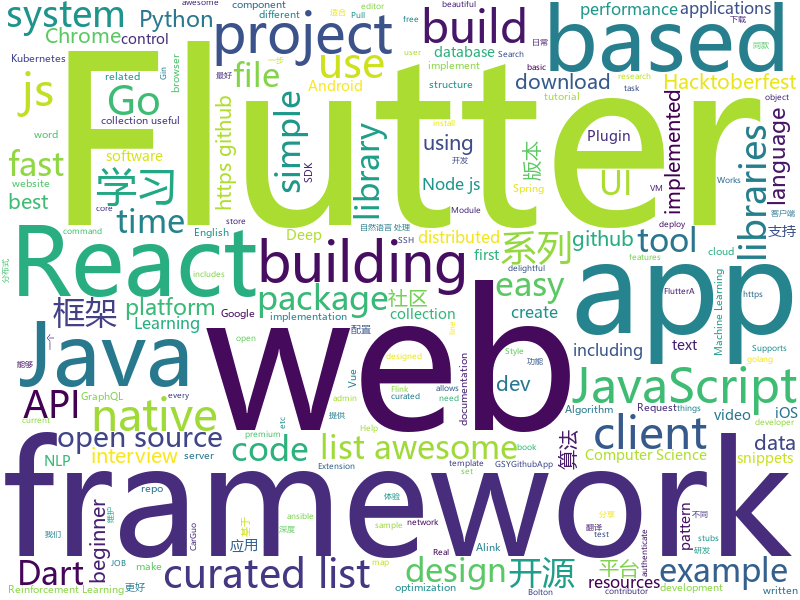

# 2018-10-10
See what the GitHub community is most excited about today.

## python
* [Algorithm_Interview_Notes-Chinese](https://github.com/imhuay/Algorithm_Interview_Notes-Chinese)(**367 stars today**): 2018/2019/校招/春招/秋招/算法/机器学习(Machine Learning)/深度学习(Deep Learning)/自然语言处理(NLP)/C/C++/Python/面试笔记
* [aiortc](https://github.com/jlaine/aiortc)(**200 stars today**): WebRTC and ORTC implementation for Python using asyncio
* [Python](https://github.com/TheAlgorithms/Python)(**185 stars today**): All Algorithms implemented in Python
* [awesome-algorithm](https://github.com/apachecn/awesome-algorithm)(**98 stars today**): Leetcode 题解 (跟随思路一步一步撸出代码) 及经典算法实现
* [boltons](https://github.com/mahmoud/boltons)(**102 stars today**): 🔩Like builtins, but boltons. Constructs/recipes/snippets that would be handy in the standard library. Nothing like Michael Bolton.
* [system-design-primer](https://github.com/donnemartin/system-design-primer)(**93 stars today**): Learn how to design large-scale systems. Prep for the system design interview. Includes Anki flashcards.
* [models](https://github.com/tensorflow/models)(**78 stars today**): Models and examples built with TensorFlow
* [light-weight-refinenet](https://github.com/DrSleep/light-weight-refinenet)(**74 stars today**): Light-Weight RefineNet for Real-Time Semantic Segmentation
* [Hacktoberfest](https://github.com/Showndarya/Hacktoberfest)(**18 stars today**): A collection of words!⭐️it if you👍it !
* [keras](https://github.com/keras-team/keras)(**52 stars today**): Deep Learning for humans
* [awesome-python](https://github.com/vinta/awesome-python)(**57 stars today**): A curated list of awesome Python frameworks, libraries, software and resources
* [SLM-Lab](https://github.com/kengz/SLM-Lab)(**53 stars today**): Modular Deep Reinforcement Learning framework in PyTorch.
* [AiLearning](https://github.com/apachecn/AiLearning)(**49 stars today**): AiLearning: 机器学习 - MachineLearning - ML、深度学习 - DeepLearning - DL、自然语言处理 NLP
* [public-apis](https://github.com/toddmotto/public-apis)(**51 stars today**): A collective list of public JSON APIs for use in web development.
* [talos](https://github.com/autonomio/talos)(**48 stars today**): Hyperparameter Optimization for Keras Models
* [youtube-dl](https://github.com/rg3/youtube-dl)(**44 stars today**): Command-line program to download videos from YouTube.com and other video sites
* [face_recognition](https://github.com/ageitgey/face_recognition)(**40 stars today**): The world's simplest facial recognition api for Python and the command line
* [english-words](https://github.com/dwyl/english-words)(**45 stars today**): 📝A text file containing 479k English words for all your dictionary/word-based projects e.g: auto-completion / autosuggestion
* [holodeck](https://github.com/BYU-PCCL/holodeck)(**45 stars today**): High Fidelity Simulator for Reinforcement Learning and Robotics Research.
* [django](https://github.com/django/django)(**32 stars today**): The Web framework for perfectionists with deadlines.
* [sshuttle](https://github.com/sshuttle/sshuttle)(**39 stars today**): Transparent proxy server that works as a poor man's VPN. Forwards over ssh. Doesn't require admin. Works with Linux and MacOS. Supports DNS tunneling.
* [openlibrary](https://github.com/internetarchive/openlibrary)(**38 stars today**): One webpage for every book ever published!
* [flask](https://github.com/pallets/flask)(**37 stars today**): The Python micro framework for building web applications.
* [mlcourse.ai](https://github.com/Yorko/mlcourse.ai)(**24 stars today**): Open Machine Learning course mlcourse.ai, both in English and Russian
* [ansible](https://github.com/ansible/ansible)(**27 stars today**): Ansible is a radically simple IT automation platform that makes your applications and systems easier to deploy. Avoid writing scripts or custom code to deploy and update your applications — automate in a language that approaches plain English, using SSH, with no agents to install on remote systems. https://docs.ansible.com/ansible/

## java
* [brigadier](https://github.com/Mojang/brigadier)(**261 stars today**): Brigadier is a command parser & dispatcher, designed and developed for Minecraft: Java Edition.
* [JavaGuide](https://github.com/Snailclimb/JavaGuide)(**248 stars today**): 【Java学习+面试指南】 一份涵盖大部分Java程序员所需要掌握的核心知识。
* [interviews](https://github.com/kdn251/interviews)(**253 stars today**): Everything you need to know to get the job.
* [symphony](https://github.com/b3log/symphony)(**123 stars today**): 🎶一款用 Java 实现的现代化社区（论坛/BBS/社交网络/博客）平台。https://hacpai.com
* [DataFixerUpper](https://github.com/Mojang/DataFixerUpper)(**124 stars today**): A set of utilities designed for incremental building, merging and optimization of data transformations.
* [MyTikTok](https://github.com/whenSunSet/MyTikTok)(**114 stars today**): 我的抖音APP
* [bifurcan](https://github.com/lacuna/bifurcan)(**111 stars today**): impure functional data structures
* [arthas](https://github.com/alibaba/arthas)(**77 stars today**): Alibaba Java Diagnostic Tool Arthas/Alibaba Java诊断利器Arthas
* [proxyee-down](https://github.com/proxyee-down-org/proxyee-down)(**68 stars today**): http下载工具，基于http代理，支持多连接分块下载
* [elasticsearch](https://github.com/elastic/elasticsearch)(**65 stars today**): Open Source, Distributed, RESTful Search Engine
* [java-design-patterns](https://github.com/iluwatar/java-design-patterns)(**54 stars today**): Design patterns implemented in Java
* [Java](https://github.com/TheAlgorithms/Java)(**37 stars today**): All Algorithms implemented in Java
* [Alink](https://github.com/alibaba/Alink)(**38 stars today**): Alink为我们独立研发的基于Flink的算法平台，希望能通过开源的方式，回馈社区，影响和带动Flink社区在AI方面的发展。现在开放Alink框架及几个有代表性的Alink算法功能，目的是与集团外的同行进行交流和讨论，收集意见和建议，改进Alink的设计，为后续开源作准备。
* [incubator-dubbo](https://github.com/apache/incubator-dubbo)(**37 stars today**): Apache Dubbo (incubating) is a high-performance, java based, open source RPC framework.
* [spring-boot](https://github.com/spring-projects/spring-boot)(**32 stars today**): Spring Boot
* [tutorials](https://github.com/eugenp/tutorials)(**24 stars today**): The "REST With Spring" Course:
* [spring-framework](https://github.com/spring-projects/spring-framework)(**23 stars today**): Spring Framework
* [guava](https://github.com/google/guava)(**31 stars today**): Google core libraries for Java
* [xxl-job](https://github.com/xuxueli/xxl-job)(**25 stars today**): A lightweight distributed task scheduling framework.（分布式任务调度平台XXL-JOB）
* [apollo](https://github.com/ctripcorp/apollo)(**24 stars today**): Apollo（阿波罗）是携程框架部门研发的分布式配置中心，能够集中化管理应用不同环境、不同集群的配置，配置修改后能够实时推送到应用端，并且具备规范的权限、流程治理等特性，适用于微服务配置管理场景。
* [okhttp](https://github.com/square/okhttp)(**26 stars today**): An HTTP+HTTP/2 client for Android and Java applications.
* [Pixiv-Illustration-Collection](https://github.com/OysterQAQ/Pixiv-Illustration-Collection)(**26 stars today**): 一个提供有限的pixiv日排行与高级会员搜索的站点
* [RxJava](https://github.com/ReactiveX/RxJava)(**23 stars today**): RxJava – Reactive Extensions for the JVM – a library for composing asynchronous and event-based programs using observable sequences for the Java VM.
* [pacbot](https://github.com/tmobile/pacbot)(**22 stars today**): PacBot (Policy as Code Bot)
* [zxing](https://github.com/zxing/zxing)(**23 stars today**): ZXing ("Zebra Crossing") barcode scanning library for Java, Android

## unknown
* [developer-roadmap](https://github.com/kamranahmedse/developer-roadmap)(**237 stars today**): Roadmap to becoming a web developer in 2018
* [CS-Notes](https://github.com/CyC2018/CS-Notes)(**161 stars today**): 📚Computer Science Learning Notes
* [first-contributions](https://github.com/firstcontributions/first-contributions)(**68 stars today**): 🚀✨Help beginners to contribute to open source projects
* [quick-SQL-cheatsheet](https://github.com/enochtangg/quick-SQL-cheatsheet)(**148 stars today**): A quick reminder of all SQL queries and examples on how to use them.
* [gitignore](https://github.com/github/gitignore)(**74 stars today**): A collection of useful .gitignore templates
* [CS-Interview-Knowledge-Map](https://github.com/InterviewMap/CS-Interview-Knowledge-Map)(**74 stars today**): Build the best interview map. The current content includes JS, network, browser related, performance optimization, security, framework, Git, data structure, algorithm, etc.
* [coding-interview-university](https://github.com/jwasham/coding-interview-university)(**67 stars today**): A complete computer science study plan to become a software engineer.
* [awesome](https://github.com/sindresorhus/awesome)(**74 stars today**): 😎Curated list of awesome lists
* [Blog](https://github.com/mqyqingfeng/Blog)(**60 stars today**): 冴羽写博客的地方，预计写四个系列：JavaScript深入系列、JavaScript专题系列、ES6系列、React系列。
* [awesome-vue](https://github.com/vuejs/awesome-vue)(**58 stars today**): 🎉A curated list of awesome things related to Vue.js
* [free-programming-books](https://github.com/EbookFoundation/free-programming-books)(**51 stars today**): 📚Freely available programming books
* [computer-science](https://github.com/ossu/computer-science)(**49 stars today**): 🎓Path to a free self-taught education in Computer Science!
* [project-based-learning](https://github.com/tuvtran/project-based-learning)(**40 stars today**): Curated list of project-based tutorials
* [build-your-own-x](https://github.com/danistefanovic/build-your-own-x)(**36 stars today**): 🤓Build your own (insert technology here)
* [gold-miner](https://github.com/xitu/gold-miner)(**33 stars today**): 🥇掘金翻译计划，可能是世界最大最好的英译中技术社区，最懂读者和译者的翻译平台：
* [awesome-for-beginners](https://github.com/MunGell/awesome-for-beginners)(**34 stars today**): A list of awesome beginners-friendly projects.
* [Awesome-Game-Networking](https://github.com/MFatihMAR/Awesome-Game-Networking)(**34 stars today**): Curated list of resources about game networking
* [nodebestpractices](https://github.com/i0natan/nodebestpractices)(**32 stars today**): The largest Node.JS best practices list (October 2018)
* [stanford-cs-229-machine-learning](https://github.com/afshinea/stanford-cs-229-machine-learning)(**27 stars today**): VIP cheatsheets for Stanford's CS 229 Machine Learning
* [AndroidOfferKiller](https://github.com/Blankj/AndroidOfferKiller)(**30 stars today**): 💪Help you get a better offer.
* [softs](https://github.com/ldqk/softs)(**21 stars today**): 互联网上仅存的稀缺资源，不收取任何费用，仅用于个人研究和使用，发扬互联网分享精神，专注收藏与分享。
* [awesome-react](https://github.com/enaqx/awesome-react)(**26 stars today**): A collection of awesome things regarding React ecosystem.
* [awesome-nodejs](https://github.com/sindresorhus/awesome-nodejs)(**26 stars today**): ⚡️Delightful Node.js packages and resources
* [CTFTools](https://github.com/Harmoc/CTFTools)(**27 stars today**): Personal CTF Toolkit
* [Front-end-Developer-Interview-Questions](https://github.com/h5bp/Front-end-Developer-Interview-Questions)(**24 stars today**): A list of helpful front-end related questions you can use to interview potential candidates, test yourself or completely ignore.

## javascript
* [awesome-vscode](https://github.com/viatsko/awesome-vscode)(**796 stars today**): 🎨A curated list of delightful VS Code packages and resources.
* [30-seconds-of-code](https://github.com/30-seconds/30-seconds-of-code)(**376 stars today**): Curated collection of useful JavaScript snippets that you can understand in 30 seconds or less.
* [tiptap](https://github.com/heyscrumpy/tiptap)(**232 stars today**): A rich-text editor for Vue.js
* [vue](https://github.com/vuejs/vue)(**145 stars today**): 🖖A progressive, incrementally-adoptable JavaScript framework for building UI on the web.
* [penrose](https://github.com/penrose/penrose)(**149 stars today**): a language-based platform for creating beautiful mathematical diagrams
* [graphql-engine](https://github.com/hasura/graphql-engine)(**131 stars today**): Blazing fast, instant realtime GraphQL APIs on Postgres with fine grained access control, also trigger webhooks on database events.
* [react](https://github.com/facebook/react)(**98 stars today**): A declarative, efficient, and flexible JavaScript library for building user interfaces.
* [create-react-app](https://github.com/facebook/create-react-app)(**83 stars today**): Create React apps with no build configuration.
* [gatsby](https://github.com/gatsbyjs/gatsby)(**74 stars today**): Build blazing fast, modern apps and websites with React
* [awesome-mac](https://github.com/jaywcjlove/awesome-mac)(**77 stars today**):  Now we have become very big, Different from the original idea. Collect premium software in various categories.
* [puppeteer](https://github.com/GoogleChrome/puppeteer)(**74 stars today**): Headless Chrome Node API
* [react-native](https://github.com/facebook/react-native)(**68 stars today**): A framework for building native apps with React.
* [axios](https://github.com/axios/axios)(**70 stars today**): Promise based HTTP client for the browser and node.js
* [next.js](https://github.com/zeit/next.js)(**64 stars today**): The React Framework
* [javascript-algorithms](https://github.com/trekhleb/javascript-algorithms)(**59 stars today**): Algorithms and data structures implemented in JavaScript with explanations and links to further readings
* [ekill](https://github.com/rhardih/ekill)(**61 stars today**): Chrome extension to nuke annoying elements in a web page
* [javascript](https://github.com/airbnb/javascript)(**52 stars today**): JavaScript Style Guide
* [You-Dont-Need-Momentjs](https://github.com/you-dont-need/You-Dont-Need-Momentjs)(**55 stars today**): List of date-fns or native functions which you can use to replace moment.js + ESLint Plugin
* [jslib-base](https://github.com/yanhaijing/jslib-base)(**49 stars today**): 最好用的js第三方库脚手架，赋能js第三方库开源，让开发一个js库更简单，更专业
* [md-page](https://github.com/oscarmorrison/md-page)(**51 stars today**): 📝create a webpage with just markdown
* [material-ui](https://github.com/mui-org/material-ui)(**46 stars today**): React components that implement Google's Material Design.
* [node](https://github.com/nodejs/node)(**44 stars today**): Node.js JavaScript runtime✨🐢🚀✨
* [taro](https://github.com/NervJS/taro)(**45 stars today**): 多端统一开发框架，支持用 React 的开发方式编写一次代码，生成能运行在微信小程序、H5、React Native 等的应用。
* [storybook](https://github.com/storybooks/storybook)(**47 stars today**): Interactive UI component dev & test: React, React Native, Vue, Angular
* [landscape](https://github.com/cncf/landscape)(**46 stars today**): Static Cloud Native Landscapes and Interactive Landscape that filters and sorts hundreds of cloud native projects and products, and shows details including GitHub stars, funding or market cap, first and last commits, contributor counts, headquarters location, and recent tweets.

## html
* [hacktoberfest](https://github.com/lingonsaft/hacktoberfest)(**33 stars today**): Hacktoberfest 2018. Don't forget to spread love and if you like give us a⭐️
* [solid](https://github.com/solid/solid)(**64 stars today**): Solid - Re-decentralizing the web (project directory)
* [Hacktoberfest-Census](https://github.com/Cutwell/Hacktoberfest-Census)(**7 stars today**): A census of those participating in Hacktoberfest (and an easy PR!)
* [hacktoberfest](https://github.com/AliceWonderland/hacktoberfest)(**6 stars today**): Participate in Hacktoberfest by contributing to any Open Source project on GitHub! Here is a starter project for first time contributors. #hacktoberfest
* [mastering-modular-javascript](https://github.com/mjavascript/mastering-modular-javascript)(**47 stars today**): 📦Module thinking, principles, design patterns and best practices.
* [30-seconds-of-css](https://github.com/30-seconds/30-seconds-of-css)(**42 stars today**): A curated collection of useful CSS snippets you can understand in 30 seconds or less.
* [Hacktoberfest-2018](https://github.com/abhilashk433/Hacktoberfest-2018)(**12 stars today**): A repository for beginners to create their first Pull Request.
* [styleguide](https://github.com/google/styleguide)(**18 stars today**): Style guides for Google-originated open-source projects
* [JavaScript30](https://github.com/wesbos/JavaScript30)(**14 stars today**): 30 Day Vanilla JS Challenge
* [fastText](https://github.com/facebookresearch/fastText)(**19 stars today**): Library for fast text representation and classification.
* [node-interview](https://github.com/ElemeFE/node-interview)(**15 stars today**): How to pass the Node.js interview of ElemeFE.
* [Hacktoberfest-Sign-In](https://github.com/Nguyen17/Hacktoberfest-Sign-In)(****): Beginner friendly. Easy Pull Request! .
* [Spoon-Knife](https://github.com/octocat/Spoon-Knife)(****): This repo is for demonstration purposes only.
* [NLP-progress](https://github.com/sebastianruder/NLP-progress)(**15 stars today**): Repository to track the progress in Natural Language Processing (NLP), including the datasets and the current state-of-the-art for the most common NLP tasks.
* [AdminLTE](https://github.com/almasaeed2010/AdminLTE)(**13 stars today**): AdminLTE - Free Premium Admin control Panel Theme Based On Bootstrap 3.x
* [learning-area](https://github.com/mdn/learning-area)(**7 stars today**): Github repo for the MDN Learning Area.
* [qiubaiying.github.io](https://github.com/qiubaiying/qiubaiying.github.io)(**6 stars today**): BY Blog ->
* [react-redux](https://github.com/reduxjs/react-redux)(**14 stars today**): Official React bindings for Redux
* [swagger-codegen](https://github.com/swagger-api/swagger-codegen)(**13 stars today**): swagger-codegen contains a template-driven engine to generate documentation, API clients and server stubs in different languages by parsing your OpenAPI / Swagger definition.
* [pure](https://github.com/pure-css/pure)(**13 stars today**): A set of small, responsive CSS modules that you can use in every web project.
* [website](https://github.com/kubernetes/website)(**7 stars today**): Kubernetes website and documentation repo:
* [baselines](https://github.com/openai/baselines)(**11 stars today**): OpenAI Baselines: high-quality implementations of reinforcement learning algorithms
* [mxgraph](https://github.com/jgraph/mxgraph)(**11 stars today**): mxGraph is a fully client side JavaScript diagramming library
* [openapi-generator](https://github.com/OpenAPITools/openapi-generator)(**11 stars today**): OpenAPI Generator allows generation of API client libraries (SDK generation), server stubs, documentation and configuration automatically given an OpenAPI Spec (v2, v3)
* [portainer](https://github.com/portainer/portainer)(**10 stars today**): Simple management UI for Docker

## dart
* [flutter](https://github.com/flutter/flutter)(**81 stars today**): Flutter makes it easy and fast to build beautiful mobile apps.
* [Flutter-Notebook](https://github.com/OpenFlutter/Flutter-Notebook)(**49 stars today**): 日更的FlutterDemo合集，今天你fu了吗
* [awesome-flutter](https://github.com/Solido/awesome-flutter)(**32 stars today**): An awesome list that curates the best Flutter libraries, tools, tutorials, articles and more.
* [bloc](https://github.com/felangel/bloc)(**18 stars today**): The goal of this package is to make it easy to implement the BLoC Design Pattern (Business Logic Component).
* [plugins](https://github.com/flutter/plugins)(**12 stars today**): Plugins for Flutter, including FlutterFire, maintained by the Flutter team
* [Flutter-learning](https://github.com/AweiLoveAndroid/Flutter-learning)(**10 stars today**): 🔥👍🌟⭐️⭐️⭐️Flutter install&settings,Flutter problems when developing,Flutter sample codes& templates,Flutter projects,Dart languages sample codes
* [flutter_study](https://github.com/luhenchang/flutter_study)(**8 stars today**): 三天学会Flutter
* [flutter_architecture_samples](https://github.com/brianegan/flutter_architecture_samples)(**7 stars today**): TodoMVC for Flutter
* [flutter_map](https://github.com/apptreesoftware/flutter_map)(**7 stars today**): A Flutter map package based on leaflet
* [sdk](https://github.com/dart-lang/sdk)(**7 stars today**): The Dart SDK, including the VM, dart2js, core libraries, and more.
* [graphql-flutter](https://github.com/zino-app/graphql-flutter)(**5 stars today**): A GraphQL client for Flutter, bringing all the features from a modern GraphQL client to one easy to use package.
* [flutter_markdown](https://github.com/flutter/flutter_markdown)(****): A markdown renderer for Flutter.
* [simple_auth](https://github.com/Clancey/simple_auth)(****): The Simplest way to Authenticate in Flutter
* [ParsingJSON-Flutter](https://github.com/PoojaB26/ParsingJSON-Flutter)(****): Experimenting with 6 examples of different types of simple and complex JSON structures in Flutter
* [flutter_facebook_login](https://github.com/roughike/flutter_facebook_login)(****): A Flutter plugin for allowing users to authenticate with native Android & iOS Facebook login SDKs.
* [chromedeveditor](https://github.com/googlearchive/chromedeveditor)(****): Chrome Dev Editor is a developer tool for building apps on the Chrome platform - Chrome Apps and Web Apps, in JavaScript or Dart. (NO LONGER IN ACTIVE DEVELOPMENT)
* [GSYGithubAppFlutter](https://github.com/CarGuo/GSYGithubAppFlutter)(****): 超完整的Flutter项目，功能丰富，适合学习和日常使用。GSYGithubApp系列的优势：我们目前已经拥有Flutter、Weex、ReactNative三个版本。 功能齐全，项目框架内技术涉及面广，完成度高，持续维护，配套文章，适合全面学习，跨框架对比参考。跨平台的开源Github客户端App，更好的体验，更丰富的功能，旨在更好的日常管理和维护个人Github，提供更好更方便的驾车体验～～Σ(￣。￣ﾉ)ﾉ。同款Weex版本 ： https://github.com/CarGuo/GSYGithubAppWeex 、同款React Native版本 ： https://github.com/CarGuo/GSYGithubApp
* [flutter-osc](https://github.com/yubo725/flutter-osc)(****): 基于Google Flutter的开源中国客户端，支持Android和iOS。
* [flutter-examples](https://github.com/nisrulz/flutter-examples)(****): [Examples] Simple basic isolated apps, for budding flutter devs.
* [Flutter-UI-Kit](https://github.com/iampawan/Flutter-UI-Kit)(****): Flutter app for collection of UI in a UIKit
* [FlutterExampleApps](https://github.com/iampawan/FlutterExampleApps)(****): [Example APPS] Basic Flutter apps, for flutter devs.
* [inKino](https://github.com/roughike/inKino)(****): inKino - A cross platform movie and showtime browser for Finnkino cinemas, made with Flutter.
* [dio](https://github.com/flutterchina/dio)(****): A powerful Http client for Dart, which supports Interceptors, FormData, Request Cancellation, File Downloading, Timeout etc.
* [hauberk](https://github.com/munificent/hauberk)(****): A web-based roguelike written in Dart.
* [zhihu-flutter](https://github.com/HackSoul/zhihu-flutter)(****): Flutter 高仿知乎 UI，非常漂亮，也非常流畅，flutter build apk 或 flutter build ios 之后更流畅

## go
* [biscuit](https://github.com/mit-pdos/biscuit)(**237 stars today**): Biscuit research OS
* [ferret](https://github.com/MontFerret/ferret)(**157 stars today**): Declarative web scraping
* [sourcegraph](https://github.com/sourcegraph/sourcegraph)(**150 stars today**): Code search and intelligence, self-hosted and scalable
* [go-under-the-hood](https://github.com/changkun/go-under-the-hood)(**100 stars today**): Go 源码研究 (1.11.1, WIP)
* [kubernetes](https://github.com/kubernetes/kubernetes)(**50 stars today**): Production-Grade Container Scheduling and Management
* [go-mega](https://github.com/bonfy/go-mega)(**57 stars today**): ✨🤟✨Go-Mega Tutorial for Go Web Develop
* [go](https://github.com/golang/go)(**55 stars today**): The Go programming language
* [weave](https://github.com/iov-one/weave)(**51 stars today**): Easy-to-use framework to build Tendermint ABCI applications
* [go-astiencoder](https://github.com/asticode/go-astiencoder)(**47 stars today**): Open source video encoder written in GO and based on ffmpeg C bindings
* [hugo](https://github.com/gohugoio/hugo)(**44 stars today**): The world’s fastest framework for building websites.
* [lantern](https://github.com/getlantern/lantern)(**43 stars today**): 🔴蓝灯最新版本下载 https://github.com/getlantern/download🔴Lantern Latest Download https://github.com/getlantern/download🔴
* [prometheus](https://github.com/prometheus/prometheus)(**40 stars today**): The Prometheus monitoring system and time series database.
* [build-web-application-with-golang](https://github.com/astaxie/build-web-application-with-golang)(**39 stars today**): A golang ebook intro how to build a web with golang
* [awesome-go](https://github.com/avelino/awesome-go)(**38 stars today**): A curated list of awesome Go frameworks, libraries and software
* [seaweedfs](https://github.com/chrislusf/seaweedfs)(**38 stars today**): SeaweedFS is a simple and highly scalable distributed file system. There are two objectives: to store billions of files! to serve the files fast! SeaweedFS implements an object store with O(1) disk seek, and an optional Filer with POSIX interface.
* [terraform](https://github.com/hashicorp/terraform)(**37 stars today**): Terraform is a tool for building, changing, and combining infrastructure safely and efficiently.
* [gin](https://github.com/gin-gonic/gin)(**37 stars today**): Gin is a HTTP web framework written in Go (Golang). It features a Martini-like API with much better performance -- up to 40 times faster. If you need smashing performance, get yourself some Gin.
* [kube-score](https://github.com/zegl/kube-score)(**36 stars today**): Kubernetes object linting
* [aws-service-operator](https://github.com/awslabs/aws-service-operator)(**34 stars today**): AWS Service Operator allows you to create AWS resources using kubectl.
* [go-ipfs](https://github.com/ipfs/go-ipfs)(**32 stars today**): IPFS implementation in Go
* [kubespy](https://github.com/pulumi/kubespy)(**32 stars today**): Tools for observing Kubernetes resources in real time, powered by Pulumi.
* [go-cloud](https://github.com/google/go-cloud)(**31 stars today**): A library and tools for open cloud development in Go.
* [v2ray-core](https://github.com/v2ray/v2ray-core)(**27 stars today**): A platform for building proxies to bypass network restrictions.
* [tidb](https://github.com/pingcap/tidb)(**27 stars today**): TiDB is a distributed HTAP database compatible with the MySQL protocol
* [istio](https://github.com/istio/istio)(**25 stars today**): Connect, secure, control, and observe services.

## WordCloud

