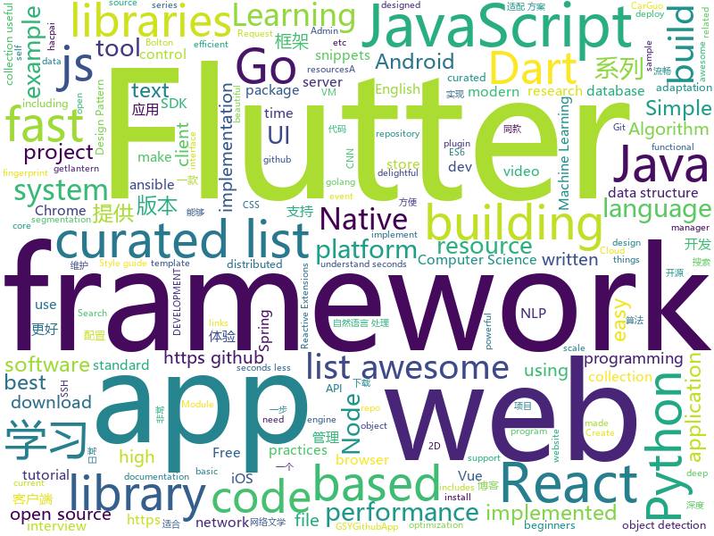

# 2018-10-11
See what the GitHub community is most excited about today.

## python
* [boltons](https://github.com/mahmoud/boltons)(**710 stars today**): 🔩Like builtins, but boltons. Constructs/recipes/snippets that would be handy in the standard library. Nothing like Michael Bolton.
* [Algorithm_Interview_Notes-Chinese](https://github.com/imhuay/Algorithm_Interview_Notes-Chinese)(**321 stars today**): 2018/2019/校招/春招/秋招/算法/机器学习(Machine Learning)/深度学习(Deep Learning)/自然语言处理(NLP)/C/C++/Python/面试笔记
* [Python](https://github.com/TheAlgorithms/Python)(**149 stars today**): All Algorithms implemented in Python
* [awesome-algorithm](https://github.com/apachecn/awesome-algorithm)(**91 stars today**): Leetcode 题解 (跟随思路一步一步撸出代码) 及经典算法实现
* [models](https://github.com/tensorflow/models)(**69 stars today**): Models and examples built with TensorFlow
* [system-design-primer](https://github.com/donnemartin/system-design-primer)(**67 stars today**): Learn how to design large-scale systems. Prep for the system design interview. Includes Anki flashcards.
* [responder](https://github.com/kennethreitz/responder)(**60 stars today**): a Sorta Familar HTTP Framework for Python (prototype)
* [light-weight-refinenet](https://github.com/DrSleep/light-weight-refinenet)(**56 stars today**): Light-Weight RefineNet for Real-Time Semantic Segmentation
* [toolz](https://github.com/pytoolz/toolz)(**54 stars today**): A functional standard library for Python.
* [Hacktoberfest](https://github.com/Showndarya/Hacktoberfest)(**18 stars today**): A collection of words!⭐️it if you👍it !
* [awesome-python](https://github.com/vinta/awesome-python)(**43 stars today**): A curated list of awesome Python frameworks, libraries, software and resources
* [awesome-machine-learning](https://github.com/josephmisiti/awesome-machine-learning)(**43 stars today**): A curated list of awesome Machine Learning frameworks, libraries and software.
* [aiortc](https://github.com/jlaine/aiortc)(**45 stars today**): WebRTC and ORTC implementation for Python using asyncio
* [youtube-dl](https://github.com/rg3/youtube-dl)(**42 stars today**): Command-line program to download videos from YouTube.com and other video sites
* [flask](https://github.com/pallets/flask)(**41 stars today**): The Python micro framework for building web applications.
* [AiLearning](https://github.com/apachecn/AiLearning)(**38 stars today**): AiLearning: 机器学习 - MachineLearning - ML、深度学习 - DeepLearning - DL、自然语言处理 NLP
* [keras](https://github.com/keras-team/keras)(**34 stars today**): Deep Learning for humans
* [Detectron](https://github.com/facebookresearch/Detectron)(**37 stars today**): FAIR's research platform for object detection research, implementing popular algorithms like Mask R-CNN and RetinaNet.
* [ansible](https://github.com/ansible/ansible)(**29 stars today**): Ansible is a radically simple IT automation platform that makes your applications and systems easier to deploy. Avoid writing scripts or custom code to deploy and update your applications — automate in a language that approaches plain English, using SSH, with no agents to install on remote systems. https://docs.ansible.com/ansible/
* [hassh](https://github.com/salesforce/hassh)(**33 stars today**): HASSH is a network fingerprinting standard which can be used to identify specific Client and Server SSH implementations. The fingerprints can be easily stored, searched and shared in the form of a small MD5 fingerprint.
* [mlcourse.ai](https://github.com/Yorko/mlcourse.ai)(**20 stars today**): Open Machine Learning course mlcourse.ai, both in English and Russian
* [Mask_RCNN](https://github.com/matterport/Mask_RCNN)(**26 stars today**): Mask R-CNN for object detection and instance segmentation on Keras and TensorFlow
* [black](https://github.com/ambv/black)(**30 stars today**): The uncompromising Python code formatter
* [cpython](https://github.com/python/cpython)(**23 stars today**): The Python programming language
* [django](https://github.com/django/django)(**22 stars today**): The Web framework for perfectionists with deadlines.

## java
* [JavaGuide](https://github.com/Snailclimb/JavaGuide)(**197 stars today**): 【Java学习+面试指南】 一份涵盖大部分Java程序员所需要掌握的核心知识。
* [interviews](https://github.com/kdn251/interviews)(**168 stars today**): Everything you need to know to get the job.
* [brigadier](https://github.com/Mojang/brigadier)(**126 stars today**): Brigadier is a command parser & dispatcher, designed and developed for Minecraft: Java Edition.
* [symphony](https://github.com/b3log/symphony)(**87 stars today**): 🎶一款用 Java 实现的现代化社区（论坛/BBS/社交网络/博客）平台。https://hacpai.com
* [arthas](https://github.com/alibaba/arthas)(**115 stars today**): Alibaba Java Diagnostic Tool Arthas/Alibaba Java诊断利器Arthas
* [proxyee-down](https://github.com/proxyee-down-org/proxyee-down)(**59 stars today**): http下载工具，基于http代理，支持多连接分块下载
* [AndroidAutoSize](https://github.com/JessYanCoding/AndroidAutoSize)(**59 stars today**): 🔥A low-cost Android screen adaptation solution (今日头条屏幕适配方案终极版，一个极低成本的 Android 屏幕适配方案).
* [spring-boot](https://github.com/spring-projects/spring-boot)(**48 stars today**): Spring Boot
* [MyTikTok](https://github.com/whenSunSet/MyTikTok)(**53 stars today**): 我的抖音APP
* [solo](https://github.com/b3log/solo)(**48 stars today**): 🎸一款小而美的 Java 博客系统。https://hacpai.com/tag/solo
* [Pixiv-Illustration-Collection](https://github.com/OysterQAQ/Pixiv-Illustration-Collection)(**54 stars today**): 一个提供有限的pixiv日排行与免费高级会员搜索的站点
* [pacbot](https://github.com/tmobile/pacbot)(**53 stars today**): PacBot (Policy as Code Bot)
* [java-design-patterns](https://github.com/iluwatar/java-design-patterns)(**47 stars today**): Design patterns implemented in Java
* [elasticsearch](https://github.com/elastic/elasticsearch)(**43 stars today**): Open Source, Distributed, RESTful Search Engine
* [XXPermissions](https://github.com/getActivity/XXPermissions)(**43 stars today**): Android 6.0 permissions adaptation framework
* [DataFixerUpper](https://github.com/Mojang/DataFixerUpper)(**42 stars today**): A set of utilities designed for incremental building, merging and optimization of data transformations.
* [apollo](https://github.com/ctripcorp/apollo)(**37 stars today**): Apollo（阿波罗）是携程框架部门研发的分布式配置中心，能够集中化管理应用不同环境、不同集群的配置，配置修改后能够实时推送到应用端，并且具备规范的权限、流程治理等特性，适用于微服务配置管理场景。
* [tutorials](https://github.com/eugenp/tutorials)(**20 stars today**): The "REST With Spring" Course:
* [spring-framework](https://github.com/spring-projects/spring-framework)(**28 stars today**): Spring Framework
* [guava](https://github.com/google/guava)(**28 stars today**): Google core libraries for Java
* [Java](https://github.com/TheAlgorithms/Java)(**25 stars today**): All Algorithms implemented in Java
* [RxJava](https://github.com/ReactiveX/RxJava)(**26 stars today**): RxJava – Reactive Extensions for the JVM – a library for composing asynchronous and event-based programs using observable sequences for the Java VM.
* [incubator-dubbo](https://github.com/apache/incubator-dubbo)(**20 stars today**): Apache Dubbo (incubating) is a high-performance, java based, open source RPC framework.
* [MyBookshelf](https://github.com/gedoor/MyBookshelf)(**25 stars today**): 阅读是一款提供网络文学搜索的工具，为广大网络文学爱好者提供一种方便、快捷舒适的试读体验。
* [bifurcan](https://github.com/lacuna/bifurcan)(**26 stars today**): impure functional data structures

## unknown
* [awesome-spider](https://github.com/facert/awesome-spider)(**376 stars today**): 爬虫集合
* [web-develop](https://github.com/SFLAQiu/web-develop)(**320 stars today**): 《大话WEB开发》WEB开发相关经验总结分享💌⭐️😘
* [developer-roadmap](https://github.com/kamranahmedse/developer-roadmap)(**198 stars today**): Roadmap to becoming a web developer in 2018
* [quick-SQL-cheatsheet](https://github.com/enochtangg/quick-SQL-cheatsheet)(**161 stars today**): A quick reminder of all SQL queries and examples on how to use them.
* [first-contributions](https://github.com/firstcontributions/first-contributions)(**54 stars today**): 🚀✨Help beginners to contribute to open source projects
* [vuejs-advanced-learning](https://github.com/filrak/vuejs-advanced-learning)(**108 stars today**): A curated list of advanced and/or in-depth learning resources about Vue.js
* [CS-Notes](https://github.com/CyC2018/CS-Notes)(**76 stars today**): 📚Computer Science Learning Notes
* [awesome](https://github.com/sindresorhus/awesome)(**76 stars today**): 😎Curated list of awesome lists
* [gitignore](https://github.com/github/gitignore)(**66 stars today**): A collection of useful .gitignore templates
* [pwc](https://github.com/zziz/pwc)(**56 stars today**): Papers with code. Sorted by stars. Updated weekly.
* [computer-science](https://github.com/ossu/computer-science)(**53 stars today**): 🎓Path to a free self-taught education in Computer Science!
* [free-programming-books](https://github.com/EbookFoundation/free-programming-books)(**47 stars today**): 📚Freely available programming books
* [Blog](https://github.com/mqyqingfeng/Blog)(**49 stars today**): 冴羽写博客的地方，预计写四个系列：JavaScript深入系列、JavaScript专题系列、ES6系列、React系列。
* [coding-interview-university](https://github.com/jwasham/coding-interview-university)(**42 stars today**): A complete computer science study plan to become a software engineer.
* [Behinder](https://github.com/rebeyond/Behinder)(**42 stars today**): “冰蝎”动态二进制加密网站管理客户端
* [awesome-vue](https://github.com/vuejs/awesome-vue)(**41 stars today**): 🎉A curated list of awesome things related to Vue.js
* [CS-Interview-Knowledge-Map](https://github.com/InterviewMap/CS-Interview-Knowledge-Map)(**42 stars today**): Build the best interview map. The current content includes JS, network, browser related, performance optimization, security, framework, Git, data structure, algorithm, etc.
* [project-based-learning](https://github.com/tuvtran/project-based-learning)(**34 stars today**): Curated list of project-based tutorials
* [build-your-own-x](https://github.com/danistefanovic/build-your-own-x)(**31 stars today**): 🤓Build your own (insert technology here)
* [awesome-for-beginners](https://github.com/MunGell/awesome-for-beginners)(**29 stars today**): A list of awesome beginners-friendly projects.
* [awesome-cpp](https://github.com/fffaraz/awesome-cpp)(**29 stars today**): A curated list of awesome C++ (or C) frameworks, libraries, resources, and shiny things. Inspired by awesome-... stuff.
* [awesome-nodejs](https://github.com/sindresorhus/awesome-nodejs)(**26 stars today**): ⚡️Delightful Node.js packages and resources
* [deep_learning_object_detection](https://github.com/hoya012/deep_learning_object_detection)(**24 stars today**): A paper list of object detection using deep learning.
* [nodebestpractices](https://github.com/i0natan/nodebestpractices)(**23 stars today**): The largest Node.JS best practices list (October 2018)
* [react-redux-links](https://github.com/markerikson/react-redux-links)(**19 stars today**): Curated tutorial and resource links I've collected on React, Redux, ES6, and more

## javascript
* [awesome-vscode](https://github.com/viatsko/awesome-vscode)(**497 stars today**): 🎨A curated list of delightful VS Code packages and resources.
* [30-seconds-of-code](https://github.com/30-seconds/30-seconds-of-code)(**288 stars today**): Curated collection of useful JavaScript snippets that you can understand in 30 seconds or less.
* [penrose](https://github.com/penrose/penrose)(**226 stars today**): a language-based platform for creating beautiful mathematical diagrams
* [tiptap](https://github.com/heyscrumpy/tiptap)(**199 stars today**): A rich-text editor for Vue.js
* [flatbush](https://github.com/mourner/flatbush)(**170 stars today**): A very fast static spatial index for 2D points and rectangles in JavaScript
* [vue](https://github.com/vuejs/vue)(**127 stars today**): 🖖A progressive, incrementally-adoptable JavaScript framework for building UI on the web.
* [walt](https://github.com/ballercat/walt)(**103 stars today**): ⚡️Walt is a JavaScript-like syntax for WebAssembly text format⚡️
* [awesome-mac](https://github.com/jaywcjlove/awesome-mac)(**88 stars today**):  Now we have become very big, Different from the original idea. Collect premium software in various categories.
* [react](https://github.com/facebook/react)(**77 stars today**): A declarative, efficient, and flexible JavaScript library for building user interfaces.
* [create-react-app](https://github.com/facebook/create-react-app)(**70 stars today**): Create React apps with no build configuration.
* [javascriptvisualizer](https://github.com/tylermcginnis/javascriptvisualizer)(**77 stars today**): A tool for visualizing Execution Context, Hoisting, Closures, and Scopes in JavaScript.
* [puppeteer](https://github.com/GoogleChrome/puppeteer)(**59 stars today**): Headless Chrome Node API
* [three.js](https://github.com/mrdoob/three.js)(**54 stars today**): JavaScript 3D library.
* [graphql-engine](https://github.com/hasura/graphql-engine)(**55 stars today**): Blazing fast, instant realtime GraphQL APIs on Postgres with fine grained access control, also trigger webhooks on database events.
* [husky](https://github.com/typicode/husky)(**58 stars today**): 🐶Git hooks made easy
* [date-fns](https://github.com/date-fns/date-fns)(**57 stars today**): ⏳Modern JavaScript date utility library⌛️
* [react-native](https://github.com/facebook/react-native)(**52 stars today**): A framework for building native apps with React.
* [axios](https://github.com/axios/axios)(**56 stars today**): Promise based HTTP client for the browser and node.js
* [node](https://github.com/nodejs/node)(**50 stars today**): Node.js JavaScript runtime✨🐢🚀✨
* [next.js](https://github.com/zeit/next.js)(**51 stars today**): The React Framework
* [You-Dont-Need-Momentjs](https://github.com/you-dont-need/You-Dont-Need-Momentjs)(**49 stars today**): List of date-fns or native functions which you can use to replace moment.js + ESLint Plugin
* [javascript-algorithms](https://github.com/trekhleb/javascript-algorithms)(**42 stars today**): Algorithms and data structures implemented in JavaScript with explanations and links to further readings
* [WatermelonDB](https://github.com/Nozbe/WatermelonDB)(**49 stars today**): 🍉Next-gen database for powerful React and React Native apps that scales to 10,000s of records and remains fast⚡️
* [javascript](https://github.com/airbnb/javascript)(**45 stars today**): JavaScript Style Guide
* [taro](https://github.com/NervJS/taro)(**47 stars today**): 多端统一开发框架，支持用 React 的开发方式编写一次代码，生成能运行在微信小程序、H5、React Native 等的应用。

## html
* [hacktoberfest](https://github.com/lingonsaft/hacktoberfest)(**26 stars today**): Hacktoberfest 2018. Don't forget to spread love and if you like give us a⭐️
* [solid](https://github.com/solid/solid)(**47 stars today**): Solid - Re-decentralizing the web (project directory)
* [mastering-modular-javascript](https://github.com/mjavascript/mastering-modular-javascript)(**29 stars today**): 📦Module thinking, principles, design patterns and best practices.
* [fastText](https://github.com/facebookresearch/fastText)(**26 stars today**): Library for fast text representation and classification.
* [30-seconds-of-css](https://github.com/30-seconds/30-seconds-of-css)(**23 stars today**): A curated collection of useful CSS snippets you can understand in 30 seconds or less.
* [styleguide](https://github.com/google/styleguide)(**18 stars today**): Style guides for Google-originated open-source projects
* [JavaScript30](https://github.com/wesbos/JavaScript30)(**15 stars today**): 30 Day Vanilla JS Challenge
* [AdminLTE](https://github.com/almasaeed2010/AdminLTE)(**17 stars today**): AdminLTE - Free Premium Admin control Panel Theme Based On Bootstrap 3.x
* [baselines](https://github.com/openai/baselines)(**16 stars today**): OpenAI Baselines: high-quality implementations of reinforcement learning algorithms
* [Spoon-Knife](https://github.com/octocat/Spoon-Knife)(****): This repo is for demonstration purposes only.
* [portainer](https://github.com/portainer/portainer)(**16 stars today**): Simple management UI for Docker
* [Hacktoberfest-2018](https://github.com/abhilashk433/Hacktoberfest-2018)(**5 stars today**): A repository for beginners to create their first Pull Request.
* [react-redux](https://github.com/reduxjs/react-redux)(**15 stars today**): Official React bindings for Redux
* [WebFundamentals](https://github.com/google/WebFundamentals)(**14 stars today**): Best practices for modern web development
* [salad](https://github.com/domainadaptation/salad)(**14 stars today**): A toolbox for domain adaptation and semi-supervised learning. Contributions welcome.
* [NLP-progress](https://github.com/sebastianruder/NLP-progress)(**11 stars today**): Repository to track the progress in Natural Language Processing (NLP), including the datasets and the current state-of-the-art for the most common NLP tasks.
* [swagger-codegen](https://github.com/swagger-api/swagger-codegen)(**9 stars today**): swagger-codegen contains a template-driven engine to generate documentation, API clients and server stubs in different languages by parsing your OpenAPI / Swagger definition.
* [website](https://github.com/kubernetes/website)(**6 stars today**): Kubernetes website and documentation repo:
* [primeng](https://github.com/primefaces/primeng)(**8 stars today**): UI Components for Angular
* [node-interview](https://github.com/ElemeFE/node-interview)(**10 stars today**): How to pass the Node.js interview of ElemeFE.
* [milligram](https://github.com/milligram/milligram)(**10 stars today**): A minimalist CSS framework.
* [gentelella](https://github.com/puikinsh/gentelella)(**7 stars today**): Free Bootstrap 3 Admin Template
* [blog_os](https://github.com/phil-opp/blog_os)(**9 stars today**): Writing an OS in Rust
* [awesome-modern-cpp](https://github.com/rigtorp/awesome-modern-cpp)(**8 stars today**): A collection of resources on modern C++
* [EIPs](https://github.com/ethereum/EIPs)(**5 stars today**): The Ethereum Improvement Proposal repository

## dart
* [flutter](https://github.com/flutter/flutter)(**107 stars today**): Flutter makes it easy and fast to build beautiful mobile apps.
* [awesome-flutter](https://github.com/Solido/awesome-flutter)(**32 stars today**): An awesome list that curates the best Flutter libraries, tools, tutorials, articles and more.
* [Flutter-Notebook](https://github.com/OpenFlutter/Flutter-Notebook)(**30 stars today**): 日更的FlutterDemo合集，今天你fu了吗
* [plugins](https://github.com/flutter/plugins)(**16 stars today**): Plugins for Flutter, including FlutterFire, maintained by the Flutter team
* [Flutter-learning](https://github.com/AweiLoveAndroid/Flutter-learning)(**13 stars today**): 🔥👍🌟⭐️⭐️⭐️Flutter install&settings,Flutter problems when developing,Flutter sample codes& templates,Flutter projects,Dart languages sample codes
* [bloc](https://github.com/felangel/bloc)(**9 stars today**): The goal of this package is to make it easy to implement the BLoC Design Pattern (Business Logic Component).
* [fluwx](https://github.com/OpenFlutter/fluwx)(**6 stars today**): Flutter版微信SDK.WeChat SDK for flutter.
* [sdk](https://github.com/dart-lang/sdk)(**5 stars today**): The Dart SDK, including the VM, dart2js, core libraries, and more.
* [stereo](https://github.com/2find/stereo)(****): A Flutter plugin for playing music on iOS and Android.
* [flutter_cache_manager](https://github.com/renefloor/flutter_cache_manager)(****): Generic cache manager for flutter
* [chromedeveditor](https://github.com/googlearchive/chromedeveditor)(****): Chrome Dev Editor is a developer tool for building apps on the Chrome platform - Chrome Apps and Web Apps, in JavaScript or Dart. (NO LONGER IN ACTIVE DEVELOPMENT)
* [GSYGithubAppFlutter](https://github.com/CarGuo/GSYGithubAppFlutter)(****): 超完整的Flutter项目，功能丰富，适合学习和日常使用。GSYGithubApp系列的优势：我们目前已经拥有Flutter、Weex、ReactNative三个版本。 功能齐全，项目框架内技术涉及面广，完成度高，持续维护，配套文章，适合全面学习，跨框架对比参考。跨平台的开源Github客户端App，更好的体验，更丰富的功能，旨在更好的日常管理和维护个人Github，提供更好更方便的驾车体验～～Σ(￣。￣ﾉ)ﾉ。同款Weex版本 ： https://github.com/CarGuo/GSYGithubAppWeex 、同款React Native版本 ： https://github.com/CarGuo/GSYGithubApp
* [flutter-osc](https://github.com/yubo725/flutter-osc)(****): 基于Google Flutter的开源中国客户端，支持Android和iOS。
* [flutter-examples](https://github.com/nisrulz/flutter-examples)(****): [Examples] Simple basic isolated apps, for budding flutter devs.
* [Flutter-UI-Kit](https://github.com/iampawan/Flutter-UI-Kit)(****): Flutter app for collection of UI in a UIKit
* [FlutterExampleApps](https://github.com/iampawan/FlutterExampleApps)(****): [Example APPS] Basic Flutter apps, for flutter devs.
* [flutter_architecture_samples](https://github.com/brianegan/flutter_architecture_samples)(****): TodoMVC for Flutter
* [inKino](https://github.com/roughike/inKino)(****): inKino - A cross platform movie and showtime browser for Finnkino cinemas, made with Flutter.
* [dio](https://github.com/flutterchina/dio)(****): A powerful Http client for Dart, which supports Interceptors, FormData, Request Cancellation, File Downloading, Timeout etc.
* [hauberk](https://github.com/munificent/hauberk)(****): A web-based roguelike written in Dart.
* [zhihu-flutter](https://github.com/HackSoul/zhihu-flutter)(****): Flutter 高仿知乎 UI，非常漂亮，也非常流畅，flutter build apk 或 flutter build ios 之后更流畅
* [angular](https://github.com/dart-lang/angular)(****): Fast and productive web framework provided by Dart
* [StageXL](https://github.com/bp74/StageXL)(****): A fast and universal 2D rendering engine for HTML5 and Dart.
* [dart-sass](https://github.com/sass/dart-sass)(****): A Dart implementation of Sass.
* [rxdart](https://github.com/ReactiveX/rxdart)(****): The Reactive Extensions for Dart

## go
* [biscuit](https://github.com/mit-pdos/biscuit)(**252 stars today**): Biscuit research OS
* [ferret](https://github.com/MontFerret/ferret)(**121 stars today**): Declarative web scraping
* [go-cloud](https://github.com/google/go-cloud)(**76 stars today**): A library and tools for open cloud development in Go.
* [sourcegraph](https://github.com/sourcegraph/sourcegraph)(**77 stars today**): Code search and intelligence, self-hosted and scalable
* [go-under-the-hood](https://github.com/changkun/go-under-the-hood)(**65 stars today**): Go 源码研究 (1.11.1, WIP)
* [gse](https://github.com/go-ego/gse)(**55 stars today**): Go efficient text segmentation; support english, chinese, japanese and other. Go 语言高性能分词
* [go](https://github.com/golang/go)(**44 stars today**): The Go programming language
* [kubernetes](https://github.com/kubernetes/kubernetes)(**34 stars today**): Production-Grade Container Scheduling and Management
* [awesome-go](https://github.com/avelino/awesome-go)(**39 stars today**): A curated list of awesome Go frameworks, libraries and software
* [gin](https://github.com/gin-gonic/gin)(**41 stars today**): Gin is a HTTP web framework written in Go (Golang). It features a Martini-like API with much better performance -- up to 40 times faster. If you need smashing performance, get yourself some Gin.
* [hugo](https://github.com/gohugoio/hugo)(**41 stars today**): The world’s fastest framework for building websites.
* [weave](https://github.com/iov-one/weave)(**41 stars today**): Easy-to-use framework to build Tendermint ABCI applications
* [seaweedfs](https://github.com/chrislusf/seaweedfs)(**35 stars today**): SeaweedFS is a simple and highly scalable distributed file system. There are two objectives: to store billions of files! to serve the files fast! SeaweedFS implements an object store with O(1) disk seek, and an optional Filer with POSIX interface.
* [lantern](https://github.com/getlantern/lantern)(**33 stars today**): 🔴蓝灯最新版本下载 https://github.com/getlantern/download🔴Lantern Latest Download https://github.com/getlantern/download🔴
* [build-web-application-with-golang](https://github.com/astaxie/build-web-application-with-golang)(**27 stars today**): A golang ebook intro how to build a web with golang
* [go-astiencoder](https://github.com/asticode/go-astiencoder)(**29 stars today**): Open source video encoder written in GO and based on ffmpeg C bindings
* [v2ray-core](https://github.com/v2ray/v2ray-core)(**26 stars today**): A platform for building proxies to bypass network restrictions.
* [roadrunner](https://github.com/spiral/roadrunner)(**28 stars today**): High-performance PHP application server, load-balancer and process manager written in Golang
* [istio](https://github.com/istio/istio)(**25 stars today**): Connect, secure, control, and observe services.
* [prometheus](https://github.com/prometheus/prometheus)(**25 stars today**): The Prometheus monitoring system and time series database.
* [traefik](https://github.com/containous/traefik)(**27 stars today**): The Cloud Native Edge Router
* [etcd](https://github.com/etcd-io/etcd)(**26 stars today**): Distributed reliable key-value store for the most critical data of a distributed system
* [index](https://github.com/go-modules-by-example/index)(**28 stars today**): Go modules by example is a series of work-along guides
* [kube-score](https://github.com/zegl/kube-score)(**28 stars today**): Kubernetes object linting
* [beego](https://github.com/astaxie/beego)(**26 stars today**): beego is an open-source, high-performance web framework for the Go programming language.

## WordCloud

