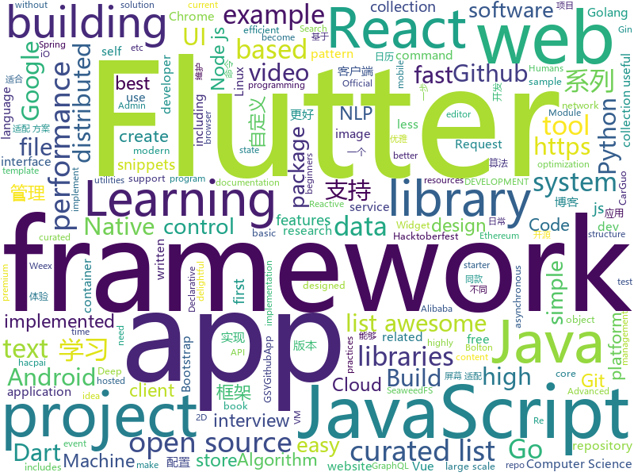

# 2018-10-12
See what the GitHub community is most excited about today.

## python
* [Algorithm_Interview_Notes-Chinese](https://github.com/imhuay/Algorithm_Interview_Notes-Chinese)(**263 stars today**): 2018/2019/校招/春招/秋招/算法/机器学习(Machine Learning)/深度学习(Deep Learning)/自然语言处理(NLP)/C/C++/Python/面试笔记
* [boltons](https://github.com/mahmoud/boltons)(**194 stars today**): 🔩Like builtins, but boltons. Constructs/recipes/snippets that would be handy in the standard library. Nothing like Michael Bolton.
* [Python](https://github.com/TheAlgorithms/Python)(**178 stars today**): All Algorithms implemented in Python
* [self-attention-gan](https://github.com/brain-research/self-attention-gan)(**127 stars today**): 
* [system-design-primer](https://github.com/donnemartin/system-design-primer)(**76 stars today**): Learn how to design large-scale systems. Prep for the system design interview. Includes Anki flashcards.
* [responder](https://github.com/kennethreitz/responder)(**83 stars today**): a familar HTTP Service Framework for Python
* [models](https://github.com/tensorflow/models)(**52 stars today**): Models and examples built with TensorFlow
* [awesome-algorithm](https://github.com/apachecn/awesome-algorithm)(**67 stars today**): Leetcode 题解 (跟随思路一步一步撸出代码) 及经典算法实现
* [sandsifter](https://github.com/Battelle/sandsifter)(**62 stars today**): The x86 processor fuzzer
* [awesome-python](https://github.com/vinta/awesome-python)(**51 stars today**): A curated list of awesome Python frameworks, libraries, software and resources
* [active-qa](https://github.com/google/active-qa)(**53 stars today**): 
* [starlette](https://github.com/encode/starlette)(**47 stars today**): The little ASGI framework that shines.✨
* [youtube-dl](https://github.com/rg3/youtube-dl)(**46 stars today**): Command-line program to download videos from YouTube.com and other video sites
* [learn-python3](https://github.com/jerry-git/learn-python3)(**38 stars today**): Jupyter notebooks for teaching/learning Python 3
* [ASCII-generator](https://github.com/1991viet/ASCII-generator)(**38 stars today**): ASCII generator (image to text, image to image, video to video)
* [Hacktoberfest](https://github.com/Showndarya/Hacktoberfest)(**10 stars today**): A collection of words!⭐️it if you👍it !
* [Detectron](https://github.com/facebookresearch/Detectron)(**34 stars today**): FAIR's research platform for object detection research, implementing popular algorithms like Mask R-CNN and RetinaNet.
* [keras](https://github.com/keras-team/keras)(**26 stars today**): Deep Learning for humans
* [home-assistant](https://github.com/home-assistant/home-assistant)(**27 stars today**): 🏡Open source home automation that puts local control and privacy first
* [awesome-machine-learning](https://github.com/josephmisiti/awesome-machine-learning)(**31 stars today**): A curated list of awesome Machine Learning frameworks, libraries and software.
* [flask](https://github.com/pallets/flask)(**30 stars today**): The Python micro framework for building web applications.
* [openlibrary](https://github.com/internetarchive/openlibrary)(**29 stars today**): One webpage for every book ever published!
* [django](https://github.com/django/django)(**26 stars today**): The Web framework for perfectionists with deadlines.
* [SILENTTRINITY](https://github.com/byt3bl33d3r/SILENTTRINITY)(**29 stars today**): A post-exploitation agent powered by Python, IronPython, C#/.NET
* [requests](https://github.com/requests/requests)(**29 stars today**): Python HTTP Requests for Humans™✨🍰✨

## java
* [interviews](https://github.com/kdn251/interviews)(**462 stars today**): Everything you need to know to get the job.
* [JavaGuide](https://github.com/Snailclimb/JavaGuide)(**338 stars today**): 【Java学习+面试指南】 一份涵盖大部分Java程序员所需要掌握的核心知识。
* [symphony](https://github.com/b3log/symphony)(**104 stars today**): 🎶一款用 Java 实现的现代化社区（论坛/BBS/社交网络/博客）平台。https://hacpai.com
* [pinpoint](https://github.com/naver/pinpoint)(**106 stars today**): Pinpoint is an open source APM (Application Performance Management) tool for large-scale distributed systems written in Java.
* [pacbot](https://github.com/tmobile/pacbot)(**94 stars today**): PacBot (Policy as Code Bot)
* [arthas](https://github.com/alibaba/arthas)(**74 stars today**): Alibaba Java Diagnostic Tool Arthas/Alibaba Java诊断利器Arthas
* [elasticsearch](https://github.com/elastic/elasticsearch)(**59 stars today**): Open Source, Distributed, RESTful Search Engine
* [brigadier](https://github.com/Mojang/brigadier)(**58 stars today**): Brigadier is a command parser & dispatcher, designed and developed for Minecraft: Java Edition.
* [AndroidAutoSize](https://github.com/JessYanCoding/AndroidAutoSize)(**53 stars today**): 🔥A low-cost Android screen adaptation solution (今日头条屏幕适配方案终极版，一个极低成本的 Android 屏幕适配方案).
* [proxyee-down](https://github.com/proxyee-down-org/proxyee-down)(**49 stars today**): http下载工具，基于http代理，支持多连接分块下载
* [solo](https://github.com/b3log/solo)(**45 stars today**): 🎸一款小而美的 Java 博客系统。https://hacpai.com/tag/solo
* [java-design-patterns](https://github.com/iluwatar/java-design-patterns)(**47 stars today**): Design patterns implemented in Java
* [spring-boot](https://github.com/spring-projects/spring-boot)(**39 stars today**): Spring Boot
* [Java](https://github.com/TheAlgorithms/Java)(**37 stars today**): All Algorithms implemented in Java
* [tutorials](https://github.com/eugenp/tutorials)(**20 stars today**): The "REST With Spring" Course:
* [Sentinel](https://github.com/alibaba/Sentinel)(**31 stars today**): A lightweight flow-control library providing high-available protection and monitoring (高可用防护的流量管理框架)
* [CalendarView](https://github.com/huanghaibin-dev/CalendarView)(**30 stars today**): Android上一个优雅、万能自定义UI、支持周视图、自定义周起始、性能高效的日历控件，支持热插拔实现的UI定制！支持标记、自定义颜色、农历、自定义月视图各种显示模式等。Canvas绘制，速度快、占用内存低，你真的想不到日历居然还可以如此优雅！An elegant, highly customized and high-performance Calendar Widget on Android.
* [guava](https://github.com/google/guava)(**28 stars today**): Google core libraries for Java
* [netty](https://github.com/netty/netty)(**28 stars today**): Netty project - an event-driven asynchronous network application framework
* [MyTikTok](https://github.com/whenSunSet/MyTikTok)(**29 stars today**): 我的抖音APP
* [apollo](https://github.com/ctripcorp/apollo)(**24 stars today**): Apollo（阿波罗）是携程框架部门研发的分布式配置中心，能够集中化管理应用不同环境、不同集群的配置，配置修改后能够实时推送到应用端，并且具备规范的权限、流程治理等特性，适用于微服务配置管理场景。
* [incubator-dubbo](https://github.com/apache/incubator-dubbo)(**21 stars today**): Apache Dubbo (incubating) is a high-performance, java based, open source RPC framework.
* [DataFixerUpper](https://github.com/Mojang/DataFixerUpper)(**27 stars today**): A set of utilities designed for incremental building, merging and optimization of data transformations.
* [spring-framework](https://github.com/spring-projects/spring-framework)(**21 stars today**): Spring Framework
* [RxJava](https://github.com/ReactiveX/RxJava)(**24 stars today**): RxJava – Reactive Extensions for the JVM – a library for composing asynchronous and event-based programs using observable sequences for the Java VM.

## unknown
* [awesome-spider](https://github.com/facert/awesome-spider)(**427 stars today**): 爬虫集合
* [developer-roadmap](https://github.com/kamranahmedse/developer-roadmap)(**199 stars today**): Roadmap to becoming a web developer in 2018
* [web-develop](https://github.com/SFLAQiu/web-develop)(**172 stars today**): 《大话WEB开发》WEB开发相关经验总结分享💌⭐️😘
* [quick-SQL-cheatsheet](https://github.com/enochtangg/quick-SQL-cheatsheet)(**138 stars today**): A quick reminder of all SQL queries and examples on how to use them.
* [first-contributions](https://github.com/firstcontributions/first-contributions)(**64 stars today**): 🚀✨Help beginners to contribute to open source projects
* [CS-Notes](https://github.com/CyC2018/CS-Notes)(**79 stars today**): 📚Computer Science Learning Notes
* [awesome](https://github.com/sindresorhus/awesome)(**79 stars today**): 😎Curated list of awesome lists
* [gitignore](https://github.com/github/gitignore)(**64 stars today**): A collection of useful .gitignore templates
* [awesome-project-ideas](https://github.com/NirantK/awesome-project-ideas)(**69 stars today**): Curated list of Machine Learning, NLP, Vision, Recommender Systems Project Ideas
* [computer-science](https://github.com/ossu/computer-science)(**68 stars today**): 🎓Path to a free self-taught education in Computer Science!
* [free-programming-books](https://github.com/EbookFoundation/free-programming-books)(**54 stars today**): 📚Freely available programming books
* [awesome-vue](https://github.com/vuejs/awesome-vue)(**51 stars today**): 🎉A curated list of awesome things related to Vue.js
* [pwc](https://github.com/zziz/pwc)(**47 stars today**): Papers with code. Sorted by stars. Updated weekly.
* [stanford-cs-229-machine-learning](https://github.com/afshinea/stanford-cs-229-machine-learning)(**45 stars today**): VIP cheatsheets for Stanford's CS 229 Machine Learning
* [vuejs-advanced-learning](https://github.com/filrak/vuejs-advanced-learning)(**46 stars today**): A curated list of advanced and/or in-depth learning resources about Vue.js
* [Behinder](https://github.com/rebeyond/Behinder)(**43 stars today**): “冰蝎”动态二进制加密网站管理客户端
* [coding-interview-university](https://github.com/jwasham/coding-interview-university)(**37 stars today**): A complete computer science study plan to become a software engineer.
* [Blog](https://github.com/mqyqingfeng/Blog)(**38 stars today**): 冴羽写博客的地方，预计写四个系列：JavaScript深入系列、JavaScript专题系列、ES6系列、React系列。
* [kubernetes-the-hard-way](https://github.com/kelseyhightower/kubernetes-the-hard-way)(**30 stars today**): Bootstrap Kubernetes the hard way on Google Cloud Platform. No scripts.
* [awesome-nodejs](https://github.com/sindresorhus/awesome-nodejs)(**30 stars today**): ⚡️Delightful Node.js packages and resources
* [free-for-dev](https://github.com/ripienaar/free-for-dev)(**30 stars today**): A list of SaaS, PaaS and IaaS offerings that have free tiers of interest to devops and infradev
* [build-your-own-x](https://github.com/danistefanovic/build-your-own-x)(**28 stars today**): 🤓Build your own (insert technology here)
* [nodebestpractices](https://github.com/i0natan/nodebestpractices)(**27 stars today**): The largest Node.JS best practices list (October 2018)
* [CS-Interview-Knowledge-Map](https://github.com/InterviewMap/CS-Interview-Knowledge-Map)(**24 stars today**): Build the best interview map. The current content includes JS, network, browser related, performance optimization, security, framework, Git, data structure, algorithm, etc.
* [Front-end-Developer-Interview-Questions](https://github.com/h5bp/Front-end-Developer-Interview-Questions)(**25 stars today**): A list of helpful front-end related questions you can use to interview potential candidates, test yourself or completely ignore.

## javascript
* [walt](https://github.com/ballercat/walt)(**879 stars today**): ⚡️Walt is a JavaScript-like syntax for WebAssembly text format⚡️
* [awesome-vscode](https://github.com/viatsko/awesome-vscode)(**292 stars today**): 🎨A curated list of delightful VS Code packages and resources.
* [30-seconds-of-code](https://github.com/30-seconds/30-seconds-of-code)(**233 stars today**): Curated collection of useful JavaScript snippets that you can understand in 30 seconds or less.
* [muze](https://github.com/chartshq/muze)(**210 stars today**): Composable data visualisation library for web with a data-first approach
* [tiptap](https://github.com/heyscrumpy/tiptap)(**169 stars today**): A rich-text editor for Vue.js
* [flatbush](https://github.com/mourner/flatbush)(**130 stars today**): A very fast static spatial index for 2D points and rectangles in JavaScript
* [vue](https://github.com/vuejs/vue)(**104 stars today**): 🖖A progressive, incrementally-adoptable JavaScript framework for building UI on the web.
* [billboard.js](https://github.com/naver/billboard.js)(**120 stars today**): 📊Re-usable, easy interface JavaScript chart library based on D3 v4+📈
* [Advanced-React](https://github.com/wesbos/Advanced-React)(**106 stars today**): Starter Files and Solutions for Full Stack Advanced React and GraphQL
* [react-native-testing-library](https://github.com/callstack/react-native-testing-library)(**109 stars today**): Simple React Native testing utilities helping you write better tests with less effort
* [react](https://github.com/facebook/react)(**73 stars today**): A declarative, efficient, and flexible JavaScript library for building user interfaces.
* [create-react-app](https://github.com/facebook/create-react-app)(**70 stars today**): Create React apps with no build configuration.
* [Google-Drive-Electron](https://github.com/alexkim205/Google-Drive-Electron)(**69 stars today**): A simple Electron Wrapper that converts Google Drive into a desktop office suite app.
* [node](https://github.com/nodejs/node)(**45 stars today**): Node.js JavaScript runtime✨🐢🚀✨
* [javascript](https://github.com/airbnb/javascript)(**59 stars today**): JavaScript Style Guide
* [puppeteer](https://github.com/GoogleChrome/puppeteer)(**62 stars today**): Headless Chrome Node API
* [react-native](https://github.com/facebook/react-native)(**53 stars today**): A framework for building native apps with React.
* [awesome-mac](https://github.com/jaywcjlove/awesome-mac)(**57 stars today**):  Now we have become very big, Different from the original idea. Collect premium software in various categories.
* [next.js](https://github.com/zeit/next.js)(**48 stars today**): The React Framework
* [javascript-algorithms](https://github.com/trekhleb/javascript-algorithms)(**45 stars today**): Algorithms and data structures implemented in JavaScript with explanations and links to further readings
* [gatsby](https://github.com/gatsbyjs/gatsby)(**40 stars today**): Build blazing fast, modern apps and websites with React
* [javascriptvisualizer](https://github.com/tylermcginnis/javascriptvisualizer)(**43 stars today**): A tool for visualizing Execution Context, Hoisting, Closures, and Scopes in JavaScript.
* [awesome-wechat-weapp](https://github.com/justjavac/awesome-wechat-weapp)(**40 stars today**): 微信小程序开发资源汇总💯
* [three.js](https://github.com/mrdoob/three.js)(**38 stars today**): JavaScript 3D library.
* [unstated](https://github.com/jamiebuilds/unstated)(**42 stars today**): State so simple, it goes without saying

## html
* [solid](https://github.com/solid/solid)(**69 stars today**): Solid - Re-decentralizing the web (project directory)
* [hacktoberfest](https://github.com/lingonsaft/hacktoberfest)(**22 stars today**): Hacktoberfest 2018. Don't forget to spread love and if you like give us a⭐️
* [linux-command](https://github.com/jaywcjlove/linux-command)(**56 stars today**): Linux命令大全搜索工具，内容包含Linux命令手册、详解、学习、搜集。https://git.io/linux
* [hacktoberfest](https://github.com/AliceWonderland/hacktoberfest)(**6 stars today**): Participate in Hacktoberfest by contributing to any Open Source project on GitHub! Here is a starter project for first time contributors. #hacktoberfest
* [styleguide](https://github.com/google/styleguide)(**25 stars today**): Style guides for Google-originated open-source projects
* [JavaScript30](https://github.com/wesbos/JavaScript30)(**13 stars today**): 30 Day Vanilla JS Challenge
* [AdminLTE](https://github.com/almasaeed2010/AdminLTE)(**22 stars today**): AdminLTE - Free Premium Admin control Panel Theme Based On Bootstrap 3.x
* [portainer](https://github.com/portainer/portainer)(**20 stars today**): Simple management UI for Docker
* [Hacktoberfest-2018](https://github.com/abhilashk433/Hacktoberfest-2018)(**8 stars today**): A repository for beginners to create their first Pull Request.
* [30-seconds-of-css](https://github.com/30-seconds/30-seconds-of-css)(**19 stars today**): A curated collection of useful CSS snippets you can understand in 30 seconds or less.
* [baselines](https://github.com/openai/baselines)(**17 stars today**): OpenAI Baselines: high-quality implementations of reinforcement learning algorithms
* [Spoon-Knife](https://github.com/octocat/Spoon-Knife)(****): This repo is for demonstration purposes only.
* [react-redux](https://github.com/reduxjs/react-redux)(**15 stars today**): Official React bindings for Redux
* [fastText](https://github.com/facebookresearch/fastText)(**12 stars today**): Library for fast text representation and classification.
* [mastering-modular-javascript](https://github.com/mjavascript/mastering-modular-javascript)(**14 stars today**): 📦Module thinking, principles, design patterns and best practices.
* [react-app-rewired](https://github.com/timarney/react-app-rewired)(**12 stars today**): Override create-react-app webpack configs without ejecting
* [gentelella](https://github.com/puikinsh/gentelella)(**9 stars today**): Free Bootstrap 3 Admin Template
* [EIPs](https://github.com/ethereum/EIPs)(**8 stars today**): The Ethereum Improvement Proposal repository
* [website](https://github.com/kubernetes/website)(**7 stars today**): Kubernetes website and documentation repo:
* [ecma262](https://github.com/tc39/ecma262)(**9 stars today**): Status, process, and documents for ECMA262
* [sketch-measure](https://github.com/utom/sketch-measure)(**8 stars today**): Make it a fun to create spec for developers and teammates
* [swagger-codegen](https://github.com/swagger-api/swagger-codegen)(**5 stars today**): swagger-codegen contains a template-driven engine to generate documentation, API clients and server stubs in different languages by parsing your OpenAPI / Swagger definition.
* [node-interview](https://github.com/ElemeFE/node-interview)(**8 stars today**): How to pass the Node.js interview of ElemeFE.
* [patchwork](https://github.com/jlord/patchwork)(****): All the Git-it Workshop completers!
* [NLP-progress](https://github.com/sebastianruder/NLP-progress)(**7 stars today**): Repository to track the progress in Natural Language Processing (NLP), including the datasets and the current state-of-the-art for the most common NLP tasks.

## dart
* [flutter](https://github.com/flutter/flutter)(**74 stars today**): Flutter makes it easy and fast to build beautiful mobile apps.
* [awesome-flutter](https://github.com/Solido/awesome-flutter)(**27 stars today**): An awesome list that curates the best Flutter libraries, tools, tutorials, articles and more.
* [Flutter-Notebook](https://github.com/OpenFlutter/Flutter-Notebook)(**20 stars today**): 日更的FlutterDemo合集，今天你fu了吗
* [plugins](https://github.com/flutter/plugins)(**11 stars today**): Plugins for Flutter, including FlutterFire, maintained by the Flutter team
* [flutter_architecture_samples](https://github.com/brianegan/flutter_architecture_samples)(**6 stars today**): TodoMVC for Flutter
* [bloc](https://github.com/felangel/bloc)(**6 stars today**): The goal of this package is to make it easy to implement the BLoC Design Pattern (Business Logic Component).
* [flutter_study](https://github.com/luhenchang/flutter_study)(**5 stars today**): 三天学会Flutter
* [Flutter-learning](https://github.com/AweiLoveAndroid/Flutter-learning)(**5 stars today**): 🔥👍🌟⭐️⭐️⭐️Flutter install&settings,Flutter problems when developing,Flutter sample codes& templates,Flutter projects,Dart languages sample codes
* [sdk](https://github.com/dart-lang/sdk)(**5 stars today**): The Dart SDK, including the VM, dart2js, core libraries, and more.
* [state_experiments](https://github.com/filiph/state_experiments)(**5 stars today**): Companion repository to the "Build reactive mobile apps in Flutter" talk
* [auto_size_text](https://github.com/leisim/auto_size_text)(**5 stars today**): Flutter widget that automatically resizes text to fit perfectly within its bounds.
* [samples](https://github.com/flutter/samples)(****): A collection of Flutter examples and demos.
* [graphql-flutter](https://github.com/zino-app/graphql-flutter)(****): A GraphQL client for Flutter, bringing all the features from a modern GraphQL client to one easy to use package.
* [flutter_markdown](https://github.com/flutter/flutter_markdown)(****): A markdown renderer for Flutter.
* [website](https://github.com/flutter/website)(****): Flutter web site
* [chewie](https://github.com/brianegan/chewie)(****): The video player for Flutter with a heart of gold
* [chromedeveditor](https://github.com/googlearchive/chromedeveditor)(****): Chrome Dev Editor is a developer tool for building apps on the Chrome platform - Chrome Apps and Web Apps, in JavaScript or Dart. (NO LONGER IN ACTIVE DEVELOPMENT)
* [GSYGithubAppFlutter](https://github.com/CarGuo/GSYGithubAppFlutter)(****): 超完整的Flutter项目，功能丰富，适合学习和日常使用。GSYGithubApp系列的优势：我们目前已经拥有Flutter、Weex、ReactNative三个版本。 功能齐全，项目框架内技术涉及面广，完成度高，持续维护，配套文章，适合全面学习，跨框架对比参考。跨平台的开源Github客户端App，更好的体验，更丰富的功能，旨在更好的日常管理和维护个人Github，提供更好更方便的驾车体验～～Σ(￣。￣ﾉ)ﾉ。同款Weex版本 ： https://github.com/CarGuo/GSYGithubAppWeex 、同款React Native版本 ： https://github.com/CarGuo/GSYGithubApp
* [flutter-osc](https://github.com/yubo725/flutter-osc)(****): 基于Google Flutter的开源中国客户端，支持Android和iOS。
* [flutter-examples](https://github.com/nisrulz/flutter-examples)(****): [Examples] Simple basic isolated apps, for budding flutter devs.
* [Flutter-UI-Kit](https://github.com/iampawan/Flutter-UI-Kit)(****): Flutter app for collection of UI in a UIKit
* [FlutterExampleApps](https://github.com/iampawan/FlutterExampleApps)(****): [Example APPS] Basic Flutter apps, for flutter devs.
* [inKino](https://github.com/roughike/inKino)(****): inKino - A cross platform movie and showtime browser for Finnkino cinemas, made with Flutter.
* [dio](https://github.com/flutterchina/dio)(****): A powerful Http client for Dart, which supports Interceptors, FormData, Request Cancellation, File Downloading, Timeout etc.
* [hauberk](https://github.com/munificent/hauberk)(****): A web-based roguelike written in Dart.

## go
* [ferret](https://github.com/MontFerret/ferret)(**200 stars today**): Declarative web scraping
* [biscuit](https://github.com/mit-pdos/biscuit)(**77 stars today**): Biscuit research OS
* [mercure](https://github.com/dunglas/mercure)(**77 stars today**): Server-sent live updates: protocol and reference implementation
* [sourcegraph](https://github.com/sourcegraph/sourcegraph)(**63 stars today**): Code search and intelligence, self-hosted and scalable
* [kubernetes](https://github.com/kubernetes/kubernetes)(**42 stars today**): Production-Grade Container Scheduling and Management
* [go-under-the-hood](https://github.com/changkun/go-under-the-hood)(**45 stars today**): Go 源码研究 (1.11.1, WIP)
* [go-cloud](https://github.com/google/go-cloud)(**45 stars today**): A library and tools for open cloud development in Go.
* [awesome-go](https://github.com/avelino/awesome-go)(**43 stars today**): A curated list of awesome Go frameworks, libraries and software
* [go](https://github.com/golang/go)(**40 stars today**): The Go programming language
* [gse](https://github.com/go-ego/gse)(**42 stars today**): Go efficient text segmentation; support english, chinese, japanese and other. Go 语言高性能分词
* [gin](https://github.com/gin-gonic/gin)(**36 stars today**): Gin is a HTTP web framework written in Go (Golang). It features a Martini-like API with much better performance -- up to 40 times faster. If you need smashing performance, get yourself some Gin.
* [pixel](https://github.com/faiface/pixel)(**38 stars today**): A hand-crafted 2D game library in Go
* [rootlesskit](https://github.com/rootless-containers/rootlesskit)(**35 stars today**): executes `unshare` and `newuidmap/newgidmap` in a single command, plus slirp
* [index](https://github.com/go-modules-by-example/index)(**31 stars today**): Go modules by example is a series of work-along guides
* [shuttle](https://github.com/sipt/shuttle)(**31 stars today**): A web proxy in Golang with amazing features.
* [go-ethereum](https://github.com/ethereum/go-ethereum)(**26 stars today**): Official Go implementation of the Ethereum protocol
* [istio](https://github.com/istio/istio)(**25 stars today**): Connect, secure, control, and observe services.
* [etcd](https://github.com/etcd-io/etcd)(**25 stars today**): Distributed reliable key-value store for the most critical data of a distributed system
* [TarsGo](https://github.com/TarsCloud/TarsGo)(**24 stars today**): A high performance microservice framework in golang. A linux foundation project.
* [traefik](https://github.com/containous/traefik)(**24 stars today**): The Cloud Native Edge Router
* [harbor](https://github.com/goharbor/harbor)(**22 stars today**): An open source trusted cloud native registry project that stores, signs, and scans content.
* [gogs](https://github.com/gogs/gogs)(**22 stars today**): Gogs is a painless self-hosted Git service.
* [seaweedfs](https://github.com/chrislusf/seaweedfs)(**22 stars today**): SeaweedFS is a simple and highly scalable distributed file system. There are two objectives: to store billions of files! to serve the files fast! SeaweedFS implements an object store with O(1) disk seek, and an optional Filer with POSIX interface.
* [hugo](https://github.com/gohugoio/hugo)(**21 stars today**): The world’s fastest framework for building websites.
* [moby](https://github.com/moby/moby)(**19 stars today**): Moby Project - a collaborative project for the container ecosystem to assemble container-based systems

## WordCloud

