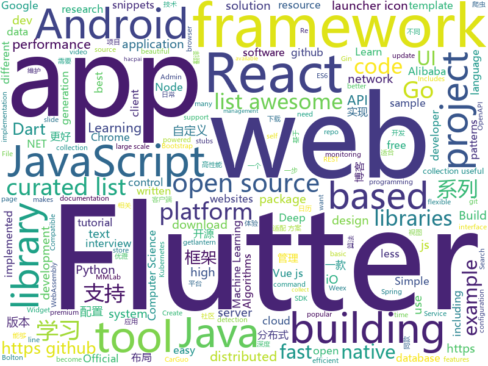

# 2018-10-13
See what the GitHub community is most excited about today.

## python
* [camelot](https://github.com/socialcopsdev/camelot)(**459 stars today**): Camelot: PDF Table Extraction for Humans
* [Python](https://github.com/TheAlgorithms/Python)(**340 stars today**): All Algorithms implemented in Python
* [Algorithm_Interview_Notes-Chinese](https://github.com/imhuay/Algorithm_Interview_Notes-Chinese)(**242 stars today**): 2018/2019/校招/春招/秋招/算法/机器学习(Machine Learning)/深度学习(Deep Learning)/自然语言处理(NLP)/C/C++/Python/面试笔记
* [accu](https://github.com/mohanson/accu)(**174 stars today**): Mohanson's Blog
* [awesome-algorithm](https://github.com/apachecn/awesome-algorithm)(**138 stars today**): Leetcode 题解 (跟随思路一步一步撸出代码) 及经典算法实现
* [responder](https://github.com/kennethreitz/responder)(**116 stars today**): a familiar HTTP Service Framework for Python
* [mmdetection](https://github.com/open-mmlab/mmdetection)(**115 stars today**): Open MMLab Detection Toolbox
* [models](https://github.com/tensorflow/models)(**63 stars today**): Models and examples built with TensorFlow
* [boltons](https://github.com/mahmoud/boltons)(**72 stars today**): 🔩Like builtins, but boltons. Constructs/recipes/snippets that would be handy in the standard library. Nothing like Michael Bolton.
* [system-design-primer](https://github.com/donnemartin/system-design-primer)(**65 stars today**): Learn how to design large-scale systems. Prep for the system design interview. Includes Anki flashcards.
* [mmcv](https://github.com/open-mmlab/mmcv)(**66 stars today**): Open MMLab Computer Vision Foundation
* [pigaios](https://github.com/joxeankoret/pigaios)(**52 stars today**): A tool for diffing source codes directly against binaries.
* [google-research](https://github.com/google-research/google-research)(**50 stars today**): Google AI Research
* [vel](https://github.com/MillionIntegrals/vel)(**46 stars today**): Velocity in deep-learning research
* [keras](https://github.com/keras-team/keras)(**32 stars today**): Deep Learning for humans
* [self-attention-gan](https://github.com/brain-research/self-attention-gan)(**40 stars today**): 
* [youtube-dl](https://github.com/rg3/youtube-dl)(**35 stars today**): Command-line program to download videos from YouTube.com and other video sites
* [SILENTTRINITY](https://github.com/byt3bl33d3r/SILENTTRINITY)(**38 stars today**): A post-exploitation agent powered by Python, IronPython, C#/.NET
* [active-qa](https://github.com/google/active-qa)(**38 stars today**): 
* [public-apis](https://github.com/toddmotto/public-apis)(**36 stars today**): A collective list of public JSON APIs for use in web development.
* [awesome-python](https://github.com/vinta/awesome-python)(**34 stars today**): A curated list of awesome Python frameworks, libraries, software and resources
* [django](https://github.com/django/django)(**33 stars today**): The Web framework for perfectionists with deadlines.
* [MNIST_Pytorch_python_and_capi](https://github.com/tobiascz/MNIST_Pytorch_python_and_capi)(**38 stars today**): This is an example of how to train a MNIST network in Python and run it in c++ with pytorch 1.0
* [scikit-learn](https://github.com/scikit-learn/scikit-learn)(**28 stars today**): scikit-learn: machine learning in Python
* [Detectron](https://github.com/facebookresearch/Detectron)(**33 stars today**): FAIR's research platform for object detection research, implementing popular algorithms like Mask R-CNN and RetinaNet.

## java
* [interviews](https://github.com/kdn251/interviews)(**264 stars today**): Everything you need to know to get the job.
* [JavaGuide](https://github.com/Snailclimb/JavaGuide)(**192 stars today**): 【Java学习+面试指南】 一份涵盖大部分Java程序员所需要掌握的核心知识。
* [pinpoint](https://github.com/naver/pinpoint)(**172 stars today**): Pinpoint is an open source APM (Application Performance Management) tool for large-scale distributed systems written in Java.
* [symphony](https://github.com/b3log/symphony)(**96 stars today**): 🎶一款用 Java 实现的现代化社区（论坛/BBS/社交网络/博客）平台。https://hacpai.com
* [arthas](https://github.com/alibaba/arthas)(**88 stars today**): Alibaba Java Diagnostic Tool Arthas/Alibaba Java诊断利器Arthas
* [Sentinel](https://github.com/alibaba/Sentinel)(**60 stars today**): A lightweight flow-control library providing high-available protection and monitoring (高可用防护的流量管理框架)
* [proxyee-down](https://github.com/proxyee-down-org/proxyee-down)(**56 stars today**): http下载工具，基于http代理，支持多连接分块下载
* [elasticsearch](https://github.com/elastic/elasticsearch)(**56 stars today**): Open Source, Distributed, RESTful Search Engine
* [java-design-patterns](https://github.com/iluwatar/java-design-patterns)(**46 stars today**): Design patterns implemented in Java
* [spring-boot](https://github.com/spring-projects/spring-boot)(**37 stars today**): Spring Boot
* [brigadier](https://github.com/Mojang/brigadier)(**44 stars today**): Brigadier is a command parser & dispatcher, designed and developed for Minecraft: Java Edition.
* [AndroidAutoSize](https://github.com/JessYanCoding/AndroidAutoSize)(**43 stars today**): 🔥A low-cost Android screen adaptation solution (今日头条屏幕适配方案终极版，一个极低成本的 Android 屏幕适配方案).
* [incubator-dubbo](https://github.com/apache/incubator-dubbo)(**36 stars today**): Apache Dubbo (incubating) is a high-performance, java based, open source RPC framework.
* [PageLayoutDemo](https://github.com/Hankkin/PageLayoutDemo)(**39 stars today**): 一款简单的page切换 空布局、错误布局、加载布局，支持一键配置、定义，不需要xml编写
* [Java](https://github.com/TheAlgorithms/Java)(**29 stars today**): All Algorithms implemented in Java
* [tutorials](https://github.com/eugenp/tutorials)(**27 stars today**): The "REST With Spring" Course:
* [hmily](https://github.com/yu199195/hmily)(**31 stars today**): 高性能异步分布式事务TCC框架(try,confirm,cancel)
* [WanAndroidxg](https://github.com/fangxiaogang/WanAndroidxg)(**35 stars today**): 玩安卓 WanAndroid 单 Actvity + Fragment && Retrofit + RxJava + MVP +Dagger2
* [apollo](https://github.com/ctripcorp/apollo)(**31 stars today**): Apollo（阿波罗）是携程框架部门研发的分布式配置中心，能够集中化管理应用不同环境、不同集群的配置，配置修改后能够实时推送到应用端，并且具备规范的权限、流程治理等特性，适用于微服务配置管理场景。
* [CalendarView](https://github.com/huanghaibin-dev/CalendarView)(**31 stars today**): Android上一个优雅、万能自定义UI、支持周视图、自定义周起始、性能高效的日历控件，支持热插拔实现的UI定制！支持标记、自定义颜色、农历、自定义月视图各种显示模式等。Canvas绘制，速度快、占用内存低，你真的想不到日历居然还可以如此优雅！An elegant, highly customized and high-performance Calendar Widget on Android.
* [solo](https://github.com/b3log/solo)(**25 stars today**): 🎸一款小而美的 Java 博客系统。https://hacpai.com/tag/solo
* [LitePal](https://github.com/LitePalFramework/LitePal)(**28 stars today**): An Android library that makes developers use SQLite database extremely easy.
* [netty](https://github.com/netty/netty)(**24 stars today**): Netty project - an event-driven asynchronous network application framework
* [spring-cloud-alibaba](https://github.com/spring-cloud-incubator/spring-cloud-alibaba)(**24 stars today**): Spring Cloud Alibaba provides a one-stop solution for application development for the distributed solutions of Alibaba middleware.
* [spring-framework](https://github.com/spring-projects/spring-framework)(**16 stars today**): Spring Framework

## unknown
* [awesome-spider](https://github.com/facert/awesome-spider)(**309 stars today**): 爬虫集合
* [developer-roadmap](https://github.com/kamranahmedse/developer-roadmap)(**162 stars today**): Roadmap to becoming a web developer in 2018
* [USBuildingFootprints](https://github.com/Microsoft/USBuildingFootprints)(**101 stars today**): Computer generated building footprints for the United States
* [first-contributions](https://github.com/firstcontributions/first-contributions)(**42 stars today**): 🚀✨Help beginners to contribute to open source projects
* [pwc](https://github.com/zziz/pwc)(**71 stars today**): Papers with code. Sorted by stars. Updated weekly.
* [awesome](https://github.com/sindresorhus/awesome)(**70 stars today**): 😎Curated list of awesome lists
* [CS-Notes](https://github.com/CyC2018/CS-Notes)(**62 stars today**): 📚Computer Science Learning Notes
* [gitignore](https://github.com/github/gitignore)(**47 stars today**): A collection of useful .gitignore templates
* [free-programming-books](https://github.com/EbookFoundation/free-programming-books)(**57 stars today**): 📚Freely available programming books
* [coding-interview-university](https://github.com/jwasham/coding-interview-university)(**47 stars today**): A complete computer science study plan to become a software engineer.
* [stanford-cs-229-machine-learning](https://github.com/afshinea/stanford-cs-229-machine-learning)(**47 stars today**): VIP cheatsheets for Stanford's CS 229 Machine Learning
* [awesome-vue](https://github.com/vuejs/awesome-vue)(**42 stars today**): 🎉A curated list of awesome things related to Vue.js
* [web-develop](https://github.com/SFLAQiu/web-develop)(**46 stars today**): 《大话WEB开发》WEB开发相关经验总结分享💌⭐️😘
* [Blog](https://github.com/mqyqingfeng/Blog)(**41 stars today**): 冴羽写博客的地方，预计写四个系列：JavaScript深入系列、JavaScript专题系列、ES6系列、React系列。
* [quick-SQL-cheatsheet](https://github.com/enochtangg/quick-SQL-cheatsheet)(**38 stars today**): A quick reminder of all SQL queries and examples on how to use them.
* [computer-science](https://github.com/ossu/computer-science)(**29 stars today**): 🎓Path to a free self-taught education in Computer Science!
* [project-based-learning](https://github.com/tuvtran/project-based-learning)(**29 stars today**): Curated list of project-based tutorials
* [pasox_zab_protocol](https://github.com/hutu92/pasox_zab_protocol)(**28 stars today**): 分布式一致性协议 paxos/zab/raft 相关论文及中文译文
* [awesome-for-beginners](https://github.com/MunGell/awesome-for-beginners)(**29 stars today**): A list of awesome beginners-friendly projects.
* [awesome-mongodb](https://github.com/ramnes/awesome-mongodb)(**28 stars today**): 🍃A curated list of awesome MongoDB resources, libraries, tools and applications
* [Enterprise_Security_Build--Open_Source](https://github.com/bloodzer0/Enterprise_Security_Build--Open_Source)(**25 stars today**): 甲方企业安全建设开源之路
* [gold-miner](https://github.com/xitu/gold-miner)(**25 stars today**): 🥇掘金翻译计划，可能是世界最大最好的英译中技术社区，最懂读者和译者的翻译平台：
* [react-redux-links](https://github.com/markerikson/react-redux-links)(**26 stars today**): Curated tutorial and resource links I've collected on React, Redux, ES6, and more
* [android-architecture](https://github.com/googlesamples/android-architecture)(**23 stars today**): A collection of samples to discuss and showcase different architectural tools and patterns for Android apps.
* [reactjs-interview-questions](https://github.com/sudheerj/reactjs-interview-questions)(**25 stars today**): List of top 222 ReactJS Interview Questions & Answers

## javascript
* [muze](https://github.com/chartshq/muze)(**282 stars today**): Composable data visualisation library for web with a data-first approach
* [walt](https://github.com/ballercat/walt)(**278 stars today**): ⚡️Walt is a JavaScript-like syntax for WebAssembly text format⚡️
* [percollate](https://github.com/danburzo/percollate)(**272 stars today**): 🌐→📖A command-line tool to grab web pages as beautifully formatted PDFs
* [Advanced-React](https://github.com/wesbos/Advanced-React)(**234 stars today**): Starter Files and Solutions for Full Stack Advanced React and GraphQL
* [30-seconds-of-code](https://github.com/30-seconds/30-seconds-of-code)(**227 stars today**): Curated collection of useful JavaScript snippets that you can understand in 30 seconds or less.
* [awesome-vscode](https://github.com/viatsko/awesome-vscode)(**209 stars today**): 🎨A curated list of delightful VS Code packages and resources.
* [node](https://github.com/nodejs/node)(**62 stars today**): Node.js JavaScript runtime✨🐢🚀✨
* [vue](https://github.com/vuejs/vue)(**91 stars today**): 🖖A progressive, incrementally-adoptable JavaScript framework for building UI on the web.
* [react-native-testing-library](https://github.com/callstack/react-native-testing-library)(**96 stars today**): Simple React Native testing utilities helping you write better tests with less effort
* [react](https://github.com/facebook/react)(**84 stars today**): A declarative, efficient, and flexible JavaScript library for building user interfaces.
* [freeCodeCamp](https://github.com/freeCodeCamp/freeCodeCamp)(****): The https://freeCodeCamp.org open source codebase and curriculum. Learn to code for free together with millions of people.
* [create-react-app](https://github.com/facebook/create-react-app)(**67 stars today**): Create React apps with no build configuration.
* [tiptap](https://github.com/heyscrumpy/tiptap)(**74 stars today**): A rich-text editor for Vue.js
* [carbon](https://github.com/dawnlabs/carbon)(**68 stars today**): 🎨Create and share beautiful images of your source code
* [puppeteer](https://github.com/GoogleChrome/puppeteer)(**64 stars today**): Headless Chrome Node API
* [You-Dont-Need-Momentjs](https://github.com/you-dont-need/You-Dont-Need-Momentjs)(**62 stars today**): List of date-fns or native functions which you can use to replace moment.js + ESLint Plugin
* [next.js](https://github.com/zeit/next.js)(**58 stars today**): The React Framework
* [billboard.js](https://github.com/naver/billboard.js)(**59 stars today**): 📊Re-usable, easy interface JavaScript chart library based on D3 v4+📈
* [gatsby](https://github.com/gatsbyjs/gatsby)(**50 stars today**): Build blazing fast, modern apps and websites with React
* [gridsome](https://github.com/gridsome/gridsome)(**54 stars today**): ⚡️Build blazing fast websites with Vue.js & GraphQL
* [react-native](https://github.com/facebook/react-native)(**51 stars today**): A framework for building native apps with React.
* [babel](https://github.com/babel/babel)(**53 stars today**): 🐠Babel is a compiler for writing next generation JavaScript.
* [flatbush](https://github.com/mourner/flatbush)(**53 stars today**): A very fast static spatial index for 2D points and rectangles in JavaScript
* [lagou_vue](https://github.com/qianbin01/lagou_vue)(**45 stars today**): vue全家桶拉勾版，含爬虫，前后端，数据分析
* [awesome-mac](https://github.com/jaywcjlove/awesome-mac)(**47 stars today**):  Now we have become very big, Different from the original idea. Collect premium software in various categories.

## html
* [hacktoberfest](https://github.com/lingonsaft/hacktoberfest)(**12 stars today**): Hacktoberfest 2018. Don't forget to spread love and if you like give us a⭐️
* [slide-serve](https://github.com/cdreier/slide-serve)(**36 stars today**): small presentation and dev server for simple slides, based on https://github.com/trikita/slide-html
* [solid](https://github.com/solid/solid)(**34 stars today**): Solid - Re-decentralizing the web (project directory)
* [styleguide](https://github.com/google/styleguide)(**25 stars today**): Style guides for Google-originated open-source projects
* [30-seconds-of-css](https://github.com/30-seconds/30-seconds-of-css)(**22 stars today**): A curated collection of useful CSS snippets you can understand in 30 seconds or less.
* [JavaScript30](https://github.com/wesbos/JavaScript30)(**15 stars today**): 30 Day Vanilla JS Challenge
* [portainer](https://github.com/portainer/portainer)(**19 stars today**): Simple management UI for Docker
* [patchwork](https://github.com/jlord/patchwork)(****): All the Git-it Workshop completers!
* [swagger-codegen](https://github.com/swagger-api/swagger-codegen)(**16 stars today**): swagger-codegen contains a template-driven engine to generate documentation, API clients and server stubs in different languages by parsing your OpenAPI / Swagger definition.
* [linux-command](https://github.com/jaywcjlove/linux-command)(**16 stars today**): Linux命令大全搜索工具，内容包含Linux命令手册、详解、学习、搜集。https://git.io/linux
* [fastText](https://github.com/facebookresearch/fastText)(**18 stars today**): Library for fast text representation and classification.
* [Spoon-Knife](https://github.com/octocat/Spoon-Knife)(****): This repo is for demonstration purposes only.
* [baselines](https://github.com/openai/baselines)(**16 stars today**): OpenAI Baselines: high-quality implementations of reinforcement learning algorithms
* [kubernetes-docs-zh](https://github.com/kubernetes/kubernetes-docs-zh)(**14 stars today**): Chinese-language Kubernetes documentation
* [AdminLTE](https://github.com/almasaeed2010/AdminLTE)(**9 stars today**): AdminLTE - Free Premium Admin control Panel Theme Based On Bootstrap 3.x
* [node-interview](https://github.com/ElemeFE/node-interview)(**11 stars today**): How to pass the Node.js interview of ElemeFE.
* [mastering-modular-javascript](https://github.com/mjavascript/mastering-modular-javascript)(**12 stars today**): 📦Module thinking, principles, design patterns and best practices.
* [react-redux](https://github.com/reduxjs/react-redux)(**8 stars today**): Official React bindings for Redux
* [gentelella](https://github.com/puikinsh/gentelella)(**7 stars today**): Free Bootstrap 3 Admin Template
* [primeng](https://github.com/primefaces/primeng)(**7 stars today**): UI Components for Angular
* [openapi-generator](https://github.com/OpenAPITools/openapi-generator)(**7 stars today**): OpenAPI Generator allows generation of API client libraries (SDK generation), server stubs, documentation and configuration automatically given an OpenAPI Spec (v2, v3)
* [pib](https://github.com/oraoto/pib)(**7 stars today**): PHP in Browser (powered by WebAssembly)
* [simple-icons](https://github.com/simple-icons/simple-icons)(**7 stars today**): SVG icons for popular brands
* [nndl.github.io](https://github.com/nndl/nndl.github.io)(**5 stars today**): 《神经网络与深度学习》 Neural Network and Deep Learning
* [dotnet](https://github.com/Microsoft/dotnet)(**5 stars today**): This repo is the official home of .NET on GitHub. It's a great starting point to find many .NET OSS projects from Microsoft and the community, including many that are part of the .NET Foundation.

## dart
* [flutter](https://github.com/flutter/flutter)(**63 stars today**): Flutter makes it easy and fast to build beautiful mobile apps.
* [awesome-flutter](https://github.com/Solido/awesome-flutter)(**31 stars today**): An awesome list that curates the best Flutter libraries, tools, tutorials, articles and more.
* [Flutter-Notebook](https://github.com/OpenFlutter/Flutter-Notebook)(**19 stars today**): 日更的FlutterDemo合集，今天你fu了吗
* [GSYGithubAppFlutter](https://github.com/CarGuo/GSYGithubAppFlutter)(**18 stars today**): 超完整的Flutter项目，功能丰富，适合学习和日常使用。GSYGithubApp系列的优势：我们目前已经拥有Flutter、Weex、ReactNative三个版本。 功能齐全，项目框架内技术涉及面广，完成度高，持续维护，配套文章，适合全面学习，跨框架对比参考。跨平台的开源Github客户端App，更好的体验，更丰富的功能，旨在更好的日常管理和维护个人Github，提供更好更方便的驾车体验～～Σ(￣。￣ﾉ)ﾉ。同款Weex版本 ： https://github.com/CarGuo/GSYGithubAppWeex 、同款React Native版本 ： https://github.com/CarGuo/GSYGithubApp
* [plugins](https://github.com/flutter/plugins)(**7 stars today**): Plugins for Flutter, including FlutterFire, maintained by the Flutter team
* [flutter_map](https://github.com/apptreesoftware/flutter_map)(**8 stars today**): A Flutter map package based on leaflet
* [flutter_architecture_samples](https://github.com/brianegan/flutter_architecture_samples)(**7 stars today**): TodoMVC for Flutter
* [Flutter-learning](https://github.com/AweiLoveAndroid/Flutter-learning)(**6 stars today**): 🔥👍🌟⭐️⭐️⭐️Flutter install&settings,Flutter problems when developing,Flutter sample codes& templates,Flutter projects,Dart languages sample codes
* [rxdart](https://github.com/ReactiveX/rxdart)(**6 stars today**): The Reactive Extensions for Dart
* [flutter_example](https://github.com/7449/flutter_example)(****): flutter code,flutter-banner,flutter-codekk,flutter-panda,flutter_tab
* [website](https://github.com/flutter/website)(****): Flutter web site
* [aqueduct](https://github.com/stablekernel/aqueduct)(****): Dart HTTP server framework for building REST APIs. Includes PostgreSQL ORM and OAuth2 provider.
* [flutter_launcher_icons](https://github.com/fluttercommunity/flutter_launcher_icons)(****): Flutter Launcher Icons - A package which simplifies the task of updating your Flutter app's launcher icon. Fully flexible, allowing you to choose what platform you wish to update the launcher icon for and if you want, the option to keep your old launcher icon in case you want to revert back sometime in the future. Maintainer: @MarkOSullivan94
* [flutter_platform_widgets](https://github.com/aqwert/flutter_platform_widgets)(****): Target the specific design of Material for Android and Cupertino for iOS widgets through a common set of Platform aware widgets
* [flutter_swiper](https://github.com/best-flutter/flutter_swiper)(****): The best swiper for flutter , with multiple layouts, infinite loop. Compatible with Android & iOS.
* [simple_auth](https://github.com/Clancey/simple_auth)(****): The Simplest way to Authenticate in Flutter
* [chromedeveditor](https://github.com/googlearchive/chromedeveditor)(****): Chrome Dev Editor is a developer tool for building apps on the Chrome platform - Chrome Apps and Web Apps, in JavaScript or Dart. (NO LONGER IN ACTIVE DEVELOPMENT)
* [sdk](https://github.com/dart-lang/sdk)(****): The Dart SDK, including the VM, dart2js, core libraries, and more.
* [flutter-osc](https://github.com/yubo725/flutter-osc)(****): 基于Google Flutter的开源中国客户端，支持Android和iOS。
* [flutter-examples](https://github.com/nisrulz/flutter-examples)(****): [Examples] Simple basic isolated apps, for budding flutter devs.
* [Flutter-UI-Kit](https://github.com/iampawan/Flutter-UI-Kit)(****): Flutter app for collection of UI in a UIKit
* [FlutterExampleApps](https://github.com/iampawan/FlutterExampleApps)(****): [Example APPS] Basic Flutter apps, for flutter devs.
* [inKino](https://github.com/roughike/inKino)(****): inKino - A cross platform movie and showtime browser for Finnkino cinemas, made with Flutter.
* [dio](https://github.com/flutterchina/dio)(****): A powerful Http client for Dart, which supports Interceptors, FormData, Request Cancellation, File Downloading, Timeout etc.
* [hauberk](https://github.com/munificent/hauberk)(****): A web-based roguelike written in Dart.

## go
* [illustrated-tls](https://github.com/syncsynchalt/illustrated-tls)(**326 stars today**): The Illustrated TLS Connection: Every byte explained
* [ferret](https://github.com/MontFerret/ferret)(**87 stars today**): Declarative web scraping
* [mercure](https://github.com/dunglas/mercure)(**76 stars today**): Server-sent live updates: protocol and reference implementation
* [biscuit](https://github.com/mit-pdos/biscuit)(**64 stars today**): Biscuit research OS
* [kubernetes](https://github.com/kubernetes/kubernetes)(**45 stars today**): Production-Grade Container Scheduling and Management
* [go](https://github.com/golang/go)(**45 stars today**): The Go programming language
* [awesome-go](https://github.com/avelino/awesome-go)(**46 stars today**): A curated list of awesome Go frameworks, libraries and software
* [sourcegraph](https://github.com/sourcegraph/sourcegraph)(**45 stars today**): Code search and intelligence, self-hosted and scalable
* [gse](https://github.com/go-ego/gse)(**41 stars today**): Go efficient text segmentation; support english, chinese, japanese and other. Go 语言高性能分词
* [go-under-the-hood](https://github.com/changkun/go-under-the-hood)(**36 stars today**): Go 源码研究 (1.11.1, WIP)
* [prometheus](https://github.com/prometheus/prometheus)(**30 stars today**): The Prometheus monitoring system and time series database.
* [gin](https://github.com/gin-gonic/gin)(**29 stars today**): Gin is a HTTP web framework written in Go (Golang). It features a Martini-like API with much better performance -- up to 40 times faster. If you need smashing performance, get yourself some Gin.
* [fider](https://github.com/getfider/fider)(**30 stars today**): Open platform to collect and prioritize product feedback
* [hugo](https://github.com/gohugoio/hugo)(**26 stars today**): The world’s fastest framework for building websites.
* [go-ethereum](https://github.com/ethereum/go-ethereum)(**23 stars today**): Official Go implementation of the Ethereum protocol
* [istio](https://github.com/istio/istio)(**27 stars today**): Connect, secure, control, and observe services.
* [lantern](https://github.com/getlantern/lantern)(**25 stars today**): 🔴蓝灯最新版本下载 https://github.com/getlantern/download🔴Lantern Latest Download https://github.com/getlantern/download🔴
* [v2ray-core](https://github.com/v2ray/v2ray-core)(**22 stars today**): A platform for building proxies to bypass network restrictions.
* [tidb](https://github.com/pingcap/tidb)(**26 stars today**): TiDB is a distributed HTAP database compatible with the MySQL protocol
* [terraform](https://github.com/hashicorp/terraform)(**26 stars today**): Terraform is a tool for building, changing, and combining infrastructure safely and efficiently.
* [shuttle](https://github.com/sipt/shuttle)(**25 stars today**): A web proxy in Golang with amazing features.
* [harbor](https://github.com/goharbor/harbor)(**23 stars today**): An open source trusted cloud native registry project that stores, signs, and scans content.
* [helm](https://github.com/helm/helm)(**21 stars today**): The Kubernetes Package Manager
* [etcd](https://github.com/etcd-io/etcd)(**21 stars today**): Distributed reliable key-value store for the most critical data of a distributed system
* [go-cloud](https://github.com/google/go-cloud)(**20 stars today**): A library and tools for open cloud development in Go.

## WordCloud

