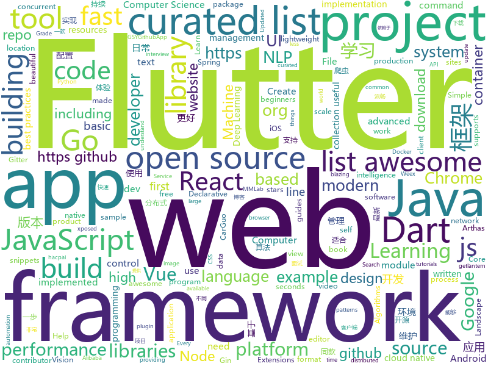

# 2018-10-14
See what the GitHub community is most excited about today.

## python
* [camelot](https://github.com/socialcopsdev/camelot)(**260 stars today**): Camelot: PDF Table Extraction for Humans
* [mmdetection](https://github.com/open-mmlab/mmdetection)(**187 stars today**): Open MMLab Detection Toolbox
* [Python](https://github.com/TheAlgorithms/Python)(**182 stars today**): All Algorithms implemented in Python
* [responder](https://github.com/kennethreitz/responder)(**170 stars today**): a familiar HTTP Service Framework for Python
* [Algorithm_Interview_Notes-Chinese](https://github.com/imhuay/Algorithm_Interview_Notes-Chinese)(**107 stars today**): 2018/2019/校招/春招/秋招/算法/机器学习(Machine Learning)/深度学习(Deep Learning)/自然语言处理(NLP)/C/C++/Python/面试笔记
* [mmcv](https://github.com/open-mmlab/mmcv)(**94 stars today**): Open MMLab Computer Vision Foundation
* [medicaltorch](https://github.com/perone/medicaltorch)(**57 stars today**): A medical imaging framework for Pytorch
* [accu](https://github.com/mohanson/accu)(**52 stars today**): Mohanson's Blog
* [models](https://github.com/tensorflow/models)(**40 stars today**): Models and examples built with TensorFlow
* [system-design-primer](https://github.com/donnemartin/system-design-primer)(**49 stars today**): Learn how to design large-scale systems. Prep for the system design interview. Includes Anki flashcards.
* [awesome-algorithm](https://github.com/apachecn/awesome-algorithm)(**45 stars today**): Leetcode 题解 (跟随思路一步一步撸出代码) 及经典算法实现
* [awesome-python](https://github.com/vinta/awesome-python)(**41 stars today**): A curated list of awesome Python frameworks, libraries, software and resources
* [google-research](https://github.com/google-research/google-research)(**43 stars today**): Google AI Research
* [mlcourse.ai](https://github.com/Yorko/mlcourse.ai)(**28 stars today**): Open Machine Learning Course
* [youtube-dl](https://github.com/rg3/youtube-dl)(**34 stars today**): Command-line program to download videos from YouTube.com and other video sites
* [ReconDog](https://github.com/s0md3v/ReconDog)(**30 stars today**): Reconnaissance Swiss Army Knife
* [pigaios](https://github.com/joxeankoret/pigaios)(**28 stars today**): A tool for diffing source codes directly against binaries.
* [keras](https://github.com/keras-team/keras)(**22 stars today**): Deep Learning for humans
* [openlibrary](https://github.com/internetarchive/openlibrary)(**24 stars today**): One webpage for every book ever published!
* [python-telegram-bot](https://github.com/python-telegram-bot/python-telegram-bot)(**25 stars today**): We have made you a wrapper you can't refuse
* [self-attention-gan](https://github.com/brain-research/self-attention-gan)(**26 stars today**): 
* [home-assistant](https://github.com/home-assistant/home-assistant)(**22 stars today**): 🏡Open source home automation that puts local control and privacy first
* [gluoncv-torch](https://github.com/zhanghang1989/gluoncv-torch)(**25 stars today**): PyTorch API for GluonCV Models
* [hosts](https://github.com/StevenBlack/hosts)(**24 stars today**): Extending and consolidating hosts files from several well-curated sources like adaway.org, mvps.org, malwaredomainlist.com, someonewhocares.org, and potentially others. You can optionally invoke extensions to block additional sites by category.
* [vel](https://github.com/MillionIntegrals/vel)(**24 stars today**): Velocity in deep-learning research

## java
* [interviews](https://github.com/kdn251/interviews)(**117 stars today**): Everything you need to know to get the job.
* [JavaGuide](https://github.com/Snailclimb/JavaGuide)(**69 stars today**): 【Java学习+面试指南】 一份涵盖大部分Java程序员所需要掌握的核心知识。
* [symphony](https://github.com/b3log/symphony)(**48 stars today**): 🎶一款用 Java 实现的现代化社区（论坛/BBS/社交网络/博客）平台。https://hacpai.com
* [proxyee-down](https://github.com/proxyee-down-org/proxyee-down)(**51 stars today**): http下载工具，基于http代理，支持多连接分块下载
* [Hunter](https://github.com/Leaking/Hunter)(**36 stars today**): A fast, incremental, concurrent framework to develop compile plugin for android project
* [java-design-patterns](https://github.com/iluwatar/java-design-patterns)(**29 stars today**): Design patterns implemented in Java
* [JCSprout](https://github.com/crossoverJie/JCSprout)(**27 stars today**): 👨‍🎓Java Core Sprout : basic, concurrent, algorithm
* [elasticsearch](https://github.com/elastic/elasticsearch)(**25 stars today**): Open Source, Distributed, RESTful Search Engine
* [Java](https://github.com/TheAlgorithms/Java)(**23 stars today**): All Algorithms implemented in Java
* [spring-boot](https://github.com/spring-projects/spring-boot)(**23 stars today**): Spring Boot
* [pinpoint](https://github.com/naver/pinpoint)(**24 stars today**): Pinpoint is an open source APM (Application Performance Management) tool for large-scale distributed systems written in Java.
* [MVVMHabit](https://github.com/goldze/MVVMHabit)(**24 stars today**): 基于谷歌最新AAC架构，MVVM设计模式的一套快速开发库，整合Okhttp+RxJava+Retrofit+Glide等主流模块，满足日常开发需求。使用该框架可以快速开发一个健壮、易维护的Android应用。
* [brigadier](https://github.com/Mojang/brigadier)(**19 stars today**): Brigadier is a command parser & dispatcher, designed and developed for Minecraft: Java Edition.
* [spring-framework](https://github.com/spring-projects/spring-framework)(**16 stars today**): Spring Framework
* [testcontainers-java](https://github.com/testcontainers/testcontainers-java)(**20 stars today**): Testcontainers is a Java library that supports JUnit tests, providing lightweight, throwaway instances of common databases, Selenium web browsers, or anything else that can run in a Docker container.
* [tutorials](https://github.com/eugenp/tutorials)(**12 stars today**): The "REST With Spring" Course:
* [ratel](https://github.com/virjar/ratel)(**15 stars today**): 在非root环境下，使用xposed，且不依赖于其他虚拟化容器环境。使得xposed有二次分包的能力
* [apollo](https://github.com/ctripcorp/apollo)(**14 stars today**): Apollo（阿波罗）是携程框架部门研发的分布式配置中心，能够集中化管理应用不同环境、不同集群的配置，配置修改后能够实时推送到应用端，并且具备规范的权限、流程治理等特性，适用于微服务配置管理场景。
* [arthas](https://github.com/alibaba/arthas)(**14 stars today**): Alibaba Java Diagnostic Tool Arthas/Alibaba Java诊断利器Arthas
* [hmily](https://github.com/yu199195/hmily)(**14 stars today**): 高性能异步分布式事务TCC框架(try,confirm,cancel)
* [Sentinel](https://github.com/alibaba/Sentinel)(**13 stars today**): A lightweight flow-control library providing high-available protection and monitoring (高可用防护的流量管理框架)
* [solo](https://github.com/b3log/solo)(**12 stars today**): 🎸一款小而美的 Java 博客系统。https://hacpai.com/tag/solo
* [netty](https://github.com/netty/netty)(**9 stars today**): Netty project - an event-driven asynchronous network application framework
* [mybatis-3](https://github.com/mybatis/mybatis-3)(**11 stars today**): MyBatis SQL mapper framework for Java
* [jenkins](https://github.com/jenkinsci/jenkins)(**11 stars today**): Jenkins automation server

## unknown
* [awesome-piracy](https://github.com/Igglybuff/awesome-piracy)(**382 stars today**): A curated list of awesome warez and piracy links
* [first-contributions](https://github.com/firstcontributions/first-contributions)(**35 stars today**): 🚀✨Help beginners to contribute to open source projects
* [developer-roadmap](https://github.com/kamranahmedse/developer-roadmap)(**86 stars today**): Roadmap to becoming a web developer in 2018
* [awesome-spider](https://github.com/facert/awesome-spider)(**78 stars today**): 爬虫集合
* [awesome](https://github.com/sindresorhus/awesome)(**64 stars today**): 😎Curated list of awesome lists
* [free-programming-books](https://github.com/EbookFoundation/free-programming-books)(**49 stars today**): 📚Freely available programming books
* [CS-Notes](https://github.com/CyC2018/CS-Notes)(**40 stars today**): 📚Computer Science Learning Notes
* [gitignore](https://github.com/github/gitignore)(**32 stars today**): A collection of useful .gitignore templates
* [nodebestpractices](https://github.com/i0natan/nodebestpractices)(**42 stars today**): The largest Node.JS best practices list (October 2018)
* [USBuildingFootprints](https://github.com/Microsoft/USBuildingFootprints)(**40 stars today**): Computer generated building footprints for the United States
* [stanford-cs-229-machine-learning](https://github.com/afshinea/stanford-cs-229-machine-learning)(**32 stars today**): VIP cheatsheets for Stanford's CS 229 Machine Learning
* [coding-interview-university](https://github.com/jwasham/coding-interview-university)(**28 stars today**): A complete computer science study plan to become a software engineer.
* [project-based-learning](https://github.com/tuvtran/project-based-learning)(**20 stars today**): Curated list of project-based tutorials
* [awesome-vue](https://github.com/vuejs/awesome-vue)(**22 stars today**): 🎉A curated list of awesome things related to Vue.js
* [vuejs-advanced-learning](https://github.com/filrak/vuejs-advanced-learning)(**23 stars today**): A curated list of advanced and/or in-depth learning resources about Vue.js
* [A-to-Z-Resources-for-Students](https://github.com/dipakkr/A-to-Z-Resources-for-Students)(**21 stars today**): Hand Curated list of Conferences, fellowship programs and Hackathons for Developers. Join Our Gitter channel and always Stay Updated -> https://gitter.im/a2z-resources
* [pwc](https://github.com/zziz/pwc)(**21 stars today**): Papers with code. Sorted by stars. Updated weekly.
* [computer-science](https://github.com/ossu/computer-science)(**19 stars today**): 🎓Path to a free self-taught education in Computer Science!
* [reactjs-interview-questions](https://github.com/sudheerj/reactjs-interview-questions)(**19 stars today**): List of top 222 ReactJS Interview Questions & Answers
* [kubernetes-the-hard-way](https://github.com/kelseyhightower/kubernetes-the-hard-way)(**17 stars today**): Bootstrap Kubernetes the hard way on Google Cloud Platform. No scripts.
* [awesome-project-ideas](https://github.com/NirantK/awesome-project-ideas)(**18 stars today**): Curated list of Machine Learning, NLP, Vision, Recommender Systems Project Ideas
* [awesome-for-beginners](https://github.com/MunGell/awesome-for-beginners)(**16 stars today**): A list of awesome beginners-friendly projects.
* [FunnyViews](https://github.com/samlss/FunnyViews)(**18 stars today**): A lot of funny views,will continue to update.(许多有趣的view, 将持续更新)
* [build-your-own-x](https://github.com/danistefanovic/build-your-own-x)(**18 stars today**): 🤓Build your own (insert technology here)
* [awesome-cpp](https://github.com/fffaraz/awesome-cpp)(**16 stars today**): A curated list of awesome C++ (or C) frameworks, libraries, resources, and shiny things. Inspired by awesome-... stuff.

## javascript
* [percollate](https://github.com/danburzo/percollate)(**310 stars today**): 🌐→📖A command-line tool to grab web pages as beautifully formatted PDFs
* [30-seconds-of-code](https://github.com/30-seconds/30-seconds-of-code)(**114 stars today**): Curated collection of useful JavaScript snippets that you can understand in 30 seconds or less.
* [carbon](https://github.com/dawnlabs/carbon)(**116 stars today**): 🎨Create and share beautiful images of your source code
* [Advanced-React](https://github.com/wesbos/Advanced-React)(**104 stars today**): Starter Files and Solutions for Full Stack Advanced React and GraphQL
* [awesome-vscode](https://github.com/viatsko/awesome-vscode)(**102 stars today**): 🎨A curated list of delightful VS Code packages and resources.
* [vue](https://github.com/vuejs/vue)(**80 stars today**): 🖖A progressive, incrementally-adoptable JavaScript framework for building UI on the web.
* [walt](https://github.com/ballercat/walt)(**81 stars today**): ⚡️Walt is a JavaScript-like syntax for WebAssembly text format⚡️
* [muze](https://github.com/chartshq/muze)(**74 stars today**): Composable data visualisation library for web with a data-first approach
* [freeCodeCamp](https://github.com/freeCodeCamp/freeCodeCamp)(****): The https://freeCodeCamp.org open source codebase and curriculum. Learn to code for free together with millions of people.
* [create-react-app](https://github.com/facebook/create-react-app)(**61 stars today**): Create React apps with no build configuration.
* [react](https://github.com/facebook/react)(**59 stars today**): A declarative, efficient, and flexible JavaScript library for building user interfaces.
* [lagou_vue](https://github.com/qianbin01/lagou_vue)(**46 stars today**): vue全家桶拉勾版，含爬虫，前后端，数据分析
* [node](https://github.com/nodejs/node)(**39 stars today**): Node.js JavaScript runtime✨🐢🚀✨
* [gridsome](https://github.com/gridsome/gridsome)(**42 stars today**): ⚡️Build blazing fast websites with Vue.js & GraphQL
* [githubist](https://github.com/alpcanaydin/githubist)(**40 stars today**): Github developer, location, language and repo stats for Turkey.
* [incubator-superset](https://github.com/apache/incubator-superset)(**36 stars today**): Apache Superset (incubating) is a modern, enterprise-ready business intelligence web application
* [material-ui](https://github.com/mui-org/material-ui)(**34 stars today**): React components that implement Google's Material Design.
* [puppeteer](https://github.com/GoogleChrome/puppeteer)(**34 stars today**): Headless Chrome Node API
* [next.js](https://github.com/zeit/next.js)(**34 stars today**): The React Framework
* [docker.github.io](https://github.com/docker/docker.github.io)(**32 stars today**): Source repo for Docker's Documentation
* [You-Dont-Need-Momentjs](https://github.com/you-dont-need/You-Dont-Need-Momentjs)(**33 stars today**): List of date-fns or native functions which you can use to replace moment.js + ESLint Plugin
* [gatsby](https://github.com/gatsbyjs/gatsby)(**25 stars today**): Build blazing fast, modern apps and websites with React
* [babel](https://github.com/babel/babel)(**27 stars today**): 🐠Babel is a compiler for writing next generation JavaScript.
* [landscape](https://github.com/cncf/landscape)(**28 stars today**): Static Cloud Native Landscapes and Interactive Landscape that filters and sorts hundreds of cloud native projects and products, and shows details including GitHub stars, funding or market cap, first and last commits, contributor counts, headquarters location, and recent tweets.
* [tiptap](https://github.com/heyscrumpy/tiptap)(**27 stars today**): A rich-text editor for Vue.js

## html
* [hacktoberfest](https://github.com/lingonsaft/hacktoberfest)(**13 stars today**): Hacktoberfest 2018. Don't forget to spread love and if you like give us a⭐️
* [hacktoberfest](https://github.com/AliceWonderland/hacktoberfest)(**5 stars today**): Participate in Hacktoberfest by contributing to any Open Source project on GitHub! Here is a starter project for first time contributors. #hacktoberfest
* [solid](https://github.com/solid/solid)(**24 stars today**): Solid - Re-decentralizing the web (project directory)
* [Hacktoberfest2018](https://github.com/RaidAndFade/Hacktoberfest2018)(**8 stars today**): Welcome! I need some help making my list... Learn how in the README
* [fancy-border-radius](https://github.com/9elements/fancy-border-radius)(**16 stars today**): When you use eight values specifying border-radius in CSS, you can build organic looking shapes. Simply use our Generator at
* [baselines](https://github.com/openai/baselines)(**15 stars today**): OpenAI Baselines: high-quality implementations of reinforcement learning algorithms
* [JavaScript30](https://github.com/wesbos/JavaScript30)(**7 stars today**): 30 Day Vanilla JS Challenge
* [styleguide](https://github.com/google/styleguide)(**12 stars today**): Style guides for Google-originated open-source projects
* [imglab](https://github.com/NaturalIntelligence/imglab)(**13 stars today**): To speedup and simplify image labeling/ annotation process with multiple supported formats.
* [portainer](https://github.com/portainer/portainer)(**13 stars today**): Simple management UI for Docker
* [react-redux](https://github.com/reduxjs/react-redux)(**11 stars today**): Official React bindings for Redux
* [30-seconds-of-css](https://github.com/30-seconds/30-seconds-of-css)(**11 stars today**): A curated collection of useful CSS snippets you can understand in 30 seconds or less.
* [javascript-tutorial-en](https://github.com/iliakan/javascript-tutorial-en)(**9 stars today**): Modern JavaScript Tutorial
* [NLP-progress](https://github.com/sebastianruder/NLP-progress)(**8 stars today**): Repository to track the progress in Natural Language Processing (NLP), including the datasets and the current state-of-the-art for the most common NLP tasks.
* [reform](https://github.com/mntmn/reform)(**10 stars today**): MNT Reform DIY Open Source Portable Computer
* [mastering-modular-javascript](https://github.com/mjavascript/mastering-modular-javascript)(**9 stars today**): 📦Module thinking, principles, design patterns and best practices.
* [fastText](https://github.com/facebookresearch/fastText)(**8 stars today**): Library for fast text representation and classification.
* [Spoon-Knife](https://github.com/octocat/Spoon-Knife)(****): This repo is for demonstration purposes only.
* [WebFundamentals](https://github.com/google/WebFundamentals)(**7 stars today**): Best practices for modern web development
* [website](https://github.com/kubernetes/website)(**6 stars today**): Kubernetes website and documentation repo:
* [zenbot](https://github.com/DeviaVir/zenbot)(**7 stars today**): Zenbot is a command-line cryptocurrency trading bot using Node.js and MongoDB.
* [foundation-sites](https://github.com/zurb/foundation-sites)(**6 stars today**): The most advanced responsive front-end framework in the world. Quickly create prototypes and production code for sites that work on any kind of device.
* [ionicons](https://github.com/ionic-team/ionicons)(**6 stars today**): The premium icon font for Ionic Framework and web apps everywhere
* [ecma262](https://github.com/tc39/ecma262)(**6 stars today**): Status, process, and documents for ECMA262
* [patchwork](https://github.com/jlord/patchwork)(****): All the Git-it Workshop completers!

## dart
* [flutter](https://github.com/flutter/flutter)(**37 stars today**): Flutter makes it easy and fast to build beautiful mobile apps.
* [awesome-flutter](https://github.com/Solido/awesome-flutter)(**17 stars today**): An awesome list that curates the best Flutter libraries, tools, tutorials, articles and more.
* [flutter_map](https://github.com/apptreesoftware/flutter_map)(**11 stars today**): A Flutter map package based on leaflet
* [GSYGithubAppFlutter](https://github.com/CarGuo/GSYGithubAppFlutter)(**8 stars today**): 超完整的Flutter项目，功能丰富，适合学习和日常使用。GSYGithubApp系列的优势：我们目前已经拥有Flutter、Weex、ReactNative三个版本。 功能齐全，项目框架内技术涉及面广，完成度高，持续维护，配套文章，适合全面学习，跨框架对比参考。跨平台的开源Github客户端App，更好的体验，更丰富的功能，旨在更好的日常管理和维护个人Github，提供更好更方便的驾车体验～～Σ(￣。￣ﾉ)ﾉ。同款Weex版本 ： https://github.com/CarGuo/GSYGithubAppWeex 、同款React Native版本 ： https://github.com/CarGuo/GSYGithubApp
* [Flutter-Notebook](https://github.com/OpenFlutter/Flutter-Notebook)(**5 stars today**): 日更的FlutterDemo合集，今天你fu了吗
* [site-www](https://github.com/dart-lang/site-www)(****): Source for Dart website
* [flutter_stetho](https://github.com/brianegan/flutter_stetho)(****): Integrate Flutter with the Facebook Stetho tool for Android
* [angular](https://github.com/dart-lang/angular)(****): Fast and productive web framework provided by Dart
* [oauth2](https://github.com/dart-lang/oauth2)(****): An OAuth2 client library for Dart.
* [chromedeveditor](https://github.com/googlearchive/chromedeveditor)(****): Chrome Dev Editor is a developer tool for building apps on the Chrome platform - Chrome Apps and Web Apps, in JavaScript or Dart. (NO LONGER IN ACTIVE DEVELOPMENT)
* [sdk](https://github.com/dart-lang/sdk)(****): The Dart SDK, including the VM, dart2js, core libraries, and more.
* [plugins](https://github.com/flutter/plugins)(****): Plugins for Flutter, including FlutterFire, maintained by the Flutter team
* [flutter-osc](https://github.com/yubo725/flutter-osc)(****): 基于Google Flutter的开源中国客户端，支持Android和iOS。
* [flutter-examples](https://github.com/nisrulz/flutter-examples)(****): [Examples] Simple basic isolated apps, for budding flutter devs.
* [Flutter-UI-Kit](https://github.com/iampawan/Flutter-UI-Kit)(****): Flutter app for collection of UI in a UIKit
* [FlutterExampleApps](https://github.com/iampawan/FlutterExampleApps)(****): [Example APPS] Basic Flutter apps, for flutter devs.
* [flutter_architecture_samples](https://github.com/brianegan/flutter_architecture_samples)(****): TodoMVC for Flutter
* [Flutter-learning](https://github.com/AweiLoveAndroid/Flutter-learning)(****): 🔥👍🌟⭐️⭐️⭐️Flutter install&settings,Flutter problems when developing,Flutter sample codes& templates,Flutter projects,Dart languages sample codes
* [inKino](https://github.com/roughike/inKino)(****): inKino - A cross platform movie and showtime browser for Finnkino cinemas, made with Flutter.
* [dio](https://github.com/flutterchina/dio)(****): A powerful Http client for Dart, which supports Interceptors, FormData, Request Cancellation, File Downloading, Timeout etc.
* [hauberk](https://github.com/munificent/hauberk)(****): A web-based roguelike written in Dart.
* [zhihu-flutter](https://github.com/HackSoul/zhihu-flutter)(****): Flutter 高仿知乎 UI，非常漂亮，也非常流畅，flutter build apk 或 flutter build ios 之后更流畅
* [StageXL](https://github.com/bp74/StageXL)(****): A fast and universal 2D rendering engine for HTML5 and Dart.
* [dart-sass](https://github.com/sass/dart-sass)(****): A Dart implementation of Sass.
* [rxdart](https://github.com/ReactiveX/rxdart)(****): The Reactive Extensions for Dart

## go
* [illustrated-tls](https://github.com/syncsynchalt/illustrated-tls)(**483 stars today**): The Illustrated TLS Connection: Every byte explained
* [ghw](https://github.com/jaypipes/ghw)(**56 stars today**): Golang hardware discovery/inspection library
* [go](https://github.com/golang/go)(**49 stars today**): The Go programming language
* [kcp-go](https://github.com/xtaci/kcp-go)(**51 stars today**): A Production-Grade Reliable-UDP Library for golang
* [kubernetes](https://github.com/kubernetes/kubernetes)(**33 stars today**): Production-Grade Container Scheduling and Management
* [sourcegraph](https://github.com/sourcegraph/sourcegraph)(**32 stars today**): Code search and intelligence, self-hosted and scalable
* [photoprism](https://github.com/photoprism/photoprism)(**32 stars today**): Personal photo management powered by Go and Google TensorFlow
* [hugo](https://github.com/gohugoio/hugo)(**29 stars today**): The world’s fastest framework for building websites.
* [gin](https://github.com/gin-gonic/gin)(**27 stars today**): Gin is a HTTP web framework written in Go (Golang). It features a Martini-like API with much better performance -- up to 40 times faster. If you need smashing performance, get yourself some Gin.
* [ferret](https://github.com/MontFerret/ferret)(**25 stars today**): Declarative web scraping
* [fider](https://github.com/getfider/fider)(**22 stars today**): Open platform to collect and prioritize product feedback
* [awesome-go](https://github.com/avelino/awesome-go)(**20 stars today**): A curated list of awesome Go frameworks, libraries and software
* [go-ethereum](https://github.com/ethereum/go-ethereum)(**17 stars today**): Official Go implementation of the Ethereum protocol
* [istio](https://github.com/istio/istio)(**18 stars today**): Connect, secure, control, and observe services.
* [biscuit](https://github.com/mit-pdos/biscuit)(**19 stars today**): Biscuit research OS
* [gohack](https://github.com/rogpeppe/gohack)(**19 stars today**): Make temporary edits to your Go module dependencies
* [lantern](https://github.com/getlantern/lantern)(**17 stars today**): 🔴蓝灯最新版本下载 https://github.com/getlantern/download🔴Lantern Latest Download https://github.com/getlantern/download🔴
* [harbor](https://github.com/goharbor/harbor)(**17 stars today**): An open source trusted cloud native registry project that stores, signs, and scans content.
* [terraform](https://github.com/hashicorp/terraform)(**17 stars today**): Terraform is a tool for building, changing, and combining infrastructure safely and efficiently.
* [beego](https://github.com/astaxie/beego)(**16 stars today**): beego is an open-source, high-performance web framework for the Go programming language.
* [v2ray-core](https://github.com/v2ray/v2ray-core)(**11 stars today**): A platform for building proxies to bypass network restrictions.
* [echo](https://github.com/labstack/echo)(**16 stars today**): High performance, minimalist Go web framework
* [mercure](https://github.com/dunglas/mercure)(**15 stars today**): Server-sent live updates: protocol and reference implementation
* [moby](https://github.com/moby/moby)(**11 stars today**): Moby Project - a collaborative project for the container ecosystem to assemble container-based systems
* [index](https://github.com/go-modules-by-example/index)(**14 stars today**): Go modules by example is a series of work-along guides

## WordCloud

