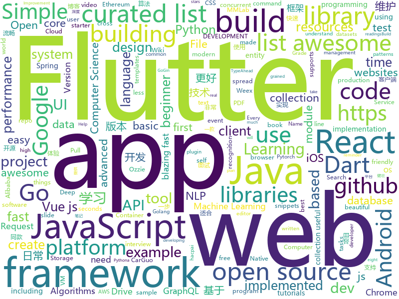

# 2018-10-15
See what the GitHub community is most excited about today.

## python
* [TensorFlow-Course](https://github.com/open-source-for-science/TensorFlow-Course)(**777 stars today**): Simple and ready-to-use tutorials for TensorFlow
* [Python](https://github.com/TheAlgorithms/Python)(**176 stars today**): All Algorithms implemented in Python
* [responder](https://github.com/kennethreitz/responder)(**136 stars today**): a familiar HTTP Service Framework for Python
* [camelot](https://github.com/socialcopsdev/camelot)(**125 stars today**): Camelot: PDF Table Extraction for Humans
* [Algorithm_Interview_Notes-Chinese](https://github.com/imhuay/Algorithm_Interview_Notes-Chinese)(**107 stars today**): 2018/2019/校招/春招/秋招/算法/机器学习(Machine Learning)/深度学习(Deep Learning)/自然语言处理(NLP)/C/C++/Python/面试笔记
* [mmdetection](https://github.com/open-mmlab/mmdetection)(**112 stars today**): Open MMLab Detection Toolbox
* [mmcv](https://github.com/open-mmlab/mmcv)(**75 stars today**): Open MMLab Computer Vision Foundation
* [system-design-primer](https://github.com/donnemartin/system-design-primer)(**57 stars today**): Learn how to design large-scale systems. Prep for the system design interview. Includes Anki flashcards.
* [models](https://github.com/tensorflow/models)(**36 stars today**): Models and examples built with TensorFlow
* [nonechucks](https://github.com/msamogh/nonechucks)(**50 stars today**): Skip bad items in your PyTorch DataLoader, use Transforms as Filters, and more!
* [awesome-python](https://github.com/vinta/awesome-python)(**42 stars today**): A curated list of awesome Python frameworks, libraries, software and resources
* [youtube-dl](https://github.com/rg3/youtube-dl)(**38 stars today**): Command-line program to download videos from YouTube.com and other video sites
* [ReconDog](https://github.com/s0md3v/ReconDog)(**41 stars today**): Reconnaissance Swiss Army Knife
* [keras](https://github.com/keras-team/keras)(**34 stars today**): Deep Learning for humans
* [awesome-algorithm](https://github.com/apachecn/awesome-algorithm)(**30 stars today**): Leetcode 题解 (跟随思路一步一步撸出代码) 及经典算法实现
* [cpython](https://github.com/python/cpython)(**28 stars today**): The Python programming language
* [google-research](https://github.com/google-research/google-research)(**34 stars today**): Google AI Research
* [entity-recognition-datasets](https://github.com/juand-r/entity-recognition-datasets)(**33 stars today**): A collection of corpora for named entity recognition (NER) and entity recognition tasks. These annotated datasets cover a variety of languages, domains and entity types.
* [medicaltorch](https://github.com/perone/medicaltorch)(**31 stars today**): A medical imaging framework for Pytorch
* [wheelwright](https://github.com/explosion/wheelwright)(**28 stars today**): 🎡Automated build repo for Python wheels
* [public-apis](https://github.com/toddmotto/public-apis)(**25 stars today**): A collective list of public JSON APIs for use in web development.
* [mlcourse.ai](https://github.com/Yorko/mlcourse.ai)(**15 stars today**): Open Machine Learning Course
* [gluoncv-torch](https://github.com/zhanghang1989/gluoncv-torch)(**24 stars today**): PyTorch API for GluonCV Models
* [python-telegram-bot](https://github.com/python-telegram-bot/python-telegram-bot)(**23 stars today**): We have made you a wrapper you can't refuse
* [openlibrary](https://github.com/internetarchive/openlibrary)(**21 stars today**): One webpage for every book ever published!

## java
* [interviews](https://github.com/kdn251/interviews)(**133 stars today**): Everything you need to know to get the job.
* [tink](https://github.com/google/tink)(**131 stars today**): Tink is a multi-language, cross-platform library that provides cryptographic APIs that are secure, easy to use correctly, and hard(er) to misuse.
* [JavaGuide](https://github.com/Snailclimb/JavaGuide)(**56 stars today**): 【Java学习+面试指南】 一份涵盖大部分Java程序员所需要掌握的核心知识。
* [symphony](https://github.com/b3log/symphony)(**36 stars today**): 🎶一款用 Java 实现的现代化社区（论坛/BBS/社交网络/博客）平台。https://hacpai.com
* [proxyee-down](https://github.com/proxyee-down-org/proxyee-down)(**48 stars today**): http下载工具，基于http代理，支持多连接分块下载
* [MVVMHabit](https://github.com/goldze/MVVMHabit)(**42 stars today**): 基于谷歌最新AAC架构，MVVM设计模式的一套快速开发库，整合Okhttp+RxJava+Retrofit+Glide等主流模块，满足日常开发需求。使用该框架可以快速开发一个健壮、易维护的Android应用。
* [spring-boot](https://github.com/spring-projects/spring-boot)(**30 stars today**): Spring Boot
* [JCSprout](https://github.com/crossoverJie/JCSprout)(**29 stars today**): 👨‍🎓Java Core Sprout : basic, concurrent, algorithm
* [brigadier](https://github.com/Mojang/brigadier)(**25 stars today**): Brigadier is a command parser & dispatcher, designed and developed for Minecraft: Java Edition.
* [java-design-patterns](https://github.com/iluwatar/java-design-patterns)(**21 stars today**): Design patterns implemented in Java
* [Hunter](https://github.com/Leaking/Hunter)(**25 stars today**): A fast, incremental, concurrent framework to develop compile plugin for android project
* [Java](https://github.com/TheAlgorithms/Java)(**20 stars today**): All Algorithms implemented in Java
* [tutorials](https://github.com/eugenp/tutorials)(**13 stars today**): The "REST With Spring" Course:
* [elasticsearch](https://github.com/elastic/elasticsearch)(**16 stars today**): Open Source, Distributed, RESTful Search Engine
* [RxJava](https://github.com/ReactiveX/RxJava)(**19 stars today**): RxJava – Reactive Extensions for the JVM – a library for composing asynchronous and event-based programs using observable sequences for the Java VM.
* [spring-framework](https://github.com/spring-projects/spring-framework)(**13 stars today**): Spring Framework
* [testcontainers-java](https://github.com/testcontainers/testcontainers-java)(**15 stars today**): Testcontainers is a Java library that supports JUnit tests, providing lightweight, throwaway instances of common databases, Selenium web browsers, or anything else that can run in a Docker container.
* [solo](https://github.com/b3log/solo)(**12 stars today**): 🎸一款小而美的 Java 博客系统。https://hacpai.com/tag/solo
* [guava](https://github.com/google/guava)(**14 stars today**): Google core libraries for Java
* [Java](https://github.com/DuGuQiuBai/Java)(**11 stars today**): 27天成为Java大神
* [incubator-dubbo](https://github.com/apache/incubator-dubbo)(**9 stars today**): Apache Dubbo (incubating) is a high-performance, java based, open source RPC framework.
* [arthas](https://github.com/alibaba/arthas)(**10 stars today**): Alibaba Java Diagnostic Tool Arthas/Alibaba Java诊断利器Arthas
* [okhttp](https://github.com/square/okhttp)(**11 stars today**): An HTTP+HTTP/2 client for Android and Java applications.
* [lottie-android](https://github.com/airbnb/lottie-android)(**10 stars today**): Render After Effects animations natively on Android and iOS, Web, and React Native
* [Magisk](https://github.com/topjohnwu/Magisk)(**11 stars today**): A Magic Mask to Alter Android System Systemless-ly

## unknown
* [weekly](https://github.com/ruanyf/weekly)(**146 stars today**): 技术分享周刊，每周五发布
* [first-contributions](https://github.com/firstcontributions/first-contributions)(**49 stars today**): 🚀✨Help beginners to contribute to open source projects
* [developer-roadmap](https://github.com/kamranahmedse/developer-roadmap)(**92 stars today**): Roadmap to becoming a web developer in 2018
* [awesome](https://github.com/sindresorhus/awesome)(**51 stars today**): 😎Curated list of awesome lists
* [CS-Notes](https://github.com/CyC2018/CS-Notes)(**43 stars today**): 📚Computer Science Learning Notes
* [gitignore](https://github.com/github/gitignore)(**36 stars today**): A collection of useful .gitignore templates
* [free-programming-books](https://github.com/EbookFoundation/free-programming-books)(**40 stars today**): 📚Freely available programming books
* [awesome-spider](https://github.com/facert/awesome-spider)(**34 stars today**): 爬虫集合
* [coding-interview-university](https://github.com/jwasham/coding-interview-university)(**29 stars today**): A complete computer science study plan to become a software engineer.
* [USBuildingFootprints](https://github.com/Microsoft/USBuildingFootprints)(**31 stars today**): Computer generated building footprints for the United States
* [pwc](https://github.com/zziz/pwc)(**28 stars today**): Papers with code. Sorted by stars. Updated weekly.
* [awesome-vue](https://github.com/vuejs/awesome-vue)(**24 stars today**): 🎉A curated list of awesome things related to Vue.js
* [architect-awesome](https://github.com/xingshaocheng/architect-awesome)(**25 stars today**): 后端架构师技术图谱
* [computer-science](https://github.com/ossu/computer-science)(**22 stars today**): 🎓Path to a free self-taught education in Computer Science!
* [OI-wiki](https://github.com/24OI/OI-wiki)(**21 stars today**): 🌟Wiki for OI / ACM-ICPC. （某大型游戏线上攻略，内含炫酷算术魔法）
* [awesome-for-beginners](https://github.com/MunGell/awesome-for-beginners)(**21 stars today**): A list of awesome beginners-friendly projects.
* [awesome-activitypub](https://github.com/BasixKOR/awesome-activitypub)(**21 stars today**): Awesome list of ActivityPub based projects
* [quick-SQL-cheatsheet](https://github.com/enochtangg/quick-SQL-cheatsheet)(**19 stars today**): A quick reminder of all SQL queries and examples on how to use them.
* [reactjs-interview-questions](https://github.com/sudheerj/reactjs-interview-questions)(**19 stars today**): List of top 222 ReactJS Interview Questions & Answers
* [stanford-cs-229-machine-learning](https://github.com/afshinea/stanford-cs-229-machine-learning)(**18 stars today**): VIP cheatsheets for Stanford's CS 229 Machine Learning
* [build-your-own-x](https://github.com/danistefanovic/build-your-own-x)(**16 stars today**): 🤓Build your own (insert technology here)
* [awesome-deep-learning](https://github.com/ChristosChristofidis/awesome-deep-learning)(**17 stars today**): A curated list of awesome Deep Learning tutorials, projects and communities.
* [awesome-cpp](https://github.com/fffaraz/awesome-cpp)(**16 stars today**): A curated list of awesome C++ (or C) frameworks, libraries, resources, and shiny things. Inspired by awesome-... stuff.
* [vuejs-advanced-learning](https://github.com/filrak/vuejs-advanced-learning)(**18 stars today**): A curated list of advanced and/or in-depth learning resources about Vue.js
* [our-stories](https://github.com/svil1502/our-stories)(**18 stars today**): Конкурс «Как я пришёл к программированию»

## javascript
* [graphql.js](https://github.com/f/graphql.js)(**311 stars today**): A Simple and Isomorphic GraphQL Client for JavaScript
* [percollate](https://github.com/danburzo/percollate)(**213 stars today**): 🌐→📖A command-line tool to grab web pages as beautifully formatted PDFs
* [awesome-vscode](https://github.com/viatsko/awesome-vscode)(**138 stars today**): 🎨A curated list of delightful VS Code packages and resources.
* [Advanced-React](https://github.com/wesbos/Advanced-React)(**102 stars today**): Starter Files and Solutions for Full Stack Advanced React and GraphQL
* [30-seconds-of-code](https://github.com/30-seconds/30-seconds-of-code)(**102 stars today**): Curated collection of useful JavaScript snippets that you can understand in 30 seconds or less.
* [carbon](https://github.com/dawnlabs/carbon)(**91 stars today**): 🎨Create and share beautiful images of your source code
* [react](https://github.com/facebook/react)(**61 stars today**): A declarative, efficient, and flexible JavaScript library for building user interfaces.
* [zeu](https://github.com/shzlw/zeu)(**62 stars today**): A JavaScript library for real-time visualization
* [create-react-app](https://github.com/facebook/create-react-app)(**54 stars today**): Create React apps with no build configuration.
* [vue](https://github.com/vuejs/vue)(**51 stars today**): 🖖A progressive, incrementally-adoptable JavaScript framework for building UI on the web.
* [freeCodeCamp](https://github.com/freeCodeCamp/freeCodeCamp)(****): The https://freeCodeCamp.org open source codebase and curriculum. Learn to code for free together with millions of people.
* [tiptap](https://github.com/heyscrumpy/tiptap)(**53 stars today**): A rich-text editor for Vue.js
* [walt](https://github.com/ballercat/walt)(**46 stars today**): ⚡️Walt is a JavaScript-like syntax for WebAssembly text format⚡️
* [muze](https://github.com/chartshq/muze)(**44 stars today**): Composable data visualisation library for web with a data-first approach
* [unstated](https://github.com/jamiebuilds/unstated)(**37 stars today**): State so simple, it goes without saying
* [puppeteer](https://github.com/GoogleChrome/puppeteer)(**34 stars today**): Headless Chrome Node API
* [next.js](https://github.com/zeit/next.js)(**32 stars today**): The React Framework
* [node](https://github.com/nodejs/node)(**24 stars today**): Node.js JavaScript runtime✨🐢🚀✨
* [graphql-engine](https://github.com/hasura/graphql-engine)(**24 stars today**): Blazing fast, instant realtime GraphQL APIs on Postgres with fine grained access control, also trigger webhooks on database events.
* [storybook](https://github.com/storybooks/storybook)(**28 stars today**): Interactive UI component dev & test: React, React Native, Vue, Angular, Ember
* [gridsome](https://github.com/gridsome/gridsome)(**28 stars today**): ⚡️Build blazing fast websites with Vue.js & GraphQL
* [javascript-algorithms](https://github.com/trekhleb/javascript-algorithms)(**24 stars today**): 🤖Algorithms and data structures implemented in JavaScript with explanations and links to further readings
* [gatsby](https://github.com/gatsbyjs/gatsby)(**23 stars today**): Build blazing fast, modern apps and websites with React
* [ganalytics](https://github.com/lukeed/ganalytics)(**26 stars today**): A tiny (323B) client-side module for tracking with Google Analytics
* [three.js](https://github.com/mrdoob/three.js)(**21 stars today**): JavaScript 3D library.

## html
* [hacktoberfest](https://github.com/AliceWonderland/hacktoberfest)(**6 stars today**): Participate in Hacktoberfest by contributing to any Open Source project on GitHub! Here is a starter project for first time contributors. #hacktoberfest
* [hacktoberfest](https://github.com/lingonsaft/hacktoberfest)(**9 stars today**): Hacktoberfest 2018. Don't forget to spread love and if you like give us a⭐️
* [bitcoin-arbitrage-trading-bot](https://github.com/mammuth/bitcoin-arbitrage-trading-bot)(**25 stars today**): Trading bot which exploits price-spreads between cryptocurrency exchanges🔍💸
* [Hacktoberfest-Sign-In](https://github.com/Nguyen17/Hacktoberfest-Sign-In)(**5 stars today**): Beginner friendly. Easy Pull Request! .
* [proposal-intl-relative-time](https://github.com/tc39/proposal-intl-relative-time)(**22 stars today**): `Intl.RelativeTimeFormat` specification [draft]
* [Hacktoberfest-2018](https://github.com/abhilashk433/Hacktoberfest-2018)(**6 stars today**): A repository for beginners to create their first Pull Request.
* [styleguide](https://github.com/google/styleguide)(**11 stars today**): Style guides for Google-originated open-source projects
* [fancy-border-radius](https://github.com/9elements/fancy-border-radius)(**12 stars today**): When you use eight values specifying border-radius in CSS, you can build organic looking shapes. Simply use our Generator at
* [NLP-progress](https://github.com/sebastianruder/NLP-progress)(**11 stars today**): Repository to track the progress in Natural Language Processing (NLP), including the datasets and the current state-of-the-art for the most common NLP tasks.
* [Spoon-Knife](https://github.com/octocat/Spoon-Knife)(****): This repo is for demonstration purposes only.
* [30-seconds-of-css](https://github.com/30-seconds/30-seconds-of-css)(**10 stars today**): A curated collection of useful CSS snippets you can understand in 30 seconds or less.
* [mastering-modular-javascript](https://github.com/mjavascript/mastering-modular-javascript)(**10 stars today**): 📦Module thinking, principles, design patterns and best practices.
* [portainer](https://github.com/portainer/portainer)(**9 stars today**): Simple management UI for Docker
* [electron-api-demos](https://github.com/electron/electron-api-demos)(**8 stars today**): Explore the Electron APIs
* [baselines](https://github.com/openai/baselines)(**7 stars today**): OpenAI Baselines: high-quality implementations of reinforcement learning algorithms
* [react-redux](https://github.com/reduxjs/react-redux)(**8 stars today**): Official React bindings for Redux
* [slide-serve](https://github.com/cdreier/slide-serve)(**8 stars today**): small presentation and dev server for simple slides, based on https://github.com/trikita/slide-html
* [polymer](https://github.com/Polymer/polymer)(**7 stars today**): Build modern apps using web components
* [ctf-wiki](https://github.com/ctf-wiki/ctf-wiki)(**7 stars today**): CTF Wiki Online
* [highcharts](https://github.com/highcharts/highcharts)(**6 stars today**): Highcharts JS, the JavaScript charting framework
* [EIPs](https://github.com/ethereum/EIPs)(**6 stars today**): The Ethereum Improvement Proposal repository
* [ionicons](https://github.com/ionic-team/ionicons)(**6 stars today**): The premium icon font for Ionic Framework and web apps everywhere
* [webgl-fundamentals](https://github.com/greggman/webgl-fundamentals)(**6 stars today**): WebGL lessons that start with the basics
* [foundation-sites](https://github.com/zurb/foundation-sites)(**5 stars today**): The most advanced responsive front-end framework in the world. Quickly create prototypes and production code for sites that work on any kind of device.
* [ecma262](https://github.com/tc39/ecma262)(**5 stars today**): Status, process, and documents for ECMA262

## dart
* [flutter](https://github.com/flutter/flutter)(**36 stars today**): Flutter makes it easy and fast to build beautiful mobile apps.
* [awesome-flutter](https://github.com/Solido/awesome-flutter)(**17 stars today**): An awesome list that curates the best Flutter libraries, tools, tutorials, articles and more.
* [ozzie.flutter](https://github.com/jorgecoca/ozzie.flutter)(**10 stars today**): Ozzie is your testing friend. Ozzie will take an screenshot during integration tests whenever you need.
* [GSYGithubAppFlutter](https://github.com/CarGuo/GSYGithubAppFlutter)(**8 stars today**): 超完整的Flutter项目，功能丰富，适合学习和日常使用。GSYGithubApp系列的优势：我们目前已经拥有Flutter、Weex、ReactNative三个版本。 功能齐全，项目框架内技术涉及面广，完成度高，持续维护，配套文章，适合全面学习，跨框架对比参考。跨平台的开源Github客户端App，更好的体验，更丰富的功能，旨在更好的日常管理和维护个人Github，提供更好更方便的驾车体验～～Σ(￣。￣ﾉ)ﾉ。同款Weex版本 ： https://github.com/CarGuo/GSYGithubAppWeex 、同款React Native版本 ： https://github.com/CarGuo/GSYGithubApp
* [plugins](https://github.com/flutter/plugins)(**6 stars today**): Plugins for Flutter, including FlutterFire, maintained by the Flutter team
* [flutter_architecture_samples](https://github.com/brianegan/flutter_architecture_samples)(**5 stars today**): TodoMVC for Flutter
* [Flutter-learning](https://github.com/AweiLoveAndroid/Flutter-learning)(**5 stars today**): 🔥👍🌟⭐️⭐️⭐️Flutter install&settings,Flutter problems when developing,Flutter sample codes& templates,Flutter projects,Dart languages sample codes
* [samples](https://github.com/flutter/samples)(**5 stars today**): A collection of Flutter examples and demos.
* [flutter_typeahead](https://github.com/AbdulRahmanAlHamali/flutter_typeahead)(****): A TypeAhead widget for Flutter, where you can show suggestions to users as they type
* [FlutterPlayground](https://github.com/ibhavikmakwana/FlutterPlayground)(****): Playground app for Flutter
* [get_version](https://github.com/AppleEducate/get_version)(****): A Plugin to get Version Name, Version Code, App ID, App Name and Platform with OS Version.
* [memechat](https://github.com/efortuna/memechat)(****): playing with flutter
* [chromedeveditor](https://github.com/googlearchive/chromedeveditor)(****): Chrome Dev Editor is a developer tool for building apps on the Chrome platform - Chrome Apps and Web Apps, in JavaScript or Dart. (NO LONGER IN ACTIVE DEVELOPMENT)
* [sdk](https://github.com/dart-lang/sdk)(****): The Dart SDK, including the VM, dart2js, core libraries, and more.
* [flutter-osc](https://github.com/yubo725/flutter-osc)(****): 基于Google Flutter的开源中国客户端，支持Android和iOS。
* [flutter-examples](https://github.com/nisrulz/flutter-examples)(****): [Examples] Simple basic isolated apps, for budding flutter devs.
* [Flutter-UI-Kit](https://github.com/iampawan/Flutter-UI-Kit)(****): Flutter app for collection of UI in a UIKit
* [FlutterExampleApps](https://github.com/iampawan/FlutterExampleApps)(****): [Example APPS] Basic Flutter apps, for flutter devs.
* [inKino](https://github.com/roughike/inKino)(****): inKino - A cross platform movie and showtime browser for Finnkino cinemas, made with Flutter.
* [dio](https://github.com/flutterchina/dio)(****): A powerful Http client for Dart, which supports Interceptors, FormData, Request Cancellation, File Downloading, Timeout etc.
* [hauberk](https://github.com/munificent/hauberk)(****): A web-based roguelike written in Dart.
* [zhihu-flutter](https://github.com/HackSoul/zhihu-flutter)(****): Flutter 高仿知乎 UI，非常漂亮，也非常流畅，flutter build apk 或 flutter build ios 之后更流畅
* [angular](https://github.com/dart-lang/angular)(****): Fast and productive web framework provided by Dart
* [StageXL](https://github.com/bp74/StageXL)(****): A fast and universal 2D rendering engine for HTML5 and Dart.
* [dart-sass](https://github.com/sass/dart-sass)(****): A Dart implementation of Sass.

## go
* [illustrated-tls](https://github.com/syncsynchalt/illustrated-tls)(**275 stars today**): The Illustrated TLS Connection: Every byte explained
* [photoprism](https://github.com/photoprism/photoprism)(**260 stars today**): Personal photo management powered by Go and Google TensorFlow
* [kcp-go](https://github.com/xtaci/kcp-go)(**62 stars today**): A Production-Grade Reliable-UDP Library for golang
* [kube-score](https://github.com/zegl/kube-score)(**46 stars today**): Kubernetes object static code analysis
* [gohack](https://github.com/rogpeppe/gohack)(**36 stars today**): Make temporary edits to your Go module dependencies
* [ghw](https://github.com/jaypipes/ghw)(**33 stars today**): Golang hardware discovery/inspection library
* [kubernetes](https://github.com/kubernetes/kubernetes)(**29 stars today**): Production-Grade Container Scheduling and Management
* [awesome-go](https://github.com/avelino/awesome-go)(**30 stars today**): A curated list of awesome Go frameworks, libraries and software
* [go](https://github.com/golang/go)(**26 stars today**): The Go programming language
* [sourcegraph](https://github.com/sourcegraph/sourcegraph)(**27 stars today**): Code search and intelligence, self-hosted and scalable
* [ferret](https://github.com/MontFerret/ferret)(**26 stars today**): Declarative web scraping
* [biscuit](https://github.com/mit-pdos/biscuit)(**23 stars today**): Biscuit research OS
* [rclone](https://github.com/ncw/rclone)(**20 stars today**): "rsync for cloud storage" - Google Drive, Amazon Drive, S3, Dropbox, Backblaze B2, One Drive, Swift, Hubic, Cloudfiles, Google Cloud Storage, Yandex Files
* [terraform](https://github.com/hashicorp/terraform)(**17 stars today**): Terraform is a tool for building, changing, and combining infrastructure safely and efficiently.
* [v2ray-core](https://github.com/v2ray/v2ray-core)(**16 stars today**): A platform for building proxies to bypass network restrictions.
* [syncthing](https://github.com/syncthing/syncthing)(**17 stars today**): Open Source Continuous File Synchronization
* [hugo](https://github.com/gohugoio/hugo)(**16 stars today**): The world’s fastest framework for building websites.
* [fider](https://github.com/getfider/fider)(**17 stars today**): Open platform to collect and prioritize product feedback
* [bloomfilter](https://github.com/httpimp/bloomfilter)(**17 stars today**): bloomfilter.js ported to Go
* [gin](https://github.com/gin-gonic/gin)(**15 stars today**): Gin is a HTTP web framework written in Go (Golang). It features a Martini-like API with much better performance -- up to 40 times faster. If you need smashing performance, get yourself some Gin.
* [prometheus](https://github.com/prometheus/prometheus)(**15 stars today**): The Prometheus monitoring system and time series database.
* [aws-service-operator](https://github.com/awslabs/aws-service-operator)(**15 stars today**): AWS Service Operator allows you to create AWS resources using kubectl.
* [mattermost-server](https://github.com/mattermost/mattermost-server)(**10 stars today**): Open source Slack-alternative in Golang and React - Mattermost
* [go-ethereum](https://github.com/ethereum/go-ethereum)(**12 stars today**): Official Go implementation of the Ethereum protocol
* [echo](https://github.com/labstack/echo)(**13 stars today**): High performance, minimalist Go web framework

## WordCloud

