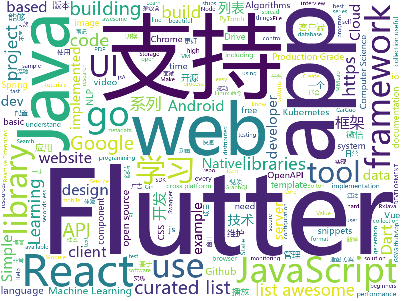

# 2018-10-16
See what the GitHub community is most excited about today.

## python
* [TensorFlow-Course](https://github.com/open-source-for-science/TensorFlow-Course)(**795 stars today**): Simple and ready-to-use tutorials for TensorFlow
* [Python](https://github.com/TheAlgorithms/Python)(**265 stars today**): All Algorithms implemented in Python
* [Algorithm_Interview_Notes-Chinese](https://github.com/imhuay/Algorithm_Interview_Notes-Chinese)(**199 stars today**): 2018/2019/校招/春招/秋招/算法/机器学习(Machine Learning)/深度学习(Deep Learning)/自然语言处理(NLP)/C/C++/Python/面试笔记
* [responder](https://github.com/kennethreitz/responder)(**153 stars today**): a familiar HTTP Service Framework for Python
* [mmdetection](https://github.com/open-mmlab/mmdetection)(**128 stars today**): Open MMLab Detection Toolbox
* [awesome-algorithm](https://github.com/apachecn/awesome-algorithm)(**111 stars today**): Leetcode 题解 (跟随思路一步一步撸出代码) 及经典算法实现
* [camelot](https://github.com/socialcopsdev/camelot)(**99 stars today**): Camelot: PDF Table Extraction for Humans
* [models](https://github.com/tensorflow/models)(**74 stars today**): Models and examples built with TensorFlow
* [system-design-primer](https://github.com/donnemartin/system-design-primer)(**91 stars today**): Learn how to design large-scale systems. Prep for the system design interview. Includes Anki flashcards.
* [awesome-python](https://github.com/vinta/awesome-python)(**75 stars today**): A curated list of awesome Python frameworks, libraries, software and resources
* [mmcv](https://github.com/open-mmlab/mmcv)(**72 stars today**): Open MMLab Computer Vision Foundation
* [ReconDog](https://github.com/s0md3v/ReconDog)(**57 stars today**): Reconnaissance Swiss Army Knife
* [keras](https://github.com/keras-team/keras)(**48 stars today**): Deep Learning for humans
* [youtube-dl](https://github.com/rg3/youtube-dl)(**47 stars today**): Command-line program to download videos from YouTube.com and other video sites
* [CANalyzat0r](https://github.com/schutzwerk/CANalyzat0r)(**47 stars today**): Security analysis toolkit for proprietary car protocols
* [robotics-rl-srl](https://github.com/araffin/robotics-rl-srl)(**50 stars today**): S-RL Toolbox: Reinforcement Learning (RL) and State Representation Learning (SRL) for Robotics
* [nonechucks](https://github.com/msamogh/nonechucks)(**48 stars today**): Skip bad items in your PyTorch DataLoader, use Transforms as Filters, and more!
* [rethinking-network-pruning](https://github.com/Eric-mingjie/rethinking-network-pruning)(**44 stars today**): Rethinking the Value of Network Pruning (Pytorch)
* [scikit-learn](https://github.com/scikit-learn/scikit-learn)(**30 stars today**): scikit-learn: machine learning in Python
* [public-apis](https://github.com/toddmotto/public-apis)(**39 stars today**): A collective list of public JSON APIs for use in web development.
* [google-research](https://github.com/google-research/google-research)(**35 stars today**): Google AI Research
* [boltons](https://github.com/mahmoud/boltons)(**36 stars today**): 🔩Like builtins, but boltons. Constructs/recipes/snippets that would be handy in the standard library. Nothing like Michael Bolton.
* [mlcourse.ai](https://github.com/Yorko/mlcourse.ai)(**25 stars today**): Open Machine Learning Course
* [Hacktoberfest](https://github.com/Showndarya/Hacktoberfest)(**5 stars today**): A collection of words!⭐️it if you👍it !
* [gluoncv-torch](https://github.com/zhanghang1989/gluoncv-torch)(**34 stars today**): PyTorch API for GluonCV Models

## java
* [interviews](https://github.com/kdn251/interviews)(**179 stars today**): Everything you need to know to get the job.
* [tink](https://github.com/google/tink)(**180 stars today**): Tink is a multi-language, cross-platform library that provides cryptographic APIs that are secure, easy to use correctly, and hard(er) to misuse.
* [JavaGuide](https://github.com/Snailclimb/JavaGuide)(**137 stars today**): 【Java学习+面试指南】 一份涵盖大部分Java程序员所需要掌握的核心知识。
* [MVVMHabit](https://github.com/goldze/MVVMHabit)(**144 stars today**): 基于谷歌最新AAC架构，MVVM设计模式的一套快速开发库，整合Okhttp+RxJava+Retrofit+Glide等主流模块，满足日常开发需求。使用该框架可以快速开发一个健壮、易维护的Android应用。
* [netty-learning-example](https://github.com/sanshengshui/netty-learning-example)(**101 stars today**): Netty实践学习案例，是Netty初学者及核心技术巩固的最佳实践。
* [symphony](https://github.com/b3log/symphony)(**54 stars today**): 🎶一款用 Java 实现的现代化社区（论坛/BBS/社交网络/博客）平台。https://hacpai.com
* [JCSprout](https://github.com/crossoverJie/JCSprout)(**67 stars today**): 👨‍🎓Java Core Sprout : basic, concurrent, algorithm
* [arthas](https://github.com/alibaba/arthas)(**62 stars today**): Alibaba Java Diagnostic Tool Arthas/Alibaba Java诊断利器Arthas
* [java-design-patterns](https://github.com/iluwatar/java-design-patterns)(**52 stars today**): Design patterns implemented in Java
* [proxyee-down](https://github.com/proxyee-down-org/proxyee-down)(**45 stars today**): http下载工具，基于http代理，支持多连接分块下载
* [JJEvent](https://github.com/ccj659/JJEvent)(**46 stars today**): 一个经过充分测试和线上验证的Android客户端自定义数据埋点SDK
* [tutorials](https://github.com/eugenp/tutorials)(**29 stars today**): The "REST With Spring" Course:
* [spring-boot](https://github.com/spring-projects/spring-boot)(**33 stars today**): Spring Boot
* [AndroidAutoSize](https://github.com/JessYanCoding/AndroidAutoSize)(**41 stars today**): 🔥A low-cost Android screen adaptation solution (今日头条屏幕适配方案终极版，一个极低成本的 Android 屏幕适配方案).
* [apollo](https://github.com/ctripcorp/apollo)(**34 stars today**): Apollo（阿波罗）是携程框架部门研发的分布式配置中心，能够集中化管理应用不同环境、不同集群的配置，配置修改后能够实时推送到应用端，并且具备规范的权限、流程治理等特性，适用于微服务配置管理场景。
* [elasticsearch](https://github.com/elastic/elasticsearch)(**34 stars today**): Open Source, Distributed, RESTful Search Engine
* [Sentinel](https://github.com/alibaba/Sentinel)(**28 stars today**): A lightweight flow-control library providing high-available protection and monitoring (高可用防护的流量管理框架)
* [Java](https://github.com/TheAlgorithms/Java)(**34 stars today**): All Algorithms implemented in Java
* [profit](https://github.com/biezhi/profit)(**31 stars today**): 🤔biezhi 在线打赏系统，开启你的要饭生涯。
* [spring-framework](https://github.com/spring-projects/spring-framework)(**24 stars today**): Spring Framework
* [incubator-dubbo](https://github.com/apache/incubator-dubbo)(**23 stars today**): Apache Dubbo (incubating) is a high-performance, java based, open source RPC framework.
* [RxJava](https://github.com/ReactiveX/RxJava)(**28 stars today**): RxJava – Reactive Extensions for the JVM – a library for composing asynchronous and event-based programs using observable sequences for the Java VM.
* [GSYVideoPlayer](https://github.com/CarGuo/GSYVideoPlayer)(**27 stars today**): 视频播放器（IJKplayer、ExoPlayer、MediaPlayer），HTTPS支持，支持弹幕，支持滤镜、水印、gif截图，片头广告、中间广告，多个同时播放，支持基本的拖动，声音、亮度调节，支持边播边缓存，支持视频本身自带rotation的旋转（90,270之类），重力旋转与手动旋转的同步支持，支持列表播放 ，直接添加控件为封面，列表全屏动画，视频加载速度，列表小窗口支持拖动，动画效果，调整比例，多分辨率切换，支持切换播放器，进度条小窗口预览，列表切换详情页面无缝播放，其他一些小动画效果，rtsp、concat、mpeg。项目解析：
* [weixin-java-tools](https://github.com/Wechat-Group/weixin-java-tools)(**27 stars today**): 全能微信Java开发工具包，支持包括微信支付、开放平台、小程序、企业微信/企业号和公众号等的开发
* [Java](https://github.com/DuGuQiuBai/Java)(**27 stars today**): 27天成为Java大神

## unknown
* [weekly](https://github.com/ruanyf/weekly)(**386 stars today**): 技术分享周刊，每周五发布
* [developer-roadmap](https://github.com/kamranahmedse/developer-roadmap)(**150 stars today**): Roadmap to becoming a web developer in 2018
* [first-contributions](https://github.com/firstcontributions/first-contributions)(**50 stars today**): 🚀✨Help beginners to contribute to open source projects
* [awesome](https://github.com/sindresorhus/awesome)(**87 stars today**): 😎Curated list of awesome lists
* [CS-Notes](https://github.com/CyC2018/CS-Notes)(**76 stars today**): 📚Computer Science Learning Notes
* [gitignore](https://github.com/github/gitignore)(**49 stars today**): A collection of useful .gitignore templates
* [awesome-spider](https://github.com/facert/awesome-spider)(**65 stars today**): 爬虫集合
* [coding-interview-university](https://github.com/jwasham/coding-interview-university)(**54 stars today**): A complete computer science study plan to become a software engineer.
* [pwc](https://github.com/zziz/pwc)(**53 stars today**): Papers with code. Sorted by stars. Updated weekly.
* [free-programming-books](https://github.com/EbookFoundation/free-programming-books)(**50 stars today**): 📚Freely available programming books
* [architect-awesome](https://github.com/xingshaocheng/architect-awesome)(**44 stars today**): 后端架构师技术图谱
* [reactjs-interview-questions](https://github.com/sudheerj/reactjs-interview-questions)(**44 stars today**): List of top 222 ReactJS Interview Questions & Answers
* [USBuildingFootprints](https://github.com/Microsoft/USBuildingFootprints)(**44 stars today**): Computer generated building footprints for the United States
* [gold-miner](https://github.com/xitu/gold-miner)(**40 stars today**): 🥇掘金翻译计划，可能是世界最大最好的英译中技术社区，最懂读者和译者的翻译平台：
* [project-based-learning](https://github.com/tuvtran/project-based-learning)(**32 stars today**): Curated list of project-based tutorials
* [kubernetes-the-hard-way](https://github.com/kelseyhightower/kubernetes-the-hard-way)(**31 stars today**): Bootstrap Kubernetes the hard way on Google Cloud Platform. No scripts.
* [awesome-for-beginners](https://github.com/MunGell/awesome-for-beginners)(**27 stars today**): A list of awesome beginners-friendly projects.
* [stanford-cs-229-machine-learning](https://github.com/afshinea/stanford-cs-229-machine-learning)(**24 stars today**): VIP cheatsheets for Stanford's CS 229 Machine Learning
* [awesome-vue](https://github.com/vuejs/awesome-vue)(**24 stars today**): 🎉A curated list of awesome things related to Vue.js
* [computer-science](https://github.com/ossu/computer-science)(**24 stars today**): 🎓Path to a free self-taught education in Computer Science!
* [common](https://github.com/NAVER-CAMPUS-HACKDAY/common)(**26 stars today**): 행사 안내 및 주제 확인
* [Blog](https://github.com/mqyqingfeng/Blog)(**24 stars today**): 冴羽写博客的地方，预计写四个系列：JavaScript深入系列、JavaScript专题系列、ES6系列、React系列。
* [awesome-cpp](https://github.com/fffaraz/awesome-cpp)(**25 stars today**): A curated list of awesome C++ (or C) frameworks, libraries, resources, and shiny things. Inspired by awesome-... stuff.
* [Make-a-Pull-Request](https://github.com/rishabh-bansal/Make-a-Pull-Request)(**6 stars today**): Make a Pull Request
* [quick-SQL-cheatsheet](https://github.com/enochtangg/quick-SQL-cheatsheet)(**23 stars today**): A quick reminder of all SQL queries and examples on how to use them.

## javascript
* [graphql.js](https://github.com/f/graphql.js)(**364 stars today**): A Simple and Isomorphic GraphQL Client for JavaScript
* [30-seconds-of-code](https://github.com/30-seconds/30-seconds-of-code)(**346 stars today**): Curated collection of useful JavaScript snippets that you can understand in 30 seconds or less.
* [33-js-concepts](https://github.com/leonardomso/33-js-concepts)(**324 stars today**): 📜33 concepts every JavaScript developer should know.
* [percollate](https://github.com/danburzo/percollate)(**283 stars today**): 🌐→📖A command-line tool to turn web pages into beautifully formatted PDFs
* [awesome-vscode](https://github.com/viatsko/awesome-vscode)(**185 stars today**): 🎨A curated list of delightful VS Code packages and resources.
* [carbon](https://github.com/dawnlabs/carbon)(**139 stars today**): 🎨Create and share beautiful images of your source code
* [Colorblindly](https://github.com/oftheheadland/Colorblindly)(**137 stars today**): Accessibility tool to help developers understand how colorblind users experience their website.
* [Advanced-React](https://github.com/wesbos/Advanced-React)(**123 stars today**): Starter Files and Solutions for Full Stack Advanced React and GraphQL
* [vue](https://github.com/vuejs/vue)(**95 stars today**): 🖖A progressive, incrementally-adoptable JavaScript framework for building UI on the web.
* [react](https://github.com/facebook/react)(**74 stars today**): A declarative, efficient, and flexible JavaScript library for building user interfaces.
* [create-react-app](https://github.com/facebook/create-react-app)(**69 stars today**): Create React apps with no build configuration.
* [muze](https://github.com/chartshq/muze)(**77 stars today**): Composable data visualisation library for web with a data-first approach
* [tiptap](https://github.com/heyscrumpy/tiptap)(**67 stars today**): A rich-text editor for Vue.js
* [zeu](https://github.com/shzlw/zeu)(**63 stars today**): A JavaScript library for real-time visualization
* [material-ui](https://github.com/mui-org/material-ui)(**50 stars today**): React components that implement Google's Material Design.
* [freeCodeCamp](https://github.com/freeCodeCamp/freeCodeCamp)(****): The https://freeCodeCamp.org open source codebase and curriculum. Learn to code for free together with millions of people.
* [axios](https://github.com/axios/axios)(**49 stars today**): Promise based HTTP client for the browser and node.js
* [react-native](https://github.com/facebook/react-native)(**45 stars today**): A framework for building native apps with React.
* [gatsby](https://github.com/gatsbyjs/gatsby)(**43 stars today**): Build blazing fast, modern apps and websites with React
* [next.js](https://github.com/zeit/next.js)(**45 stars today**): The React Framework
* [puppeteer](https://github.com/GoogleChrome/puppeteer)(**45 stars today**): Headless Chrome Node API
* [javascript-algorithms](https://github.com/trekhleb/javascript-algorithms)(**45 stars today**): 🤖Algorithms and data structures implemented in JavaScript with explanations and links to further readings
* [walt](https://github.com/ballercat/walt)(**48 stars today**): ⚡️Walt is a JavaScript-like syntax for WebAssembly text format⚡️
* [storybook](https://github.com/storybooks/storybook)(**43 stars today**): Interactive UI component dev & test: React, React Native, Vue, Angular, Ember
* [ant-design-pro](https://github.com/ant-design/ant-design-pro)(**41 stars today**): 👨🏻‍💻👩🏻‍💻 Use Ant Design like a Pro!

## html
* [hacktoberfest](https://github.com/lingonsaft/hacktoberfest)(**12 stars today**): Hacktoberfest 2018. Don't forget to spread love and if you like give us a⭐️
* [30-seconds-of-css](https://github.com/30-seconds/30-seconds-of-css)(**33 stars today**): A curated collection of useful CSS snippets you can understand in 30 seconds or less.
* [bitcoin-arbitrage-trading-bot](https://github.com/mammuth/bitcoin-arbitrage-trading-bot)(**32 stars today**): Trading bot which exploits price-spreads between cryptocurrency exchanges🔍💸
* [fancy-border-radius](https://github.com/9elements/fancy-border-radius)(**25 stars today**): When you use eight values specifying border-radius in CSS, you can build organic looking shapes. Simply use our Generator at
* [imglab](https://github.com/NaturalIntelligence/imglab)(**20 stars today**): To speedup and simplify image labeling/ annotation process with multiple supported formats.
* [Spoon-Knife](https://github.com/octocat/Spoon-Knife)(****): This repo is for demonstration purposes only.
* [baselines](https://github.com/openai/baselines)(**18 stars today**): OpenAI Baselines: high-quality implementations of reinforcement learning algorithms
* [react-redux](https://github.com/reduxjs/react-redux)(**16 stars today**): Official React bindings for Redux
* [proposal-intl-relative-time](https://github.com/tc39/proposal-intl-relative-time)(**16 stars today**): `Intl.RelativeTimeFormat` specification [draft]
* [hello](https://github.com/vasanthv/hello)(**15 stars today**): Hello - Video chat that works in most major desktop & mobile browsers.
* [gentelella](https://github.com/puikinsh/gentelella)(**14 stars today**): Free Bootstrap 3 Admin Template
* [JavaScript30](https://github.com/wesbos/JavaScript30)(**9 stars today**): 30 Day Vanilla JS Challenge
* [NLP-progress](https://github.com/sebastianruder/NLP-progress)(**13 stars today**): Repository to track the progress in Natural Language Processing (NLP), including the datasets and the current state-of-the-art for the most common NLP tasks.
* [mastering-modular-javascript](https://github.com/mjavascript/mastering-modular-javascript)(**14 stars today**): 📦Module thinking, principles, design patterns and best practices.
* [swagger-codegen](https://github.com/swagger-api/swagger-codegen)(**10 stars today**): swagger-codegen contains a template-driven engine to generate documentation, API clients and server stubs in different languages by parsing your OpenAPI / Swagger definition.
* [portainer](https://github.com/portainer/portainer)(**12 stars today**): Simple management UI for Docker
* [react-naive-book](https://github.com/huzidaha/react-naive-book)(**12 stars today**): 开源、免费、专业、简单的 React.js 在线教程
* [metascraper](https://github.com/microlinkhq/metascraper)(**12 stars today**): Scrape data from websites using Open Graph metadata, regular HTML metadata, and a series of fallbacks.
* [openapi-generator](https://github.com/OpenAPITools/openapi-generator)(**11 stars today**): OpenAPI Generator allows generation of API client libraries (SDK generation), server stubs, documentation and configuration automatically given an OpenAPI Spec (v2, v3)
* [website](https://github.com/kubernetes/website)(**9 stars today**): Kubernetes website and documentation repo:
* [primeng](https://github.com/primefaces/primeng)(**8 stars today**): UI Components for Angular
* [ecma262](https://github.com/tc39/ecma262)(**9 stars today**): Status, process, and documents for ECMA262
* [pure](https://github.com/pure-css/pure)(**9 stars today**): A set of small, responsive CSS modules that you can use in every web project.
* [linux-command](https://github.com/jaywcjlove/linux-command)(**8 stars today**): Linux命令大全搜索工具，内容包含Linux命令手册、详解、学习、搜集。https://git.io/linux
* [electron-api-demos](https://github.com/electron/electron-api-demos)(**8 stars today**): Explore the Electron APIs

## dart
* [flutter](https://github.com/flutter/flutter)(**69 stars today**): Flutter makes it easy and fast to build beautiful mobile apps.
* [awesome-flutter](https://github.com/Solido/awesome-flutter)(**31 stars today**): An awesome list that curates the best Flutter libraries, tools, tutorials, articles and more.
* [GSYGithubAppFlutter](https://github.com/CarGuo/GSYGithubAppFlutter)(**18 stars today**): 超完整的Flutter项目，功能丰富，适合学习和日常使用。GSYGithubApp系列的优势：我们目前已经拥有Flutter、Weex、ReactNative三个版本。 功能齐全，项目框架内技术涉及面广，完成度高，持续维护，配套文章，适合全面学习，跨框架对比参考。跨平台的开源Github客户端App，更好的体验，更丰富的功能，旨在更好的日常管理和维护个人Github，提供更好更方便的驾车体验～～Σ(￣。￣ﾉ)ﾉ。同款Weex版本 ： https://github.com/CarGuo/GSYGithubAppWeex 、同款React Native版本 ： https://github.com/CarGuo/GSYGithubApp
* [Flutter-Notebook](https://github.com/OpenFlutter/Flutter-Notebook)(**14 stars today**): 日更的FlutterDemo合集，今天你fu了吗
* [plugins](https://github.com/flutter/plugins)(**12 stars today**): Plugins for Flutter, including FlutterFire, maintained by the Flutter team
* [flukit](https://github.com/flutterchina/flukit)(**7 stars today**): A Flutter UI Kit
* [flutter_custom_slider](https://github.com/ZaraclaJ/flutter_custom_slider)(**7 stars today**): 
* [ozzie.flutter](https://github.com/jorgecoca/ozzie.flutter)(**6 stars today**): Ozzie is your testing friend. Ozzie will take an screenshot during integration tests whenever you need.
* [flutter_slidable](https://github.com/letsar/flutter_slidable)(****): A Flutter implementation of slidable list item with directional slide actions.
* [flutter_cached_network_image](https://github.com/renefloor/flutter_cached_network_image)(****): Download, cache and show images in a flutter app
* [flutter-carousel-pro](https://github.com/jlouage/flutter-carousel-pro)(****): Flutter Carousel Pro
* [rxdart](https://github.com/ReactiveX/rxdart)(****): The Reactive Extensions for Dart
* [redux.dart](https://github.com/johnpryan/redux.dart)(****): Redux for Dart
* [chromedeveditor](https://github.com/googlearchive/chromedeveditor)(****): Chrome Dev Editor is a developer tool for building apps on the Chrome platform - Chrome Apps and Web Apps, in JavaScript or Dart. (NO LONGER IN ACTIVE DEVELOPMENT)
* [sdk](https://github.com/dart-lang/sdk)(****): The Dart SDK, including the VM, dart2js, core libraries, and more.
* [flutter-osc](https://github.com/yubo725/flutter-osc)(****): 基于Google Flutter的开源中国客户端，支持Android和iOS。
* [flutter-examples](https://github.com/nisrulz/flutter-examples)(****): [Examples] Simple basic isolated apps, for budding flutter devs.
* [Flutter-UI-Kit](https://github.com/iampawan/Flutter-UI-Kit)(****): Flutter app for collection of UI in a UIKit
* [FlutterExampleApps](https://github.com/iampawan/FlutterExampleApps)(****): [Example APPS] Basic Flutter apps, for flutter devs.
* [flutter_architecture_samples](https://github.com/brianegan/flutter_architecture_samples)(****): TodoMVC for Flutter
* [Flutter-learning](https://github.com/AweiLoveAndroid/Flutter-learning)(****): 🔥👍🌟⭐️⭐️⭐️Flutter install&settings,Flutter problems when developing,Flutter sample codes& templates,Flutter projects,Dart languages sample codes
* [inKino](https://github.com/roughike/inKino)(****): inKino - A cross platform movie and showtime browser for Finnkino cinemas, made with Flutter.
* [dio](https://github.com/flutterchina/dio)(****): A powerful Http client for Dart, which supports Interceptors, FormData, Request Cancellation, File Downloading, Timeout etc.
* [hauberk](https://github.com/munificent/hauberk)(****): A web-based roguelike written in Dart.
* [zhihu-flutter](https://github.com/HackSoul/zhihu-flutter)(****): Flutter 高仿知乎 UI，非常漂亮，也非常流畅，flutter build apk 或 flutter build ios 之后更流畅

## go
* [photoprism](https://github.com/photoprism/photoprism)(**578 stars today**): Personal photo management powered by Go and Google TensorFlow
* [illustrated-tls](https://github.com/syncsynchalt/illustrated-tls)(**293 stars today**): The Illustrated TLS Connection: Every byte explained
* [kcp-go](https://github.com/xtaci/kcp-go)(**64 stars today**): A Production-Grade Reliable-UDP Library for golang
* [awesome-go](https://github.com/avelino/awesome-go)(**50 stars today**): A curated list of awesome Go frameworks, libraries and software
* [hugo](https://github.com/gohugoio/hugo)(**48 stars today**): The world’s fastest framework for building websites.
* [kubernetes](https://github.com/kubernetes/kubernetes)(**40 stars today**): Production-Grade Container Scheduling and Management
* [go](https://github.com/golang/go)(**47 stars today**): The Go programming language
* [kube-score](https://github.com/zegl/kube-score)(**43 stars today**): Kubernetes object static code analysis
* [ghw](https://github.com/jaypipes/ghw)(**38 stars today**): Golang hardware discovery/inspection library
* [ferret](https://github.com/MontFerret/ferret)(**35 stars today**): Declarative web scraping
* [previs](https://github.com/PaulRosset/previs)(**35 stars today**): 🎯Testing your project locally in a clean environment.
* [sourcegraph](https://github.com/sourcegraph/sourcegraph)(**30 stars today**): Code search and intelligence, self-hosted and scalable
* [haxxmap](https://github.com/mrexodia/haxxmap)(**26 stars today**): Some simple go tools to perform a Man-in-the-middle (MITM) attack on your IMAP server in case you forgot your password.
* [prometheus](https://github.com/prometheus/prometheus)(**25 stars today**): The Prometheus monitoring system and time series database.
* [gin](https://github.com/gin-gonic/gin)(**27 stars today**): Gin is a HTTP web framework written in Go (Golang). It features a Martini-like API with much better performance -- up to 40 times faster. If you need smashing performance, get yourself some Gin.
* [istio](https://github.com/istio/istio)(**25 stars today**): Connect, secure, control, and observe services.
* [gonote](https://github.com/xmge/gonote)(**25 stars today**): 欢迎各位gopher一起来完善这份笔记，让更多的人能够了解go，学习go，使用go，热爱go.👍
* [terraform](https://github.com/hashicorp/terraform)(**25 stars today**): Terraform is a tool for building, changing, and combining infrastructure safely and efficiently.
* [kops](https://github.com/kubernetes/kops)(**23 stars today**): Kubernetes Operations (kops) - Production Grade K8s Installation, Upgrades, and Management
* [go-ethereum](https://github.com/ethereum/go-ethereum)(**21 stars today**): Official Go implementation of the Ethereum protocol
* [biscuit](https://github.com/mit-pdos/biscuit)(**25 stars today**): Biscuit research OS
* [rclone](https://github.com/ncw/rclone)(**22 stars today**): "rsync for cloud storage" - Google Drive, Amazon Drive, S3, Dropbox, Backblaze B2, One Drive, Swift, Hubic, Cloudfiles, Google Cloud Storage, Yandex Files
* [caddy](https://github.com/mholt/caddy)(**20 stars today**): Fast, cross-platform HTTP/2 web server with automatic HTTPS
* [tidb](https://github.com/pingcap/tidb)(**21 stars today**): TiDB is a distributed HTAP database compatible with the MySQL protocol
* [traefik](https://github.com/containous/traefik)(**20 stars today**): The Cloud Native Edge Router

## WordCloud

