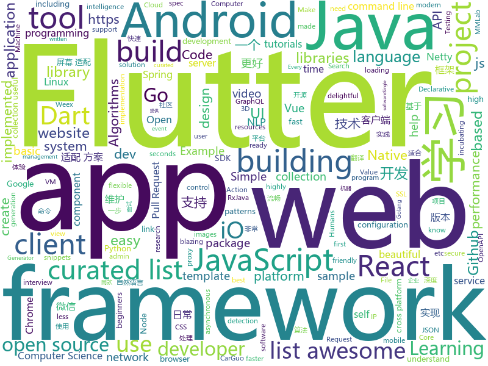

# 2018-10-17
See what the GitHub community is most excited about today.

## python
* [TensorFlow-Course](https://github.com/open-source-for-science/TensorFlow-Course)(**707 stars today**): Simple and ready-to-use tutorials for TensorFlow
* [Python](https://github.com/TheAlgorithms/Python)(**168 stars today**): All Algorithms implemented in Python
* [Algorithm_Interview_Notes-Chinese](https://github.com/imhuay/Algorithm_Interview_Notes-Chinese)(**147 stars today**): 2018/2019/校招/春招/秋招/算法/机器学习(Machine Learning)/深度学习(Deep Learning)/自然语言处理(NLP)/C/C++/Python/面试笔记
* [responder](https://github.com/kennethreitz/responder)(**91 stars today**): a familiar HTTP Service Framework for Python
* [mmdetection](https://github.com/open-mmlab/mmdetection)(**89 stars today**): Open MMLab Detection Toolbox
* [system-design-primer](https://github.com/donnemartin/system-design-primer)(**77 stars today**): Learn how to design large-scale systems. Prep for the system design interview. Includes Anki flashcards.
* [DME](https://github.com/facebookresearch/DME)(**74 stars today**): Dynamic Meta-Embeddings for Improved Sentence Representations
* [models](https://github.com/tensorflow/models)(**49 stars today**): Models and examples built with TensorFlow
* [awesome-python](https://github.com/vinta/awesome-python)(**60 stars today**): A curated list of awesome Python frameworks, libraries, software and resources
* [awesome-algorithm](https://github.com/apachecn/awesome-algorithm)(**52 stars today**): Leetcode 题解 (跟随思路一步一步撸出代码) 及经典算法实现
* [youtube-dl](https://github.com/rg3/youtube-dl)(**54 stars today**): Command-line program to download videos from YouTube.com and other video sites
* [camelot](https://github.com/socialcopsdev/camelot)(**55 stars today**): Camelot: PDF Table Extraction for Humans
* [ja3](https://github.com/salesforce/ja3)(**51 stars today**): JA3 is a standard for creating SSL client fingerprints in an easy to produce and shareable way.
* [mmcv](https://github.com/open-mmlab/mmcv)(**48 stars today**): Open MMLab Computer Vision Foundation
* [keras](https://github.com/keras-team/keras)(**40 stars today**): Deep Learning for humans
* [distroless](https://github.com/GoogleContainerTools/distroless)(**47 stars today**): 🥑Language focused docker images, minus the operating system.
* [rethinking-network-pruning](https://github.com/Eric-mingjie/rethinking-network-pruning)(**44 stars today**): Rethinking the Value of Network Pruning (Pytorch)
* [public-apis](https://github.com/toddmotto/public-apis)(**42 stars today**): A collective list of public JSON APIs for use in web development.
* [home-assistant](https://github.com/home-assistant/home-assistant)(**34 stars today**): 🏡Open source home automation that puts local control and privacy first
* [AiLearning](https://github.com/apachecn/AiLearning)(**34 stars today**): AiLearning: 机器学习 - MachineLearning - ML、深度学习 - DeepLearning - DL、自然语言处理 NLP
* [requests](https://github.com/requests/requests)(**34 stars today**): Python HTTP Requests for Humans™✨🍰✨
* [TIDoS-Framework](https://github.com/theInfectedDrake/TIDoS-Framework)(**35 stars today**): The Offensive Manual Web Application Penetration Testing Framework.
* [Detectron](https://github.com/facebookresearch/Detectron)(**35 stars today**): FAIR's research platform for object detection research, implementing popular algorithms like Mask R-CNN and RetinaNet.
* [mlcourse.ai](https://github.com/Yorko/mlcourse.ai)(**29 stars today**): Open Machine Learning Course
* [flask](https://github.com/pallets/flask)(**32 stars today**): The Python micro framework for building web applications.

## java
* [interviews](https://github.com/kdn251/interviews)(**174 stars today**): Everything you need to know to get the job.
* [JavaGuide](https://github.com/Snailclimb/JavaGuide)(**150 stars today**): 【Java学习+面试指南】 一份涵盖大部分Java程序员所需要掌握的核心知识。
* [MVVMHabit](https://github.com/goldze/MVVMHabit)(**147 stars today**): 基于谷歌最新AAC架构，MVVM设计模式的一套快速开发库，整合Okhttp+RxJava+Retrofit+Glide等主流模块，满足日常开发需求。使用该框架可以快速开发一个健壮、易维护的Android应用。
* [symphony](https://github.com/b3log/symphony)(**72 stars today**): 🎶一款用 Java 实现的现代化社区（论坛/BBS/社交网络/博客）平台。https://hacpai.com
* [proxyee-down](https://github.com/proxyee-down-org/proxyee-down)(**71 stars today**): http下载工具，基于http代理，支持多连接分块下载
* [netty-learning-example](https://github.com/sanshengshui/netty-learning-example)(**59 stars today**): Netty实践学习案例，是Netty初学者及核心技术巩固的最佳实践。
* [JCSprout](https://github.com/crossoverJie/JCSprout)(**55 stars today**): 👨‍🎓Java Core Sprout : basic, concurrent, algorithm
* [tink](https://github.com/google/tink)(**60 stars today**): Tink is a multi-language, cross-platform library that provides cryptographic APIs that are secure, easy to use correctly, and hard(er) to misuse.
* [spring-boot](https://github.com/spring-projects/spring-boot)(**46 stars today**): Spring Boot
* [JJEvent](https://github.com/ccj659/JJEvent)(**46 stars today**): 一个经过充分测试和线上验证的Android客户端自定义数据埋点SDK
* [java-design-patterns](https://github.com/iluwatar/java-design-patterns)(**35 stars today**): Design patterns implemented in Java
* [WheelPicker](https://github.com/zyyoona7/WheelPicker)(**40 stars today**): A smooth, highly customizable wheel view and picker view, support 3D effects like iOS. 一个顺滑的、高度自定义的滚轮控件和选择器，支持类似 iOS 的 3D 效果
* [elasticsearch](https://github.com/elastic/elasticsearch)(**32 stars today**): Open Source, Distributed, RESTful Search Engine
* [arthas](https://github.com/alibaba/arthas)(**38 stars today**): Alibaba Java Diagnostic Tool Arthas/Alibaba Java诊断利器Arthas
* [tutorials](https://github.com/eugenp/tutorials)(**19 stars today**): The "REST With Spring" Course:
* [weixin-java-tools](https://github.com/Wechat-Group/weixin-java-tools)(**34 stars today**): 全能微信Java开发工具包，支持包括微信支付、开放平台、小程序、企业微信/企业号和公众号等的开发
* [incubator-dubbo](https://github.com/apache/incubator-dubbo)(**30 stars today**): Apache Dubbo (incubating) is a high-performance, java based, open source RPC framework.
* [spring-framework](https://github.com/spring-projects/spring-framework)(**24 stars today**): Spring Framework
* [AndroidAutoSize](https://github.com/JessYanCoding/AndroidAutoSize)(**31 stars today**): 🔥A low-cost Android screen adaptation solution (今日头条屏幕适配方案终极版，一个极低成本的 Android 屏幕适配方案).
* [RxJava](https://github.com/ReactiveX/RxJava)(**28 stars today**): RxJava – Reactive Extensions for the JVM – a library for composing asynchronous and event-based programs using observable sequences for the Java VM.
* [netty](https://github.com/netty/netty)(**25 stars today**): Netty project - an event-driven asynchronous network application framework
* [Java](https://github.com/TheAlgorithms/Java)(**23 stars today**): All Algorithms implemented in Java
* [SuspensionWindow](https://github.com/24Kshign/SuspensionWindow)(**26 stars today**): Android悬浮窗实现（含8.0权限适配）
* [okhttp](https://github.com/square/okhttp)(**25 stars today**): An HTTP+HTTP/2 client for Android and Java applications.
* [AndroidUtilCode](https://github.com/Blankj/AndroidUtilCode)(**23 stars today**): 🔥Android developers should collect the following utils(updating).

## unknown
* [git-flight-rules](https://github.com/k88hudson/git-flight-rules)(**1,318 stars today**): Flight rules for git
* [awesome-piracy](https://github.com/Igglybuff/awesome-piracy)(**626 stars today**): A curated list of awesome warez and piracy links
* [weekly](https://github.com/ruanyf/weekly)(**303 stars today**): 技术分享周刊，每周五发布
* [developer-roadmap](https://github.com/kamranahmedse/developer-roadmap)(**158 stars today**): Roadmap to becoming a web developer in 2018
* [awesome](https://github.com/sindresorhus/awesome)(**146 stars today**): 😎Curated list of awesome lists
* [first-contributions](https://github.com/firstcontributions/first-contributions)(**60 stars today**): 🚀✨Help beginners to contribute to open source projects
* [CS-Notes](https://github.com/CyC2018/CS-Notes)(**62 stars today**): 📚Computer Science Learning Notes
* [gitignore](https://github.com/github/gitignore)(**53 stars today**): A collection of useful .gitignore templates
* [free-programming-books](https://github.com/EbookFoundation/free-programming-books)(**59 stars today**): 📚Freely available programming books
* [architect-awesome](https://github.com/xingshaocheng/architect-awesome)(**60 stars today**): 后端架构师技术图谱
* [awesome-vue](https://github.com/vuejs/awesome-vue)(**52 stars today**): 🎉A curated list of awesome things related to Vue.js
* [coding-interview-university](https://github.com/jwasham/coding-interview-university)(**41 stars today**): A complete computer science study plan to become a software engineer.
* [reactjs-interview-questions](https://github.com/sudheerj/reactjs-interview-questions)(**47 stars today**): List of top 222 ReactJS Interview Questions & Answers
* [awesome-spider](https://github.com/facert/awesome-spider)(**37 stars today**): 爬虫集合
* [USBuildingFootprints](https://github.com/Microsoft/USBuildingFootprints)(**37 stars today**): Computer generated building footprints for the United States
* [pwc](https://github.com/zziz/pwc)(**34 stars today**): Papers with code. Sorted by stars. Updated weekly.
* [Make-a-Pull-Request](https://github.com/rishabh-bansal/Make-a-Pull-Request)(**12 stars today**): Make a Pull Request
* [awesome-nodejs](https://github.com/sindresorhus/awesome-nodejs)(**33 stars today**): ⚡️Delightful Node.js packages and resources
* [build-your-own-x](https://github.com/danistefanovic/build-your-own-x)(**33 stars today**): 🤓Build your own (insert technology here)
* [awesome-for-beginners](https://github.com/MunGell/awesome-for-beginners)(**31 stars today**): A list of awesome beginners-friendly projects.
* [project-based-learning](https://github.com/tuvtran/project-based-learning)(**30 stars today**): Curated list of project-based tutorials
* [IPList](https://github.com/DeerCloud/IPList)(**32 stars today**): 📖IP CIDRs List / IP 地址列表
* [gold-miner](https://github.com/xitu/gold-miner)(**27 stars today**): 🥇掘金翻译计划，可能是世界最大最好的英译中技术社区，最懂读者和译者的翻译平台：
* [computer-science](https://github.com/ossu/computer-science)(**26 stars today**): 🎓Path to a free self-taught education in Computer Science!
* [android-architecture](https://github.com/googlesamples/android-architecture)(**23 stars today**): A collection of samples to discuss and showcase different architectural tools and patterns for Android apps.

## javascript
* [33-js-concepts](https://github.com/leonardomso/33-js-concepts)(**3,584 stars today**): 📜33 concepts every JavaScript developer should know.
* [30-seconds-of-code](https://github.com/30-seconds/30-seconds-of-code)(**240 stars today**): Curated collection of useful JavaScript snippets that you can understand in 30 seconds or less.
* [percollate](https://github.com/danburzo/percollate)(**234 stars today**): 🌐→📖A command-line tool to turn web pages into beautifully formatted PDFs
* [graphql.js](https://github.com/f/graphql.js)(**197 stars today**): A Simple and Isomorphic GraphQL Client for JavaScript
* [awesome-vscode](https://github.com/viatsko/awesome-vscode)(**187 stars today**): 🎨A curated list of delightful VS Code packages and resources.
* [react](https://github.com/facebook/react)(**105 stars today**): A declarative, efficient, and flexible JavaScript library for building user interfaces.
* [vue](https://github.com/vuejs/vue)(**102 stars today**): 🖖A progressive, incrementally-adoptable JavaScript framework for building UI on the web.
* [Colorblindly](https://github.com/oftheheadland/Colorblindly)(**92 stars today**): Accessibility tool to help developers understand how colorblind users experience their website.
* [gridsome](https://github.com/gridsome/gridsome)(**87 stars today**): ⚡️Build blazing fast websites with Vue.js & GraphQL
* [create-react-app](https://github.com/facebook/create-react-app)(**74 stars today**): Create React apps with no build configuration.
* [primus-graphql](https://github.com/tjmehta/primus-graphql)(**73 stars today**): A flexible GraphQL client and server library that can be used to power realtime applications.
* [puppeteer](https://github.com/GoogleChrome/puppeteer)(**67 stars today**): Headless Chrome Node API
* [axios](https://github.com/axios/axios)(**66 stars today**): Promise based HTTP client for the browser and node.js
* [carbon](https://github.com/dawnlabs/carbon)(**70 stars today**): 🎨Create and share beautiful images of your source code
* [eth-heap](https://github.com/zmitton/eth-heap)(**66 stars today**): Priority Queue on Ethereum
* [walt](https://github.com/ballercat/walt)(**58 stars today**): ⚡️Walt is a JavaScript-like syntax for WebAssembly text format⚡️
* [vue-content-loader](https://github.com/egoist/vue-content-loader)(**60 stars today**): SVG component to create placeholder loading, like Facebook cards loading.
* [javascript](https://github.com/airbnb/javascript)(**52 stars today**): JavaScript Style Guide
* [storybook](https://github.com/storybooks/storybook)(**53 stars today**): Interactive UI component dev & test: React, React Native, Vue, Angular, Ember
* [javascript-algorithms](https://github.com/trekhleb/javascript-algorithms)(**47 stars today**): 🤖Algorithms and data structures implemented in JavaScript with explanations and links to further readings
* [react-native](https://github.com/facebook/react-native)(**43 stars today**): A framework for building native apps with React.
* [next.js](https://github.com/zeit/next.js)(**44 stars today**): The React Framework
* [Advanced-React](https://github.com/wesbos/Advanced-React)(**39 stars today**): Starter Files and Solutions for Full Stack Advanced React and GraphQL
* [gatsby](https://github.com/gatsbyjs/gatsby)(**42 stars today**): Build blazing fast, modern apps and websites with React
* [incubator-superset](https://github.com/apache/incubator-superset)(**43 stars today**): Apache Superset (incubating) is a modern, enterprise-ready business intelligence web application

## html
* [hacktoberfest](https://github.com/lingonsaft/hacktoberfest)(**13 stars today**): Hacktoberfest 2018. Don't forget to spread love and if you like give us a⭐️
* [Spoon-Knife](https://github.com/octocat/Spoon-Knife)(****): This repo is for demonstration purposes only.
* [hacktoberfest](https://github.com/AliceWonderland/hacktoberfest)(**6 stars today**): Participate in Hacktoberfest by contributing to any Open Source project on GitHub! Here is a starter project for first time contributors. #hacktoberfest
* [Hacktoberfest](https://github.com/DSC-BVP/Hacktoberfest)(**13 stars today**): 
* [hello](https://github.com/vasanthv/hello)(**27 stars today**): Hello - Video chat that works in most major desktop & mobile browsers.
* [30-seconds-of-css](https://github.com/30-seconds/30-seconds-of-css)(**26 stars today**): A curated collection of useful CSS snippets you can understand in 30 seconds or less.
* [fancy-border-radius](https://github.com/9elements/fancy-border-radius)(**26 stars today**): When you use eight values specifying border-radius in CSS, you can build organic looking shapes. Simply use our Generator at
* [JavaScript30](https://github.com/wesbos/JavaScript30)(**14 stars today**): 30 Day Vanilla JS Challenge
* [Hacktoberfest-2018](https://github.com/abhilashk433/Hacktoberfest-2018)(**6 stars today**): A repository for beginners to create their first Pull Request.
* [openapi-generator](https://github.com/OpenAPITools/openapi-generator)(**17 stars today**): OpenAPI Generator allows generation of API client libraries (SDK generation), server stubs, documentation and configuration automatically given an OpenAPI Spec (v2, v3)
* [linux-command](https://github.com/jaywcjlove/linux-command)(**15 stars today**): Linux命令大全搜索工具，内容包含Linux命令手册、详解、学习、搜集。https://git.io/linux
* [primeng](https://github.com/primefaces/primeng)(**12 stars today**): UI Components for Angular
* [Hacktoberfest-Sign-In](https://github.com/Nguyen17/Hacktoberfest-Sign-In)(****): Beginner friendly. Easy Pull Request! .
* [magento-malware-scanner](https://github.com/gwillem/magento-malware-scanner)(**13 stars today**): Scanner, signatures and the largest collection of Magento malware
* [react-redux](https://github.com/reduxjs/react-redux)(**11 stars today**): Official React bindings for Redux
* [portainer](https://github.com/portainer/portainer)(**12 stars today**): Simple management UI for Docker
* [baselines](https://github.com/openai/baselines)(**11 stars today**): OpenAI Baselines: high-quality implementations of reinforcement learning algorithms
* [ctf-wiki](https://github.com/ctf-wiki/ctf-wiki)(**9 stars today**): CTF Wiki Online
* [sketch-measure](https://github.com/utom/sketch-measure)(**10 stars today**): Make it a fun to create spec for developers and teammates
* [electron-api-demos](https://github.com/electron/electron-api-demos)(**9 stars today**): Explore the Electron APIs
* [NLP-progress](https://github.com/sebastianruder/NLP-progress)(**9 stars today**): Repository to track the progress in Natural Language Processing (NLP), including the datasets and the current state-of-the-art for the most common NLP tasks.
* [botfuel-dialog](https://github.com/Botfuel/botfuel-dialog)(**9 stars today**): Botfuel SDK to build highly conversational chatbots
* [gentelella](https://github.com/puikinsh/gentelella)(**7 stars today**): Free Bootstrap 3 Admin Template
* [Adminator-admin-dashboard](https://github.com/puikinsh/Adminator-admin-dashboard)(**7 stars today**): Adminator is a easy to use and well design admin dashboard template for web apps, websites, services and more
* [mastering-modular-javascript](https://github.com/mjavascript/mastering-modular-javascript)(**9 stars today**): 📦Module thinking, principles, design patterns and best practices.

## dart
* [flutter](https://github.com/flutter/flutter)(**66 stars today**): Flutter makes it easy and fast to build beautiful mobile apps.
* [awesome-flutter](https://github.com/Solido/awesome-flutter)(**32 stars today**): An awesome list that curates the best Flutter libraries, tools, tutorials, articles and more.
* [Flutter-Notebook](https://github.com/OpenFlutter/Flutter-Notebook)(**10 stars today**): 日更的FlutterDemo合集，今天你fu了吗
* [GSYGithubAppFlutter](https://github.com/CarGuo/GSYGithubAppFlutter)(**10 stars today**): 超完整的Flutter项目，功能丰富，适合学习和日常使用。GSYGithubApp系列的优势：我们目前已经拥有Flutter、Weex、ReactNative三个版本。 功能齐全，项目框架内技术涉及面广，完成度高，持续维护，配套文章，适合全面学习，跨框架对比参考。跨平台的开源Github客户端App，更好的体验，更丰富的功能，旨在更好的日常管理和维护个人Github，提供更好更方便的驾车体验～～Σ(￣。￣ﾉ)ﾉ。同款Weex版本 ： https://github.com/CarGuo/GSYGithubAppWeex 、同款React Native版本 ： https://github.com/CarGuo/GSYGithubApp
* [plugins](https://github.com/flutter/plugins)(**7 stars today**): Plugins for Flutter, including FlutterFire, maintained by the Flutter team
* [flutter_ScreenUtil](https://github.com/OpenFlutter/flutter_ScreenUtil)(**8 stars today**): flutter 屏幕适配方案
* [flutter_slidable](https://github.com/letsar/flutter_slidable)(**5 stars today**): A Flutter implementation of slidable list item with directional slide actions.
* [xamarin.flutter](https://github.com/adamped/xamarin.flutter)(**5 stars today**): Running Flutter on Xamarin
* [Flutter-UI-Kit](https://github.com/iampawan/Flutter-UI-Kit)(**5 stars today**): Flutter app for collection of UI in a UIKit
* [flutter_architecture_samples](https://github.com/brianegan/flutter_architecture_samples)(**5 stars today**): TodoMVC for Flutter
* [unicornspeeddial](https://github.com/tiagojencmartins/unicornspeeddial)(****): Flutter Floating Action Button with Speed Dial
* [trinity-orientation-2018](https://github.com/matthewtory/trinity-orientation-2018)(****): An app for orientation week at Trinity College, University of Toronto. Made with Flutter
* [googleapis_auth](https://github.com/dart-lang/googleapis_auth)(****): Obtain OAuth 2.0 credentials to access Google APIs
* [site-www](https://github.com/dart-lang/site-www)(****): Source for Dart website
* [jaguar_serializer](https://github.com/Jaguar-dart/jaguar_serializer)(****): Format (JSON, XML, protobuf, mongodb, etc) and platform (server, client) agnostic serialization framework
* [chromedeveditor](https://github.com/googlearchive/chromedeveditor)(****): Chrome Dev Editor is a developer tool for building apps on the Chrome platform - Chrome Apps and Web Apps, in JavaScript or Dart. (NO LONGER IN ACTIVE DEVELOPMENT)
* [sdk](https://github.com/dart-lang/sdk)(****): The Dart SDK, including the VM, dart2js, core libraries, and more.
* [flutter-osc](https://github.com/yubo725/flutter-osc)(****): 基于Google Flutter的开源中国客户端，支持Android和iOS。
* [flutter-examples](https://github.com/nisrulz/flutter-examples)(****): [Examples] Simple basic isolated apps, for budding flutter devs.
* [FlutterExampleApps](https://github.com/iampawan/FlutterExampleApps)(****): [Example APPS] Basic Flutter apps, for flutter devs.
* [Flutter-learning](https://github.com/AweiLoveAndroid/Flutter-learning)(****): 🔥👍🌟⭐️⭐️⭐️Flutter install&settings,Flutter problems when developing,Flutter sample codes& templates,Flutter projects,Dart languages sample codes
* [inKino](https://github.com/roughike/inKino)(****): inKino - A cross platform movie and showtime browser for Finnkino cinemas, made with Flutter.
* [dio](https://github.com/flutterchina/dio)(****): A powerful Http client for Dart, which supports Interceptors, FormData, Request Cancellation, File Downloading, Timeout etc.
* [hauberk](https://github.com/munificent/hauberk)(****): A web-based roguelike written in Dart.
* [zhihu-flutter](https://github.com/HackSoul/zhihu-flutter)(****): Flutter 高仿知乎 UI，非常漂亮，也非常流畅，flutter build apk 或 flutter build ios 之后更流畅

## go
* [photoprism](https://github.com/photoprism/photoprism)(**682 stars today**): Personal photo management powered by Go and Google TensorFlow
* [illustrated-tls](https://github.com/syncsynchalt/illustrated-tls)(**150 stars today**): The Illustrated TLS Connection: Every byte explained
* [previs](https://github.com/PaulRosset/previs)(**86 stars today**): 🎯Testing your project locally in a clean environment.
* [revive](https://github.com/mgechev/revive)(**81 stars today**): 🔥~6x faster, stricter, configurable, extensible, and beautiful drop-in replacement for golint.
* [kubernetes](https://github.com/kubernetes/kubernetes)(**66 stars today**): Production-Grade Container Scheduling and Management
* [awesome-go](https://github.com/avelino/awesome-go)(**65 stars today**): A curated list of awesome Go frameworks, libraries and software
* [ssl-proxy](https://github.com/suyashkumar/ssl-proxy)(**63 stars today**): Single-command SSL reverse proxy with autogenerated certificates (LetsEncrypt, self-signed, provided)
* [brook](https://github.com/txthinking/brook)(**56 stars today**): Brook is a cross-platform(Linux/MacOS/Windows/Android/iOS) proxy/vpn software
* [go](https://github.com/golang/go)(**42 stars today**): The Go programming language
* [gin](https://github.com/gin-gonic/gin)(**39 stars today**): Gin is a HTTP web framework written in Go (Golang). It features a Martini-like API with much better performance -- up to 40 times faster. If you need smashing performance, get yourself some Gin.
* [hugo](https://github.com/gohugoio/hugo)(**36 stars today**): The world’s fastest framework for building websites.
* [istio](https://github.com/istio/istio)(**31 stars today**): Connect, secure, control, and observe services.
* [daze](https://github.com/mohanson/daze)(**29 stars today**): Daze is a tool to help you link to the Internet.
* [prometheus](https://github.com/prometheus/prometheus)(**29 stars today**): The Prometheus monitoring system and time series database.
* [ferret](https://github.com/MontFerret/ferret)(**29 stars today**): Declarative web scraping
* [hcl](https://github.com/hashicorp/hcl)(**29 stars today**): HCL is the HashiCorp configuration language.
* [ghw](https://github.com/jaypipes/ghw)(**29 stars today**): Golang hardware discovery/inspection library
* [beego](https://github.com/astaxie/beego)(**26 stars today**): beego is an open-source, high-performance web framework for the Go programming language.
* [sourcegraph](https://github.com/sourcegraph/sourcegraph)(**27 stars today**): Code search and intelligence, self-hosted and scalable
* [go-cloud](https://github.com/google/go-cloud)(**26 stars today**): A library and tools for open cloud development in Go.
* [v2ray-core](https://github.com/v2ray/v2ray-core)(**22 stars today**): A platform for building proxies to bypass network restrictions.
* [fzf](https://github.com/junegunn/fzf)(**24 stars today**): 🌸A command-line fuzzy finder
* [terraform](https://github.com/hashicorp/terraform)(**23 stars today**): Terraform is a tool for building, changing, and combining infrastructure safely and efficiently.
* [helm](https://github.com/helm/helm)(**21 stars today**): The Kubernetes Package Manager
* [traefik](https://github.com/containous/traefik)(**24 stars today**): The Cloud Native Edge Router

## WordCloud

