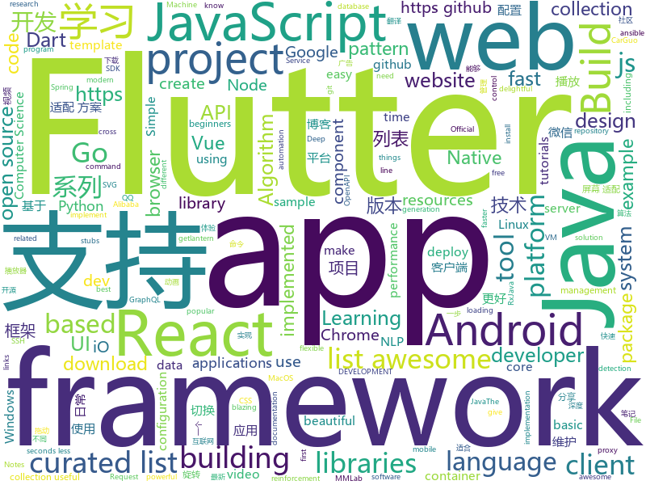

# 2018-10-18
See what the GitHub community is most excited about today.

## python
* [responder](https://github.com/kennethreitz/responder)(**307 stars today**): a familiar HTTP Service Framework for Python
* [TensorFlow-Course](https://github.com/open-source-for-science/TensorFlow-Course)(**286 stars today**): Simple and ready-to-use tutorials for TensorFlow
* [trfl](https://github.com/deepmind/trfl)(**244 stars today**): TensorFlow Reinforcement Learning
* [mmdetection](https://github.com/open-mmlab/mmdetection)(**185 stars today**): Open MMLab Detection Toolbox
* [Python](https://github.com/TheAlgorithms/Python)(**133 stars today**): All Algorithms implemented in Python
* [home-assistant](https://github.com/home-assistant/home-assistant)(**107 stars today**): 🏡Open source home automation that puts local control and privacy first
* [gluon-cv](https://github.com/dmlc/gluon-cv)(**104 stars today**): Gluon CV Toolkit
* [BERT-pytorch](https://github.com/codertimo/BERT-pytorch)(**96 stars today**): Google AI 2018 BERT pytorch implementation
* [models](https://github.com/tensorflow/models)(**68 stars today**): Models and examples built with TensorFlow
* [ansible](https://github.com/ansible/ansible)(**64 stars today**): Ansible is a radically simple IT automation platform that makes your applications and systems easier to deploy. Avoid writing scripts or custom code to deploy and update your applications — automate in a language that approaches plain English, using SSH, with no agents to install on remote systems. https://docs.ansible.com/ansible/
* [Algorithm_Interview_Notes-Chinese](https://github.com/imhuay/Algorithm_Interview_Notes-Chinese)(**64 stars today**): 2018/2019/校招/春招/秋招/算法/机器学习(Machine Learning)/深度学习(Deep Learning)/自然语言处理(NLP)/C/C++/Python/面试笔记
* [system-design-primer](https://github.com/donnemartin/system-design-primer)(**61 stars today**): Learn how to design large-scale systems. Prep for the system design interview. Includes Anki flashcards.
* [awesome-python](https://github.com/vinta/awesome-python)(**52 stars today**): A curated list of awesome Python frameworks, libraries, software and resources
* [SSRFmap](https://github.com/swisskyrepo/SSRFmap)(**55 stars today**): Automatic SSRF fuzzer and exploitation tool
* [Detectron](https://github.com/facebookresearch/Detectron)(**53 stars today**): FAIR's research platform for object detection research, implementing popular algorithms like Mask R-CNN and RetinaNet.
* [chinese-dos-games](https://github.com/rwv/chinese-dos-games)(**54 stars today**): 🎮Chinese DOS games in browser.
* [tencent-ml-images](https://github.com/Tencent/tencent-ml-images)(**55 stars today**): Largest multi-label image database; ResNet-101 model; 80.73% top-1 acc on ImageNet
* [mmcv](https://github.com/open-mmlab/mmcv)(**50 stars today**): Open MMLab Computer Vision Foundation
* [youtube-dl](https://github.com/rg3/youtube-dl)(**47 stars today**): Command-line program to download videos from YouTube.com and other video sites
* [public-apis](https://github.com/toddmotto/public-apis)(**48 stars today**): A collective list of public JSON APIs for use in web development.
* [awesome-algorithm](https://github.com/apachecn/awesome-algorithm)(**46 stars today**): Leetcode 题解 (跟随思路一步一步撸出代码) 及经典算法实现
* [keras](https://github.com/keras-team/keras)(**39 stars today**): Deep Learning for humans
* [Hacktoberfest](https://github.com/Showndarya/Hacktoberfest)(**9 stars today**): A collection of words!⭐️it if you👍it !
* [django](https://github.com/django/django)(**33 stars today**): The Web framework for perfectionists with deadlines.
* [flask](https://github.com/pallets/flask)(**37 stars today**): The Python micro framework for building web applications.

## java
* [interviews](https://github.com/kdn251/interviews)(**157 stars today**): Everything you need to know to get the job.
* [JavaGuide](https://github.com/Snailclimb/JavaGuide)(**128 stars today**): 【Java学习+面试指南】 一份涵盖大部分Java程序员所需要掌握的核心知识。
* [symphony](https://github.com/b3log/symphony)(**83 stars today**): 🎶一款用 Java 实现的现代化社区（论坛/BBS/社交网络/博客）平台。https://hacpai.com
* [proxyee-down](https://github.com/proxyee-down-org/proxyee-down)(**87 stars today**): http下载工具，基于http代理，支持多连接分块下载
* [JCSprout](https://github.com/crossoverJie/JCSprout)(**66 stars today**): 👨‍🎓Java Core Sprout : basic, concurrent, algorithm
* [MVVMHabit](https://github.com/goldze/MVVMHabit)(**71 stars today**): 基于谷歌最新AAC架构，MVVM设计模式的一套快速开发库，整合Okhttp+RxJava+Retrofit+Glide等主流模块，满足日常开发需求。使用该框架可以快速开发一个健壮、易维护的Android应用。
* [elasticsearch](https://github.com/elastic/elasticsearch)(**45 stars today**): Open Source, Distributed, RESTful Search Engine
* [metatron-discovery](https://github.com/metatron-app/metatron-discovery)(**52 stars today**): Powerful & Easy way for big data discovery
* [java-design-patterns](https://github.com/iluwatar/java-design-patterns)(**44 stars today**): Design patterns implemented in Java
* [tutorials](https://github.com/eugenp/tutorials)(**27 stars today**): The "REST With Spring" Course:
* [spring-boot](https://github.com/spring-projects/spring-boot)(**35 stars today**): Spring Boot
* [spring-framework](https://github.com/spring-projects/spring-framework)(**33 stars today**): Spring Framework
* [EasyBle](https://github.com/Ficat/EasyBle)(**40 stars today**): Android BLE framework
* [weixin-java-tools](https://github.com/Wechat-Group/weixin-java-tools)(**35 stars today**): 全能微信Java开发工具包，支持包括微信支付、开放平台、小程序、企业微信/企业号和公众号等的开发
* [arthas](https://github.com/alibaba/arthas)(**33 stars today**): Alibaba Java Diagnostic Tool Arthas/Alibaba Java诊断利器Arthas
* [incubator-dubbo](https://github.com/apache/incubator-dubbo)(**26 stars today**): Apache Dubbo (incubating) is a high-performance, java based, open source RPC framework.
* [retrofit](https://github.com/square/retrofit)(**27 stars today**): Type-safe HTTP client for Android and Java by Square, Inc.
* [AndroidUtilCode](https://github.com/Blankj/AndroidUtilCode)(**25 stars today**): 🔥Android developers should collect the following utils(updating).
* [apollo](https://github.com/ctripcorp/apollo)(**23 stars today**): Apollo（阿波罗）是携程框架部门研发的分布式配置中心，能够集中化管理应用不同环境、不同集群的配置，配置修改后能够实时推送到应用端，并且具备规范的权限、流程治理等特性，适用于微服务配置管理场景。
* [GSYVideoPlayer](https://github.com/CarGuo/GSYVideoPlayer)(**26 stars today**): 视频播放器（IJKplayer、ExoPlayer、MediaPlayer），HTTPS支持，支持弹幕，支持滤镜、水印、gif截图，片头广告、中间广告，多个同时播放，支持基本的拖动，声音、亮度调节，支持边播边缓存，支持视频本身自带rotation的旋转（90,270之类），重力旋转与手动旋转的同步支持，支持列表播放 ，直接添加控件为封面，列表全屏动画，视频加载速度，列表小窗口支持拖动，动画效果，调整比例，多分辨率切换，支持切换播放器，进度条小窗口预览，列表切换详情页面无缝播放，其他一些小动画效果，rtsp、concat、mpeg。项目解析：
* [RxJava](https://github.com/ReactiveX/RxJava)(**26 stars today**): RxJava – Reactive Extensions for the JVM – a library for composing asynchronous and event-based programs using observable sequences for the Java VM.
* [guava](https://github.com/google/guava)(**24 stars today**): Google core libraries for Java
* [blurkit-android](https://github.com/CameraKit/blurkit-android)(**29 stars today**): The missing Android blurring library. Fast blur-behind layout that parallels iOS.
* [Java](https://github.com/TheAlgorithms/Java)(**25 stars today**): All Algorithms implemented in Java
* [AndroidAutoSize](https://github.com/JessYanCoding/AndroidAutoSize)(**26 stars today**): 🔥A low-cost Android screen adaptation solution (今日头条屏幕适配方案终极版，一个极低成本的 Android 屏幕适配方案).

## unknown
* [git-flight-rules](https://github.com/k88hudson/git-flight-rules)(**1,194 stars today**): Flight rules for git
* [awesome-piracy](https://github.com/Igglybuff/awesome-piracy)(**355 stars today**): A curated list of awesome warez and piracy links
* [weekly](https://github.com/ruanyf/weekly)(**243 stars today**): 技术分享周刊，每周五发布
* [developer-roadmap](https://github.com/kamranahmedse/developer-roadmap)(**169 stars today**): Roadmap to becoming a web developer in 2018
* [first-contributions](https://github.com/firstcontributions/first-contributions)(**50 stars today**): 🚀✨Help beginners to contribute to open source projects
* [awesome](https://github.com/sindresorhus/awesome)(**122 stars today**): 😎Curated list of awesome lists
* [stanford-cs-229-machine-learning](https://github.com/afshinea/stanford-cs-229-machine-learning)(**91 stars today**): VIP cheatsheets for Stanford's CS 229 Machine Learning
* [gitignore](https://github.com/github/gitignore)(**50 stars today**): A collection of useful .gitignore templates
* [CS-Notes](https://github.com/CyC2018/CS-Notes)(**54 stars today**): 📚Computer Science Learning Notes
* [free-programming-books](https://github.com/EbookFoundation/free-programming-books)(**49 stars today**): 📚Freely available programming books
* [awesome-spider](https://github.com/facert/awesome-spider)(**44 stars today**): 爬虫集合
* [architect-awesome](https://github.com/xingshaocheng/architect-awesome)(**43 stars today**): 后端架构师技术图谱
* [Blog](https://github.com/mqyqingfeng/Blog)(**38 stars today**): 冴羽写博客的地方，预计写四个系列：JavaScript深入系列、JavaScript专题系列、ES6系列、React系列。
* [coding-interview-university](https://github.com/jwasham/coding-interview-university)(**35 stars today**): A complete computer science study plan to become a software engineer.
* [awesome-vue](https://github.com/vuejs/awesome-vue)(**36 stars today**): 🎉A curated list of awesome things related to Vue.js
* [project-based-learning](https://github.com/tuvtran/project-based-learning)(**36 stars today**): Curated list of project-based tutorials
* [computer-science](https://github.com/ossu/computer-science)(**31 stars today**): 🎓Path to a free self-taught education in Computer Science!
* [gold-miner](https://github.com/xitu/gold-miner)(**32 stars today**): 🥇掘金翻译计划，可能是世界最大最好的英译中技术社区，最懂读者和译者的翻译平台：
* [softs](https://github.com/ldqk/softs)(**27 stars today**): 互联网上仅存的稀缺资源，不收取任何费用，仅用于个人研究和使用，发扬互联网分享精神，专注收藏与分享。
* [A-to-Z-Resources-for-Students](https://github.com/dipakkr/A-to-Z-Resources-for-Students)(**23 stars today**): Curated list of resources for college students If you like give a⭐️
* [awesome-for-beginners](https://github.com/MunGell/awesome-for-beginners)(**27 stars today**): A list of awesome beginners-friendly projects.
* [awesome-cpp](https://github.com/fffaraz/awesome-cpp)(**26 stars today**): A curated list of awesome C++ (or C) frameworks, libraries, resources, and shiny things. Inspired by awesome-... stuff.
* [awesome-datahoarding](https://github.com/simon987/awesome-datahoarding)(**26 stars today**): List of data-hoarding related tools
* [android-architecture](https://github.com/googlesamples/android-architecture)(**24 stars today**): A collection of samples to discuss and showcase different architectural tools and patterns for Android apps.
* [awesome-nodejs](https://github.com/sindresorhus/awesome-nodejs)(**26 stars today**): ⚡️Delightful Node.js packages and resources

## javascript
* [33-js-concepts](https://github.com/leonardomso/33-js-concepts)(**1,673 stars today**): 📜33 concepts every JavaScript developer should know.
* [evergreen](https://github.com/segmentio/evergreen)(**1,245 stars today**): 🌲Evergreen React UI Framework by Segment
* [30-seconds-of-code](https://github.com/30-seconds/30-seconds-of-code)(**158 stars today**): Curated collection of useful JavaScript snippets that you can understand in 30 seconds or less.
* [gridsome](https://github.com/gridsome/gridsome)(**160 stars today**): ⚡️[ALPHA] Build blazing fast websites with Vue.js & GraphQL
* [percollate](https://github.com/danburzo/percollate)(**152 stars today**): 🌐→📖A command-line tool to turn web pages into beautifully formatted PDFs
* [awesome-vscode](https://github.com/viatsko/awesome-vscode)(**148 stars today**): 🎨A curated list of delightful VS Code packages and resources.
* [vue](https://github.com/vuejs/vue)(**120 stars today**): 🖖A progressive, incrementally-adoptable JavaScript framework for building UI on the web.
* [react](https://github.com/facebook/react)(**95 stars today**): A declarative, efficient, and flexible JavaScript library for building user interfaces.
* [create-react-app](https://github.com/facebook/create-react-app)(**80 stars today**): Create React apps with no build configuration.
* [next.js](https://github.com/zeit/next.js)(**75 stars today**): The React Framework
* [nuxt.js](https://github.com/nuxt/nuxt.js)(**77 stars today**): The Vue.js Developers Framework
* [puppeteer](https://github.com/GoogleChrome/puppeteer)(**66 stars today**): Headless Chrome Node API
* [react-native](https://github.com/facebook/react-native)(**63 stars today**): A framework for building native apps with React.
* [axios](https://github.com/axios/axios)(**62 stars today**): Promise based HTTP client for the browser and node.js
* [primus-graphql](https://github.com/tjmehta/primus-graphql)(**61 stars today**): A flexible GraphQL client and server library that can be used to power realtime applications.
* [windows95](https://github.com/felixrieseberg/windows95)(**60 stars today**): 💩🚀Windows 95 in Electron. Runs on macOS, Linux, and Windows.
* [vue-content-loader](https://github.com/egoist/vue-content-loader)(**56 stars today**): SVG component to create placeholder loading, like Facebook cards loading.
* [javascript-algorithms](https://github.com/trekhleb/javascript-algorithms)(**53 stars today**): 🤖Algorithms and data structures implemented in JavaScript with explanations and links to further readings
* [node](https://github.com/nodejs/node)(**50 stars today**): Node.js JavaScript runtime✨🐢🚀✨
* [gatsby](https://github.com/gatsbyjs/gatsby)(**49 stars today**): Build blazing fast, modern apps and websites with React
* [javascript](https://github.com/airbnb/javascript)(**51 stars today**): JavaScript Style Guide
* [Advanced-React](https://github.com/wesbos/Advanced-React)(**42 stars today**): Starter Files and Solutions for Full Stack Advanced React and GraphQL
* [storybook](https://github.com/storybooks/storybook)(**47 stars today**): Interactive UI component dev & test: React, React Native, Vue, Angular, Ember
* [material-ui](https://github.com/mui-org/material-ui)(**36 stars today**): React components that implement Google's Material Design.
* [strapi](https://github.com/strapi/strapi)(**44 stars today**): 🚀Node.js Content Management Framework (headless-CMS) to build powerful API with no effort.

## html
* [NLP-progress](https://github.com/sebastianruder/NLP-progress)(**68 stars today**): Repository to track the progress in Natural Language Processing (NLP), including the datasets and the current state-of-the-art for the most common NLP tasks.
* [hacktoberfest](https://github.com/AliceWonderland/hacktoberfest)(**5 stars today**): Participate in Hacktoberfest by contributing to any Open Source project on GitHub! Here is a starter project for first time contributors. #hacktoberfest
* [hacktoberfest](https://github.com/lingonsaft/hacktoberfest)(**9 stars today**): Hacktoberfest 2018. Don't forget to spread love and if you like give us a⭐️
* [fancy-border-radius](https://github.com/9elements/fancy-border-radius)(**36 stars today**): When you use eight values specifying border-radius in CSS, you can build organic looking shapes. Simply use our Generator at
* [linux-command](https://github.com/jaywcjlove/linux-command)(**31 stars today**): Linux命令大全搜索工具，内容包含Linux命令手册、详解、学习、搜集。https://git.io/linux
* [Hacktoberfest-2018](https://github.com/abhilashk433/Hacktoberfest-2018)(**5 stars today**): A repository for beginners to create their first Pull Request.
* [mastering-modular-javascript](https://github.com/mjavascript/mastering-modular-javascript)(**19 stars today**): 📦Module thinking, principles, design patterns and best practices.
* [baselines](https://github.com/openai/baselines)(**16 stars today**): OpenAI Baselines: high-quality implementations of reinforcement learning algorithms
* [30-seconds-of-css](https://github.com/30-seconds/30-seconds-of-css)(**17 stars today**): A curated collection of useful CSS snippets you can understand in 30 seconds or less.
* [fastai-ml-dl-notes-zh](https://github.com/apachecn/fastai-ml-dl-notes-zh)(**18 stars today**): 📖[译] fast.ai 机器学习和深度学习中文笔记
* [Spoon-Knife](https://github.com/octocat/Spoon-Knife)(****): This repo is for demonstration purposes only.
* [react-redux](https://github.com/reduxjs/react-redux)(**12 stars today**): Official React bindings for Redux
* [swagger-codegen](https://github.com/swagger-api/swagger-codegen)(**12 stars today**): swagger-codegen contains a template-driven engine to generate documentation, API clients and server stubs in different languages by parsing your OpenAPI / Swagger definition.
* [JavaScript30](https://github.com/wesbos/JavaScript30)(**7 stars today**): 30 Day Vanilla JS Challenge
* [hello](https://github.com/vasanthv/hello)(**11 stars today**): Hello - Video chat that works in most major desktop & mobile browsers.
* [portainer](https://github.com/portainer/portainer)(**9 stars today**): Simple management UI for Docker
* [cs231n.github.io](https://github.com/cs231n/cs231n.github.io)(**8 stars today**): Public facing notes page
* [mxgraph](https://github.com/jgraph/mxgraph)(**8 stars today**): mxGraph is a fully client side JavaScript diagramming library
* [openapi-generator](https://github.com/OpenAPITools/openapi-generator)(**8 stars today**): OpenAPI Generator allows generation of API client libraries (SDK generation), server stubs, documentation and configuration automatically given an OpenAPI Spec (v2, v3)
* [simple-icons](https://github.com/simple-icons/simple-icons)(**7 stars today**): SVG icons for popular brands
* [coreui-free-bootstrap-admin-template](https://github.com/coreui/coreui-free-bootstrap-admin-template)(**6 stars today**): CoreUI is free bootstrap admin template
* [patchwork](https://github.com/jlord/patchwork)(****): All the Git-it Workshop completers!
* [ecma262](https://github.com/tc39/ecma262)(**8 stars today**): Status, process, and documents for ECMA262
* [hugo-academic](https://github.com/gcushen/hugo-academic)(**6 stars today**): The website designer for Hugo. Build and deploy a beautiful website in minutes🚀
* [polymer](https://github.com/Polymer/polymer)(**7 stars today**): Build modern apps using web components

## dart
* [flutter](https://github.com/flutter/flutter)(**75 stars today**): Flutter makes it easy and fast to build beautiful mobile apps.
* [awesome-flutter](https://github.com/Solido/awesome-flutter)(**40 stars today**): An awesome list that curates the best Flutter libraries, tools, tutorials, articles and more.
* [GSYGithubAppFlutter](https://github.com/CarGuo/GSYGithubAppFlutter)(**18 stars today**): 超完整的Flutter项目，功能丰富，适合学习和日常使用。GSYGithubApp系列的优势：我们目前已经拥有Flutter、Weex、ReactNative三个版本。 功能齐全，项目框架内技术涉及面广，完成度高，持续维护，配套文章，适合全面学习，跨框架对比参考。跨平台的开源Github客户端App，更好的体验，更丰富的功能，旨在更好的日常管理和维护个人Github，提供更好更方便的驾车体验～～Σ(￣。￣ﾉ)ﾉ。同款Weex版本 ： https://github.com/CarGuo/GSYGithubAppWeex 、同款React Native版本 ： https://github.com/CarGuo/GSYGithubApp
* [plugins](https://github.com/flutter/plugins)(**14 stars today**): Plugins for Flutter, including FlutterFire, maintained by the Flutter team
* [PullToRefresh](https://github.com/OpenFlutter/PullToRefresh)(**13 stars today**): Flutter相关的项目QQ:277155832 Email:277155832@qq.com
* [Flutter-Notebook](https://github.com/OpenFlutter/Flutter-Notebook)(**12 stars today**): 日更的FlutterDemo合集，今天你fu了吗
* [Flutter-UI-Kit](https://github.com/iampawan/Flutter-UI-Kit)(**9 stars today**): Flutter app for collection of UI in a UIKit
* [flutter_architecture_samples](https://github.com/brianegan/flutter_architecture_samples)(**9 stars today**): TodoMVC for Flutter
* [samples](https://github.com/flutter/samples)(**7 stars today**): A collection of Flutter examples and demos.
* [flutter_ScreenUtil](https://github.com/OpenFlutter/flutter_ScreenUtil)(**7 stars today**): flutter 屏幕适配方案
* [flutter_study](https://github.com/luhenchang/flutter_study)(**6 stars today**): 三天学会Flutter
* [bloc](https://github.com/felangel/bloc)(**5 stars today**): The goal of this package is to make it easy to implement the BLoC Design Pattern (Business Logic Component).
* [flutter_crashlytics](https://github.com/kiwi-bop/flutter_crashlytics)(****): 📦Flutter plugin for Crashlytics integration
* [website](https://github.com/flutter/website)(****): Flutter web site
* [dadjokes](https://github.com/timsneath/dadjokes)(****): Awful dad jokes, curated for your pleasure
* [CountryCodePicker](https://github.com/Salvatore-Giordano/CountryCodePicker)(****): A flutter package for showing a country code selector.
* [chromedeveditor](https://github.com/googlearchive/chromedeveditor)(****): Chrome Dev Editor is a developer tool for building apps on the Chrome platform - Chrome Apps and Web Apps, in JavaScript or Dart. (NO LONGER IN ACTIVE DEVELOPMENT)
* [sdk](https://github.com/dart-lang/sdk)(****): The Dart SDK, including the VM, dart2js, core libraries, and more.
* [flutter-osc](https://github.com/yubo725/flutter-osc)(****): 基于Google Flutter的开源中国客户端，支持Android和iOS。
* [flutter-examples](https://github.com/nisrulz/flutter-examples)(****): [Examples] Simple basic isolated apps, for budding flutter devs.
* [FlutterExampleApps](https://github.com/iampawan/FlutterExampleApps)(****): [Example APPS] Basic Flutter apps, for flutter devs.
* [Flutter-learning](https://github.com/AweiLoveAndroid/Flutter-learning)(****): 🔥👍🌟⭐️⭐️⭐️Flutter install&settings,Flutter problems when developing,Flutter sample codes& templates,Flutter projects,Dart languages sample codes
* [inKino](https://github.com/roughike/inKino)(****): inKino - A cross platform movie and showtime browser for Finnkino cinemas, made with Flutter.
* [dio](https://github.com/flutterchina/dio)(****): A powerful Http client for Dart, which supports Interceptors, FormData, Request Cancellation, File Downloading, Timeout etc.
* [hauberk](https://github.com/munificent/hauberk)(****): A web-based roguelike written in Dart.

## go
* [mole](https://github.com/davrodpin/mole)(**339 stars today**): cli app to create ssh tunnels
* [photoprism](https://github.com/photoprism/photoprism)(**280 stars today**): Personal photo management powered by Go and Google TensorFlow
* [AdGuardHome](https://github.com/AdguardTeam/AdGuardHome)(**103 stars today**): Network-wide ads & trackers blocking DNS server
* [illustrated-tls](https://github.com/syncsynchalt/illustrated-tls)(**103 stars today**): The Illustrated TLS Connection: Every byte explained
* [kubernetes](https://github.com/kubernetes/kubernetes)(**59 stars today**): Production-Grade Container Scheduling and Management
* [go](https://github.com/golang/go)(**52 stars today**): The Go programming language
* [BaiduPCS-Go](https://github.com/iikira/BaiduPCS-Go)(**52 stars today**): 百度网盘客户端 - Go语言编写
* [brook](https://github.com/txthinking/brook)(**49 stars today**): Brook is a cross-platform(Linux/MacOS/Windows/Android/iOS) proxy/vpn software
* [awesome-go](https://github.com/avelino/awesome-go)(**46 stars today**): A curated list of awesome Go frameworks, libraries and software
* [hcl](https://github.com/hashicorp/hcl)(**47 stars today**): HCL is the HashiCorp configuration language.
* [pipe](https://github.com/b3log/pipe)(**39 stars today**): 🎷一款小而美的 Go 博客平台。https://hacpai.com/tag/pipe
* [lantern](https://github.com/getlantern/lantern)(**33 stars today**): 🔴蓝灯最新版本下载 https://github.com/getlantern/download🔴Lantern Latest Download https://github.com/getlantern/download🔴
* [terraform](https://github.com/hashicorp/terraform)(**32 stars today**): Terraform is a tool for building, changing, and combining infrastructure safely and efficiently.
* [joker](https://github.com/candid82/joker)(**35 stars today**): Small Clojure interpreter and linter
* [gin](https://github.com/gin-gonic/gin)(**32 stars today**): Gin is a HTTP web framework written in Go (Golang). It features a Martini-like API with much better performance -- up to 40 times faster. If you need smashing performance, get yourself some Gin.
* [go-ethereum](https://github.com/ethereum/go-ethereum)(**31 stars today**): Official Go implementation of the Ethereum protocol
* [previs](https://github.com/PaulRosset/previs)(**31 stars today**): 🎯Testing your project locally in a clean environment.
* [istio](https://github.com/istio/istio)(**29 stars today**): Connect, secure, control, and observe services.
* [moby](https://github.com/moby/moby)(**28 stars today**): Moby Project - a collaborative project for the container ecosystem to assemble container-based systems
* [v2ray-core](https://github.com/v2ray/v2ray-core)(**26 stars today**): A platform for building proxies to bypass network restrictions.
* [traefik](https://github.com/containous/traefik)(**27 stars today**): The Cloud Native Edge Router
* [revive](https://github.com/mgechev/revive)(**28 stars today**): 🔥~6x faster, stricter, configurable, extensible, and beautiful drop-in replacement for golint.
* [hugo](https://github.com/gohugoio/hugo)(**27 stars today**): The world’s fastest framework for building websites.
* [ssl-proxy](https://github.com/suyashkumar/ssl-proxy)(**27 stars today**): Single-command SSL reverse proxy with autogenerated certificates (LetsEncrypt, self-signed, provided)
* [prometheus](https://github.com/prometheus/prometheus)(**25 stars today**): The Prometheus monitoring system and time series database.

## WordCloud

