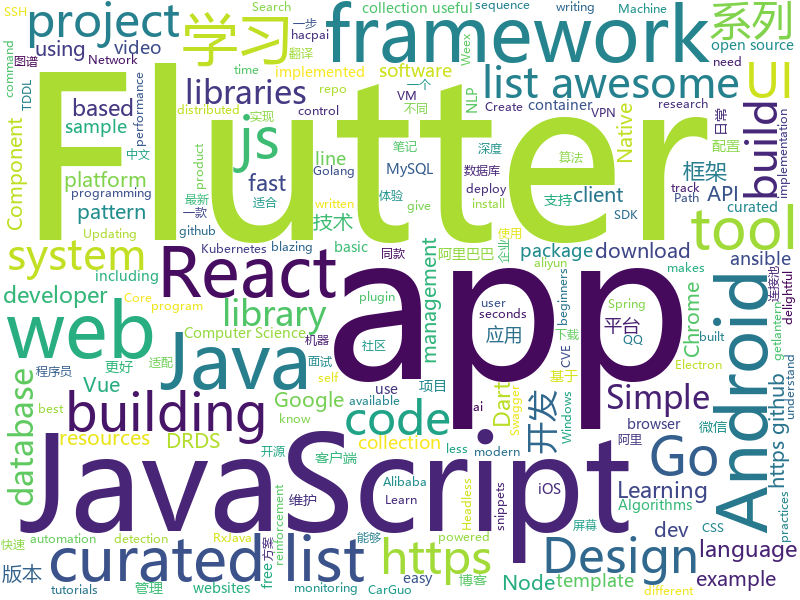

# 2018-10-19
See what the GitHub community is most excited about today.

## python
* [TensorFlow-Course](https://github.com/open-source-for-science/TensorFlow-Course)(**737 stars today**): Simple and ready-to-use tutorials for TensorFlow
* [trfl](https://github.com/deepmind/trfl)(**701 stars today**): TensorFlow Reinforcement Learning
* [tencent-ml-images](https://github.com/Tencent/tencent-ml-images)(**472 stars today**): Largest multi-label image database; ResNet-101 model; 80.73% top-1 acc on ImageNet
* [BERT-pytorch](https://github.com/codertimo/BERT-pytorch)(**279 stars today**): Google AI 2018 BERT pytorch implementation
* [libSSH-Authentication-Bypass](https://github.com/blacknbunny/libSSH-Authentication-Bypass)(**233 stars today**): Spawn to shell without any credentials by using CVE-2018-10933
* [Python](https://github.com/TheAlgorithms/Python)(**215 stars today**): All Algorithms implemented in Python
* [graph_nets](https://github.com/deepmind/graph_nets)(**218 stars today**): Build Graph Nets in Tensorflow
* [mmdetection](https://github.com/open-mmlab/mmdetection)(**122 stars today**): Open MMLab Detection Toolbox
* [responder](https://github.com/kennethreitz/responder)(**125 stars today**): a familiar HTTP Service Framework for Python
* [trellisnet](https://github.com/locuslab/trellisnet)(**121 stars today**): Trellis Networks for Sequence Modeling
* [models](https://github.com/tensorflow/models)(**81 stars today**): Models and examples built with TensorFlow
* [home-assistant](https://github.com/home-assistant/home-assistant)(**84 stars today**): 🏡Open source home automation that puts local control and privacy first
* [poetry](https://github.com/sdispater/poetry)(**77 stars today**): Python dependency management and packaging made easy.
* [Detectron](https://github.com/facebookresearch/Detectron)(**70 stars today**): FAIR's research platform for object detection research, implementing popular algorithms like Mask R-CNN and RetinaNet.
* [system-design-primer](https://github.com/donnemartin/system-design-primer)(**65 stars today**): Learn how to design large-scale systems. Prep for the system design interview. Includes Anki flashcards.
* [Algorithm_Interview_Notes-Chinese](https://github.com/imhuay/Algorithm_Interview_Notes-Chinese)(**66 stars today**): 2018/2019/校招/春招/秋招/算法/机器学习(Machine Learning)/深度学习(Deep Learning)/自然语言处理(NLP)/C/C++/Python/面试笔记
* [CVE-2018-10933](https://github.com/SoledaD208/CVE-2018-10933)(**57 stars today**): CVE-2018-10933 very simple POC
* [awesome-algorithm](https://github.com/apachecn/awesome-algorithm)(**56 stars today**): Leetcode 题解 (跟随思路一步一步撸出代码) 及经典算法实现
* [ansible](https://github.com/ansible/ansible)(**54 stars today**): Ansible is a radically simple IT automation platform that makes your applications and systems easier to deploy. Avoid writing scripts or custom code to deploy and update your applications — automate in a language that approaches plain English, using SSH, with no agents to install on remote systems. https://docs.ansible.com/ansible/
* [gluon-cv](https://github.com/dmlc/gluon-cv)(**59 stars today**): Gluon CV Toolkit
* [youtube-dl](https://github.com/rg3/youtube-dl)(**53 stars today**): Command-line program to download videos from YouTube.com and other video sites
* [SSRFmap](https://github.com/swisskyrepo/SSRFmap)(**56 stars today**): Automatic SSRF fuzzer and exploitation tool
* [keras](https://github.com/keras-team/keras)(**41 stars today**): Deep Learning for humans
* [chinese-dos-games](https://github.com/rwv/chinese-dos-games)(**49 stars today**): 🎮Chinese DOS games in browser.
* [awesome-python](https://github.com/vinta/awesome-python)(****): A curated list of awesome Python frameworks, libraries, software and resources

## java
* [JavaGuide](https://github.com/Snailclimb/JavaGuide)(**123 stars today**): 【Java学习+面试指南】 一份涵盖大部分Java程序员所需要掌握的核心知识。
* [interviews](https://github.com/kdn251/interviews)(**103 stars today**): Everything you need to know to get the job.
* [symphony](https://github.com/b3log/symphony)(**71 stars today**): 🎶一款用 Java 实现的现代化社区（论坛/BBS/社交网络/博客）平台。https://hacpai.com
* [proxyee-down](https://github.com/proxyee-down-org/proxyee-down)(**76 stars today**): http下载工具，基于http代理，支持多连接分块下载
* [java-design-patterns](https://github.com/iluwatar/java-design-patterns)(**63 stars today**): Design patterns implemented in Java
* [JCSprout](https://github.com/crossoverJie/JCSprout)(**59 stars today**): 👨‍🎓Java Core Sprout : basic, concurrent, algorithm
* [spring-boot](https://github.com/spring-projects/spring-boot)(**46 stars today**): Spring Boot
* [tutorials](https://github.com/eugenp/tutorials)(**28 stars today**): The "REST With Spring" Course:
* [arthas](https://github.com/alibaba/arthas)(**46 stars today**): Alibaba Java Diagnostic Tool Arthas/Alibaba Java诊断利器Arthas
* [elasticsearch](https://github.com/elastic/elasticsearch)(**39 stars today**): Open Source, Distributed, RESTful Search Engine
* [helidon](https://github.com/oracle/helidon)(**42 stars today**): Java libraries for writing microservices
* [MVVMHabit](https://github.com/goldze/MVVMHabit)(**40 stars today**): 基于谷歌最新AAC架构，MVVM设计模式的一套快速开发库，整合Okhttp+RxJava+Retrofit+Glide等主流模块，满足日常开发需求。使用该框架可以快速开发一个健壮、易维护的Android应用。
* [blurkit-android](https://github.com/CameraKit/blurkit-android)(**40 stars today**): The missing Android blurring library. Fast blur-behind layout that parallels iOS.
* [spring-framework](https://github.com/spring-projects/spring-framework)(**27 stars today**): Spring Framework
* [apollo](https://github.com/ctripcorp/apollo)(**33 stars today**): Apollo（阿波罗）是携程框架部门研发的分布式配置中心，能够集中化管理应用不同环境、不同集群的配置，配置修改后能够实时推送到应用端，并且具备规范的权限、流程治理等特性，适用于微服务配置管理场景。
* [weixin-java-tools](https://github.com/Wechat-Group/weixin-java-tools)(**27 stars today**): 全能微信Java开发工具包，支持包括微信支付、开放平台、小程序、企业微信/企业号和公众号等的开发
* [AndroidAutoSize](https://github.com/JessYanCoding/AndroidAutoSize)(**31 stars today**): 🔥A low-cost Android screen adaptation solution (今日头条屏幕适配方案终极版，一个极低成本的 Android 屏幕适配方案).
* [AndroidUtilCode](https://github.com/Blankj/AndroidUtilCode)(**29 stars today**): 🔥Android developers should collect the following utils(updating).
* [RxJava](https://github.com/ReactiveX/RxJava)(**26 stars today**): RxJava – Reactive Extensions for the JVM – a library for composing asynchronous and event-based programs using observable sequences for the Java VM.
* [Java](https://github.com/TheAlgorithms/Java)(**23 stars today**): All Algorithms implemented in Java
* [canal](https://github.com/alibaba/canal)(**22 stars today**): 阿里巴巴mysql数据库binlog的增量订阅&消费组件 。阿里云DRDS( https://www.aliyun.com/product/drds )、阿里巴巴TDDL 二级索引、小表复制powerd by canal.
* [retrofit](https://github.com/square/retrofit)(**23 stars today**): Type-safe HTTP client for Android and Java by Square, Inc.
* [druid](https://github.com/alibaba/druid)(**21 stars today**): ♨️为监控而生的数据库连接池！阿里云DRDS(https://www.aliyun.com/product/drds )、阿里巴巴TDDL 连接池powered by Druid
* [hudi](https://github.com/uber/hudi)(**23 stars today**): Spark Library for Hadoop Upserts And Incrementals
* [Sentinel](https://github.com/alibaba/Sentinel)(**19 stars today**): A lightweight flow-control library providing high-available protection and monitoring (高可用防护的流量管理框架)

## unknown
* [git-flight-rules](https://github.com/k88hudson/git-flight-rules)(**639 stars today**): Flight rules for git
* [awesome-piracy](https://github.com/Igglybuff/awesome-piracy)(**335 stars today**): A curated list of awesome warez and piracy links
* [weekly](https://github.com/ruanyf/weekly)(**289 stars today**): 技术分享周刊，每周五发布
* [first-contributions](https://github.com/firstcontributions/first-contributions)(**82 stars today**): 🚀✨Help beginners to contribute to open source projects
* [pwc](https://github.com/zziz/pwc)(**140 stars today**): Papers with code. Sorted by stars. Updated weekly.
* [developer-roadmap](https://github.com/kamranahmedse/developer-roadmap)(**141 stars today**): Roadmap to becoming a web developer in 2018
* [awesome](https://github.com/sindresorhus/awesome)(**79 stars today**): 😎Curated list of awesome lists
* [gitignore](https://github.com/github/gitignore)(**56 stars today**): A collection of useful .gitignore templates
* [CS-Notes](https://github.com/CyC2018/CS-Notes)(**59 stars today**): 📚Computer Science Learning Notes
* [stanford-cs-229-machine-learning](https://github.com/afshinea/stanford-cs-229-machine-learning)(**58 stars today**): VIP cheatsheets for Stanford's CS 229 Machine Learning
* [Make-a-Pull-Request](https://github.com/rishabh-bansal/Make-a-Pull-Request)(**13 stars today**): Make a Pull Request
* [free-programming-books](https://github.com/EbookFoundation/free-programming-books)(**47 stars today**): 📚Freely available programming books
* [coding-interview-university](https://github.com/jwasham/coding-interview-university)(**41 stars today**): A complete computer science study plan to become a software engineer.
* [architect-awesome](https://github.com/xingshaocheng/architect-awesome)(**40 stars today**): 后端架构师技术图谱
* [awesome-vue](https://github.com/vuejs/awesome-vue)(**40 stars today**): 🎉A curated list of awesome things related to Vue.js
* [Cobaltstrike-Trial](https://github.com/microidz/Cobaltstrike-Trial)(**30 stars today**): 
* [computer-science](https://github.com/ossu/computer-science)(**41 stars today**): 🎓Path to a free self-taught education in Computer Science!
* [A-to-Z-Resources-for-Students](https://github.com/dipakkr/A-to-Z-Resources-for-Students)(**21 stars today**): Curated list of resources for college students If you like give a⭐️
* [project-based-learning](https://github.com/tuvtran/project-based-learning)(**36 stars today**): Curated list of project-based tutorials
* [awesome-for-beginners](https://github.com/MunGell/awesome-for-beginners)(**31 stars today**): A list of awesome beginners-friendly projects.
* [awesome-spider](https://github.com/facert/awesome-spider)(**31 stars today**): 爬虫集合
* [android-architecture](https://github.com/googlesamples/android-architecture)(**24 stars today**): A collection of samples to discuss and showcase different architectural tools and patterns for Android apps.
* [Blog](https://github.com/mqyqingfeng/Blog)(**22 stars today**): 冴羽写博客的地方，预计写四个系列：JavaScript深入系列、JavaScript专题系列、ES6系列、React系列。
* [gold-miner](https://github.com/xitu/gold-miner)(**23 stars today**): 🥇掘金翻译计划，可能是世界最大最好的英译中技术社区，最懂读者和译者的翻译平台：
* [awesome-nodejs](https://github.com/sindresorhus/awesome-nodejs)(**21 stars today**): ⚡️Delightful Node.js packages and resources

## javascript
* [33-js-concepts](https://github.com/leonardomso/33-js-concepts)(**1,196 stars today**): 📜33 concepts every JavaScript developer should know.
* [evergreen](https://github.com/segmentio/evergreen)(**440 stars today**): 🌲Evergreen React UI Framework by Segment
* [omi](https://github.com/Tencent/omi)(**387 stars today**): Next generation web framework in 4KB javascript(Web Components + JSX + Proxy + Path Updating)
* [freeCodeCamp](https://github.com/freeCodeCamp/freeCodeCamp)(****): The https://freeCodeCamp.org open source codebase and curriculum. Learn to code for free together with millions of people.
* [30-seconds-of-code](https://github.com/30-seconds/30-seconds-of-code)(**147 stars today**): Curated collection of useful JavaScript snippets that you can understand in 30 seconds or less.
* [gridsome](https://github.com/gridsome/gridsome)(**152 stars today**): ⚡️[WIP] Build blazing fast websites with Vue.js & GraphQL
* [vue](https://github.com/vuejs/vue)(**119 stars today**): 🖖A progressive, incrementally-adoptable JavaScript framework for building UI on the web.
* [awesome-vscode](https://github.com/viatsko/awesome-vscode)(**104 stars today**): 🎨A curated list of delightful VS Code packages and resources.
* [create-react-app](https://github.com/facebook/create-react-app)(**77 stars today**): Create React apps with no build configuration.
* [react](https://github.com/facebook/react)(**80 stars today**): A declarative, efficient, and flexible JavaScript library for building user interfaces.
* [cli](https://github.com/netlify/cli)(**84 stars today**): New Netlify command line tool
* [percollate](https://github.com/danburzo/percollate)(**72 stars today**): 🌐→📖A command-line tool to turn web pages into beautifully formatted PDFs
* [nuxt.js](https://github.com/nuxt/nuxt.js)(**63 stars today**): The Vue.js Developers Framework
* [windows95](https://github.com/felixrieseberg/windows95)(**64 stars today**): 💩🚀Windows 95 in Electron. Runs on macOS, Linux, and Windows.
* [react-native](https://github.com/facebook/react-native)(**55 stars today**): A framework for building native apps with React.
* [puppeteer](https://github.com/GoogleChrome/puppeteer)(**61 stars today**): Headless Chrome Node API
* [walt](https://github.com/ballercat/walt)(**59 stars today**): ⚡️Walt is a JavaScript-like syntax for WebAssembly text format⚡️
* [strapi](https://github.com/strapi/strapi)(**56 stars today**): 🚀Node.js Content Management Framework (headless-CMS) to build powerful API with no effort.
* [storybook](https://github.com/storybooks/storybook)(**52 stars today**): Interactive UI component dev & test: React, React Native, Vue, Angular, Ember
* [javascript](https://github.com/airbnb/javascript)(**48 stars today**): JavaScript Style Guide
* [next.js](https://github.com/zeit/next.js)(**46 stars today**): The React Framework
* [axios](https://github.com/axios/axios)(**47 stars today**): Promise based HTTP client for the browser and node.js
* [node](https://github.com/nodejs/node)(**42 stars today**): Node.js JavaScript runtime✨🐢🚀✨
* [kubebox](https://github.com/astefanutti/kubebox)(**48 stars today**): ⎈❏ Terminal console for Kubernetes clusters
* [gatsby](https://github.com/gatsbyjs/gatsby)(**42 stars today**): Build blazing fast, modern apps and websites with React

## html
* [solving-sol](https://github.com/wholepixel/solving-sol)(**37 stars today**): Implement Sol LeWitt's instructions in JavaScript.
* [hacktoberfest](https://github.com/lingonsaft/hacktoberfest)(**5 stars today**): Hacktoberfest 2018. Don't forget to spread love and if you like give us a⭐️
* [NLP-progress](https://github.com/sebastianruder/NLP-progress)(**32 stars today**): Repository to track the progress in Natural Language Processing (NLP), including the datasets and the current state-of-the-art for the most common NLP tasks.
* [fastai-ml-dl-notes-zh](https://github.com/apachecn/fastai-ml-dl-notes-zh)(**31 stars today**): 📖[译] fast.ai 机器学习和深度学习中文笔记
* [JavaScript30](https://github.com/wesbos/JavaScript30)(**19 stars today**): 30 Day Vanilla JS Challenge
* [fancy-border-radius](https://github.com/9elements/fancy-border-radius)(**28 stars today**): When you use eight values specifying border-radius in CSS, you can build organic looking shapes. Simply use our Generator at
* [mxgraph](https://github.com/jgraph/mxgraph)(**20 stars today**): mxGraph is a fully client side JavaScript diagramming library
* [solid](https://github.com/solid/solid)(**19 stars today**): Solid - Re-decentralizing the web (project directory)
* [chinese-ig](https://github.com/w3c/chinese-ig)(**16 stars today**): Web中文兴趣组
* [Spoon-Knife](https://github.com/octocat/Spoon-Knife)(****): This repo is for demonstration purposes only.
* [30-seconds-of-css](https://github.com/30-seconds/30-seconds-of-css)(**17 stars today**): A curated collection of useful CSS snippets you can understand in 30 seconds or less.
* [baselines](https://github.com/openai/baselines)(**14 stars today**): OpenAI Baselines: high-quality implementations of reinforcement learning algorithms
* [minuku-android](https://github.com/minuku/minuku-android)(**15 stars today**): 
* [react-redux](https://github.com/reduxjs/react-redux)(**13 stars today**): Official React bindings for Redux
* [skill-map](https://github.com/TeamStuQ/skill-map)(**13 stars today**): 程序员技能图谱
* [portainer](https://github.com/portainer/portainer)(**13 stars today**): Simple management UI for Docker
* [mastering-modular-javascript](https://github.com/mjavascript/mastering-modular-javascript)(**12 stars today**): 📦Module thinking, principles, design patterns and best practices.
* [patchwork](https://github.com/jlord/patchwork)(****): All the Git-it Workshop completers!
* [chrome](https://github.com/free-vpn/chrome)(**11 stars today**): VPN Chrome is Google Chromium based browser with built-in VPN capability to let users surf the Internet in a secure and private way.
* [swagger-codegen](https://github.com/swagger-api/swagger-codegen)(**9 stars today**): swagger-codegen contains a template-driven engine to generate documentation, API clients and server stubs in different languages by parsing your OpenAPI / Swagger definition.
* [coreui-free-bootstrap-admin-template](https://github.com/coreui/coreui-free-bootstrap-admin-template)(**10 stars today**): CoreUI is free bootstrap admin template
* [keep-a-changelog](https://github.com/olivierlacan/keep-a-changelog)(**7 stars today**): If you build software, keep a changelog.
* [electron-api-demos](https://github.com/electron/electron-api-demos)(**10 stars today**): Explore the Electron APIs
* [WebFundamentals](https://github.com/google/WebFundamentals)(**10 stars today**): Best practices for modern web development
* [webcomponentsjs](https://github.com/webcomponents/webcomponentsjs)(**10 stars today**): A suite of polyfills supporting the HTML Web Components specs

## dart
* [flutter](https://github.com/flutter/flutter)(**73 stars today**): Flutter makes it easy and fast to build beautiful mobile apps.
* [awesome-flutter](https://github.com/Solido/awesome-flutter)(**33 stars today**): An awesome list that curates the best Flutter libraries, tools, tutorials, articles and more.
* [plugins](https://github.com/flutter/plugins)(**17 stars today**): Plugins for Flutter, including FlutterFire, maintained by the Flutter team
* [Flutter-Notebook](https://github.com/OpenFlutter/Flutter-Notebook)(**17 stars today**): 日更的FlutterDemo合集，今天你fu了吗
* [GSYGithubAppFlutter](https://github.com/CarGuo/GSYGithubAppFlutter)(**14 stars today**): 超完整的Flutter项目，功能丰富，适合学习和日常使用。GSYGithubApp系列的优势：我们目前已经拥有Flutter、Weex、ReactNative三个版本。 功能齐全，项目框架内技术涉及面广，完成度高，持续维护，配套文章，适合全面学习，跨框架对比参考。跨平台的开源Github客户端App，更好的体验，更丰富的功能，旨在更好的日常管理和维护个人Github，提供更好更方便的驾车体验～～Σ(￣。￣ﾉ)ﾉ。同款Weex版本 ： https://github.com/CarGuo/GSYGithubAppWeex 、同款React Native版本 ： https://github.com/CarGuo/GSYGithubApp
* [PullToRefresh](https://github.com/OpenFlutter/PullToRefresh)(**11 stars today**): Flutter相关的项目QQ:277155832 Email:277155832@qq.com
* [flukit](https://github.com/flutterchina/flukit)(**7 stars today**): A Flutter UI Kit
* [CryptoApp](https://github.com/iampawan/CryptoApp)(**6 stars today**): Cryptocurrency App with MVP Design Pattern to track all the coins data in realtime for android & iOS . Written in dart using Flutter SDK.
* [samples](https://github.com/flutter/samples)(**5 stars today**): A collection of Flutter examples and demos.
* [sqflite](https://github.com/tekartik/sqflite)(**5 stars today**): SQLite flutter plugin
* [github-issue-mover](https://github.com/google/github-issue-mover)(****): Making it easy to migrate issues between repos.
* [angular_components](https://github.com/dart-lang/angular_components)(****): The official Material Design components for AngularDart. Used at Google in production apps.
* [dart-protoc-plugin](https://github.com/dart-lang/dart-protoc-plugin)(****): Dart plugin for protobuf compiler (protoc)
* [audio_recorder](https://github.com/ZaraclaJ/audio_recorder)(****): 
* [chewie](https://github.com/brianegan/chewie)(****): The video player for Flutter with a heart of gold
* [dadjokes](https://github.com/timsneath/dadjokes)(****): Awful dad jokes, curated for your pleasure
* [topaz](https://github.com/fuchsia-mirror/topaz)(****): 
* [chromedeveditor](https://github.com/googlearchive/chromedeveditor)(****): Chrome Dev Editor is a developer tool for building apps on the Chrome platform - Chrome Apps and Web Apps, in JavaScript or Dart. (NO LONGER IN ACTIVE DEVELOPMENT)
* [sdk](https://github.com/dart-lang/sdk)(****): The Dart SDK, including the VM, dart2js, core libraries, and more.
* [flutter-osc](https://github.com/yubo725/flutter-osc)(****): 基于Google Flutter的开源中国客户端，支持Android和iOS。
* [flutter-examples](https://github.com/nisrulz/flutter-examples)(****): [Examples] Simple basic isolated apps, for budding flutter devs.
* [Flutter-UI-Kit](https://github.com/iampawan/Flutter-UI-Kit)(****): Flutter app for collection of UI in a UIKit
* [FlutterExampleApps](https://github.com/iampawan/FlutterExampleApps)(****): [Example APPS] Basic Flutter apps, for flutter devs.
* [flutter_architecture_samples](https://github.com/brianegan/flutter_architecture_samples)(****): TodoMVC for Flutter
* [Flutter-learning](https://github.com/AweiLoveAndroid/Flutter-learning)(****): 🔥👍🌟⭐️⭐️⭐️Flutter install&settings,Flutter problems when developing,Flutter sample codes& templates,Flutter projects,Dart languages sample codes

## go
* [mole](https://github.com/davrodpin/mole)(**302 stars today**): cli app to create ssh tunnels
* [photoprism](https://github.com/photoprism/photoprism)(**164 stars today**): Personal photo management powered by Go and Google TensorFlow
* [AdGuardHome](https://github.com/AdguardTeam/AdGuardHome)(**112 stars today**): Network-wide ads & trackers blocking DNS server
* [tableflip](https://github.com/cloudflare/tableflip)(**77 stars today**): Graceful process restarts in Go
* [kubernetes](https://github.com/kubernetes/kubernetes)(**66 stars today**): Production-Grade Container Scheduling and Management
* [illustrated-tls](https://github.com/syncsynchalt/illustrated-tls)(**57 stars today**): The Illustrated TLS Connection: Every byte explained
* [go-ethereum](https://github.com/ethereum/go-ethereum)(**47 stars today**): Official Go implementation of the Ethereum protocol
* [go](https://github.com/golang/go)(**47 stars today**): The Go programming language
* [BaiduPCS-Go](https://github.com/iikira/BaiduPCS-Go)(**41 stars today**): 百度网盘客户端 - Go语言编写
* [awesome-go](https://github.com/avelino/awesome-go)(**40 stars today**): A curated list of awesome Go frameworks, libraries and software
* [ghw](https://github.com/jaypipes/ghw)(**39 stars today**): Golang hardware discovery/inspection library
* [gin](https://github.com/gin-gonic/gin)(**38 stars today**): Gin is a HTTP web framework written in Go (Golang). It features a Martini-like API with much better performance -- up to 40 times faster. If you need smashing performance, get yourself some Gin.
* [helm](https://github.com/helm/helm)(**32 stars today**): The Kubernetes Package Manager
* [pipe](https://github.com/b3log/pipe)(**27 stars today**): 🎷一款小而美的 Go 博客平台。https://hacpai.com/tag/pipe
* [prometheus](https://github.com/prometheus/prometheus)(**30 stars today**): The Prometheus monitoring system and time series database.
* [lantern](https://github.com/getlantern/lantern)(**28 stars today**): 🔴蓝灯最新版本下载 https://github.com/getlantern/download🔴Lantern Latest Download https://github.com/getlantern/download🔴
* [sourcegraph](https://github.com/sourcegraph/sourcegraph)(**28 stars today**): Code search and intelligence, self-hosted and scalable
* [moby](https://github.com/moby/moby)(**24 stars today**): Moby Project - a collaborative project for the container ecosystem to assemble container-based systems
* [hugo](https://github.com/gohugoio/hugo)(**27 stars today**): The world’s fastest framework for building websites.
* [terraform](https://github.com/hashicorp/terraform)(**26 stars today**): Terraform is a tool for building, changing, and combining infrastructure safely and efficiently.
* [migrate](https://github.com/golang-migrate/migrate)(**27 stars today**): Database migrations. CLI and Golang library.
* [vitess](https://github.com/vitessio/vitess)(**24 stars today**): Vitess is a database clustering system for horizontal scaling of MySQL.
* [tidb](https://github.com/pingcap/tidb)(**23 stars today**): TiDB is a distributed HTAP database compatible with the MySQL protocol
* [v2ray-core](https://github.com/v2ray/v2ray-core)(**21 stars today**): A platform for building proxies to bypass network restrictions.
* [traefik](https://github.com/containous/traefik)(**22 stars today**): The Cloud Native Edge Router

## WordCloud

