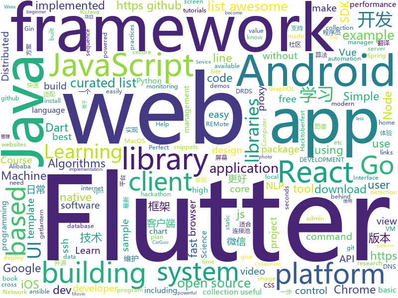

# 2018-10-20
See what the GitHub community is most excited about today.

## python
* [TensorFlow-Course](https://github.com/open-source-for-science/TensorFlow-Course)(**626 stars today**): Simple and ready-to-use tutorials for TensorFlow
* [graph_nets](https://github.com/deepmind/graph_nets)(**647 stars today**): Build Graph Nets in Tensorflow
* [trfl](https://github.com/deepmind/trfl)(**315 stars today**): TensorFlow Reinforcement Learning
* [BERT-pytorch](https://github.com/codertimo/BERT-pytorch)(**245 stars today**): Google AI 2018 BERT pytorch implementation
* [tencent-ml-images](https://github.com/Tencent/tencent-ml-images)(**199 stars today**): Largest multi-label image database; ResNet-101 model; 80.73% top-1 acc on ImageNet
* [Python](https://github.com/TheAlgorithms/Python)(**176 stars today**): All Algorithms implemented in Python
* [libSSH-Authentication-Bypass](https://github.com/blacknbunny/libSSH-Authentication-Bypass)(**98 stars today**): Spawn to shell without any credentials by using CVE-2018-10933
* [models](https://github.com/tensorflow/models)(**78 stars today**): Models and examples built with TensorFlow
* [remi](https://github.com/dddomodossola/remi)(**68 stars today**): Python REMote Interface library. Platform independent. In about 100 Kbytes, perfect for your diet.
* [Detectron](https://github.com/facebookresearch/Detectron)(**63 stars today**): FAIR's research platform for object detection research, implementing popular algorithms like Mask R-CNN and RetinaNet.
* [home-assistant](https://github.com/home-assistant/home-assistant)(**59 stars today**): 🏡Open source home automation that puts local control and privacy first
* [Algorithm_Interview_Notes-Chinese](https://github.com/imhuay/Algorithm_Interview_Notes-Chinese)(**55 stars today**): 2018/2019/校招/春招/秋招/算法/机器学习(Machine Learning)/深度学习(Deep Learning)/自然语言处理(NLP)/C/C++/Python/面试笔记
* [awesome-algorithm](https://github.com/apachecn/awesome-algorithm)(**52 stars today**): Leetcode 题解 (跟随思路一步一步撸出代码) 及经典算法实现
* [system-design-primer](https://github.com/donnemartin/system-design-primer)(**51 stars today**): Learn how to design large-scale systems. Prep for the system design interview. Includes Anki flashcards.
* [mmdetection](https://github.com/open-mmlab/mmdetection)(**48 stars today**): Open MMLab Detection Toolbox
* [camelot](https://github.com/socialcopsdev/camelot)(**47 stars today**): Camelot: PDF Table Extraction for Humans
* [awesome-python](https://github.com/vinta/awesome-python)(**40 stars today**): A curated list of awesome Python frameworks, libraries, software and resources
* [ansible](https://github.com/ansible/ansible)(**34 stars today**): Ansible is a radically simple IT automation platform that makes your applications and systems easier to deploy. Avoid writing scripts or custom code to deploy and update your applications — automate in a language that approaches plain English, using SSH, with no agents to install on remote systems. https://docs.ansible.com/ansible/
* [poetry](https://github.com/sdispater/poetry)(**40 stars today**): Python dependency management and packaging made easy.
* [trellisnet](https://github.com/locuslab/trellisnet)(**40 stars today**): Trellis Networks for Sequence Modeling
* [responder](https://github.com/kennethreitz/responder)(**40 stars today**): a familiar HTTP Service Framework for Python
* [youtube-dl](https://github.com/rg3/youtube-dl)(**37 stars today**): Command-line program to download videos from YouTube.com and other video sites
* [scikit-learn](https://github.com/scikit-learn/scikit-learn)(**29 stars today**): scikit-learn: machine learning in Python
* [django](https://github.com/django/django)(**27 stars today**): The Web framework for perfectionists with deadlines.
* [public-apis](https://github.com/toddmotto/public-apis)(****): A collective list of public JSON APIs for use in web development.

## java
* [JavaGuide](https://github.com/Snailclimb/JavaGuide)(**121 stars today**): 【Java学习+面试指南】 一份涵盖大部分Java程序员所需要掌握的核心知识。
* [symphony](https://github.com/b3log/symphony)(**66 stars today**): 🎶一款用 Java 实现的现代化社区（论坛/BBS/社交网络/博客）平台。https://hacpai.com
* [interviews](https://github.com/kdn251/interviews)(**72 stars today**): Everything you need to know to get the job.
* [JCSprout](https://github.com/crossoverJie/JCSprout)(**49 stars today**): 👨‍🎓Java Core Sprout : basic, concurrent, algorithm
* [spring-boot](https://github.com/spring-projects/spring-boot)(**37 stars today**): Spring Boot
* [java-design-patterns](https://github.com/iluwatar/java-design-patterns)(**42 stars today**): Design patterns implemented in Java
* [subsampling-scale-image-view](https://github.com/davemorrissey/subsampling-scale-image-view)(**46 stars today**): Android library (AAR). Highly configurable, easily extendable deep zoom view for displaying huge images without loss of detail. Perfect for photo galleries, maps, building plans etc.
* [arthas](https://github.com/alibaba/arthas)(**45 stars today**): Alibaba Java Diagnostic Tool Arthas/Alibaba Java诊断利器Arthas
* [elasticsearch](https://github.com/elastic/elasticsearch)(**36 stars today**): Open Source, Distributed, RESTful Search Engine
* [MVVMHabit](https://github.com/goldze/MVVMHabit)(**38 stars today**): 基于谷歌最新AAC架构，MVVM设计模式的一套快速开发库，整合Okhttp+RxJava+Retrofit+Glide等主流模块，满足日常开发需求。使用该框架可以快速开发一个健壮、易维护的Android应用。
* [cosin](https://github.com/chatopera/cosin)(**38 stars today**): 春松客服: 全渠道 智能 客服
* [Java](https://github.com/TheAlgorithms/Java)(**34 stars today**): All Algorithms implemented in Java
* [tutorials](https://github.com/eugenp/tutorials)(**28 stars today**): The "REST With Spring" Course:
* [weixin-java-tools](https://github.com/Wechat-Group/weixin-java-tools)(**32 stars today**): 全能微信Java开发工具包，支持包括微信支付、开放平台、小程序、企业微信/企业号和公众号等的开发
* [incubator-dubbo](https://github.com/apache/incubator-dubbo)(**26 stars today**): Apache Dubbo (incubating) is a high-performance, java based, open source RPC framework.
* [spring-framework](https://github.com/spring-projects/spring-framework)(**23 stars today**): Spring Framework
* [AndroidAutoSize](https://github.com/JessYanCoding/AndroidAutoSize)(**28 stars today**): 🔥A low-cost Android screen adaptation solution (今日头条屏幕适配方案终极版，一个极低成本的 Android 屏幕适配方案).
* [RxJava](https://github.com/ReactiveX/RxJava)(**27 stars today**): RxJava – Reactive Extensions for the JVM – a library for composing asynchronous and event-based programs using observable sequences for the Java VM.
* [druid](https://github.com/alibaba/druid)(**25 stars today**): ♨️为监控而生的数据库连接池！阿里云DRDS(https://www.aliyun.com/product/drds )、阿里巴巴TDDL 连接池powered by Druid
* [okhttp](https://github.com/square/okhttp)(**26 stars today**): An HTTP+HTTP/2 client for Android and Java applications.
* [blurkit-android](https://github.com/CameraKit/blurkit-android)(**27 stars today**): The missing Android blurring library. Fast blur-behind layout that parallels iOS.
* [guava](https://github.com/google/guava)(**24 stars today**): Google core libraries for Java
* [Sentinel](https://github.com/alibaba/Sentinel)(**22 stars today**): A lightweight flow-control library providing high-available protection and monitoring (高可用防护的流量管理框架)
* [MPAndroidChart](https://github.com/PhilJay/MPAndroidChart)(**23 stars today**): A powerful🚀Android chart view / graph view library, supporting line- bar- pie- radar- bubble- and candlestick charts as well as scaling, dragging and animations.
* [retrofit](https://github.com/square/retrofit)(**24 stars today**): Type-safe HTTP client for Android and Java by Square, Inc.

## unknown
* [git-flight-rules](https://github.com/k88hudson/git-flight-rules)(**537 stars today**): Flight rules for git
* [first-contributions](https://github.com/firstcontributions/first-contributions)(**80 stars today**): 🚀✨Help beginners to contribute to open source projects
* [awesome-piracy](https://github.com/Igglybuff/awesome-piracy)(**251 stars today**): A curated list of awesome warez and piracy links
* [weekly](https://github.com/ruanyf/weekly)(**240 stars today**): 技术分享周刊，每周五发布
* [coding-interview-university](https://github.com/jwasham/coding-interview-university)(**135 stars today**): A complete computer science study plan to become a software engineer.
* [pwc](https://github.com/zziz/pwc)(**114 stars today**): Papers with code. Sorted by stars. Updated weekly.
* [Make-a-Pull-Request](https://github.com/rishabh-bansal/Make-a-Pull-Request)(**24 stars today**): Make a Pull Request
* [developer-roadmap](https://github.com/kamranahmedse/developer-roadmap)(**95 stars today**): Roadmap to becoming a web developer in 2018
* [Machine-Learning-Yearning-Korean-Translation](https://github.com/deep-diver/Machine-Learning-Yearning-Korean-Translation)(**72 stars today**): Korean translation of machine learning yearning book by Andrew Ng.
* [awesome](https://github.com/sindresorhus/awesome)(**73 stars today**): 😎Curated list of awesome lists
* [gitignore](https://github.com/github/gitignore)(**44 stars today**): A collection of useful .gitignore templates
* [CS-Notes](https://github.com/CyC2018/CS-Notes)(**56 stars today**): 📚Computer Science Learning Notes
* [free-programming-books](https://github.com/EbookFoundation/free-programming-books)(**53 stars today**): 📚Freely available programming books
* [Company-Names-Corpus](https://github.com/wainshine/Company-Names-Corpus)(**45 stars today**): 公司名语料库。
* [architect-awesome](https://github.com/xingshaocheng/architect-awesome)(**39 stars today**): 后端架构师技术图谱
* [macos-kvm-pci-passthrough](https://github.com/yoonsikp/macos-kvm-pci-passthrough)(**46 stars today**): A macOS virtualization journey
* [Cobaltstrike-Trial](https://github.com/microidz/Cobaltstrike-Trial)(**34 stars today**): 
* [awesome-vue](https://github.com/vuejs/awesome-vue)(**40 stars today**): 🎉A curated list of awesome things related to Vue.js
* [project-based-learning](https://github.com/tuvtran/project-based-learning)(**38 stars today**): Curated list of project-based tutorials
* [A-to-Z-Resources-for-Students](https://github.com/dipakkr/A-to-Z-Resources-for-Students)(**24 stars today**): Curated list of resources for college students If you like give a⭐️
* [gold-miner](https://github.com/xitu/gold-miner)(**37 stars today**): 🥇掘金翻译计划，可能是世界最大最好的英译中技术社区，最懂读者和译者的翻译平台：
* [rfcs](https://github.com/reactjs/rfcs)(**38 stars today**): RFCs for changes to React
* [100-Days-Of-ML-Code](https://github.com/Avik-Jain/100-Days-Of-ML-Code)(**28 stars today**): 100 Days of ML Coding
* [stanford-cs-229-machine-learning](https://github.com/afshinea/stanford-cs-229-machine-learning)(**28 stars today**): VIP cheatsheets for Stanford's CS 229 Machine Learning
* [cobalt_strike_3.12_patch](https://github.com/Lz1y/cobalt_strike_3.12_patch)(**24 stars today**): Cobalt Strike v3.12 patch

## javascript
* [33-js-concepts](https://github.com/leonardomso/33-js-concepts)(**1,278 stars today**): 📜33 concepts every JavaScript developer should know.
* [omi](https://github.com/Tencent/omi)(**539 stars today**): Next generation web framework in 4KB javascript(Web Components + JSX + Proxy + Path Updating)
* [freeCodeCamp](https://github.com/freeCodeCamp/freeCodeCamp)(****): The https://freeCodeCamp.org open source codebase and curriculum. Learn to code for free together with millions of people.
* [graphpack](https://github.com/glennreyes/graphpack)(**240 stars today**): ☄️A minimalistic zero-config GraphQL server.
* [evergreen](https://github.com/segmentio/evergreen)(**202 stars today**): 🌲Evergreen React UI Framework by Segment
* [30-seconds-of-code](https://github.com/30-seconds/30-seconds-of-code)(**116 stars today**): Curated collection of useful JavaScript snippets that you can understand in 30 seconds or less.
* [vue](https://github.com/vuejs/vue)(**112 stars today**): 🖖A progressive, incrementally-adoptable JavaScript framework for building UI on the web.
* [react](https://github.com/facebook/react)(**102 stars today**): A declarative, efficient, and flexible JavaScript library for building user interfaces.
* [percollate](https://github.com/danburzo/percollate)(**96 stars today**): 🌐→📖A command-line tool to turn web pages into beautifully formatted PDFs
* [rete](https://github.com/retejs/rete)(**78 stars today**): JavaScript framework for visual programming and creating node editor
* [create-react-app](https://github.com/facebook/create-react-app)(**63 stars today**): Set up a modern web app by running one command.
* [gridsome](https://github.com/gridsome/gridsome)(**67 stars today**): ⚡️[WIP] Build blazing fast websites with Vue.js & GraphQL
* [axios](https://github.com/axios/axios)(**51 stars today**): Promise based HTTP client for the browser and node.js
* [awesome-mac](https://github.com/jaywcjlove/awesome-mac)(**48 stars today**):  Now we have become very big, Different from the original idea. Collect premium software in various categories.
* [javascript](https://github.com/airbnb/javascript)(**50 stars today**): JavaScript Style Guide
* [puppeteer](https://github.com/GoogleChrome/puppeteer)(**50 stars today**): Headless Chrome Node API
* [galio](https://github.com/galio-org/galio)(**48 stars today**): Something fresh coming soon
* [free-programming-books-zh_CN](https://github.com/justjavac/free-programming-books-zh_CN)(**46 stars today**): 📚免费的计算机编程类中文书籍，欢迎投稿
* [storybook](https://github.com/storybooks/storybook)(**46 stars today**): Interactive UI component dev & test: React, React Native, Vue, Angular, Ember
* [next.js](https://github.com/zeit/next.js)(**45 stars today**): The React Framework
* [javascript-algorithms](https://github.com/trekhleb/javascript-algorithms)(**41 stars today**): 🤖Algorithms and data structures implemented in JavaScript with explanations and links to further readings
* [jsonmc](https://github.com/jsonmc/jsonmc)(**10 stars today**): JSON Movie Collection
* [graphql.js](https://github.com/f/graphql.js)(**45 stars today**): A Simple and Isomorphic GraphQL Client for JavaScript
* [react-native](https://github.com/facebook/react-native)(**41 stars today**): A framework for building native apps with React.
* [webpack-demos](https://github.com/dongyuanxin/webpack-demos)(**43 stars today**): 📦Demos && Courses for Webpack 4

## html
* [mastering-modular-javascript](https://github.com/mjavascript/mastering-modular-javascript)(**120 stars today**): 📦Module thinking, principles, design patterns and best practices.
* [hacktoberfest](https://github.com/lingonsaft/hacktoberfest)(**10 stars today**): Hacktoberfest 2018. Don't forget to spread love and if you like give us a⭐️
* [fancy-border-radius](https://github.com/9elements/fancy-border-radius)(**32 stars today**): When you use eight values specifying border-radius in CSS, you can build organic looking shapes. Simply use our Generator at
* [symfony-hackathon-starter](https://github.com/yemiwebby/symfony-hackathon-starter)(**29 stars today**): A hackathon boilerplate for Symfony web applications. Start your hackathons or web app without hassle.
* [solid](https://github.com/solid/solid)(**19 stars today**): Solid - Re-decentralizing the web (project directory)
* [react-redux](https://github.com/reduxjs/react-redux)(**16 stars today**): Official React bindings for Redux
* [baselines](https://github.com/openai/baselines)(**15 stars today**): OpenAI Baselines: high-quality implementations of reinforcement learning algorithms
* [calculus-made-easy](https://github.com/nadvornix/calculus-made-easy)(**16 stars today**): HTML conversion of great beginner calculus book
* [portainer](https://github.com/portainer/portainer)(**15 stars today**): Simple management UI for Docker
* [datascience-box](https://github.com/rstudio-education/datascience-box)(**14 stars today**): Data Science Course in a Box
* [JavaScript30](https://github.com/wesbos/JavaScript30)(**11 stars today**): 30 Day Vanilla JS Challenge
* [Spoon-Knife](https://github.com/octocat/Spoon-Knife)(****): This repo is for demonstration purposes only.
* [coreui-free-bootstrap-admin-template](https://github.com/coreui/coreui-free-bootstrap-admin-template)(**12 stars today**): CoreUI is free bootstrap admin template
* [skill-map](https://github.com/TeamStuQ/skill-map)(**13 stars today**): 程序员技能图谱
* [pudl](https://github.com/MaedahBatool/pudl)(**12 stars today**): 🐶A JavaScript-based Static Site Generator — for quick static site prototyping.
* [home-assistant.io](https://github.com/home-assistant/home-assistant.io)(**8 stars today**): 📘Home Assistant User documentation
* [chrome](https://github.com/free-vpn/chrome)(**11 stars today**): VPN Chrome is Google Chromium based browser with built-in VPN capability to let users surf the Internet in a secure and private way.
* [gentelella](https://github.com/puikinsh/gentelella)(**10 stars today**): Free Bootstrap 3 Admin Template
* [patchwork](https://github.com/jlord/patchwork)(****): All the Git-it Workshop completers!
* [electron-api-demos](https://github.com/electron/electron-api-demos)(**12 stars today**): Explore the Electron APIs
* [zenbot](https://github.com/DeviaVir/zenbot)(**11 stars today**): Zenbot is a command-line cryptocurrency trading bot using Node.js and MongoDB.
* [NLP-progress](https://github.com/sebastianruder/NLP-progress)(**11 stars today**): Repository to track the progress in Natural Language Processing (NLP), including the datasets and the current state-of-the-art for the most common NLP tasks.
* [30-seconds-of-css](https://github.com/30-seconds/30-seconds-of-css)(**10 stars today**): A curated collection of useful CSS snippets you can understand in 30 seconds or less.
* [Hacktoberfest-Census](https://github.com/Cutwell/Hacktoberfest-Census)(****): A census of those participating in Hacktoberfest (and an easy PR!)
* [WebFundamentals](https://github.com/google/WebFundamentals)(**10 stars today**): Best practices for modern web development

## dart
* [flutter](https://github.com/flutter/flutter)(**68 stars today**): Flutter makes it easy and fast to build beautiful mobile apps.
* [awesome-flutter](https://github.com/Solido/awesome-flutter)(**31 stars today**): An awesome list that curates the best Flutter libraries, tools, tutorials, articles and more.
* [GSYGithubAppFlutter](https://github.com/CarGuo/GSYGithubAppFlutter)(**14 stars today**): 超完整的Flutter项目，功能丰富，适合学习和日常使用。GSYGithubApp系列的优势：我们目前已经拥有Flutter、Weex、ReactNative三个版本。 功能齐全，项目框架内技术涉及面广，完成度高，持续维护，配套文章，适合全面学习，跨框架对比参考。跨平台的开源Github客户端App，更好的体验，更丰富的功能，旨在更好的日常管理和维护个人Github，提供更好更方便的驾车体验～～Σ(￣。￣ﾉ)ﾉ。同款Weex版本 ： https://github.com/CarGuo/GSYGithubAppWeex 、同款React Native版本 ： https://github.com/CarGuo/GSYGithubApp
* [plugins](https://github.com/flutter/plugins)(**9 stars today**): Plugins for Flutter, including FlutterFire, maintained by the Flutter team
* [Flutter-Notebook](https://github.com/OpenFlutter/Flutter-Notebook)(**7 stars today**): 日更的FlutterDemo合集，今天你fu了吗
* [sdk](https://github.com/dart-lang/sdk)(**6 stars today**): The Dart SDK, including the VM, dart2js, core libraries, and more.
* [fluwx](https://github.com/OpenFlutter/fluwx)(**5 stars today**): Flutter版微信SDK.WeChat SDK for flutter.
* [samples](https://github.com/flutter/samples)(**5 stars today**): A collection of Flutter examples and demos.
* [flame](https://github.com/luanpotter/flame)(****): A minimalist Flutter game engine
* [SplashScreenFlutterPackage](https://github.com/KarimMohamed2005/SplashScreenFlutterPackage)(****): A small splash screen package used to easily add an intro to any Flutter application.
* [pub](https://github.com/dart-lang/pub)(****): The package manager for Dart
* [flutter_facebook_login](https://github.com/roughike/flutter_facebook_login)(****): A Flutter plugin for allowing users to authenticate with native Android & iOS Facebook login SDKs.
* [dart-samples](https://github.com/dart-archive/dart-samples)(****): Various samples and examples in Dart
* [FlutterWhatsAppClone](https://github.com/iampawan/FlutterWhatsAppClone)(****): Building a WhatsApp Clone in Flutter.
* [chewie](https://github.com/brianegan/chewie)(****): The video player for Flutter with a heart of gold
* [chartjs.dart](https://github.com/google/chartjs.dart)(****): Dart API for Chart.js
* [chromedeveditor](https://github.com/googlearchive/chromedeveditor)(****): Chrome Dev Editor is a developer tool for building apps on the Chrome platform - Chrome Apps and Web Apps, in JavaScript or Dart. (NO LONGER IN ACTIVE DEVELOPMENT)
* [flutter-osc](https://github.com/yubo725/flutter-osc)(****): 基于Google Flutter的开源中国客户端，支持Android和iOS。
* [flutter-examples](https://github.com/nisrulz/flutter-examples)(****): [Examples] Simple basic isolated apps, for budding flutter devs.
* [Flutter-UI-Kit](https://github.com/iampawan/Flutter-UI-Kit)(****): Flutter app for collection of UI in a UIKit
* [FlutterExampleApps](https://github.com/iampawan/FlutterExampleApps)(****): [Example APPS] Basic Flutter apps, for flutter devs.
* [flutter_architecture_samples](https://github.com/brianegan/flutter_architecture_samples)(****): TodoMVC for Flutter
* [Flutter-learning](https://github.com/AweiLoveAndroid/Flutter-learning)(****): 🔥👍🌟⭐️⭐️⭐️Flutter install&settings,Flutter problems when developing,Flutter sample codes& templates,Flutter projects,Dart languages sample codes
* [inKino](https://github.com/roughike/inKino)(****): inKino - A cross platform movie and showtime browser for Finnkino cinemas, made with Flutter.
* [dio](https://github.com/flutterchina/dio)(****): A powerful Http client for Dart, which supports Interceptors, FormData, Request Cancellation, File Downloading, Timeout etc.

## go
* [tableflip](https://github.com/cloudflare/tableflip)(**179 stars today**): Graceful process restarts in Go
* [photoprism](https://github.com/photoprism/photoprism)(**161 stars today**): Personal photo management powered by Go and Google TensorFlow
* [mole](https://github.com/davrodpin/mole)(**144 stars today**): cli app to create ssh tunnels
* [AdGuardHome](https://github.com/AdguardTeam/AdGuardHome)(**69 stars today**): Network-wide ads & trackers blocking DNS server
* [kubernetes](https://github.com/kubernetes/kubernetes)(**57 stars today**): Production-Grade Container Scheduling and Management
* [ferret](https://github.com/MontFerret/ferret)(**51 stars today**): Declarative web scraping
* [illustrated-tls](https://github.com/syncsynchalt/illustrated-tls)(**47 stars today**): The Illustrated TLS Connection: Every byte explained
* [go-ethereum](https://github.com/ethereum/go-ethereum)(**42 stars today**): Official Go implementation of the Ethereum protocol
* [go](https://github.com/golang/go)(**40 stars today**): The Go programming language
* [awesome-go](https://github.com/avelino/awesome-go)(**40 stars today**): A curated list of awesome Go frameworks, libraries and software
* [flares](https://github.com/lfaoro/flares)(**42 stars today**): Flares🔥is a CloudFlare DNS backup tool
* [ghw](https://github.com/jaypipes/ghw)(**34 stars today**): Golang hardware discovery/inspection library
* [lantern](https://github.com/getlantern/lantern)(**32 stars today**): 🔴蓝灯最新版本下载 https://github.com/getlantern/download🔴Lantern Latest Download https://github.com/getlantern/download🔴
* [gin](https://github.com/gin-gonic/gin)(**31 stars today**): Gin is a HTTP web framework written in Go (Golang). It features a Martini-like API with much better performance -- up to 40 times faster. If you need smashing performance, get yourself some Gin.
* [BaiduPCS-Go](https://github.com/iikira/BaiduPCS-Go)(**28 stars today**): 百度网盘客户端 - Go语言编写
* [hugo](https://github.com/gohugoio/hugo)(**30 stars today**): The world’s fastest framework for building websites.
* [etcd](https://github.com/etcd-io/etcd)(**28 stars today**): Distributed reliable key-value store for the most critical data of a distributed system
* [sshw](https://github.com/yinheli/sshw)(**29 stars today**): 🐝ssh client wrapper for automatic login
* [prometheus](https://github.com/prometheus/prometheus)(**25 stars today**): The Prometheus monitoring system and time series database.
* [mattermost-server](https://github.com/mattermost/mattermost-server)(**23 stars today**): Open source Slack-alternative in Golang and React - Mattermost
* [frp](https://github.com/fatedier/frp)(**24 stars today**): A fast reverse proxy to help you expose a local server behind a NAT or firewall to the internet.
* [brook](https://github.com/txthinking/brook)(**23 stars today**): Brook is a cross-platform(Linux/MacOS/Windows/Android/iOS) proxy/vpn software
* [istio](https://github.com/istio/istio)(**22 stars today**): Connect, secure, control, and observe services.
* [v2ray-core](https://github.com/v2ray/v2ray-core)(**21 stars today**): A platform for building proxies to bypass network restrictions.
* [helm](https://github.com/helm/helm)(**18 stars today**): The Kubernetes Package Manager

## WordCloud

