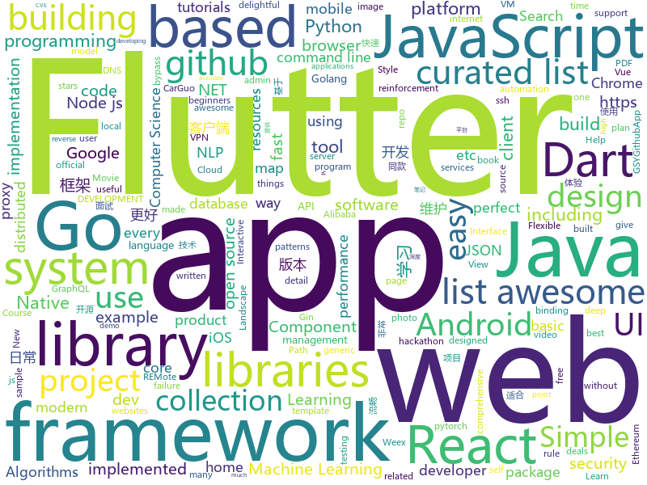

# 2018-10-21
See what the GitHub community is most excited about today.

## python
* [TensorFlow-Course](https://github.com/open-source-for-science/TensorFlow-Course)(**309 stars today**): Simple and ready-to-use tutorials for TensorFlow
* [graph_nets](https://github.com/deepmind/graph_nets)(**310 stars today**): Build Graph Nets in Tensorflow
* [Python](https://github.com/TheAlgorithms/Python)(**149 stars today**): All Algorithms implemented in Python
* [trfl](https://github.com/deepmind/trfl)(**118 stars today**): TensorFlow Reinforcement Learning
* [BERT-pytorch](https://github.com/codertimo/BERT-pytorch)(**81 stars today**): Google AI 2018 BERT pytorch implementation
* [Metis](https://github.com/Tencent/Metis)(**58 stars today**): Metis is a learnware platform in the field of AIOps.
* [camelot](https://github.com/socialcopsdev/camelot)(**53 stars today**): Camelot: PDF Table Extraction for Humans
* [models](https://github.com/tensorflow/models)(**37 stars today**): Models and examples built with TensorFlow
* [system-design-primer](https://github.com/donnemartin/system-design-primer)(**38 stars today**): Learn how to design large-scale systems. Prep for the system design interview. Includes Anki flashcards.
* [youtube-dl](https://github.com/rg3/youtube-dl)(**44 stars today**): Command-line program to download videos from YouTube.com and other video sites
* [awesome-python](https://github.com/vinta/awesome-python)(**37 stars today**): A curated list of awesome Python frameworks, libraries, software and resources
* [tencent-ml-images](https://github.com/Tencent/tencent-ml-images)(**37 stars today**): Largest multi-label image database; ResNet-101 model; 80.73% top-1 acc on ImageNet
* [Algorithm_Interview_Notes-Chinese](https://github.com/imhuay/Algorithm_Interview_Notes-Chinese)(**27 stars today**): 2018/2019/校招/春招/秋招/算法/机器学习(Machine Learning)/深度学习(Deep Learning)/自然语言处理(NLP)/C/C++/Python/面试笔记
* [home-assistant](https://github.com/home-assistant/home-assistant)(**26 stars today**): 🏡Open source home automation that puts local control and privacy first
* [keras](https://github.com/keras-team/keras)(**23 stars today**): Deep Learning for humans
* [openlibrary](https://github.com/internetarchive/openlibrary)(**25 stars today**): One webpage for every book ever published!
* [remi](https://github.com/dddomodossola/remi)(**24 stars today**): Python REMote Interface library. Platform independent. In about 100 Kbytes, perfect for your diet.
* [cpython](https://github.com/python/cpython)(**14 stars today**): The Python programming language
* [libssh-scanner](https://github.com/leapsecurity/libssh-scanner)(**22 stars today**): Script to identify hosts vulnerable to CVE-2018-10933
* [poetry](https://github.com/sdispater/poetry)(**22 stars today**): Python dependency management and packaging made easy.
* [mmdetection](https://github.com/open-mmlab/mmdetection)(**21 stars today**): Open MMLab Detection Toolbox
* [public-apis](https://github.com/toddmotto/public-apis)(**22 stars today**): A collective list of public JSON APIs for use in web development.
* [django](https://github.com/django/django)(**16 stars today**): The Web framework for perfectionists with deadlines.
* [scikit-learn](https://github.com/scikit-learn/scikit-learn)(**19 stars today**): scikit-learn: machine learning in Python
* [flask](https://github.com/pallets/flask)(****): The Python micro framework for building web applications.

## java
* [JavaGuide](https://github.com/Snailclimb/JavaGuide)(**69 stars today**): 【Java学习+面试指南】 一份涵盖大部分Java程序员所需要掌握的核心知识。
* [symphony](https://github.com/b3log/symphony)(**49 stars today**): 🎶一款用 Java 实现的现代化社区（论坛/BBS/社交网络/博客）平台。https://hacpai.com
* [spring-boot](https://github.com/spring-projects/spring-boot)(**41 stars today**): Spring Boot
* [TitleBar](https://github.com/getActivity/TitleBar)(**45 stars today**): A simple generic title bar
* [Java](https://github.com/TheAlgorithms/Java)(**37 stars today**): All Algorithms implemented in Java
* [java-design-patterns](https://github.com/iluwatar/java-design-patterns)(**21 stars today**): Design patterns implemented in Java
* [elasticsearch](https://github.com/elastic/elasticsearch)(**18 stars today**): Open Source, Distributed, RESTful Search Engine
* [MVVMHabit](https://github.com/goldze/MVVMHabit)(**21 stars today**): 基于谷歌最新AAC架构，MVVM设计模式的一套快速开发库，整合Okhttp+RxJava+Retrofit+Glide等主流模块，满足日常开发需求。使用该框架可以快速开发一个健壮、易维护的Android应用。
* [arthas](https://github.com/alibaba/arthas)(**19 stars today**): Alibaba Java Diagnostic Tool Arthas/Alibaba Java诊断利器Arthas
* [spring-framework](https://github.com/spring-projects/spring-framework)(**15 stars today**): Spring Framework
* [Magisk](https://github.com/topjohnwu/Magisk)(**17 stars today**): A Magic Mask to Alter Android System Systemless-ly
* [JCSprout](https://github.com/crossoverJie/JCSprout)(**13 stars today**): 👨‍🎓Java Core Sprout : basic, concurrent, algorithm
* [RxJava](https://github.com/ReactiveX/RxJava)(**15 stars today**): RxJava – Reactive Extensions for the JVM – a library for composing asynchronous and event-based programs using observable sequences for the Java VM.
* [incubator-dubbo](https://github.com/apache/incubator-dubbo)(**12 stars today**): Apache Dubbo (incubating) is a high-performance, java based, open source RPC framework.
* [Depth-LIB-Android-](https://github.com/danielzeller/Depth-LIB-Android-)(**15 stars today**): A library that gives depth to Views.
* [zxing](https://github.com/zxing/zxing)(**13 stars today**): ZXing ("Zebra Crossing") barcode scanning library for Java, Android
* [Hystrix](https://github.com/Netflix/Hystrix)(**11 stars today**): Hystrix is a latency and fault tolerance library designed to isolate points of access to remote systems, services and 3rd party libraries, stop cascading failure and enable resilience in complex distributed systems where failure is inevitable.
* [tutorials](https://github.com/eugenp/tutorials)(**6 stars today**): The "REST With Spring" Course:
* [Mycat-Server](https://github.com/MyCATApache/Mycat-Server)(**12 stars today**): 
* [subsampling-scale-image-view](https://github.com/davemorrissey/subsampling-scale-image-view)(**12 stars today**): Android library (AAR). Highly configurable, easily extendable deep zoom view for displaying huge images without loss of detail. Perfect for photo galleries, maps, building plans etc.
* [hmily](https://github.com/yu199195/hmily)(**10 stars today**): 高性能异步分布式事务TCC框架(try,confirm,cancel)
* [gson](https://github.com/google/gson)(**11 stars today**): A Java serialization/deserialization library to convert Java Objects into JSON and back
* [Shotang-App](https://github.com/Shashank02051997/Shotang-App)(**9 stars today**): The New Home Screen is designed in a modular way with the core focus on product discovery. Search, Deals, Products everything has been brought upfront. The hamburger menu has been replaced with a bottom navigation bar for easy reachability. On the tech side too, this design allows us to run new deals and other experiments in an agile manner whic…
* [retrofit](https://github.com/square/retrofit)(**11 stars today**): Type-safe HTTP client for Android and Java by Square, Inc.
* [selenium](https://github.com/SeleniumHQ/selenium)(**11 stars today**): A browser automation framework and ecosystem.

## unknown
* [git-flight-rules](https://github.com/k88hudson/git-flight-rules)(**298 stars today**): Flight rules for git
* [first-contributions](https://github.com/firstcontributions/first-contributions)(**49 stars today**): 🚀✨Help beginners to contribute to open source projects
* [awesome-piracy](https://github.com/Igglybuff/awesome-piracy)(**135 stars today**): A curated list of awesome warez and piracy links
* [coding-interview-university](https://github.com/jwasham/coding-interview-university)(**90 stars today**): A complete computer science study plan to become a software engineer.
* [weekly](https://github.com/ruanyf/weekly)(**83 stars today**): 技术分享周刊，每周五发布
* [developer-roadmap](https://github.com/kamranahmedse/developer-roadmap)(**71 stars today**): Roadmap to becoming a web developer in 2018
* [pwc](https://github.com/zziz/pwc)(**64 stars today**): Papers with code. Sorted by stars. Updated weekly.
* [awesome](https://github.com/sindresorhus/awesome)(**56 stars today**): 😎Curated list of awesome lists
* [Make-a-Pull-Request](https://github.com/rishabh-bansal/Make-a-Pull-Request)(**10 stars today**): Make a Pull Request
* [A-to-Z-Resources-for-Students](https://github.com/dipakkr/A-to-Z-Resources-for-Students)(**27 stars today**): Curated list of resources for college students If you like give a⭐️
* [gitignore](https://github.com/github/gitignore)(**29 stars today**): A collection of useful .gitignore templates
* [Awesome-pytorch-list](https://github.com/bharathgs/Awesome-pytorch-list)(**38 stars today**): A comprehensive list of pytorch related content on github,such as different models,implementations,helper libraries,tutorials etc.
* [computer-science](https://github.com/ossu/computer-science)(**38 stars today**): 🎓Path to a free self-taught education in Computer Science!
* [free-programming-books](https://github.com/EbookFoundation/free-programming-books)(**33 stars today**): 📚Freely available programming books
* [project-based-learning](https://github.com/tuvtran/project-based-learning)(**31 stars today**): Curated list of project-based tutorials
* [Machine-Learning-Yearning-Korean-Translation](https://github.com/deep-diver/Machine-Learning-Yearning-Korean-Translation)(**30 stars today**): Korean translation of machine learning yearning book by Andrew Ng.
* [awesome-java](https://github.com/akullpp/awesome-java)(**32 stars today**): A curated list of awesome frameworks, libraries and software for the Java programming language.
* [awesome-vue](https://github.com/vuejs/awesome-vue)(**25 stars today**): 🎉A curated list of awesome things related to Vue.js
* [build-your-own-x](https://github.com/danistefanovic/build-your-own-x)(**23 stars today**): 🤓Build your own (insert technology here)
* [CS-Notes](https://github.com/CyC2018/CS-Notes)(**21 stars today**): 📚Computer Science Learning Notes
* [awesome-for-beginners](https://github.com/MunGell/awesome-for-beginners)(**20 stars today**): A list of awesome beginners-friendly projects.
* [awesome-nodejs](https://github.com/sindresorhus/awesome-nodejs)(**20 stars today**): ⚡️Delightful Node.js packages and resources
* [33-js-concepts](https://github.com/stephentian/33-js-concepts)(**21 stars today**): 📜每个 JavaScript 工程师都应懂的33个概念 @leonardomso
* [Awesome-Hacking](https://github.com/Hack-with-Github/Awesome-Hacking)(**17 stars today**): A collection of various awesome lists for hackers, pentesters and security researchers
* [stanford-cs-229-machine-learning](https://github.com/afshinea/stanford-cs-229-machine-learning)(**18 stars today**): VIP cheatsheets for Stanford's CS 229 Machine Learning

## javascript
* [33-js-concepts](https://github.com/leonardomso/33-js-concepts)(**938 stars today**): 📜33 concepts every JavaScript developer should know.
* [omi](https://github.com/Tencent/omi)(**343 stars today**): Next generation web framework in 4kb JavaScript (Web Components + JSX + Proxy + Store + Path Updating)
* [graphpack](https://github.com/glennreyes/graphpack)(**239 stars today**): ☄️A minimalistic zero-config GraphQL server.
* [freeCodeCamp](https://github.com/freeCodeCamp/freeCodeCamp)(****): The https://freeCodeCamp.org open source codebase and curriculum. Learn to code for free together with millions of people.
* [evergreen](https://github.com/segmentio/evergreen)(**115 stars today**): 🌲Evergreen React UI Framework by Segment
* [30-seconds-of-code](https://github.com/30-seconds/30-seconds-of-code)(**72 stars today**): Curated collection of useful JavaScript snippets that you can understand in 30 seconds or less.
* [react](https://github.com/facebook/react)(**62 stars today**): A declarative, efficient, and flexible JavaScript library for building user interfaces.
* [percollate](https://github.com/danburzo/percollate)(**66 stars today**): 🌐→📖A command-line tool to turn web pages into beautifully formatted PDFs
* [vue](https://github.com/vuejs/vue)(**56 stars today**): 🖖A progressive, incrementally-adoptable JavaScript framework for building UI on the web.
* [jsonmc](https://github.com/jsonmc/jsonmc)(**21 stars today**): JSON Movie Collection
* [gatsby](https://github.com/gatsbyjs/gatsby)(**52 stars today**): Build blazing fast, modern apps and websites with React
* [create-react-app](https://github.com/facebook/create-react-app)(**49 stars today**): Set up a modern web app by running one command.
* [graphql.js](https://github.com/f/graphql.js)(**44 stars today**): A Simple and Isomorphic GraphQL Client for JavaScript
* [react-native](https://github.com/facebook/react-native)(**35 stars today**): A framework for building native apps with React.
* [axios](https://github.com/axios/axios)(**34 stars today**): Promise based HTTP client for the browser and node.js
* [awesome-vscode](https://github.com/viatsko/awesome-vscode)(**35 stars today**): 🎨A curated list of delightful VS Code packages and resources.
* [next.js](https://github.com/zeit/next.js)(**29 stars today**): The React Framework
* [landscape](https://github.com/cncf/landscape)(**33 stars today**): Static Cloud Native Landscapes and Interactive Landscape that filters and sorts hundreds of cloud native projects and products, and shows details including GitHub stars, funding or market cap, first and last commits, contributor counts, headquarters location, and recent tweets.
* [styled-map](https://github.com/scf4/styled-map)(**32 stars today**): A super simple way to map props to styles with Styled Components✨
* [node](https://github.com/nodejs/node)(**24 stars today**): Node.js JavaScript runtime✨🐢🚀✨
* [javascript-algorithms](https://github.com/trekhleb/javascript-algorithms)(**24 stars today**): 🤖Algorithms and data structures implemented in JavaScript with explanations and links to further readings
* [rete](https://github.com/retejs/rete)(**28 stars today**): JavaScript framework for visual programming and creating node editor
* [javascript](https://github.com/airbnb/javascript)(**24 stars today**): JavaScript Style Guide
* [material-ui](https://github.com/mui-org/material-ui)(**23 stars today**): React components that implement Google's Material Design.
* [storybook](https://github.com/storybooks/storybook)(**24 stars today**): Interactive UI component dev & test: React, React Native, Vue, Angular, Ember

## html
* [mastering-modular-javascript](https://github.com/mjavascript/mastering-modular-javascript)(**28 stars today**): 📦Module thinking, principles, design patterns and best practices.
* [scorelab.github.io](https://github.com/scorelab/scorelab.github.io)(**10 stars today**): Sustainable Computing Research Group (SCoRe)
* [solid](https://github.com/solid/solid)(**16 stars today**): Solid - Re-decentralizing the web (project directory)
* [Spoon-Knife](https://github.com/octocat/Spoon-Knife)(****): This repo is for demonstration purposes only.
* [chrome](https://github.com/free-vpn/chrome)(**12 stars today**): VPN Chrome is Google Chromium based browser with built-in VPN capability to let users surf the Internet in a secure and private way.
* [baselines](https://github.com/openai/baselines)(**13 stars today**): OpenAI Baselines: high-quality implementations of reinforcement learning algorithms
* [GTFOBins.github.io](https://github.com/GTFOBins/GTFOBins.github.io)(**13 stars today**): Curated list of Unix binaries that can be exploited to bypass system security restrictions
* [react-redux](https://github.com/reduxjs/react-redux)(**12 stars today**): Official React bindings for Redux
* [JavaScript30](https://github.com/wesbos/JavaScript30)(**8 stars today**): 30 Day Vanilla JS Challenge
* [symfony-hackathon-starter](https://github.com/yemiwebby/symfony-hackathon-starter)(**11 stars today**): A hackathon boilerplate for Symfony web applications. Start your hackathons or web app without hassle.
* [Hacktoberfest-Census](https://github.com/Cutwell/Hacktoberfest-Census)(****): A census of those participating in Hacktoberfest (and an easy PR!)
* [electron-api-demos](https://github.com/electron/electron-api-demos)(**9 stars today**): Explore the Electron APIs
* [gentelella](https://github.com/puikinsh/gentelella)(**6 stars today**): Free Bootstrap 3 Admin Template
* [NLP-progress](https://github.com/sebastianruder/NLP-progress)(**8 stars today**): Repository to track the progress in Natural Language Processing (NLP), including the datasets and the current state-of-the-art for the most common NLP tasks.
* [Adminator-admin-dashboard](https://github.com/puikinsh/Adminator-admin-dashboard)(**7 stars today**): Adminator is a easy to use and well design admin dashboard template for web apps, websites, services and more
* [fancy-border-radius](https://github.com/9elements/fancy-border-radius)(**8 stars today**): When you use eight values specifying border-radius in CSS, you can build organic looking shapes. Simply use our Generator at
* [portainer](https://github.com/portainer/portainer)(**8 stars today**): Simple management UI for Docker
* [simple-icons](https://github.com/simple-icons/simple-icons)(**7 stars today**): SVG icons for popular brands
* [dotnet](https://github.com/Microsoft/dotnet)(**7 stars today**): This repo is the official home of .NET on GitHub. It's a great starting point to find many .NET OSS projects from Microsoft and the community, including many that are part of the .NET Foundation.
* [readability](https://github.com/mozilla/readability)(**7 stars today**): A standalone version of the readability lib
* [zenbot](https://github.com/DeviaVir/zenbot)(**6 stars today**): Zenbot is a command-line cryptocurrency trading bot using Node.js and MongoDB.
* [owasp-mstg](https://github.com/OWASP/owasp-mstg)(**6 stars today**): The Mobile Security Testing Guide (MSTG) is a comprehensive manual for mobile app security testing and reverse engineering.
* [EIPs](https://github.com/ethereum/EIPs)(**5 stars today**): The Ethereum Improvement Proposal repository
* [datascience-box](https://github.com/rstudio-education/datascience-box)(**5 stars today**): Data Science Course in a Box
* [polymer](https://github.com/Polymer/polymer)(**6 stars today**): Build modern apps using web components

## dart
* [flutter](https://github.com/flutter/flutter)(**34 stars today**): Flutter makes it easy and fast to build beautiful mobile apps.
* [awesome-flutter](https://github.com/Solido/awesome-flutter)(**16 stars today**): An awesome list that curates the best Flutter libraries, tools, tutorials, articles and more.
* [plugins](https://github.com/flutter/plugins)(**9 stars today**): Plugins for Flutter, including FlutterFire, maintained by the Flutter team
* [GSYGithubAppFlutter](https://github.com/CarGuo/GSYGithubAppFlutter)(**9 stars today**): 超完整的Flutter项目，功能丰富，适合学习和日常使用。GSYGithubApp系列的优势：我们目前已经拥有Flutter、Weex、ReactNative三个版本。 功能齐全，项目框架内技术涉及面广，完成度高，持续维护，配套文章，适合全面学习，跨框架对比参考。跨平台的开源Github客户端App，更好的体验，更丰富的功能，旨在更好的日常管理和维护个人Github，提供更好更方便的驾车体验～～Σ(￣。￣ﾉ)ﾉ。同款Weex版本 ： https://github.com/CarGuo/GSYGithubAppWeex 、同款React Native版本 ： https://github.com/CarGuo/GSYGithubApp
* [FlutterExampleApps](https://github.com/iampawan/FlutterExampleApps)(**6 stars today**): [Example APPS] Basic Flutter apps, for flutter devs.
* [flutter_map](https://github.com/apptreesoftware/flutter_map)(**5 stars today**): A Flutter map package based on leaflet
* [dart-sass](https://github.com/sass/dart-sass)(****): A Dart implementation of Sass.
* [dartdoc](https://github.com/dart-lang/dartdoc)(****): API documentation tool for Dart.
* [samples](https://github.com/flutter/samples)(****): A collection of Flutter examples and demos.
* [NumberPicker](https://github.com/MarcinusX/NumberPicker)(****): 
* [flutter_villains](https://github.com/Norbert515/flutter_villains)(****): Flexible and easy to use page transitions.
* [flutter_cache_manager](https://github.com/renefloor/flutter_cache_manager)(****): Generic cache manager for flutter
* [flutter-chat-demo](https://github.com/duytq94/flutter-chat-demo)(****): This is the demo for chat app by Flutter
* [chromedeveditor](https://github.com/googlearchive/chromedeveditor)(****): Chrome Dev Editor is a developer tool for building apps on the Chrome platform - Chrome Apps and Web Apps, in JavaScript or Dart. (NO LONGER IN ACTIVE DEVELOPMENT)
* [sdk](https://github.com/dart-lang/sdk)(****): The Dart SDK, including the VM, dart2js, core libraries, and more.
* [flutter-osc](https://github.com/yubo725/flutter-osc)(****): 基于Google Flutter的开源中国客户端，支持Android和iOS。
* [flutter-examples](https://github.com/nisrulz/flutter-examples)(****): [Examples] Simple basic isolated apps, for budding flutter devs.
* [Flutter-UI-Kit](https://github.com/iampawan/Flutter-UI-Kit)(****): Flutter app for collection of UI in a UIKit
* [flutter_architecture_samples](https://github.com/brianegan/flutter_architecture_samples)(****): TodoMVC for Flutter
* [Flutter-learning](https://github.com/AweiLoveAndroid/Flutter-learning)(****): 🔥👍🌟⭐️⭐️⭐️Flutter install&settings,Flutter problems when developing,Flutter sample codes& templates,Flutter projects,Dart languages sample codes
* [inKino](https://github.com/roughike/inKino)(****): inKino - A cross platform movie and showtime browser for Finnkino cinemas, made with Flutter.
* [dio](https://github.com/flutterchina/dio)(****): A powerful Http client for Dart, which supports Interceptors, FormData, Request Cancellation, File Downloading, Timeout etc.
* [hauberk](https://github.com/munificent/hauberk)(****): A web-based roguelike written in Dart.
* [zhihu-flutter](https://github.com/HackSoul/zhihu-flutter)(****): Flutter 高仿知乎 UI，非常漂亮，也非常流畅，flutter build apk 或 flutter build ios 之后更流畅
* [angular](https://github.com/dart-lang/angular)(****): Fast and productive web framework provided by Dart

## go
* [tableflip](https://github.com/cloudflare/tableflip)(**86 stars today**): Graceful process restarts in Go
* [dst](https://github.com/dave/dst)(**79 stars today**): Decorated Syntax Tree - manipulate Go source with perfect fidelity.
* [photoprism](https://github.com/photoprism/photoprism)(**59 stars today**): Personal photo management powered by Go and Google TensorFlow
* [soar](https://github.com/XiaoMi/soar)(**48 stars today**): SQL Optimizer And Rewriter
* [mole](https://github.com/davrodpin/mole)(**52 stars today**): cli app to create ssh tunnels
* [dom](https://github.com/dennwc/dom)(**50 stars today**): DOM library for Go and WASM
* [croc](https://github.com/schollz/croc)(**48 stars today**): Easily and securely send things from one computer to another🐊📦
* [raft](https://github.com/liamg/raft)(**44 stars today**): Golang terminal emulator from scratch
* [go](https://github.com/golang/go)(**36 stars today**): The Go programming language
* [AdGuardHome](https://github.com/AdguardTeam/AdGuardHome)(**29 stars today**): Network-wide ads & trackers blocking DNS server
* [awesome-go](https://github.com/avelino/awesome-go)(**26 stars today**): A curated list of awesome Go frameworks, libraries and software
* [sshw](https://github.com/yinheli/sshw)(**29 stars today**): 🐝ssh client wrapper for automatic login
* [BaiduPCS-Go](https://github.com/iikira/BaiduPCS-Go)(**28 stars today**): 百度网盘客户端 - Go语言编写
* [v2ray-core](https://github.com/v2ray/v2ray-core)(**25 stars today**): A platform for building proxies to bypass network restrictions.
* [go-ethereum](https://github.com/ethereum/go-ethereum)(**21 stars today**): Official Go implementation of the Ethereum protocol
* [flares](https://github.com/lfaoro/flares)(**25 stars today**): Flares🔥is a CloudFlare DNS backup tool
* [qt](https://github.com/therecipe/qt)(**24 stars today**): Qt binding for Go (Golang) with support for Windows / macOS / Linux / Android / iOS / Sailfish OS / Raspberry Pi / AsteroidOS / Ubuntu Touch / JavaScript
* [illustrated-tls](https://github.com/syncsynchalt/illustrated-tls)(**23 stars today**): The Illustrated TLS Connection: Every byte explained
* [sourcegraph](https://github.com/sourcegraph/sourcegraph)(**22 stars today**): Code search and intelligence, self-hosted and scalable
* [kubernetes](https://github.com/kubernetes/kubernetes)(**21 stars today**): Production-Grade Container Scheduling and Management
* [prometheus](https://github.com/prometheus/prometheus)(**19 stars today**): The Prometheus monitoring system and time series database.
* [gin](https://github.com/gin-gonic/gin)(**17 stars today**): Gin is a HTTP web framework written in Go (Golang). It features a Martini-like API with much better performance -- up to 40 times faster. If you need smashing performance, get yourself some Gin.
* [frp](https://github.com/fatedier/frp)(**16 stars today**): A fast reverse proxy to help you expose a local server behind a NAT or firewall to the internet.
* [tidb](https://github.com/pingcap/tidb)(**17 stars today**): TiDB is a distributed HTAP database compatible with the MySQL protocol
* [clash](https://github.com/Dreamacro/clash)(**15 stars today**): A rule based proxy in Go.

## WordCloud

