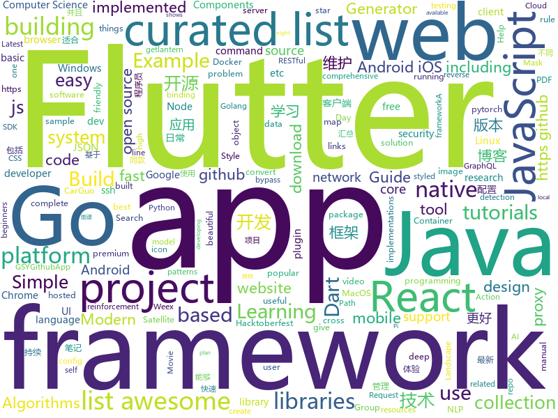

# 2018-10-22
See what the GitHub community is most excited about today.

## python
* [graph_nets](https://github.com/deepmind/graph_nets)(**248 stars today**): Build Graph Nets in Tensorflow
* [TensorFlow-Course](https://github.com/open-source-for-science/TensorFlow-Course)(**202 stars today**): Simple and ready-to-use tutorials for TensorFlow
* [Python](https://github.com/TheAlgorithms/Python)(**102 stars today**): All Algorithms implemented in Python
* [esp8266_honeypot](https://github.com/gbafana25/esp8266_honeypot)(**110 stars today**): THE ESP8266 HONEYPOT: A PROJECT TO TRAP SCRIPT KIDDIES EVERYWHRE!!
* [trfl](https://github.com/deepmind/trfl)(**89 stars today**): TensorFlow Reinforcement Learning
* [Metis](https://github.com/Tencent/Metis)(**73 stars today**): Metis is a learnware platform in the field of AIOps.
* [BERT-pytorch](https://github.com/codertimo/BERT-pytorch)(**69 stars today**): Google AI 2018 BERT pytorch implementation
* [models](https://github.com/tensorflow/models)(**33 stars today**): Models and examples built with TensorFlow
* [ouroboros](https://github.com/circa10a/ouroboros)(**47 stars today**): Automatically update running docker containers with latest image
* [system-design-primer](https://github.com/donnemartin/system-design-primer)(**41 stars today**): Learn how to design large-scale systems. Prep for the system design interview. Includes Anki flashcards.
* [mmdetection](https://github.com/open-mmlab/mmdetection)(**38 stars today**): Open MMLab Detection Toolbox
* [camelot](https://github.com/socialcopsdev/camelot)(**40 stars today**): Camelot: PDF Table Extraction for Humans
* [awesome-python](https://github.com/vinta/awesome-python)(**35 stars today**): A curated list of awesome Python frameworks, libraries, software and resources
* [byob](https://github.com/malwaredllc/byob)(**33 stars today**): BYOB (Build Your Own Botnet)
* [tencent-ml-images](https://github.com/Tencent/tencent-ml-images)(**34 stars today**): Largest multi-label image database; ResNet-101 model; 80.73% top-1 acc on ImageNet
* [keras](https://github.com/keras-team/keras)(**28 stars today**): Deep Learning for humans
* [raster-vision](https://github.com/azavea/raster-vision)(**33 stars today**): An open source framework for deep learning on satellite and aerial imagery.
* [CODE2RACE](https://github.com/hackerearthclub/CODE2RACE)(**12 stars today**): Let's celebrate HacktoberFest.🎉Solve the problem.😊If you like ❤ give us a star⭐.
* [Detectron](https://github.com/facebookresearch/Detectron)(**27 stars today**): FAIR's research platform for object detection research, implementing popular algorithms like Mask R-CNN and RetinaNet.
* [pytorch-saltnet](https://github.com/tugstugi/pytorch-saltnet)(**26 stars today**): Kaggle | 9th place solution for TGS Salt Identification Challenge
* [ProMP](https://github.com/jonasrothfuss/ProMP)(**27 stars today**): ProMP: Proximal Meta-Policy Search
* [satellite_tracker](https://github.com/PaulKlinger/satellite_tracker)(**28 stars today**): Code for Satellite tracker
* [django](https://github.com/django/django)(**23 stars today**): The Web framework for perfectionists with deadlines.
* [youtube-dl](https://github.com/rg3/youtube-dl)(**23 stars today**): Command-line program to download videos from YouTube.com and other video sites
* [protocol](https://github.com/luismartingarcia/protocol)(**24 stars today**): An ASCII Header Generator for Network Protocols

## java
* [JavaGuide](https://github.com/Snailclimb/JavaGuide)(**68 stars today**): 【Java学习+面试指南】 一份涵盖大部分Java程序员所需要掌握的核心知识。
* [symphony](https://github.com/b3log/symphony)(**45 stars today**): 🎶一款用 Java 实现的现代化社区（论坛/BBS/社交网络/博客）平台。https://hacpai.com
* [java-design-patterns](https://github.com/iluwatar/java-design-patterns)(**37 stars today**): Design patterns implemented in Java
* [Java](https://github.com/TheAlgorithms/Java)(**28 stars today**): All Algorithms implemented in Java
* [spring-boot](https://github.com/spring-projects/spring-boot)(**25 stars today**): Spring Boot
* [elasticsearch](https://github.com/elastic/elasticsearch)(**21 stars today**): Open Source, Distributed, RESTful Search Engine
* [spring-framework](https://github.com/spring-projects/spring-framework)(**15 stars today**): Spring Framework
* [JCSprout](https://github.com/crossoverJie/JCSprout)(**15 stars today**): 👨‍🎓Java Core Sprout : basic, concurrent, algorithm
* [arthas](https://github.com/alibaba/arthas)(**15 stars today**): Alibaba Java Diagnostic Tool Arthas/Alibaba Java诊断利器Arthas
* [tutorials](https://github.com/eugenp/tutorials)(**9 stars today**): The "REST With Spring" Course:
* [netty](https://github.com/netty/netty)(**14 stars today**): Netty project - an event-driven asynchronous network application framework
* [Mycat-Server](https://github.com/MyCATApache/Mycat-Server)(**14 stars today**): 
* [Magisk](https://github.com/topjohnwu/Magisk)(**14 stars today**): A Magic Mask to Alter Android System Systemless-ly
* [incubator-dubbo](https://github.com/apache/incubator-dubbo)(**8 stars today**): Apache Dubbo (incubating) is a high-performance, java based, open source RPC framework.
* [TitleBar](https://github.com/getActivity/TitleBar)(**12 stars today**): A simple generic title bar
* [AntennaPod](https://github.com/AntennaPod/AntennaPod)(**12 stars today**): A podcast manager for Android
* [gson](https://github.com/google/gson)(**12 stars today**): A Java serialization/deserialization library to convert Java Objects into JSON and back
* [fastjson](https://github.com/alibaba/fastjson)(**11 stars today**): 🚄A fast JSON parser/generator for Java
* [MVVMHabit](https://github.com/goldze/MVVMHabit)(**11 stars today**): 基于谷歌最新AAC架构，MVVM设计模式的一套快速开发库，整合Okhttp+RxJava+Retrofit+Glide等主流模块，满足日常开发需求。使用该框架可以快速开发一个健壮、易维护的Android应用。
* [XLearning](https://github.com/Qihoo360/XLearning)(**11 stars today**): AI on Hadoop
* [react-native-navigation](https://github.com/wix/react-native-navigation)(**10 stars today**): A complete native navigation solution for React Native
* [selenium](https://github.com/SeleniumHQ/selenium)(**9 stars today**): A browser automation framework and ecosystem.
* [apollo](https://github.com/ctripcorp/apollo)(**7 stars today**): Apollo（阿波罗）是携程框架部门研发的分布式配置中心，能够集中化管理应用不同环境、不同集群的配置，配置修改后能够实时推送到应用端，并且具备规范的权限、流程治理等特性，适用于微服务配置管理场景。
* [java8-tutorial](https://github.com/winterbe/java8-tutorial)(**8 stars today**): Modern Java - A Guide to Java 8
* [guava](https://github.com/google/guava)(**9 stars today**): Google core libraries for Java

## unknown
* [Awesome-pytorch-list](https://github.com/bharathgs/Awesome-pytorch-list)(**488 stars today**): A comprehensive list of pytorch related content on github,such as different models,implementations,helper libraries,tutorials etc.
* [awesome-actions](https://github.com/sdras/awesome-actions)(**254 stars today**): A curated list of awesome actions to use on GitHub
* [git-flight-rules](https://github.com/k88hudson/git-flight-rules)(**226 stars today**): Flight rules for git
* [awesome-piracy](https://github.com/Igglybuff/awesome-piracy)(**120 stars today**): A curated list of awesome warez and piracy links
* [free-programming-books](https://github.com/EbookFoundation/free-programming-books)(**100 stars today**): 📚Freely available programming books
* [first-contributions](https://github.com/firstcontributions/first-contributions)(**32 stars today**): 🚀✨Help beginners to contribute to open source projects
* [coding-interview-university](https://github.com/jwasham/coding-interview-university)(**72 stars today**): A complete computer science study plan to become a software engineer.
* [awesome-deep-learning](https://github.com/ChristosChristofidis/awesome-deep-learning)(**50 stars today**): A curated list of awesome Deep Learning tutorials, projects and communities.
* [awesome](https://github.com/sindresorhus/awesome)(**60 stars today**): 😎Curated list of awesome lists
* [developer-roadmap](https://github.com/kamranahmedse/developer-roadmap)(**60 stars today**): Roadmap to becoming a web developer in 2018
* [Make-a-Pull-Request](https://github.com/rishabh-bansal/Make-a-Pull-Request)(**15 stars today**): Make a Pull Request
* [33-js-concepts](https://github.com/stephentian/33-js-concepts)(**59 stars today**): 📜每个 JavaScript 工程师都应懂的33个概念 @leonardomso
* [YCBlogs](https://github.com/yangchong211/YCBlogs)(**45 stars today**): 博客笔记大汇总【16年3月到至今】，包括Java基础及深入知识点，Android技术博客，Python，Go学习笔记等等，还包括平时开发中遇到的bug汇总，当然也在工作之余收集了大量的面试题，长期更新维护并且修正，持续完善……开源的文件是markdown格式的！同时也开源了生活博客，从12年起，积累共计47篇[近20万字]，转载请注明出处，谢谢！
* [gitignore](https://github.com/github/gitignore)(**36 stars today**): A collection of useful .gitignore templates
* [A-to-Z-Resources-for-Students](https://github.com/dipakkr/A-to-Z-Resources-for-Students)(**26 stars today**): Curated list of resources for college students If you like give a⭐️
* [Hazel](https://github.com/TheCherno/Hazel)(**41 stars today**): Hazel Engine
* [trackerslist](https://github.com/ngosang/trackerslist)(**37 stars today**): An updated list of public BitTorrent trackers
* [weekly](https://github.com/ruanyf/weekly)(**32 stars today**): 技术分享周刊，每周五发布
* [project-based-learning](https://github.com/tuvtran/project-based-learning)(**30 stars today**): Curated list of project-based tutorials
* [CS-Notes](https://github.com/CyC2018/CS-Notes)(**25 stars today**): 📚Computer Science Learning Notes
* [computer-science](https://github.com/ossu/computer-science)(**24 stars today**): 🎓Path to a free self-taught education in Computer Science!
* [awesome-vue](https://github.com/vuejs/awesome-vue)(**20 stars today**): 🎉A curated list of awesome things related to Vue.js
* [100-Days-Of-ML-Code](https://github.com/Avik-Jain/100-Days-Of-ML-Code)(**20 stars today**): 100 Days of ML Coding
* [awesome-for-beginners](https://github.com/MunGell/awesome-for-beginners)(**19 stars today**): A list of awesome beginners-friendly projects.
* [datasharing](https://github.com/jtleek/datasharing)(****): The Leek group guide to data sharing

## javascript
* [33-js-concepts](https://github.com/leonardomso/33-js-concepts)(**651 stars today**): 📜33 concepts every JavaScript developer should know.
* [omi](https://github.com/Tencent/omi)(**218 stars today**): Next generation web framework in 4kb JavaScript (Web Components + JSX + Proxy + Store + Path Updating)
* [freeCodeCamp](https://github.com/freeCodeCamp/freeCodeCamp)(****): The https://freeCodeCamp.org open source codebase and curriculum. Learn to code for free together with millions of people.
* [graphpack](https://github.com/glennreyes/graphpack)(**149 stars today**): ☄️A minimalistic zero-config GraphQL server.
* [evergreen](https://github.com/segmentio/evergreen)(**103 stars today**): 🌲Evergreen React UI Framework by Segment
* [vue](https://github.com/vuejs/vue)(**87 stars today**): 🖖A progressive, incrementally-adoptable JavaScript framework for building UI on the web.
* [percollate](https://github.com/danburzo/percollate)(**81 stars today**): 🌐→📖A command-line tool to turn web pages into beautifully formatted PDFs
* [react](https://github.com/facebook/react)(**67 stars today**): A declarative, efficient, and flexible JavaScript library for building user interfaces.
* [create-react-app](https://github.com/facebook/create-react-app)(**65 stars today**): Set up a modern web app by running one command.
* [30-seconds-of-code](https://github.com/30-seconds/30-seconds-of-code)(**69 stars today**): Curated collection of useful JavaScript snippets that you can understand in 30 seconds or less.
* [styled-react-boilerplate](https://github.com/xxczaki/styled-react-boilerplate)(**48 stars today**): Minimal & Modern boilerplate for building apps with React & styled-components
* [graphql.js](https://github.com/f/graphql.js)(**43 stars today**): A Simple and Isomorphic GraphQL Client for JavaScript
* [gatsby](https://github.com/gatsbyjs/gatsby)(**37 stars today**): Build blazing fast, modern apps and websites with React
* [antcloud-node-stack](https://github.com/alipay/antcloud-node-stack)(**40 stars today**): 蚂蚁金融科技官方 Node 技术栈脚本
* [jsonmc](https://github.com/jsonmc/jsonmc)(**16 stars today**): JSON Movie Collection
* [react-native](https://github.com/facebook/react-native)(**34 stars today**): A framework for building native apps with React.
* [awesome-vscode](https://github.com/viatsko/awesome-vscode)(**34 stars today**): 🎨A curated list of delightful VS Code packages and resources.
* [styled-map](https://github.com/scf4/styled-map)(**34 stars today**): A super simple way to map props to styles with Styled Components✨
* [shrink-ray](https://github.com/Alorel/shrink-ray)(**34 stars today**): Node.js compression middleware
* [landscape](https://github.com/cncf/landscape)(**33 stars today**): Static Cloud Native Landscapes and Interactive Landscape that filters and sorts hundreds of cloud native projects and products, and shows details including GitHub stars, funding or market cap, first and last commits, contributor counts, headquarters location, and recent tweets.
* [docker.github.io](https://github.com/docker/docker.github.io)(**31 stars today**): Source repo for Docker's Documentation
* [javascript](https://github.com/airbnb/javascript)(**27 stars today**): JavaScript Style Guide
* [javascript-algorithms](https://github.com/trekhleb/javascript-algorithms)(**26 stars today**): 🤖Algorithms and data structures implemented in JavaScript with explanations and links to further readings
* [node](https://github.com/nodejs/node)(**28 stars today**): Node.js JavaScript runtime✨🐢🚀✨
* [next.js](https://github.com/zeit/next.js)(**30 stars today**): The React Framework

## html
* [fancy-border-radius](https://github.com/9elements/fancy-border-radius)(**22 stars today**): When you use eight values specifying border-radius in CSS, you can build organic looking shapes. Simply use our Generator at
* [webperl](https://github.com/haukex/webperl)(**22 stars today**): 🕸️🐪Run Perl 5 in the browser with WebPerl!
* [solid](https://github.com/solid/solid)(**17 stars today**): Solid - Re-decentralizing the web (project directory)
* [mastering-modular-javascript](https://github.com/mjavascript/mastering-modular-javascript)(**16 stars today**): 📦Module thinking, principles, design patterns and best practices.
* [Spoon-Knife](https://github.com/octocat/Spoon-Knife)(****): This repo is for demonstration purposes only.
* [NLP-progress](https://github.com/sebastianruder/NLP-progress)(**16 stars today**): Repository to track the progress in Natural Language Processing (NLP), including the datasets and the current state-of-the-art for the most common NLP tasks.
* [GTFOBins.github.io](https://github.com/GTFOBins/GTFOBins.github.io)(**13 stars today**): Curated list of Unix binaries that can be exploited to bypass system security restrictions
* [simple-icons](https://github.com/simple-icons/simple-icons)(**11 stars today**): SVG icons for popular brands
* [JavaScript30](https://github.com/wesbos/JavaScript30)(**7 stars today**): 30 Day Vanilla JS Challenge
* [scorelab.github.io](https://github.com/scorelab/scorelab.github.io)(**6 stars today**): Sustainable Computing Research Group (SCoRe)
* [AdminLTE](https://github.com/almasaeed2010/AdminLTE)(**7 stars today**): AdminLTE - Free Premium Admin control Panel Theme Based On Bootstrap 3.x
* [react-redux](https://github.com/reduxjs/react-redux)(**8 stars today**): Official React bindings for Redux
* [electron-api-demos](https://github.com/electron/electron-api-demos)(**7 stars today**): Explore the Electron APIs
* [pdfs](https://github.com/tpn/pdfs)(**8 stars today**): Technically-oriented PDF Collection (Papers, Specs, Decks, Manuals, etc)
* [baselines](https://github.com/openai/baselines)(**8 stars today**): OpenAI Baselines: high-quality implementations of reinforcement learning algorithms
* [material-design-lite](https://github.com/google/material-design-lite)(**7 stars today**): Material Design Components in HTML/CSS/JS
* [skill-map](https://github.com/TeamStuQ/skill-map)(**7 stars today**): 程序员技能图谱
* [Hacktoberfest-Census](https://github.com/Cutwell/Hacktoberfest-Census)(****): A census of those participating in Hacktoberfest (and an easy PR!)
* [owasp-mstg](https://github.com/OWASP/owasp-mstg)(**6 stars today**): The Mobile Security Testing Guide (MSTG) is a comprehensive manual for mobile app security testing and reverse engineering.
* [ionicons](https://github.com/ionic-team/ionicons)(**5 stars today**): The premium icon font for Ionic Framework and web apps everywhere
* [es6-features](https://github.com/rse/es6-features)(**6 stars today**): ECMAScript 6: Feature Overview & Comparison
* [patchwork](https://github.com/jlord/patchwork)(****): All the Git-it Workshop completers!
* [hugo-academic](https://github.com/gcushen/hugo-academic)(**5 stars today**): The website designer for Hugo. Build and deploy a beautiful website in minutes🚀
* [react-app-rewired](https://github.com/timarney/react-app-rewired)(**5 stars today**): Override create-react-app webpack configs without ejecting
* [speedtest](https://github.com/adolfintel/speedtest)(**5 stars today**): Self-hosted HTML5 Speedtest. Easy setup, examples, configurable, responsive and mobile friendly. Supports PHP, Node, and more.

## dart
* [flutter](https://github.com/flutter/flutter)(**31 stars today**): Flutter makes it easy and fast to build beautiful mobile apps.
* [awesome-flutter](https://github.com/Solido/awesome-flutter)(**23 stars today**): An awesome list that curates the best Flutter libraries, tools, tutorials, articles and more.
* [plugins](https://github.com/flutter/plugins)(**8 stars today**): Plugins for Flutter, including FlutterFire, maintained by the Flutter team
* [FlutterExampleApps](https://github.com/iampawan/FlutterExampleApps)(**5 stars today**): [Example APPS] Basic Flutter apps, for flutter devs.
* [flutter_map](https://github.com/apptreesoftware/flutter_map)(**5 stars today**): A Flutter map package based on leaflet
* [unicornspeeddial](https://github.com/tiagojencmartins/unicornspeeddial)(****): Flutter Floating Action Button with Speed Dial
* [flutter-test](https://github.com/xster/flutter-test)(****): Various test scenarios
* [dart-webgl](https://github.com/jtmcdole/dart-webgl)(****): Learn WebGL with Dart
* [flutter_by_example_apps](https://github.com/ericwindmill/flutter_by_example_apps)(****): The apps built in the Flutter by Example tutorial
* [flutter-redux-starter](https://github.com/hillelcoren/flutter-redux-starter)(****): Starter project and code generator for Flutter/Redux
* [flutter_3d_obj](https://github.com/hemanthrajv/flutter_3d_obj)(****): Renders a wavefront .obj on to a canvas.
* [flutter_facebook_login](https://github.com/roughike/flutter_facebook_login)(****): A Flutter plugin for allowing users to authenticate with native Android & iOS Facebook login SDKs.
* [audio_recorder](https://github.com/ZaraclaJ/audio_recorder)(****): 
* [flutter_inapp_purchase](https://github.com/dooboolab/flutter_inapp_purchase)(****): Flutter plugin for In App Purchase.
* [sentry](https://github.com/flutter/sentry)(****): A pure Dart Sentry.io client.
* [chromedeveditor](https://github.com/googlearchive/chromedeveditor)(****): Chrome Dev Editor is a developer tool for building apps on the Chrome platform - Chrome Apps and Web Apps, in JavaScript or Dart. (NO LONGER IN ACTIVE DEVELOPMENT)
* [sdk](https://github.com/dart-lang/sdk)(****): The Dart SDK, including the VM, dart2js, core libraries, and more.
* [GSYGithubAppFlutter](https://github.com/CarGuo/GSYGithubAppFlutter)(****): 超完整的Flutter项目，功能丰富，适合学习和日常使用。GSYGithubApp系列的优势：我们目前已经拥有Flutter、Weex、ReactNative三个版本。 功能齐全，项目框架内技术涉及面广，完成度高，持续维护，配套文章，适合全面学习，跨框架对比参考。跨平台的开源Github客户端App，更好的体验，更丰富的功能，旨在更好的日常管理和维护个人Github，提供更好更方便的驾车体验～～Σ(￣。￣ﾉ)ﾉ。同款Weex版本 ： https://github.com/CarGuo/GSYGithubAppWeex 、同款React Native版本 ： https://github.com/CarGuo/GSYGithubApp
* [flutter-osc](https://github.com/yubo725/flutter-osc)(****): 基于Google Flutter的开源中国客户端，支持Android和iOS。
* [flutter-examples](https://github.com/nisrulz/flutter-examples)(****): [Examples] Simple basic isolated apps, for budding flutter devs.
* [Flutter-UI-Kit](https://github.com/iampawan/Flutter-UI-Kit)(****): Flutter app for collection of UI in a UIKit
* [flutter_architecture_samples](https://github.com/brianegan/flutter_architecture_samples)(****): TodoMVC for Flutter
* [Flutter-learning](https://github.com/AweiLoveAndroid/Flutter-learning)(****): 🔥👍🌟⭐️⭐️⭐️Flutter install&settings,Flutter problems when developing,Flutter sample codes& templates,Flutter projects,Dart languages sample codes
* [inKino](https://github.com/roughike/inKino)(****): inKino - A cross platform movie and showtime browser for Finnkino cinemas, made with Flutter.
* [dio](https://github.com/flutterchina/dio)(****): A powerful Http client for Dart, which supports Interceptors, FormData, Request Cancellation, File Downloading, Timeout etc.

## go
* [soar](https://github.com/XiaoMi/soar)(**289 stars today**): SQL Optimizer And Rewriter
* [croc](https://github.com/schollz/croc)(**158 stars today**): Easily and securely send things from one computer to another🐊📦
* [dst](https://github.com/dave/dst)(**112 stars today**): Decorated Syntax Tree - manipulate Go source with perfect fidelity.
* [tableflip](https://github.com/cloudflare/tableflip)(**73 stars today**): Graceful process restarts in Go
* [photoprism](https://github.com/photoprism/photoprism)(**51 stars today**): Personal photo management powered by Go and Google TensorFlow
* [capture-all-the-scripts](https://github.com/fasmide/capture-all-the-scripts)(**49 stars today**): Send endless amounts of ssh banner to ssh bots
* [qt](https://github.com/therecipe/qt)(**42 stars today**): Qt binding for Go (Golang) with support for Windows / macOS / Linux / Android / iOS / Sailfish OS / Raspberry Pi / AsteroidOS / Ubuntu Touch / JavaScript
* [aminal](https://github.com/liamg/aminal)(**39 stars today**): Golang terminal emulator from scratch
* [go](https://github.com/golang/go)(**31 stars today**): The Go programming language
* [image2ascii](https://github.com/qeesung/image2ascii)(**32 stars today**): 🌁Convert image to ASCII
* [mole](https://github.com/davrodpin/mole)(**30 stars today**): cli app to create ssh tunnels
* [dom](https://github.com/dennwc/dom)(**30 stars today**): DOM library for Go and WASM
* [zygomys](https://github.com/glycerine/zygomys)(**27 stars today**): Java has Clojure, Go has zygo. A 100% Golang, easy-to-use Lisp.
* [BaiduPCS-Go](https://github.com/iikira/BaiduPCS-Go)(**26 stars today**): 百度网盘客户端 - Go语言编写
* [awesome-go](https://github.com/avelino/awesome-go)(**25 stars today**): A curated list of awesome Go frameworks, libraries and software
* [sourcegraph](https://github.com/sourcegraph/sourcegraph)(**24 stars today**): Code search and intelligence, self-hosted and scalable
* [yeetgif](https://github.com/sgreben/yeetgif)(**24 stars today**): gif effects CLI. single binary, no dependencies. linux, osx, windows. #1 workplace productivity booster. #yeetgif #eggplant #golang
* [brook](https://github.com/txthinking/brook)(**22 stars today**): Brook is a cross-platform(Linux/MacOS/Windows/Android/iOS) proxy/vpn software
* [Tigo](https://github.com/karldoenitz/Tigo)(**23 stars today**): A go restful framework
* [v2ray-core](https://github.com/v2ray/v2ray-core)(**20 stars today**): A platform for building proxies to bypass network restrictions.
* [lantern](https://github.com/getlantern/lantern)(**21 stars today**): 🔴蓝灯最新版本下载 https://github.com/getlantern/download🔴Lantern Latest Download https://github.com/getlantern/download🔴
* [kubernetes](https://github.com/kubernetes/kubernetes)(**14 stars today**): Production-Grade Container Scheduling and Management
* [frp](https://github.com/fatedier/frp)(**17 stars today**): A fast reverse proxy to help you expose a local server behind a NAT or firewall to the internet.
* [clash](https://github.com/Dreamacro/clash)(**18 stars today**): A rule based proxy in Go.
* [hugo](https://github.com/gohugoio/hugo)(**17 stars today**): The world’s fastest framework for building websites.

## WordCloud

