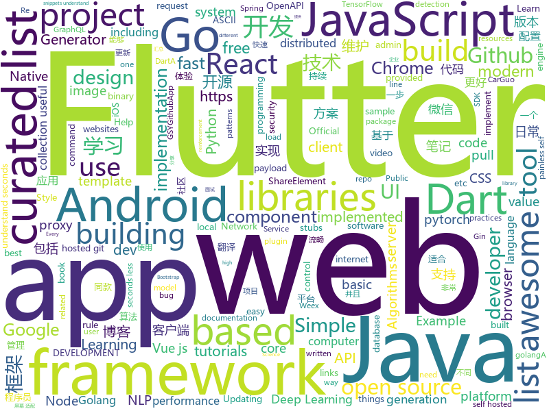

# 2018-10-23
See what the GitHub community is most excited about today.

## python
* [TensorFlow-Course](https://github.com/open-source-for-science/TensorFlow-Course)(**267 stars today**): Simple and ready-to-use tutorials for TensorFlow
* [graph_nets](https://github.com/deepmind/graph_nets)(**180 stars today**): Build Graph Nets in Tensorflow
* [Python](https://github.com/TheAlgorithms/Python)(**141 stars today**): All Algorithms implemented in Python
* [BERT-pytorch](https://github.com/codertimo/BERT-pytorch)(**111 stars today**): Google AI 2018 BERT pytorch implementation
* [Metis](https://github.com/Tencent/Metis)(**95 stars today**): Metis is a learnware platform in the field of AIOps.
* [trfl](https://github.com/deepmind/trfl)(**96 stars today**): TensorFlow Reinforcement Learning
* [esp8266_honeypot](https://github.com/gbafana25/esp8266_honeypot)(**86 stars today**): THE ESP8266 HONEYPOT: A PROJECT TO TRAP SCRIPT KIDDIES EVERYWHRE!!
* [protocol](https://github.com/luismartingarcia/protocol)(**82 stars today**): An ASCII Header Generator for Network Protocols
* [models](https://github.com/tensorflow/models)(**64 stars today**): Models and examples built with TensorFlow
* [Algorithm_Interview_Notes-Chinese](https://github.com/imhuay/Algorithm_Interview_Notes-Chinese)(**61 stars today**): 2018/2019/校招/春招/秋招/算法/机器学习(Machine Learning)/深度学习(Deep Learning)/自然语言处理(NLP)/C/C++/Python/面试笔记
* [system-design-primer](https://github.com/donnemartin/system-design-primer)(**58 stars today**): Learn how to design large-scale systems. Prep for the system design interview. Includes Anki flashcards.
* [awesome-algorithm](https://github.com/apachecn/awesome-algorithm)(**57 stars today**): Leetcode 题解 (跟随思路一步一步撸出代码) 及经典算法实现
* [keras](https://github.com/keras-team/keras)(**42 stars today**): Deep Learning for humans
* [tencent-ml-images](https://github.com/Tencent/tencent-ml-images)(**47 stars today**): Largest multi-label image database; ResNet-101 model; 80.73% top-1 acc on ImageNet
* [awesome-python](https://github.com/vinta/awesome-python)(**41 stars today**): A curated list of awesome Python frameworks, libraries, software and resources
* [rethinking-network-pruning](https://github.com/Eric-mingjie/rethinking-network-pruning)(**38 stars today**): Rethinking the Value of Network Pruning (Pytorch)
* [cs224n-learning-camp](https://github.com/learning511/cs224n-learning-camp)(**33 stars today**): 
* [public-apis](https://github.com/toddmotto/public-apis)(**37 stars today**): A collective list of public JSON APIs for use in web development.
* [flask](https://github.com/pallets/flask)(**30 stars today**): The Python micro framework for building web applications.
* [mmdetection](https://github.com/open-mmlab/mmdetection)(**31 stars today**): Open MMLab Detection Toolbox
* [home-assistant](https://github.com/home-assistant/home-assistant)(**28 stars today**): 🏡Open source home automation that puts local control and privacy first
* [Mask_RCNN](https://github.com/matterport/Mask_RCNN)(**27 stars today**): Mask R-CNN for object detection and instance segmentation on Keras and TensorFlow
* [byob](https://github.com/malwaredllc/byob)(**29 stars today**): BYOB (Build Your Own Botnet)
* [responder](https://github.com/kennethreitz/responder)(**30 stars today**): a familiar HTTP Service Framework for Python
* [youtube-dl](https://github.com/rg3/youtube-dl)(****): Command-line program to download videos from YouTube.com and other video sites

## java
* [JavaGuide](https://github.com/Snailclimb/JavaGuide)(**122 stars today**): 【Java学习+面试指南】 一份涵盖大部分Java程序员所需要掌握的核心知识。
* [symphony](https://github.com/b3log/symphony)(**70 stars today**): 🎶一款用 Java 实现的现代化社区（论坛/BBS/社交网络/博客）平台。https://hacpai.com
* [MVVMHabit](https://github.com/goldze/MVVMHabit)(**63 stars today**): 基于谷歌最新AAC架构，MVVM设计模式的一套快速开发库，整合Okhttp+RxJava+Retrofit+Glide等主流模块，满足日常开发需求。使用该框架可以快速开发一个健壮、易维护的Android应用。
* [java-design-patterns](https://github.com/iluwatar/java-design-patterns)(**55 stars today**): Design patterns implemented in Java
* [spring-boot](https://github.com/spring-projects/spring-boot)(**44 stars today**): Spring Boot
* [arthas](https://github.com/alibaba/arthas)(**42 stars today**): Alibaba Java Diagnostic Tool Arthas/Alibaba Java诊断利器Arthas
* [Phantom](https://github.com/ManbangGroup/Phantom)(**42 stars today**): Phantom — 唯一零 Hook 稳定占坑类 Android 热更新插件化方案
* [Java](https://github.com/TheAlgorithms/Java)(**38 stars today**): All Algorithms implemented in Java
* [tutorials](https://github.com/eugenp/tutorials)(**23 stars today**): The "REST With Spring" Course:
* [JCSprout](https://github.com/crossoverJie/JCSprout)(**33 stars today**): 👨‍🎓Java Core Sprout : basic, concurrent, algorithm
* [TitleBar](https://github.com/getActivity/TitleBar)(**36 stars today**): A simple generic title bar
* [guava](https://github.com/google/guava)(**32 stars today**): Google core libraries for Java
* [pulsar](https://github.com/apache/pulsar)(**34 stars today**): Apache Pulsar - distributed pub-sub messaging system
* [incubator-dubbo](https://github.com/apache/incubator-dubbo)(**25 stars today**): Apache Dubbo (incubating) is a high-performance, java based, open source RPC framework.
* [elasticsearch](https://github.com/elastic/elasticsearch)(**29 stars today**): Open Source, Distributed, RESTful Search Engine
* [Auto.js](https://github.com/hyb1996/Auto.js)(**29 stars today**): A UiAutomator on android, does not need root access
* [apollo](https://github.com/ctripcorp/apollo)(**25 stars today**): Apollo（阿波罗）是携程框架部门研发的分布式配置中心，能够集中化管理应用不同环境、不同集群的配置，配置修改后能够实时推送到应用端，并且具备规范的权限、流程治理等特性，适用于微服务配置管理场景。
* [AndroidUtilCode](https://github.com/Blankj/AndroidUtilCode)(**20 stars today**): 🔥Android developers should collect the following utils(updating).
* [spring-framework](https://github.com/spring-projects/spring-framework)(**22 stars today**): Spring Framework
* [HenCoderPlus](https://github.com/rengwuxian/HenCoderPlus)(**26 stars today**): HenCoder Plus 的课上代码分享
* [java-sec-code](https://github.com/JoyChou93/java-sec-code)(**23 stars today**): Java常见通用漏洞和修复的代码以及利用payload
* [weixin-java-tools](https://github.com/Wechat-Group/weixin-java-tools)(**21 stars today**): 全能微信Java开发工具包，支持包括微信支付、开放平台、小程序、企业微信/企业号和公众号等的开发
* [java8-tutorial](https://github.com/winterbe/java8-tutorial)(**24 stars today**): Modern Java - A Guide to Java 8
* [YcShareElement](https://github.com/yellowcath/YcShareElement)(**24 stars today**): Easy to implement Android ShareElement Animation（轻松实现Android ShareElement动画）
* [AndroidAutoSize](https://github.com/JessYanCoding/AndroidAutoSize)(**20 stars today**): 🔥A low-cost Android screen adaptation solution (今日头条屏幕适配方案终极版，一个极低成本的 Android 屏幕适配方案).

## unknown
* [awesome-actions](https://github.com/sdras/awesome-actions)(**728 stars today**): A curated list of awesome actions to use on GitHub
* [Awesome-pytorch-list](https://github.com/bharathgs/Awesome-pytorch-list)(**511 stars today**): A comprehensive list of pytorch related content on github,such as different models,implementations,helper libraries,tutorials etc.
* [git-flight-rules](https://github.com/k88hudson/git-flight-rules)(**393 stars today**): Flight rules for git
* [awesome-piracy](https://github.com/Igglybuff/awesome-piracy)(**196 stars today**): A curated list of awesome warez and piracy links
* [free-programming-books](https://github.com/EbookFoundation/free-programming-books)(**143 stars today**): 📚Freely available programming books
* [first-contributions](https://github.com/firstcontributions/first-contributions)(**48 stars today**): 🚀✨Help beginners to contribute to open source projects
* [YCBlogs](https://github.com/yangchong211/YCBlogs)(**112 stars today**): 博客笔记大汇总【16年3月到至今】，包括Java基础及深入知识点，Android技术博客，Python，Go学习笔记等等，还包括平时开发中遇到的bug汇总，当然也在工作之余收集了大量的面试题，长期更新维护并且修正，持续完善……开源的文件是markdown格式的！同时也开源了生活博客，从12年起，积累共计47篇[近20万字]，转载请注明出处，谢谢！
* [weekly](https://github.com/ruanyf/weekly)(**95 stars today**): 技术分享周刊，每周五发布
* [You-Dont-Know-JS](https://github.com/getify/You-Dont-Know-JS)(**88 stars today**): A book series on JavaScript. @YDKJS on twitter.
* [developer-roadmap](https://github.com/kamranahmedse/developer-roadmap)(**87 stars today**): Roadmap to becoming a web developer in 2018
* [awesome-deep-learning](https://github.com/ChristosChristofidis/awesome-deep-learning)(**71 stars today**): A curated list of awesome Deep Learning tutorials, projects and communities.
* [gitignore](https://github.com/github/gitignore)(**54 stars today**): A collection of useful .gitignore templates
* [awesome](https://github.com/sindresorhus/awesome)(**64 stars today**): 😎Curated list of awesome lists
* [goQuality-dev-contents](https://github.com/Integerous/goQuality-dev-contents)(**52 stars today**): { 고퀄리티⚡️개발 컨텐츠 모음 }
* [coding-interview-university](https://github.com/jwasham/coding-interview-university)(**38 stars today**): A complete computer science study plan to become a software engineer.
* [A-to-Z-Resources-for-Students](https://github.com/dipakkr/A-to-Z-Resources-for-Students)(**27 stars today**): Curated list of resources for college students If you like give a⭐️
* [CS-Notes](https://github.com/CyC2018/CS-Notes)(**37 stars today**): 📚Computer Science Learning Notes
* [project-based-learning](https://github.com/tuvtran/project-based-learning)(**44 stars today**): Curated list of project-based tutorials
* [Make-a-Pull-Request](https://github.com/rishabh-bansal/Make-a-Pull-Request)(**7 stars today**): Make a Pull Request
* [qqgroup-visualization](https://github.com/gstok/qqgroup-visualization)(**30 stars today**): 
* [pwa-bugs](https://github.com/PWA-POLICE/pwa-bugs)(**37 stars today**): List of PWA Bugs and workarounds
* [awesome-vue](https://github.com/vuejs/awesome-vue)(**33 stars today**): 🎉A curated list of awesome things related to Vue.js
* [gold-miner](https://github.com/xitu/gold-miner)(**34 stars today**): 🥇掘金翻译计划，可能是世界最大最好的英译中技术社区，最懂读者和译者的翻译平台：
* [Hazel](https://github.com/TheCherno/Hazel)(**31 stars today**): Hazel Engine
* [CVE-2018-3191](https://github.com/voidfyoo/CVE-2018-3191)(**29 stars today**): CVE-2018-3191 payload generator

## javascript
* [33-js-concepts](https://github.com/leonardomso/33-js-concepts)(**1,489 stars today**): 📜33 concepts every JavaScript developer should know.
* [33-js-concepts](https://github.com/stephentian/33-js-concepts)(**461 stars today**): 📜每个 JavaScript 工程师都应懂的33个概念 @leonardomso
* [omi](https://github.com/Tencent/omi)(**378 stars today**): Next generation web framework in 4kb JavaScript (Web Components + JSX + Proxy + Store + Path Updating)
* [graphpack](https://github.com/glennreyes/graphpack)(**190 stars today**): ☄️A minimalistic zero-config GraphQL server.
* [percollate](https://github.com/danburzo/percollate)(**190 stars today**): 🌐→📖A command-line tool to turn web pages into beautifully formatted PDFs
* [30-seconds-of-code](https://github.com/30-seconds/30-seconds-of-code)(**169 stars today**): Curated collection of useful JavaScript snippets that you can understand in 30 seconds or less.
* [evergreen](https://github.com/segmentio/evergreen)(**162 stars today**): 🌲Evergreen React UI Framework by Segment
* [freeCodeCamp](https://github.com/freeCodeCamp/freeCodeCamp)(****): The https://freeCodeCamp.org open source codebase and curriculum. Learn to code for free together with millions of people.
* [create-react-app](https://github.com/facebook/create-react-app)(**103 stars today**): Set up a modern web app by running one command.
* [vue](https://github.com/vuejs/vue)(**92 stars today**): 🖖A progressive, incrementally-adoptable JavaScript framework for building UI on the web.
* [react](https://github.com/facebook/react)(**87 stars today**): A declarative, efficient, and flexible JavaScript library for building user interfaces.
* [graphqldesigner.com](https://github.com/GraphQL-Designer/graphqldesigner.com)(**76 stars today**): A developer web-app tool to rapidly prototype a full stack CRUD implementation of GraphQL with React.
* [awesome-vscode](https://github.com/viatsko/awesome-vscode)(**66 stars today**): 🎨A curated list of delightful VS Code packages and resources.
* [puppeteer](https://github.com/GoogleChrome/puppeteer)(**59 stars today**): Headless Chrome Node API
* [axios](https://github.com/axios/axios)(**58 stars today**): Promise based HTTP client for the browser and node.js
* [antcloud-node-stack](https://github.com/alipay/antcloud-node-stack)(**62 stars today**): 蚂蚁金融科技官方 Node 技术栈脚本
* [react-native](https://github.com/facebook/react-native)(**53 stars today**): A framework for building native apps with React.
* [free-programming-books-zh_CN](https://github.com/justjavac/free-programming-books-zh_CN)(**48 stars today**): 📚免费的计算机编程类中文书籍，欢迎投稿
* [gatsby](https://github.com/gatsbyjs/gatsby)(**49 stars today**): Build blazing fast, modern apps and websites with React
* [javascript](https://github.com/airbnb/javascript)(**45 stars today**): JavaScript Style Guide
* [storybook](https://github.com/storybooks/storybook)(**45 stars today**): Interactive UI component dev & test: React, React Native, Vue, Angular, Ember
* [javascript-algorithms](https://github.com/trekhleb/javascript-algorithms)(**44 stars today**): 🤖Algorithms and data structures implemented in JavaScript with explanations and links to further readings
* [material-ui](https://github.com/mui-org/material-ui)(**39 stars today**): React components that implement Google's Material Design.
* [mpvue](https://github.com/Meituan-Dianping/mpvue)(**43 stars today**): 基于 Vue.js 的小程序开发框架，从底层支持 Vue.js 语法和构建工具体系。
* [styled-map](https://github.com/scf4/styled-map)(**44 stars today**): A super simple way to map props to styles with Styled Components✨

## html
* [async-javascript-cheatsheet](https://github.com/frontarm/async-javascript-cheatsheet)(**228 stars today**): Cheatsheet for promises and async/await
* [30-seconds-of-css](https://github.com/30-seconds/30-seconds-of-css)(**59 stars today**): A curated collection of useful CSS snippets you can understand in 30 seconds or less.
* [mastering-modular-javascript](https://github.com/mjavascript/mastering-modular-javascript)(**43 stars today**): 📦Module thinking, principles, design patterns and best practices.
* [webperl](https://github.com/haukex/webperl)(**36 stars today**): 🕸️🐪Run Perl 5 in the browser with WebPerl!
* [React-Ladies](https://github.com/M0nica/React-Ladies)(**34 stars today**): We're a group of women and non-binary ReactJS enthusiasts in New York City (and beyond).
* [Spoon-Knife](https://github.com/octocat/Spoon-Knife)(****): This repo is for demonstration purposes only.
* [solid](https://github.com/solid/solid)(**21 stars today**): Solid - Re-decentralizing the web (project directory)
* [fancy-border-radius](https://github.com/9elements/fancy-border-radius)(**20 stars today**): When you use eight values specifying border-radius in CSS, you can build organic looking shapes. Simply use our Generator at
* [baselines](https://github.com/openai/baselines)(**16 stars today**): OpenAI Baselines: high-quality implementations of reinforcement learning algorithms
* [PatrowlManager](https://github.com/Patrowl/PatrowlManager)(**16 stars today**): PatrOwl - Open Source, Free and Scalable Security Operations Orchestration Platform
* [coreui-free-bootstrap-admin-template](https://github.com/coreui/coreui-free-bootstrap-admin-template)(**16 stars today**): CoreUI is free bootstrap admin template
* [AdminLTE](https://github.com/almasaeed2010/AdminLTE)(**14 stars today**): AdminLTE - Free Premium Admin control Panel Theme Based On Bootstrap 3.x
* [NLP-progress](https://github.com/sebastianruder/NLP-progress)(**15 stars today**): Repository to track the progress in Natural Language Processing (NLP), including the datasets and the current state-of-the-art for the most common NLP tasks.
* [GTFOBins.github.io](https://github.com/GTFOBins/GTFOBins.github.io)(**11 stars today**): Curated list of Unix binaries that can be exploited to bypass system security restrictions
* [skill-map](https://github.com/TeamStuQ/skill-map)(**10 stars today**): 程序员技能图谱
* [cs231n.github.io](https://github.com/cs231n/cs231n.github.io)(**8 stars today**): Public facing notes page
* [chrome](https://github.com/free-vpn/chrome)(**8 stars today**): VPN Chrome is Google Chromium based browser with built-in VPN capability to let users surf the Internet in a secure and private way.
* [lazyestload.js](https://github.com/Paul-Browne/lazyestload.js)(**9 stars today**): load images only when they are in (and remain in) the viewport
* [swagger-codegen](https://github.com/swagger-api/swagger-codegen)(**7 stars today**): swagger-codegen contains a template-driven engine to generate documentation, API clients and server stubs in different languages by parsing your OpenAPI / Swagger definition.
* [learning-area](https://github.com/mdn/learning-area)(**5 stars today**): Github repo for the MDN Learning Area.
* [Contributors-portraits](https://github.com/MattCrl/Contributors-portraits)(****): a Simple HTML/CSS project for Hacktoberfest pull requests. Introduce yourself in a card !
* [react-redux](https://github.com/reduxjs/react-redux)(**7 stars today**): Official React bindings for Redux
* [WebFundamentals](https://github.com/google/WebFundamentals)(**6 stars today**): Best practices for modern web development
* [javascript-tutorial-en](https://github.com/iliakan/javascript-tutorial-en)(**5 stars today**): Modern JavaScript Tutorial
* [openapi-generator](https://github.com/OpenAPITools/openapi-generator)(**6 stars today**): OpenAPI Generator allows generation of API client libraries (SDK generation), server stubs, documentation and configuration automatically given an OpenAPI Spec (v2, v3)

## dart
* [flutter](https://github.com/flutter/flutter)(**75 stars today**): Flutter makes it easy and fast to build beautiful mobile apps.
* [awesome-flutter](https://github.com/Solido/awesome-flutter)(**20 stars today**): An awesome list that curates the best Flutter libraries, tools, tutorials, articles and more.
* [plugins](https://github.com/flutter/plugins)(**9 stars today**): Plugins for Flutter, including FlutterFire, maintained by the Flutter team
* [GSYGithubAppFlutter](https://github.com/CarGuo/GSYGithubAppFlutter)(**8 stars today**): 超完整的Flutter项目，功能丰富，适合学习和日常使用。GSYGithubApp系列的优势：我们目前已经拥有Flutter、Weex、ReactNative三个版本。 功能齐全，项目框架内技术涉及面广，完成度高，持续维护，配套文章，适合全面学习，跨框架对比参考。跨平台的开源Github客户端App，更好的体验，更丰富的功能，旨在更好的日常管理和维护个人Github，提供更好更方便的驾车体验～～Σ(￣。￣ﾉ)ﾉ。同款Weex版本 ： https://github.com/CarGuo/GSYGithubAppWeex 、同款React Native版本 ： https://github.com/CarGuo/GSYGithubApp
* [FlutterExampleApps](https://github.com/iampawan/FlutterExampleApps)(**5 stars today**): [Example APPS] Basic Flutter apps, for flutter devs.
* [Flutter-UI-Kit](https://github.com/iampawan/Flutter-UI-Kit)(**5 stars today**): Flutter app for collection of UI in a UIKit
* [rxdart](https://github.com/ReactiveX/rxdart)(**5 stars today**): The Reactive Extensions for Dart
* [linter](https://github.com/dart-lang/linter)(****): Linter for Dart.
* [built_value.dart](https://github.com/google/built_value.dart)(****): Immutable value types, enum classes, and serialization.
* [flutter_google_map_view](https://github.com/apptreesoftware/flutter_google_map_view)(****): A flutter plugin for Google Maps
* [pwa](https://github.com/isoos/pwa)(****): Progressive Web App library for Dart
* [flutter_pulltorefresh](https://github.com/peng8350/flutter_pulltorefresh)(****): a widget provided to the flutter scroll component drop-down refresh and pull up load.
* [chromedeveditor](https://github.com/googlearchive/chromedeveditor)(****): Chrome Dev Editor is a developer tool for building apps on the Chrome platform - Chrome Apps and Web Apps, in JavaScript or Dart. (NO LONGER IN ACTIVE DEVELOPMENT)
* [sdk](https://github.com/dart-lang/sdk)(****): The Dart SDK, including the VM, dart2js, core libraries, and more.
* [flutter-osc](https://github.com/yubo725/flutter-osc)(****): 基于Google Flutter的开源中国客户端，支持Android和iOS。
* [flutter-examples](https://github.com/nisrulz/flutter-examples)(****): [Examples] Simple basic isolated apps, for budding flutter devs.
* [flutter_architecture_samples](https://github.com/brianegan/flutter_architecture_samples)(****): TodoMVC for Flutter
* [Flutter-learning](https://github.com/AweiLoveAndroid/Flutter-learning)(****): 🔥👍🌟⭐️⭐️⭐️Flutter install&settings,Flutter problems when developing,Flutter sample codes& templates,Flutter projects,Dart languages sample codes
* [inKino](https://github.com/roughike/inKino)(****): inKino - A cross platform movie and showtime browser for Finnkino cinemas, made with Flutter.
* [dio](https://github.com/flutterchina/dio)(****): A powerful Http client for Dart, which supports Interceptors, FormData, Request Cancellation, File Downloading, Timeout etc.
* [hauberk](https://github.com/munificent/hauberk)(****): A web-based roguelike written in Dart.
* [zhihu-flutter](https://github.com/HackSoul/zhihu-flutter)(****): Flutter 高仿知乎 UI，非常漂亮，也非常流畅，flutter build apk 或 flutter build ios 之后更流畅
* [angular](https://github.com/dart-lang/angular)(****): Fast and productive web framework provided by Dart
* [StageXL](https://github.com/bp74/StageXL)(****): A fast and universal 2D rendering engine for HTML5 and Dart.
* [dart-sass](https://github.com/sass/dart-sass)(****): A Dart implementation of Sass.

## go
* [soar](https://github.com/XiaoMi/soar)(**584 stars today**): SQL Optimizer And Rewriter
* [croc](https://github.com/schollz/croc)(**335 stars today**): Easily and securely send things from one computer to another🐊📦
* [tableflip](https://github.com/cloudflare/tableflip)(**83 stars today**): Graceful process restarts in Go
* [dst](https://github.com/dave/dst)(**81 stars today**): Decorated Syntax Tree - manipulate Go source with perfect fidelity.
* [photoprism](https://github.com/photoprism/photoprism)(**67 stars today**): Personal photo management powered by Go and Google TensorFlow
* [image2ascii](https://github.com/qeesung/image2ascii)(**67 stars today**): 🌁Convert image to ASCII
* [BaiduPCS-Go](https://github.com/iikira/BaiduPCS-Go)(**56 stars today**): 百度网盘客户端 - Go语言编写
* [kubernetes](https://github.com/kubernetes/kubernetes)(**49 stars today**): Production-Grade Container Scheduling and Management
* [go](https://github.com/golang/go)(**47 stars today**): The Go programming language
* [mole](https://github.com/davrodpin/mole)(**49 stars today**): cli app to create ssh tunnels
* [awesome-go](https://github.com/avelino/awesome-go)(**43 stars today**): A curated list of awesome Go frameworks, libraries and software
* [yeetgif](https://github.com/sgreben/yeetgif)(**38 stars today**): gif effects CLI. single binary, no dependencies. linux, osx, windows. #1 workplace productivity booster. #yeetgif #eggplant #golang
* [frp](https://github.com/fatedier/frp)(**34 stars today**): A fast reverse proxy to help you expose a local server behind a NAT or firewall to the internet.
* [illustrated-tls](https://github.com/syncsynchalt/illustrated-tls)(**32 stars today**): The Illustrated TLS Connection: Every byte explained
* [gitea](https://github.com/go-gitea/gitea)(**30 stars today**): Git with a cup of tea, painless self-hosted git service
* [hugo](https://github.com/gohugoio/hugo)(**28 stars today**): The world’s fastest framework for building websites.
* [gin](https://github.com/gin-gonic/gin)(**25 stars today**): Gin is a HTTP web framework written in Go (Golang). It features a Martini-like API with much better performance -- up to 40 times faster. If you need smashing performance, get yourself some Gin.
* [build-web-application-with-golang](https://github.com/astaxie/build-web-application-with-golang)(**25 stars today**): A golang ebook intro how to build a web with golang
* [clash](https://github.com/Dreamacro/clash)(**26 stars today**): A rule based proxy in Go.
* [terraform](https://github.com/hashicorp/terraform)(**24 stars today**): Terraform is a tool for building, changing, and combining infrastructure safely and efficiently.
* [go-ethereum](https://github.com/ethereum/go-ethereum)(**22 stars today**): Official Go implementation of the Ethereum protocol
* [tidb](https://github.com/pingcap/tidb)(**23 stars today**): TiDB is a distributed HTAP database compatible with the MySQL protocol
* [gogs](https://github.com/gogs/gogs)(**24 stars today**): Gogs is a painless self-hosted Git service.
* [zygomys](https://github.com/glycerine/zygomys)(**23 stars today**): Java has Clojure, Go has zygo. A 100% Golang, easy-to-use Lisp.
* [helm](https://github.com/helm/helm)(**19 stars today**): The Kubernetes Package Manager

## WordCloud

