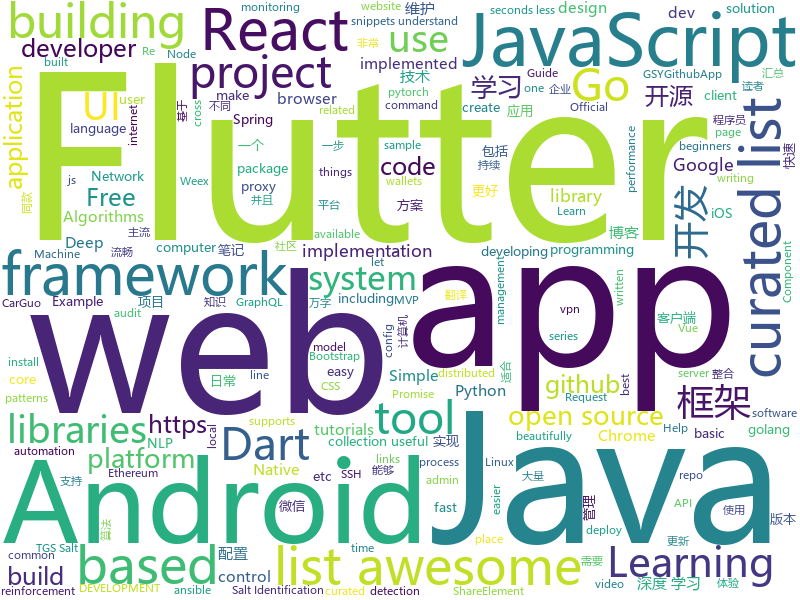

# 2018-10-24
See what the GitHub community is most excited about today.

## python
* [TensorFlow-Course](https://github.com/open-source-for-science/TensorFlow-Course)(**233 stars today**): Simple and ready-to-use tutorials for TensorFlow
* [Python](https://github.com/TheAlgorithms/Python)(**148 stars today**): All Algorithms implemented in Python
* [graph_nets](https://github.com/deepmind/graph_nets)(**114 stars today**): Build Graph Nets in Tensorflow
* [models](https://github.com/tensorflow/models)(**74 stars today**): Models and examples built with TensorFlow
* [cs224n-learning-camp](https://github.com/learning511/cs224n-learning-camp)(**79 stars today**): 
* [Algorithm_Interview_Notes-Chinese](https://github.com/imhuay/Algorithm_Interview_Notes-Chinese)(**69 stars today**): 2018/2019/校招/春招/秋招/算法/机器学习(Machine Learning)/深度学习(Deep Learning)/自然语言处理(NLP)/C/C++/Python/面试笔记
* [awesome-algorithm](https://github.com/apachecn/awesome-algorithm)(**72 stars today**): Leetcode 题解 (跟随思路一步一步撸出代码) 及经典算法实现
* [system-design-primer](https://github.com/donnemartin/system-design-primer)(**65 stars today**): Learn how to design large-scale systems. Prep for the system design interview. Includes Anki flashcards.
* [BERT-pytorch](https://github.com/codertimo/BERT-pytorch)(**66 stars today**): Google AI 2018 BERT pytorch implementation
* [public-apis](https://github.com/toddmotto/public-apis)(**68 stars today**): A collective list of public JSON APIs for use in web development.
* [protocol](https://github.com/luismartingarcia/protocol)(**60 stars today**): An ASCII Header Generator for Network Protocols
* [trfl](https://github.com/deepmind/trfl)(**56 stars today**): TensorFlow Reinforcement Learning
* [awesome-python](https://github.com/vinta/awesome-python)(**47 stars today**): A curated list of awesome Python frameworks, libraries, software and resources
* [youtube-dl](https://github.com/rg3/youtube-dl)(**51 stars today**): Command-line program to download videos from YouTube.com and other video sites
* [Metis](https://github.com/Tencent/Metis)(**46 stars today**): Metis is a learnware platform in the field of AIOps.
* [Kaggle_TGS2018_4th_solution](https://github.com/SeuTao/Kaggle_TGS2018_4th_solution)(**49 stars today**): Kaggle TGS Salt Identification Challenge 2018 4th place code
* [home-assistant](https://github.com/home-assistant/home-assistant)(**44 stars today**): 🏡Open source home automation that puts local control and privacy first
* [pytorch-saltnet](https://github.com/tugstugi/pytorch-saltnet)(**47 stars today**): Kaggle | 9th place single model solution for TGS Salt Identification Challenge
* [keras](https://github.com/keras-team/keras)(**41 stars today**): Deep Learning for humans
* [Face_Attention_Network](https://github.com/rainofmine/Face_Attention_Network)(**48 stars today**): Pytorch implementation of face attention network
* [pytorch_geometric](https://github.com/rusty1s/pytorch_geometric)(**45 stars today**): Geometric Deep Learning Extension Library for PyTorch
* [Mask_RCNN](https://github.com/matterport/Mask_RCNN)(**38 stars today**): Mask R-CNN for object detection and instance segmentation on Keras and TensorFlow
* [ansible](https://github.com/ansible/ansible)(**28 stars today**): Ansible is a radically simple IT automation platform that makes your applications and systems easier to deploy. Avoid writing scripts or custom code to deploy and update your applications — automate in a language that approaches plain English, using SSH, with no agents to install on remote systems. https://docs.ansible.com/ansible/
* [requests](https://github.com/requests/requests)(**32 stars today**): Python HTTP Requests for Humans™✨🍰✨
* [mmdetection](https://github.com/open-mmlab/mmdetection)(**30 stars today**): Open MMLab Detection Toolbox

## java
* [JavaGuide](https://github.com/Snailclimb/JavaGuide)(**286 stars today**): 【Java学习+面试指南】 一份涵盖大部分Java程序员所需要掌握的核心知识。
* [subzero](https://github.com/square/subzero)(**218 stars today**): Square's Bitcoin Cold Storage solution.
* [AndroidAutoSize](https://github.com/JessYanCoding/AndroidAutoSize)(**181 stars today**): 🔥A low-cost Android screen adaptation solution (今日头条屏幕适配方案终极版，一个极低成本的 Android 屏幕适配方案).
* [symphony](https://github.com/b3log/symphony)(**100 stars today**): 🎶一款用 Java 实现的现代化社区（论坛/BBS/社交网络/博客）平台。https://hacpai.com
* [Phantom](https://github.com/ManbangGroup/Phantom)(**81 stars today**): Phantom — 唯一零 Hook 稳定占坑类 Android 热更新插件化方案
* [MVVMHabit](https://github.com/goldze/MVVMHabit)(**63 stars today**): 🚀基于谷歌最新AAC架构，MVVM设计模式的一套快速开发库，整合Okhttp+RxJava+Retrofit+Glide等主流模块，满足日常开发需求。使用该框架可以快速开发一个健壮、易维护的Android应用。
* [spring-boot](https://github.com/spring-projects/spring-boot)(**50 stars today**): Spring Boot
* [elasticsearch](https://github.com/elastic/elasticsearch)(**51 stars today**): Open Source, Distributed, RESTful Search Engine
* [weixin-java-tools](https://github.com/Wechat-Group/weixin-java-tools)(**47 stars today**): 全能微信Java开发工具包，支持包括微信支付、开放平台、小程序、企业微信/企业号和公众号等的开发
* [java-design-patterns](https://github.com/iluwatar/java-design-patterns)(**48 stars today**): Design patterns implemented in Java
* [JCSprout](https://github.com/crossoverJie/JCSprout)(**47 stars today**): 👨‍🎓Java Core Sprout : basic, concurrent, algorithm
* [arthas](https://github.com/alibaba/arthas)(**46 stars today**): Alibaba Java Diagnostic Tool Arthas/Alibaba Java诊断利器Arthas
* [tutorials](https://github.com/eugenp/tutorials)(**26 stars today**): The "REST With Spring" Course:
* [YcShareElement](https://github.com/yellowcath/YcShareElement)(**46 stars today**): Easy to implement Android ShareElement Animation（轻松实现Android ShareElement动画）
* [Java](https://github.com/TheAlgorithms/Java)(**34 stars today**): All Algorithms implemented in Java
* [ToastUtils](https://github.com/getActivity/ToastUtils)(**39 stars today**): This is a very functional Toast
* [zxing](https://github.com/zxing/zxing)(**36 stars today**): ZXing ("Zebra Crossing") barcode scanning library for Java, Android
* [java8-tutorial](https://github.com/winterbe/java8-tutorial)(**29 stars today**): Modern Java - A Guide to Java 8
* [apollo](https://github.com/ctripcorp/apollo)(**28 stars today**): Apollo（阿波罗）是携程框架部门研发的分布式配置中心，能够集中化管理应用不同环境、不同集群的配置，配置修改后能够实时推送到应用端，并且具备规范的权限、流程治理等特性，适用于微服务配置管理场景。
* [okhttp](https://github.com/square/okhttp)(**30 stars today**): An HTTP+HTTP/2 client for Android and Java applications.
* [Sentinel](https://github.com/alibaba/Sentinel)(**29 stars today**): A lightweight flow-control library providing high-available protection and monitoring (高可用防护的流量管理框架)
* [spring-framework](https://github.com/spring-projects/spring-framework)(**22 stars today**): Spring Framework
* [MVPArms](https://github.com/JessYanCoding/MVPArms)(**29 stars today**): ⚔️A common architecture for Android applications developing based on MVP, integrates many open source projects, to make your developing quicker and easier (一个整合了大量主流开源项目高度可配置化的 Android MVP 快速集成框架).
* [guava](https://github.com/google/guava)(**28 stars today**): Google core libraries for Java
* [pulsar](https://github.com/apache/pulsar)(**27 stars today**): Apache Pulsar - distributed pub-sub messaging system

## unknown
* [DeepLearning-500-questions](https://github.com/scutan90/DeepLearning-500-questions)(**844 stars today**): 深度学习500问，以问答形式对常用的概率知识、线性代数、机器学习、深度学习、计算机视觉等热点问题进行阐述，以帮助自己及有需要的读者。 全书分为15个章节，近20万字。由于水平有限，书中不妥之处恳请广大读者批评指正。 未完待续............ 如有意合作，联系scutjy2015@163.com 版权所有，违权必究 Tan 2018.06
* [awesome-actions](https://github.com/sdras/awesome-actions)(**404 stars today**): A curated list of awesome actions to use on GitHub
* [git-flight-rules](https://github.com/k88hudson/git-flight-rules)(**350 stars today**): Flight rules for git
* [Awesome-pytorch-list](https://github.com/bharathgs/Awesome-pytorch-list)(**229 stars today**): A comprehensive list of pytorch related content on github,such as different models,implementations,helper libraries,tutorials etc.
* [CS-Notes](https://github.com/CyC2018/CS-Notes)(**179 stars today**): 📚Computer Science Learning Notes
* [awesome-piracy](https://github.com/Igglybuff/awesome-piracy)(**155 stars today**): A curated list of awesome warez and piracy links
* [first-contributions](https://github.com/firstcontributions/first-contributions)(**49 stars today**): 🚀✨Help beginners to contribute to open source projects
* [free-programming-books](https://github.com/EbookFoundation/free-programming-books)(**102 stars today**): 📚Freely available programming books
* [developer-roadmap](https://github.com/kamranahmedse/developer-roadmap)(**97 stars today**): Roadmap to becoming a web developer in 2018
* [You-Dont-Know-JS](https://github.com/getify/You-Dont-Know-JS)(**71 stars today**): A book series on JavaScript. @YDKJS on twitter.
* [fe9-library](https://github.com/frontend9/fe9-library)(**77 stars today**): 九部知识库
* [awesome](https://github.com/sindresorhus/awesome)(**69 stars today**): 😎Curated list of awesome lists
* [gitignore](https://github.com/github/gitignore)(**45 stars today**): A collection of useful .gitignore templates
* [CVE-2018-3191](https://github.com/voidfyoo/CVE-2018-3191)(**57 stars today**): CVE-2018-3191 payload generator
* [Make-a-Pull-Request](https://github.com/rishabh-bansal/Make-a-Pull-Request)(**17 stars today**): Make a Pull Request
* [coding-interview-university](https://github.com/jwasham/coding-interview-university)(**58 stars today**): A complete computer science study plan to become a software engineer.
* [gold-miner](https://github.com/xitu/gold-miner)(**61 stars today**): 🥇掘金翻译计划，可能是世界最大最好的英译中技术社区，最懂读者和译者的翻译平台：
* [weekly](https://github.com/ruanyf/weekly)(**63 stars today**): 技术分享周刊，每周五发布
* [YCBlogs](https://github.com/yangchong211/YCBlogs)(**57 stars today**): 博客笔记大汇总【16年3月到至今】，包括Java基础及深入知识点，Android技术博客，Python，Go学习笔记等等，还包括平时开发中遇到的bug汇总，当然也在工作之余收集了大量的面试题，长期更新维护并且修正，持续完善……开源的文件是markdown格式的！同时也开源了生活博客，从12年起，积累共计47篇[近20万字]，转载请注明出处，谢谢！
* [awesome-deep-learning](https://github.com/ChristosChristofidis/awesome-deep-learning)(**52 stars today**): A curated list of awesome Deep Learning tutorials, projects and communities.
* [RCPapers](https://github.com/thunlp/RCPapers)(**54 stars today**): Must-read papers on Machine Reading Comprehension
* [awesome-vue](https://github.com/vuejs/awesome-vue)(**51 stars today**): 🎉A curated list of awesome things related to Vue.js
* [goQuality-dev-contents](https://github.com/Integerous/goQuality-dev-contents)(**42 stars today**): { 고퀄리티⚡️개발 컨텐츠 모음 }
* [project-based-learning](https://github.com/tuvtran/project-based-learning)(**36 stars today**): Curated list of project-based tutorials
* [awesome-for-beginners](https://github.com/MunGell/awesome-for-beginners)(**34 stars today**): A list of awesome beginners-friendly projects.

## javascript
* [33-js-concepts](https://github.com/leonardomso/33-js-concepts)(**1,218 stars today**): 📜33 concepts every JavaScript developer should know.
* [33-js-concepts](https://github.com/stephentian/33-js-concepts)(**741 stars today**): 📜每个 JavaScript 工程师都应懂的33个概念 @leonardomso
* [omi](https://github.com/Tencent/omi)(**233 stars today**): Next generation web framework in 4kb JavaScript (Web Components + JSX + Proxy + Store + Path Updating)
* [30-seconds-of-code](https://github.com/30-seconds/30-seconds-of-code)(**190 stars today**): Curated collection of useful JavaScript snippets that you can understand in 30 seconds or less.
* [graphpack](https://github.com/glennreyes/graphpack)(**156 stars today**): ☄️A minimalistic zero-config GraphQL server.
* [freeCodeCamp](https://github.com/freeCodeCamp/freeCodeCamp)(****): The https://freeCodeCamp.org open source codebase and curriculum. Learn to code for free together with millions of people.
* [vue](https://github.com/vuejs/vue)(**123 stars today**): 🖖A progressive, incrementally-adoptable JavaScript framework for building UI on the web.
* [evergreen](https://github.com/segmentio/evergreen)(**124 stars today**): 🌲Evergreen React UI Framework by Segment
* [react](https://github.com/facebook/react)(**115 stars today**): A declarative, efficient, and flexible JavaScript library for building user interfaces.
* [percollate](https://github.com/danburzo/percollate)(**115 stars today**): 🌐→📖A command-line tool to turn web pages into beautifully formatted PDFs
* [galio](https://github.com/galio-org/galio)(**107 stars today**): Galio is a beautifully designed, Free and Open Source React Native Framework
* [create-react-app](https://github.com/facebook/create-react-app)(**90 stars today**): Set up a modern web app by running one command.
* [siteaudit](https://github.com/thecreazy/siteaudit)(**85 stars today**): Pagespeed and lighthouse audit for your site from terminal
* [puppeteer](https://github.com/GoogleChrome/puppeteer)(**81 stars today**): Headless Chrome Node API
* [storybook](https://github.com/storybooks/storybook)(**71 stars today**): Interactive UI component dev & test: React, React Native, Vue, Angular, Ember
* [fs-remote](https://github.com/suchipi/fs-remote)(**73 stars today**): Drop-in replacement for fs that lets you write to the filesystem from the browser
* [free-programming-books-zh_CN](https://github.com/justjavac/free-programming-books-zh_CN)(**64 stars today**): 📚免费的计算机编程类中文书籍，欢迎投稿
* [axios](https://github.com/axios/axios)(**67 stars today**): Promise based HTTP client for the browser and node.js
* [react-native](https://github.com/facebook/react-native)(**60 stars today**): A framework for building native apps with React.
* [javascript](https://github.com/airbnb/javascript)(**57 stars today**): JavaScript Style Guide
* [javascript-algorithms](https://github.com/trekhleb/javascript-algorithms)(**49 stars today**): 🤖Algorithms and data structures implemented in JavaScript with explanations and links to further readings
* [graphqldesigner.com](https://github.com/GraphQL-Designer/graphqldesigner.com)(**50 stars today**): A developer web-app tool to rapidly prototype a full stack CRUD implementation of GraphQL with React.
* [awesome-vscode](https://github.com/viatsko/awesome-vscode)(**51 stars today**): 🎨A curated list of delightful VS Code packages and resources.
* [three.js](https://github.com/mrdoob/three.js)(**40 stars today**): JavaScript 3D library.
* [next.js](https://github.com/zeit/next.js)(**47 stars today**): The React Framework

## html
* [async-javascript-cheatsheet](https://github.com/frontarm/async-javascript-cheatsheet)(**326 stars today**): Cheatsheet for promises and async/await
* [30-seconds-of-css](https://github.com/30-seconds/30-seconds-of-css)(**47 stars today**): A curated collection of useful CSS snippets you can understand in 30 seconds or less.
* [gatsby-mail](https://github.com/DSchau/gatsby-mail)(**41 stars today**): A Gatsby email *application*
* [AdminLTE](https://github.com/almasaeed2010/AdminLTE)(**23 stars today**): AdminLTE - Free Premium Admin control Panel Theme Based On Bootstrap 3.x
* [fancy-border-radius](https://github.com/9elements/fancy-border-radius)(**26 stars today**): When you use eight values specifying border-radius in CSS, you can build organic looking shapes. Simply use our Generator at
* [solid](https://github.com/solid/solid)(**26 stars today**): Solid - Re-decentralizing the web (project directory)
* [mastering-modular-javascript](https://github.com/mjavascript/mastering-modular-javascript)(**23 stars today**): 📦Module thinking, principles, design patterns and best practices.
* [baselines](https://github.com/openai/baselines)(**20 stars today**): OpenAI Baselines: high-quality implementations of reinforcement learning algorithms
* [skill-map](https://github.com/TeamStuQ/skill-map)(**19 stars today**): 程序员技能图谱
* [Spoon-Knife](https://github.com/octocat/Spoon-Knife)(****): This repo is for demonstration purposes only.
* [JavaScript30](https://github.com/wesbos/JavaScript30)(**6 stars today**): 30 Day Vanilla JS Challenge
* [coreui-free-bootstrap-admin-template](https://github.com/coreui/coreui-free-bootstrap-admin-template)(**12 stars today**): CoreUI is free bootstrap admin template
* [chrome](https://github.com/free-vpn/chrome)(**12 stars today**): VPN Chrome is Google Chromium based browser with built-in VPN capability to let users surf the Internet in a secure and private way.
* [react-redux](https://github.com/reduxjs/react-redux)(**13 stars today**): Official React bindings for Redux
* [PatrowlManager](https://github.com/Patrowl/PatrowlManager)(**12 stars today**): PatrOwl - Open Source, Free and Scalable Security Operations Orchestration Platform
* [react-app-rewired](https://github.com/timarney/react-app-rewired)(**12 stars today**): Override create-react-app webpack configs without ejecting
* [NLP-progress](https://github.com/sebastianruder/NLP-progress)(**12 stars today**): Repository to track the progress in Natural Language Processing (NLP), including the datasets and the current state-of-the-art for the most common NLP tasks.
* [React-Ladies](https://github.com/M0nica/React-Ladies)(**12 stars today**): We're a group of women and non-binary ReactJS enthusiasts in New York City (and beyond).
* [ecma262](https://github.com/tc39/ecma262)(**11 stars today**): Status, process, and documents for ECMA262
* [nndl.github.io](https://github.com/nndl/nndl.github.io)(**10 stars today**): 《神经网络与深度学习》 Neural Network and Deep Learning
* [website](https://github.com/kubernetes/website)(**5 stars today**): Kubernetes website and documentation repo:
* [portainer](https://github.com/portainer/portainer)(**10 stars today**): Simple management UI for Docker
* [EIPs](https://github.com/ethereum/EIPs)(**10 stars today**): The Ethereum Improvement Proposal repository
* [cs231n.github.io](https://github.com/cs231n/cs231n.github.io)(**8 stars today**): Public facing notes page
* [sketch-measure](https://github.com/utom/sketch-measure)(**10 stars today**): Make it a fun to create spec for developers and teammates

## dart
* [flutter](https://github.com/flutter/flutter)(**85 stars today**): Flutter makes it easy and fast to build beautiful mobile apps.
* [awesome-flutter](https://github.com/Solido/awesome-flutter)(**21 stars today**): An awesome list that curates the best Flutter libraries, tools, tutorials, articles and more.
* [plugins](https://github.com/flutter/plugins)(**12 stars today**): Plugins for Flutter, including FlutterFire, maintained by the Flutter team
* [GSYGithubAppFlutter](https://github.com/CarGuo/GSYGithubAppFlutter)(**14 stars today**): 超完整的Flutter项目，功能丰富，适合学习和日常使用。GSYGithubApp系列的优势：我们目前已经拥有Flutter、Weex、ReactNative三个版本。 功能齐全，项目框架内技术涉及面广，完成度高，持续维护，配套文章，适合全面学习，跨框架对比参考。跨平台的开源Github客户端App，更好的体验，更丰富的功能，旨在更好的日常管理和维护个人Github，提供更好更方便的驾车体验～～Σ(￣。￣ﾉ)ﾉ。同款Weex版本 ： https://github.com/CarGuo/GSYGithubAppWeex 、同款React Native版本 ： https://github.com/CarGuo/GSYGithubApp
* [Flutter-Notebook](https://github.com/OpenFlutter/Flutter-Notebook)(**12 stars today**): 日更的FlutterDemo合集，今天你fu了吗
* [flutter_map](https://github.com/apptreesoftware/flutter_map)(**8 stars today**): A Flutter map package based on leaflet
* [flutter-examples](https://github.com/nisrulz/flutter-examples)(**5 stars today**): [Examples] Simple basic isolated apps, for budding flutter devs.
* [googleapis](https://github.com/dart-lang/googleapis)(****): Repository for building the googleapis packages
* [flutter_duration_picker](https://github.com/cdharris/flutter_duration_picker)(****): A Flutter Widget for allowing a user to pick a duration (e.g. 5mins, 1h 30mins, etc)
* [flutter_staggered_grid_view](https://github.com/letsar/flutter_staggered_grid_view)(****): A Flutter staggered grid view
* [flutter_villains](https://github.com/Norbert515/flutter_villains)(****): Flexible and easy to use page transitions.
* [audio_recorder](https://github.com/ZaraclaJ/audio_recorder)(****): 
* [mongo_dart](https://github.com/mongo-dart/mongo_dart)(****): Mongo_dart: MongoDB driver for Dart programming language
* [chromedeveditor](https://github.com/googlearchive/chromedeveditor)(****): Chrome Dev Editor is a developer tool for building apps on the Chrome platform - Chrome Apps and Web Apps, in JavaScript or Dart. (NO LONGER IN ACTIVE DEVELOPMENT)
* [sdk](https://github.com/dart-lang/sdk)(****): The Dart SDK, including the VM, dart2js, core libraries, and more.
* [flutter-osc](https://github.com/yubo725/flutter-osc)(****): 基于Google Flutter的开源中国客户端，支持Android和iOS。
* [Flutter-UI-Kit](https://github.com/iampawan/Flutter-UI-Kit)(****): Flutter app for collection of UI in a UIKit
* [FlutterExampleApps](https://github.com/iampawan/FlutterExampleApps)(****): [Example APPS] Basic Flutter apps, for flutter devs.
* [flutter_architecture_samples](https://github.com/brianegan/flutter_architecture_samples)(****): TodoMVC for Flutter
* [Flutter-learning](https://github.com/AweiLoveAndroid/Flutter-learning)(****): 🔥👍🌟⭐️⭐️⭐️Flutter install&settings,Flutter problems when developing,Flutter sample codes& templates,Flutter projects,Dart languages sample codes
* [inKino](https://github.com/roughike/inKino)(****): inKino - A cross platform movie and showtime browser for Finnkino cinemas, made with Flutter.
* [dio](https://github.com/flutterchina/dio)(****): A powerful Http client for Dart, which supports Interceptors, FormData, Request Cancellation, File Downloading, Timeout etc.
* [hauberk](https://github.com/munificent/hauberk)(****): A web-based roguelike written in Dart.
* [zhihu-flutter](https://github.com/HackSoul/zhihu-flutter)(****): Flutter 高仿知乎 UI，非常漂亮，也非常流畅，flutter build apk 或 flutter build ios 之后更流畅
* [angular](https://github.com/dart-lang/angular)(****): Fast and productive web framework provided by Dart

## go
* [soar](https://github.com/XiaoMi/soar)(**479 stars today**): SQL Optimizer And Rewriter
* [croc](https://github.com/schollz/croc)(**256 stars today**): Easily and securely send things from one computer to another🐊📦
* [kubernetes](https://github.com/kubernetes/kubernetes)(**57 stars today**): Production-Grade Container Scheduling and Management
* [go](https://github.com/golang/go)(**49 stars today**): The Go programming language
* [meow](https://github.com/mmcloughlin/meow)(**49 stars today**): Meow hash for Golang
* [build-web-application-with-golang](https://github.com/astaxie/build-web-application-with-golang)(**42 stars today**): A golang ebook intro how to build a web with golang
* [BaiduPCS-Go](https://github.com/iikira/BaiduPCS-Go)(**43 stars today**): 百度网盘客户端 - Go语言编写
* [frp](https://github.com/fatedier/frp)(**42 stars today**): A fast reverse proxy to help you expose a local server behind a NAT or firewall to the internet.
* [beancounter](https://github.com/square/beancounter)(**45 stars today**): Utility to audit the balance of Hierarchical Deterministic (HD) wallets. Supports multisig + segwit wallets.
* [awesome-go](https://github.com/avelino/awesome-go)(**40 stars today**): A curated list of awesome Go frameworks, libraries and software
* [hugo](https://github.com/gohugoio/hugo)(**38 stars today**): The world’s fastest framework for building websites.
* [v2ray-core](https://github.com/v2ray/v2ray-core)(**31 stars today**): A platform for building proxies to bypass network restrictions.
* [terraform](https://github.com/hashicorp/terraform)(**35 stars today**): Terraform is a tool for building, changing, and combining infrastructure safely and efficiently.
* [photoprism](https://github.com/photoprism/photoprism)(**37 stars today**): Personal photo management powered by Go and Google TensorFlow
* [image2ascii](https://github.com/qeesung/image2ascii)(**36 stars today**): 🌁Convert image to ASCII
* [tinygo](https://github.com/aykevl/tinygo)(**35 stars today**): Go compiler for small devices, based on LLVM.
* [go-ethereum](https://github.com/ethereum/go-ethereum)(**30 stars today**): Official Go implementation of the Ethereum protocol
* [js](https://github.com/apex/js)(**34 stars today**): Go WASM packages for the browser
* [brook](https://github.com/txthinking/brook)(**32 stars today**): Brook is a cross-platform(Linux/MacOS/Windows/Android/iOS) proxy/vpn software
* [tableflip](https://github.com/cloudflare/tableflip)(**33 stars today**): Graceful process restarts in Go
* [gin](https://github.com/gin-gonic/gin)(**31 stars today**): Gin is a HTTP web framework written in Go (Golang). It features a Martini-like API with much better performance -- up to 40 times faster. If you need smashing performance, get yourself some Gin.
* [prometheus](https://github.com/prometheus/prometheus)(**31 stars today**): The Prometheus monitoring system and time series database.
* [mole](https://github.com/davrodpin/mole)(**29 stars today**): cli app to create ssh tunnels
* [up](https://github.com/akavel/up)(**29 stars today**): Ultimate Plumber is a tool for writing Linux pipes with instant live preview
* [istio](https://github.com/istio/istio)(**26 stars today**): Connect, secure, control, and observe services.

## WordCloud

