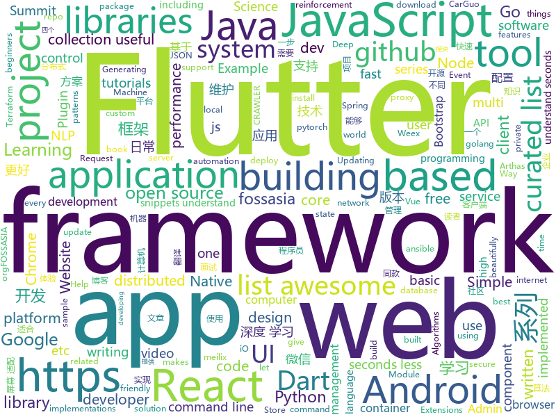

# 2018-10-25
See what the GitHub community is most excited about today.

## python
* [Python](https://github.com/TheAlgorithms/Python)(**186 stars today**): All Algorithms implemented in Python
* [TensorFlow-Course](https://github.com/open-source-for-science/TensorFlow-Course)(**168 stars today**): Simple and ready-to-use tutorials for TensorFlow
* [models](https://github.com/tensorflow/models)(**88 stars today**): Models and examples built with TensorFlow
* [terrain-erosion-3-ways](https://github.com/dandrino/terrain-erosion-3-ways)(**92 stars today**): Three Ways of Generating Terrain with Erosion Features
* [graph_nets](https://github.com/deepmind/graph_nets)(**66 stars today**): Build Graph Nets in Tensorflow
* [system-design-primer](https://github.com/donnemartin/system-design-primer)(**64 stars today**): Learn how to design large-scale systems. Prep for the system design interview. Includes Anki flashcards.
* [Algorithm_Interview_Notes-Chinese](https://github.com/imhuay/Algorithm_Interview_Notes-Chinese)(**63 stars today**): 2018/2019/校招/春招/秋招/算法/机器学习(Machine Learning)/深度学习(Deep Learning)/自然语言处理(NLP)/C/C++/Python/面试笔记
* [BERT-pytorch](https://github.com/codertimo/BERT-pytorch)(**61 stars today**): Google AI 2018 BERT pytorch implementation
* [awesome-python](https://github.com/vinta/awesome-python)(**54 stars today**): A curated list of awesome Python frameworks, libraries, software and resources
* [youtube-dl](https://github.com/rg3/youtube-dl)(**48 stars today**): Command-line program to download videos from YouTube.com and other video sites
* [awesome-algorithm](https://github.com/apachecn/awesome-algorithm)(**49 stars today**): Leetcode 题解 (跟随思路一步一步撸出代码) 及经典算法实现
* [keras](https://github.com/keras-team/keras)(**38 stars today**): Deep Learning for humans
* [public-apis](https://github.com/toddmotto/public-apis)(**43 stars today**): A collective list of public JSON APIs for use in web development.
* [flask](https://github.com/pallets/flask)(**37 stars today**): The Python micro framework for building web applications.
* [requests](https://github.com/requests/requests)(**35 stars today**): Python HTTP Requests for Humans™✨🍰✨
* [django](https://github.com/django/django)(**28 stars today**): The Web framework for perfectionists with deadlines.
* [CVE-2018-3191](https://github.com/pyn3rd/CVE-2018-3191)(**30 stars today**): CVE-2018-3191-PoC
* [home-assistant](https://github.com/home-assistant/home-assistant)(**27 stars today**): 🏡Open source home automation that puts local control and privacy first
* [ansible](https://github.com/ansible/ansible)(**27 stars today**): Ansible is a radically simple IT automation platform that makes your applications and systems easier to deploy. Avoid writing scripts or custom code to deploy and update your applications — automate in a language that approaches plain English, using SSH, with no agents to install on remote systems. https://docs.ansible.com/ansible/
* [ranger](https://github.com/ranger/ranger)(**34 stars today**): A VIM-inspired filemanager for the console
* [awesome-machine-learning](https://github.com/josephmisiti/awesome-machine-learning)(**31 stars today**): A curated list of awesome Machine Learning frameworks, libraries and software.
* [trfl](https://github.com/deepmind/trfl)(**31 stars today**): TensorFlow Reinforcement Learning
* [openlibrary](https://github.com/internetarchive/openlibrary)(**29 stars today**): One webpage for every book ever published!
* [face_recognition](https://github.com/ageitgey/face_recognition)(**27 stars today**): The world's simplest facial recognition api for Python and the command line
* [httpie](https://github.com/jakubroztocil/httpie)(****): Modern command line HTTP client – user-friendly curl alternative with intuitive UI, JSON support, syntax highlighting, wget-like downloads, extensions, etc. https://httpie.org

## java
* [token-core-android](https://github.com/consenlabs/token-core-android)(**264 stars today**): a blockchain private key management library on android
* [JavaGuide](https://github.com/Snailclimb/JavaGuide)(**171 stars today**): 【Java学习+面试指南】 一份涵盖大部分Java程序员所需要掌握的核心知识。
* [symphony](https://github.com/b3log/symphony)(**106 stars today**): 🎶一款用 Java 实现的现代化社区（论坛/BBS/社交网络/博客）平台。https://hacpai.com
* [AndroidAutoSize](https://github.com/JessYanCoding/AndroidAutoSize)(**135 stars today**): 🔥A low-cost Android screen adaptation solution (今日头条屏幕适配方案终极版，一个极低成本的 Android 屏幕适配方案).
* [subzero](https://github.com/square/subzero)(**103 stars today**): Square's Bitcoin Cold Storage solution.
* [Phantom](https://github.com/ManbangGroup/Phantom)(**61 stars today**): Phantom — 唯一零 Hook 稳定占坑类 Android 热更新插件化方案
* [spring-boot](https://github.com/spring-projects/spring-boot)(**52 stars today**): Spring Boot
* [proxyee-down](https://github.com/proxyee-down-org/proxyee-down)(**54 stars today**): http下载工具，基于http代理，支持多连接分块下载
* [JCSprout](https://github.com/crossoverJie/JCSprout)(**44 stars today**): 👨‍🎓Java Core Sprout : basic, concurrent, algorithm
* [tutorials](https://github.com/eugenp/tutorials)(**32 stars today**): The "REST With Spring" Course:
* [java-design-patterns](https://github.com/iluwatar/java-design-patterns)(**38 stars today**): Design patterns implemented in Java
* [arthas](https://github.com/alibaba/arthas)(**42 stars today**): Alibaba Java Diagnostic Tool Arthas/Alibaba Java诊断利器Arthas
* [weixin-java-tools](https://github.com/Wechat-Group/weixin-java-tools)(**38 stars today**): 全能微信Java开发工具包，支持包括微信支付、开放平台、小程序、企业微信/企业号和公众号等的开发
* [elasticsearch](https://github.com/elastic/elasticsearch)(**39 stars today**): Open Source, Distributed, RESTful Search Engine
* [micronaut-core](https://github.com/micronaut-projects/micronaut-core)(**39 stars today**): Micronaut Application Framework
* [spring-framework](https://github.com/spring-projects/spring-framework)(**30 stars today**): Spring Framework
* [MVVMHabit](https://github.com/goldze/MVVMHabit)(**36 stars today**): 🚀基于谷歌最新AAC架构，MVVM设计模式的一套快速开发库，整合Okhttp+RxJava+Retrofit+Glide等主流模块，满足日常开发需求。使用该框架可以快速开发一个健壮、易维护的Android应用。
* [AndroidUtilCode](https://github.com/Blankj/AndroidUtilCode)(**26 stars today**): 🔥Android developers should collect the following utils(updating).
* [Java](https://github.com/TheAlgorithms/Java)(**25 stars today**): All Algorithms implemented in Java
* [apollo](https://github.com/ctripcorp/apollo)(**24 stars today**): Apollo（阿波罗）是携程框架部门研发的分布式配置中心，能够集中化管理应用不同环境、不同集群的配置，配置修改后能够实时推送到应用端，并且具备规范的权限、流程治理等特性，适用于微服务配置管理场景。
* [okhttp](https://github.com/square/okhttp)(**27 stars today**): An HTTP+HTTP/2 client for Android and Java applications.
* [incubator-dubbo](https://github.com/apache/incubator-dubbo)(**19 stars today**): Apache Dubbo (incubating) is a high-performance, java based, open source RPC framework.
* [xxl-crawler](https://github.com/xuxueli/xxl-crawler)(**26 stars today**): A distributed web crawler framework.（分布式爬虫框架XXL-CRAWLER）
* [guava](https://github.com/google/guava)(**25 stars today**): Google core libraries for Java
* [netty](https://github.com/netty/netty)(**19 stars today**): Netty project - an event-driven asynchronous network application framework

## unknown
* [DeepLearning-500-questions](https://github.com/scutan90/DeepLearning-500-questions)(**665 stars today**): 深度学习500问，以问答形式对常用的概率知识、线性代数、机器学习、深度学习、计算机视觉等热点问题进行阐述，以帮助自己及有需要的读者。 全书分为15个章节，近20万字。由于水平有限，书中不妥之处恳请广大读者批评指正。 未完待续............ 如有意合作，联系scutjy2015@163.com 版权所有，违权必究 Tan 2018.06
* [git-flight-rules](https://github.com/k88hudson/git-flight-rules)(**309 stars today**): Flight rules for git
* [CS-Notes](https://github.com/CyC2018/CS-Notes)(**177 stars today**): 📚Computer Science Learning Notes
* [awesome-actions](https://github.com/sdras/awesome-actions)(**177 stars today**): A curated list of awesome actions to use on GitHub
* [first-contributions](https://github.com/firstcontributions/first-contributions)(**35 stars today**): 🚀✨Help beginners to contribute to open source projects
* [fe9-library](https://github.com/frontend9/fe9-library)(**98 stars today**): 九部知识库
* [awesome](https://github.com/sindresorhus/awesome)(**84 stars today**): 😎Curated list of awesome lists
* [developer-roadmap](https://github.com/kamranahmedse/developer-roadmap)(**83 stars today**): Roadmap to becoming a web developer in 2018
* [gitignore](https://github.com/github/gitignore)(**61 stars today**): A collection of useful .gitignore templates
* [Make-a-Pull-Request](https://github.com/rishabh-bansal/Make-a-Pull-Request)(**24 stars today**): Make a Pull Request
* [You-Dont-Know-JS](https://github.com/getify/You-Dont-Know-JS)(**70 stars today**): A book series on JavaScript. @YDKJS on twitter.
* [free-programming-books](https://github.com/EbookFoundation/free-programming-books)(**70 stars today**): 📚Freely available programming books
* [Awesome-pytorch-list](https://github.com/bharathgs/Awesome-pytorch-list)(**71 stars today**): A comprehensive list of pytorch related content on github,such as different models,implementations,helper libraries,tutorials etc.
* [randomrepo](https://github.com/SandboxEscaper/randomrepo)(**59 stars today**): Repo for random stuff
* [A-to-Z-Resources-for-Students](https://github.com/dipakkr/A-to-Z-Resources-for-Students)(**29 stars today**): Curated list of resources for college students If you like give a⭐️
* [awesome-vue](https://github.com/vuejs/awesome-vue)(**49 stars today**): 🎉A curated list of awesome things related to Vue.js
* [weekly](https://github.com/ruanyf/weekly)(**49 stars today**): 技术分享周刊，每周五发布
* [coding-interview-university](https://github.com/jwasham/coding-interview-university)(**39 stars today**): A complete computer science study plan to become a software engineer.
* [project-based-learning](https://github.com/tuvtran/project-based-learning)(**35 stars today**): Curated list of project-based tutorials
* [30-seconds-of-react](https://github.com/30-seconds/30-seconds-of-react)(**37 stars today**): Curated collection of useful React snippets that you can understand in 30 seconds or less.
* [Blog](https://github.com/mqyqingfeng/Blog)(**34 stars today**): 冴羽写博客的地方，预计写四个系列：JavaScript深入系列、JavaScript专题系列、ES6系列、React系列。
* [rfcs](https://github.com/reactjs/rfcs)(**33 stars today**): RFCs for changes to React
* [awesome-for-beginners](https://github.com/MunGell/awesome-for-beginners)(**29 stars today**): A list of awesome beginners-friendly projects.
* [NEUQACMClub-weekly](https://github.com/fireairforce/NEUQACMClub-weekly)(**21 stars today**): 该仓库用于存储NEUQ-ACM俱乐部现役预备队成员周报
* [gold-miner](https://github.com/xitu/gold-miner)(**29 stars today**): 🥇掘金翻译计划，可能是世界最大最好的英译中技术社区，最懂读者和译者的翻译平台：

## javascript
* [33-js-concepts](https://github.com/leonardomso/33-js-concepts)(**869 stars today**): 📜33 concepts every JavaScript developer should know.
* [telescope](https://github.com/laravel/telescope)(**605 stars today**): 
* [33-js-concepts](https://github.com/stephentian/33-js-concepts)(**513 stars today**): 📜每个 JavaScript 工程师都应懂的33个概念 @leonardomso
* [30-seconds-of-code](https://github.com/30-seconds/30-seconds-of-code)(**356 stars today**): Curated collection of useful JavaScript snippets that you can understand in 30 seconds or less.
* [omi](https://github.com/Tencent/omi)(**187 stars today**): Next generation web framework in 4kb JavaScript (Web Components + JSX + Proxy + Store + Path Updating)
* [vue](https://github.com/vuejs/vue)(**111 stars today**): 🖖A progressive, incrementally-adoptable JavaScript framework for building UI on the web.
* [react](https://github.com/facebook/react)(**112 stars today**): A declarative, efficient, and flexible JavaScript library for building user interfaces.
* [freeCodeCamp](https://github.com/freeCodeCamp/freeCodeCamp)(****): The https://freeCodeCamp.org open source codebase and curriculum. Learn to code for free together with millions of people.
* [create-react-app](https://github.com/facebook/create-react-app)(**64 stars today**): Set up a modern web app by running one command.
* [javascript](https://github.com/airbnb/javascript)(**69 stars today**): JavaScript Style Guide
* [percollate](https://github.com/danburzo/percollate)(**73 stars today**): 🌐→📖A command-line tool to turn web pages into beautifully formatted PDFs
* [evergreen](https://github.com/segmentio/evergreen)(**71 stars today**): 🌲Evergreen React UI Framework by Segment
* [Blog](https://github.com/pkwenda/Blog)(**67 stars today**): 全栈方向系列文章
* [free-programming-books-zh_CN](https://github.com/justjavac/free-programming-books-zh_CN)(**66 stars today**): 📚免费的计算机编程类中文书籍，欢迎投稿
* [galio](https://github.com/galio-org/galio)(**66 stars today**): Galio is a beautifully designed, Free and Open Source React Native Framework
* [graphpack](https://github.com/glennreyes/graphpack)(**67 stars today**): ☄️A minimalistic zero-config GraphQL server.
* [puppeteer](https://github.com/GoogleChrome/puppeteer)(**63 stars today**): Headless Chrome Node API
* [storybook](https://github.com/storybooks/storybook)(**59 stars today**): Interactive UI component dev & test: React, React Native, Vue, Angular, Ember
* [crana](https://github.com/scriptify/crana)(**59 stars today**): A CLI tool to create React + Node apps with just one command
* [react-native](https://github.com/facebook/react-native)(**56 stars today**): A framework for building native apps with React.
* [node](https://github.com/nodejs/node)(**54 stars today**): Node.js JavaScript runtime✨🐢🚀✨
* [fs-remote](https://github.com/suchipi/fs-remote)(**58 stars today**): Drop-in replacement for fs that lets you write to the filesystem from the browser
* [react-testing-examples](https://github.com/skidding/react-testing-examples)(**56 stars today**): Searchable library of React testing examples
* [axios](https://github.com/axios/axios)(**54 stars today**): Promise based HTTP client for the browser and node.js
* [unstated](https://github.com/jamiebuilds/unstated)(**50 stars today**): State so simple, it goes without saying

## html
* [async-javascript-cheatsheet](https://github.com/frontarm/async-javascript-cheatsheet)(**210 stars today**): Cheatsheet for promises and async/await
* [30-seconds-of-css](https://github.com/30-seconds/30-seconds-of-css)(**84 stars today**): A curated collection of useful CSS snippets you can understand in 30 seconds or less.
* [Spoon-Knife](https://github.com/octocat/Spoon-Knife)(****): This repo is for demonstration purposes only.
* [AdminLTE](https://github.com/almasaeed2010/AdminLTE)(**28 stars today**): AdminLTE - Free Premium Admin control Panel Theme Based On Bootstrap 3.x
* [gci18.fossasia.org](https://github.com/fossasia/gci18.fossasia.org)(**25 stars today**): FOSSASIA Google Code-In Website 2018 https://gci18.fossasia.org
* [hacktoberfest](https://github.com/lingonsaft/hacktoberfest)(**10 stars today**): Hacktoberfest 2018. Don't forget to spread love and if you like give us a⭐️
* [mastering-modular-javascript](https://github.com/mjavascript/mastering-modular-javascript)(**21 stars today**): 📦Module thinking, principles, design patterns and best practices.
* [fastText](https://github.com/facebookresearch/fastText)(**19 stars today**): Library for fast text representation and classification.
* [website-in-2018](https://github.com/Bloomca/website-in-2018)(**21 stars today**): Websites in 2018
* [solid](https://github.com/solid/solid)(**19 stars today**): Solid - Re-decentralizing the web (project directory)
* [pslab.io](https://github.com/fossasia/pslab.io)(**20 stars today**): Pocket Science Lab Website http://pslab.io
* [2018.fossasia.org](https://github.com/fossasia/2018.fossasia.org)(**20 stars today**): FOSSASIA Summit 2018 https://2018.fossasia.org
* [2010.fossasia.org](https://github.com/fossasia/2010.fossasia.org)(**20 stars today**): FOSSASIA Summit 2010 Event Site http://fossasia.github.io/2010.fossasia.org
* [2019.fossasia.org](https://github.com/fossasia/2019.fossasia.org)(**20 stars today**): FOSSASIA Summit 2019 https://2019.fossasia.org
* [meilix-generator](https://github.com/fossasia/meilix-generator)(**19 stars today**): WebApp for generating a custom ISO image based on Meilix http://meilix.org
* [coreui-free-bootstrap-admin-template](https://github.com/coreui/coreui-free-bootstrap-admin-template)(**19 stars today**): CoreUI is free bootstrap admin template
* [gentelella](https://github.com/puikinsh/gentelella)(**16 stars today**): Free Bootstrap 3 Admin Template
* [NLP-progress](https://github.com/sebastianruder/NLP-progress)(**17 stars today**): Repository to track the progress in Natural Language Processing (NLP), including the datasets and the current state-of-the-art for the most common NLP tasks.
* [JavaScript30](https://github.com/wesbos/JavaScript30)(**10 stars today**): 30 Day Vanilla JS Challenge
* [gatsby-mail](https://github.com/DSchau/gatsby-mail)(**15 stars today**): A Gatsby email *application*
* [skill-map](https://github.com/TeamStuQ/skill-map)(**14 stars today**): 程序员技能图谱
* [react-redux](https://github.com/reduxjs/react-redux)(**12 stars today**): Official React bindings for Redux
* [baselines](https://github.com/openai/baselines)(**12 stars today**): OpenAI Baselines: high-quality implementations of reinforcement learning algorithms
* [chrome](https://github.com/free-vpn/chrome)(**12 stars today**): VPN Chrome is Google Chromium based browser with built-in VPN capability to let users surf the Internet in a secure and private way.
* [portainer](https://github.com/portainer/portainer)(**10 stars today**): Simple management UI for Docker

## dart
* [flutter](https://github.com/flutter/flutter)(**64 stars today**): Flutter makes it easy and fast to build beautiful mobile apps.
* [awesome-flutter](https://github.com/Solido/awesome-flutter)(**22 stars today**): An awesome list that curates the best Flutter libraries, tools, tutorials, articles and more.
* [FlutterExampleApps](https://github.com/iampawan/FlutterExampleApps)(**14 stars today**): [Example APPS] Basic Flutter apps, for flutter devs.
* [GSYGithubAppFlutter](https://github.com/CarGuo/GSYGithubAppFlutter)(**10 stars today**): 超完整的Flutter项目，功能丰富，适合学习和日常使用。GSYGithubApp系列的优势：我们目前已经拥有Flutter、Weex、ReactNative三个版本。 功能齐全，项目框架内技术涉及面广，完成度高，持续维护，配套文章，适合全面学习，跨框架对比参考。跨平台的开源Github客户端App，更好的体验，更丰富的功能，旨在更好的日常管理和维护个人Github，提供更好更方便的驾车体验～～Σ(￣。￣ﾉ)ﾉ。同款Weex版本 ： https://github.com/CarGuo/GSYGithubAppWeex 、同款React Native版本 ： https://github.com/CarGuo/GSYGithubApp
* [sdk](https://github.com/dart-lang/sdk)(**11 stars today**): The Dart SDK, including the VM, dart2js, core libraries, and more.
* [plugins](https://github.com/flutter/plugins)(**9 stars today**): Plugins for Flutter, including FlutterFire, maintained by the Flutter team
* [flutter_map](https://github.com/apptreesoftware/flutter_map)(**9 stars today**): A Flutter map package based on leaflet
* [FlutterGameOfThrones](https://github.com/iampawan/FlutterGameOfThrones)(**9 stars today**): 
* [rxdart](https://github.com/ReactiveX/rxdart)(**6 stars today**): The Reactive Extensions for Dart
* [rebloc](https://github.com/RedBrogdon/rebloc)(**6 stars today**): A state management library for Flutter that combines aspects of Redux and BLoC.
* [flutter-examples](https://github.com/nisrulz/flutter-examples)(**5 stars today**): [Examples] Simple basic isolated apps, for budding flutter devs.
* [Flutter-Notebook](https://github.com/OpenFlutter/Flutter-Notebook)(**5 stars today**): 日更的FlutterDemo合集，今天你fu了吗
* [fluttergram](https://github.com/mdanics/fluttergram)(****): A working Instagram clone written in Flutter using Firebase / Firestore
* [app_review](https://github.com/AppleEducate/app_review)(****): A Flutter Plugin for Requesting and Writing Reviews for the App Store and Google Play.
* [flutter_blue](https://github.com/pauldemarco/flutter_blue)(****): Bluetooth plugin for Flutter
* [mongo_dart](https://github.com/mongo-dart/mongo_dart)(****): Mongo_dart: MongoDB driver for Dart programming language
* [chewie](https://github.com/brianegan/chewie)(****): The video player for Flutter with a heart of gold
* [chromedeveditor](https://github.com/googlearchive/chromedeveditor)(****): Chrome Dev Editor is a developer tool for building apps on the Chrome platform - Chrome Apps and Web Apps, in JavaScript or Dart. (NO LONGER IN ACTIVE DEVELOPMENT)
* [flutter-osc](https://github.com/yubo725/flutter-osc)(****): 基于Google Flutter的开源中国客户端，支持Android和iOS。
* [Flutter-UI-Kit](https://github.com/iampawan/Flutter-UI-Kit)(****): Flutter app for collection of UI in a UIKit
* [flutter_architecture_samples](https://github.com/brianegan/flutter_architecture_samples)(****): TodoMVC for Flutter
* [Flutter-learning](https://github.com/AweiLoveAndroid/Flutter-learning)(****): 🔥👍🌟⭐️⭐️⭐️Flutter install&settings,Flutter problems when developing,Flutter sample codes& templates,Flutter projects,Dart languages sample codes
* [inKino](https://github.com/roughike/inKino)(****): inKino - A cross platform movie and showtime browser for Finnkino cinemas, made with Flutter.
* [dio](https://github.com/flutterchina/dio)(****): A powerful Http client for Dart, which supports Interceptors, FormData, Request Cancellation, File Downloading, Timeout etc.
* [hauberk](https://github.com/munificent/hauberk)(****): A web-based roguelike written in Dart.

## go
* [up](https://github.com/akavel/up)(**1,177 stars today**): Ultimate Plumber is a tool for writing Linux pipes with instant live preview
* [soar](https://github.com/XiaoMi/soar)(**350 stars today**): SQL Optimizer And Rewriter
* [croc](https://github.com/schollz/croc)(**157 stars today**): Easily and securely send things from one computer to another🐊📦
* [dive](https://github.com/wagoodman/dive)(**111 stars today**): A tool for exploring each layer in a docker image
* [kubernetes](https://github.com/kubernetes/kubernetes)(**56 stars today**): Production-Grade Container Scheduling and Management
* [go](https://github.com/golang/go)(**47 stars today**): The Go programming language
* [awesome-go](https://github.com/avelino/awesome-go)(**43 stars today**): A curated list of awesome Go frameworks, libraries and software
* [build-web-application-with-golang](https://github.com/astaxie/build-web-application-with-golang)(**39 stars today**): A golang ebook intro how to build a web with golang
* [frp](https://github.com/fatedier/frp)(**39 stars today**): A fast reverse proxy to help you expose a local server behind a NAT or firewall to the internet.
* [prometheus](https://github.com/prometheus/prometheus)(**33 stars today**): The Prometheus monitoring system and time series database.
* [terraform](https://github.com/hashicorp/terraform)(**34 stars today**): Terraform is a tool for building, changing, and combining infrastructure safely and efficiently.
* [hugo](https://github.com/gohugoio/hugo)(**32 stars today**): The world’s fastest framework for building websites.
* [terraform-provider-alicloud](https://github.com/terraform-providers/terraform-provider-alicloud)(**35 stars today**): Terraform AliCloud provider
* [gin](https://github.com/gin-gonic/gin)(**32 stars today**): Gin is a HTTP web framework written in Go (Golang). It features a Martini-like API with much better performance -- up to 40 times faster. If you need smashing performance, get yourself some Gin.
* [dtle](https://github.com/actiontech/dtle)(**29 stars today**): Distributed Data Transfer Service for MySQL
* [istio](https://github.com/istio/istio)(**29 stars today**): Connect, secure, control, and observe services.
* [tinygo](https://github.com/aykevl/tinygo)(**29 stars today**): Go compiler for small devices, based on LLVM.
* [v2ray-core](https://github.com/v2ray/v2ray-core)(**27 stars today**): A platform for building proxies to bypass network restrictions.
* [helm](https://github.com/helm/helm)(**25 stars today**): The Kubernetes Package Manager
* [go-hackernews](https://github.com/GoogleChromeLabs/go-hackernews)(**28 stars today**): A Hacker News client written in Go
* [tidb](https://github.com/pingcap/tidb)(**24 stars today**): TiDB is a distributed HTAP database compatible with the MySQL protocol
* [gf](https://github.com/johng-cn/gf)(**25 stars today**): [mirror] GF(GoFrame) is a modular, lightweight, loosely coupled, high-performance application development framework written in Go. Supporting hot updates/restarting, multi-domain, multi-port, multi-service, HTTP/HTTPS, dynamic routing and many more features, it also provides a series of core components and dozens of practical modules.
* [goDoH](https://github.com/sensepost/goDoH)(**26 stars today**): 🕳godoh - A DNS-over-HTTPS C2
* [moby](https://github.com/moby/moby)(**25 stars today**): Moby Project - a collaborative project for the container ecosystem to assemble container-based systems
* [fzf](https://github.com/junegunn/fzf)(**24 stars today**): 🌸A command-line fuzzy finder

## WordCloud

