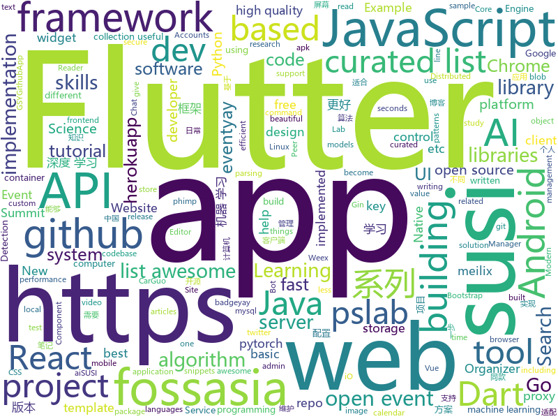

# 2018-10-26
See what the GitHub community is most excited about today.

## python
* [maskrcnn-benchmark](https://github.com/facebookresearch/maskrcnn-benchmark)(**1,104 stars today**): Fast, modular reference implementation of Semantic Segmentation and Object Detection algorithms in PyTorch.
* [data-life](https://github.com/abcnews/data-life)(**272 stars today**): 
* [Python](https://github.com/TheAlgorithms/Python)(**207 stars today**): All Algorithms implemented in Python
* [TensorFlow-Course](https://github.com/open-source-for-science/TensorFlow-Course)(**184 stars today**): Simple and ready-to-use tutorials for TensorFlow
* [cpython](https://github.com/python/cpython)(**26 stars today**): The Python programming language
* [Algorithm_Interview_Notes-Chinese](https://github.com/imhuay/Algorithm_Interview_Notes-Chinese)(**87 stars today**): 2018/2019/校招/春招/秋招/算法/机器学习(Machine Learning)/深度学习(Deep Learning)/自然语言处理(NLP)/C/C++/Python/面试笔记
* [models](https://github.com/tensorflow/models)(**74 stars today**): Models and examples built with TensorFlow
* [system-design-primer](https://github.com/donnemartin/system-design-primer)(**78 stars today**): Learn how to design large-scale systems. Prep for the system design interview. Includes Anki flashcards.
* [meilix](https://github.com/fossasia/meilix)(**69 stars today**): Beautiful Linux System http://meilix.fossasia.org
* [open-event-server](https://github.com/fossasia/open-event-server)(**68 stars today**): The Open Event Organizer Server to Manage Events http://open-event-api.herokuapp.com
* [pslab-python](https://github.com/fossasia/pslab-python)(**64 stars today**): Python Library for PSLab Desktop: http://pslab.fossasia.org
* [pslab-desktop-apps](https://github.com/fossasia/pslab-desktop-apps)(**63 stars today**): PSLab GUI Experiments using Qt and Python http://pslab.fossasia.org
* [meilix-systemlock](https://github.com/fossasia/meilix-systemlock)(**63 stars today**): Meilix system lock
* [keras](https://github.com/keras-team/keras)(**50 stars today**): Deep Learning for humans
* [susi_linux](https://github.com/fossasia/susi_linux)(**61 stars today**): Hardware for SUSI AI http://susi.ai
* [awesome-algorithm](https://github.com/apachecn/awesome-algorithm)(**55 stars today**): Leetcode 题解 (跟随思路一步一步撸出代码) 及经典算法实现
* [awesome-python](https://github.com/vinta/awesome-python)(**54 stars today**): A curated list of awesome Python frameworks, libraries, software and resources
* [youtube-dl](https://github.com/rg3/youtube-dl)(**50 stars today**): Command-line program to download videos from YouTube.com and other video sites
* [responder](https://github.com/kennethreitz/responder)(**47 stars today**): a familiar HTTP Service Framework for Python
* [mmdetection](https://github.com/open-mmlab/mmdetection)(**45 stars today**): Open MMLab Detection Toolbox
* [Detectron](https://github.com/facebookresearch/Detectron)(**38 stars today**): FAIR's research platform for object detection research, implementing popular algorithms like Mask R-CNN and RetinaNet.
* [BERT-pytorch](https://github.com/codertimo/BERT-pytorch)(**39 stars today**): Google AI 2018 BERT pytorch implementation
* [graph_nets](https://github.com/deepmind/graph_nets)(**37 stars today**): Build Graph Nets in Tensorflow
* [mitmproxy](https://github.com/mitmproxy/mitmproxy)(**37 stars today**): An interactive TLS-capable intercepting HTTP proxy for penetration testers and software developers.
* [home-assistant](https://github.com/home-assistant/home-assistant)(**30 stars today**): 🏡Open source home automation that puts local control and privacy first

## java
* [AndroidProject](https://github.com/getActivity/AndroidProject)(**185 stars today**): An advanced template project
* [Phantom](https://github.com/ManbangGroup/Phantom)(**163 stars today**): Phantom — 唯一零 Hook 稳定占坑类 Android 热更新插件化方案
* [JavaGuide](https://github.com/Snailclimb/JavaGuide)(**114 stars today**): 【Java学习+面试指南】 一份涵盖大部分Java程序员所需要掌握的核心知识。
* [token-core-android](https://github.com/consenlabs/token-core-android)(**79 stars today**): a blockchain private key management library on android
* [AndroidAutoSize](https://github.com/JessYanCoding/AndroidAutoSize)(**87 stars today**): 🔥A low-cost Android screen adaptation solution (今日头条屏幕适配方案终极版，一个极低成本的 Android 屏幕适配方案).
* [symphony](https://github.com/b3log/symphony)(**63 stars today**): 🎶一款用 Java 实现的现代化社区（论坛/BBS/社交网络/博客）平台。https://hacpai.com
* [proxyee-down](https://github.com/proxyee-down-org/proxyee-down)(**63 stars today**): http下载工具，基于http代理，支持多连接分块下载
* [phimpme-android](https://github.com/fossasia/phimpme-android)(**67 stars today**): Phimp.me - Photo Image Editor App https://phimp.me
* [pslab-android](https://github.com/fossasia/pslab-android)(**65 stars today**): PSLab Android App https://github.com/fossasia/pslab-android/blob/apk/app-master-release.apk
* [open-event-orga-app](https://github.com/fossasia/open-event-orga-app)(**64 stars today**): Open Event Mobile App for Organizers and Entry Managers https://github.com/fossasia/open-event-orga-app/blob/apk/eventyay-organizer-dev-app-playStore-release-unsigned.apk
* [neuroflight-android](https://github.com/fossasia/neuroflight-android)(**63 stars today**): Neuroflight Android
* [tutorials](https://github.com/eugenp/tutorials)(**36 stars today**): The "REST With Spring" Course:
* [susi_server](https://github.com/fossasia/susi_server)(**61 stars today**): Software and Skills for Personal Assistants using SUSI AI / Artificial Intelligence for Chat Bots https://api.susi.ai
* [spring-boot](https://github.com/spring-projects/spring-boot)(**50 stars today**): Spring Boot
* [java-design-patterns](https://github.com/iluwatar/java-design-patterns)(**46 stars today**): Design patterns implemented in Java
* [uid-generator](https://github.com/baidu/uid-generator)(**43 stars today**): UniqueID generator
* [yacy_search_server](https://github.com/yacy/yacy_search_server)(**45 stars today**): Distributed Peer-to-Peer Web Search Engine and Intranet Search Appliance
* [loklak_server](https://github.com/loklak/loklak_server)(**44 stars today**): Distributed Open Source twitter and social media message search server that anonymously collects, shares, dumps and indexes data http://api.loklak.org
* [arthas](https://github.com/alibaba/arthas)(**37 stars today**): Alibaba Java Diagnostic Tool Arthas/Alibaba Java诊断利器Arthas
* [yacy_grid_parser](https://github.com/yacy/yacy_grid_parser)(**43 stars today**): Parser Microservice for the YaCy Grid
* [elasticsearch](https://github.com/elastic/elasticsearch)(**35 stars today**): Open Source, Distributed, RESTful Search Engine
* [JCSprout](https://github.com/crossoverJie/JCSprout)(**32 stars today**): 👨‍🎓Java Core Sprout : basic, concurrent, algorithm
* [Java](https://github.com/TheAlgorithms/Java)(**29 stars today**): All Algorithms implemented in Java
* [subzero](https://github.com/square/subzero)(**32 stars today**): Square's Bitcoin Cold Storage solution.
* [apollo](https://github.com/ctripcorp/apollo)(**28 stars today**): Apollo（阿波罗）是携程框架部门研发的分布式配置中心，能够集中化管理应用不同环境、不同集群的配置，配置修改后能够实时推送到应用端，并且具备规范的权限、流程治理等特性，适用于微服务配置管理场景。

## unknown
* [DeepLearning-500-questions](https://github.com/scutan90/DeepLearning-500-questions)(**393 stars today**): 深度学习500问，以问答形式对常用的概率知识、线性代数、机器学习、深度学习、计算机视觉等热点问题进行阐述，以帮助自己及有需要的读者。 全书分为15个章节，近20万字。由于水平有限，书中不妥之处恳请广大读者批评指正。 未完待续............ 如有意合作，联系scutjy2015@163.com 版权所有，违权必究 Tan 2018.06
* [git-flight-rules](https://github.com/k88hudson/git-flight-rules)(**272 stars today**): Flight rules for git
* [first-contributions](https://github.com/firstcontributions/first-contributions)(**40 stars today**): 🚀✨Help beginners to contribute to open source projects
* [CS-Notes](https://github.com/CyC2018/CS-Notes)(**124 stars today**): 📚Computer Science Learning Notes
* [awesome-actions](https://github.com/sdras/awesome-actions)(**99 stars today**): A curated list of awesome actions to use on GitHub
* [developer-roadmap](https://github.com/kamranahmedse/developer-roadmap)(**91 stars today**): Roadmap to becoming a web developer in 2018
* [awesome](https://github.com/sindresorhus/awesome)(**85 stars today**): 😎Curated list of awesome lists
* [Make-a-Pull-Request](https://github.com/rishabh-bansal/Make-a-Pull-Request)(**21 stars today**): Make a Pull Request
* [You-Dont-Know-JS](https://github.com/getify/You-Dont-Know-JS)(**72 stars today**): A book series on JavaScript. @YDKJS on twitter.
* [china_area_mysql](https://github.com/kakuilan/china_area_mysql)(**66 stars today**): 中国5级行政区域mysql库
* [free-programming-books](https://github.com/EbookFoundation/free-programming-books)(**62 stars today**): 📚Freely available programming books
* [A-to-Z-Resources-for-Students](https://github.com/dipakkr/A-to-Z-Resources-for-Students)(**43 stars today**): Curated list of resources for college students If you like give a⭐️
* [AppleEventInviteStickerPack](https://github.com/azzoor/AppleEventInviteStickerPack)(**64 stars today**): 
* [gitignore](https://github.com/github/gitignore)(**43 stars today**): A collection of useful .gitignore templates
* [support.eventyay.com](https://github.com/fossasia/support.eventyay.com)(**60 stars today**): Support site for eventyay.com http://support.eventyay.com
* [susi_skill_data](https://github.com/fossasia/susi_skill_data)(**60 stars today**): A storage place for susi skills http://skills.susi.ai
* [pslab-artwork](https://github.com/fossasia/pslab-artwork)(**60 stars today**): Pocket Science Lab Artwork https://pslab.io
* [Awesome-pytorch-list](https://github.com/bharathgs/Awesome-pytorch-list)(**49 stars today**): A comprehensive list of pytorch related content on github,such as different models,implementations,helper libraries,tutorials etc.
* [awesome-code-reading](https://github.com/CodeReaderMe/awesome-code-reading)(**47 stars today**): A curated list of high-quality codebases to read and study. Read more code!
* [randomrepo](https://github.com/SandboxEscaper/randomrepo)(**38 stars today**): Repo for random stuff
* [project-based-learning](https://github.com/tuvtran/project-based-learning)(**40 stars today**): Curated list of project-based tutorials
* [coding-interview-university](https://github.com/jwasham/coding-interview-university)(**33 stars today**): A complete computer science study plan to become a software engineer.
* [awesome-vue](https://github.com/vuejs/awesome-vue)(**32 stars today**): 🎉A curated list of awesome things related to Vue.js
* [awesome-public-datasets](https://github.com/awesomedata/awesome-public-datasets)(**31 stars today**): A topic-centric list of high-quality open datasets in public domains. New PR ☛☛☛
* [Blog](https://github.com/mqyqingfeng/Blog)(**28 stars today**): 冴羽写博客的地方，预计写四个系列：JavaScript深入系列、JavaScript专题系列、ES6系列、React系列。

## javascript
* [33-js-concepts](https://github.com/leonardomso/33-js-concepts)(**658 stars today**): 📜33 concepts every JavaScript developer should know.
* [33-js-concepts](https://github.com/stephentian/33-js-concepts)(**522 stars today**): 📜每个 JavaScript 工程师都应懂的33个概念 @leonardomso
* [telescope](https://github.com/laravel/telescope)(**234 stars today**): 
* [irondb](https://github.com/gruns/irondb)(**220 stars today**): 🔩A relentless key-value store for the browser.
* [omi](https://github.com/Tencent/omi)(**185 stars today**): Next generation web framework in 4kb JavaScript (Web Components + JSX + Proxy + Store + Path Updating)
* [30-seconds-of-code](https://github.com/30-seconds/30-seconds-of-code)(**171 stars today**): Curated collection of useful JavaScript snippets that you can understand in 30 seconds or less.
* [vue](https://github.com/vuejs/vue)(**131 stars today**): 🖖A progressive, incrementally-adoptable JavaScript framework for building UI on the web.
* [freeCodeCamp](https://github.com/freeCodeCamp/freeCodeCamp)(****): The https://freeCodeCamp.org open source codebase and curriculum. Learn to code for free together with millions of people.
* [react](https://github.com/facebook/react)(**105 stars today**): A declarative, efficient, and flexible JavaScript library for building user interfaces.
* [create-react-app](https://github.com/facebook/create-react-app)(**79 stars today**): Set up a modern web app by running one command.
* [fastscan](https://github.com/pyloque/fastscan)(**80 stars today**): quickly text search by ahocorasick algorithm
* [react-spring](https://github.com/drcmda/react-spring)(**81 stars today**): 🙌Helping react-motion and animated to become best friends
* [javascript](https://github.com/airbnb/javascript)(**75 stars today**): JavaScript Style Guide
* [puppeteer](https://github.com/GoogleChrome/puppeteer)(**76 stars today**): Headless Chrome Node API
* [free-programming-books-zh_CN](https://github.com/justjavac/free-programming-books-zh_CN)(**62 stars today**): 📚免费的计算机编程类中文书籍，欢迎投稿
* [open-event-webapp](https://github.com/fossasia/open-event-webapp)(**68 stars today**): Open Event Web App Generator http://opev-webgen-dev.herokuapp.com http://sched.eventyay.com
* [storybook](https://github.com/storybooks/storybook)(**64 stars today**): Interactive UI component dev & test: React, React Native, Vue, Angular, Ember
* [open-event-frontend](https://github.com/fossasia/open-event-frontend)(**64 stars today**): The frontend for the Open Event API Server https://open-event-frontend.herokuapp.com
* [badgeyay](https://github.com/fossasia/badgeyay)(**64 stars today**): Attendee Badge Generator for Conferences http://badgeyay.com Backend: http://badgeyay-api.herokuapp.com
* [chat.susi.ai](https://github.com/fossasia/chat.susi.ai)(**63 stars today**): SUSI AI web client at https://chat.susi.ai/
* [accounts.susi.ai](https://github.com/fossasia/accounts.susi.ai)(**62 stars today**): Accounts Service for SUSI.AI http://accounts.susi.ai
* [susi_chromebot](https://github.com/fossasia/susi_chromebot)(**62 stars today**): SUSI.AI Chrome Extension
* [susi_telegrambot](https://github.com/fossasia/susi_telegrambot)(**62 stars today**): Susi Telegram Bot http://susi.ai
* [susi_skill_cms](https://github.com/fossasia/susi_skill_cms)(**61 stars today**): A web application framework to edit susi skills http://skills.susi.ai
* [susi_firefoxbot](https://github.com/fossasia/susi_firefoxbot)(**61 stars today**): SUSI.AI Firefox Extension https://susi.ai

## html
* [DeepLearningProject](https://github.com/Spandan-Madan/DeepLearningProject)(**406 stars today**): An in-depth machine learning tutorial introducing readers to a whole machine learning pipeline from scratch.
* [30-seconds-of-css](https://github.com/30-seconds/30-seconds-of-css)(**90 stars today**): A curated collection of useful CSS snippets you can understand in 30 seconds or less.
* [async-javascript-cheatsheet](https://github.com/frontarm/async-javascript-cheatsheet)(**89 stars today**): Cheatsheet for promises and async/await
* [gci18.fossasia.org](https://github.com/fossasia/gci18.fossasia.org)(**66 stars today**): FOSSASIA Google Code-In Website 2018 https://gci18.fossasia.org
* [2010.fossasia.org](https://github.com/fossasia/2010.fossasia.org)(**62 stars today**): FOSSASIA Summit 2010 Event Site http://fossasia.github.io/2010.fossasia.org
* [meilix-generator](https://github.com/fossasia/meilix-generator)(**60 stars today**): WebApp for generating a custom ISO image based on Meilix http://meilix.org
* [pslab.io](https://github.com/fossasia/pslab.io)(**61 stars today**): Pocket Science Lab Website http://pslab.io
* [2018.fossasia.org](https://github.com/fossasia/2018.fossasia.org)(**60 stars today**): FOSSASIA Summit 2018 https://2018.fossasia.org
* [2019.fossasia.org](https://github.com/fossasia/2019.fossasia.org)(**60 stars today**): FOSSASIA Summit 2019 https://2019.fossasia.org
* [Spoon-Knife](https://github.com/octocat/Spoon-Knife)(****): This repo is for demonstration purposes only.
* [Coursera-ML-AndrewNg-Notes](https://github.com/fengdu78/Coursera-ML-AndrewNg-Notes)(**23 stars today**): 吴恩达老师的机器学习课程个人笔记
* [mastering-modular-javascript](https://github.com/mjavascript/mastering-modular-javascript)(**21 stars today**): 📦Module thinking, principles, design patterns and best practices.
* [patchwork](https://github.com/jlord/patchwork)(****): All the Git-it Workshop completers!
* [hacktoberfest](https://github.com/lingonsaft/hacktoberfest)(**5 stars today**): Hacktoberfest 2018. Don't forget to spread love and if you like give us a⭐️
* [AdminLTE](https://github.com/almasaeed2010/AdminLTE)(**17 stars today**): AdminLTE - Free Premium Admin control Panel Theme Based On Bootstrap 3.x
* [JavaScript30](https://github.com/wesbos/JavaScript30)(**12 stars today**): 30 Day Vanilla JS Challenge
* [fastText](https://github.com/facebookresearch/fastText)(**16 stars today**): Library for fast text representation and classification.
* [coreui-free-bootstrap-admin-template](https://github.com/coreui/coreui-free-bootstrap-admin-template)(**17 stars today**): CoreUI is free bootstrap admin template
* [milligram](https://github.com/milligram/milligram)(**15 stars today**): A minimalist CSS framework.
* [baselines](https://github.com/openai/baselines)(**15 stars today**): OpenAI Baselines: high-quality implementations of reinforcement learning algorithms
* [react-redux](https://github.com/reduxjs/react-redux)(**13 stars today**): Official React bindings for Redux
* [portainer](https://github.com/portainer/portainer)(**12 stars today**): Simple management UI for Docker
* [swagger-codegen](https://github.com/swagger-api/swagger-codegen)(**10 stars today**): swagger-codegen contains a template-driven engine to generate documentation, API clients and server stubs in different languages by parsing your OpenAPI / Swagger definition.
* [learning-area](https://github.com/mdn/learning-area)(**6 stars today**): Github repo for the MDN Learning Area.
* [javascript-tutorial-en](https://github.com/iliakan/javascript-tutorial-en)(**11 stars today**): Modern JavaScript Tutorial

## dart
* [flutter](https://github.com/flutter/flutter)(**79 stars today**): Flutter makes it easy and fast to build beautiful mobile apps.
* [awesome-flutter](https://github.com/Solido/awesome-flutter)(**30 stars today**): An awesome list that curates the best Flutter libraries, tools, tutorials, articles and more.
* [flutter_map](https://github.com/apptreesoftware/flutter_map)(**10 stars today**): A Flutter map package based on leaflet
* [Flutter-Notebook](https://github.com/OpenFlutter/Flutter-Notebook)(**9 stars today**): 日更的FlutterDemo合集，今天你fu了吗
* [FlutterExampleApps](https://github.com/iampawan/FlutterExampleApps)(**8 stars today**): [Example APPS] Basic Flutter apps, for flutter devs.
* [plugins](https://github.com/flutter/plugins)(**5 stars today**): Plugins for Flutter, including FlutterFire, maintained by the Flutter team
* [time_machine](https://github.com/Dana-Ferguson/time_machine)(**6 stars today**): A date and time API for Dart
* [muses_weather_flutter](https://github.com/KinsomyJS/muses_weather_flutter)(**6 stars today**): weather application developed by flutter
* [flutter-examples](https://github.com/nisrulz/flutter-examples)(**5 stars today**): [Examples] Simple basic isolated apps, for budding flutter devs.
* [FlutterWhatsAppClone](https://github.com/iampawan/FlutterWhatsAppClone)(****): Building a WhatsApp Clone in Flutter.
* [test](https://github.com/dart-lang/test)(****): A library for writing unit tests in Dart.
* [contacts](https://github.com/harsh159357/contacts)(****): A flutter project with Implementation of a Contacts app in 4 ways (API, Custom, Preferences and Sqflite).
* [flutter_calendar_carousel](https://github.com/dooboolab/flutter_calendar_carousel)(****): Calendar widget for flutter that is swipeable horizontally. This widget can help you build your own calendar widget highly customizable.
* [Flutter-News-Reader](https://github.com/xsahil03x/Flutter-News-Reader)(****): News Reader App to fetch Articles from different news channels using Flutter.
* [mockito](https://github.com/dart-lang/mockito)(****): Mockito-inspired mock library for Dart
* [chromedeveditor](https://github.com/googlearchive/chromedeveditor)(****): Chrome Dev Editor is a developer tool for building apps on the Chrome platform - Chrome Apps and Web Apps, in JavaScript or Dart. (NO LONGER IN ACTIVE DEVELOPMENT)
* [sdk](https://github.com/dart-lang/sdk)(****): The Dart SDK, including the VM, dart2js, core libraries, and more.
* [GSYGithubAppFlutter](https://github.com/CarGuo/GSYGithubAppFlutter)(****): 超完整的Flutter项目，功能丰富，适合学习和日常使用。GSYGithubApp系列的优势：我们目前已经拥有Flutter、Weex、ReactNative三个版本。 功能齐全，项目框架内技术涉及面广，完成度高，持续维护，配套文章，适合全面学习，跨框架对比参考。跨平台的开源Github客户端App，更好的体验，更丰富的功能，旨在更好的日常管理和维护个人Github，提供更好更方便的驾车体验～～Σ(￣。￣ﾉ)ﾉ。同款Weex版本 ： https://github.com/CarGuo/GSYGithubAppWeex 、同款React Native版本 ： https://github.com/CarGuo/GSYGithubApp
* [flutter-osc](https://github.com/yubo725/flutter-osc)(****): 基于Google Flutter的开源中国客户端，支持Android和iOS。
* [Flutter-UI-Kit](https://github.com/iampawan/Flutter-UI-Kit)(****): Flutter app for collection of UI in a UIKit
* [flutter_architecture_samples](https://github.com/brianegan/flutter_architecture_samples)(****): TodoMVC for Flutter
* [Flutter-learning](https://github.com/AweiLoveAndroid/Flutter-learning)(****): 🔥👍🌟⭐️⭐️⭐️Flutter install&settings,Flutter problems when developing,Flutter sample codes& templates,Flutter projects,Dart languages sample codes
* [inKino](https://github.com/roughike/inKino)(****): inKino - A cross platform movie and showtime browser for Finnkino cinemas, made with Flutter.
* [dio](https://github.com/flutterchina/dio)(****): A powerful Http client for Dart, which supports Interceptors, FormData, Request Cancellation, File Downloading, Timeout etc.
* [hauberk](https://github.com/munificent/hauberk)(****): A web-based roguelike written in Dart.

## go
* [up](https://github.com/akavel/up)(**1,047 stars today**): Ultimate Plumber is a tool for writing Linux pipes with instant live preview
* [dive](https://github.com/wagoodman/dive)(**422 stars today**): A tool for exploring each layer in a docker image
* [naftis](https://github.com/XiaoMi/naftis)(**303 stars today**): An awesome dashboard for Istio built with love.
* [soar](https://github.com/XiaoMi/soar)(**230 stars today**): SQL Optimizer And Rewriter
* [go-sniffer](https://github.com/40t/go-sniffer)(**103 stars today**): 🔎Sniffing and parsing mysql,redis,http,mongodb etc protocol. 抓包截取项目中的数据库请求并解析成相应的语句。
* [croc](https://github.com/schollz/croc)(**77 stars today**): Easily and securely send things from one computer to another🐊📦
* [kubernetes](https://github.com/kubernetes/kubernetes)(**52 stars today**): Production-Grade Container Scheduling and Management
* [go](https://github.com/golang/go)(**58 stars today**): The Go programming language
* [frp](https://github.com/fatedier/frp)(**52 stars today**): A fast reverse proxy to help you expose a local server behind a NAT or firewall to the internet.
* [gin](https://github.com/gin-gonic/gin)(**45 stars today**): Gin is a HTTP web framework written in Go (Golang). It features a Martini-like API with much better performance -- up to 40 times faster. If you need smashing performance, get yourself some Gin.
* [awesome-go](https://github.com/avelino/awesome-go)(**40 stars today**): A curated list of awesome Go frameworks, libraries and software
* [build-web-application-with-golang](https://github.com/astaxie/build-web-application-with-golang)(**35 stars today**): A golang ebook intro how to build a web with golang
* [istio](https://github.com/istio/istio)(**34 stars today**): Connect, secure, control, and observe services.
* [godown](https://github.com/namreg/godown)(**36 stars today**): Distributed, fault-tolerant key-value storage written in go.
* [moby](https://github.com/moby/moby)(**27 stars today**): Moby Project - a collaborative project for the container ecosystem to assemble container-based systems
* [traefik](https://github.com/containous/traefik)(**29 stars today**): The Cloud Native Edge Router
* [restic](https://github.com/restic/restic)(**30 stars today**): Fast, secure, efficient backup program
* [helm](https://github.com/helm/helm)(**27 stars today**): The Kubernetes Package Manager
* [goDoH](https://github.com/sensepost/goDoH)(**30 stars today**): 🕳godoh - A DNS-over-HTTPS C2
* [terraform](https://github.com/hashicorp/terraform)(**28 stars today**): Terraform is a tool for building, changing, and combining infrastructure safely and efficiently.
* [v2ray-core](https://github.com/v2ray/v2ray-core)(**24 stars today**): A platform for building proxies to bypass network restrictions.
* [go-ethereum](https://github.com/ethereum/go-ethereum)(**19 stars today**): Official Go implementation of the Ethereum protocol
* [mole](https://github.com/davrodpin/mole)(**25 stars today**): cli app to create ssh tunnels
* [hugo](https://github.com/gohugoio/hugo)(**23 stars today**): The world’s fastest framework for building websites.
* [fzf](https://github.com/junegunn/fzf)(**25 stars today**): 🌸A command-line fuzzy finder

## WordCloud

