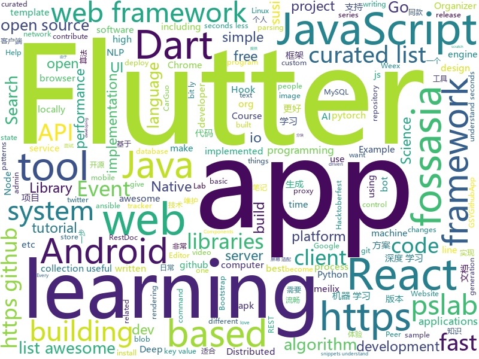

# 2018-10-27
See what the GitHub community is most excited about today.

## python
* [maskrcnn-benchmark](https://github.com/facebookresearch/maskrcnn-benchmark)(**532 stars today**): Fast, modular reference implementation of Instance Segmentation and Object Detection algorithms in PyTorch.
* [TensorFlow-Course](https://github.com/open-source-for-science/TensorFlow-Course)(**222 stars today**): Simple and ready-to-use tutorials for TensorFlow
* [Python](https://github.com/TheAlgorithms/Python)(**140 stars today**): All Algorithms implemented in Python
* [transparent_latent_gan](https://github.com/SummitKwan/transparent_latent_gan)(**146 stars today**): Use supervised learning to illuminate the latent space of GAN for controlled generation and edit
* [data-life](https://github.com/abcnews/data-life)(**135 stars today**): 
* [Learning-to-See-in-the-Dark](https://github.com/cchen156/Learning-to-See-in-the-Dark)(**90 stars today**): Learning to See in the Dark. CVPR 2018
* [models](https://github.com/tensorflow/models)(**63 stars today**): Models and examples built with TensorFlow
* [system-design-primer](https://github.com/donnemartin/system-design-primer)(**68 stars today**): Learn how to design large-scale systems. Prep for the system design interview. Includes Anki flashcards.
* [responder](https://github.com/kennethreitz/responder)(**61 stars today**): a familiar HTTP Service Framework for Python
* [awesome-python](https://github.com/vinta/awesome-python)(**55 stars today**): A curated list of awesome Python frameworks, libraries, software and resources
* [Algorithm_Interview_Notes-Chinese](https://github.com/imhuay/Algorithm_Interview_Notes-Chinese)(**43 stars today**): 2018/2019/校招/春招/秋招/算法/机器学习(Machine Learning)/深度学习(Deep Learning)/自然语言处理(NLP)/C/C++/Python/面试笔记
* [DeepCreamPy](https://github.com/deeppomf/DeepCreamPy)(**49 stars today**): Decensoring Hentai with Deep Neural Networks
* [meilix](https://github.com/fossasia/meilix)(**44 stars today**): Beautiful Linux System http://meilix.fossasia.org
* [BERT-pytorch](https://github.com/codertimo/BERT-pytorch)(**42 stars today**): Google AI 2018 BERT pytorch implementation
* [awesome-algorithm](https://github.com/apachecn/awesome-algorithm)(**40 stars today**): Leetcode 题解 (跟随思路一步一步撸出代码) 及经典算法实现
* [keras](https://github.com/keras-team/keras)(**34 stars today**): Deep Learning for humans
* [public-apis](https://github.com/toddmotto/public-apis)(**42 stars today**): A collective list of public JSON APIs for use in web development.
* [modin](https://github.com/modin-project/modin)(**41 stars today**): Modin: Speed up your Pandas workflows by changing a single line of code
* [ansible](https://github.com/ansible/ansible)(**33 stars today**): Ansible is a radically simple IT automation platform that makes your applications and systems easier to deploy. Avoid writing scripts or custom code to deploy and update your applications — automate in a language that approaches plain English, using SSH, with no agents to install on remote systems. https://docs.ansible.com/ansible/
* [bitcoinbook](https://github.com/bitcoinbook/bitcoinbook)(**38 stars today**): Mastering Bitcoin 2nd Edition - Programming the Open Blockchain
* [open-event-server](https://github.com/fossasia/open-event-server)(**40 stars today**): The Open Event Organizer Server to Manage Events http://open-event-api.herokuapp.com
* [susi_linux](https://github.com/fossasia/susi_linux)(**38 stars today**): Hardware for SUSI AI http://susi.ai
* [youtube-dl](https://github.com/rg3/youtube-dl)(**32 stars today**): Command-line program to download videos from YouTube.com and other video sites
* [pslab-desktop-apps](https://github.com/fossasia/pslab-desktop-apps)(**37 stars today**): PSLab GUI Experiments using Qt and Python http://pslab.fossasia.org
* [pslab-python](https://github.com/fossasia/pslab-python)(**37 stars today**): Python Library for PSLab Desktop: http://pslab.fossasia.org

## java
* [JavaGuide](https://github.com/Snailclimb/JavaGuide)(**93 stars today**): 【Java学习+面试指南】 一份涵盖大部分Java程序员所需要掌握的核心知识。
* [Phantom](https://github.com/ManbangGroup/Phantom)(**93 stars today**): Phantom — 唯一零 Hook 稳定占坑类 Android 热更新插件化方案
* [proxyee-down](https://github.com/proxyee-down-org/proxyee-down)(**63 stars today**): http下载工具，基于http代理，支持多连接分块下载
* [symphony](https://github.com/b3log/symphony)(**59 stars today**): 🎶一款用 Java 实现的现代化社区（论坛/BBS/社交网络/博客）平台。https://hacpai.com
* [AndroidAutoSize](https://github.com/JessYanCoding/AndroidAutoSize)(**58 stars today**): 🔥A low-cost Android screen adaptation solution (今日头条屏幕适配方案终极版，一个极低成本的 Android 屏幕适配方案).
* [apiggs](https://github.com/apiggs/apiggs)(**53 stars today**): 一个非侵入的RestDoc文档生成工具。工具通过分析代码和注释，获取文档信息，生成RestDoc文档。
* [AndroidProject](https://github.com/getActivity/AndroidProject)(**54 stars today**): An advanced template project
* [spring-boot](https://github.com/spring-projects/spring-boot)(**45 stars today**): Spring Boot
* [java-design-patterns](https://github.com/iluwatar/java-design-patterns)(**40 stars today**): Design patterns implemented in Java
* [phimpme-android](https://github.com/fossasia/phimpme-android)(**45 stars today**): Phimp.me - Photo Image Editor App https://phimp.me
* [arthas](https://github.com/alibaba/arthas)(**44 stars today**): Alibaba Java Diagnostic Tool Arthas/Alibaba Java诊断利器Arthas
* [Java](https://github.com/TheAlgorithms/Java)(**38 stars today**): All Algorithms implemented in Java
* [pslab-android](https://github.com/fossasia/pslab-android)(**41 stars today**): PSLab Android App https://github.com/fossasia/pslab-android/blob/apk/app-master-release.apk
* [open-event-orga-app](https://github.com/fossasia/open-event-orga-app)(**41 stars today**): Open Event Mobile App for Organizers and Entry Managers https://github.com/fossasia/open-event-orga-app/blob/apk/eventyay-organizer-dev-app-playStore-release-unsigned.apk
* [tutorials](https://github.com/eugenp/tutorials)(**26 stars today**): The "REST With Spring" Course:
* [flyer-maker](https://github.com/vancefantasy/flyer-maker)(**38 stars today**): a scaffold tool of java project
* [elasticsearch](https://github.com/elastic/elasticsearch)(**33 stars today**): Open Source, Distributed, RESTful Search Engine
* [uid-generator](https://github.com/baidu/uid-generator)(**34 stars today**): UniqueID generator
* [repairnator](https://github.com/Spirals-Team/repairnator)(**33 stars today**): Software development bot that automatically repairs build failures on Travis Continuous Integration. Join the bot revolution!🌟🤖🌟💞
* [yacy_search_server](https://github.com/yacy/yacy_search_server)(**35 stars today**): Distributed Peer-to-Peer Web Search Engine and Intranet Search Appliance
* [susi_server](https://github.com/fossasia/susi_server)(**34 stars today**): Software and Skills for Personal Assistants using SUSI AI / Artificial Intelligence for Chat Bots https://api.susi.ai
* [spring-framework](https://github.com/spring-projects/spring-framework)(**24 stars today**): Spring Framework
* [yacy_grid_parser](https://github.com/yacy/yacy_grid_parser)(**34 stars today**): Parser Microservice for the YaCy Grid
* [loklak_server](https://github.com/loklak/loklak_server)(**33 stars today**): Distributed Open Source twitter and social media message search server that anonymously collects, shares, dumps and indexes data http://api.loklak.org
* [incubator-dubbo](https://github.com/apache/incubator-dubbo)(**22 stars today**): Apache Dubbo (incubating) is a high-performance, java based, open source RPC framework.

## unknown
* [DeepLearning-500-questions](https://github.com/scutan90/DeepLearning-500-questions)(**810 stars today**): 深度学习500问，以问答形式对常用的概率知识、线性代数、机器学习、深度学习、计算机视觉等热点问题进行阐述，以帮助自己及有需要的读者。 全书分为15个章节，近20万字。由于水平有限，书中不妥之处恳请广大读者批评指正。 未完待续............ 如有意合作，联系scutjy2015@163.com 版权所有，违权必究 Tan 2018.06
* [awesome-react-hooks](https://github.com/rehooks/awesome-react-hooks)(**313 stars today**): Awesome React Hooks
* [git-flight-rules](https://github.com/k88hudson/git-flight-rules)(**175 stars today**): Flight rules for git
* [first-contributions](https://github.com/firstcontributions/first-contributions)(**51 stars today**): 🚀✨Help beginners to contribute to open source projects
* [awesome](https://github.com/sindresorhus/awesome)(**103 stars today**): 😎Curated list of awesome lists
* [CS-Notes](https://github.com/CyC2018/CS-Notes)(**87 stars today**): 📚Computer Science Learning Notes
* [bert](https://github.com/google-research/bert)(**99 stars today**): 
* [Make-a-Pull-Request](https://github.com/rishabh-bansal/Make-a-Pull-Request)(**21 stars today**): Make a Pull Request
* [developer-roadmap](https://github.com/kamranahmedse/developer-roadmap)(**89 stars today**): Roadmap to becoming a web developer in 2018
* [douyu-mac-app](https://github.com/nswbmw/douyu-mac-app)(**82 stars today**): 逗鱼直播 Mac app
* [gitignore](https://github.com/github/gitignore)(**58 stars today**): A collection of useful .gitignore templates
* [You-Dont-Know-JS](https://github.com/getify/You-Dont-Know-JS)(**66 stars today**): A book series on JavaScript. @YDKJS on twitter.
* [JSTheWeirdParts](https://github.com/tomquinonero/JSTheWeirdParts)(**72 stars today**): Courses note on the amazing course by Anthony Alicea
* [weekly](https://github.com/ruanyf/weekly)(**69 stars today**): 技术分享周刊，每周五发布
* [A-to-Z-Resources-for-Students](https://github.com/dipakkr/A-to-Z-Resources-for-Students)(**32 stars today**): Curated list of resources for college students If you like give a⭐️
* [free-programming-books](https://github.com/EbookFoundation/free-programming-books)(**59 stars today**): 📚Freely available programming books
* [rfcs](https://github.com/reactjs/rfcs)(**59 stars today**): RFCs for changes to React
* [coding-interview-university](https://github.com/jwasham/coding-interview-university)(**42 stars today**): A complete computer science study plan to become a software engineer.
* [Awesome-pytorch-list](https://github.com/bharathgs/Awesome-pytorch-list)(**49 stars today**): A comprehensive list of pytorch related content on github,such as different models,implementations,helper libraries,tutorials etc.
* [awesome-vue](https://github.com/vuejs/awesome-vue)(**44 stars today**): 🎉A curated list of awesome things related to Vue.js
* [project-based-learning](https://github.com/tuvtran/project-based-learning)(**42 stars today**): Curated list of project-based tutorials
* [awesome-actions](https://github.com/sdras/awesome-actions)(**40 stars today**): A curated list of awesome actions to use on GitHub
* [ideas](https://github.com/rehooks/ideas)(**39 stars today**): Got an idea for a new React Hook for this org, start here
* [Enterprise_Security_Build--Open_Source](https://github.com/bloodzer0/Enterprise_Security_Build--Open_Source)(**34 stars today**): 甲方企业安全建设
* [pslab-artwork](https://github.com/fossasia/pslab-artwork)(**34 stars today**): Pocket Science Lab Artwork https://pslab.io

## javascript
* [33-js-concepts](https://github.com/leonardomso/33-js-concepts)(**574 stars today**): 📜33 concepts every JavaScript developer should know.
* [33-js-concepts](https://github.com/stephentian/33-js-concepts)(**459 stars today**): 📜每个 JavaScript 工程师都应懂的33个概念 @leonardomso
* [texme](https://github.com/susam/texme)(**380 stars today**): Self-rendering Markdown + LaTeX documents
* [the-platform](https://github.com/palmerhq/the-platform)(**264 stars today**): Web. Components.
* [fastscan](https://github.com/pyloque/fastscan)(**251 stars today**): quickly text search by ahocorasick algorithm
* [irondb](https://github.com/gruns/irondb)(**183 stars today**): 🔩A relentless key-value store for the browser.
* [omi](https://github.com/Tencent/omi)(**136 stars today**): Next generation web framework in 4kb JavaScript (Web Components + JSX + Proxy + Store + Path Updating)
* [freeCodeCamp](https://github.com/freeCodeCamp/freeCodeCamp)(****): The https://freeCodeCamp.org open source codebase and curriculum. Learn to code for free together with millions of people.
* [react](https://github.com/facebook/react)(**120 stars today**): A declarative, efficient, and flexible JavaScript library for building user interfaces.
* [awesome-selfhosted](https://github.com/Kickball/awesome-selfhosted)(**118 stars today**): This is a list of Free Software network services and web applications which can be hosted locally. Selfhosting is the process of locally hosting and managing applications instead of renting from SaaS providers.
* [vue](https://github.com/vuejs/vue)(**104 stars today**): 🖖A progressive, incrementally-adoptable JavaScript framework for building UI on the web.
* [30-seconds-of-code](https://github.com/30-seconds/30-seconds-of-code)(**110 stars today**): Curated collection of useful JavaScript snippets that you can understand in 30 seconds or less.
* [javascript](https://github.com/airbnb/javascript)(**97 stars today**): JavaScript Style Guide
* [use-immer](https://github.com/mweststrate/use-immer)(**97 stars today**): Use immer to drive state with a React hooks
* [percollate](https://github.com/danburzo/percollate)(**89 stars today**): 🌐→📖A command-line tool to turn web pages into beautifully formatted PDFs
* [Hello-Hacktober](https://github.com/ViniciusDeep/Hello-Hacktober)(**5 stars today**): This repository is for people who are starting to program, and want to participate in hacktoberfest or just want to contribute
* [taro](https://github.com/NervJS/taro)(**74 stars today**): 多端统一开发框架，支持用 React 的开发方式编写一次代码，生成能运行在微信小程序、H5、React Native 等的应用。
* [puppeteer](https://github.com/GoogleChrome/puppeteer)(**63 stars today**): Headless Chrome Node API
* [create-react-app](https://github.com/facebook/create-react-app)(**49 stars today**): Set up a modern web app by running one command.
* [react-spring](https://github.com/drcmda/react-spring)(**61 stars today**): 🙌Helping react-motion and animated to become best friends
* [axios](https://github.com/axios/axios)(**50 stars today**): Promise based HTTP client for the browser and node.js
* [node](https://github.com/nodejs/node)(**41 stars today**): Node.js JavaScript runtime✨🐢🚀✨
* [react-native](https://github.com/facebook/react-native)(**44 stars today**): A framework for building native apps with React.
* [next.js](https://github.com/zeit/next.js)(**44 stars today**): The React Framework
* [hash-table](https://github.com/ronomon/hash-table)(**48 stars today**): Fast, reliable cuckoo hash table for Node.js.

## html
* [DeepLearningProject](https://github.com/Spandan-Madan/DeepLearningProject)(**196 stars today**): An in-depth machine learning tutorial introducing readers to a whole machine learning pipeline from scratch.
* [async-javascript-cheatsheet](https://github.com/frontarm/async-javascript-cheatsheet)(**102 stars today**): Cheatsheet for promises and async/await
* [30-seconds-of-css](https://github.com/30-seconds/30-seconds-of-css)(**46 stars today**): A curated collection of useful CSS snippets you can understand in 30 seconds or less.
* [gci18.fossasia.org](https://github.com/fossasia/gci18.fossasia.org)(**34 stars today**): FOSSASIA Google Code-In Website 2018 https://gci18.fossasia.org
* [NLP-progress](https://github.com/sebastianruder/NLP-progress)(**32 stars today**): Repository to track the progress in Natural Language Processing (NLP), including the datasets and the current state-of-the-art for the most common NLP tasks.
* [meilix-generator](https://github.com/fossasia/meilix-generator)(**33 stars today**): WebApp for generating a custom ISO image based on Meilix http://meilix.org
* [2019.fossasia.org](https://github.com/fossasia/2019.fossasia.org)(**33 stars today**): FOSSASIA Summit 2019 https://2019.fossasia.org
* [pslab.io](https://github.com/fossasia/pslab.io)(**33 stars today**): Pocket Science Lab Website http://pslab.io
* [patchwork](https://github.com/jlord/patchwork)(****): All the Git-it Workshop completers!
* [hello](https://github.com/nat/hello)(**23 stars today**): 👋Hello, GitHub
* [AdminLTE](https://github.com/almasaeed2010/AdminLTE)(**21 stars today**): AdminLTE - Free Premium Admin control Panel Theme Based On Bootstrap 3.x
* [Coursera-ML-AndrewNg-Notes](https://github.com/fengdu78/Coursera-ML-AndrewNg-Notes)(**17 stars today**): 吴恩达老师的机器学习课程个人笔记
* [hacktoberfest](https://github.com/lingonsaft/hacktoberfest)(**5 stars today**): Hacktoberfest 2018. Don't forget to spread love and if you like give us a⭐️
* [fastText](https://github.com/facebookresearch/fastText)(**20 stars today**): Library for fast text representation and classification.
* [Spoon-Knife](https://github.com/octocat/Spoon-Knife)(****): This repo is for demonstration purposes only.
* [baselines](https://github.com/openai/baselines)(**18 stars today**): OpenAI Baselines: high-quality implementations of reinforcement learning algorithms
* [mastering-modular-javascript](https://github.com/mjavascript/mastering-modular-javascript)(**15 stars today**): 📦Module thinking, principles, design patterns and best practices.
* [JavaScript30](https://github.com/wesbos/JavaScript30)(**9 stars today**): 30 Day Vanilla JS Challenge
* [My-Learning-Tracker-first-ten-months](https://github.com/Syknapse/My-Learning-Tracker-first-ten-months)(**11 stars today**): A copy of my learning tracker frozen in time at the 10 month mark. It shows my learning process from the beginning of my front end journey, up to the moment I got my first job. Full tracker is at: https://github.com/Syknapse/My-Learning-Tracker
* [portainer](https://github.com/portainer/portainer)(**12 stars today**): Simple management UI for Docker
* [react-redux](https://github.com/reduxjs/react-redux)(**12 stars today**): Official React bindings for Redux
* [coreui-free-bootstrap-admin-template](https://github.com/coreui/coreui-free-bootstrap-admin-template)(**11 stars today**): CoreUI is free bootstrap admin template
* [qiubaiying.github.io](https://github.com/qiubaiying/qiubaiying.github.io)(**6 stars today**): BY Blog ->
* [ecma262](https://github.com/tc39/ecma262)(**11 stars today**): Status, process, and documents for ECMA262
* [swagger-codegen](https://github.com/swagger-api/swagger-codegen)(**9 stars today**): swagger-codegen contains a template-driven engine to generate documentation, API clients and server stubs in different languages by parsing your OpenAPI / Swagger definition.

## dart
* [flutter](https://github.com/flutter/flutter)(**97 stars today**): Flutter makes it easy and fast to build beautiful mobile apps.
* [awesome-flutter](https://github.com/Solido/awesome-flutter)(**29 stars today**): An awesome list that curates the best Flutter libraries, tools, tutorials, articles and more.
* [Flutter-Notebook](https://github.com/OpenFlutter/Flutter-Notebook)(**17 stars today**): 日更的FlutterDemo合集，今天你fu了吗
* [plugins](https://github.com/flutter/plugins)(**11 stars today**): Plugins for Flutter, including FlutterFire, maintained by the Flutter team
* [flutter-examples](https://github.com/nisrulz/flutter-examples)(**6 stars today**): [Examples] Simple basic isolated apps, for budding flutter devs.
* [sentry](https://github.com/flutter/sentry)(****): A pure Dart Sentry.io client.
* [googleapis](https://github.com/dart-lang/googleapis)(****): Repository for building the googleapis packages
* [flutter-redux-starter](https://github.com/hillelcoren/flutter-redux-starter)(****): Starter project and code generator for Flutter/Redux
* [audio_recorder](https://github.com/ZaraclaJ/audio_recorder)(****): 
* [FlutterGameOfThrones](https://github.com/iampawan/FlutterGameOfThrones)(****): 
* [chromedeveditor](https://github.com/googlearchive/chromedeveditor)(****): Chrome Dev Editor is a developer tool for building apps on the Chrome platform - Chrome Apps and Web Apps, in JavaScript or Dart. (NO LONGER IN ACTIVE DEVELOPMENT)
* [sdk](https://github.com/dart-lang/sdk)(****): The Dart SDK, including the VM, dart2js, core libraries, and more.
* [GSYGithubAppFlutter](https://github.com/CarGuo/GSYGithubAppFlutter)(****): 超完整的Flutter项目，功能丰富，适合学习和日常使用。GSYGithubApp系列的优势：我们目前已经拥有Flutter、Weex、ReactNative三个版本。 功能齐全，项目框架内技术涉及面广，完成度高，持续维护，配套文章，适合全面学习，跨框架对比参考。跨平台的开源Github客户端App，更好的体验，更丰富的功能，旨在更好的日常管理和维护个人Github，提供更好更方便的驾车体验～～Σ(￣。￣ﾉ)ﾉ。同款Weex版本 ： https://github.com/CarGuo/GSYGithubAppWeex 、同款React Native版本 ： https://github.com/CarGuo/GSYGithubApp
* [flutter-osc](https://github.com/yubo725/flutter-osc)(****): 基于Google Flutter的开源中国客户端，支持Android和iOS。
* [FlutterExampleApps](https://github.com/iampawan/FlutterExampleApps)(****): [Example APPS] Basic Flutter apps, for flutter devs.
* [Flutter-UI-Kit](https://github.com/iampawan/Flutter-UI-Kit)(****): Flutter app for collection of UI in a UIKit
* [flutter_architecture_samples](https://github.com/brianegan/flutter_architecture_samples)(****): TodoMVC for Flutter
* [Flutter-learning](https://github.com/AweiLoveAndroid/Flutter-learning)(****): 🔥👍🌟⭐️⭐️⭐️Flutter install&settings,Flutter problems when developing,Flutter sample codes& templates,Flutter projects,Dart languages sample codes
* [inKino](https://github.com/roughike/inKino)(****): inKino - A cross platform movie and showtime browser for Finnkino cinemas, made with Flutter.
* [dio](https://github.com/flutterchina/dio)(****): A powerful Http client for Dart, which supports Interceptors, FormData, Request Cancellation, File Downloading, Timeout etc.
* [hauberk](https://github.com/munificent/hauberk)(****): A web-based roguelike written in Dart.
* [zhihu-flutter](https://github.com/HackSoul/zhihu-flutter)(****): Flutter 高仿知乎 UI，非常漂亮，也非常流畅，flutter build apk 或 flutter build ios 之后更流畅
* [angular](https://github.com/dart-lang/angular)(****): Fast and productive web framework provided by Dart
* [StageXL](https://github.com/bp74/StageXL)(****): A fast and universal 2D rendering engine for HTML5 and Dart.
* [dart-sass](https://github.com/sass/dart-sass)(****): A Dart implementation of Sass.

## go
* [up](https://github.com/akavel/up)(**413 stars today**): Ultimate Plumber is a tool for writing Linux pipes with instant live preview
* [dive](https://github.com/wagoodman/dive)(**346 stars today**): A tool for exploring each layer in a docker image
* [naftis](https://github.com/XiaoMi/naftis)(**295 stars today**): An awesome dashboard for Istio built with love.
* [soar](https://github.com/XiaoMi/soar)(**207 stars today**): SQL Optimizer And Rewriter
* [mkcert](https://github.com/FiloSottile/mkcert)(**119 stars today**): A simple zero-config tool to make locally trusted development certificates with any names you'd like.
* [gotop](https://github.com/cjbassi/gotop)(**82 stars today**): A terminal based graphical activity monitor inspired by gtop and vtop
* [croc](https://github.com/schollz/croc)(**63 stars today**): Easily and securely send things from one computer to another🐊📦
* [kubernetes](https://github.com/kubernetes/kubernetes)(**49 stars today**): Production-Grade Container Scheduling and Management
* [resty](https://github.com/go-resty/resty)(**50 stars today**): Simple HTTP and REST client library for Go
* [illustrated-tls](https://github.com/syncsynchalt/illustrated-tls)(**44 stars today**): The Illustrated TLS Connection: Every byte explained
* [go](https://github.com/golang/go)(**40 stars today**): The Go programming language
* [godown](https://github.com/namreg/godown)(**42 stars today**): Distributed, fault-tolerant key-value storage written in go.
* [awesome-go](https://github.com/avelino/awesome-go)(**35 stars today**): A curated list of awesome Go frameworks, libraries and software
* [traefik](https://github.com/containous/traefik)(**36 stars today**): The Cloud Native Edge Router
* [go-sniffer](https://github.com/40t/go-sniffer)(**31 stars today**): 🔎Sniffing and parsing mysql,redis,http,mongodb etc protocol. 抓包截取项目中的数据库请求并解析成相应的语句。
* [frp](https://github.com/fatedier/frp)(**32 stars today**): A fast reverse proxy to help you expose a local server behind a NAT or firewall to the internet.
* [starlight](https://github.com/interstellar/starlight)(**32 stars today**): Payment channels on Stellar
* [godoc-playground](https://github.com/bradleyjkemp/godoc-playground)(**31 stars today**): Play with GoDoc syntax and preview your changes in realtime
* [iris](https://github.com/kataras/iris)(**29 stars today**): The fastest backend community-driven web framework on (THIS) Earth. HTTP/2, MVC and more. Can your favourite web framework do that?👉http://bit.ly/iriscandothat1 or even http://bit.ly/iriscandothat2
* [v2ray-core](https://github.com/v2ray/v2ray-core)(**28 stars today**): A platform for building proxies to bypass network restrictions.
* [istio](https://github.com/istio/istio)(**28 stars today**): Connect, secure, control, and observe services.
* [beego](https://github.com/astaxie/beego)(**26 stars today**): beego is an open-source, high-performance web framework for the Go programming language.
* [prometheus](https://github.com/prometheus/prometheus)(**26 stars today**): The Prometheus monitoring system and time series database.
* [tidb](https://github.com/pingcap/tidb)(**26 stars today**): TiDB is a distributed HTAP database compatible with the MySQL protocol
* [gin](https://github.com/gin-gonic/gin)(**23 stars today**): Gin is a HTTP web framework written in Go (Golang). It features a Martini-like API with much better performance -- up to 40 times faster. If you need smashing performance, get yourself some Gin.

## WordCloud

