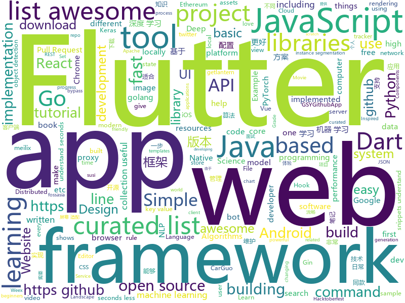

# 2018-10-28
See what the GitHub community is most excited about today.

## python
* [TensorFlow-Course](https://github.com/open-source-for-science/TensorFlow-Course)(**290 stars today**): Simple and ready-to-use tutorials for TensorFlow
* [transparent_latent_gan](https://github.com/SummitKwan/transparent_latent_gan)(**195 stars today**): Use supervised learning to illuminate the latent space of GAN for controlled generation and edit
* [maskrcnn-benchmark](https://github.com/facebookresearch/maskrcnn-benchmark)(**133 stars today**): Fast, modular reference implementation of Instance Segmentation and Object Detection algorithms in PyTorch.
* [Python](https://github.com/TheAlgorithms/Python)(**69 stars today**): All Algorithms implemented in Python
* [DeepCreamPy](https://github.com/deeppomf/DeepCreamPy)(**68 stars today**): Decensoring Hentai with Deep Neural Networks
* [modin](https://github.com/modin-project/modin)(**54 stars today**): Modin: Speed up your Pandas workflows by changing a single line of code
* [models](https://github.com/tensorflow/models)(**33 stars today**): Models and examples built with TensorFlow
* [awesome-python](https://github.com/vinta/awesome-python)(**39 stars today**): A curated list of awesome Python frameworks, libraries, software and resources
* [system-design-primer](https://github.com/donnemartin/system-design-primer)(**39 stars today**): Learn how to design large-scale systems. Prep for the system design interview. Includes Anki flashcards.
* [responder](https://github.com/kennethreitz/responder)(**42 stars today**): a familiar HTTP Service Framework for Python
* [home-assistant](https://github.com/home-assistant/home-assistant)(**28 stars today**): 🏡Open source home automation that puts local control and privacy first
* [keras](https://github.com/keras-team/keras)(**29 stars today**): Deep Learning for humans
* [Algorithm_Interview_Notes-Chinese](https://github.com/imhuay/Algorithm_Interview_Notes-Chinese)(**28 stars today**): 2018/2019/校招/春招/秋招/算法/机器学习(Machine Learning)/深度学习(Deep Learning)/自然语言处理(NLP)/C/C++/Python/面试笔记
* [youtube-dl](https://github.com/rg3/youtube-dl)(**26 stars today**): Command-line program to download videos from YouTube.com and other video sites
* [public-apis](https://github.com/toddmotto/public-apis)(**25 stars today**): A collective list of public JSON APIs for use in web development.
* [data-life](https://github.com/abcnews/data-life)(**26 stars today**): 
* [bitcoinbook](https://github.com/bitcoinbook/bitcoinbook)(**22 stars today**): Mastering Bitcoin 2nd Edition - Programming the Open Blockchain
* [MMdnn](https://github.com/Microsoft/MMdnn)(**22 stars today**): MMdnn is a set of tools to help users inter-operate among different deep learning frameworks. E.g. model conversion and visualization. Convert models between Caffe, Keras, MXNet, Tensorflow, CNTK, PyTorch Onnx and CoreML.
* [scikit-learn](https://github.com/scikit-learn/scikit-learn)(**21 stars today**): scikit-learn: machine learning in Python
* [Mask_RCNN](https://github.com/matterport/Mask_RCNN)(**19 stars today**): Mask R-CNN for object detection and instance segmentation on Keras and TensorFlow
* [scrapy](https://github.com/scrapy/scrapy)(**21 stars today**): Scrapy, a fast high-level web crawling & scraping framework for Python.
* [face_recognition](https://github.com/ageitgey/face_recognition)(**18 stars today**): The world's simplest facial recognition api for Python and the command line
* [awesome-algorithm](https://github.com/apachecn/awesome-algorithm)(**20 stars today**): Leetcode 题解 (跟随思路一步一步撸出代码) 及经典算法实现
* [django](https://github.com/django/django)(**15 stars today**): The Web framework for perfectionists with deadlines.
* [openlibrary](https://github.com/internetarchive/openlibrary)(**18 stars today**): One webpage for every book ever published!

## java
* [proxyee-down](https://github.com/proxyee-down-org/proxyee-down)(**58 stars today**): http下载工具，基于http代理，支持多连接分块下载
* [JavaGuide](https://github.com/Snailclimb/JavaGuide)(**43 stars today**): 【Java学习+面试指南】 一份涵盖大部分Java程序员所需要掌握的核心知识。
* [java-design-patterns](https://github.com/iluwatar/java-design-patterns)(**37 stars today**): Design patterns implemented in Java
* [spring-boot](https://github.com/spring-projects/spring-boot)(**28 stars today**): Spring Boot
* [Java](https://github.com/TheAlgorithms/Java)(**24 stars today**): All Algorithms implemented in Java
* [symphony](https://github.com/b3log/symphony)(**27 stars today**): 🎶一款用 Java 实现的现代化社区（论坛/BBS/社交网络/博客）平台。https://hacpai.com
* [repairnator](https://github.com/Spirals-Team/repairnator)(**25 stars today**): Software development bot that automatically repairs build failures on Travis Continuous Integration. Join the bot revolution!🌟🤖🌟💞
* [AndroidAutoSize](https://github.com/JessYanCoding/AndroidAutoSize)(**24 stars today**): 🔥A low-cost Android screen adaptation solution (今日头条屏幕适配方案终极版，一个极低成本的 Android 屏幕适配方案).
* [elasticsearch](https://github.com/elastic/elasticsearch)(**15 stars today**): Open Source, Distributed, RESTful Search Engine
* [MPAndroidChart](https://github.com/PhilJay/MPAndroidChart)(**16 stars today**): A powerful🚀Android chart view / graph view library, supporting line- bar- pie- radar- bubble- and candlestick charts as well as scaling, dragging and animations.
* [pantheon](https://github.com/PegaSysEng/pantheon)(**15 stars today**): An enterprise-grade Java-based, Apache 2.0 licensed Ethereum client
* [uid-generator](https://github.com/baidu/uid-generator)(**15 stars today**): UniqueID generator
* [spring-framework](https://github.com/spring-projects/spring-framework)(**13 stars today**): Spring Framework
* [VirtualXposed](https://github.com/android-hacker/VirtualXposed)(**15 stars today**): A simple app to use Xposed without root, unlock the bootloader or modify system image, etc.
* [incubator-dubbo](https://github.com/apache/incubator-dubbo)(**13 stars today**): Apache Dubbo (incubating) is a high-performance, java based, open source RPC framework.
* [Phantom](https://github.com/ManbangGroup/Phantom)(**15 stars today**): Phantom — 唯一零 Hook 稳定占坑类 Android 热更新插件化方案
* [guava](https://github.com/google/guava)(**12 stars today**): Google core libraries for Java
* [procrastination](https://github.com/gdejohn/procrastination)(**14 stars today**): Lazily evaluated, memoizing, purely functional data structures and stack-safe tail-recursive lambda expressions for Java 11
* [arthas](https://github.com/alibaba/arthas)(**13 stars today**): Alibaba Java Diagnostic Tool Arthas/Alibaba Java诊断利器Arthas
* [susi_server](https://github.com/fossasia/susi_server)(**13 stars today**): Software and Skills for Personal Assistants using SUSI AI / Artificial Intelligence for Chat Bots https://api.susi.ai
* [phimpme-android](https://github.com/fossasia/phimpme-android)(**13 stars today**): Phimp.me - Photo Image Editor App https://phimp.me
* [loklak_server](https://github.com/loklak/loklak_server)(**13 stars today**): Distributed Open Source twitter and social media message search server that anonymously collects, shares, dumps and indexes data http://api.loklak.org
* [tutorials](https://github.com/eugenp/tutorials)(**5 stars today**): The "REST With Spring" Course:
* [JCSprout](https://github.com/crossoverJie/JCSprout)(**10 stars today**): 👨‍🎓Java Core Sprout : basic, concurrent, algorithm
* [apollo](https://github.com/ctripcorp/apollo)(**12 stars today**): Apollo（阿波罗）是携程框架部门研发的分布式配置中心，能够集中化管理应用不同环境、不同集群的配置，配置修改后能够实时推送到应用端，并且具备规范的权限、流程治理等特性，适用于微服务配置管理场景。

## unknown
* [DeepLearning-500-questions](https://github.com/scutan90/DeepLearning-500-questions)(**351 stars today**): 深度学习500问，以问答形式对常用的概率知识、线性代数、机器学习、深度学习、计算机视觉等热点问题进行阐述，以帮助自己及有需要的读者。 全书分为15个章节，近20万字。由于水平有限，书中不妥之处恳请广大读者批评指正。 未完待续............ 如有意合作，联系scutjy2015@163.com 版权所有，违权必究 Tan 2018.06
* [first-contributions](https://github.com/firstcontributions/first-contributions)(**47 stars today**): 🚀✨Help beginners to contribute to open source projects
* [awesome-react-hooks](https://github.com/rehooks/awesome-react-hooks)(**173 stars today**): Awesome React Hooks
* [A-to-Z-Resources-for-Students](https://github.com/dipakkr/A-to-Z-Resources-for-Students)(**120 stars today**): Curated list of resources for college students If you like give a⭐️
* [Make-a-Pull-Request](https://github.com/rishabh-bansal/Make-a-Pull-Request)(**28 stars today**): Make a Pull Request
* [git-flight-rules](https://github.com/k88hudson/git-flight-rules)(**72 stars today**): Flight rules for git
* [bert](https://github.com/google-research/bert)(**67 stars today**): 
* [awesome](https://github.com/sindresorhus/awesome)(**51 stars today**): 😎Curated list of awesome lists
* [gitignore](https://github.com/github/gitignore)(**41 stars today**): A collection of useful .gitignore templates
* [CS-Notes](https://github.com/CyC2018/CS-Notes)(**46 stars today**): 📚Computer Science Learning Notes
* [developer-roadmap](https://github.com/kamranahmedse/developer-roadmap)(**47 stars today**): Roadmap to becoming a web developer in 2018
* [coding-interview-university](https://github.com/jwasham/coding-interview-university)(**41 stars today**): A complete computer science study plan to become a software engineer.
* [free-programming-books](https://github.com/EbookFoundation/free-programming-books)(**38 stars today**): 📚Freely available programming books
* [NEUQACMClub-weekly](https://github.com/fireairforce/NEUQACMClub-weekly)(**21 stars today**): 该仓库用于存储NEUQ-ACM俱乐部现役预备队成员周报
* [You-Dont-Know-JS](https://github.com/getify/You-Dont-Know-JS)(**32 stars today**): A book series on JavaScript. @YDKJS on twitter.
* [awesome-actions](https://github.com/sdras/awesome-actions)(**33 stars today**): A curated list of awesome actions to use on GitHub
* [clash_for_windows_pkg](https://github.com/Fndroid/clash_for_windows_pkg)(**31 stars today**): A Windows GUI for Clash
* [Awesome-pytorch-list](https://github.com/bharathgs/Awesome-pytorch-list)(**25 stars today**): A comprehensive list of pytorch related content on github,such as different models,implementations,helper libraries,tutorials etc.
* [weekly](https://github.com/ruanyf/weekly)(**28 stars today**): 技术分享周刊，每周五发布
* [project-based-learning](https://github.com/tuvtran/project-based-learning)(**25 stars today**): Curated list of project-based tutorials
* [awesome-vue](https://github.com/vuejs/awesome-vue)(**25 stars today**): 🎉A curated list of awesome things related to Vue.js
* [rfcs](https://github.com/reactjs/rfcs)(**22 stars today**): RFCs for changes to React
* [awesome-cpp](https://github.com/fffaraz/awesome-cpp)(**20 stars today**): A curated list of awesome C++ (or C) frameworks, libraries, resources, and shiny things. Inspired by awesome-... stuff.
* [awesome-for-beginners](https://github.com/MunGell/awesome-for-beginners)(**16 stars today**): A list of awesome beginners-friendly projects.
* [AwesomeCSV](https://github.com/secretGeek/AwesomeCSV)(**19 stars today**): 🕶️A curated list of awesome tools for dealing with awesome CSV

## javascript
* [the-platform](https://github.com/palmerhq/the-platform)(**520 stars today**): Web. Components.😂
* [33-js-concepts](https://github.com/leonardomso/33-js-concepts)(**247 stars today**): 📜33 concepts every JavaScript developer should know.
* [freeCodeCamp](https://github.com/freeCodeCamp/freeCodeCamp)(****): The https://freeCodeCamp.org open source codebase and curriculum. Learn to code for free together with millions of people.
* [33-js-concepts](https://github.com/stephentian/33-js-concepts)(**134 stars today**): 📜每个 JavaScript 工程师都应懂的33个概念 @leonardomso
* [texme](https://github.com/susam/texme)(**134 stars today**): Self-rendering Markdown + LaTeX documents
* [hooks-test](https://github.com/jacobp100/hooks-test)(**112 stars today**): 
* [react](https://github.com/facebook/react)(**67 stars today**): A declarative, efficient, and flexible JavaScript library for building user interfaces.
* [irondb](https://github.com/gruns/irondb)(**72 stars today**): 🔩A relentless key-value store for the browser.
* [30-seconds-of-code](https://github.com/30-seconds/30-seconds-of-code)(**65 stars today**): Curated collection of useful JavaScript snippets that you can understand in 30 seconds or less.
* [vue](https://github.com/vuejs/vue)(**62 stars today**): 🖖A progressive, incrementally-adoptable JavaScript framework for building UI on the web.
* [create-react-app](https://github.com/facebook/create-react-app)(**56 stars today**): Set up a modern web app by running one command.
* [javascript](https://github.com/airbnb/javascript)(**58 stars today**): JavaScript Style Guide
* [react-hanger](https://github.com/kitze/react-hanger)(**60 stars today**): A small collection of useful hooks for React 16.7
* [fastscan](https://github.com/pyloque/fastscan)(**55 stars today**): quickly text search by ahocorasick algorithm
* [gatsby](https://github.com/gatsbyjs/gatsby)(**32 stars today**): Build blazing fast, modern apps and websites with React
* [omi](https://github.com/Tencent/omi)(**42 stars today**): Next generation web framework in 4kb JavaScript (Web Components + JSX + Proxy + Store + Path Updating)
* [megalo](https://github.com/kaola-fed/megalo)(**41 stars today**): 基于 Vue 的小程序开发框架
* [jsonmc](https://github.com/jsonmc/jsonmc)(**9 stars today**): JSON Movie Collection
* [howoldisit](https://github.com/jsrn/howoldisit)(**30 stars today**): A tool for recruiters to check how old a technology is.
* [node](https://github.com/nodejs/node)(**33 stars today**): Node.js JavaScript runtime✨🐢🚀✨
* [use-immer](https://github.com/mweststrate/use-immer)(**39 stars today**): Use immer to drive state with a React hooks
* [gimmie-sticker](https://github.com/codediodeio/gimmie-sticker)(**8 stars today**): Trade a Pull Request for a Sticker
* [awesome-selfhosted](https://github.com/Kickball/awesome-selfhosted)(**33 stars today**): This is a list of Free Software network services and web applications which can be hosted locally. Selfhosting is the process of locally hosting and managing applications instead of renting from SaaS providers.
* [landscape](https://github.com/cncf/landscape)(**34 stars today**): Static Cloud Native Landscapes and Interactive Landscape that filters and sorts hundreds of cloud native projects and products, and shows details including GitHub stars, funding or market cap, first and last commits, contributor counts, headquarters location, and recent tweets.
* [preload-it](https://github.com/andreupifarre/preload-it)(**33 stars today**): A tiny 1kb JavaScript library for preloading assets on the browser via XHR2. It provides the ability to load assets of different file types and composite progress events.

## html
* [DeepLearningProject](https://github.com/Spandan-Madan/DeepLearningProject)(**46 stars today**): An in-depth machine learning tutorial introducing readers to a whole machine learning pipeline from scratch.
* [async-javascript-cheatsheet](https://github.com/frontarm/async-javascript-cheatsheet)(**43 stars today**): Cheatsheet for promises and async/await
* [hello](https://github.com/nat/hello)(**28 stars today**): 👋Hello, GitHub
* [hacktoberfest](https://github.com/lingonsaft/hacktoberfest)(**7 stars today**): Hacktoberfest 2018. Don't forget to spread love and if you like give us a⭐️
* [NLP-progress](https://github.com/sebastianruder/NLP-progress)(**21 stars today**): Repository to track the progress in Natural Language Processing (NLP), including the datasets and the current state-of-the-art for the most common NLP tasks.
* [Hacktoberfest-Census](https://github.com/Cutwell/Hacktoberfest-Census)(****): A census of those participating in Hacktoberfest (and an easy PR!)
* [30-seconds-of-css](https://github.com/30-seconds/30-seconds-of-css)(**20 stars today**): A curated collection of useful CSS snippets you can understand in 30 seconds or less.
* [Coursera-ML-AndrewNg-Notes](https://github.com/fengdu78/Coursera-ML-AndrewNg-Notes)(**13 stars today**): 吴恩达老师的机器学习课程个人笔记
* [gci18.fossasia.org](https://github.com/fossasia/gci18.fossasia.org)(**12 stars today**): FOSSASIA Google Code-In Website 2018 https://gci18.fossasia.org
* [Contributors-portraits](https://github.com/MattCrl/Contributors-portraits)(****): a Simple HTML/CSS project for Hacktoberfest pull requests. Introduce yourself in a card !
* [Hacktoberfest](https://github.com/DSC-BVP/Hacktoberfest)(**8 stars today**): 
* [solid](https://github.com/solid/solid)(**14 stars today**): Solid - Re-decentralizing the web (project directory)
* [My-Learning-Tracker-first-ten-months](https://github.com/Syknapse/My-Learning-Tracker-first-ten-months)(**12 stars today**): A copy of my learning tracker frozen in time at the 10 month mark. It shows my learning process from the beginning of my front end journey, up to the moment I got my first job. Full tracker is at: https://github.com/Syknapse/My-Learning-Tracker
* [pslab.io](https://github.com/fossasia/pslab.io)(**12 stars today**): Pocket Science Lab Website http://pslab.io
* [Hacktoberfest-Sign-In](https://github.com/Nguyen17/Hacktoberfest-Sign-In)(****): Beginner friendly. Easy Pull Request! .
* [meilix-generator](https://github.com/fossasia/meilix-generator)(**11 stars today**): WebApp for generating a custom ISO image based on Meilix http://meilix.org
* [react-redux](https://github.com/reduxjs/react-redux)(**10 stars today**): Official React bindings for Redux
* [Spoon-Knife](https://github.com/octocat/Spoon-Knife)(****): This repo is for demonstration purposes only.
* [baselines](https://github.com/openai/baselines)(**8 stars today**): OpenAI Baselines: high-quality implementations of reinforcement learning algorithms
* [coreui-free-bootstrap-admin-template](https://github.com/coreui/coreui-free-bootstrap-admin-template)(**9 stars today**): CoreUI is free bootstrap admin template
* [portainer](https://github.com/portainer/portainer)(**7 stars today**): Simple management UI for Docker
* [awesome-webpack](https://github.com/webpack-contrib/awesome-webpack)(**7 stars today**): A curated list of awesome Webpack resources, libraries and tools
* [javascript-tutorial-en](https://github.com/iliakan/javascript-tutorial-en)(**6 stars today**): Modern JavaScript Tutorial
* [GTFOBins.github.io](https://github.com/GTFOBins/GTFOBins.github.io)(**7 stars today**): Curated list of Unix binaries that can be exploited to bypass system security restrictions
* [electron-api-demos](https://github.com/electron/electron-api-demos)(**5 stars today**): Explore the Electron APIs

## dart
* [flutter](https://github.com/flutter/flutter)(**40 stars today**): Flutter makes it easy and fast to build beautiful mobile apps.
* [awesome-flutter](https://github.com/Solido/awesome-flutter)(**12 stars today**): An awesome list that curates the best Flutter libraries, tools, tutorials, articles and more.
* [plugins](https://github.com/flutter/plugins)(**6 stars today**): Plugins for Flutter, including FlutterFire, maintained by the Flutter team
* [Flutter-Notebook](https://github.com/OpenFlutter/Flutter-Notebook)(**5 stars today**): 日更的FlutterDemo合集，今天你fu了吗
* [intl](https://github.com/dart-lang/intl)(****): Internationalization and localization support
* [newsbuzz](https://github.com/theankurkedia/newsbuzz)(****): News App created in Flutter using News API for fetching realtime data and Firebase as the backend and authenticator.
* [tuneup.dart](https://github.com/google/tuneup.dart)(****): A command-line tool to manipulate and inspect your Dart projects.
* [chromedeveditor](https://github.com/googlearchive/chromedeveditor)(****): Chrome Dev Editor is a developer tool for building apps on the Chrome platform - Chrome Apps and Web Apps, in JavaScript or Dart. (NO LONGER IN ACTIVE DEVELOPMENT)
* [sdk](https://github.com/dart-lang/sdk)(****): The Dart SDK, including the VM, dart2js, core libraries, and more.
* [GSYGithubAppFlutter](https://github.com/CarGuo/GSYGithubAppFlutter)(****): 超完整的Flutter项目，功能丰富，适合学习和日常使用。GSYGithubApp系列的优势：我们目前已经拥有Flutter、Weex、ReactNative三个版本。 功能齐全，项目框架内技术涉及面广，完成度高，持续维护，配套文章，适合全面学习，跨框架对比参考。跨平台的开源Github客户端App，更好的体验，更丰富的功能，旨在更好的日常管理和维护个人Github，提供更好更方便的驾车体验～～Σ(￣。￣ﾉ)ﾉ。同款Weex版本 ： https://github.com/CarGuo/GSYGithubAppWeex 、同款React Native版本 ： https://github.com/CarGuo/GSYGithubApp
* [flutter-osc](https://github.com/yubo725/flutter-osc)(****): 基于Google Flutter的开源中国客户端，支持Android和iOS。
* [FlutterExampleApps](https://github.com/iampawan/FlutterExampleApps)(****): [Example APPS] Basic Flutter apps, for flutter devs.
* [Flutter-UI-Kit](https://github.com/iampawan/Flutter-UI-Kit)(****): Flutter app for collection of UI in a UIKit
* [flutter-examples](https://github.com/nisrulz/flutter-examples)(****): [Examples] Simple basic isolated apps, for budding flutter devs.
* [flutter_architecture_samples](https://github.com/brianegan/flutter_architecture_samples)(****): TodoMVC for Flutter
* [Flutter-learning](https://github.com/AweiLoveAndroid/Flutter-learning)(****): 🔥👍🌟⭐️⭐️⭐️Flutter install&settings,Flutter problems when developing,Flutter sample codes& templates,Flutter projects,Dart languages sample codes
* [inKino](https://github.com/roughike/inKino)(****): inKino - A cross platform movie and showtime browser for Finnkino cinemas, made with Flutter.
* [dio](https://github.com/flutterchina/dio)(****): A powerful Http client for Dart, which supports Interceptors, FormData, Request Cancellation, File Downloading, Timeout etc.
* [hauberk](https://github.com/munificent/hauberk)(****): A web-based roguelike written in Dart.
* [zhihu-flutter](https://github.com/HackSoul/zhihu-flutter)(****): Flutter 高仿知乎 UI，非常漂亮，也非常流畅，flutter build apk 或 flutter build ios 之后更流畅
* [angular](https://github.com/dart-lang/angular)(****): Fast and productive web framework provided by Dart
* [StageXL](https://github.com/bp74/StageXL)(****): A fast and universal 2D rendering engine for HTML5 and Dart.
* [dart-sass](https://github.com/sass/dart-sass)(****): A Dart implementation of Sass.
* [rxdart](https://github.com/ReactiveX/rxdart)(****): The Reactive Extensions for Dart
* [github-issue-mover](https://github.com/google/github-issue-mover)(****): Making it easy to migrate issues between repos.

## go
* [dive](https://github.com/wagoodman/dive)(**165 stars today**): A tool for exploring each layer in a docker image
* [up](https://github.com/akavel/up)(**151 stars today**): Ultimate Plumber is a tool for writing Linux pipes with instant live preview
* [gotop](https://github.com/cjbassi/gotop)(**151 stars today**): A terminal based graphical activity monitor inspired by gtop and vtop
* [soar](https://github.com/XiaoMi/soar)(**118 stars today**): SQL Optimizer And Rewriter
* [naftis](https://github.com/XiaoMi/naftis)(**76 stars today**): An awesome dashboard for Istio built with love.
* [gobasic](https://github.com/skx/gobasic)(**76 stars today**): A BASIC interpreter written in golang.
* [go](https://github.com/golang/go)(**40 stars today**): The Go programming language
* [croc](https://github.com/schollz/croc)(**37 stars today**): Easily and securely send things from one computer to another🐊📦
* [resty](https://github.com/go-resty/resty)(**37 stars today**): Simple HTTP and REST client library for Go
* [proposal](https://github.com/golang/proposal)(**35 stars today**): Go Project Design Documents
* [gweb](https://github.com/libgoost/gweb)(**30 stars today**): Performance first Go stdlib-like collections
* [mkcert](https://github.com/FiloSottile/mkcert)(**27 stars today**): A simple zero-config tool to make locally trusted development certificates with any names you'd like.
* [clash](https://github.com/Dreamacro/clash)(**25 stars today**): A rule based proxy in Go.
* [godown](https://github.com/namreg/godown)(**25 stars today**): Distributed, fault-tolerant key-value storage written in go.
* [gin](https://github.com/gin-gonic/gin)(**24 stars today**): Gin is a HTTP web framework written in Go (Golang). It features a Martini-like API with much better performance -- up to 40 times faster. If you need smashing performance, get yourself some Gin.
* [frp](https://github.com/fatedier/frp)(**23 stars today**): A fast reverse proxy to help you expose a local server behind a NAT or firewall to the internet.
* [build-web-application-with-golang](https://github.com/astaxie/build-web-application-with-golang)(**21 stars today**): A golang ebook intro how to build a web with golang
* [go-ethereum](https://github.com/ethereum/go-ethereum)(**18 stars today**): Official Go implementation of the Ethereum protocol
* [terraform](https://github.com/hashicorp/terraform)(**21 stars today**): Terraform is a tool for building, changing, and combining infrastructure safely and efficiently.
* [kubernetes](https://github.com/kubernetes/kubernetes)(**19 stars today**): Production-Grade Container Scheduling and Management
* [hugo](https://github.com/gohugoio/hugo)(**22 stars today**): The world’s fastest framework for building websites.
* [awesome-go](https://github.com/avelino/awesome-go)(**19 stars today**): A curated list of awesome Go frameworks, libraries and software
* [v2ray-core](https://github.com/v2ray/v2ray-core)(**16 stars today**): A platform for building proxies to bypass network restrictions.
* [fzf](https://github.com/junegunn/fzf)(**19 stars today**): 🌸A command-line fuzzy finder
* [lantern](https://github.com/getlantern/lantern)(**15 stars today**): 🔴蓝灯最新版本下载 https://github.com/getlantern/download🔴Lantern Latest Download https://github.com/getlantern/download🔴

## WordCloud

