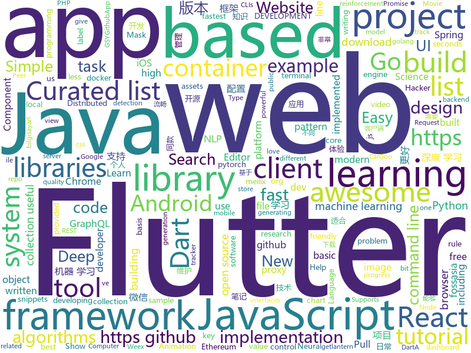

# 2018-10-29
See what the GitHub community is most excited about today.

## python
* [TensorFlow-Course](https://github.com/open-source-for-science/TensorFlow-Course)(**133 stars today**): Simple and ready-to-use tutorials for TensorFlow
* [maskrcnn-benchmark](https://github.com/facebookresearch/maskrcnn-benchmark)(**100 stars today**): Fast, modular reference implementation of Instance Segmentation and Object Detection algorithms in PyTorch.
* [DeepCreamPy](https://github.com/deeppomf/DeepCreamPy)(**82 stars today**): Decensoring Hentai with Deep Neural Networks
* [transparent_latent_gan](https://github.com/SummitKwan/transparent_latent_gan)(**70 stars today**): Use supervised learning to illuminate the latent space of GAN for controlled generation and edit
* [Python](https://github.com/TheAlgorithms/Python)(**62 stars today**): All Algorithms implemented in Python
* [models](https://github.com/tensorflow/models)(**36 stars today**): Models and examples built with TensorFlow
* [responder](https://github.com/kennethreitz/responder)(**47 stars today**): a familiar HTTP Service Framework for Python
* [WebMap](https://github.com/Rev3rseSecurity/WebMap)(**39 stars today**): Nmap Web Dashboard and Reporting
* [public-apis](https://github.com/toddmotto/public-apis)(**37 stars today**): A collective list of public JSON APIs for use in web development.
* [system-design-primer](https://github.com/donnemartin/system-design-primer)(**34 stars today**): Learn how to design large-scale systems. Prep for the system design interview. Includes Anki flashcards.
* [CODE2RACE](https://github.com/hackerearthclub/CODE2RACE)(**9 stars today**): Solve the problem.😊If you like ❤ give us a star⭐.
* [keras](https://github.com/keras-team/keras)(**27 stars today**): Deep Learning for humans
* [home-assistant](https://github.com/home-assistant/home-assistant)(**27 stars today**): 🏡Open source home automation that puts local control and privacy first
* [youtube-dl](https://github.com/rg3/youtube-dl)(**31 stars today**): Command-line program to download videos from YouTube.com and other video sites
* [vunet](https://github.com/CompVis/vunet)(**31 stars today**): A generative model conditioned on shape and appearance.
* [awesome-python](https://github.com/vinta/awesome-python)(**31 stars today**): A curated list of awesome Python frameworks, libraries, software and resources
* [Algorithm_Interview_Notes-Chinese](https://github.com/imhuay/Algorithm_Interview_Notes-Chinese)(**27 stars today**): 2018/2019/校招/春招/秋招/算法/机器学习(Machine Learning)/深度学习(Deep Learning)/自然语言处理(NLP)/C/C++/Python/面试笔记
* [manim](https://github.com/3b1b/manim)(**26 stars today**): Animation engine for explanatory math videos
* [modin](https://github.com/modin-project/modin)(**26 stars today**): Modin: Speed up your Pandas workflows by changing a single line of code
* [python-fire](https://github.com/google/python-fire)(**25 stars today**): Python Fire is a library for automatically generating command line interfaces (CLIs) from absolutely any Python object.
* [gym](https://github.com/openai/gym)(**20 stars today**): A toolkit for developing and comparing reinforcement learning algorithms.
* [HandwritingRecognitionSystem](https://github.com/0x454447415244/HandwritingRecognitionSystem)(**20 stars today**): Handwriting Recognition System based on a deep Convolutional Recurrent Neural Network architecture
* [scikit-learn](https://github.com/scikit-learn/scikit-learn)(**19 stars today**): scikit-learn: machine learning in Python
* [Detectron](https://github.com/facebookresearch/Detectron)(**19 stars today**): FAIR's research platform for object detection research, implementing popular algorithms like Mask R-CNN and RetinaNet.
* [goruntu-isleme-kilavuzu](https://github.com/mesutpiskin/goruntu-isleme-kilavuzu)(**21 stars today**): Bu eğitim, bilgisayarlı görünün temellerini anlayabilmenizi ve OpenCV ile bilgisayarlı görü uygulamaları geliştirebilmenizi amaçlamaktadır. Python, Java, JavaScript, C# ve C++ örnekleri ile desteklenmektedir.

## java
* [proxyee-down](https://github.com/proxyee-down-org/proxyee-down)(**47 stars today**): http下载工具，基于http代理，支持多连接分块下载
* [JavaGuide](https://github.com/Snailclimb/JavaGuide)(**40 stars today**): 【Java学习+面试指南】 一份涵盖大部分Java程序员所需要掌握的核心知识。
* [java-design-patterns](https://github.com/iluwatar/java-design-patterns)(**35 stars today**): Design patterns implemented in Java
* [spring-boot](https://github.com/spring-projects/spring-boot)(**24 stars today**): Spring Boot
* [tutorials](https://github.com/eugenp/tutorials)(**14 stars today**): The "REST With Spring" Course:
* [Java](https://github.com/TheAlgorithms/Java)(**18 stars today**): All Algorithms implemented in Java
* [symphony](https://github.com/b3log/symphony)(**20 stars today**): 🎶一款用 Java 实现的现代化社区（论坛/BBS/社交网络/博客）平台。https://hacpai.com
* [elasticsearch](https://github.com/elastic/elasticsearch)(**17 stars today**): Open Source, Distributed, RESTful Search Engine
* [android-gpuimage](https://github.com/cats-oss/android-gpuimage)(**18 stars today**): Android filters based on OpenGL (idea from GPUImage for iOS)
* [weixin-java-tools](https://github.com/Wechat-Group/weixin-java-tools)(**16 stars today**): 全能微信Java开发工具包，支持包括微信支付、开放平台、小程序、企业微信/企业号和公众号等的开发
* [apollo](https://github.com/ctripcorp/apollo)(**14 stars today**): Apollo（阿波罗）是携程框架部门研发的分布式配置中心，能够集中化管理应用不同环境、不同集群的配置，配置修改后能够实时推送到应用端，并且具备规范的权限、流程治理等特性，适用于微服务配置管理场景。
* [uid-generator](https://github.com/baidu/uid-generator)(**15 stars today**): UniqueID generator
* [incubator-dubbo](https://github.com/apache/incubator-dubbo)(**12 stars today**): Apache Dubbo (incubating) is a high-performance, java based, open source RPC framework.
* [spring-framework](https://github.com/spring-projects/spring-framework)(**10 stars today**): Spring Framework
* [Magisk](https://github.com/topjohnwu/Magisk)(**13 stars today**): A Magic Mask to Alter Android System Systemless-ly
* [yacy_search_server](https://github.com/yacy/yacy_search_server)(**13 stars today**): Distributed Peer-to-Peer Web Search Engine and Intranet Search Appliance
* [phimpme-android](https://github.com/fossasia/phimpme-android)(**12 stars today**): Phimp.me - Photo Image Editor App https://phimp.me
* [jib](https://github.com/GoogleContainerTools/jib)(**10 stars today**): ⛵️Build container images for your Java applications.
* [pantheon](https://github.com/PegaSysEng/pantheon)(**11 stars today**): An enterprise-grade Java-based, Apache 2.0 licensed Ethereum client
* [okhttp](https://github.com/square/okhttp)(**11 stars today**): An HTTP+HTTP/2 client for Android and Java applications.
* [SpringCloudLearning](https://github.com/forezp/SpringCloudLearning)(**10 stars today**): 《史上最简单的Spring Cloud教程源码》
* [MPAndroidChart](https://github.com/PhilJay/MPAndroidChart)(**10 stars today**): A powerful🚀Android chart view / graph view library, supporting line- bar- pie- radar- bubble- and candlestick charts as well as scaling, dragging and animations.
* [retrofit](https://github.com/square/retrofit)(**10 stars today**): Type-safe HTTP client for Android and Java by Square, Inc.
* [zxing](https://github.com/zxing/zxing)(**10 stars today**): ZXing ("Zebra Crossing") barcode scanning library for Java, Android
* [guava](https://github.com/google/guava)(**9 stars today**): Google core libraries for Java

## unknown
* [DeepLearning-500-questions](https://github.com/scutan90/DeepLearning-500-questions)(**570 stars today**): 深度学习500问，以问答形式对常用的概率知识、线性代数、机器学习、深度学习、计算机视觉等热点问题进行阐述，以帮助自己及有需要的读者。 全书分为15个章节，近20万字。由于水平有限，书中不妥之处恳请广大读者批评指正。 未完待续............ 如有意合作，联系scutjy2015@163.com 版权所有，违权必究 Tan 2018.06
* [A-to-Z-Resources-for-Students](https://github.com/dipakkr/A-to-Z-Resources-for-Students)(**227 stars today**): Curated list of resources for college students Show your❤️by giving a⭐️
* [Awesome-pytorch-list](https://github.com/bharathgs/Awesome-pytorch-list)(**168 stars today**): A comprehensive list of pytorch related content on github,such as different models,implementations,helper libraries,tutorials etc.
* [first-contributions](https://github.com/firstcontributions/first-contributions)(**48 stars today**): 🚀✨Help beginners to contribute to open source projects
* [Make-a-Pull-Request](https://github.com/rishabh-bansal/Make-a-Pull-Request)(**32 stars today**): Make a Pull Request
* [awesome-react-hooks](https://github.com/rehooks/awesome-react-hooks)(**100 stars today**): Awesome React Hooks
* [what-i-learned-from-porting-to-freebsd](https://github.com/shlomif/what-i-learned-from-porting-to-freebsd)(**59 stars today**): What I Learned from porting my projects to FreeBSD
* [awesome](https://github.com/sindresorhus/awesome)(**53 stars today**): 😎Curated list of awesome lists
* [bert](https://github.com/google-research/bert)(**58 stars today**): 
* [free-programming-books](https://github.com/EbookFoundation/free-programming-books)(**49 stars today**): 📚Freely available programming books
* [developer-roadmap](https://github.com/kamranahmedse/developer-roadmap)(**43 stars today**): Roadmap to becoming a web developer in 2018
* [git-flight-rules](https://github.com/k88hudson/git-flight-rules)(**45 stars today**): Flight rules for git
* [gitignore](https://github.com/github/gitignore)(**32 stars today**): A collection of useful .gitignore templates
* [clash_for_windows_pkg](https://github.com/Fndroid/clash_for_windows_pkg)(**38 stars today**): A Windows GUI for Clash
* [You-Dont-Know-JS](https://github.com/getify/You-Dont-Know-JS)(**34 stars today**): A book series on JavaScript. @YDKJS on twitter.
* [CS-Notes](https://github.com/CyC2018/CS-Notes)(**33 stars today**): 📚Computer Science Learning Notes
* [coding-interview-university](https://github.com/jwasham/coding-interview-university)(**24 stars today**): A complete computer science study plan to become a software engineer.
* [rfcs](https://github.com/reactjs/rfcs)(**25 stars today**): RFCs for changes to React
* [weekly](https://github.com/ruanyf/weekly)(**24 stars today**): 技术分享周刊，每周五发布
* [project-based-learning](https://github.com/tuvtran/project-based-learning)(**19 stars today**): Curated list of project-based tutorials
* [PHP-Audit-Labs](https://github.com/hongriSec/PHP-Audit-Labs)(**20 stars today**): 一个关于PHP的代码审计项目
* [ToolsOfTheTrade](https://github.com/cjbarber/ToolsOfTheTrade)(**21 stars today**): Tools of The Trade, from Hacker News.
* [Awesome-Hacking](https://github.com/Hack-with-Github/Awesome-Hacking)(**18 stars today**): A collection of various awesome lists for hackers, pentesters and security researchers
* [awesome-vue](https://github.com/vuejs/awesome-vue)(**19 stars today**): 🎉A curated list of awesome things related to Vue.js
* [awesome-public-datasets](https://github.com/awesomedata/awesome-public-datasets)(**17 stars today**): A topic-centric list of high-quality open datasets in public domains. New PR ☛☛☛

## javascript
* [the-platform](https://github.com/palmerhq/the-platform)(**334 stars today**): Web. Components.😂
* [33-js-concepts](https://github.com/leonardomso/33-js-concepts)(**261 stars today**): 📜33 concepts every JavaScript developer should know.
* [freeCodeCamp](https://github.com/freeCodeCamp/freeCodeCamp)(****): The https://freeCodeCamp.org open source codebase and curriculum. Learn to code for free together with millions of people.
* [33-js-concepts](https://github.com/stephentian/33-js-concepts)(**107 stars today**): 📜每个 JavaScript 工程师都应懂的33个概念 @leonardomso
* [react-hanger](https://github.com/kitze/react-hanger)(**99 stars today**): A small collection of useful hooks for React 16.7
* [texme](https://github.com/susam/texme)(**66 stars today**): Self-rendering Markdown + LaTeX documents
* [vue](https://github.com/vuejs/vue)(**61 stars today**): 🖖A progressive, incrementally-adoptable JavaScript framework for building UI on the web.
* [react](https://github.com/facebook/react)(**58 stars today**): A declarative, efficient, and flexible JavaScript library for building user interfaces.
* [30-seconds-of-code](https://github.com/30-seconds/30-seconds-of-code)(**55 stars today**): Curated collection of useful JavaScript snippets that you can understand in 30 seconds or less.
* [preload-it](https://github.com/andreupifarre/preload-it)(**55 stars today**): A tiny 1kb JavaScript library for preloading assets on the browser via XHR2. It provides the ability to load assets of different file types and composite progress events.
* [create-react-app](https://github.com/facebook/create-react-app)(**43 stars today**): Set up a modern web app by running one command.
* [javascript](https://github.com/airbnb/javascript)(**42 stars today**): JavaScript Style Guide
* [irondb](https://github.com/gruns/irondb)(**42 stars today**): 🔩A relentless key-value store for the browser.
* [hooks-test](https://github.com/jacobp100/hooks-test)(**41 stars today**): 
* [percollate](https://github.com/danburzo/percollate)(**38 stars today**): 🌐→📖A command-line tool to turn web pages into beautifully formatted PDFs
* [gatsby](https://github.com/gatsbyjs/gatsby)(**29 stars today**): Build blazing fast, modern apps and websites with React
* [omi](https://github.com/Tencent/omi)(**34 stars today**): Next generation web framework in 4kb JavaScript (Web Components + JSX + Proxy + Store + Path Updating)
* [fastscan](https://github.com/pyloque/fastscan)(**32 stars today**): quickly text search by ahocorasick algorithm
* [node](https://github.com/nodejs/node)(**24 stars today**): Node.js JavaScript runtime✨🐢🚀✨
* [next.js](https://github.com/zeit/next.js)(**27 stars today**): The React Framework
* [docker.github.io](https://github.com/docker/docker.github.io)(**27 stars today**): Source repo for Docker's Documentation
* [jsonmc](https://github.com/jsonmc/jsonmc)(**6 stars today**): JSON Movie Collection
* [Teamcat](https://github.com/TeamcatCorp/Teamcat)(**27 stars today**): Teamcat软件工程协作工具
* [graphpack](https://github.com/glennreyes/graphpack)(**27 stars today**): ☄️A minimalistic zero-config GraphQL server.
* [axios](https://github.com/axios/axios)(**27 stars today**): Promise based HTTP client for the browser and node.js

## html
* [vue-hooks](https://github.com/yyx990803/vue-hooks)(**130 stars today**): Experimental React hooks implementation in Vue
* [async-javascript-cheatsheet](https://github.com/frontarm/async-javascript-cheatsheet)(**35 stars today**): Cheatsheet for promises and async/await
* [hacktoberfest](https://github.com/lingonsaft/hacktoberfest)(**7 stars today**): Hacktoberfest 2018. Don't forget to spread love and if you like give us a⭐️
* [NLP-progress](https://github.com/sebastianruder/NLP-progress)(**20 stars today**): Repository to track the progress in Natural Language Processing (NLP), including the datasets and the current state-of-the-art for the most common NLP tasks.
* [DeepLearningProject](https://github.com/Spandan-Madan/DeepLearningProject)(**18 stars today**): An in-depth machine learning tutorial introducing readers to a whole machine learning pipeline from scratch.
* [gci18.fossasia.org](https://github.com/fossasia/gci18.fossasia.org)(**12 stars today**): FOSSASIA Google Code-In Website 2018 https://gci18.fossasia.org
* [30-seconds-of-css](https://github.com/30-seconds/30-seconds-of-css)(**15 stars today**): A curated collection of useful CSS snippets you can understand in 30 seconds or less.
* [solid](https://github.com/solid/solid)(**14 stars today**): Solid - Re-decentralizing the web (project directory)
* [Spoon-Knife](https://github.com/octocat/Spoon-Knife)(****): This repo is for demonstration purposes only.
* [Coursera-ML-AndrewNg-Notes](https://github.com/fengdu78/Coursera-ML-AndrewNg-Notes)(**11 stars today**): 吴恩达老师的机器学习课程个人笔记
* [react-redux](https://github.com/reduxjs/react-redux)(**13 stars today**): Official React bindings for Redux
* [hello](https://github.com/nat/hello)(**13 stars today**): 👋Hello, GitHub
* [2019.fossasia.org](https://github.com/fossasia/2019.fossasia.org)(**11 stars today**): FOSSASIA Summit 2019 https://2019.fossasia.org
* [mastering-modular-javascript](https://github.com/mjavascript/mastering-modular-javascript)(**11 stars today**): 📦Module thinking, principles, design patterns and best practices.
* [baselines](https://github.com/openai/baselines)(**9 stars today**): OpenAI Baselines: high-quality implementations of reinforcement learning algorithms
* [AdminLTE](https://github.com/almasaeed2010/AdminLTE)(**9 stars today**): AdminLTE - Free Premium Admin control Panel Theme Based On Bootstrap 3.x
* [Hacktoberfest-Sign-In](https://github.com/Nguyen17/Hacktoberfest-Sign-In)(****): Beginner friendly. Easy Pull Request! .
* [meilix-generator](https://github.com/fossasia/meilix-generator)(**9 stars today**): WebApp for generating a custom ISO image based on Meilix http://meilix.org
* [JavaScript30](https://github.com/wesbos/JavaScript30)(**5 stars today**): 30 Day Vanilla JS Challenge
* [pslab.io](https://github.com/fossasia/pslab.io)(**9 stars today**): Pocket Science Lab Website http://pslab.io
* [speedtest](https://github.com/adolfintel/speedtest)(**8 stars today**): Self-hosted HTML5 Speedtest. Easy setup, examples, configurable, responsive and mobile friendly. Supports PHP, Node, and more.
* [portainer](https://github.com/portainer/portainer)(**8 stars today**): Simple management UI for Docker
* [My-Learning-Tracker-first-ten-months](https://github.com/Syknapse/My-Learning-Tracker-first-ten-months)(**7 stars today**): A copy of my learning tracker frozen in time at the 10 month mark. It shows my learning process from the beginning of my front end journey, up to the moment I got my first job. Full tracker is at: https://github.com/Syknapse/My-Learning-Tracker
* [rust-by-example](https://github.com/rust-lang/rust-by-example)(**7 stars today**): Learn Rust with examples (Live code editor included)
* [bulma-templates](https://github.com/dansup/bulma-templates)(**6 stars today**): free flexbox templates built with the bulma css framework

## dart
* [flutter](https://github.com/flutter/flutter)(**36 stars today**): Flutter makes it easy and fast to build beautiful mobile apps.
* [WhatTodo](https://github.com/burhanrashid52/WhatTodo)(**23 stars today**): A Simple Todo app design in Flutter to keep track of your task on daily basis. Its build on BLoC Pattern. You can add a project, labels, and due-date to your task also you can sort your task on the basis of project, label, and dates
* [awesome-flutter](https://github.com/Solido/awesome-flutter)(**15 stars today**): An awesome list that curates the best Flutter libraries, tools, tutorials, articles and more.
* [sdk](https://github.com/dart-lang/sdk)(**5 stars today**): The Dart SDK, including the VM, dart2js, core libraries, and more.
* [flutter-examples](https://github.com/nisrulz/flutter-examples)(**5 stars today**): [Examples] Simple basic isolated apps, for budding flutter devs.
* [newsbuzz](https://github.com/theankurkedia/newsbuzz)(****): News App created in Flutter using News API for fetching realtime data and Firebase as the backend and authenticator.
* [flutter_pulltorefresh](https://github.com/peng8350/flutter_pulltorefresh)(****): a widget provided to the flutter scroll component drop-down refresh and pull up load.
* [angular](https://github.com/dart-lang/angular)(****): Fast and productive web framework provided by Dart
* [build](https://github.com/dart-lang/build)(****): A build system for Dart
* [test](https://github.com/dart-lang/test)(****): A library for writing unit tests in Dart.
* [intl](https://github.com/dart-lang/intl)(****): Internationalization and localization support
* [website](https://github.com/flutter/website)(****): Flutter web site
* [graphql-flutter](https://github.com/zino-app/graphql-flutter)(****): A GraphQL client for Flutter, bringing all the features from a modern GraphQL client to one easy to use package.
* [chromedeveditor](https://github.com/googlearchive/chromedeveditor)(****): Chrome Dev Editor is a developer tool for building apps on the Chrome platform - Chrome Apps and Web Apps, in JavaScript or Dart. (NO LONGER IN ACTIVE DEVELOPMENT)
* [plugins](https://github.com/flutter/plugins)(****): Plugins for Flutter, including FlutterFire, maintained by the Flutter team
* [GSYGithubAppFlutter](https://github.com/CarGuo/GSYGithubAppFlutter)(****): 超完整的Flutter项目，功能丰富，适合学习和日常使用。GSYGithubApp系列的优势：我们目前已经拥有Flutter、Weex、ReactNative三个版本。 功能齐全，项目框架内技术涉及面广，完成度高，持续维护，配套文章，适合全面学习，跨框架对比参考。跨平台的开源Github客户端App，更好的体验，更丰富的功能，旨在更好的日常管理和维护个人Github，提供更好更方便的驾车体验～～Σ(￣。￣ﾉ)ﾉ。同款Weex版本 ： https://github.com/CarGuo/GSYGithubAppWeex 、同款React Native版本 ： https://github.com/CarGuo/GSYGithubApp
* [flutter-osc](https://github.com/yubo725/flutter-osc)(****): 基于Google Flutter的开源中国客户端，支持Android和iOS。
* [FlutterExampleApps](https://github.com/iampawan/FlutterExampleApps)(****): [Example APPS] Basic Flutter apps, for flutter devs.
* [Flutter-UI-Kit](https://github.com/iampawan/Flutter-UI-Kit)(****): Flutter app for collection of UI in a UIKit
* [flutter_architecture_samples](https://github.com/brianegan/flutter_architecture_samples)(****): TodoMVC for Flutter
* [Flutter-learning](https://github.com/AweiLoveAndroid/Flutter-learning)(****): 🔥👍🌟⭐️⭐️⭐️Flutter install&settings,Flutter problems when developing,Flutter sample codes& templates,Flutter projects,Dart languages sample codes
* [inKino](https://github.com/roughike/inKino)(****): inKino - A cross platform movie and showtime browser for Finnkino cinemas, made with Flutter.
* [dio](https://github.com/flutterchina/dio)(****): A powerful Http client for Dart, which supports Interceptors, FormData, Request Cancellation, File Downloading, Timeout etc.
* [hauberk](https://github.com/munificent/hauberk)(****): A web-based roguelike written in Dart.
* [zhihu-flutter](https://github.com/HackSoul/zhihu-flutter)(****): Flutter 高仿知乎 UI，非常漂亮，也非常流畅，flutter build apk 或 flutter build ios 之后更流畅

## go
* [dive](https://github.com/wagoodman/dive)(**215 stars today**): A tool for exploring each layer in a docker image
* [up](https://github.com/akavel/up)(**212 stars today**): Ultimate Plumber is a tool for writing Linux pipes with instant live preview
* [gotop](https://github.com/cjbassi/gotop)(**173 stars today**): A terminal based graphical activity monitor inspired by gtop and vtop
* [soar](https://github.com/XiaoMi/soar)(**75 stars today**): SQL Optimizer And Rewriter
* [aminal](https://github.com/liamg/aminal)(**66 stars today**): Golang terminal emulator from scratch
* [gobasic](https://github.com/skx/gobasic)(**46 stars today**): A BASIC interpreter written in golang.
* [godown](https://github.com/namreg/godown)(**43 stars today**): Distributed, fault-tolerant key-value storage written in go.
* [clash](https://github.com/Dreamacro/clash)(**42 stars today**): A rule based proxy in Go.
* [kubernetes](https://github.com/kubernetes/kubernetes)(**32 stars today**): Production-Grade Container Scheduling and Management
* [stellar](https://github.com/ehazlett/stellar)(**31 stars today**): Simplified Container System
* [resty](https://github.com/go-resty/resty)(**30 stars today**): Simple HTTP and REST client library for Go
* [go](https://github.com/golang/go)(**25 stars today**): The Go programming language
* [transfer.sh](https://github.com/dutchcoders/transfer.sh)(**22 stars today**): Easy and fast file sharing from the command-line.
* [naftis](https://github.com/XiaoMi/naftis)(**25 stars today**): An awesome dashboard for Istio built with love.
* [hugo](https://github.com/gohugoio/hugo)(**24 stars today**): The world’s fastest framework for building websites.
* [go-containerregistry](https://github.com/google/go-containerregistry)(**25 stars today**): Go library and CLIs for working with container registries
* [awesome-go](https://github.com/avelino/awesome-go)(**22 stars today**): A curated list of awesome Go frameworks, libraries and software
* [frp](https://github.com/fatedier/frp)(**20 stars today**): A fast reverse proxy to help you expose a local server behind a NAT or firewall to the internet.
* [iris](https://github.com/kataras/iris)(**20 stars today**): The fastest backend community-driven web framework on (THIS) Earth. HTTP/2, MVC and more. Can your favourite web framework do that?👉http://bit.ly/iriscandothat1 or even http://bit.ly/iriscandothat2
* [build-web-application-with-golang](https://github.com/astaxie/build-web-application-with-golang)(**16 stars today**): A golang ebook intro how to build a web with golang
* [go-ethereum](https://github.com/ethereum/go-ethereum)(**16 stars today**): Official Go implementation of the Ethereum protocol
* [illustrated-tls](https://github.com/syncsynchalt/illustrated-tls)(**18 stars today**): The Illustrated TLS Connection: Every byte explained
* [moby](https://github.com/moby/moby)(**16 stars today**): Moby Project - a collaborative project for the container ecosystem to assemble container-based systems
* [fzf](https://github.com/junegunn/fzf)(**17 stars today**): 🌸A command-line fuzzy finder
* [lantern](https://github.com/getlantern/lantern)(**14 stars today**): 🔴蓝灯最新版本下载 https://github.com/getlantern/download🔴Lantern Latest Download https://github.com/getlantern/download🔴

## WordCloud

