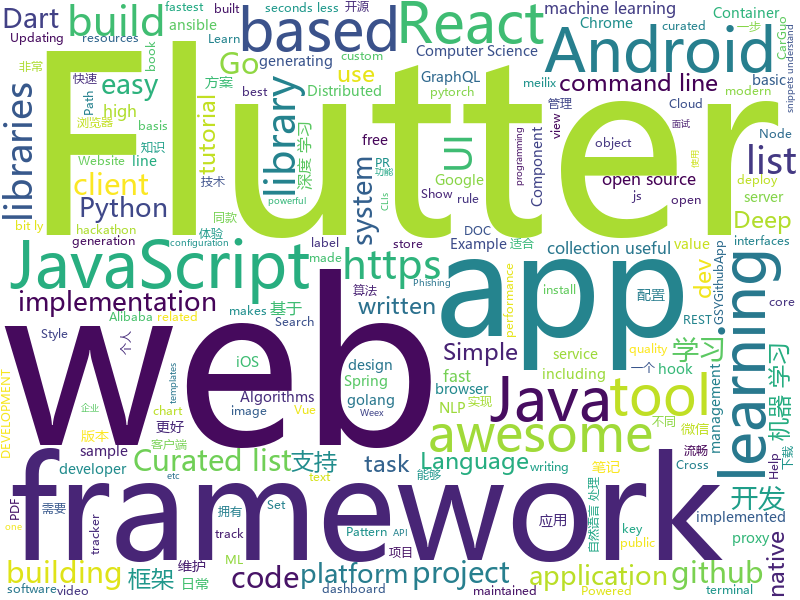

# 2018-10-30
See what the GitHub community is most excited about today.

## python
* [DeepCreamPy](https://github.com/deeppomf/DeepCreamPy)(**755 stars today**): Decensoring Hentai with Deep Neural Networks
* [graph-cli](https://github.com/mcastorina/graph-cli)(**267 stars today**): Flexible command line tool to create graphs from CSV data
* [maskrcnn-benchmark](https://github.com/facebookresearch/maskrcnn-benchmark)(**164 stars today**): Fast, modular reference implementation of Instance Segmentation and Object Detection algorithms in PyTorch.
* [TensorFlow-Course](https://github.com/open-source-for-science/TensorFlow-Course)(**159 stars today**): Simple and ready-to-use tutorials for TensorFlow
* [vergeml](https://github.com/vergeml/vergeml)(**158 stars today**): Machine Learning Environment - alpha version
* [Python](https://github.com/TheAlgorithms/Python)(**85 stars today**): All Algorithms implemented in Python
* [WebMap](https://github.com/Rev3rseSecurity/WebMap)(**95 stars today**): Nmap Web Dashboard and Reporting
* [models](https://github.com/tensorflow/models)(**58 stars today**): Models and examples built with TensorFlow
* [transparent_latent_gan](https://github.com/SummitKwan/transparent_latent_gan)(**66 stars today**): Use supervised learning to illuminate the latent space of GAN for controlled generation and edit
* [system-design-primer](https://github.com/donnemartin/system-design-primer)(**62 stars today**): Learn how to design large-scale systems. Prep for the system design interview. Includes Anki flashcards.
* [python-fire](https://github.com/google/python-fire)(**60 stars today**): Python Fire is a library for automatically generating command line interfaces (CLIs) from absolutely any Python object.
* [modin](https://github.com/modin-project/modin)(**56 stars today**): Modin: Speed up your Pandas workflows by changing a single line of code
* [poetry](https://github.com/sdispater/poetry)(**52 stars today**): Python dependency management and packaging made easy.
* [responder](https://github.com/kennethreitz/responder)(**51 stars today**): a familiar HTTP Service Framework for Python
* [keras](https://github.com/keras-team/keras)(**38 stars today**): Deep Learning for humans
* [awesome-algorithm](https://github.com/apachecn/awesome-algorithm)(**44 stars today**): Leetcode 题解 (跟随思路一步一步撸出代码) 及经典算法实现
* [awesome-python](https://github.com/vinta/awesome-python)(**41 stars today**): A curated list of awesome Python frameworks, libraries, software and resources
* [Algorithm_Interview_Notes-Chinese](https://github.com/imhuay/Algorithm_Interview_Notes-Chinese)(**36 stars today**): 2018/2019/校招/春招/秋招/算法/机器学习(Machine Learning)/深度学习(Deep Learning)/自然语言处理(NLP)/C/C++/Python/面试笔记
* [scikit-learn](https://github.com/scikit-learn/scikit-learn)(**37 stars today**): scikit-learn: machine learning in Python
* [public-apis](https://github.com/toddmotto/public-apis)(**37 stars today**): A collective list of public JSON APIs for use in web development.
* [bert_language_understanding](https://github.com/brightmart/bert_language_understanding)(**36 stars today**): Pre-training of Deep Bidirectional Transformers for Language Understanding
* [AiLearning](https://github.com/apachecn/AiLearning)(**31 stars today**): AiLearning: 机器学习 - MachineLearning - ML、深度学习 - DeepLearning - DL、自然语言处理 NLP
* [youtube-dl](https://github.com/rg3/youtube-dl)(**34 stars today**): Command-line program to download videos from YouTube.com and other video sites
* [django](https://github.com/django/django)(**28 stars today**): The Web framework for perfectionists with deadlines.
* [ansible](https://github.com/ansible/ansible)(**24 stars today**): Ansible is a radically simple IT automation platform that makes your applications and systems easier to deploy. Avoid writing scripts or custom code to deploy and update your applications — automate in a language that approaches plain English, using SSH, with no agents to install on remote systems. https://docs.ansible.com/ansible/

## java
* [AndroidAutoSize](https://github.com/JessYanCoding/AndroidAutoSize)(**177 stars today**): 🔥A low-cost Android screen adaptation solution (今日头条屏幕适配方案终极版，一个极低成本的 Android 屏幕适配方案).
* [JavaGuide](https://github.com/Snailclimb/JavaGuide)(**91 stars today**): 【Java学习+面试指南】 一份涵盖大部分Java程序员所需要掌握的核心知识。
* [proxyee-down](https://github.com/proxyee-down-org/proxyee-down)(**66 stars today**): http下载工具，基于http代理，支持多连接分块下载
* [SpringCloudLearning](https://github.com/forezp/SpringCloudLearning)(**48 stars today**): 《史上最简单的Spring Cloud教程源码》
* [spring-boot](https://github.com/spring-projects/spring-boot)(**47 stars today**): Spring Boot
* [java-design-patterns](https://github.com/iluwatar/java-design-patterns)(**46 stars today**): Design patterns implemented in Java
* [symphony](https://github.com/b3log/symphony)(**52 stars today**): 🎶一款用 Java 实现的现代化社区（论坛/BBS/社交网络/博客）平台。https://hacpai.com
* [Phantom](https://github.com/ManbangGroup/Phantom)(**50 stars today**): Phantom — 唯一零 Hook 稳定占坑类 Android 热更新插件化方案
* [android-gpuimage](https://github.com/cats-oss/android-gpuimage)(**49 stars today**): Android filters based on OpenGL (idea from GPUImage for iOS)
* [elasticsearch](https://github.com/elastic/elasticsearch)(**39 stars today**): Open Source, Distributed, RESTful Search Engine
* [Java](https://github.com/TheAlgorithms/Java)(**33 stars today**): All Algorithms implemented in Java
* [tutorials](https://github.com/eugenp/tutorials)(**24 stars today**): The "REST With Spring" Course:
* [apollo](https://github.com/ctripcorp/apollo)(**32 stars today**): Apollo（阿波罗）是携程框架部门研发的分布式配置中心，能够集中化管理应用不同环境、不同集群的配置，配置修改后能够实时推送到应用端，并且具备规范的权限、流程治理等特性，适用于微服务配置管理场景。
* [arthas](https://github.com/alibaba/arthas)(**33 stars today**): Alibaba Java Diagnostic Tool Arthas/Alibaba Java诊断利器Arthas
* [spring-framework](https://github.com/spring-projects/spring-framework)(**28 stars today**): Spring Framework
* [weixin-java-tools](https://github.com/Wechat-Group/weixin-java-tools)(**34 stars today**): 全能微信Java开发工具包，支持包括微信支付、开放平台、小程序、企业微信/企业号和公众号等的开发
* [SuperWeb](https://github.com/Victory-Over/SuperWeb)(**29 stars today**): Android基于腾讯X5内核的WebView(超级浏览器)，拥有文件上传、下载、浏览（支持PDF/PPT/DOC/EXCEL/TXT格式）、Android与JS的交互、视频播放、自定义进度条、下拉回弹等功能
* [MyPerf4J](https://github.com/ThinkpadNC5/MyPerf4J)(**30 stars today**): High performance Java APM. Powered by ASM.
* [guava](https://github.com/google/guava)(**26 stars today**): Google core libraries for Java
* [MVVMHabit](https://github.com/goldze/MVVMHabit)(**28 stars today**): 🚀基于谷歌最新AAC架构，MVVM设计模式的一套快速开发库，整合Okhttp+RxJava+Retrofit+Glide等主流模块，满足日常开发需求。使用该框架可以快速开发一个健壮、易维护的Android应用。
* [incubator-dubbo](https://github.com/apache/incubator-dubbo)(**22 stars today**): Apache Dubbo (incubating) is a high-performance, java based, open source RPC framework.
* [MPAndroidChart](https://github.com/PhilJay/MPAndroidChart)(**28 stars today**): A powerful🚀Android chart view / graph view library, supporting line- bar- pie- radar- bubble- and candlestick charts as well as scaling, dragging and animations.
* [AndroidUtilCode](https://github.com/Blankj/AndroidUtilCode)(**25 stars today**): 🔥Android developers should collect the following utils(updating).
* [uid-generator](https://github.com/baidu/uid-generator)(**24 stars today**): UniqueID generator
* [nacos](https://github.com/alibaba/nacos)(**23 stars today**): an easy-to-use dynamic service discovery, configuration and service management platform for building cloud native applications

## unknown
* [DeepLearning-500-questions](https://github.com/scutan90/DeepLearning-500-questions)(**1,037 stars today**): 深度学习500问，以问答形式对常用的概率知识、线性代数、机器学习、深度学习、计算机视觉等热点问题进行阐述，以帮助自己及有需要的读者。 全书分为15个章节，近20万字。由于水平有限，书中不妥之处恳请广大读者批评指正。 未完待续............ 如有意合作，联系scutjy2015@163.com 版权所有，违权必究 Tan 2018.06
* [A-to-Z-Resources-for-Students](https://github.com/dipakkr/A-to-Z-Resources-for-Students)(**552 stars today**): Curated list of resources for college students Show your❤️by giving a⭐️
* [React-Fiber-Architecture](https://github.com/SaeedMalikx/React-Fiber-Architecture)(**282 stars today**): Understanding the structure of React Fiber( walk through and pseudo-code)
* [awesome-react-hooks](https://github.com/rehooks/awesome-react-hooks)(**204 stars today**): Awesome React Hooks
* [Awesome-pytorch-list](https://github.com/bharathgs/Awesome-pytorch-list)(**160 stars today**): A comprehensive list of pytorch related content on github,such as different models,implementations,helper libraries,tutorials etc.
* [first-contributions](https://github.com/firstcontributions/first-contributions)(**51 stars today**): 🚀✨Help beginners to contribute to open source projects
* [bert](https://github.com/google-research/bert)(**110 stars today**): 
* [Make-a-Pull-Request](https://github.com/rishabh-bansal/Make-a-Pull-Request)(**19 stars today**): Make a Pull Request
* [git-flight-rules](https://github.com/k88hudson/git-flight-rules)(**103 stars today**): Flight rules for git
* [You-Dont-Know-JS](https://github.com/getify/You-Dont-Know-JS)(**70 stars today**): A book series on JavaScript. @YDKJS on twitter.
* [CS-Notes](https://github.com/CyC2018/CS-Notes)(**62 stars today**): 📚Computer Science Learning Notes
* [gitignore](https://github.com/github/gitignore)(**53 stars today**): A collection of useful .gitignore templates
* [awesome](https://github.com/sindresorhus/awesome)(**65 stars today**): 😎Curated list of awesome lists
* [free-programming-books](https://github.com/EbookFoundation/free-programming-books)(**47 stars today**): 📚Freely available programming books
* [awesome-vue](https://github.com/vuejs/awesome-vue)(**47 stars today**): 🎉A curated list of awesome things related to Vue.js
* [coding-interview-university](https://github.com/jwasham/coding-interview-university)(**36 stars today**): A complete computer science study plan to become a software engineer.
* [weekly](https://github.com/ruanyf/weekly)(**38 stars today**): 技术分享周刊，每周五发布
* [computer-science](https://github.com/ossu/computer-science)(**34 stars today**): 🎓Path to a free self-taught education in Computer Science!
* [project-based-learning](https://github.com/tuvtran/project-based-learning)(**30 stars today**): Curated list of project-based tutorials
* [DeepLearningAnimePapers](https://github.com/deeppomf/DeepLearningAnimePapers)(**33 stars today**): A list of papers and other resources on deep learning with anime style images.
* [awesome-public-datasets](https://github.com/awesomedata/awesome-public-datasets)(**31 stars today**): A topic-centric list of high-quality open datasets in public domains. New PR ☛☛☛
* [build-your-own-x](https://github.com/danistefanovic/build-your-own-x)(**30 stars today**): 🤓Build your own (insert technology here)
* [macOS_headers](https://github.com/w0lfschild/macOS_headers)(**30 stars today**): 📚A consistently maintained dump of most macOS Headers
* [malware-sample-library](https://github.com/mstfknn/malware-sample-library)(**26 stars today**): Malware sample library.
* [100-Days-Of-ML-Code](https://github.com/Avik-Jain/100-Days-Of-ML-Code)(**27 stars today**): 100 Days of ML Coding

## javascript
* [the-platform](https://github.com/palmerhq/the-platform)(**464 stars today**): Web. Components.😂
* [33-js-concepts](https://github.com/leonardomso/33-js-concepts)(**398 stars today**): 📜33 concepts every JavaScript developer should know.
* [33-js-concepts](https://github.com/stephentian/33-js-concepts)(**255 stars today**): 📜每个 JavaScript 工程师都应懂的33个概念 @leonardomso
* [irondb](https://github.com/gruns/irondb)(**190 stars today**): 🔩A relentless key-value store for the browser.
* [react-conf-2018](https://github.com/ryanflorence/react-conf-2018)(**159 stars today**): 
* [omi](https://github.com/Tencent/omi)(**153 stars today**): Next generation web framework in 4kb JavaScript (Web Components + JSX + Proxy + Store + Path Updating)
* [react-hanger](https://github.com/kitze/react-hanger)(**148 stars today**): A small collection of useful hooks for React 16.7
* [pennywise](https://github.com/kamranahmedse/pennywise)(**123 stars today**): Cross-platform application to open anything in a floating window
* [react](https://github.com/facebook/react)(**108 stars today**): A declarative, efficient, and flexible JavaScript library for building user interfaces.
* [freeCodeCamp](https://github.com/freeCodeCamp/freeCodeCamp)(****): The https://freeCodeCamp.org open source codebase and curriculum. Learn to code for free together with millions of people.
* [30-seconds-of-code](https://github.com/30-seconds/30-seconds-of-code)(**106 stars today**): Curated collection of useful JavaScript snippets that you can understand in 30 seconds or less.
* [telescope](https://github.com/laravel/telescope)(**106 stars today**): 
* [javascript](https://github.com/airbnb/javascript)(**105 stars today**): JavaScript Style Guide
* [project-guidelines](https://github.com/elsewhencode/project-guidelines)(**92 stars today**): A set of best practices for JavaScript projects
* [vue](https://github.com/vuejs/vue)(**78 stars today**): 🖖A progressive, incrementally-adoptable JavaScript framework for building UI on the web.
* [stateful-functions](https://github.com/rektide/stateful-functions)(**79 stars today**): 
* [create-react-app](https://github.com/facebook/create-react-app)(**63 stars today**): Set up a modern web app by running one command.
* [storybook](https://github.com/storybooks/storybook)(**63 stars today**): Interactive UI component dev & test: React, React Native, Vue, Angular, Ember
* [axios](https://github.com/axios/axios)(**60 stars today**): Promise based HTTP client for the browser and node.js
* [puppeteer](https://github.com/GoogleChrome/puppeteer)(**54 stars today**): Headless Chrome Node API
* [percollate](https://github.com/danburzo/percollate)(**56 stars today**): 🌐→📖A command-line tool to turn web pages into beautifully formatted PDFs
* [graphpack](https://github.com/glennreyes/graphpack)(**53 stars today**): ☄️A minimalistic zero-config GraphQL server.
* [react-native](https://github.com/facebook/react-native)(**49 stars today**): A framework for building native apps with React.
* [fastscan](https://github.com/pyloque/fastscan)(**50 stars today**): quickly text search by ahocorasick algorithm
* [node](https://github.com/nodejs/node)(**43 stars today**): Node.js JavaScript runtime✨🐢🚀✨

## html
* [vue-hooks](https://github.com/yyx990803/vue-hooks)(**159 stars today**): Experimental React hooks implementation in Vue
* [bitcoin-whitepaper-chinese-translation](https://github.com/xiaolai/bitcoin-whitepaper-chinese-translation)(**101 stars today**): 
* [30-seconds-of-css](https://github.com/30-seconds/30-seconds-of-css)(**68 stars today**): A curated collection of useful CSS snippets you can understand in 30 seconds or less.
* [BrowserSecurity](https://github.com/wnagzihxa1n/BrowserSecurity)(**57 stars today**): 我在学习浏览器安全过程中整理的漏洞分析笔记与相关的学习资料
* [async-javascript-cheatsheet](https://github.com/frontarm/async-javascript-cheatsheet)(**58 stars today**): Cheatsheet for promises and async/await
* [BlackEye-Python](https://github.com/M4cs/BlackEye-Python)(**21 stars today**): BlackEye Phishing Kit in Python w Serveo Subdomain Creation
* [Coursera-ML-AndrewNg-Notes](https://github.com/fengdu78/Coursera-ML-AndrewNg-Notes)(**18 stars today**): 吴恩达老师的机器学习课程个人笔记
* [fastText](https://github.com/facebookresearch/fastText)(**22 stars today**): Library for fast text representation and classification.
* [DeepLearningProject](https://github.com/Spandan-Madan/DeepLearningProject)(**22 stars today**): An in-depth machine learning tutorial introducing readers to a whole machine learning pipeline from scratch.
* [AdminLTE](https://github.com/almasaeed2010/AdminLTE)(**18 stars today**): AdminLTE - Free Premium Admin control Panel Theme Based On Bootstrap 3.x
* [symfony-hackathon-starter](https://github.com/yemiwebby/symfony-hackathon-starter)(**21 stars today**): A hackathon boilerplate for Symfony web applications. Start your hackathons or web app without hassle.
* [patchwork](https://github.com/jlord/patchwork)(****): All the Git-it Workshop completers!
* [Spoon-Knife](https://github.com/octocat/Spoon-Knife)(****): This repo is for demonstration purposes only.
* [hello](https://github.com/nat/hello)(**19 stars today**): 👋Hello, GitHub
* [NLP-progress](https://github.com/sebastianruder/NLP-progress)(**17 stars today**): Repository to track the progress in Natural Language Processing (NLP), including the datasets and the current state-of-the-art for the most common NLP tasks.
* [react-redux](https://github.com/reduxjs/react-redux)(**16 stars today**): Official React bindings for Redux
* [portainer](https://github.com/portainer/portainer)(**16 stars today**): Simple management UI for Docker
* [baselines](https://github.com/openai/baselines)(**15 stars today**): OpenAI Baselines: high-quality implementations of reinforcement learning algorithms
* [Hacktoberfest-Census](https://github.com/Cutwell/Hacktoberfest-Census)(****): A census of those participating in Hacktoberfest (and an easy PR!)
* [solid](https://github.com/solid/solid)(**16 stars today**): Solid - Re-decentralizing the web (project directory)
* [meilix-generator](https://github.com/fossasia/meilix-generator)(**15 stars today**): WebApp for generating a custom ISO image based on Meilix http://meilix.org
* [gci18.fossasia.org](https://github.com/fossasia/gci18.fossasia.org)(**13 stars today**): FOSSASIA Google Code-In Website 2018 https://gci18.fossasia.org
* [core](https://github.com/stackblitz/core)(**14 stars today**): Online IDE powered by Visual Studio Code⚡️
* [My-Learning-Tracker-first-ten-months](https://github.com/Syknapse/My-Learning-Tracker-first-ten-months)(**14 stars today**): A copy of my learning tracker frozen in time at the 10 month mark. It shows my learning process from the beginning of my front end journey, up to the moment I got my first job. Full tracker is at: https://github.com/Syknapse/My-Learning-Tracker
* [js-xss](https://github.com/leizongmin/js-xss)(**12 stars today**): Sanitize untrusted HTML (to prevent XSS) with a configuration specified by a Whitelist

## dart
* [flutter](https://github.com/flutter/flutter)(**67 stars today**): Flutter makes it easy and fast to build beautiful mobile apps.
* [awesome-flutter](https://github.com/Solido/awesome-flutter)(**25 stars today**): An awesome list that curates the best Flutter libraries, tools, tutorials, articles and more.
* [flutter_architecture_samples](https://github.com/brianegan/flutter_architecture_samples)(**12 stars today**): TodoMVC for Flutter
* [Flutter-Notebook](https://github.com/OpenFlutter/Flutter-Notebook)(**11 stars today**): 日更的FlutterDemo合集，今天你fu了吗
* [WhatTodo](https://github.com/burhanrashid52/WhatTodo)(**10 stars today**): A Simple Todo app design in Flutter to keep track of your task on daily basis. Its build on BLoC Pattern. You can add a project, labels, and due-date to your task also you can sort your task on the basis of project, label, and dates
* [plugins](https://github.com/flutter/plugins)(**6 stars today**): Plugins for Flutter, including FlutterFire, maintained by the Flutter team
* [graphql-flutter](https://github.com/zino-app/graphql-flutter)(**7 stars today**): A GraphQL client for Flutter, bringing all the features from a modern GraphQL client to one easy to use package.
* [wanandroid](https://github.com/hurshi/wanandroid)(**7 stars today**): A wanandroid.com client written by Flutter
* [sdk](https://github.com/dart-lang/sdk)(**6 stars today**): The Dart SDK, including the VM, dart2js, core libraries, and more.
* [flutter-examples](https://github.com/nisrulz/flutter-examples)(**5 stars today**): [Examples] Simple basic isolated apps, for budding flutter devs.
* [ZhihuDailyFlutter](https://github.com/Rice4Gua/ZhihuDailyFlutter)(**5 stars today**): 
* [built_value.dart](https://github.com/google/built_value.dart)(****): Immutable value types, enum classes, and serialization.
* [build](https://github.com/dart-lang/build)(****): A build system for Dart
* [flutter_ui_challenge_flip_carousel](https://github.com/matthew-carroll/flutter_ui_challenge_flip_carousel)(****): Flutter UI Challenge: Flip Carousel
* [chromedeveditor](https://github.com/googlearchive/chromedeveditor)(****): Chrome Dev Editor is a developer tool for building apps on the Chrome platform - Chrome Apps and Web Apps, in JavaScript or Dart. (NO LONGER IN ACTIVE DEVELOPMENT)
* [GSYGithubAppFlutter](https://github.com/CarGuo/GSYGithubAppFlutter)(****): 超完整的Flutter项目，功能丰富，适合学习和日常使用。GSYGithubApp系列的优势：我们目前已经拥有Flutter、Weex、ReactNative三个版本。 功能齐全，项目框架内技术涉及面广，完成度高，持续维护，配套文章，适合全面学习，跨框架对比参考。跨平台的开源Github客户端App，更好的体验，更丰富的功能，旨在更好的日常管理和维护个人Github，提供更好更方便的驾车体验～～Σ(￣。￣ﾉ)ﾉ。同款Weex版本 ： https://github.com/CarGuo/GSYGithubAppWeex 、同款React Native版本 ： https://github.com/CarGuo/GSYGithubApp
* [FlutterExampleApps](https://github.com/iampawan/FlutterExampleApps)(****): [Example APPS] Basic Flutter apps, for flutter devs.
* [flutter-osc](https://github.com/yubo725/flutter-osc)(****): 基于Google Flutter的开源中国客户端，支持Android和iOS。
* [Flutter-UI-Kit](https://github.com/iampawan/Flutter-UI-Kit)(****): Flutter app for collection of UI in a UIKit
* [Flutter-learning](https://github.com/AweiLoveAndroid/Flutter-learning)(****): 🔥👍🌟⭐️⭐️⭐️Flutter install&settings,Flutter problems when developing,Flutter sample codes& templates,Flutter projects,Dart languages sample codes
* [inKino](https://github.com/roughike/inKino)(****): inKino - A cross platform movie and showtime browser for Finnkino cinemas, made with Flutter.
* [dio](https://github.com/flutterchina/dio)(****): A powerful Http client for Dart, which supports Interceptors, FormData, Request Cancellation, File Downloading, Timeout etc.
* [hauberk](https://github.com/munificent/hauberk)(****): A web-based roguelike written in Dart.
* [zhihu-flutter](https://github.com/HackSoul/zhihu-flutter)(****): Flutter 高仿知乎 UI，非常漂亮，也非常流畅，flutter build apk 或 flutter build ios 之后更流畅
* [angular](https://github.com/dart-lang/angular)(****): Fast and productive web framework provided by Dart

## go
* [dive](https://github.com/wagoodman/dive)(**355 stars today**): A tool for exploring each layer in a docker image
* [gotop](https://github.com/cjbassi/gotop)(**250 stars today**): A terminal based graphical activity monitor inspired by gtop and vtop
* [up](https://github.com/akavel/up)(**243 stars today**): Ultimate Plumber is a tool for writing Linux pipes with instant live preview
* [soar](https://github.com/XiaoMi/soar)(**160 stars today**): SQL Optimizer And Rewriter
* [naftis](https://github.com/XiaoMi/naftis)(**66 stars today**): An awesome dashboard for Istio built with love.
* [go](https://github.com/golang/go)(**52 stars today**): The Go programming language
* [einx](https://github.com/Cyinx/einx)(**55 stars today**): a framework in golang for game server or app server
* [kubernetes](https://github.com/kubernetes/kubernetes)(**35 stars today**): Production-Grade Container Scheduling and Management
* [aminal](https://github.com/liamg/aminal)(**47 stars today**): Golang terminal emulator from scratch
* [stellar](https://github.com/ehazlett/stellar)(**48 stars today**): Simplified Container System
* [gophish](https://github.com/gophish/gophish)(**46 stars today**): Open-Source Phishing Toolkit
* [frp](https://github.com/fatedier/frp)(**42 stars today**): A fast reverse proxy to help you expose a local server behind a NAT or firewall to the internet.
* [godown](https://github.com/namreg/godown)(**45 stars today**): Distributed, fault-tolerant key-value storage written in go.
* [awesome-go](https://github.com/avelino/awesome-go)(**34 stars today**): A curated list of awesome Go frameworks, libraries and software
* [hugo](https://github.com/gohugoio/hugo)(**34 stars today**): The world’s fastest framework for building websites.
* [build-web-application-with-golang](https://github.com/astaxie/build-web-application-with-golang)(**34 stars today**): A golang ebook intro how to build a web with golang
* [go-ethereum](https://github.com/ethereum/go-ethereum)(**29 stars today**): Official Go implementation of the Ethereum protocol
* [iris](https://github.com/kataras/iris)(**31 stars today**): The fastest backend community-driven web framework on (THIS) Earth. HTTP/2, MVC and more. Can your favourite web framework do that?👉http://bit.ly/iriscandothat1 or even http://bit.ly/iriscandothat2
* [tidb](https://github.com/pingcap/tidb)(**30 stars today**): TiDB is a distributed HTAP database compatible with the MySQL protocol
* [gobasic](https://github.com/skx/gobasic)(**29 stars today**): A BASIC interpreter written in golang.
* [clash](https://github.com/Dreamacro/clash)(**29 stars today**): A rule based proxy in Go.
* [gowrap](https://github.com/hexdigest/gowrap)(**29 stars today**): GoWrap is a command line tool for generating decorators for Go interfaces
* [resty](https://github.com/go-resty/resty)(**28 stars today**): Simple HTTP and REST client library for Go
* [go-containerregistry](https://github.com/google/go-containerregistry)(**28 stars today**): Go library and CLIs for working with container registries
* [go-aoa](https://github.com/aoaio/go-aoa)(**28 stars today**): 

## WordCloud

