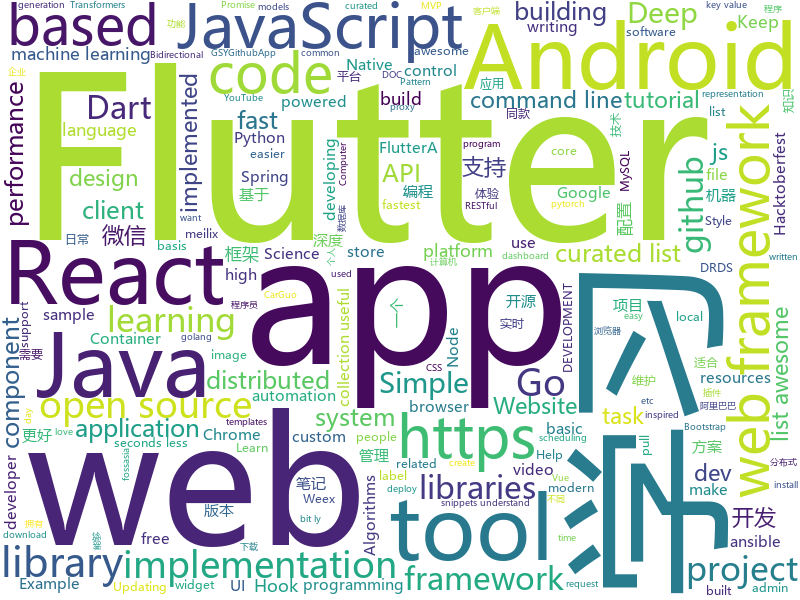

# 2018-10-31
See what the GitHub community is most excited about today.

## python
* [DeepCreamPy](https://github.com/deeppomf/DeepCreamPy)(**868 stars today**): Decensoring Hentai with Deep Neural Networks
* [vespene](https://github.com/vespene-io/vespene)(**186 stars today**): A modern continuous integration, deployment, and self-service automation platform
* [graph-cli](https://github.com/mcastorina/graph-cli)(**142 stars today**): Flexible command line tool to create graphs from CSV data
* [fuxploider](https://github.com/almandin/fuxploider)(**139 stars today**): File upload vulnerability scanner and exploitation tool.
* [bert_language_understanding](https://github.com/brightmart/bert_language_understanding)(**121 stars today**): Pre-training of Deep Bidirectional Transformers for Language Understanding
* [torchstat](https://github.com/Swall0w/torchstat)(**124 stars today**): Model analyzer in PyTorch
* [TensorFlow-Course](https://github.com/open-source-for-science/TensorFlow-Course)(**112 stars today**): Simple and ready-to-use tutorials for TensorFlow
* [transparent_latent_gan](https://github.com/SummitKwan/transparent_latent_gan)(**107 stars today**): Use supervised learning to illuminate the latent space of GAN for controlled generation and edit
* [vergeml](https://github.com/vergeml/vergeml)(**97 stars today**): Machine Learning Environment - alpha version
* [Python](https://github.com/TheAlgorithms/Python)(**82 stars today**): All Algorithms implemented in Python
* [BERT-keras](https://github.com/Separius/BERT-keras)(**95 stars today**): Keras implementation of BERT(Bidirectional Encoder Representations from Transformers)
* [models](https://github.com/tensorflow/models)(**71 stars today**): Models and examples built with TensorFlow
* [maskrcnn-benchmark](https://github.com/facebookresearch/maskrcnn-benchmark)(**81 stars today**): Fast, modular reference implementation of Instance Segmentation and Object Detection algorithms in PyTorch.
* [WebMap](https://github.com/Rev3rseSecurity/WebMap)(**72 stars today**): Nmap Web Dashboard and Reporting
* [system-design-primer](https://github.com/donnemartin/system-design-primer)(**62 stars today**): Learn how to design large-scale systems. Prep for the system design interview. Includes Anki flashcards.
* [awesome-python](https://github.com/vinta/awesome-python)(**61 stars today**): A curated list of awesome Python frameworks, libraries, software and resources
* [keras](https://github.com/keras-team/keras)(**44 stars today**): Deep Learning for humans
* [DouYin](https://github.com/Python3WebSpider/DouYin)(**44 stars today**): API of DouYin for Humans used to Crawl Popular Videos and Musics
* [public-apis](https://github.com/toddmotto/public-apis)(**49 stars today**): A collective list of public JSON APIs for use in web development.
* [django](https://github.com/django/django)(**35 stars today**): The Web framework for perfectionists with deadlines.
* [youtube-dl](https://github.com/rg3/youtube-dl)(**42 stars today**): Command-line program to download videos from YouTube.com and other video sites
* [home-assistant](https://github.com/home-assistant/home-assistant)(**34 stars today**): 🏡Open source home automation that puts local control and privacy first
* [scikit-learn](https://github.com/scikit-learn/scikit-learn)(**39 stars today**): scikit-learn: machine learning in Python
* [Algorithm_Interview_Notes-Chinese](https://github.com/imhuay/Algorithm_Interview_Notes-Chinese)(**34 stars today**): 2018/2019/校招/春招/秋招/算法/机器学习(Machine Learning)/深度学习(Deep Learning)/自然语言处理(NLP)/C/C++/Python/面试笔记
* [ansible](https://github.com/ansible/ansible)(**33 stars today**): Ansible is a radically simple IT automation platform that makes your applications and systems easier to deploy. Avoid writing scripts or custom code to deploy and update your applications — automate in a language that approaches plain English, using SSH, with no agents to install on remote systems. https://docs.ansible.com/ansible/

## java
* [JavaGuide](https://github.com/Snailclimb/JavaGuide)(**98 stars today**): 【Java学习+面试指南】 一份涵盖大部分Java程序员所需要掌握的核心知识。
* [AndroidAutoSize](https://github.com/JessYanCoding/AndroidAutoSize)(**82 stars today**): 🔥A low-cost Android screen adaptation solution (今日头条屏幕适配方案终极版，一个极低成本的 Android 屏幕适配方案).
* [java-design-patterns](https://github.com/iluwatar/java-design-patterns)(**62 stars today**): Design patterns implemented in Java
* [proxyee-down](https://github.com/proxyee-down-org/proxyee-down)(**58 stars today**): http下载工具，基于http代理，支持多连接分块下载
* [Phantom](https://github.com/ManbangGroup/Phantom)(**58 stars today**): Phantom — 唯一零 Hook 稳定占坑类 Android 热更新插件化方案
* [spring-boot](https://github.com/spring-projects/spring-boot)(**53 stars today**): Spring Boot
* [SpringCloudLearning](https://github.com/forezp/SpringCloudLearning)(**48 stars today**): 《史上最简单的Spring Cloud教程源码》
* [SuperWeb](https://github.com/Victory-Over/SuperWeb)(**53 stars today**): Android基于腾讯X5内核的WebView(超级浏览器)，拥有文件上传、下载、浏览（支持PDF/PPT/DOC/EXCEL/TXT格式）、Android与JS的交互、视频播放、自定义进度条、下拉回弹等功能
* [tutorials](https://github.com/eugenp/tutorials)(**28 stars today**): The "REST With Spring" Course:
* [error-prone](https://github.com/google/error-prone)(**45 stars today**): Catch common Java mistakes as compile-time errors
* [spring-framework](https://github.com/spring-projects/spring-framework)(**26 stars today**): Spring Framework
* [incubator-dubbo](https://github.com/apache/incubator-dubbo)(**30 stars today**): Apache Dubbo (incubating) is a high-performance, java based, open source RPC framework.
* [symphony](https://github.com/b3log/symphony)(**37 stars today**): 🎶一款用 Java 实现的现代化社区（论坛/BBS/社交网络/博客）平台。https://hacpai.com
* [elasticsearch](https://github.com/elastic/elasticsearch)(**34 stars today**): Open Source, Distributed, RESTful Search Engine
* [canal](https://github.com/alibaba/canal)(**34 stars today**): 阿里巴巴mysql数据库binlog的增量订阅&消费组件 。阿里云DRDS( https://www.aliyun.com/product/drds )、阿里巴巴TDDL 二级索引、小表复制powerd by canal.
* [Java](https://github.com/TheAlgorithms/Java)(**30 stars today**): All Algorithms implemented in Java
* [apollo](https://github.com/ctripcorp/apollo)(**30 stars today**): Apollo（阿波罗）是携程框架部门研发的分布式配置中心，能够集中化管理应用不同环境、不同集群的配置，配置修改后能够实时推送到应用端，并且具备规范的权限、流程治理等特性，适用于微服务配置管理场景。
* [okhttp](https://github.com/square/okhttp)(**31 stars today**): An HTTP+HTTP/2 client for Android and Java applications.
* [AndroidUtilCode](https://github.com/Blankj/AndroidUtilCode)(**30 stars today**): 🔥Android developers should collect the following utils(updating).
* [xxl-job](https://github.com/xuxueli/xxl-job)(**26 stars today**): A lightweight distributed task scheduling framework.（分布式任务调度平台XXL-JOB）
* [guava](https://github.com/google/guava)(**28 stars today**): Google core libraries for Java
* [arthas](https://github.com/alibaba/arthas)(**23 stars today**): Alibaba Java Diagnostic Tool Arthas/Alibaba Java诊断利器Arthas
* [MyPerf4J](https://github.com/ThinkpadNC5/MyPerf4J)(**24 stars today**): High performance Java APM. Powered by ASM.
* [weixin-java-tools](https://github.com/Wechat-Group/weixin-java-tools)(**22 stars today**): 全能微信Java开发工具包，支持包括微信支付、开放平台、小程序、企业微信/企业号和公众号等的开发
* [MVPArms](https://github.com/JessYanCoding/MVPArms)(**22 stars today**): ⚔️A common architecture for Android applications developing based on MVP, integrates many open source projects, to make your developing quicker and easier (一个整合了大量主流开源项目高度可配置化的 Android MVP 快速集成框架).

## unknown
* [DeepLearning-500-questions](https://github.com/scutan90/DeepLearning-500-questions)(**773 stars today**): 深度学习500问，以问答形式对常用的概率知识、线性代数、机器学习、深度学习、计算机视觉等热点问题进行阐述，以帮助自己及有需要的读者。 全书分为15个章节，近20万字。由于水平有限，书中不妥之处恳请广大读者批评指正。 未完待续............ 如有意合作，联系scutjy2015@163.com 版权所有，违权必究 Tan 2018.06
* [A-to-Z-Resources-for-Students](https://github.com/dipakkr/A-to-Z-Resources-for-Students)(**563 stars today**): Curated list of resources for college students Show your❤️by giving a⭐️
* [React-Fiber-Architecture](https://github.com/SaeedMalikx/React-Fiber-Architecture)(**176 stars today**): Understanding the structure of React Fiber( walk through and pseudo-code)
* [first-contributions](https://github.com/firstcontributions/first-contributions)(**48 stars today**): 🚀✨Help beginners to contribute to open source projects
* [CS-Notes](https://github.com/CyC2018/CS-Notes)(**99 stars today**): 📚Computer Science Learning Notes
* [bert](https://github.com/google-research/bert)(**120 stars today**): 
* [Make-a-Pull-Request](https://github.com/rishabh-bansal/Make-a-Pull-Request)(**8 stars today**): Make a Pull Request
* [awesome-react-hooks](https://github.com/rehooks/awesome-react-hooks)(**83 stars today**): Awesome React Hooks
* [You-Dont-Know-JS](https://github.com/getify/You-Dont-Know-JS)(**74 stars today**): A book series on JavaScript. @YDKJS on twitter.
* [awesome](https://github.com/sindresorhus/awesome)(**78 stars today**): 😎Curated list of awesome lists
* [gitignore](https://github.com/github/gitignore)(**56 stars today**): A collection of useful .gitignore templates
* [remote-or-flexible-work-company-in-korea](https://github.com/milooy/remote-or-flexible-work-company-in-korea)(**67 stars today**): 한국에서 원격근무 혹은 자율출퇴근이 되는 회사 리스트를 아카이브합니다
* [free-programming-books](https://github.com/EbookFoundation/free-programming-books)(**62 stars today**): 📚Freely available programming books
* [git-flight-rules](https://github.com/k88hudson/git-flight-rules)(**60 stars today**): Flight rules for git
* [Awesome-pytorch-list](https://github.com/bharathgs/Awesome-pytorch-list)(**56 stars today**): A comprehensive list of pytorch related content on github,such as different models,implementations,helper libraries,tutorials etc.
* [DeepLearningAnimePapers](https://github.com/deeppomf/DeepLearningAnimePapers)(**45 stars today**): A list of papers and other resources on deep learning with anime style images.
* [weekly](https://github.com/ruanyf/weekly)(**45 stars today**): 技术分享周刊，每周五发布
* [Best-websites-a-programmer-should-visit](https://github.com/sdmg15/Best-websites-a-programmer-should-visit)(**43 stars today**): 🔗Some useful websites for programmers.
* [awesome-vue](https://github.com/vuejs/awesome-vue)(**41 stars today**): 🎉A curated list of awesome things related to Vue.js
* [awesome-nodejs-security](https://github.com/lirantal/awesome-nodejs-security)(**41 stars today**): Awesome Node.js Security resources
* [Android-Interview](https://github.com/jeanboydev/Android-Interview)(**35 stars today**): 
* [Game-Programmer-Study-Notes](https://github.com/QianMo/Game-Programmer-Study-Notes)(**36 stars today**): ⚓️我的游戏程序员生涯的读书笔记合辑。你可以把它看做一个加强版的Blog。涉及图形学、实时渲染、编程实践、GPU编程、设计模式、软件工程等内容。Keep Reading , Keep Writing , Keep Coding.
* [malware-sample-library](https://github.com/mstfknn/malware-sample-library)(**34 stars today**): Malware sample library.
* [coding-interview-university](https://github.com/jwasham/coding-interview-university)(**28 stars today**): A complete computer science study plan to become a software engineer.
* [pwa-bugs](https://github.com/PWA-POLICE/pwa-bugs)(**35 stars today**): List of PWA Bugs and workarounds

## javascript
* [pennywise](https://github.com/kamranahmedse/pennywise)(**381 stars today**): Cross-platform application to open anything in a floating window
* [33-js-concepts](https://github.com/leonardomso/33-js-concepts)(**343 stars today**): 📜33 concepts every JavaScript developer should know.
* [the-platform](https://github.com/palmerhq/the-platform)(**313 stars today**): Web. Components.😂
* [haunted](https://github.com/matthewp/haunted)(**303 stars today**): React's Hooks API implemented for web components
* [33-js-concepts](https://github.com/stephentian/33-js-concepts)(**260 stars today**): 📜每个 JavaScript 工程师都应懂的33个概念 @leonardomso
* [jobs-done](https://github.com/skidding/jobs-done)(**205 stars today**): A ritual app for ending the work day inspired by Deep Work
* [irondb](https://github.com/gruns/irondb)(**192 stars today**): 🔩A relentless key-value store for the browser.
* [freeCodeCamp](https://github.com/freeCodeCamp/freeCodeCamp)(****): The https://freeCodeCamp.org open source codebase and curriculum. Learn to code for free together with millions of people.
* [create-react-app](https://github.com/facebook/create-react-app)(**102 stars today**): Set up a modern web app by running one command.
* [telescope](https://github.com/laravel/telescope)(**108 stars today**): 
* [vue](https://github.com/vuejs/vue)(**103 stars today**): 🖖A progressive, incrementally-adoptable JavaScript framework for building UI on the web.
* [30-seconds-of-code](https://github.com/30-seconds/30-seconds-of-code)(**104 stars today**): Curated collection of useful JavaScript snippets that you can understand in 30 seconds or less.
* [react](https://github.com/facebook/react)(**90 stars today**): A declarative, efficient, and flexible JavaScript library for building user interfaces.
* [omi](https://github.com/Tencent/omi)(**95 stars today**): Next generation web framework in 4kb JavaScript (Web Components + JSX + Proxy + Store + Path Updating)
* [react-conf-2018](https://github.com/ryanflorence/react-conf-2018)(**89 stars today**): 
* [Hello-Hacktober](https://github.com/ViniciusDeep/Hello-Hacktober)(**7 stars today**): This repository is for people who are starting to program, and want to participate in hacktoberfest or just want to contribute
* [nativefier](https://github.com/jiahaog/nativefier)(**77 stars today**): Make any web page a desktop application
* [react-native-hooks](https://github.com/react-native-community/react-native-hooks)(**75 stars today**): React Native APIs turned into React Hooks for use in stateless React components
* [storybook](https://github.com/storybooks/storybook)(**70 stars today**): Interactive UI component dev & test: React, React Native, Vue, Angular, Ember
* [puppeteer](https://github.com/GoogleChrome/puppeteer)(**70 stars today**): Headless Chrome Node API
* [javascript](https://github.com/airbnb/javascript)(**66 stars today**): JavaScript Style Guide
* [playroom](https://github.com/seek-oss/playroom)(**68 stars today**): Design with code, powered by your own component library.
* [free-programming-books-zh_CN](https://github.com/justjavac/free-programming-books-zh_CN)(**59 stars today**): 📚免费的计算机编程类中文书籍，欢迎投稿
* [axios](https://github.com/axios/axios)(**57 stars today**): Promise based HTTP client for the browser and node.js
* [westore](https://github.com/Tencent/westore)(**54 stars today**): 微信小程序解决方案 - 1KB javascript 覆盖状态管理、跨页通讯、插件开发和云数据库开发

## html
* [vue-hooks](https://github.com/yyx990803/vue-hooks)(**112 stars today**): Experimental React hooks implementation in Vue
* [ytsm](https://github.com/chibicitiberiu/ytsm)(**70 stars today**): Self-hosted tool which manages your YouTube subscriptions, and downloads files automatically.
* [30-seconds-of-css](https://github.com/30-seconds/30-seconds-of-css)(**48 stars today**): A curated collection of useful CSS snippets you can understand in 30 seconds or less.
* [async-javascript-cheatsheet](https://github.com/frontarm/async-javascript-cheatsheet)(**38 stars today**): Cheatsheet for promises and async/await
* [JavaScript30](https://github.com/wesbos/JavaScript30)(**20 stars today**): 30 Day Vanilla JS Challenge
* [BrowserSecurity](https://github.com/wnagzihxa1n/BrowserSecurity)(**26 stars today**): 我在学习浏览器安全过程中整理的漏洞分析笔记与相关的学习资料
* [bitcoin-whitepaper-chinese-translation](https://github.com/xiaolai/bitcoin-whitepaper-chinese-translation)(**23 stars today**): 
* [hacktoberfest](https://github.com/lingonsaft/hacktoberfest)(**5 stars today**): Hacktoberfest 2018. Don't forget to spread love and if you like give us a⭐️
* [react-redux](https://github.com/reduxjs/react-redux)(**20 stars today**): Official React bindings for Redux
* [gci18.fossasia.org](https://github.com/fossasia/gci18.fossasia.org)(**17 stars today**): FOSSASIA Google Code-In Website 2018 https://gci18.fossasia.org
* [core](https://github.com/stackblitz/core)(**20 stars today**): Online IDE powered by Visual Studio Code⚡️
* [solid](https://github.com/solid/solid)(**19 stars today**): Solid - Re-decentralizing the web (project directory)
* [DeepLearningProject](https://github.com/Spandan-Madan/DeepLearningProject)(**18 stars today**): An in-depth machine learning tutorial introducing readers to a whole machine learning pipeline from scratch.
* [AdminLTE](https://github.com/almasaeed2010/AdminLTE)(**15 stars today**): AdminLTE - Free Premium Admin control Panel Theme Based On Bootstrap 3.x
* [pslab.io](https://github.com/fossasia/pslab.io)(**17 stars today**): Pocket Science Lab Website http://pslab.io
* [meilix-generator](https://github.com/fossasia/meilix-generator)(**17 stars today**): WebApp for generating a custom ISO image based on Meilix http://meilix.org
* [baselines](https://github.com/openai/baselines)(**15 stars today**): OpenAI Baselines: high-quality implementations of reinforcement learning algorithms
* [BlackEye-Python](https://github.com/M4cs/BlackEye-Python)(**15 stars today**): BlackEye Phishing Kit in Python w Serveo Subdomain Creation
* [2019.fossasia.org](https://github.com/fossasia/2019.fossasia.org)(**16 stars today**): FOSSASIA Summit 2019 https://2019.fossasia.org
* [Spoon-Knife](https://github.com/octocat/Spoon-Knife)(****): This repo is for demonstration purposes only.
* [Coursera-ML-AndrewNg-Notes](https://github.com/fengdu78/Coursera-ML-AndrewNg-Notes)(**12 stars today**): 吴恩达老师的机器学习课程个人笔记
* [fastText](https://github.com/facebookresearch/fastText)(**12 stars today**): Library for fast text representation and classification.
* [coreui-free-bootstrap-admin-template](https://github.com/coreui/coreui-free-bootstrap-admin-template)(**14 stars today**): CoreUI is free bootstrap admin template
* [nbgrader](https://github.com/jupyter/nbgrader)(**13 stars today**): A system for assigning and grading notebooks
* [Contributors-portraits](https://github.com/MattCrl/Contributors-portraits)(****): a Simple HTML/CSS project for Hacktoberfest pull requests. Introduce yourself in a card !

## dart
* [flutter](https://github.com/flutter/flutter)(**75 stars today**): Flutter makes it easy and fast to build beautiful mobile apps.
* [awesome-flutter](https://github.com/Solido/awesome-flutter)(**31 stars today**): An awesome list that curates the best Flutter libraries, tools, tutorials, articles and more.
* [plugins](https://github.com/flutter/plugins)(**15 stars today**): Plugins for Flutter, including FlutterFire, maintained by the Flutter team
* [xamarin.flutter](https://github.com/adamped/xamarin.flutter)(**11 stars today**): Running Flutter on Xamarin
* [inKino](https://github.com/roughike/inKino)(**9 stars today**): inKino - A cross platform movie and showtime browser for Finnkino cinemas, made with Flutter.
* [Flutter-Notebook](https://github.com/OpenFlutter/Flutter-Notebook)(**6 stars today**): 日更的FlutterDemo合集，今天你fu了吗
* [WhatTodo](https://github.com/burhanrashid52/WhatTodo)(**6 stars today**): A Simple Todo app design in Flutter to keep track of your task on daily basis. Its build on BLoC Pattern. You can add a project, labels, and due-date to your task also you can sort your task on the basis of project, label, and dates
* [sdk](https://github.com/dart-lang/sdk)(**5 stars today**): The Dart SDK, including the VM, dart2js, core libraries, and more.
* [flutter_map](https://github.com/apptreesoftware/flutter_map)(**5 stars today**): A Flutter map package based on leaflet
* [flutter_architecture_samples](https://github.com/brianegan/flutter_architecture_samples)(**5 stars today**): TodoMVC for Flutter
* [wanandroid](https://github.com/hurshi/wanandroid)(**5 stars today**): A wanandroid.com client written by Flutter
* [flutter_snaplist](https://github.com/ariedov/flutter_snaplist)(**5 stars today**): A small library for creating snapping lists.
* [linter](https://github.com/dart-lang/linter)(****): Linter for Dart.
* [github.dart](https://github.com/DirectMyFile/github.dart)(****): GitHub Client Library for Dart
* [coverflow](https://github.com/efortuna/coverflow)(****): a basic coverflow implementation in Flutter
* [flutter_carousel_slider](https://github.com/serenader2014/flutter_carousel_slider)(****): A flutter carousel widget, support infinite scroll, and custom child widget.
* [firebase-dart](https://github.com/FirebaseExtended/firebase-dart)(****): Dart wrapper for Firebase
* [chromedeveditor](https://github.com/googlearchive/chromedeveditor)(****): Chrome Dev Editor is a developer tool for building apps on the Chrome platform - Chrome Apps and Web Apps, in JavaScript or Dart. (NO LONGER IN ACTIVE DEVELOPMENT)
* [GSYGithubAppFlutter](https://github.com/CarGuo/GSYGithubAppFlutter)(****): 超完整的Flutter项目，功能丰富，适合学习和日常使用。GSYGithubApp系列的优势：我们目前已经拥有Flutter、Weex、ReactNative三个版本。 功能齐全，项目框架内技术涉及面广，完成度高，持续维护，配套文章，适合全面学习，跨框架对比参考。跨平台的开源Github客户端App，更好的体验，更丰富的功能，旨在更好的日常管理和维护个人Github，提供更好更方便的驾车体验～～Σ(￣。￣ﾉ)ﾉ。同款Weex版本 ： https://github.com/CarGuo/GSYGithubAppWeex 、同款React Native版本 ： https://github.com/CarGuo/GSYGithubApp
* [FlutterExampleApps](https://github.com/iampawan/FlutterExampleApps)(****): [Example APPS] Basic Flutter apps, for flutter devs.
* [flutter-osc](https://github.com/yubo725/flutter-osc)(****): 基于Google Flutter的开源中国客户端，支持Android和iOS。
* [flutter-examples](https://github.com/nisrulz/flutter-examples)(****): [Examples] Simple basic isolated apps, for budding flutter devs.
* [Flutter-UI-Kit](https://github.com/iampawan/Flutter-UI-Kit)(****): Flutter app for collection of UI in a UIKit
* [Flutter-learning](https://github.com/AweiLoveAndroid/Flutter-learning)(****): 🔥👍🌟⭐️⭐️⭐️Flutter install&settings,Flutter problems when developing,Flutter sample codes& templates,Flutter projects,Dart languages sample codes
* [dio](https://github.com/flutterchina/dio)(****): A powerful Http client for Dart, which supports Interceptors, FormData, Request Cancellation, File Downloading, Timeout etc.

## go
* [dive](https://github.com/wagoodman/dive)(**206 stars today**): A tool for exploring each layer in a docker image
* [up](https://github.com/akavel/up)(**179 stars today**): Ultimate Plumber is a tool for writing Linux pipes with instant live preview
* [gotop](https://github.com/cjbassi/gotop)(**112 stars today**): A terminal based graphical activity monitor inspired by gtop and vtop
* [soar](https://github.com/XiaoMi/soar)(**55 stars today**): SQL Optimizer And Rewriter
* [go](https://github.com/golang/go)(**50 stars today**): The Go programming language
* [kubernetes](https://github.com/kubernetes/kubernetes)(**42 stars today**): Production-Grade Container Scheduling and Management
* [transfer.sh](https://github.com/dutchcoders/transfer.sh)(**45 stars today**): Easy and fast file sharing from the command-line.
* [awesome-go](https://github.com/avelino/awesome-go)(**46 stars today**): A curated list of awesome Go frameworks, libraries and software
* [go-ethereum](https://github.com/ethereum/go-ethereum)(**37 stars today**): Official Go implementation of the Ethereum protocol
* [stellar](https://github.com/ehazlett/stellar)(**41 stars today**): Simplified Container System
* [gorouter](https://github.com/xujiajun/gorouter)(**38 stars today**): xujiajun/gorouter is a simple and fast HTTP router for Go. It is easy to build RESTful APIs and your web framework.
* [naftis](https://github.com/XiaoMi/naftis)(**38 stars today**): An awesome dashboard for Istio built with love.
* [etcd](https://github.com/etcd-io/etcd)(**34 stars today**): Distributed reliable key-value store for the most critical data of a distributed system
* [istio](https://github.com/istio/istio)(**32 stars today**): Connect, secure, control, and observe services.
* [gophish](https://github.com/gophish/gophish)(**37 stars today**): Open-Source Phishing Toolkit
* [gin](https://github.com/gin-gonic/gin)(**33 stars today**): Gin is a HTTP web framework written in Go (Golang). It features a Martini-like API with much better performance -- up to 40 times faster. If you need smashing performance, get yourself some Gin.
* [frp](https://github.com/fatedier/frp)(**31 stars today**): A fast reverse proxy to help you expose a local server behind a NAT or firewall to the internet.
* [libpod](https://github.com/containers/libpod)(**33 stars today**): libpod is a library used to create container pods.
* [iris](https://github.com/kataras/iris)(**32 stars today**): The fastest backend community-driven web framework on (THIS) Earth. HTTP/2, MVC and more. Can your favourite web framework do that?👉http://bit.ly/iriscandothat1 or even http://bit.ly/iriscandothat2
* [beego](https://github.com/astaxie/beego)(**31 stars today**): beego is an open-source, high-performance web framework for the Go programming language.
* [hugo](https://github.com/gohugoio/hugo)(**31 stars today**): The world’s fastest framework for building websites.
* [build-web-application-with-golang](https://github.com/astaxie/build-web-application-with-golang)(**27 stars today**): A golang ebook intro how to build a web with golang
* [terraform](https://github.com/hashicorp/terraform)(**28 stars today**): Terraform is a tool for building, changing, and combining infrastructure safely and efficiently.
* [gowrap](https://github.com/hexdigest/gowrap)(**29 stars today**): GoWrap is a command line tool for generating decorators for Go interfaces
* [tidb](https://github.com/pingcap/tidb)(**28 stars today**): TiDB is a distributed HTAP database compatible with the MySQL protocol

## WordCloud

