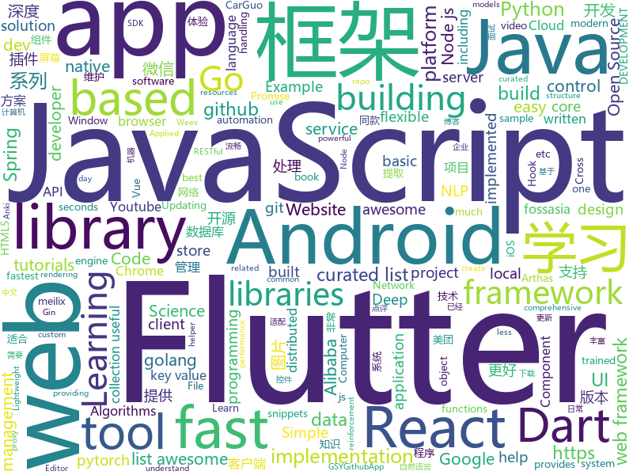

# 2018-11-02
See what the GitHub community is most excited about today.

## python
* [bert](https://github.com/google-research/bert)(**2,171 stars today**): TensorFlow code and pre-trained models for BERT
* [adanet](https://github.com/tensorflow/adanet)(**376 stars today**): Fast and flexible AutoML with learning guarantees.
* [DeepCreamPy](https://github.com/deeppomf/DeepCreamPy)(**234 stars today**): Decensoring Hentai with Deep Neural Networks
* [Horizon](https://github.com/facebookresearch/Horizon)(**121 stars today**): A platform for Applied Reinforcement Learning (Applied RL)
* [BERT-pytorch](https://github.com/codertimo/BERT-pytorch)(**107 stars today**): Google AI 2018 BERT pytorch implementation
* [models](https://github.com/tensorflow/models)(**75 stars today**): Models and examples built with TensorFlow
* [Python](https://github.com/TheAlgorithms/Python)(**79 stars today**): All Algorithms implemented in Python
* [Some-PoC-oR-ExP](https://github.com/coffeehb/Some-PoC-oR-ExP)(**75 stars today**): 各种漏洞poc、Exp的收集或编写
* [random-network-distillation](https://github.com/openai/random-network-distillation)(**81 stars today**): 
* [maskrcnn-benchmark](https://github.com/facebookresearch/maskrcnn-benchmark)(**76 stars today**): Fast, modular reference implementation of Instance Segmentation and Object Detection algorithms in PyTorch.
* [Algorithm_Interview_Notes-Chinese](https://github.com/imhuay/Algorithm_Interview_Notes-Chinese)(**51 stars today**): 2018/2019/校招/春招/秋招/算法/机器学习(Machine Learning)/深度学习(Deep Learning)/自然语言处理(NLP)/C/C++/Python/面试笔记
* [pandas](https://github.com/pandas-dev/pandas)(**53 stars today**): Flexible and powerful data analysis / manipulation library for Python, providing labeled data structures similar to R data.frame objects, statistical functions, and much more
* [TensorFlow-Course](https://github.com/open-source-for-science/TensorFlow-Course)(**51 stars today**): Simple and ready-to-use tutorials for TensorFlow
* [system-design-primer](https://github.com/donnemartin/system-design-primer)(**49 stars today**): Learn how to design large-scale systems. Prep for the system design interview. Includes Anki flashcards.
* [YouMayNotNeedAttention](https://github.com/ofirpress/YouMayNotNeedAttention)(**50 stars today**): 
* [home-assistant](https://github.com/home-assistant/home-assistant)(**45 stars today**): 🏡Open source home automation that puts local control and privacy first
* [cgnl-network.pytorch](https://github.com/KaiyuYue/cgnl-network.pytorch)(**42 stars today**): Compact Generalized Non-local Network (NIPS 2018)
* [cpython](https://github.com/python/cpython)(**32 stars today**): The Python programming language
* [youtube-dl](https://github.com/rg3/youtube-dl)(**38 stars today**): Command-line program to download videos from YouTube.com and other video sites
* [sklearn-porter](https://github.com/nok/sklearn-porter)(**39 stars today**): Transpile trained scikit-learn estimators to C, Java, JavaScript and others.
* [dissect.cstruct](https://github.com/fox-it/dissect.cstruct)(**37 stars today**): A no-nonsense c-like structure parsing library for Python
* [torchstat](https://github.com/Swall0w/torchstat)(**36 stars today**): Model analyzer in PyTorch
* [keras](https://github.com/keras-team/keras)(**31 stars today**): Deep Learning for humans
* [awesome-python](https://github.com/vinta/awesome-python)(**32 stars today**): A curated list of awesome Python frameworks, libraries, software and resources
* [django](https://github.com/django/django)(**28 stars today**): The Web framework for perfectionists with deadlines.

## java
* [spring-cloud-alibaba](https://github.com/spring-cloud-incubator/spring-cloud-alibaba)(**137 stars today**): Spring Cloud Alibaba provides a one-stop solution for application development for the distributed solutions of Alibaba middleware.
* [arthas](https://github.com/alibaba/arthas)(**120 stars today**): Alibaba Java Diagnostic Tool Arthas/Alibaba Java诊断利器Arthas
* [JavaGuide](https://github.com/Snailclimb/JavaGuide)(**97 stars today**): 【Java学习+面试指南】 一份涵盖大部分Java程序员所需要掌握的核心知识。
* [proxyee-down](https://github.com/proxyee-down-org/proxyee-down)(**72 stars today**): http下载工具，基于http代理，支持多连接分块下载
* [spring-boot](https://github.com/spring-projects/spring-boot)(**55 stars today**): Spring Boot
* [java-design-patterns](https://github.com/iluwatar/java-design-patterns)(**51 stars today**): Design patterns implemented in Java
* [MultiActionSwipeHelper](https://github.com/bufferapp/MultiActionSwipeHelper)(**54 stars today**): An Android RecyclerView Swipe Helper for handling multiple actions per direction
* [HanLP](https://github.com/hankcs/HanLP)(**51 stars today**): 自然语言处理 中文分词 词性标注 命名实体识别 依存句法分析 关键词提取 新词发现 短语提取 自动摘要 文本分类 拼音简繁
* [AndroidAutoSize](https://github.com/JessYanCoding/AndroidAutoSize)(**48 stars today**): 🔥A low-cost Android screen adaptation solution (今日头条屏幕适配方案终极版，一个极低成本的 Android 屏幕适配方案).
* [symphony](https://github.com/b3log/symphony)(**42 stars today**): 🎶一款用 Java 实现的现代化社区（论坛/BBS/社交网络/博客）平台。https://hacpai.com
* [Phantom](https://github.com/ManbangGroup/Phantom)(**43 stars today**): Phantom — 唯一零 Hook 稳定占坑类 Android 热更新插件化方案
* [Java](https://github.com/TheAlgorithms/Java)(**38 stars today**): All Algorithms implemented in Java
* [Sentinel](https://github.com/alibaba/Sentinel)(**40 stars today**): A lightweight flow-control library providing high-available protection and monitoring (高可用防护的流量管理框架)
* [elasticsearch](https://github.com/elastic/elasticsearch)(**36 stars today**): Open Source, Distributed, RESTful Search Engine
* [guava](https://github.com/google/guava)(**36 stars today**): Google core libraries for Java
* [Anki-Android](https://github.com/ankidroid/Anki-Android)(**38 stars today**): AnkiDroid: Anki on Android
* [AndroidUtilCode](https://github.com/Blankj/AndroidUtilCode)(**31 stars today**): 🔥Android developers should collect the following utils(updating).
* [SpringCloudLearning](https://github.com/forezp/SpringCloudLearning)(**32 stars today**): 《史上最简单的Spring Cloud教程源码》
* [weixin-java-tools](https://github.com/Wechat-Group/weixin-java-tools)(**35 stars today**): 全能微信Java开发工具包，支持包括微信支付、开放平台、小程序、企业微信/企业号和公众号等的开发
* [nacos](https://github.com/alibaba/nacos)(**30 stars today**): an easy-to-use dynamic service discovery, configuration and service management platform for building cloud native applications
* [JCSprout](https://github.com/crossoverJie/JCSprout)(**29 stars today**): 👨‍🎓Java Core Sprout : basic, concurrent, algorithm
* [tutorials](https://github.com/eugenp/tutorials)(**15 stars today**): The "REST With Spring" Course:
* [spring-framework](https://github.com/spring-projects/spring-framework)(**23 stars today**): Spring Framework
* [zafira](https://github.com/qaprosoft/zafira)(**31 stars today**): Test automation reporting
* [play-services-plugins](https://github.com/google/play-services-plugins)(**30 stars today**): Plugins to help with using Google Play services SDK.

## unknown
* [DeepLearning-500-questions](https://github.com/scutan90/DeepLearning-500-questions)(**1,081 stars today**): 深度学习500问，以问答形式对常用的概率知识、线性代数、机器学习、深度学习、计算机视觉等热点问题进行阐述，以帮助自己及有需要的读者。 全书分为15个章节，近20万字。由于水平有限，书中不妥之处恳请广大读者批评指正。 未完待续............ 如有意合作，联系scutjy2015@163.com 版权所有，违权必究 Tan 2018.06
* [A-to-Z-Resources-for-Students](https://github.com/dipakkr/A-to-Z-Resources-for-Students)(**213 stars today**): Curated list of resources for college students Show your❤️by giving a⭐️
* [Learn_Data_Science_in_3_Months](https://github.com/llSourcell/Learn_Data_Science_in_3_Months)(**167 stars today**): This is the Curriculum for "Learn Data Science in 3 Months" By Siraj Raval on Youtube
* [ghost-lang](https://github.com/jamiebuilds/ghost-lang)(**133 stars today**): 👻A friendly little language for you and me.
* [CS-Notes](https://github.com/CyC2018/CS-Notes)(**89 stars today**): 📚Computer Science Learning Notes
* [AOSF](https://github.com/Ericsongyl/AOSF)(**95 stars today**): AOSF：全称为Android Open Source Framework，即Android优秀开源框架汇总。包含：网络请求okhttp，图片下载glide，数据库greenDAO，链式框架RxJava，组件路由ARouter，消息传递通信EventBus，热更新Tinker，插件化框架Replugin，文件下载FileDownloaer，图片选择PhotoPicker，图片滤镜/毛玻璃等特效处理，GIF图片展示控件，图片九宫格控件NineGridView，对话框Dialog，导航指示器ViewpagerIndicator，进度条ProgressWheel，下拉刷新SmartRefreshLayout，key-value高效数据存储MMKV等，应有尽有。
* [developer-roadmap](https://github.com/kamranahmedse/developer-roadmap)(**84 stars today**): Roadmap to becoming a web developer in 2018
* [Best-websites-a-programmer-should-visit](https://github.com/sdmg15/Best-websites-a-programmer-should-visit)(**92 stars today**): 🔗Some useful websites for programmers.
* [youtube-br-desenvolvimento](https://github.com/carolcodes/youtube-br-desenvolvimento)(**70 stars today**): Repositório de canais no Youtube BR sobre desenvolvimento
* [You-Dont-Know-JS](https://github.com/getify/You-Dont-Know-JS)(**65 stars today**): A book series on JavaScript. @YDKJS on twitter.
* [awesome-react-hooks](https://github.com/rehooks/awesome-react-hooks)(**59 stars today**): Awesome React Hooks
* [gitignore](https://github.com/github/gitignore)(**43 stars today**): A collection of useful .gitignore templates
* [git-flight-rules](https://github.com/k88hudson/git-flight-rules)(**55 stars today**): Flight rules for git
* [free-programming-books](https://github.com/EbookFoundation/free-programming-books)(**53 stars today**): 📚Freely available programming books
* [awesome](https://github.com/sindresorhus/awesome)(**51 stars today**): 😎Curated list of awesome lists
* [awesome-nodejs-security](https://github.com/lirantal/awesome-nodejs-security)(**55 stars today**): Awesome Node.js Security resources
* [first-contributions](https://github.com/firstcontributions/first-contributions)(**26 stars today**): 🚀✨Help beginners to contribute to open source projects
* [coding-interview-university](https://github.com/jwasham/coding-interview-university)(**40 stars today**): A complete computer science study plan to become a software engineer.
* [clash_for_windows_pkg](https://github.com/Fndroid/clash_for_windows_pkg)(**37 stars today**): A Windows GUI for Clash
* [jndiat](https://github.com/quentinhardy/jndiat)(**34 stars today**): JNDI Attacking Tool
* [weekly](https://github.com/ruanyf/weekly)(**34 stars today**): 技术分享周刊，每周五发布
* [awesome-vue](https://github.com/vuejs/awesome-vue)(**31 stars today**): 🎉A curated list of awesome things related to Vue.js
* [project-based-learning](https://github.com/tuvtran/project-based-learning)(**31 stars today**): Curated list of project-based tutorials
* [Blog](https://github.com/mqyqingfeng/Blog)(**29 stars today**): 冴羽写博客的地方，预计写四个系列：JavaScript深入系列、JavaScript专题系列、ES6系列、React系列。
* [Awesome-pytorch-list](https://github.com/bharathgs/Awesome-pytorch-list)(**30 stars today**): A comprehensive list of pytorch related content on github,such as different models,implementations,helper libraries,tutorials etc.

## javascript
* [carlo](https://github.com/GoogleChromeLabs/carlo)(**1,560 stars today**): Web rendering surface for Node applications
* [howler.js](https://github.com/goldfire/howler.js)(**614 stars today**): Javascript audio library for the modern web.
* [pennywise](https://github.com/kamranahmedse/pennywise)(**249 stars today**): Cross-platform application to open anything in a floating window
* [33-js-concepts](https://github.com/leonardomso/33-js-concepts)(**238 stars today**): 📜33 concepts every JavaScript developer should know.
* [ervy](https://github.com/chunqiuyiyu/ervy)(**214 stars today**): Bring charts to terminal.
* [33-js-concepts](https://github.com/stephentian/33-js-concepts)(**170 stars today**): 📜每个 JavaScript 工程师都应懂的33个概念 @leonardomso
* [westore](https://github.com/Tencent/westore)(**146 stars today**): 微信小程序解决方案 - 1KB javascript 覆盖状态管理、跨页通讯、插件开发和云数据库开发
* [dinero.js](https://github.com/sarahdayan/dinero.js)(**140 stars today**): 💸An immutable library to create, calculate and format money.
* [react](https://github.com/facebook/react)(**104 stars today**): A declarative, efficient, and flexible JavaScript library for building user interfaces.
* [vue](https://github.com/vuejs/vue)(**102 stars today**): 🖖A progressive, incrementally-adoptable JavaScript framework for building UI on the web.
* [30-seconds-of-code](https://github.com/30-seconds/30-seconds-of-code)(**100 stars today**): Curated collection of useful JavaScript snippets that you can understand in 30 seconds or less.
* [jobs-done](https://github.com/skidding/jobs-done)(**94 stars today**): Ritual app for ending the work day inspired by Deep Work
* [create-react-app](https://github.com/facebook/create-react-app)(**68 stars today**): Set up a modern web app by running one command.
* [the-platform](https://github.com/palmerhq/the-platform)(**80 stars today**): Web. Components.😂
* [free-programming-books-zh_CN](https://github.com/justjavac/free-programming-books-zh_CN)(**73 stars today**): 📚免费的计算机编程类中文书籍，欢迎投稿
* [storybook](https://github.com/storybooks/storybook)(**70 stars today**): Interactive UI component dev & test: React, React Native, Vue, Angular, Ember
* [puppeteer](https://github.com/GoogleChrome/puppeteer)(**71 stars today**): Headless Chrome Node API
* [javascript](https://github.com/airbnb/javascript)(**67 stars today**): JavaScript Style Guide
* [cat](https://github.com/dianping/cat)(**59 stars today**): CAT 作为服务端项目基础组件，提供了 Java, C/C++, Node.js, Python, Go 等多语言客户端，已经在美团点评的基础架构中间件框架（MVC框架，RPC框架，数据库框架，缓存框架等，消息队列，配置系统等）深度集成，为美团点评各业务线提供系统丰富的性能指标、健康状况、实时告警等。
* [react-native](https://github.com/facebook/react-native)(**57 stars today**): A framework for building native apps with React.
* [omi](https://github.com/Tencent/omi)(**59 stars today**): Next generation web framework in 4kb JavaScript (Web Components + JSX + Proxy + Store + Path Updating)
* [node](https://github.com/nodejs/node)(**50 stars today**): Node.js JavaScript runtime✨🐢🚀✨
* [irondb](https://github.com/gruns/irondb)(**51 stars today**): 🔩A relentless key-value store for the browser.
* [axios](https://github.com/axios/axios)(**46 stars today**): Promise based HTTP client for the browser and node.js
* [fastest-validator](https://github.com/icebob/fastest-validator)(**49 stars today**): ⚡️The fastest JS validator library for NodeJS

## html
* [async-javascript-cheatsheet](https://github.com/frontarm/async-javascript-cheatsheet)(**82 stars today**): Cheatsheet for promises and async/await
* [vue-hooks](https://github.com/yyx990803/vue-hooks)(**47 stars today**): Experimental React hooks implementation in Vue
* [30-seconds-of-css](https://github.com/30-seconds/30-seconds-of-css)(**25 stars today**): A curated collection of useful CSS snippets you can understand in 30 seconds or less.
* [AdminLTE](https://github.com/almasaeed2010/AdminLTE)(**19 stars today**): AdminLTE - Free Premium Admin control Panel Theme Based On Bootstrap 3.x
* [Spoon-Knife](https://github.com/octocat/Spoon-Knife)(****): This repo is for demonstration purposes only.
* [JavaScript30](https://github.com/wesbos/JavaScript30)(**14 stars today**): 30 Day Vanilla JS Challenge
* [YouMightNotNeedJS](https://github.com/una/YouMightNotNeedJS)(**19 stars today**): 
* [NLP-progress](https://github.com/sebastianruder/NLP-progress)(**18 stars today**): Repository to track the progress in Natural Language Processing (NLP), including the datasets and the current state-of-the-art for the most common NLP tasks.
* [fastText](https://github.com/facebookresearch/fastText)(**14 stars today**): Library for fast text representation and classification.
* [solid](https://github.com/solid/solid)(**15 stars today**): Solid - Re-decentralizing the web (project directory)
* [portainer](https://github.com/portainer/portainer)(**14 stars today**): Simple management UI for Docker
* [react-redux](https://github.com/reduxjs/react-redux)(**14 stars today**): Official React bindings for Redux
* [gci18.fossasia.org](https://github.com/fossasia/gci18.fossasia.org)(**11 stars today**): FOSSASIA Google Code-In Website 2018 https://gci18.fossasia.org
* [mastering-modular-javascript](https://github.com/mjavascript/mastering-modular-javascript)(**14 stars today**): 📦Module thinking, principles, design patterns and best practices.
* [core](https://github.com/stackblitz/core)(**13 stars today**): Online IDE powered by Visual Studio Code⚡️
* [proposal-optional-chaining](https://github.com/tc39/proposal-optional-chaining)(**13 stars today**): 
* [bitcoin-whitepaper-chinese-translation](https://github.com/xiaolai/bitcoin-whitepaper-chinese-translation)(**11 stars today**): 
* [qiubaiying.github.io](https://github.com/qiubaiying/qiubaiying.github.io)(**5 stars today**): BY Blog ->
* [wysiwyg-editor](https://github.com/froala/wysiwyg-editor)(**11 stars today**): A beautifully designed WYSIWYG HTML Editor based on HTML5.
* [2019.fossasia.org](https://github.com/fossasia/2019.fossasia.org)(**11 stars today**): FOSSASIA Summit 2019 https://2019.fossasia.org
* [pslab.io](https://github.com/fossasia/pslab.io)(**11 stars today**): Pocket Science Lab Website http://pslab.io
* [baselines](https://github.com/openai/baselines)(**10 stars today**): OpenAI Baselines: high-quality implementations of reinforcement learning algorithms
* [patchwork](https://github.com/jlord/patchwork)(****): All the Git-it Workshop completers!
* [meilix-generator](https://github.com/fossasia/meilix-generator)(**10 stars today**): WebApp for generating a custom ISO image based on Meilix http://meilix.org
* [electron-api-demos](https://github.com/electron/electron-api-demos)(**9 stars today**): Explore the Electron APIs

## dart
* [flutter](https://github.com/flutter/flutter)(**70 stars today**): Flutter makes it easy and fast to build beautiful mobile apps.
* [awesome-flutter](https://github.com/Solido/awesome-flutter)(**26 stars today**): An awesome list that curates the best Flutter libraries, tools, tutorials, articles and more.
* [plugins](https://github.com/flutter/plugins)(**13 stars today**): Plugins for Flutter, including FlutterFire, maintained by the Flutter team
* [wanandroid](https://github.com/hurshi/wanandroid)(**8 stars today**): A wanandroid.com client written by Flutter
* [flutter_dropdown_menu](https://github.com/best-flutter/flutter_dropdown_menu)(**9 stars today**): A dropdown menu for Flutter.
* [flutter_architecture_samples](https://github.com/brianegan/flutter_architecture_samples)(**8 stars today**): TodoMVC for Flutter
* [sdk](https://github.com/dart-lang/sdk)(**6 stars today**): The Dart SDK, including the VM, dart2js, core libraries, and more.
* [website](https://github.com/flutter/website)(****): Flutter web site
* [chromedeveditor](https://github.com/googlearchive/chromedeveditor)(****): Chrome Dev Editor is a developer tool for building apps on the Chrome platform - Chrome Apps and Web Apps, in JavaScript or Dart. (NO LONGER IN ACTIVE DEVELOPMENT)
* [GSYGithubAppFlutter](https://github.com/CarGuo/GSYGithubAppFlutter)(****): 超完整的Flutter项目，功能丰富，适合学习和日常使用。GSYGithubApp系列的优势：我们目前已经拥有Flutter、Weex、ReactNative三个版本。 功能齐全，项目框架内技术涉及面广，完成度高，持续维护，配套文章，适合全面学习，跨框架对比参考。跨平台的开源Github客户端App，更好的体验，更丰富的功能，旨在更好的日常管理和维护个人Github，提供更好更方便的驾车体验～～Σ(￣。￣ﾉ)ﾉ。同款Weex版本 ： https://github.com/CarGuo/GSYGithubAppWeex 、同款React Native版本 ： https://github.com/CarGuo/GSYGithubApp
* [FlutterExampleApps](https://github.com/iampawan/FlutterExampleApps)(****): [Example APPS] Basic Flutter apps, for flutter devs.
* [flutter-osc](https://github.com/yubo725/flutter-osc)(****): 基于Google Flutter的开源中国客户端，支持Android和iOS。
* [Flutter-UI-Kit](https://github.com/iampawan/Flutter-UI-Kit)(****): Flutter app for collection of UI in a UIKit
* [flutter-examples](https://github.com/nisrulz/flutter-examples)(****): [Examples] Simple basic isolated apps, for budding flutter devs.
* [Flutter-learning](https://github.com/AweiLoveAndroid/Flutter-learning)(****): 🔥👍🌟⭐️⭐️⭐️Flutter install&settings,Flutter problems when developing,Flutter sample codes& templates,Flutter projects,Dart languages sample codes
* [inKino](https://github.com/roughike/inKino)(****): inKino - A cross platform movie and showtime browser for Finnkino cinemas, made with Flutter.
* [dio](https://github.com/flutterchina/dio)(****): A powerful Http client for Dart, which supports Interceptors, FormData, Request Cancellation, File Downloading, Timeout etc.
* [hauberk](https://github.com/munificent/hauberk)(****): A web-based roguelike written in Dart.
* [zhihu-flutter](https://github.com/HackSoul/zhihu-flutter)(****): Flutter 高仿知乎 UI，非常漂亮，也非常流畅，flutter build apk 或 flutter build ios 之后更流畅
* [angular](https://github.com/dart-lang/angular)(****): Fast and productive web framework provided by Dart
* [StageXL](https://github.com/bp74/StageXL)(****): A fast and universal 2D rendering engine for HTML5 and Dart.
* [dart-sass](https://github.com/sass/dart-sass)(****): A Dart implementation of Sass.
* [rxdart](https://github.com/ReactiveX/rxdart)(****): The Reactive Extensions for Dart
* [github-issue-mover](https://github.com/google/github-issue-mover)(****): Making it easy to migrate issues between repos.
* [Flutter-Notebook](https://github.com/OpenFlutter/Flutter-Notebook)(****): 日更的FlutterDemo合集，今天你fu了吗

## go
* [dive](https://github.com/wagoodman/dive)(**289 stars today**): A tool for exploring each layer in a docker image
* [go-mysql-server](https://github.com/src-d/go-mysql-server)(**145 stars today**): An extensible MySQL server implementation in Go.
* [sdns](https://github.com/semihalev/sdns)(**131 stars today**): Lightweight, fast recursive dns server with dnssec support
* [orchestrator](https://github.com/github/orchestrator)(**107 stars today**): MySQL replication topology management and HA
* [php2go](https://github.com/syyongx/php2go)(**97 stars today**): Use Golang to implement PHP's common built-in functions.
* [up](https://github.com/akavel/up)(**98 stars today**): Ultimate Plumber is a tool for writing Linux pipes with instant live preview
* [errorx](https://github.com/joomcode/errorx)(**85 stars today**): A comprehensive error handling library for Go
* [gravity](https://github.com/gravitational/gravity)(**81 stars today**): Opinionated snapshot-based Kubernetes packaging and management tools.
* [kubernetes](https://github.com/kubernetes/kubernetes)(**56 stars today**): Production-Grade Container Scheduling and Management
* [soar](https://github.com/XiaoMi/soar)(**59 stars today**): SQL Optimizer And Rewriter
* [gorouter](https://github.com/xujiajun/gorouter)(**53 stars today**): xujiajun/gorouter is a simple and fast HTTP router for Go. It is easy to build RESTful APIs and your web framework.
* [go](https://github.com/golang/go)(**50 stars today**): The Go programming language
* [go-write](https://github.com/google/go-write)(**45 stars today**): Package write provides a way to atomically create or replace a file or symbolic link.
* [awesome-go](https://github.com/avelino/awesome-go)(**40 stars today**): A curated list of awesome Go frameworks, libraries and software
* [naftis](https://github.com/XiaoMi/naftis)(**36 stars today**): An awesome dashboard for Istio built with love.
* [frp](https://github.com/fatedier/frp)(**33 stars today**): A fast reverse proxy to help you expose a local server behind a NAT or firewall to the internet.
* [krakend](https://github.com/devopsfaith/krakend)(**34 stars today**): Ultra performant API Gateway with middlewares
* [gitea](https://github.com/go-gitea/gitea)(**31 stars today**): Git with a cup of tea, painless self-hosted git service
* [etcd](https://github.com/etcd-io/etcd)(**30 stars today**): Distributed reliable key-value store for the most critical data of a distributed system
* [go-flutter-desktop-embedder](https://github.com/Drakirus/go-flutter-desktop-embedder)(**29 stars today**): A Go (golang) Custom Flutter Engine Embedder for desktop
* [hugo](https://github.com/gohugoio/hugo)(**29 stars today**): The world’s fastest framework for building websites.
* [v2ray-core](https://github.com/v2ray/v2ray-core)(**27 stars today**): A platform for building proxies to bypass network restrictions.
* [gin](https://github.com/gin-gonic/gin)(**26 stars today**): Gin is a HTTP web framework written in Go (Golang). It features a Martini-like API with much better performance -- up to 40 times faster. If you need smashing performance, get yourself some Gin.
* [build-web-application-with-golang](https://github.com/astaxie/build-web-application-with-golang)(**22 stars today**): A golang ebook intro how to build a web with golang
* [istio](https://github.com/istio/istio)(**23 stars today**): Connect, secure, control, and observe services.

## WordCloud

