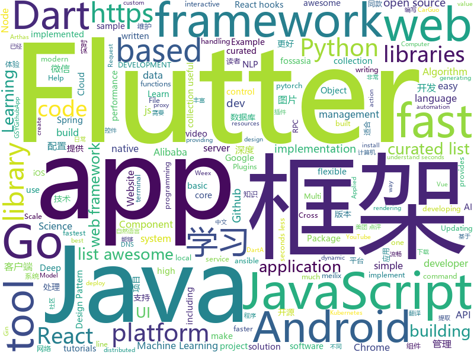

# 2018-11-03
See what the GitHub community is most excited about today.

## python
* [bert](https://github.com/google-research/bert)(**1,141 stars today**): TensorFlow code and pre-trained models for BERT
* [DeepCreamPy](https://github.com/deeppomf/DeepCreamPy)(**696 stars today**): Decensoring Hentai with Deep Neural Networks
* [Horizon](https://github.com/facebookresearch/Horizon)(**292 stars today**): A platform for Applied Reinforcement Learning (Applied RL)
* [adanet](https://github.com/tensorflow/adanet)(**231 stars today**): Fast and flexible AutoML with learning guarantees.
* [PocketFlow](https://github.com/Tencent/PocketFlow)(**212 stars today**): An Automatic Model Compression (AutoMC) framework for developing smaller and faster AI applications.
* [TensorFlow-Course](https://github.com/open-source-for-science/TensorFlow-Course)(**138 stars today**): Simple and ready-to-use tutorials for TensorFlow
* [YouMayNotNeedAttention](https://github.com/ofirpress/YouMayNotNeedAttention)(**114 stars today**): 
* [Python](https://github.com/TheAlgorithms/Python)(**96 stars today**): All Algorithms implemented in Python
* [models](https://github.com/tensorflow/models)(**63 stars today**): Models and examples built with TensorFlow
* [BERT-pytorch](https://github.com/codertimo/BERT-pytorch)(**69 stars today**): Google AI 2018 BERT pytorch implementation
* [maskrcnn-benchmark](https://github.com/facebookresearch/maskrcnn-benchmark)(**64 stars today**): Fast, modular reference implementation of Instance Segmentation and Object Detection algorithms in PyTorch.
* [system-design-primer](https://github.com/donnemartin/system-design-primer)(**48 stars today**): Learn how to design large-scale systems. Prep for the system design interview. Includes Anki flashcards.
* [Algorithm_Interview_Notes-Chinese](https://github.com/imhuay/Algorithm_Interview_Notes-Chinese)(**43 stars today**): 2018/2019/校招/春招/秋招/算法/机器学习(Machine Learning)/深度学习(Deep Learning)/自然语言处理(NLP)/C/C++/Python/面试笔记
* [random-network-distillation](https://github.com/openai/random-network-distillation)(**46 stars today**): 
* [awesome-python](https://github.com/vinta/awesome-python)(**38 stars today**): A curated list of awesome Python frameworks, libraries, software and resources
* [youtube-dl](https://github.com/rg3/youtube-dl)(**39 stars today**): Command-line program to download videos from YouTube.com and other video sites
* [Some-PoC-oR-ExP](https://github.com/coffeehb/Some-PoC-oR-ExP)(**35 stars today**): 各种漏洞poc、Exp的收集或编写
* [keras](https://github.com/keras-team/keras)(**34 stars today**): Deep Learning for humans
* [ansible](https://github.com/ansible/ansible)(**30 stars today**): Ansible is a radically simple IT automation platform that makes your applications and systems easier to deploy. Avoid writing scripts or custom code to deploy and update your applications — automate in a language that approaches plain English, using SSH, with no agents to install on remote systems. https://docs.ansible.com/ansible/
* [awesome-machine-learning](https://github.com/josephmisiti/awesome-machine-learning)(**31 stars today**): A curated list of awesome Machine Learning frameworks, libraries and software.
* [pandas](https://github.com/pandas-dev/pandas)(**32 stars today**): Flexible and powerful data analysis / manipulation library for Python, providing labeled data structures similar to R data.frame objects, statistical functions, and much more
* [scikit-learn](https://github.com/scikit-learn/scikit-learn)(**26 stars today**): scikit-learn: machine learning in Python
* [home-assistant](https://github.com/home-assistant/home-assistant)(**28 stars today**): 🏡Open source home automation that puts local control and privacy first
* [django](https://github.com/django/django)(**27 stars today**): The Web framework for perfectionists with deadlines.
* [requests](https://github.com/requests/requests)(**29 stars today**): Python HTTP Requests for Humans™✨🍰✨

## java
* [arthas](https://github.com/alibaba/arthas)(**173 stars today**): Alibaba Java Diagnostic Tool Arthas/Alibaba Java诊断利器Arthas
* [JavaGuide](https://github.com/Snailclimb/JavaGuide)(**121 stars today**): 【Java学习+面试指南】 一份涵盖大部分Java程序员所需要掌握的核心知识。
* [spring-cloud-alibaba](https://github.com/spring-cloud-incubator/spring-cloud-alibaba)(**113 stars today**): Spring Cloud Alibaba provides a one-stop solution for application development for the distributed solutions of Alibaba middleware.
* [Sentinel](https://github.com/alibaba/Sentinel)(**70 stars today**): A lightweight flow-control library providing high-available protection and monitoring (高可用防护的流量管理框架)
* [proxyee-down](https://github.com/proxyee-down-org/proxyee-down)(**61 stars today**): http下载工具，基于http代理，支持多连接分块下载
* [symphony](https://github.com/b3log/symphony)(**58 stars today**): 🎶一款用 Java 实现的现代化社区（论坛/BBS/社交网络/博客）平台。https://hacpai.com
* [nacos](https://github.com/alibaba/nacos)(**60 stars today**): an easy-to-use dynamic service discovery, configuration and service management platform for building cloud native applications
* [MultiActionSwipeHelper](https://github.com/bufferapp/MultiActionSwipeHelper)(**61 stars today**): An Android RecyclerView Swipe Helper for handling multiple actions per direction
* [open-liberty](https://github.com/OpenLiberty/open-liberty)(**54 stars today**): Open Liberty is a highly composable, fast to start, dynamic application server runtime environment
* [SmartYouTubeTV](https://github.com/yuliskov/SmartYouTubeTV)(**54 stars today**): View YouTube videos on your TV and set-top box with comfort.
* [java-design-patterns](https://github.com/iluwatar/java-design-patterns)(**44 stars today**): Design patterns implemented in Java
* [spring-boot](https://github.com/spring-projects/spring-boot)(**37 stars today**): Spring Boot
* [JCSprout](https://github.com/crossoverJie/JCSprout)(**37 stars today**): 👨‍🎓Java Core Sprout : basic, concurrent, algorithm
* [AndroidAutoSize](https://github.com/JessYanCoding/AndroidAutoSize)(**38 stars today**): 🔥A low-cost Android screen adaptation solution (今日头条屏幕适配方案终极版，一个极低成本的 Android 屏幕适配方案).
* [tutorials](https://github.com/eugenp/tutorials)(**24 stars today**): The "REST With Spring" Course:
* [AndroidUtilCode](https://github.com/Blankj/AndroidUtilCode)(**35 stars today**): 🔥Android developers should collect the following utils(updating).
* [HanLP](https://github.com/hankcs/HanLP)(**34 stars today**): 自然语言处理 中文分词 词性标注 命名实体识别 依存句法分析 关键词提取 新词发现 短语提取 自动摘要 文本分类 拼音简繁
* [Java](https://github.com/TheAlgorithms/Java)(**28 stars today**): All Algorithms implemented in Java
* [weixin-java-tools](https://github.com/Wechat-Group/weixin-java-tools)(**27 stars today**): 全能微信Java开发工具包，支持包括微信支付、开放平台、小程序、企业微信/企业号和公众号等的开发
* [SpringCloudLearning](https://github.com/forezp/SpringCloudLearning)(**29 stars today**): 《史上最简单的Spring Cloud教程源码》
* [elasticsearch](https://github.com/elastic/elasticsearch)(**27 stars today**): Open Source, Distributed, RESTful Search Engine
* [spring-framework](https://github.com/spring-projects/spring-framework)(**23 stars today**): Spring Framework
* [apollo](https://github.com/ctripcorp/apollo)(**23 stars today**): Apollo（阿波罗）是携程框架部门研发的分布式配置中心，能够集中化管理应用不同环境、不同集群的配置，配置修改后能够实时推送到应用端，并且具备规范的权限、流程治理等特性，适用于微服务配置管理场景。
* [incubator-dubbo](https://github.com/apache/incubator-dubbo)(**22 stars today**): Apache Dubbo (incubating) is a high-performance, java based, open source RPC framework.
* [guava](https://github.com/google/guava)(**24 stars today**): Google core libraries for Java

## unknown
* [DeepLearning-500-questions](https://github.com/scutan90/DeepLearning-500-questions)(**534 stars today**): 深度学习500问，以问答形式对常用的概率知识、线性代数、机器学习、深度学习、计算机视觉等热点问题进行阐述，以帮助自己及有需要的读者。 全书分为15个章节，近20万字。由于水平有限，书中不妥之处恳请广大读者批评指正。 未完待续............ 如有意合作，联系scutjy2015@163.com 版权所有，违权必究 Tan 2018.06
* [A-to-Z-Resources-for-Students](https://github.com/dipakkr/A-to-Z-Resources-for-Students)(**174 stars today**): Curated list of resources for college students Show your❤️by giving a⭐️
* [Front-End-FAQ](https://github.com/emmawedekind/Front-End-FAQ)(**119 stars today**): A place to anonymously ask questions and receive answers from the dev community
* [Learn_Data_Science_in_3_Months](https://github.com/llSourcell/Learn_Data_Science_in_3_Months)(**100 stars today**): This is the Curriculum for "Learn Data Science in 3 Months" By Siraj Raval on Youtube
* [git-flight-rules](https://github.com/k88hudson/git-flight-rules)(**87 stars today**): Flight rules for git
* [CS-Notes](https://github.com/CyC2018/CS-Notes)(**67 stars today**): 📚Computer Science Learning Notes
* [developer-roadmap](https://github.com/kamranahmedse/developer-roadmap)(**72 stars today**): Roadmap to becoming a web developer in 2018
* [gitignore](https://github.com/github/gitignore)(**54 stars today**): A collection of useful .gitignore templates
* [You-Dont-Know-JS](https://github.com/getify/You-Dont-Know-JS)(**67 stars today**): A book series on JavaScript. @YDKJS on twitter.
* [awesome](https://github.com/sindresorhus/awesome)(**53 stars today**): 😎Curated list of awesome lists
* [ghost-lang](https://github.com/jamiebuilds/ghost-lang)(**58 stars today**): 👻A friendly little language for you and me.
* [awesome-react-hooks](https://github.com/rehooks/awesome-react-hooks)(**55 stars today**): Awesome React Hooks
* [weekly](https://github.com/ruanyf/weekly)(**53 stars today**): 技术分享周刊，每周五发布
* [free-programming-books](https://github.com/EbookFoundation/free-programming-books)(**39 stars today**): 📚Freely available programming books
* [coding-interview-university](https://github.com/jwasham/coding-interview-university)(**39 stars today**): A complete computer science study plan to become a software engineer.
* [awesome-nodejs-security](https://github.com/lirantal/awesome-nodejs-security)(**45 stars today**): Awesome Node.js Security resources
* [awesome-vue](https://github.com/vuejs/awesome-vue)(**40 stars today**): 🎉A curated list of awesome things related to Vue.js
* [Powerful-Plugins](https://github.com/Hack-with-Github/Powerful-Plugins)(**38 stars today**): Powerful plugins and add-ons for hackers
* [awesome-lite-websites](https://github.com/mdibaiee/awesome-lite-websites)(**44 stars today**): A list of awesome lite websites without all the bloat
* [first-contributions](https://github.com/firstcontributions/first-contributions)(**25 stars today**): 🚀✨Help beginners to contribute to open source projects
* [M2Det](https://github.com/qijiezhao/M2Det)(**34 stars today**): M2Det: A Single-Shot Multi-Scale Multi-Level Network for Object Detection
* [project-based-learning](https://github.com/tuvtran/project-based-learning)(**31 stars today**): Curated list of project-based tutorials
* [gold-miner](https://github.com/xitu/gold-miner)(**32 stars today**): 🥇掘金翻译计划，可能是世界最大最好的英译中技术社区，最懂读者和译者的翻译平台：
* [AOSF](https://github.com/Ericsongyl/AOSF)(**30 stars today**): AOSF：全称为Android Open Source Framework，即Android优秀开源框架汇总。包含：网络请求okhttp，图片下载glide，数据库greenDAO，链式框架RxJava，组件路由ARouter，消息传递通信EventBus，热更新Tinker，插件化框架Replugin，文件下载FileDownloaer，图片选择PhotoPicker，图片滤镜/毛玻璃等特效处理，GIF图片展示控件，图片九宫格控件NineGridView，对话框Dialog，导航指示器ViewpagerIndicator，进度条ProgressWheel，下拉刷新SmartRefreshLayout，key-value高效数据存储MMKV等，应有尽有。
* [android-architecture](https://github.com/googlesamples/android-architecture)(**25 stars today**): A collection of samples to discuss and showcase different architectural tools and patterns for Android apps.

## javascript
* [carlo](https://github.com/GoogleChromeLabs/carlo)(**1,565 stars today**): Web rendering surface for Node applications
* [howler.js](https://github.com/goldfire/howler.js)(**366 stars today**): Javascript audio library for the modern web.
* [cat](https://github.com/dianping/cat)(**244 stars today**): CAT 作为服务端项目基础组件，提供了 Java, C/C++, Node.js, Python, Go 等多语言客户端，已经在美团点评的基础架构中间件框架（MVC框架，RPC框架，数据库框架，缓存框架等，消息队列，配置系统等）深度集成，为美团点评各业务线提供系统丰富的性能指标、健康状况、实时告警等。
* [ervy](https://github.com/chunqiuyiyu/ervy)(**252 stars today**): Bring charts to terminal.
* [pennywise](https://github.com/kamranahmedse/pennywise)(**216 stars today**): Cross-platform application to open anything in a floating window
* [33-js-concepts](https://github.com/leonardomso/33-js-concepts)(**205 stars today**): 📜33 concepts every JavaScript developer should know.
* [glorious-demo](https://github.com/glorious-codes/glorious-demo)(**183 stars today**): The easiest way to demonstrate your code in action.
* [33-js-concepts](https://github.com/stephentian/33-js-concepts)(**129 stars today**): 📜每个 JavaScript 工程师都应懂的33个概念 @leonardomso
* [vue](https://github.com/vuejs/vue)(**105 stars today**): 🖖A progressive, incrementally-adoptable JavaScript framework for building UI on the web.
* [react](https://github.com/facebook/react)(**85 stars today**): A declarative, efficient, and flexible JavaScript library for building user interfaces.
* [30-seconds-of-code](https://github.com/30-seconds/30-seconds-of-code)(**89 stars today**): Curated collection of useful JavaScript snippets that you can understand in 30 seconds or less.
* [hooks.guide](https://github.com/Raathigesh/hooks.guide)(**71 stars today**): Collection of React hooks curated by the community
* [free-programming-books-zh_CN](https://github.com/justjavac/free-programming-books-zh_CN)(**66 stars today**): 📚免费的计算机编程类中文书籍，欢迎投稿
* [fastest-validator](https://github.com/icebob/fastest-validator)(**69 stars today**): ⚡️The fastest JS validator library for NodeJS
* [westore](https://github.com/Tencent/westore)(**66 stars today**): 微信小程序解决方案 - 1KB javascript 覆盖状态管理、跨页通讯、插件开发和云数据库开发
* [v8.js.cn](https://github.com/justjavac/v8.js.cn)(**68 stars today**): V8 官方网站中文翻译
* [create-react-app](https://github.com/facebook/create-react-app)(**52 stars today**): Set up a modern web app by running one command.
* [storybook](https://github.com/storybooks/storybook)(**61 stars today**): Interactive UI component dev & test: React, React Native, Vue, Angular, Ember
* [puppeteer](https://github.com/GoogleChrome/puppeteer)(**63 stars today**): Headless Chrome Node API
* [dinero.js](https://github.com/sarahdayan/dinero.js)(**62 stars today**): 💸An immutable library to create, calculate and format money.
* [react-native](https://github.com/facebook/react-native)(**49 stars today**): A framework for building native apps with React.
* [javascript](https://github.com/airbnb/javascript)(**56 stars today**): JavaScript Style Guide
* [the-platform](https://github.com/palmerhq/the-platform)(**54 stars today**): Web. Components.😂
* [omi](https://github.com/Tencent/omi)(**52 stars today**): Next generation web framework in 4kb JavaScript (Web Components + JSX + Proxy + Store + Path Updating)
* [react-juejin](https://github.com/Kim09AI/react-juejin)(**46 stars today**): https://react-juejin.foreversnsd.cn

## html
* [async-javascript-cheatsheet](https://github.com/frontarm/async-javascript-cheatsheet)(**41 stars today**): Cheatsheet for promises and async/await
* [BFuzz](https://github.com/RootUp/BFuzz)(**31 stars today**): Fuzzing Browsers
* [AdminLTE](https://github.com/almasaeed2010/AdminLTE)(**20 stars today**): AdminLTE - Free Premium Admin control Panel Theme Based On Bootstrap 3.x
* [vue-hooks](https://github.com/yyx990803/vue-hooks)(**22 stars today**): Experimental React hooks implementation in Vue
* [30-seconds-of-css](https://github.com/30-seconds/30-seconds-of-css)(**21 stars today**): A curated collection of useful CSS snippets you can understand in 30 seconds or less.
* [JavaScript30](https://github.com/wesbos/JavaScript30)(**15 stars today**): 30 Day Vanilla JS Challenge
* [solving-sol](https://github.com/wholepixel/solving-sol)(**19 stars today**): Implement Sol LeWitt's instructions in JavaScript.
* [solid](https://github.com/solid/solid)(**18 stars today**): Solid - Re-decentralizing the web (project directory)
* [gci18.fossasia.org](https://github.com/fossasia/gci18.fossasia.org)(**16 stars today**): FOSSASIA Google Code-In Website 2018 https://gci18.fossasia.org
* [portainer](https://github.com/portainer/portainer)(**16 stars today**): Simple management UI for Docker
* [fastText](https://github.com/facebookresearch/fastText)(**15 stars today**): Library for fast text representation and classification.
* [gshark](https://github.com/neal1991/gshark)(**15 stars today**): Scan for sensitive information in Github easily and effectively.
* [pslab.io](https://github.com/fossasia/pslab.io)(**14 stars today**): Pocket Science Lab Website http://pslab.io
* [meilix-generator](https://github.com/fossasia/meilix-generator)(**14 stars today**): WebApp for generating a custom ISO image based on Meilix http://meilix.org
* [2019.fossasia.org](https://github.com/fossasia/2019.fossasia.org)(**14 stars today**): FOSSASIA Summit 2019 https://2019.fossasia.org
* [NLP-progress](https://github.com/sebastianruder/NLP-progress)(**12 stars today**): Repository to track the progress in Natural Language Processing (NLP), including the datasets and the current state-of-the-art for the most common NLP tasks.
* [Spoon-Knife](https://github.com/octocat/Spoon-Knife)(****): This repo is for demonstration purposes only.
* [core](https://github.com/stackblitz/core)(**11 stars today**): Online IDE powered by Visual Studio Code⚡️
* [mastering-modular-javascript](https://github.com/mjavascript/mastering-modular-javascript)(**11 stars today**): 📦Module thinking, principles, design patterns and best practices.
* [baselines](https://github.com/openai/baselines)(**9 stars today**): OpenAI Baselines: high-quality implementations of reinforcement learning algorithms
* [YouMightNotNeedJS](https://github.com/una/YouMightNotNeedJS)(**10 stars today**): 
* [ml-workshop-1-of-4](https://github.com/amueller/ml-workshop-1-of-4)(**8 stars today**): Introduction to Machine learning with Python, 4h interactive workshop
* [electron-api-demos](https://github.com/electron/electron-api-demos)(**9 stars today**): Explore the Electron APIs
* [react-redux](https://github.com/reduxjs/react-redux)(**9 stars today**): Official React bindings for Redux
* [ai-deadlines](https://github.com/abhshkdz/ai-deadlines)(**8 stars today**): ⏰AI conference deadline countdowns

## dart
* [flutter](https://github.com/flutter/flutter)(**78 stars today**): Flutter makes it easy and fast to build beautiful mobile apps.
* [awesome-flutter](https://github.com/Solido/awesome-flutter)(**30 stars today**): An awesome list that curates the best Flutter libraries, tools, tutorials, articles and more.
* [plugins](https://github.com/flutter/plugins)(**7 stars today**): Plugins for Flutter, including FlutterFire, maintained by the Flutter team
* [Flutter-Notebook](https://github.com/OpenFlutter/Flutter-Notebook)(**9 stars today**): 日更的FlutterDemo合集，今天你fu了吗
* [flutter_architecture_samples](https://github.com/brianegan/flutter_architecture_samples)(**6 stars today**): TodoMVC for Flutter
* [xamarin.flutter](https://github.com/adamped/xamarin.flutter)(**6 stars today**): Running Flutter on Xamarin
* [Flutter-UI-Kit](https://github.com/iampawan/Flutter-UI-Kit)(**6 stars today**): Flutter app for collection of UI in a UIKit
* [bloc](https://github.com/felangel/bloc)(**6 stars today**): The goal of this package is to make it easy to implement the BLoC Design Pattern (Business Logic Component).
* [site-www](https://github.com/dart-lang/site-www)(****): Source for Dart website
* [built_value.dart](https://github.com/google/built_value.dart)(****): Immutable value types, enum classes, and serialization.
* [chromedeveditor](https://github.com/googlearchive/chromedeveditor)(****): Chrome Dev Editor is a developer tool for building apps on the Chrome platform - Chrome Apps and Web Apps, in JavaScript or Dart. (NO LONGER IN ACTIVE DEVELOPMENT)
* [sdk](https://github.com/dart-lang/sdk)(****): The Dart SDK, including the VM, dart2js, core libraries, and more.
* [GSYGithubAppFlutter](https://github.com/CarGuo/GSYGithubAppFlutter)(****): 超完整的Flutter项目，功能丰富，适合学习和日常使用。GSYGithubApp系列的优势：我们目前已经拥有Flutter、Weex、ReactNative三个版本。 功能齐全，项目框架内技术涉及面广，完成度高，持续维护，配套文章，适合全面学习，跨框架对比参考。跨平台的开源Github客户端App，更好的体验，更丰富的功能，旨在更好的日常管理和维护个人Github，提供更好更方便的驾车体验～～Σ(￣。￣ﾉ)ﾉ。同款Weex版本 ： https://github.com/CarGuo/GSYGithubAppWeex 、同款React Native版本 ： https://github.com/CarGuo/GSYGithubApp
* [FlutterExampleApps](https://github.com/iampawan/FlutterExampleApps)(****): [Example APPS] Basic Flutter apps, for flutter devs.
* [flutter-osc](https://github.com/yubo725/flutter-osc)(****): 基于Google Flutter的开源中国客户端，支持Android和iOS。
* [flutter-examples](https://github.com/nisrulz/flutter-examples)(****): [Examples] Simple basic isolated apps, for budding flutter devs.
* [Flutter-learning](https://github.com/AweiLoveAndroid/Flutter-learning)(****): 🔥👍🌟⭐️⭐️⭐️Flutter install&settings,Flutter problems when developing,Flutter sample codes& templates,Flutter projects,Dart languages sample codes
* [inKino](https://github.com/roughike/inKino)(****): inKino - A cross platform movie and showtime browser for Finnkino cinemas, made with Flutter.
* [dio](https://github.com/flutterchina/dio)(****): A powerful Http client for Dart, which supports Interceptors, FormData, Request Cancellation, File Downloading, Timeout etc.
* [hauberk](https://github.com/munificent/hauberk)(****): A web-based roguelike written in Dart.
* [zhihu-flutter](https://github.com/HackSoul/zhihu-flutter)(****): Flutter 高仿知乎 UI，非常漂亮，也非常流畅，flutter build apk 或 flutter build ios 之后更流畅
* [angular](https://github.com/dart-lang/angular)(****): Fast and productive web framework provided by Dart
* [StageXL](https://github.com/bp74/StageXL)(****): A fast and universal 2D rendering engine for HTML5 and Dart.
* [dart-sass](https://github.com/sass/dart-sass)(****): A Dart implementation of Sass.
* [rxdart](https://github.com/ReactiveX/rxdart)(****): The Reactive Extensions for Dart

## go
* [dive](https://github.com/wagoodman/dive)(**220 stars today**): A tool for exploring each layer in a docker image
* [go-mysql-server](https://github.com/src-d/go-mysql-server)(**106 stars today**): An extensible MySQL server implementation in Go.
* [errorx](https://github.com/joomcode/errorx)(**102 stars today**): A comprehensive error handling library for Go
* [goboy](https://github.com/Humpheh/goboy)(**95 stars today**): Multi-platform Nintendo Game Boy Color emulator written in go
* [AdGuardHome](https://github.com/AdguardTeam/AdGuardHome)(**68 stars today**): Network-wide ads & trackers blocking DNS server
* [krakend](https://github.com/devopsfaith/krakend)(**66 stars today**): Ultra performant API Gateway with middlewares
* [kubernetes](https://github.com/kubernetes/kubernetes)(**52 stars today**): Production-Grade Container Scheduling and Management
* [sdns](https://github.com/semihalev/sdns)(**52 stars today**): Lightweight, fast recursive dns server with dnssec support
* [go](https://github.com/golang/go)(**45 stars today**): The Go programming language
* [frp](https://github.com/fatedier/frp)(**45 stars today**): A fast reverse proxy to help you expose a local server behind a NAT or firewall to the internet.
* [up](https://github.com/akavel/up)(**47 stars today**): Ultimate Plumber is a tool for writing Linux pipes with instant live preview
* [soar](https://github.com/XiaoMi/soar)(**44 stars today**): SQL Optimizer And Rewriter
* [orchestrator](https://github.com/github/orchestrator)(**42 stars today**): MySQL replication topology management and HA
* [awesome-go](https://github.com/avelino/awesome-go)(**42 stars today**): A curated list of awesome Go frameworks, libraries and software
* [gravity](https://github.com/gravitational/gravity)(**39 stars today**): Opinionated snapshot-based Kubernetes packaging and management tools.
* [BaiduPCS-Go](https://github.com/iikira/BaiduPCS-Go)(**38 stars today**): 百度网盘客户端 - Go语言编写
* [go-write](https://github.com/google/go-write)(**38 stars today**): Package write provides a way to atomically create or replace a file or symbolic link.
* [php2go](https://github.com/syyongx/php2go)(**37 stars today**): Use Golang to implement PHP's common built-in functions.
* [gin](https://github.com/gin-gonic/gin)(**36 stars today**): Gin is a HTTP web framework written in Go (Golang). It features a Martini-like API with much better performance -- up to 40 times faster. If you need smashing performance, get yourself some Gin.
* [helm](https://github.com/helm/helm)(**27 stars today**): The Kubernetes Package Manager
* [gorouter](https://github.com/xujiajun/gorouter)(**32 stars today**): xujiajun/gorouter is a simple and fast HTTP router for Go. It is easy to build RESTful APIs and your web framework.
* [acl](https://github.com/MrBoolean/acl)(**33 stars today**): a lightweight acl manager for go.
* [gowrap](https://github.com/hexdigest/gowrap)(**31 stars today**): GoWrap is a command line tool for generating decorators for Go interfaces
* [gotop](https://github.com/cjbassi/gotop)(**30 stars today**): A terminal based graphical activity monitor inspired by gtop and vtop
* [hugo](https://github.com/gohugoio/hugo)(**27 stars today**): The world’s fastest framework for building websites.

## WordCloud

